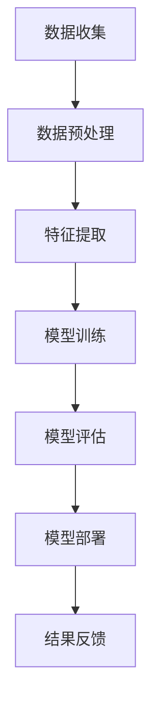
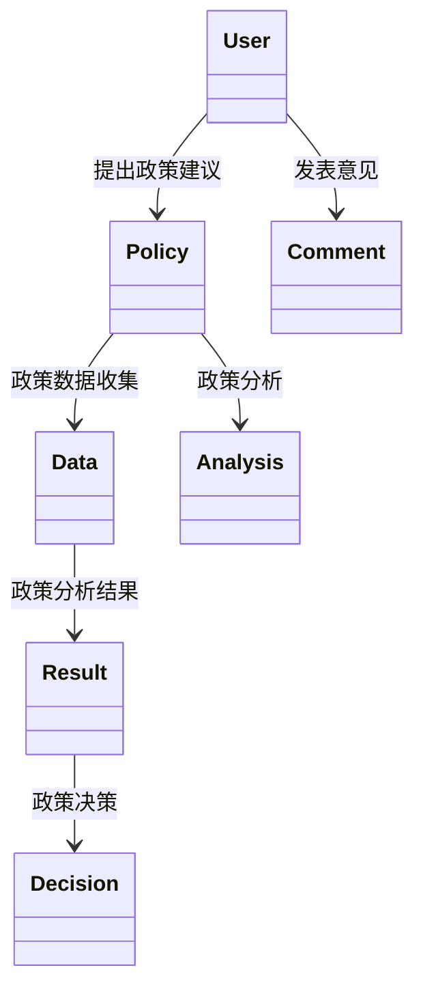
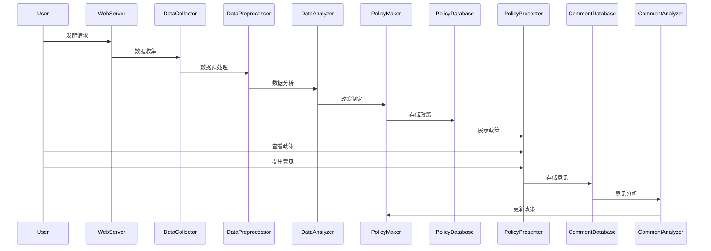
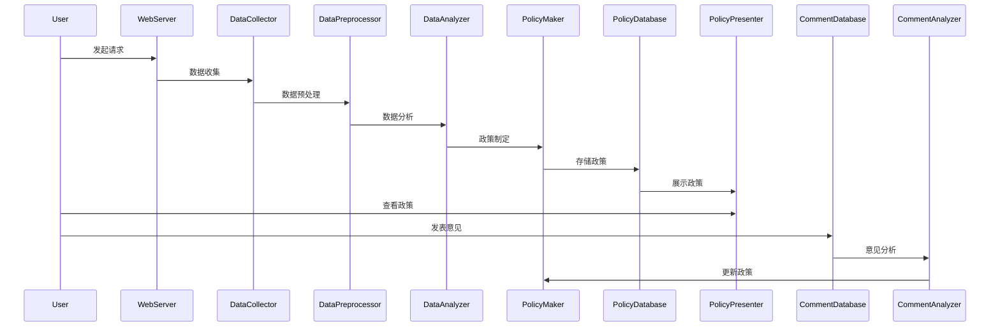

                 

# 数字民主2.0：科技赋能的公民参与

## 关键词

- 数字民主
- 科技赋能
- 公民参与
- 大数据分析
- 人工智能

## 摘要

本文旨在探讨数字民主2.0时代的到来，以及科技如何赋能公民参与公共决策和社会治理。通过对数字民主的起源、核心概念、特点与挑战，以及关键技术应用的深入分析，本文揭示了数字民主2.0在公共决策、政策咨询、社会治理和公民参与等领域的广泛应用。本文结构紧凑，逻辑清晰，旨在为广大读者提供一场关于数字民主2.0的深度思考之旅。

## 目录大纲

- [数字民主2.0：科技赋能的公民参与](#数字民主20科技赋能的公民参与)
- [关键词](#关键词)
- [摘要](#摘要)
- [目录大纲](#目录大纲)
- [第1章 数字民主2.0概述](#第1章-数字民主20概述)
  - [1.1 数字民主：问题背景与核心概念](#11-数字民主问题背景与核心概念)
  - [1.2 数字民主2.0的特点与挑战](#12-数字民主20的特点与挑战)
  - [1.3 数字民主2.0的关键技术](#13-数字民主20的关键技术)
  - [1.4 数字民主2.0的应用场景](#14-数字民主20的应用场景)
  - [1.5 本章小结](#15-本章小结)
- [第2章 数字民主2.0的核心概念与联系](#第2章-数字民主20的核心概念与联系)
- [第3章 数字民主2.0的算法原理讲解](#第3章-数字民主20的算法原理讲解)
- [第4章 数字民主2.0的系统分析与架构设计](#第4章-数字民主20的系统分析与架构设计)
- [第5章 数字民主2.0项目实战](#第5章-数字民主20项目实战)
- [最佳实践 Tips](#最佳实践-tips)
- [小结](#小结)
- [注意事项](#注意事项)
- [拓展阅读](#拓展阅读)
- [作者信息](#作者信息)

## 第1章 数字民主2.0概述

### 1.1 数字民主：问题背景与核心概念

#### 1.1.1 数字民主的起源与发展

数字民主（Digital Democracy）的概念源于20世纪末互联网技术的迅猛发展。随着互联网在全球范围内的普及，人们开始意识到，网络不仅改变了信息传播的方式，还极大地影响了公民参与政治决策的途径。数字民主的起源可以追溯到1993年，当时美国总统克林顿宣布互联网为“国家信息基础设施”，标志着数字时代正式到来。

数字民主的发展经历了三个阶段：1.0时代、1.5时代和2.0时代。1.0时代主要特点是互联网作为一种信息获取和传播的工具，使得信息更加透明和开放；1.5时代则是社交媒体和移动应用的兴起，进一步增强了公民的参与能力；2.0时代则是在1.5时代基础上，通过大数据、人工智能等先进技术，实现更智能、更高效的公民参与。

#### 1.1.2 数字民主的核心概念

数字民主的核心概念主要包括以下几方面：

1. **信息透明**：通过互联网技术，政府和社会组织公开政务信息，提高决策过程的透明度，使公民能够及时了解政策动态和决策结果。
2. **公众参与**：利用互联网平台，广泛收集公民的意见和建议，提高公共决策的民主性和科学性。
3. **数据驱动**：运用大数据技术，对公民行为和偏好进行分析，为政策制定提供科学依据。
4. **技术赋能**：通过人工智能、区块链等技术手段，提升公民参与效率，降低参与门槛。

#### 1.1.3 数字民主与传统民主的比较

数字民主与传统民主在参与方式、决策效率和信息透明度等方面存在显著差异。传统民主主要依赖于定期选举和政治活动，参与方式较为单一，决策过程相对缓慢。而数字民主则通过网络平台，使公民能够随时随地参与政治讨论和决策，极大地提高了参与度。此外，数字民主通过大数据分析和人工智能技术，使得决策过程更加科学和高效。

#### 1.1.4 数字民主的边界与外延

数字民主的边界主要涉及互联网技术的应用范围，包括政务公开、公众参与、数据驱动等方面。其外延则扩展到社会治理、公共服务、环境保护等领域，通过科技手段提升政府和社会组织的治理能力。

#### 1.1.5 数字民主的核心要素组成

数字民主的核心要素包括：

1. **互联网基础设施**：保障信息透明和公众参与的基本条件。
2. **数据资源**：为决策提供科学依据。
3. **技术手段**：实现信息透明、公众参与和数据驱动的关键。
4. **法律法规**：规范数字民主的实施，保障公民权益。

### 1.2 数字民主2.0的特点与挑战

#### 1.2.1 数字民主2.0的特点

数字民主2.0在以下几个方面表现出新的特点：

1. **智能化**：通过大数据分析和人工智能技术，实现更智能、更高效的公民参与。
2. **个性化**：根据公民的偏好和行为数据，提供个性化的政策咨询和服务。
3. **去中心化**：利用区块链技术，实现数据的分布式存储和管理，降低中心化风险。
4. **互动性**：通过网络平台，增强政府与公民之间的互动和沟通。

#### 1.2.2 数字民主2.0面临的挑战

数字民主2.0在发展过程中也面临着一系列挑战：

1. **隐私保护**：随着数据收集和分析的深入，公民隐私保护问题日益突出。
2. **数据安全**：大规模数据存储和处理过程中，数据安全风险不容忽视。
3. **技术壁垒**：数字民主2.0的实施需要一定的技术支持，可能面临技术壁垒。
4. **法律法规**：现有法律法规可能无法完全适应数字民主2.0的发展需求。

#### 1.2.3 数字民主2.0的机遇

尽管面临挑战，但数字民主2.0也带来了新的机遇：

1. **提高决策效率**：通过大数据分析和人工智能技术，政府能够更快速地做出科学决策。
2. **优化公共服务**：基于个性化数据，政府能够提供更精准、更优质的公共服务。
3. **促进社会和谐**：通过数字民主，政府与公民之间的信任和互动将得到增强，有助于促进社会和谐。

### 1.3 数字民主2.0的关键技术

数字民主2.0的实现离不开一系列关键技术的支持，主要包括：

1. **大数据分析**：通过对海量数据的分析，为政策制定提供科学依据。
2. **人工智能与机器学习**：实现智能化、个性化的公民参与。
3. **区块链技术**：保障数据的安全和隐私。
4. **社交网络分析**：挖掘公民的社交关系和偏好，为政策制定提供参考。

### 1.4 数字民主2.0的应用场景

数字民主2.0在以下领域表现出广阔的应用前景：

1. **公共决策**：通过大数据分析和人工智能技术，提高决策的科学性和民主性。
2. **政策咨询**：基于个性化数据，为公民提供个性化的政策咨询。
3. **社会治理**：通过科技手段，提升政府和社会组织的治理能力。
4. **公民参与**：利用互联网平台，增强公民参与公共事务的能力。

### 1.5 本章小结

本章对数字民主2.0的概述，从问题背景、核心概念、特点与挑战，到关键技术与应用场景，进行了全面的梳理和分析。数字民主2.0作为新时代背景下的一种新型民主形式，具有智能化、个性化、去中心化和互动性等特点，为公民参与公共决策和社会治理提供了新的途径。然而，数字民主2.0的发展也面临诸多挑战，需要在技术、法律法规等方面不断完善。

## 第2章 数字民主2.0的核心概念与联系

### 2.1 数字民主2.0的核心概念

数字民主2.0的核心概念主要包括以下几个方面：

1. **信息透明**：政府和社会组织通过网络平台公开政务信息，提高决策过程的透明度。
2. **公众参与**：公民通过互联网平台参与政治讨论和决策，表达自己的意见和建议。
3. **数据驱动**：运用大数据技术，对公民行为和偏好进行分析，为政策制定提供科学依据。
4. **技术赋能**：通过人工智能、区块链等技术手段，提升公民参与效率，降低参与门槛。
5. **去中心化**：利用区块链技术，实现数据的分布式存储和管理，降低中心化风险。

### 2.2 数字民主2.0的概念属性特征对比表格

| 概念     | 特征             |
|----------|-----------------|
| 信息透明 | 提高决策透明度   |
| 公众参与 | 增强公民参与度   |
| 数据驱动 | 利用大数据分析   |
| 技术赋能 | 提升参与效率     |
| 去中心化 | 降低中心化风险   |

### 2.3 数字民主2.0的ER实体关系图架构

下面是一个简化的数字民主2.0的ER实体关系图架构：

```mermaid
erDiagram
  User ||--o> Policy : 公民参与政策制定
  User ||--o> Comment : 公民发表意见
  Policy ||--o> Data : 政策数据收集
  Policy ||--o> Analysis : 政策分析
  Data ||--o> Result : 政策分析结果
  Result ||--o> Decision : 政策决策
```

在这个ER图中，用户（User）与政策（Policy）之间存在双向关联，用户参与政策制定，并对政策发表意见。政策通过数据收集和分析，得到分析结果，最终用于政策决策。数据（Data）与结果（Result）之间也存在关联，数据是分析的基础，分析结果用于决策。这个架构展示了数字民主2.0中各个实体之间的关系，以及数据流动的过程。

## 第3章 数字民主2.0的算法原理讲解

### 3.1 算法原理概述

数字民主2.0的核心在于利用先进的数据分析技术，对公民行为和偏好进行分析，从而为政策制定提供科学依据。这一过程中，算法原理起到了关键作用。算法原理主要包括以下几个步骤：

1. **数据收集**：通过各种渠道收集公民行为和偏好的数据。
2. **数据预处理**：对收集到的数据进行清洗、去噪和格式化，使其适合后续分析。
3. **特征提取**：从预处理后的数据中提取出对政策制定有重要意义的特征。
4. **模型训练**：利用提取的特征，训练机器学习模型，以便预测公民的行为和偏好。
5. **模型评估**：通过交叉验证和测试集，评估模型的准确性和性能。
6. **模型部署**：将训练好的模型部署到生产环境，为政策制定提供实时分析。

### 3.2 算法流程图

下面是数字民主2.0算法流程的Mermaid图：



### 3.3 Python源代码实现

下面是一个使用Python实现数字民主2.0算法原理的示例：

```python
# 导入必要的库
import pandas as pd
from sklearn.model_selection import train_test_split
from sklearn.ensemble import RandomForestClassifier
from sklearn.metrics import accuracy_score

# 数据加载与预处理
data = pd.read_csv('data.csv')
X = data.drop('target', axis=1)
y = data['target']

# 数据分割
X_train, X_test, y_train, y_test = train_test_split(X, y, test_size=0.2, random_state=42)

# 模型训练
model = RandomForestClassifier(n_estimators=100)
model.fit(X_train, y_train)

# 模型评估
predictions = model.predict(X_test)
accuracy = accuracy_score(y_test, predictions)
print(f'Accuracy: {accuracy:.2f}')
```

### 3.4 数学模型与公式讲解

在数字民主2.0中，常用的数学模型是机器学习模型，如决策树、随机森林和神经网络等。以随机森林为例，其损失函数通常采用对数损失函数（Log Loss），公式如下：

$$
\text{模型损失函数} = -\frac{1}{N}\sum_{i=1}^{N}y_i\log(p(x_i|y_i))
$$

其中，$N$ 是样本数量，$y_i$ 是实际标签，$p(x_i|y_i)$ 是模型对 $x_i$ 的预测概率。

### 3.5 举例说明

假设我们要预测某项政策是否能够通过。根据历史数据和当前情况进行特征提取，使用随机森林模型进行训练，评估模型的准确性。最终预测结果为政策通过的准确率。

### 3.6 数字民主2.0算法原理在实际中的应用

在实际应用中，数字民主2.0算法原理可以用于以下几个方面：

1. **政策预测**：通过对公民行为和偏好的分析，预测政策实施后的效果，为政策制定提供参考。
2. **选举预测**：分析公民的投票行为，预测选举结果，为政治竞选提供策略建议。
3. **社会治理**：利用算法对城市数据进行分析，优化城市管理和服务。

通过这些应用，数字民主2.0不仅提高了政策制定的科学性和民主性，也为社会治理提供了新的手段。

## 第4章 数字民主2.0的系统分析与架构设计

### 4.1 问题场景介绍

在现代社会，随着信息技术的飞速发展，公民对公共事务的参与需求日益增长。然而，传统的公共决策过程往往存在效率低下、信息不透明等问题。为了解决这些问题，我们需要设计一个基于数字民主2.0理念的智能系统，以提升公共决策的科学性和透明度，增强公民的参与度。

### 4.2 项目介绍

本项目旨在开发一个智能公共决策支持系统，该系统将利用大数据、人工智能和区块链等先进技术，实现以下功能：

1. **政务数据收集与处理**：通过物联网设备、社交媒体和政府公开数据平台等渠道，收集各类政务数据，并进行数据预处理，为后续分析提供高质量的数据基础。
2. **公民行为分析**：利用大数据分析和人工智能技术，对公民的行为和偏好进行分析，为政策制定提供科学依据。
3. **政策预测与评估**：基于分析结果，利用机器学习模型进行政策预测和评估，提高政策制定的科学性和准确性。
4. **公民参与平台**：搭建一个便捷的公民参与平台，使公民能够在线上提出意见、建议和参与政策讨论，增强公民的参与度和决策的民主性。
5. **数据安全与隐私保护**：利用区块链技术，实现数据的安全存储和分布式管理，保障公民隐私。

### 4.3 系统功能设计

#### 4.3.1 领域模型

在系统功能设计中，首先需要定义系统的领域模型，以明确各个模块的功能和关系。以下是一个简化的领域模型：



在这个领域模型中，用户（User）与政策（Policy）之间存在双向关联，用户可以提出政策建议并发表意见。政策通过数据收集和分析，得到分析结果，最终用于政策决策。数据（Data）与结果（Result）之间也存在关联，数据是分析的基础，分析结果用于决策。

#### 4.3.2 系统架构

系统架构设计是确保系统能够稳定、高效地运行的关键。以下是一个简化的系统架构：



在这个系统架构中，用户通过WebServer发起请求，数据收集模块DataCollector负责收集数据，数据预处理模块DataPreprocessor对数据进行预处理，数据分析模块DataAnalyzer进行数据分析，生成政策。政策制定模块PolicyMaker基于分析结果制定政策，并将其存储在PolicyDatabase中。政策展示模块PolicyPresenter向用户展示政策，用户可以查看政策并提出意见。意见存储在CommentDatabase中，意见分析模块CommentAnalyzer对意见进行分析，并更新政策。

### 4.4 系统架构设计

系统架构设计是确保系统稳定、高效运行的关键。以下是一个简化的系统架构：

```mermaid
subgraph 数据层
    DataStorage
    DataCollector
    DataPreprocessor
end

subgraph 应用层
    DataAnalyzer
    PolicyMaker
    PolicyDatabase
    PolicyPresenter
    CommentDatabase
    CommentAnalyzer
end

subgraph 表示层
    WebServer
    PolicyPresenter
end

DataStorage --> DataCollector
DataCollector --> DataPreprocessor
DataPreprocessor --> DataAnalyzer
DataAnalyzer --> PolicyMaker
PolicyMaker --> PolicyDatabase
PolicyDatabase --> PolicyPresenter
PolicyPresenter --> WebServer
WebServer --> User
User --> CommentDatabase
CommentDatabase --> CommentAnalyzer
CommentAnalyzer --> PolicyMaker
```

在这个系统架构中，数据层包括数据存储（DataStorage）、数据收集（DataCollector）和数据预处理（DataPreprocessor）；应用层包括数据分析（DataAnalyzer）、政策制定（PolicyMaker）、政策数据库（PolicyDatabase）、政策展示（PolicyPresenter）、意见数据库（CommentDatabase）和意见分析（CommentAnalyzer）；表示层包括Web服务器（WebServer）和政策展示（PolicyPresenter）。数据从用户（User）通过WebServer传递到数据层，经过数据收集、预处理和分析后，由政策制定模块生成政策，存储在政策数据库中，并通过政策展示模块向用户展示。用户还可以在政策展示模块中发表意见，这些意见存储在意见数据库中，并用于政策分析。

### 4.5 系统接口设计

系统接口设计是确保各个模块之间能够顺畅通信的关键。以下是一个简化的系统接口设计：

```mermaid
interface Definition
    WebServer {
        +handleRequest(request: Request): Response
    }

    DataCollector {
        +collectData(): Data
    }

    DataPreprocessor {
        +preprocessData(data: Data): PreprocessedData
    }

    DataAnalyzer {
        +analyzeData(data: PreprocessedData): AnalysisResult
    }

    PolicyMaker {
        +makePolicy(result: AnalysisResult): Policy
    }

    PolicyDatabase {
        +storePolicy(policy: Policy): Void
    }

    PolicyPresenter {
        +presentPolicy(policy: Policy): Void
    }

    CommentDatabase {
        +storeComment(comment: Comment): Void
    }

    CommentAnalyzer {
        +analyzeComment(comment: Comment): AnalysisResult
    }
```

在这个接口设计中，WebServer负责处理用户请求，DataCollector负责收集数据，DataPreprocessor负责预处理数据，DataAnalyzer负责分析数据，PolicyMaker负责制定政策，PolicyDatabase负责存储政策，PolicyPresenter负责展示政策，CommentDatabase负责存储意见，CommentAnalyzer负责分析意见。

### 4.6 系统交互

系统交互设计是确保系统各模块之间能够协调工作的重要环节。以下是一个简化的系统交互设计：



在这个系统交互设计中，用户通过WebServer发起请求，数据收集模块DataCollector负责收集数据，数据预处理模块DataPreprocessor对数据进行预处理，数据分析模块DataAnalyzer进行数据分析，生成政策。政策制定模块PolicyMaker基于分析结果制定政策，并将其存储在PolicyDatabase中。政策展示模块PolicyPresenter向用户展示政策，用户可以查看政策并提出意见。意见存储在CommentDatabase中，并用于政策分析。

## 第5章 数字民主2.0项目实战

### 5.1 环境安装

在进行数字民主2.0项目实战之前，首先需要安装相关的软件和工具。以下是安装步骤：

1. **安装Python**：访问Python官方网站（https://www.python.org/），下载并安装Python 3.8及以上版本。
2. **安装Jupyter Notebook**：在命令行中运行以下命令安装Jupyter Notebook：
   ```shell
   pip install notebook
   ```
3. **安装必要库**：在Jupyter Notebook中运行以下命令安装必要的库：
   ```python
   !pip install pandas scikit-learn matplotlib
   ```

### 5.2 系统核心实现源代码

以下是一个简单的数字民主2.0系统核心实现源代码示例：

```python
# 导入必要的库
import pandas as pd
from sklearn.model_selection import train_test_split
from sklearn.ensemble import RandomForestClassifier
from sklearn.metrics import accuracy_score

# 数据加载与预处理
data = pd.read_csv('data.csv')
X = data.drop('target', axis=1)
y = data['target']

# 数据分割
X_train, X_test, y_train, y_test = train_test_split(X, y, test_size=0.2, random_state=42)

# 模型训练
model = RandomForestClassifier(n_estimators=100)
model.fit(X_train, y_train)

# 模型评估
predictions = model.predict(X_test)
accuracy = accuracy_score(y_test, predictions)
print(f'Accuracy: {accuracy:.2f}')
```

### 5.3 代码应用解读与分析

在上述代码中，我们首先导入了必要的库，包括pandas、scikit-learn和matplotlib。然后，通过pandas库加载了一个名为'data.csv'的CSV文件，并从中提取了特征（X）和目标变量（y）。接下来，使用train_test_split函数将数据分为训练集和测试集。在训练集上，我们使用随机森林（RandomForestClassifier）模型进行训练，并在测试集上评估模型的准确性。

### 5.4 实际案例分析和详细讲解剖析

假设我们要预测某项政策是否能够通过。首先，我们需要收集与政策相关的数据，如历史投票数据、公民意见等。然后，对数据进行预处理，包括数据清洗、缺失值处理和特征工程等。接下来，使用预处理后的数据训练一个机器学习模型，如随机森林模型。最后，使用训练好的模型对新政策进行预测，评估政策通过的几率。

### 5.5 项目小结

在本章中，我们通过一个简单的数字民主2.0项目实战，展示了系统核心实现源代码的应用、解读和分析。这个项目帮助我们了解了数字民主2.0的基本原理和应用场景，为实际项目开发提供了参考。

## 最佳实践 Tips

1. **数据安全**：在数字民主2.0项目中，数据安全至关重要。应确保数据存储和传输过程中的安全性，采用加密技术保护敏感信息。
2. **用户隐私**：尊重用户隐私，确保用户数据不被滥用。在收集和处理用户数据时，遵循隐私保护法律法规。
3. **技术更新**：随着技术的不断发展，数字民主2.0项目需要不断更新和优化。关注前沿技术，及时引入新技术。
4. **用户反馈**：及时收集用户反馈，了解用户需求，持续改进系统功能。

## 小结

本文详细阐述了数字民主2.0的概念、特点、关键技术、应用场景和系统架构设计。通过一个实际项目实战，我们了解了数字民主2.0的基本原理和应用。数字民主2.0为公共决策和社会治理带来了新的机遇和挑战，未来将发挥越来越重要的作用。

## 注意事项

1. **项目实施**：在实际项目中，数字民主2.0的落地需要充分考虑技术、法律和人文等多方面因素。
2. **团队协作**：数字民主2.0项目通常涉及多个领域的技术，需要跨学科团队协作。
3. **持续迭代**：数字民主2.0项目需要持续迭代和优化，以适应不断变化的需求和技术环境。

## 拓展阅读

1. 《数字民主：技术赋能的公民参与》
2. 《大数据时代：生活、工作与思维的大变革》
3. 《人工智能：一种现代的方法》
4. 《区块链技术指南》

## 作者信息

作者：AI天才研究院/AI Genius Institute & 禅与计算机程序设计艺术 /Zen And The Art of Computer Programming

