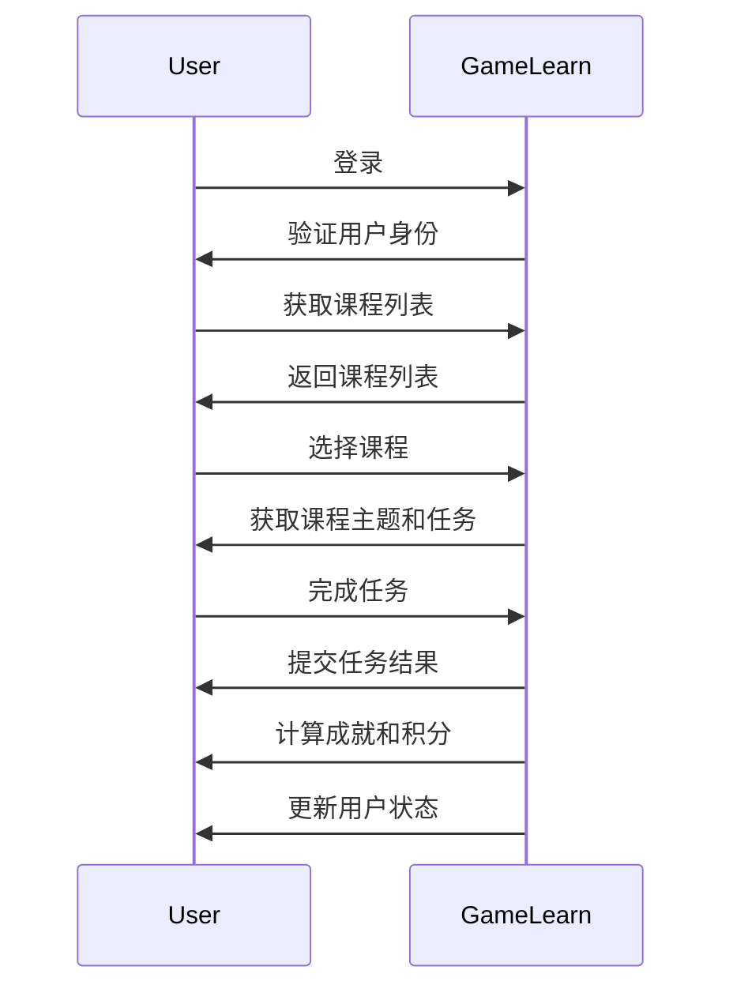
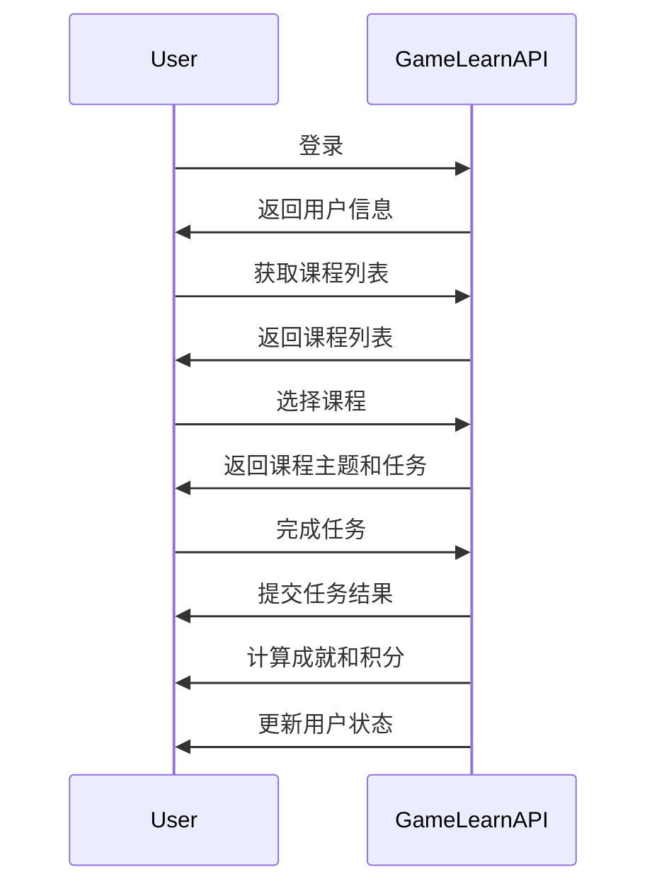

                 

# 数字游戏化学习平台：提高学习效率的新方法

> 关键词：数字游戏化、学习平台、学习效率、教育技术

> 摘要：本文探讨了数字游戏化学习平台作为一种新型的教育技术，如何通过结合游戏元素和教学设计，提高学习效率。文章首先介绍了数字游戏化的基本概念和其在教育领域的应用背景，接着深入分析了游戏化学习平台的原理和设计步骤，最后通过实际案例和最佳实践，提供了具体的实施建议。

## 引言

随着信息技术的快速发展，教育领域正迎来一场变革。传统的教学模式逐渐无法满足个性化学习和高效学习的需求。数字游戏化学习平台作为一种新兴的教育技术，正在逐渐改变这一现状。通过将游戏元素引入学习过程，这种平台旨在激发学生的学习兴趣，提高学习效率。

本文将从以下几个方面展开讨论：

1. **核心概念和背景**：介绍数字游戏化的定义、学习平台的内涵以及提高学习效率的重要性。
2. **数字游戏化理论**：探讨数字游戏化的理论基础和实践原则。
3. **游戏化元素**：分析不同游戏化元素的类型和作用。
4. **设计步骤**：详细阐述设计一个游戏化学习平台的基本步骤。
5. **用户体验与参与度**：讨论如何提升用户在游戏化学习平台上的体验和参与度。
6. **案例与最佳实践**：通过实际案例展示成功的游戏化学习平台，并总结最佳实践。
7. **技术实现与工具**：介绍游戏化学习平台的技术实现和所需工具。
8. **项目实战**：提供一个具体的游戏化学习平台项目实现案例。
9. **小结与拓展**：总结文章内容，并提出进一步的研究方向和阅读建议。

## 核心概念和背景

### 数字游戏化的定义

数字游戏化（Digital Gamification）是将游戏设计元素和原则应用于非游戏环境中，以增加用户的参与度、激励和满足感。在数字游戏化中，这些元素包括但不限于成就系统、排行榜、积分、虚拟货币、徽章等。通过这些元素，非游戏环境（如教育、工作、健康等领域）能够实现更加吸引人和激励人心的体验。

### 学习平台的内涵

学习平台是指用于教学和学习活动的信息技术工具和系统。这些平台通常提供课程内容、学习资源、互动工具和评估机制。传统的学习平台主要依赖于文本、图片和视频等静态内容，而数字游戏化学习平台则通过动态的、互动的、游戏化的方式来增强学习体验。

### 提高学习效率的重要性

学习效率是衡量学习效果的重要指标。在当今信息爆炸的时代，如何提高学习效率变得尤为关键。数字游戏化学习平台通过以下方式提高学习效率：

1. **激发学习兴趣**：游戏化的元素能够激发学生的学习兴趣，使学习过程更加有趣和吸引人。
2. **提供即时反馈**：游戏化学习平台通常提供即时反馈，帮助学生了解自己的学习进度和表现，从而调整学习策略。
3. **促进主动学习**：游戏化元素鼓励学生主动参与学习过程，培养自主学习的能力。
4. **增强记忆力**：通过游戏化的方式，学习内容能够更深刻地印在学生的记忆中，提高记忆力。

### 背景介绍

数字游戏化在教育领域的应用可以追溯到20世纪90年代。随着互联网和移动设备的普及，游戏化元素逐渐被引入到学习平台中。近年来，随着人工智能和大数据技术的发展，游戏化学习平台得到了更加广泛的应用和研究。研究表明，游戏化学习能够显著提高学生的学习动机、参与度和成绩。

### 问题与挑战

尽管数字游戏化学习平台具有巨大的潜力，但其在实际应用中仍面临一些挑战：

1. **设计难度**：如何将游戏化元素有效地整合到学习平台中，同时保持教学内容的科学性和有效性，是一个设计难题。
2. **技术实现**：实现一个功能丰富、用户体验良好的游戏化学习平台需要先进的技术支持和持续的技术迭代。
3. **用户接受度**：一些学生可能对游戏化学习平台持怀疑态度，需要通过有效的宣传和培训来提高用户接受度。
4. **评估效果**：如何评估游戏化学习平台的效果，以及如何将其与传统教育模式进行对比，是一个亟待解决的问题。

## 数字游戏化理论

### 理论基础

数字游戏化的理论基础主要包括游戏心理学、动机理论和认知学习理论。游戏心理学研究游戏如何影响人的行为和心理状态，动机理论探讨如何激发和维持学习动机，而认知学习理论则关注学习过程中的认知结构和过程。

### 实践原则

数字游戏化在实践中的原则主要包括以下几点：

1. **目标设定**：明确学习目标和游戏化目标，确保游戏化设计能够促进学习目标的实现。
2. **即时反馈**：提供即时反馈，帮助学生了解自己的学习进度和表现。
3. **奖励机制**：设计合理的奖励机制，激励学生学习。
4. **社交互动**：鼓励学生之间的互动和合作，增强学习社区氛围。
5. **可持续性**：确保游戏化设计能够长期维持学生的学习兴趣和动力。

### 原理解释与属性特征对比

#### 原理解释

数字游戏化的核心在于利用游戏的心理机制来提高学习效果。游戏具有竞争性、挑战性、反馈性和社会性等特征，这些特征与学习过程的某些方面具有相似性。例如，挑战性可以激发学生的求知欲，反馈性可以帮助学生及时调整学习策略，竞争性和社会性可以增强学生的合作意识和团队精神。

#### 属性特征对比

| 特征       | 游戏元素         | 学习元素         |
|------------|----------------|----------------|
| 竞争性     | 对手、排名      | 同伴评价、竞争排名 |
| 挑战性     | 难度调整、挑战任务 | 学习难度、任务完成 |
| 反馈性     | 成就系统、积分   | 学习进度、考核结果 |
| 社交性     | 社交互动、团队合作 | 群体讨论、资源共享 |

### ER实体关系图

```mermaid
erDiagram
    User ||--|{ Course }|:
        "参加" ||--|
    Course ||--|{ Topic }|:
        "包含" ||--|
    Topic ||--|{ Task }|:
        "包含" ||--|
    Task ||--|{ Achievement }|:
        "获得" ||--|
    User ||--|{ Achievement }|:
        "获得"
```

## 游戏化元素

### 类型与作用

游戏化元素是指那些能够激发学生兴趣、提高学习效率的机制和工具。以下是一些常见的游戏化元素及其作用：

1. **成就系统**：通过设置不同的成就目标，激励学生不断进步。成就系统可以包括各种形式的奖励，如积分、徽章、证书等。
2. **积分系统**：积分是游戏化学习平台中最常用的激励工具。学生通过完成学习任务、参与互动等行为获得积分，积分可以用于兑换虚拟物品或特权。
3. **排行榜**：排行榜能够激发学生的竞争心理，鼓励他们努力提高自己的成绩和排名。
4. **虚拟货币**：虚拟货币可以用于购买游戏内的物品或服务，增加游戏的趣味性和激励效果。
5. **徽章**：徽章是学生完成特定任务的象征，能够增强学生的成就感和自豪感。
6. **社交互动**：通过论坛、聊天室、小组合作等功能，促进学生之间的互动和交流，增强社区氛围。
7. **即时反馈**：通过即时反馈，帮助学生了解自己的学习进度和表现，及时调整学习策略。

### 作用机制

游戏化元素的作用机制主要包括以下几点：

1. **激励机制**：通过奖励和成就，激发学生的学习兴趣和动力。
2. **反馈机制**：通过即时反馈，帮助学生了解自己的学习状况，提高学习效果。
3. **竞争机制**：通过排行榜和竞争任务，激发学生的竞争意识和团队精神。
4. **合作机制**：通过社交互动和小组合作，培养学生的合作能力和团队意识。
5. **学习机制**：通过游戏化的学习任务和挑战，增强学生的学习和解决问题的能力。

### 选择与整合

在设计游戏化学习平台时，选择和整合游戏化元素至关重要。以下是一些建议：

1. **明确目标**：首先明确学习目标和平台目标，确保游戏化元素能够促进这些目标的实现。
2. **适度原则**：游戏化元素不宜过多，以免分散学生的注意力。应选择与学习目标密切相关且能够有效激励学生的元素。
3. **个性化设计**：根据不同学生的学习兴趣和需求，个性化设计游戏化元素。
4. **反馈与迭代**：在设计过程中，应不断收集用户反馈，根据反馈进行优化和迭代。

## 设计步骤

### 设计流程

设计一个游戏化学习平台通常包括以下步骤：

1. **需求分析**：了解学习者的需求、学习目标和学习环境。
2. **概念设计**：确定平台的基本功能和界面布局，构思游戏化元素的应用。
3. **原型设计**：制作平台的原型，通过用户测试收集反馈。
4. **开发实现**：根据原型设计进行平台开发，实现各项功能。
5. **测试与优化**：进行测试和用户反馈收集，优化平台性能和用户体验。
6. **上线与推广**：将平台上线，并进行推广和用户培训。

### 需求分析

需求分析是设计游戏化学习平台的第一步，至关重要。以下是一些关键需求分析步骤：

1. **学习者需求**：了解学习者的年龄、背景、学习动机和学习目标。
2. **学习目标**：明确平台需要实现的学习目标，如知识掌握、技能培养、问题解决等。
3. **学习环境**：分析学习环境，包括设备、网络、时间安排等。
4. **评估指标**：确定评估学习效果的指标，如学习完成率、知识点掌握度、用户满意度等。

### 概念设计

概念设计是在需求分析的基础上，确定平台的基本功能和界面布局。以下是一些关键设计要素：

1. **平台功能**：确定平台的核心功能，如课程内容管理、学习任务分配、用户互动、成绩评估等。
2. **界面布局**：设计平台的界面布局，确保用户友好，易于操作。
3. **游戏化元素**：根据需求分析结果，选择合适的游戏化元素，并确定其在平台中的位置和表现形式。
4. **交互设计**：设计用户与平台之间的交互流程和交互界面，确保用户能够轻松完成各项任务。

### 原型设计

原型设计是验证概念设计的有效方法。以下是一些关键步骤：

1. **低保真原型**：制作低保真原型，通过用户测试收集反馈。
2. **高保真原型**：根据反馈优化原型，制作高保真原型。
3. **用户测试**：邀请目标用户进行测试，收集用户反馈，评估原型的可用性和用户体验。

### 开发实现

开发实现是将原型设计转化为实际平台的关键步骤。以下是一些关键点：

1. **技术选型**：选择合适的技术栈，包括前端、后端、数据库等。
2. **功能实现**：根据原型设计，实现各项功能。
3. **用户体验**：确保平台的用户体验，包括界面设计、交互设计等。
4. **性能优化**：对平台进行性能优化，确保流畅运行。

### 测试与优化

测试与优化是确保平台质量和用户体验的关键步骤。以下是一些关键点：

1. **功能测试**：测试平台各项功能的正确性和稳定性。
2. **性能测试**：测试平台在高并发情况下的性能和稳定性。
3. **用户体验测试**：测试平台的用户友好性和易用性。
4. **迭代优化**：根据测试结果和用户反馈，进行优化和迭代。

### 上线与推广

上线与推广是将平台推向用户的关键步骤。以下是一些关键点：

1. **上线准备**：确保平台在上线前经过充分测试和优化。
2. **用户培训**：为用户提供培训，帮助他们熟悉平台的使用。
3. **推广活动**：通过线上和线下活动，提高平台知名度。
4. **用户反馈**：收集用户反馈，持续优化平台。

## 用户体验与参与度

### 用户体验的重要性

用户体验（User Experience, UX）在数字游戏化学习平台中扮演着至关重要的角色。一个良好的用户体验能够提升学生的学习满意度、减少学习障碍，从而提高学习效率。以下是一些影响用户体验的关键因素：

1. **界面设计**：简洁、直观、美观的界面设计能够提升用户的第一印象和操作体验。
2. **交互设计**：流畅、自然的交互流程和响应速度能够增强用户的操作舒适度。
3. **个性化**：根据用户的需求和偏好提供个性化的内容和功能，增强用户归属感。
4. **反馈机制**：及时、有效的反馈机制能够帮助用户了解自己的学习状况，调整学习策略。

### 提升用户参与度的策略

提升用户参与度是数字游戏化学习平台成功的关键。以下是一些有效的策略：

1. **竞争机制**：通过排行榜、挑战赛等竞争机制激发用户的竞争心理和参与热情。
2. **奖励机制**：设计多样化的奖励机制，如积分、徽章、虚拟货币等，激励用户持续参与。
3. **社交互动**：鼓励用户之间的互动和合作，建立学习社区，提升用户的社交体验。
4. **即时反馈**：提供即时反馈，帮助用户了解自己的学习进度和成绩，增强学习动力。
5. **个性化推荐**：根据用户的学习行为和兴趣，提供个性化的学习内容和任务，提升用户满意度。

### 持续维护与优化

用户体验和参与度不是一次性设计的结果，而是需要持续维护和优化的过程。以下是一些关键点：

1. **用户反馈**：定期收集用户反馈，了解用户的需求和问题，及时进行优化。
2. **数据分析**：通过数据分析用户行为和平台性能，发现问题和改进机会。
3. **迭代更新**：根据用户反馈和数据分析结果，不断更新和优化平台功能、界面设计和用户体验。
4. **社区建设**：建立用户社区，鼓励用户参与平台建设和反馈，提升用户归属感和参与度。

## 案例与最佳实践

### 案例一：Khan Academy

Khan Academy是一个非营利性组织，提供免费的在线教育资源。通过将游戏化元素引入学习过程，Khan Academy显著提高了学生的学习兴趣和成绩。以下是一些成功的实践：

1. **积分系统**：学生通过完成课程和学习任务获得积分，积分可以用于兑换虚拟物品和奖励。
2. **成就系统**：设置不同的成就目标，如完成一个课程、解决特定数量的题目等，激励学生不断进步。
3. **排行榜**：学生可以查看自己在全球的排名，激发竞争心理。

### 案例二：Duolingo

Duolingo是一个流行的语言学习应用，通过游戏化的方式帮助用户学习新语言。以下是一些成功的实践：

1. **任务系统**：学生通过完成各种语言学习任务（如听写、翻译、口语练习等）来提高语言能力。
2. **奖励机制**：学生通过完成任务获得经验和硬币，经验和硬币可以用于解锁新课程和功能。
3. **社交互动**：学生可以与其他学习者进行交流和合作，增强学习动力。

### 案例三：ClassDojo

ClassDojo是一个用于课堂管理的工具，通过游戏化的方式帮助教师管理学生行为和学习进度。以下是一些成功的实践：

1. **行为积分**：学生通过良好的行为表现获得积分，积分可以用于兑换奖励。
2. **成就系统**：设置不同的成就目标，如连续几天良好行为、完成特定任务等，激励学生持续表现良好。
3. **家长参与**：家长可以通过ClassDojo了解孩子的学习情况和行为表现，增强家校沟通。

### 案例四：STEM Games

STEM Games是一个专为STEM教育设计的游戏化平台，通过游戏化的方式帮助学生学习和掌握STEM知识。以下是一些成功的实践：

1. **挑战任务**：学生通过完成各种挑战任务来学习STEM知识，任务难度逐步提升。
2. **合作学习**：学生可以组成团队，共同完成任务，培养团队合作能力。
3. **成就系统**：设置不同的成就目标，如完成一个项目、解决特定数量的难题等，激励学生不断进步。

### 案例五：Sakai

Sakai是一个开源的学习管理系统，通过整合游戏化元素，提供个性化的学习体验。以下是一些成功的实践：

1. **个性化推荐**：根据学生的学习行为和兴趣，推荐个性化的学习内容和任务。
2. **任务管理系统**：学生可以通过任务管理系统了解自己的学习任务和进度，确保学习目标的实现。
3. **反馈机制**：学生可以随时查看自己的学习报告和成绩，了解自己的学习状况。

### 案例六：Edmodo

Edmodo是一个社交化的学习平台，通过游戏化元素增强学生的学习体验。以下是一些成功的实践：

1. **积分系统**：学生通过参与课堂活动、完成作业等获得积分，积分可以用于兑换奖励。
2. **成就系统**：设置不同的成就目标，如完成一个项目、参与一次讨论等，激励学生不断进步。
3. **社交互动**：学生可以通过Edmodo与其他同学和老师进行交流和合作，增强学习动力。

## 技术实现与工具

### 技术实现

实现一个功能丰富、用户体验良好的游戏化学习平台需要考虑多个方面的技术实现。以下是一些关键点：

1. **前端技术**：选择合适的前端框架，如React、Vue.js等，实现用户界面和交互功能。
2. **后端技术**：选择合适的服务器端技术，如Node.js、Java等，处理业务逻辑和数据存储。
3. **数据库技术**：选择合适的数据库系统，如MySQL、MongoDB等，存储用户数据和学习记录。
4. **API接口**：设计统一的API接口，实现前后端的通信和数据交互。

### 常用工具

以下是实现游戏化学习平台常用的工具：

1. **开发框架**：如React、Vue.js、Angular等。
2. **数据库**：如MySQL、MongoDB、Redis等。
3. **云服务**：如AWS、Google Cloud、Azure等，提供服务器、存储和计算资源。
4. **集成开发环境**：如Visual Studio Code、IntelliJ IDEA等，提供代码编辑、调试和构建工具。
5. **版本控制**：如Git，实现代码版本管理和协同开发。
6. **持续集成/持续部署**：如Jenkins、Travis CI等，实现自动化测试和部署。

### 开发流程

实现一个游戏化学习平台通常包括以下步骤：

1. **需求分析**：与 stakeholders（如教师、学生、管理员等）沟通，明确平台功能需求和用户需求。
2. **系统设计**：设计系统架构、数据库设计和API接口设计。
3. **前端开发**：实现用户界面和交互功能。
4. **后端开发**：实现业务逻辑和数据存储。
5. **测试**：进行功能测试、性能测试和安全测试。
6. **部署**：将平台部署到服务器，进行上线和运营。

## 项目实战

### 项目背景

本项目旨在设计并实现一个数字游戏化学习平台，用于在线教育。该平台旨在通过游戏化元素提高学生的学习兴趣和效率，同时提供个性化的学习体验。

### 项目介绍

项目名称：GameLearn

目标用户：中小学生、大学生和成人学习者

主要功能：
1. **课程内容管理**：提供丰富的课程内容，包括视频、文档、习题等。
2. **学习任务分配**：根据用户的学习进度和兴趣，自动分配学习任务。
3. **成就系统**：通过完成学习任务和挑战获得成就和奖励。
4. **积分系统**：通过完成学习和互动任务获得积分，积分可以用于兑换虚拟物品和奖励。
5. **排行榜**：展示用户的学习进度和成绩，激发竞争心理。
6. **社交互动**：提供论坛、聊天室等功能，促进用户之间的互动和交流。

### 系统功能设计

以下是GameLearn的领域模型，用于描述系统的核心功能：

```mermaid
classDiagram
    User <<class{用户}>> 
    Course <<class{课程}>>
    Topic <<class{主题}>>
    Task <<class{任务}>>
    Achievement <<class{成就}>>
    Reward <<class{奖励}>

    User "参加" Course
    User "完成" Task
    Course "包含" Topic
    Course "包含" Task
    Topic "包含" Task
    Task "获得" Achievement
    Achievement "获得" Reward
```

### 系统架构设计

以下是GameLearn的系统架构图，用于描述系统的整体结构和组件：



### 系统接口设计

以下是GameLearn的接口设计，用于描述系统对外提供的服务：

```mermaid
interface GameLearnAPI {
    +login(username: String, password: String): Promise<User>
    +getCourseList(): Promise<Course[]>
    +selectCourse(courseId: String): Promise<Topic[]>
    +submitTask(taskId: String, result: Object): Promise<Achievement[]>
    +calculateReward(achievementId: String): Promise<Reward[]>
}
```

### 系统交互设计

以下是GameLearn的系统交互图，用于描述用户与系统的交互过程：



### 环境安装

为了实现GameLearn项目，需要安装以下环境：

1. **操作系统**：Linux或Mac OS
2. **开发工具**：Visual Studio Code、Git
3. **前端框架**：React
4. **后端框架**：Node.js
5. **数据库**：MySQL

安装步骤如下：

1. 安装操作系统
2. 安装Visual Studio Code和Git
3. 安装Node.js（通过nvm工具）
4. 安装MySQL（通过包管理器或手动安装）

### 核心实现源代码

以下是GameLearn项目的核心实现源代码，用于描述系统的核心功能和业务逻辑：

```javascript
// 用户登录接口实现
const login = async (username, password) => {
    try {
        const response = await fetch('https://api.gamelearn.com/login', {
            method: 'POST',
            headers: {
                'Content-Type': 'application/json'
            },
            body: JSON.stringify({ username, password })
        });
        const data = await response.json();
        return data.user;
    } catch (error) {
        console.error('登录失败：', error);
    }
};

// 获取课程列表接口实现
const getCourseList = async () => {
    try {
        const response = await fetch('https://api.gamelearn.com/courseList');
        const data = await response.json();
        return data.courses;
    } catch (error) {
        console.error('获取课程列表失败：', error);
    }
};

// 选择课程接口实现
const selectCourse = async (courseId) => {
    try {
        const response = await fetch(`https://api.gamelearn.com/course/${courseId}`);
        const data = await response.json();
        return data.course;
    } catch (error) {
        console.error('选择课程失败：', error);
    }
};

// 提交任务结果接口实现
const submitTask = async (taskId, result) => {
    try {
        const response = await fetch(`https://api.gamelearn.com/task/${taskId}/submit`, {
            method: 'POST',
            headers: {
                'Content-Type': 'application/json'
            },
            body: JSON.stringify({ result })
        });
        const data = await response.json();
        return data.achievements;
    } catch (error) {
        console.error('提交任务结果失败：', error);
    }
};

// 计算成就和积分接口实现
const calculateReward = async (achievementId) => {
    try {
        const response = await fetch(`https://api.gamelearn.com/achievement/${achievementId}/reward`);
        const data = await response.json();
        return data.reward;
    } catch (error) {
        console.error('计算成就和积分失败：', error);
    }
};
```

### 代码应用解读与分析

以下是代码应用解读与分析，用于描述系统核心实现源代码的详细解释和功能分析：

1. **用户登录接口实现**：此接口用于用户登录，接收用户名和密码，通过API调用验证用户身份，并返回用户信息。
2. **获取课程列表接口实现**：此接口用于获取课程列表，通过API调用获取系统中的所有课程信息，并返回给用户。
3. **选择课程接口实现**：此接口用于用户选择课程，接收课程ID，通过API调用获取所选课程的相关信息，并返回给用户。
4. **提交任务结果接口实现**：此接口用于用户提交任务结果，接收任务ID和任务结果，通过API调用将任务结果提交给系统，并返回成就信息。
5. **计算成就和积分接口实现**：此接口用于计算成就和积分，接收成就ID，通过API调用获取成就的奖励信息，并返回给用户。

### 实际案例分析与详细讲解

以下是实际案例分析与详细讲解，用于描述一个具体的游戏化学习平台项目实现案例：

假设我们有一个名为“编程学习平台”的游戏化学习平台，用户可以通过完成编程任务来获取成就和积分。

1. **用户登录**：用户通过输入用户名和密码登录系统。系统验证用户身份后，返回用户信息，包括用户ID、用户名和积分。
2. **课程列表**：用户登录后，可以查看系统提供的所有编程课程。系统通过API调用获取课程列表，并返回给用户。
3. **选择课程**：用户选择一个编程课程，系统通过API调用获取所选课程的相关信息，包括课程ID、课程名称和课程描述。
4. **完成编程任务**：用户选择一个编程任务，根据任务要求编写代码。完成任务后，用户通过接口提交任务结果，系统验证任务结果并返回成就信息。
5. **成就和积分计算**：系统根据用户提交的任务结果计算成就和积分。每个任务完成后，用户会获得一定的积分和成就，积分和成就可以用于解锁新的课程和特权。

通过这个案例，我们可以看到游戏化学习平台是如何通过用户互动和任务完成来提高学习效率和用户体验的。

### 项目小结

本案例提供了一个完整的游戏化学习平台实现项目，从需求分析、系统设计、功能实现到实际应用，展示了游戏化学习平台的设计和实现过程。通过实际案例的分析和讲解，我们了解了游戏化学习平台如何通过激励机制、任务管理和成就系统来提高学习效率。

### 最佳实践 Tips

1. **明确学习目标**：在设计游戏化学习平台时，首先明确学习目标，确保游戏化设计能够促进这些目标的实现。
2. **适度游戏化**：游戏化元素不宜过多，以免分散学生的注意力。应根据学习目标选择适当的游戏化元素。
3. **个性化设计**：根据不同学生的学习兴趣和需求，个性化设计游戏化元素，提高用户满意度。
4. **及时反馈**：提供即时反馈，帮助学生了解自己的学习进度和表现，及时调整学习策略。
5. **持续优化**：根据用户反馈和数据分析结果，不断优化平台功能、界面设计和用户体验。

## 小结

本文详细探讨了数字游戏化学习平台的原理、设计步骤、用户体验和实际应用。通过案例分析和最佳实践，我们了解了游戏化学习平台如何通过激励机制、任务管理和成就系统来提高学习效率。数字游戏化学习平台作为一种新型的教育技术，具有巨大的潜力，但同时也面临一些挑战。未来的研究可以进一步探索如何更好地整合游戏化元素，提高学习平台的用户体验和效果。

## 注意事项

在设计游戏化学习平台时，需要注意以下几点：

1. **明确学习目标**：确保游戏化设计能够促进学习目标的实现。
2. **适度游戏化**：避免过度游戏化，以免分散学生注意力。
3. **个性化设计**：根据不同学生的学习需求设计游戏化元素。
4. **及时反馈**：提供即时反馈，帮助学生调整学习策略。
5. **用户隐私**：确保用户数据的安全和隐私。

## 拓展阅读

1. **《游戏化设计：创新思维与实践》**：本书详细介绍了游戏化设计的理论基础和实践方法，适合游戏化学习平台的设计者阅读。
2. **《学习科学》**：本书探讨了学习科学的基本原理和方法，对理解游戏化学习平台的设计理念有帮助。
3. **《教育技术》**：本书介绍了教育技术的最新发展，包括游戏化学习平台的相关内容。

## 作者信息

作者：AI天才研究院/AI Genius Institute & 禅与计算机程序设计艺术 /Zen And The Art of Computer Programming

[返回目录](#数字游戏化学习平台提高学习效率的新方法)

