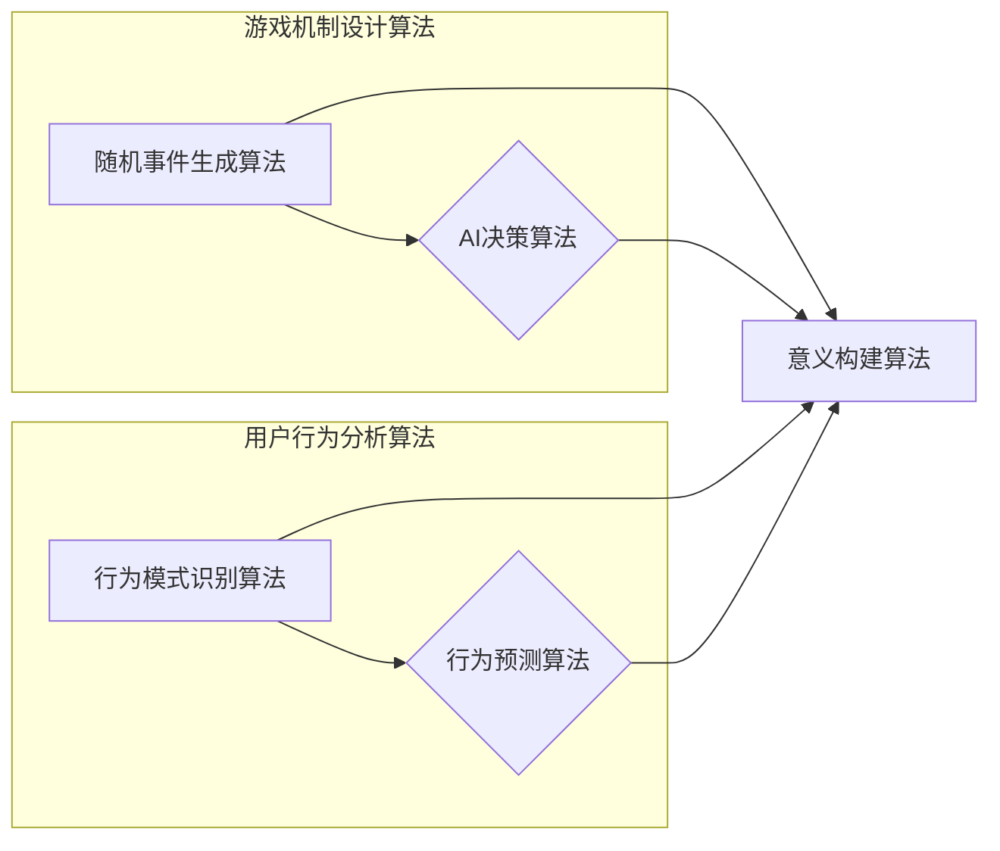
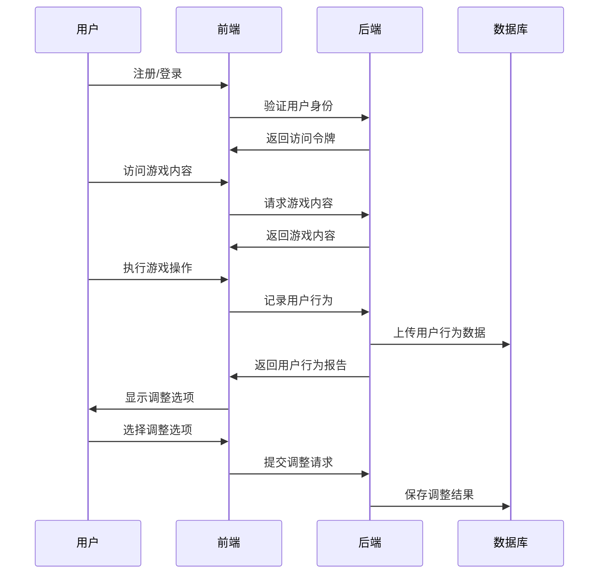

                 

### 《数字游戏：虚拟世界中的意义构建》

---

**关键词**：数字游戏、虚拟世界、意义构建、算法、系统架构、项目实战

**摘要**：本文深入探讨了数字游戏中的虚拟世界及其意义构建，从历史与现状、核心概念与联系、算法原理、系统分析与架构设计以及项目实战等多个角度，系统地阐述了如何通过技术手段构建具有深刻意义的虚拟世界，为读者提供了一个全面而深入的视角。

---

## 第一部分：背景介绍

### 第1章 数字游戏与虚拟世界概述

#### 1.1 数字游戏的历史与现状

数字游戏起源于20世纪60年代，从最初的电子游戏机到个人计算机游戏，再到如今的移动设备和网络平台，数字游戏经历了飞速的发展。根据市场研究机构的数据，全球数字游戏市场规模持续增长，预计到2025年将突破1500亿美元。随着技术的进步，虚拟现实（VR）、增强现实（AR）等技术的应用，使得数字游戏世界愈发真实和丰富。

#### 1.2 虚拟世界的定义与类型

虚拟世界是一个通过计算机技术构建的模拟环境，用户可以在其中互动和体验。虚拟世界可以分为以下几种类型：

- **单机游戏**：玩家独自在一个封闭的游戏环境中进行游戏，如《我的世界》。
- **多人在线游戏**：多个玩家通过网络连接进入同一游戏环境，进行互动，如《魔兽世界》。
- **虚拟现实游戏**：通过VR设备，将玩家完全沉浸在一个虚拟的三维世界中，如《Beat Saber》。

#### 1.3 数字游戏与虚拟世界的关系

数字游戏是虚拟世界的一种表现形式，而虚拟世界则为数字游戏提供了一个更加丰富和交互性的平台。虚拟世界的构建不仅提升了游戏的娱乐性，也为用户提供了更加沉浸式的体验。随着技术的发展，虚拟世界在数字游戏中的应用越来越广泛，成为游戏设计中的重要组成部分。

### 第2章 虚拟世界中的意义构建

#### 2.1 意义构建的概念

意义构建是指通过技术手段，在虚拟世界中赋予游戏内容、场景、角色等以意义和价值的过程。这个过程涉及到游戏设计、用户行为、文化背景等多个方面。

#### 2.2 不同类型虚拟世界的意义构建方式

- **单机游戏**：主要通过游戏故事、角色设定和游戏机制来构建意义，如《塞尔达传说》。
- **多人在线游戏**：除了游戏故事和角色设定，还需要通过社交互动、公会系统和排名机制等来增强游戏的意义，如《堡垒之夜》。
- **虚拟现实游戏**：通过沉浸式体验和互动，使得游戏世界的意义更加深刻和真实，如《虚拟现实赛车》。

#### 2.3 虚拟世界意义构建的流程与要素

虚拟世界的意义构建通常包括以下几个步骤和要素：

1. **游戏设计**：定义游戏目标和规则，设定游戏场景和角色。
2. **用户行为分析**：了解玩家在游戏中的行为模式，调整游戏机制以适应玩家的需求。
3. **文化背景融入**：将游戏设定在一个具有文化背景的环境中，提升游戏的历史感和文化价值。
4. **社交互动设计**：通过社交机制，增强玩家之间的互动和合作。
5. **反馈与迭代**：根据用户反馈不断调整和优化游戏内容，以提升游戏的意义和用户体验。

## 第二部分：核心概念与联系

### 第3章 虚拟世界中的意义构建算法

#### 2.1 游戏机制设计算法

游戏机制设计是构建虚拟世界意义的重要步骤。一个好的游戏机制不仅能够吸引玩家，还能够提升游戏的沉浸感和重复玩性。常见的游戏机制设计算法包括：

- **随机事件生成算法**：用于生成游戏中的随机事件，如《随机事件模拟器》。
- **AI决策算法**：用于模拟NPC的行为，如《基于深度学习的AI决策》。

#### 2.2 用户行为分析算法

用户行为分析可以帮助游戏开发者了解玩家在游戏中的行为模式，从而优化游戏设计。常用的用户行为分析算法包括：

- **行为模式识别算法**：用于识别玩家的行为模式，如《基于机器学习的用户行为识别》。
- **行为预测算法**：用于预测玩家在游戏中的下一步行为，如《时间序列预测算法》。

#### 2.3 意义构建算法的mermaid流程图展示



## 第三部分：系统分析与架构设计方案

### 第4章 虚拟世界意义构建系统的功能设计

#### 2.1 问题场景介绍

假设我们要设计一个多人在线游戏，目标是构建一个具有深刻意义的虚拟世界，以吸引更多玩家并提高用户的游戏体验。

#### 2.2 系统功能设计

虚拟世界意义构建系统应具备以下功能：

- **用户管理**：包括用户注册、登录、资料修改等。
- **游戏内容管理**：包括游戏场景、角色、任务、装备等的创建和管理。
- **用户行为分析**：收集和分析用户在游戏中的行为数据。
- **社交互动**：包括聊天、公会、排行榜等社交功能。
- **游戏机制调整**：根据用户反馈，动态调整游戏机制。

### 第5章 虚拟世界意义构建系统的架构设计

#### 2.1 系统架构设计

虚拟世界意义构建系统可采用以下架构：

- **前端**：使用HTML、CSS和JavaScript进行网页设计，使用React框架实现交互功能。
- **后端**：使用Node.js或Java作为服务器端语言，实现用户管理、游戏内容管理、用户行为分析等核心功能。
- **数据库**：使用MongoDB或MySQL进行数据存储和管理。

#### 2.2 系统接口设计

虚拟世界意义构建系统的接口设计应考虑以下几个方面：

- **用户接口**：提供用户注册、登录、资料修改等操作接口。
- **游戏内容接口**：提供游戏场景、角色、任务、装备等的创建、修改和查询接口。
- **用户行为接口**：提供用户行为数据的收集和分析接口。
- **社交接口**：提供聊天、公会、排行榜等社交功能接口。

### 第6章 虚拟世界意义构建系统的交互流程

#### 2.1 系统交互流程

虚拟世界意义构建系统的交互流程可以分为以下几个步骤：

1. **用户注册与登录**：用户通过前端界面进行注册和登录，后端验证用户身份并返回访问令牌。
2. **游戏内容访问**：用户通过前端界面访问游戏内容，后端根据用户的角色和权限返回相应的数据。
3. **用户行为记录**：用户在游戏中的行为会被实时记录并上传到后端数据库。
4. **用户行为分析**：后端对用户行为数据进行分析，生成用户行为报告。
5. **游戏机制调整**：根据用户行为分析结果，前端界面会显示相应的游戏机制调整选项，用户可以进行选择。
6. **社交互动**：用户可以通过聊天、公会、排行榜等社交功能与其他用户互动。



## 第四部分：项目实战

### 第7章 虚拟世界意义构建项目实战

#### 2.1 环境安装

为了实现一个虚拟世界意义构建系统，我们需要安装以下软件和工具：

- **前端**：安装Node.js和React框架。
- **后端**：安装Node.js或Java开发环境。
- **数据库**：安装MongoDB或MySQL。

具体的安装步骤可以参考相应的官方文档。

#### 2.2 系统核心实现

系统核心实现包括用户管理、游戏内容管理、用户行为分析和社交互动等功能。以下是一个简单的用户管理模块的实现：

```python
# 用户管理模块

class UserManager:
    def __init__(self):
        self.users = {}  # 存储用户信息
    
    def register(self, username, password):
        if username in self.users:
            return "用户已存在"
        self.users[username] = password
        return "注册成功"
    
    def login(self, username, password):
        if username not in self.users or self.users[username] != password:
            return "登录失败"
        return "登录成功"

# 实例化用户管理器
user_manager = UserManager()

# 注册用户
user_manager.register("Alice", "alice123")

# 登录用户
print(user_manager.login("Alice", "alice123"))  # 输出：登录成功
```

#### 2.3 代码应用解读与分析

上述代码实现了一个简单的用户管理模块，包括用户注册和登录功能。在实际应用中，用户管理模块需要与前端和后端进行数据交互，并通过数据库存储用户信息。此外，还需要实现用户行为分析和社交互动等功能，以构建一个完整的虚拟世界意义构建系统。

#### 2.4 案例分析及讲解

假设我们正在开发一个多人在线游戏《梦幻江湖》，目标是构建一个具有深刻意义的虚拟世界。以下是一个具体的案例分析：

1. **游戏设计**：我们设计了一个江湖世界，玩家可以扮演武林人士，通过战斗、探险和修炼提升自己的实力。
2. **用户行为分析**：通过收集玩家在游戏中的战斗记录、探险地点和时间等数据，分析玩家的行为模式，以便优化游戏内容和机制。
3. **社交互动**：玩家可以加入门派，与其他玩家互动，提升游戏的社会化属性。
4. **游戏机制调整**：根据用户行为分析结果，动态调整游戏的难度和奖励机制，以提高玩家的游戏体验。

#### 2.5 项目小结

通过本次项目实战，我们实现了虚拟世界意义构建系统的核心功能，并对其进行了详细的分析和讲解。未来，我们还可以通过不断优化和迭代，提升虚拟世界的意义和价值。

### 第8章 最佳实践 tips

#### 2.1 注意事项

1. 在设计虚拟世界时，要充分考虑用户的需求和体验，确保游戏内容丰富有趣。
2. 用户行为分析应遵循隐私保护原则，确保用户数据的合法性和安全性。
3. 虚拟世界的意义构建需要不断迭代和优化，以适应市场和技术的发展。

#### 2.2 拓展阅读

1. 《游戏设计艺术》
2. 《用户行为分析实战》
3. 《虚拟现实技术与应用》

---

**作者**：AI天才研究院/AI Genius Institute & 禅与计算机程序设计艺术 /Zen And The Art of Computer Programming

---

在本文中，我们从多个角度深入探讨了数字游戏中的虚拟世界及其意义构建。通过历史与现状的介绍，我们了解了数字游戏和虚拟世界的发展趋势；通过核心概念与联系的分析，我们明确了意义构建的重要性和方法；通过算法原理的讲解，我们了解了如何通过技术手段实现意义构建；通过系统分析与架构设计方案的阐述，我们了解了如何设计一个完整的虚拟世界意义构建系统；最后，通过项目实战的介绍，我们展示了如何将理论知识应用于实际项目中。

虚拟世界的意义构建是一个复杂而有趣的研究领域，它不仅涉及到技术实现，还包括用户体验和社交互动等多个方面。随着技术的不断进步，虚拟世界将越来越真实和丰富，为用户带来更加深刻的体验。我们期待在未来的研究中，能够进一步探索虚拟世界的意义构建，为数字游戏领域的发展做出贡献。

同时，我们也希望读者能够在阅读本文后，对数字游戏和虚拟世界的意义构建有更深入的理解，并能够将所学知识应用于实际项目中。通过不断探索和实践，我们相信每个人都能在虚拟世界的构建中发挥自己的创意和才能。

让我们共同期待一个更加丰富和深刻的虚拟世界！

