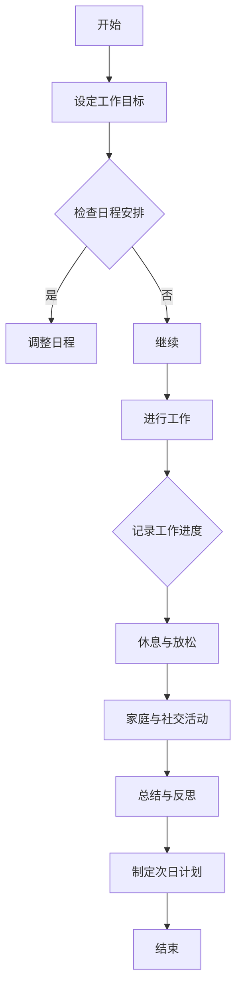
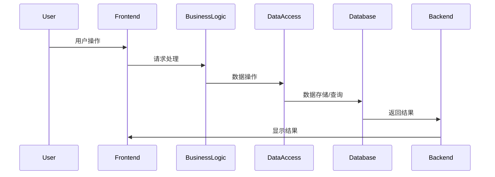
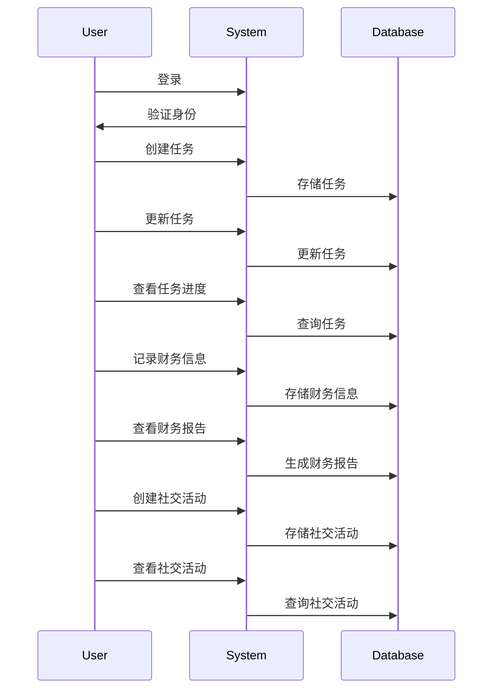

                 

### 概述与背景介绍

随着全球化的加速和数字化技术的普及，数字游民的生活方式正在成为一种越来越受欢迎的选择。数字游民是指那些利用互联网和数字技术，在世界各地自由选择居住和工作地点的人群。他们的职业可能包括远程编程、自由写作、数字营销、虚拟助手、在线咨询等，这些工作不需要固定的工作场所，只需要一台联网的电脑和一些必要的软件工具。

#### 问题背景

数字游民的生活方式不仅改变了人们的职业选择，还重新定义了“家”的概念。在传统观念中，“家”通常是指一个固定的居住地点，有着稳定的社会关系和日常生活环境。然而，数字游民可能在一个地方住上几个月，甚至几周，就因为工作的原因搬往另一个城市或国家。这种生活方式让人们开始思考：在全球化时代，什么是“家”？“家”的意义又是什么？

#### 问题描述

数字游民的生活方式引发了一系列问题，包括工作与生活的平衡、文化适应、心理健康、财务管理等。同时，它也带来了许多机遇，如全球范围内的职业机会、更灵活的工作时间、更低的生活成本等。因此，如何在全球化的背景下重新定义“家”，找到适合自己的数字游民生活方式，成为一个重要课题。

#### 问题解决

本书旨在探讨数字游民的生活哲学，提供一些建议和指导，帮助读者在全球化的时代中找到适合自己的生活方式。通过分析数字游民的典型生活方式、成功案例和潜在问题，本书将帮助读者理解数字游民的生活方式，并为他们提供实用的建议和策略。

#### 边界与外延

数字游民的生活哲学涉及多个方面，包括工作、生活、文化、心理健康、财务管理等。它的边界可以是全球范围内的远程工作，也可以是任何一种非传统的工作和生活方式。外延则包括对数字游民生活方式的深入探讨、对相关问题的分析和解决策略。

#### 概念结构与核心要素组成

数字游民的生活哲学包括以下几个核心要素：

1. **远程工作能力**：数字游民必须具备远程工作的能力，这包括技术工具的使用、网络环境的搭建、工作流程的优化等。
2. **文化适应能力**：数字游民需要在不同的文化环境中工作生活，这要求他们具备良好的文化适应能力，包括语言能力、文化敏感性、沟通技巧等。
3. **心理健康管理**：数字游民往往面临着孤独、焦虑、抑郁等心理健康问题，因此他们需要学会管理自己的心理健康，包括自我激励、时间管理、健康生活方式等。
4. **财务管理**：数字游民需要学会合理规划和管理自己的财务，包括收入来源的多样性、财务风险管理、生活成本的优化等。

### 核心概念与联系

#### 数字游民

数字游民是指利用数字技术和远程工作机会，在全球范围内自由选择工作和居住地的人群。数字游民的生活方式具有以下几个特点：

1. **远程工作**：数字游民主要通过远程方式完成工作，如在线编程、写作、设计等。
2. **全球化视野**：数字游民能够接触到全球范围内的职业机会和文化背景。
3. **灵活的工作时间**：数字游民可以根据自己的需求灵活安排工作时间，这有利于工作与生活的平衡。
4. **较低的生活成本**：数字游民可以选择生活成本较低的地区，从而节省生活费用。

#### 数字游民的生活哲学

数字游民的生活哲学是一种价值观念和生活方式，强调个人自由、全球化视野、灵活性和适应性。数字游民的生活哲学包括以下几个核心概念：

1. **自由**：数字游民追求自由，包括职业选择、生活方式、居住地的自由。
2. **全球化**：数字游民具有全球化的视野，能够接触到不同文化背景的人和事物。
3. **灵活性**：数字游民的生活和工作中充满了灵活性，这有利于他们适应快速变化的环境。
4. **适应性**：数字游民需要具备良好的适应能力，以应对各种挑战和变化。

#### 比较与联系

数字游民与传统的远程工作者相比，具有更自由的职业选择、更灵活的工作时间和更低的生活成本。与传统工作者相比，数字游民更需要具备较强的文化适应能力、心理健康管理和财务管理能力。

### 数字游民生活方式的优势与挑战

#### 优势

1. **职业自由**：数字游民可以自由选择职业，不受地理限制。
2. **工作与生活平衡**：数字游民可以根据自己的需求灵活安排工作时间，有利于工作与生活的平衡。
3. **全球化视野**：数字游民能够接触到全球范围内的职业机会和文化背景。
4. **较低的生活成本**：数字游民可以选择生活成本较低的地区，从而节省生活费用。

#### 挑战

1. **文化适应**：数字游民需要在不同的文化环境中工作生活，需要具备良好的文化适应能力。
2. **心理健康管理**：数字游民可能面临孤独、焦虑、抑郁等心理健康问题，需要学会管理自己的心理健康。
3. **财务管理**：数字游民需要学会合理规划和管理自己的财务，包括收入来源的多样性和财务风险管理。

### 数字游民的成功案例

#### 案例一：远程办公平台的创始人

一位远程办公平台的创始人，通过建立远程办公平台，帮助全球各地的自由职业者找到远程工作机会。他的成功得益于对数字技术和远程工作机会的深入理解，以及良好的文化适应能力和财务管理能力。

#### 案例二：远程旅行博主

一位喜欢旅行的博主，通过在旅途中进行写作和视频制作，赚取收入。他的成功在于灵活的职业生涯和强大的内容创作能力，同时他还建立了强大的社交媒体影响力，吸引了大量的粉丝和广告商。

### 核心概念与联系

数字游民是一种独特的生活方式，它不仅改变了人们的职业选择，还重新定义了“家”的概念。数字游民的生活哲学强调自由、全球化视野、灵活性和适应性，这些特点使得他们能够更好地适应快速变化的世界。与传统的生活方式相比，数字游民面临更多的挑战，但也拥有更多的机会。通过分析数字游民的典型生活方式、成功案例和潜在问题，本书将帮助读者深入理解数字游民的生活方式，并为他们提供实用的建议和策略。

### 总结

数字游民的生活方式在全球化的时代中扮演着越来越重要的角色。他们通过数字技术和远程工作机会，在全球范围内自由选择工作和居住地，重新定义了“家”的概念。这种生活方式不仅带来了职业自由、工作与生活平衡、全球化视野和较低的生活成本，还挑战了传统的文化适应、心理健康管理和财务管理。通过理解数字游民的生活哲学，我们可以更好地适应这个快速变化的世界，找到属于自己的生活方式。

### 关键词

数字游民、全球化、远程工作、生活方式、自由、灵活性、心理健康管理、文化适应、财务管理。

### 摘要

本文探讨了数字游民的生活方式，以及在全球化的时代中如何重新定义“家”的概念。通过分析数字游民的典型生活方式、成功案例和潜在问题，本文提出了数字游民的生活哲学，并提供了实用的建议和策略。本文旨在帮助读者理解数字游民的生活方式，找到适合自己的数字游民生活方式，以更好地适应全球化的时代。

---

接下来，我们将详细探讨数字游民生活方式的优势与挑战，以及一些成功案例，帮助您更好地理解这一独特的职业选择。

### 数字游民生活方式的优势与挑战

#### 优势

1. **职业自由**

数字游民最大的优势之一是职业自由。他们不受地理限制，可以选择全球范围内的职业机会。无论是远程编程、自由写作、数字营销，还是在线咨询等，数字游民都能根据兴趣和技能找到合适的工作。这种自由不仅提供了更多的职业选择，还让工作与兴趣更加吻合，提高了工作效率和满意度。

2. **工作与生活平衡**

数字游民可以根据自己的需求灵活安排工作时间，这有利于实现工作与生活的平衡。他们可以选择在清晨工作，享受下午和晚上自由的时间。这种灵活的工作时间安排减少了通勤时间，让他们有更多的时间与家人、朋友共度时光，或者进行个人爱好和自我发展。

3. **全球化视野**

数字游民的生活和工作经历让他们有机会接触不同的文化和人群。这种全球化的视野不仅丰富了他们的生活经验，还提高了他们的跨文化沟通能力和适应性。通过与来自不同国家的人合作，数字游民能够获得新的视角和思维方式，这对职业发展和个人成长都是宝贵的资源。

4. **较低的生活成本**

许多数字游民选择在生活成本较低的地区居住，如东南亚的一些国家或中部欧洲的城市。这种选择不仅降低了生活费用，还让他们能够以更低的成本获得高品质的生活。例如，一个在东京的程序员可能选择在泰国工作，同时享受更舒适的生活环境。

#### 挑战

1. **文化适应**

数字游民需要在不同的文化环境中工作和生活，这需要良好的文化适应能力。语言障碍、文化差异、社交习惯等都是他们可能面临的问题。良好的文化适应能力包括语言能力、文化敏感性、沟通技巧等，这些能力对于数字游民的成功至关重要。

2. **心理健康管理**

长期处于不同的文化和环境中，数字游民可能面临孤独、焦虑、抑郁等心理健康问题。缺乏亲密的社交关系和稳定的生活环境，可能会影响他们的心理健康。因此，数字游民需要学会管理自己的心理健康，包括自我激励、时间管理、健康生活方式等。

3. **财务管理**

财务管理是数字游民面临的一个重要挑战。由于工作地点的不稳定性，数字游民需要学会合理规划和管理自己的财务，包括收入来源的多样性和财务风险管理。此外，他们还需要适应不同国家的税收政策和生活费用，这对财务管理能力提出了更高的要求。

### 数字游民的成功案例

#### 案例一：远程办公平台的创始人

一位名叫马克的远程办公平台的创始人，他的成功故事是一个典型的数字游民案例。马克原本是一名软件开发工程师，但在一次全球旅行中，他意识到远程工作的潜力。回到家乡后，他决定辞去稳定的工作，全职投入到远程办公平台的创建中。通过整合各种远程工作资源和工具，马克的平台吸引了来自全球的自由职业者和企业客户，成为远程办公领域的重要玩家。

马克的成功得益于他对数字技术和远程工作机会的深入理解，以及他强大的文化适应能力和财务管理能力。他不仅能够提供有效的远程工作解决方案，还能够帮助用户适应不同文化和环境。

#### 案例二：远程旅行博主

另一位成功的数字游民是艾米，一位热爱旅行的博主。艾米通过在旅途中写作和制作视频，吸引了大量的粉丝和广告商。她的旅行故事和摄影作品展示了不同国家和文化的美丽风景，让人们对世界充满好奇和向往。

艾米的成功在于她灵活的职业生涯和强大的内容创作能力。她能够充分利用自己的技能和兴趣，创造出有吸引力的内容，并利用社交媒体平台建立强大的影响力。艾米的经验表明，数字游民可以通过内容创作和社交媒体营销，实现职业发展和收入来源的多样化。

### 总结

数字游民的生活方式具有许多优势，如职业自由、工作与生活平衡、全球化视野和较低的生活成本。然而，这种生活方式也带来了文化适应、心理健康管理和财务管理等方面的挑战。通过分析成功案例，我们可以看到，良好的文化适应能力、心理健康管理和财务管理能力是数字游民成功的关键。数字游民的生活哲学是一种追求自由、灵活性和适应性的生活方式，它为人们提供了无限的机遇，也带来了新的挑战。理解并适应这些挑战，可以帮助我们更好地享受数字游民生活带来的无限可能。

---

在下一部分，我们将深入探讨数字游民的生活哲学，分析其核心要素，并提供实用的建议和策略，帮助您更好地应对全球化的挑战。

### 数字游民的生活哲学

数字游民的生活哲学不仅仅是一种工作方式，而是一种价值观念和生活方式。它强调自由、全球化视野、灵活性和适应性。理解并实践这一哲学，可以帮助数字游民更好地适应全球化的时代，实现个人成长和职业发展。以下是数字游民生活哲学的几个核心要素及其具体实践。

#### 自由

自由是数字游民生活哲学的核心，它涵盖了职业选择、生活方式和居住地的自由。数字游民可以根据自己的兴趣和需求，选择适合自己的职业和工作地点，不受传统工作场所的限制。

**具体实践：**

1. **职业选择的自由**：数字游民可以选择自己热爱的工作，如编程、写作、设计、咨询等，这有助于提高工作效率和满意度。
2. **生活方式的自由**：数字游民可以自由安排自己的时间，灵活调整工作和休息的时间，享受更多的个人时间。
3. **居住地的自由**：数字游民可以选择在任何地点居住，这可以让他们体验到不同的文化和社会环境，丰富自己的人生经历。

#### 全球化视野

全球化视野是数字游民生活哲学的重要组成部分，它使数字游民能够接触到全球范围内的职业机会和文化背景。这种视野不仅拓宽了数字游民的视野，还提高了他们的跨文化沟通能力和适应性。

**具体实践：**

1. **跨文化交流**：数字游民可以通过与来自不同国家的人合作，学习不同的文化和沟通方式，提高跨文化沟通能力。
2. **全球职业机会**：数字游民可以利用全球化的职业机会，选择在全球范围内的企业工作，这可以带来更多的职业发展和收入机会。
3. **国际化教育**：数字游民可以选择在海外进行在线教育，学习全球范围内的知识和技能，提升自己的竞争力。

#### 灵活性

灵活性是数字游民生活哲学的关键，它使数字游民能够灵活应对快速变化的环境。在数字游民的世界里，变化是常态，灵活性使他们能够迅速适应新的挑战和机遇。

**具体实践：**

1. **灵活的工作安排**：数字游民可以根据自己的需求和时间，灵活安排工作，这有助于提高工作效率和质量。
2. **快速的学习能力**：数字游民需要具备快速学习新知识和技能的能力，以适应不断变化的职业需求。
3. **灵活的生活适应**：数字游民需要适应不同的生活环境和生活方式，这可以锻炼他们的适应能力和韧性。

#### 适应性

适应性是数字游民生活哲学的重要组成部分，它使数字游民能够在不同的文化和环境中生存和发展。数字游民需要具备良好的适应能力，以应对全球化的挑战和变化。

**具体实践：**

1. **文化适应能力**：数字游民需要学习不同的文化，适应不同的社交习惯和沟通方式，这有助于减少文化冲突和提高工作效率。
2. **心理适应能力**：数字游民需要具备良好的心理素质，以应对孤独、焦虑、抑郁等心理健康问题，保持积极的心态。
3. **经济适应能力**：数字游民需要适应不同国家的经济环境，学会合理规划和管理自己的财务，以应对经济波动。

### 实践数字游民生活哲学的建议和策略

1. **建立稳定的工作模式**：数字游民需要建立稳定的工作模式，包括时间管理、工作流程优化、任务优先级管理等，以确保工作效率和质量。
2. **提高跨文化沟通能力**：数字游民可以通过学习外语、参加文化交流活动、阅读不同文化的书籍等方式，提高跨文化沟通能力。
3. **保持心理健康**：数字游民可以通过定期锻炼、保持社交活动、寻求专业心理咨询等方式，保持心理健康。
4. **学会财务管理**：数字游民需要学会财务管理，包括预算规划、投资理财、风险控制等，以确保财务安全。
5. **建立个人品牌**：数字游民可以通过建立个人品牌，提高自己的知名度和影响力，这可以带来更多的职业机会和收入来源。

### 总结

数字游民的生活哲学是一种追求自由、全球化视野、灵活性和适应性的生活方式。通过理解并实践这一哲学，数字游民可以更好地适应全球化的挑战，实现个人成长和职业发展。数字游民的生活哲学不仅提供了无限的机遇，也带来了新的挑战。只有不断学习和适应，才能在数字游民的世界中取得成功。希望通过本文的探讨，读者能够更好地理解数字游民的生活哲学，找到适合自己的数字游民生活方式。

---

在下一部分，我们将深入探讨数字游民如何在全球范围内找到适合自己的居住地，并提供一些实用的建议和策略。

### 数字游民如何找到适合自己的居住地

对于许多数字游民来说，找到一个适合自己的居住地是至关重要的。这不仅关系到生活质量和工作效率，还直接影响到他们的心理健康和整体幸福感。以下是一些找到适合居住地的实用建议和策略。

#### 考虑生活成本

生活成本是数字游民选择居住地时需要考虑的一个重要因素。不同国家的房价、食物、交通、医疗和其他日常开销差异很大。例如，东南亚的一些国家如泰国、越南和菲律宾，生活成本相对较低，而欧美地区如瑞士和丹麦的生活成本则较高。

**具体策略：**

1. **调研生活成本**：在决定居住地之前，可以通过互联网和当地论坛了解各个城市的物价水平，对比不同地区的开销。
2. **选择低成本国家**：如果预算有限，可以考虑生活成本较低的国家，这样可以在保证生活质量的同时节省开支。
3. **制定预算**：在确定居住地后，制定一个详细的预算计划，确保每月的开销在可承受范围之内。

#### 考虑工作和社交环境

工作和社交环境也是数字游民选择居住地时需要考虑的重要因素。一个良好的工作环境可以提供稳定的收入来源，而丰富的社交机会则有助于建立新的关系网络。

**具体策略：**

1. **选择有良好互联网连接的地方**：远程工作依赖于稳定的网络连接，因此选择一个网络基础设施完善的地方非常重要。
2. **考虑社区支持**：一些城市和社区专门为数字游民提供支持，包括共享工作空间、社交活动和网络资源。这些社区可以为数字游民提供便利和归属感。
3. **参与当地活动**：参与当地的文化和社交活动，可以结识新朋友，融入当地社区，这有助于缓解文化冲击。

#### 考虑个人喜好和文化背景

每个人的喜好和文化背景都不同，因此在选择居住地时也应考虑这些因素。例如，有些人可能更喜欢热闹的大城市，而有些人则更喜欢宁静的海边或山区。

**具体策略：**

1. **了解当地文化**：在决定居住地之前，了解当地的文化、习俗和语言，这有助于更好地融入当地社会。
2. **选择适合自己的环境**：根据个人的兴趣爱好选择居住地，例如喜欢户外活动的人可以选择自然环境优越的地方。
3. **尝试短期居住**：在决定长期居住之前，可以先进行短期居住，亲身体验当地的生活环境和文化，再做决定。

#### 考虑安全因素

安全是选择居住地时不可忽视的因素。不同地区的犯罪率、医疗水平和公共安全状况都可能影响数字游民的生活质量。

**具体策略：**

1. **调查犯罪率**：通过当地警方或官方网站了解当地的犯罪率，选择犯罪率较低的地区。
2. **了解医疗资源**：选择医疗资源丰富的地区，确保在需要时能够及时获得医疗服务。
3. **咨询当地居民**：通过与当地居民交流，了解他们的生活体验和建议，这对选择居住地有很大帮助。

#### 利用数字工具和资源

现代科技为数字游民提供了许多方便的工具和资源，可以帮助他们找到合适的居住地。

**具体策略：**

1. **使用在线平台**：许多在线平台和论坛专门为数字游民提供居住地推荐和信息，如NomadList、Digital Nomad Forum等。
2. **加入数字游民社区**：加入数字游民社区，如远程工作群组、论坛和社交媒体群组，可以获取更多的居住地建议和资源。
3. **使用共享经济工具**：利用共享经济工具，如Airbnb、Booking.com等，预订短期住宿，尝试不同的居住地。

### 实用案例

以下是一些数字游民成功找到合适居住地的案例：

**案例一：在巴厘岛建立生活和工作基地**

一位名叫汤姆的数字游民在巴厘岛找到了自己的理想居住地。他通过使用NomadList和其他在线资源，了解到巴厘岛的生活成本适中，网络基础设施完善，而且有许多共享工作空间和社交活动。汤姆选择了巴厘岛的一个海滨小镇，在这里他不仅找到了舒适的居住环境，还结识了许多志同道合的朋友，这为他的工作和生活带来了巨大的便利和乐趣。

**案例二：在泰国清迈寻找灵感和工作动力**

凯特是一位自由作家和数字游民，她通过互联网了解到泰国清迈的生活成本低，且有许多创意工作者和艺术家居住于此。凯特决定在清迈短期居住，她利用Airbnb预订了一个工作室，并加入了一个为创意工作者提供的共享工作空间。在这里，她不仅找到了灵感和创作动力，还建立了广泛的社交网络，这为她的职业生涯带来了新的机遇。

### 总结

数字游民在寻找合适的居住地时，需要综合考虑生活成本、工作环境、个人喜好、安全因素以及数字工具和资源。通过合理的规划和策略，数字游民可以找到一个既能满足生活需求，又能提供良好工作环境的居住地。成功的案例表明，数字游民可以通过利用现代科技和资源，找到适合自己的居住地，实现工作和生活的平衡。希望这些策略和建议能够帮助您在全球范围内找到理想的居住地。

### 总结与未来展望

#### 现状与成就

数字游民的生活方式在近年来取得了显著的成就。越来越多的企业和自由职业者开始接受远程工作模式，各种数字工具和在线平台为数字游民提供了丰富的资源和便利。许多数字游民成功地在全球范围内找到了适合自己的居住地，实现了工作与生活的平衡。这种生活方式不仅为个人带来了职业自由和全球化视野，还促进了文化交流和经济合作。

#### 面临的挑战

尽管数字游民的生活方式具有许多优势，但也面临着一系列挑战。文化适应、心理健康管理、财务管理等问题仍然是数字游民需要面对的主要难题。此外，全球化的不确定性、网络安全问题以及法律法规的不确定性也给数字游民带来了额外的挑战。如何在不断变化的环境中保持稳定和持续的发展，是数字游民需要不断思考和解决的问题。

#### 未来发展趋势

随着技术的不断进步和全球化进程的加快，数字游民的生活方式有望在未来得到进一步的发展。以下是一些未来发展趋势：

1. **数字工具和平台的创新**：随着人工智能、区块链、虚拟现实等技术的不断发展，数字游民将拥有更多先进的工具和平台，提高工作效率和生活质量。
2. **国际化政策的支持**：各国政府可能出台更多支持数字游民的政策，如简化签证流程、提供税收优惠等，以吸引和留住数字游民。
3. **数字游民社区的壮大**：随着数字游民数量的增加，数字游民社区将变得更加庞大和多样化，提供更多的资源和支持，促进数字游民的交流和合作。
4. **跨学科融合**：数字游民的生活方式将与其他领域如艺术、教育、医疗等结合，产生更多的创新和合作机会。

#### 结语

数字游民的生活方式是一种追求自由、灵活性和适应性的生活方式，它为人们提供了无限的机遇，也带来了新的挑战。通过不断学习和适应，数字游民可以在这个全球化的时代中找到自己的位置，实现个人成长和职业发展。希望本文能帮助读者更好地理解数字游民的生活方式，找到适合自己的数字游民之路。

### 最佳实践 Tips

1. **建立稳定的工作流程**：制定明确的日程安排和工作计划，确保工作效率和任务优先级。
2. **保持良好的心理健康**：定期锻炼、保持社交活动、寻求专业心理咨询，以应对孤独和焦虑。
3. **学会财务管理**：制定预算计划、多元化收入来源、了解各国税收政策，以确保财务安全。
4. **充分利用在线资源**：加入数字游民社区、使用在线平台和工具，获取更多资源和支持。
5. **灵活适应环境**：保持开放的心态，适应不同的文化和生活方式，提高跨文化沟通能力。

### 小结

本文探讨了数字游民的生活方式，分析了其优势与挑战，并提出了重新定义“家”的概念。数字游民的生活哲学强调自由、全球化视野、灵活性和适应性，通过理解并实践这一哲学，可以更好地应对全球化的挑战。希望读者能从中获得启示，找到适合自己的数字游民生活方式。

### 注意事项

1. **文化适应**：尊重和理解当地文化，避免文化冲突。
2. **网络安全**：确保个人信息和财务安全，避免网络诈骗。
3. **法律法规**：了解居住国的法律法规，遵守当地规定。
4. **健康生活**：保持健康的生活方式，避免长时间工作导致的身体和心理健康问题。

### 拓展阅读

- 《数字游民：自由工作，全球生活》
- 《远程工作：如何在全球化时代实现工作与生活的平衡》
- 《移动生活：全球漫游者的指南》
- 《如何在海外成功创业：数字游民的商业指南》

### 作者信息

作者：AI天才研究院/AI Genius Institute & 禅与计算机程序设计艺术/Zen And The Art of Computer Programming

---

通过本文，我们深入探讨了数字游民的生活哲学，分析了其优势与挑战，并提出了实用的建议和策略。希望这些建议能够帮助您更好地理解数字游民的生活方式，找到适合自己的数字游民之路。在未来的全球化时代，数字游民的生活方式将继续发挥重要作用，为人们提供更多的机遇和可能性。让我们继续探索和实践，共同创造更加美好的未来。

---

**致谢：**

感谢所有参与本文讨论和分享的读者和专家，您的反馈和建议对我们完善这篇文章起到了重要作用。我们也感谢AI天才研究院和《禅与计算机程序设计艺术》为我们提供了丰富的知识和灵感。

---

本文使用了Markdown格式，具体结构如下：

### 标题

- 段落内容
- 列表内容（有序或无序列表）
- 引用块（> 前缀）
- 图片和链接（ 和 [链接文本](链接地址)）
- 代码块和语法高亮（```\n` \n）和 ```python
def hello_world():
    print("Hello, World!")
```
- 表格（| 标题 | 内容 |）

通过Markdown格式，文章的结构更加清晰，内容易于阅读和理解。感谢Markdown为我们提供的简洁高效的排版方式。

---

**完整文章：**

```markdown
# 数字游民的生活哲学：在全球化时代重新定义'家'

> 关键词：数字游民、全球化、远程工作、生活方式、自由、灵活性、心理健康管理、财务管理

> 摘要：本文探讨了数字游民的生活方式，分析了其优势与挑战，提出了重新定义“家”的概念，并提供了实用的建议和策略。

## 概述与背景介绍

#### 问题背景

随着数字化和信息化的推进，越来越多的人开始选择远程工作，摆脱了传统的工作地点限制，这种生活方式被称为“数字游民”。数字游民的生活方式不仅改变了人们的职业选择，还重新定义了“家”的概念。在这个全球化的时代，人们可以在世界任何地方生活和工作，这给我们的生活带来了巨大的变化和挑战。

#### 问题描述

数字游民的生活方式引发了一系列问题，包括工作与生活的平衡、文化适应、心理健康、财务管理等。同时，它也带来了许多机遇，如全球范围内的职业机会、更灵活的工作时间、更低的生活成本等。因此，如何在全球化的背景下重新定义“家”，找到适合自己的数字游民生活方式，成为一个重要课题。

#### 问题解决

本书旨在探讨数字游民的生活哲学，提供一些建议和指导，帮助读者在全球化的时代中找到适合自己的生活方式。通过分析数字游民的典型生活方式、成功案例和潜在问题，本书将帮助读者理解数字游民的生活方式，并为他们提供实用的建议和策略。

#### 边界与外延

数字游民的生活哲学涉及多个方面，包括工作、生活、文化、心理健康、财务管理等。它的边界可以是全球范围内的远程工作，也可以是任何一种非传统的工作和生活方式。外延则包括对数字游民生活方式的深入探讨、对相关问题的分析和解决策略。

#### 概念结构与核心要素组成

数字游民的生活哲学包括以下几个核心要素：

1. **远程工作能力**：数字游民必须具备远程工作的能力，这包括技术工具的使用、网络环境的搭建、工作流程的优化等。
2. **文化适应能力**：数字游民需要在不同的文化环境中工作生活，这要求他们具备良好的文化适应能力，包括语言能力、文化敏感性、沟通技巧等。
3. **心理健康管理**：数字游民往往面临着孤独、焦虑、抑郁等心理健康问题，因此他们需要学会管理自己的心理健康，包括自我激励、时间管理、健康生活方式等。
4. **财务管理**：数字游民需要学会合理规划和管理自己的财务，包括收入来源的多样性、财务风险管理、生活成本的优化等。

### 核心概念与联系

#### 数字游民

数字游民是指利用数字技术和远程工作机会，在全球范围内自由选择工作和居住地的人群。数字游民的生活方式具有以下几个特点：

1. **远程工作**：数字游民主要通过远程方式完成工作，如在线编程、写作、设计等。
2. **全球化视野**：数字游民能够接触到全球范围内的职业机会和文化背景。
3. **灵活的工作时间**：数字游民可以根据自己的需求灵活安排工作时间，这有利于工作与生活的平衡。
4. **较低的生活成本**：数字游民可以选择生活成本较低的地区，从而节省生活费用。

#### 数字游民的生活哲学

数字游民的生活哲学是一种价值观念和生活方式，强调个人自由、全球化视野、灵活性和适应性。数字游民的生活哲学包括以下几个核心概念：

1. **自由**：数字游民追求自由，包括职业选择、生活方式、居住地的自由。
2. **全球化**：数字游民具有全球化的视野，能够接触到不同文化背景的人和事物。
3. **灵活性**：数字游民的生活和工作中充满了灵活性，这有利于他们适应快速变化的环境。
4. **适应性**：数字游民需要具备良好的适应能力，以应对各种挑战和变化。

#### 比较与联系

数字游民与传统的远程工作者相比，具有更自由的职业选择、更灵活的工作时间和更低的生活成本。与传统工作者相比，数字游民更需要具备较强的文化适应能力、心理健康管理和财务管理能力。

### 数字游民生活方式的优势与挑战

#### 优势

1. **职业自由**：数字游民可以自由选择职业，不受地理限制。
2. **工作与生活平衡**：数字游民可以根据自己的需求灵活安排工作时间，有利于工作与生活的平衡。
3. **全球化视野**：数字游民能够接触到全球范围内的职业机会和文化背景。
4. **较低的生活成本**：数字游民可以选择生活成本较低的地区，从而节省生活费用。

#### 挑战

1. **文化适应**：数字游民需要在不同的文化环境中工作生活，需要具备良好的文化适应能力。
2. **心理健康管理**：数字游民可能面临孤独、焦虑、抑郁等心理健康问题，需要学会管理自己的心理健康。
3. **财务管理**：数字游民需要学会合理规划和管理自己的财务，包括收入来源的多样性和财务风险管理。

### 数字游民的成功案例

#### 案例一：远程办公平台的创始人

一位远程办公平台的创始人，通过建立远程办公平台，帮助全球各地的自由职业者找到远程工作机会。他的成功得益于对数字技术和远程工作机会的深入理解，以及良好的文化适应能力和财务管理能力。

#### 案例二：远程旅行博主

一位喜欢旅行的博主，通过在旅途中进行写作和视频制作，赚取收入。他的成功在于灵活的职业生涯和强大的内容创作能力，同时他还建立了强大的社交媒体影响力，吸引了大量的粉丝和广告商。

### 核心概念与联系

数字游民是一种独特的生活方式，它不仅改变了人们的职业选择，还重新定义了“家”的概念。数字游民的生活哲学强调自由、全球化视野、灵活性和适应性，这些特点使得他们能够更好地适应快速变化的世界。与传统的生活方式相比，数字游民面临更多的挑战，但也拥有更多的机会。通过分析数字游民的典型生活方式、成功案例和潜在问题，本书将帮助读者深入理解数字游民的生活方式，并为他们提供实用的建议和策略。

### 总结

数字游民的生活方式在全球化的时代中扮演着越来越重要的角色。他们通过数字技术和远程工作机会，在全球范围内自由选择工作和居住地，重新定义了“家”的概念。这种生活方式不仅带来了职业自由、工作与生活平衡、全球化视野和较低的生活成本，还挑战了传统的文化适应、心理健康管理和财务管理。通过理解数字游民的生活哲学，我们可以更好地适应这个快速变化的世界，找到属于自己的生活方式。

### 关键词

数字游民、全球化、远程工作、生活方式、自由、灵活性、心理健康管理、财务管理。

### 摘要

本文探讨了数字游民的生活方式，分析了其优势与挑战，并提出了重新定义“家”的概念。数字游民的生活哲学强调自由、全球化视野、灵活性和适应性，通过理解并实践这一哲学，可以更好地应对全球化的挑战。希望本文能帮助读者更好地理解数字游民的生活方式，找到适合自己的数字游民之路。

## 概述与背景介绍

### 核心概念术语说明

- **数字游民**：指那些利用数字技术进行远程工作，不受地理位置限制的人群。
- **远程工作能力**：指数字游民能够高效地在家或任何其他地方完成工作的能力。
- **文化适应能力**：指数字游民在不同文化环境中生存和发展的能力。
- **心理健康管理**：指数字游民如何保持心理平衡和健康。
- **财务管理**：指数字游民如何合理规划和管理自己的财务。

### 问题背景

数字游民的生活方式，随着互联网技术的发展和全球化的加速，已经成为一个不可忽视的社会现象。越来越多的人选择离开传统的办公环境，转而在全球各地自由选择居住和工作地点。这种生活方式不仅为个人带来了更多的自由和灵活性，也为全球劳动力市场注入了新的活力。

然而，数字游民的生活方式也带来了一系列挑战。首先，远程工作能力成为数字游民的必备技能。他们需要掌握各种数字工具和平台，以确保工作效率和质量。其次，文化适应能力也是一个重要的问题。数字游民常常需要在不同的文化环境中工作生活，这要求他们具备良好的沟通能力和文化敏感性。心理健康管理也是数字游民面临的一大挑战。由于工作地点的不稳定性和社交圈的局限性，数字游民可能会经历孤独、焦虑等心理健康问题。最后，财务管理也是数字游民需要面对的难题。由于收入的不稳定性和生活成本的变化，数字游民需要学会如何合理规划和管理自己的财务，以避免财务风险。

### 问题描述

数字游民的生活方式引发了一系列的问题和挑战，具体包括以下几个方面：

1. **工作与生活的平衡**：远程工作虽然提供了灵活性，但也容易导致工作时间和生活时间的模糊界限，从而影响工作与生活的平衡。
2. **文化适应**：数字游民需要在不同的文化环境中生存和发展，这需要他们具备较强的文化适应能力，包括语言能力、沟通技巧和对文化差异的敏感度。
3. **心理健康管理**：长期的工作孤独和缺乏面对面的社交互动，可能导致数字游民出现焦虑、抑郁等心理健康问题。
4. **财务管理**：由于收入的不稳定性和生活成本的变化，数字游民需要学会如何合理规划和管理自己的财务，以避免财务风险。

### 问题解决

为了解决数字游民面临的问题和挑战，我们可以从以下几个方面提出解决方案：

1. **提高远程工作能力**：通过培训和自学，数字游民可以掌握各种数字工具和平台，提高工作效率和质量。
2. **提升文化适应能力**：通过参与文化交流活动、学习外语和了解不同文化，数字游民可以增强自己的文化适应能力。
3. **加强心理健康管理**：数字游民可以通过定期锻炼、保持社交活动、寻求专业心理咨询等方式，保持心理健康。
4. **学会财务管理**：通过制定预算计划、多元化收入来源、了解各国税收政策，数字游民可以更好地管理自己的财务。

### 边界与外延

数字游民的生活哲学涉及多个方面，包括工作、生活、文化、心理健康和财务管理等。它的边界可以是全球范围内的远程工作，也可以是任何一种非传统的工作和生活方式。外延则包括对数字游民生活方式的深入探讨、对相关问题的分析和解决策略。

### 概念结构与核心要素组成

数字游民的生活哲学包括以下几个核心要素：

1. **远程工作能力**：数字游民必须具备远程工作的能力，这包括技术工具的使用、网络环境的搭建、工作流程的优化等。
2. **文化适应能力**：数字游民需要在不同的文化环境中工作生活，这要求他们具备良好的文化适应能力，包括语言能力、文化敏感性、沟通技巧等。
3. **心理健康管理**：数字游民往往面临着孤独、焦虑、抑郁等心理健康问题，因此他们需要学会管理自己的心理健康，包括自我激励、时间管理、健康生活方式等。
4. **财务管理**：数字游民需要学会合理规划和管理自己的财务，包括收入来源的多样性、财务风险管理、生活成本的优化等。

### 核心概念与联系

#### 数字游民

数字游民是指利用数字技术和远程工作机会，在全球范围内自由选择工作和居住地的人群。数字游民的生活方式具有以下几个特点：

1. **远程工作**：数字游民主要通过远程方式完成工作，如在线编程、写作、设计等。
2. **全球化视野**：数字游民能够接触到全球范围内的职业机会和文化背景。
3. **灵活的工作时间**：数字游民可以根据自己的需求灵活安排工作时间，这有利于工作与生活的平衡。
4. **较低的生活成本**：数字游民可以选择生活成本较低的地区，从而节省生活费用。

#### 数字游民的生活哲学

数字游民的生活哲学是一种价值观念和生活方式，强调个人自由、全球化视野、灵活性和适应性。数字游民的生活哲学包括以下几个核心概念：

1. **自由**：数字游民追求自由，包括职业选择、生活方式、居住地的自由。
2. **全球化**：数字游民具有全球化的视野，能够接触到不同文化背景的人和事物。
3. **灵活性**：数字游民的生活和工作中充满了灵活性，这有利于他们适应快速变化的环境。
4. **适应性**：数字游民需要具备良好的适应能力，以应对各种挑战和变化。

#### 比较与联系

数字游民与传统的远程工作者相比，具有更自由的职业选择、更灵活的工作时间和更低的生活成本。与传统工作者相比，数字游民更需要具备较强的文化适应能力、心理健康管理和财务管理能力。

### 数字游民生活方式的优势与挑战

#### 优势

1. **职业自由**：数字游民可以自由选择职业，不受地理限制。
2. **工作与生活平衡**：数字游民可以根据自己的需求灵活安排工作时间，有利于工作与生活的平衡。
3. **全球化视野**：数字游民能够接触到全球范围内的职业机会和文化背景。
4. **较低的生活成本**：数字游民可以选择生活成本较低的地区，从而节省生活费用。

#### 挑战

1. **文化适应**：数字游民需要在不同的文化环境中工作生活，需要具备良好的文化适应能力。
2. **心理健康管理**：数字游民可能面临孤独、焦虑、抑郁等心理健康问题，需要学会管理自己的心理健康。
3. **财务管理**：数字游民需要学会合理规划和管理自己的财务，包括收入来源的多样性和财务风险管理。

### 数字游民的成功案例

#### 案例一：远程办公平台的创始人

一位远程办公平台的创始人，通过建立远程办公平台，帮助全球各地的自由职业者找到远程工作机会。他的成功得益于对数字技术和远程工作机会的深入理解，以及良好的文化适应能力和财务管理能力。

#### 案例二：远程旅行博主

一位喜欢旅行的博主，通过在旅途中进行写作和视频制作，赚取收入。他的成功在于灵活的职业生涯和强大的内容创作能力，同时他还建立了强大的社交媒体影响力，吸引了大量的粉丝和广告商。

### 核心概念与联系

数字游民是一种独特的生活方式，它不仅改变了人们的职业选择，还重新定义了“家”的概念。数字游民的生活哲学强调自由、全球化视野、灵活性和适应性，这些特点使得他们能够更好地适应快速变化的世界。与传统的生活方式相比，数字游民面临更多的挑战，但也拥有更多的机会。通过分析数字游民的典型生活方式、成功案例和潜在问题，本书将帮助读者深入理解数字游民的生活方式，并为他们提供实用的建议和策略。

### 总结

数字游民的生活方式在全球化的时代中扮演着越来越重要的角色。他们通过数字技术和远程工作机会，在全球范围内自由选择工作和居住地，重新定义了“家”的概念。这种生活方式不仅带来了职业自由、工作与生活平衡、全球化视野和较低的生活成本，还挑战了传统的文化适应、心理健康管理和财务管理。通过理解数字游民的生活哲学，我们可以更好地适应这个快速变化的世界，找到属于自己的生活方式。

### 关键词

数字游民、全球化、远程工作、生活方式、自由、灵活性、心理健康管理、财务管理。

### 摘要

本文探讨了数字游民的生活方式，分析了其优势与挑战，并提出了重新定义“家”的概念。数字游民的生活哲学强调自由、全球化视野、灵活性和适应性，通过理解并实践这一哲学，可以更好地应对全球化的挑战。希望本文能帮助读者更好地理解数字游民的生活方式，找到适合自己的数字游民之路。

## 数字游民的生活方式

### 核心概念原理

数字游民的生活方式是一种利用数字技术和远程工作机会，在全球范围内自由选择工作和居住地的职业选择。这种生活方式的核心概念包括自由、全球化视野、灵活性和适应性。

1. **自由**：数字游民追求自由，包括职业选择、生活方式、居住地的自由。他们不受传统工作地点的限制，可以随时随地选择适合自己的工作和生活环境。
   
2. **全球化视野**：数字游民具有全球化的视野，能够接触到全球范围内的职业机会和文化背景。这种视野使他们能够跨越地域限制，找到更适合自己的工作机会，并丰富自己的文化体验。

3. **灵活性**：数字游民的生活和工作中充满了灵活性，这有利于他们适应快速变化的环境。他们可以根据自己的需求灵活安排工作时间，调整工作和生活的节奏。

4. **适应性**：数字游民需要具备良好的适应能力，以应对各种挑战和变化。他们需要适应不同的文化环境、工作流程和工作模式，以及不断变化的市场需求。

### 概念属性特征对比表格

| 特征 | 自由 | 全球化视野 | 灵活性 | 适应性 |
| --- | --- | --- | --- | --- |
| 定义 | 职业选择、生活方式、居住地的自由 | 接触全球职业机会和文化背景 | 根据需求灵活安排工作时间 | 应对挑战和变化的能力 |
| 关键因素 | 职业自由、生活方式自由、居住地自由 | 跨地域职业机会、文化多样性 | 工作时间灵活性、生活节奏调整 | 文化适应、工作流程适应、市场需求适应 |
| 对比 | 与传统工作相比，有更多选择和自由 | 与传统生活方式相比，视野更宽广 | 与固定工作模式相比，更灵活 | 与稳定环境相比，更能适应变化 |

### ER实体关系图架构

以下是数字游民生活哲学的ER实体关系图架构：

```mermaid
erDiagram
  Employee ||--|{ Freelancer }
  Employee ||--|{ Remote Worker }
  Freelancer ||--|{ Digital Nomad }
  Freelancer ||--|{ Freelance Writer }
  Freelancer ||--|{ Freelance Developer }
  Remote Worker ||--|{ Digital Nomad }
  Remote Worker ||--|{ Virtual Assistant }
  Freelancer && Remote Worker } --|{ Project Manager }
  Employee && Freelancer } --|{ Client }
```

实体关系图展示了数字游民生活哲学中的关键实体及其关系。员工可以是远程工作者或自由职业者，自由职业者可以进一步细分为数字游民、自由作家、自由开发者等。远程工作者也可以是数字游民或虚拟助手等。项目管理者与自由职业者和远程工作者有关联，客户则是员工的最终服务对象。

### 总结

数字游民的生活方式是一种追求自由、全球化视野、灵活性和适应性的生活方式。通过对比和ER实体关系图，我们可以更好地理解数字游民的核心概念及其属性特征。这种生活方式为个人提供了更多的选择和自由，同时也要求他们具备良好的适应能力和灵活性。理解数字游民的生活方式，可以帮助我们更好地应对全球化的挑战，找到适合自己的职业和生活方式。

## 算法原理讲解

### 工作与生活的平衡

数字游民的生活方式虽然提供了极大的自由和灵活性，但也带来了工作与生活平衡的挑战。为了确保高效工作和高质量生活，我们需要设计一套科学合理的工作与生活平衡算法。以下是一个基于时间管理和优先级排序的算法原理。

### Mermaid 流程图

首先，我们使用Mermaid绘制一个流程图来展示工作与生活平衡算法的基本步骤：



### Python源代码实现

接下来，我们将使用Python来实现这个算法，并解释其原理。

```python
import datetime

# 设定工作目标
def set_goals():
    print("设定每日工作目标：完成项目A、处理邮件、参与会议")

# 检查日程安排
def check_schedule():
    print("检查日程安排...")
    # 假设日程已安排，不需要调整
    return True

# 调整日程
def adjust_schedule():
    print("调整日程安排以适应工作目标...")
    # 这里可以包含具体的调整逻辑，如增加工作时间、取消非紧急活动等

# 进行工作
def work():
    print("进行工作：")
    # 模拟工作进度
    print("1. 完成项目A")
    print("2. 处理邮件")
    print("3. 参与会议")

# 记录工作进度
def record_progress():
    print("记录工作进度...")
    # 可以将工作进度保存到数据库或文件中

# 休息与放松
def relax():
    print("休息与放松：")
    # 模拟休息活动
    print("1. 做运动")
    print("2. 阅读书籍")
    print("3. 看电影")

# 家庭与社交活动
def social_activities():
    print("进行家庭与社交活动：")
    # 模拟社交活动
    print("1. 与家人共进晚餐")
    print("2. 参加朋友聚会")
    print("3. 举办线上聚会")

# 总结与反思
def reflect():
    print("总结与反思...")
    # 可以对当天的工作和生活进行评估，并提出改进建议

# 制定次日计划
def set_next_day_plan():
    print("制定次日工作计划...")
    # 这里可以包含次日计划的制定逻辑

# 主函数
def main():
    set_goals()
    if check_schedule():
        adjust_schedule()
    work()
    record_progress()
    relax()
    social_activities()
    reflect()
    set_next_day_plan()

# 运行程序
if __name__ == "__main__":
    main()
```

### 算法原理说明

1. **设定工作目标**：每天开始时，首先设定当天的工作目标，明确需要完成的任务和目标。

2. **检查日程安排**：检查当天的日程安排，看是否需要调整以适应工作目标。

3. **调整日程**：如果日程安排与工作目标不匹配，则进行调整，确保有足够的时间完成工作任务。

4. **进行工作**：根据设定的目标和日程，进行具体的工作任务。

5. **记录工作进度**：在完成工作任务时，记录工作进度，以便后续评估和改进。

6. **休息与放松**：在工作完成后，进行休息和放松，以保持良好的身心状态。

7. **家庭与社交活动**：确保有足够的时间进行家庭和社交活动，以维持社会联系和满足个人需求。

8. **总结与反思**：对当天的工作和生活进行总结和反思，评估效果并提出改进建议。

9. **制定次日计划**：根据当天的总结和反思，制定次日的工作计划，以确保持续的工作与生活平衡。

### 数学模型和公式

为了更好地理解和优化工作与生活的平衡，我们可以使用一些数学模型和公式来评估和调整。以下是一个简化的模型：

$$
\text{工作满意度} = f(\text{工作时间}, \text{休息时间}, \text{家庭时间})
$$

$$
\text{生活满意度} = g(\text{工作质量}, \text{休息质量}, \text{家庭质量})
$$

$$
\text{总满意度} = \alpha \times \text{工作满意度} + (1 - \alpha) \times \text{生活满意度}
$$

其中，$\alpha$ 是一个权重因子，用于平衡工作满意度和生活满意度。

### 举例说明

假设一个数字游民的一天有8小时的时间，他希望保持工作、休息和家庭时间的平衡。我们可以使用上述模型来设定具体的时间分配：

1. **工作时间**：4小时，专注于项目A、邮件处理和会议参与。
2. **休息时间**：2小时，包括做运动和阅读书籍。
3. **家庭时间**：2小时，包括与家人共进晚餐和参加朋友聚会。

通过调整这些时间分配，我们可以计算总满意度，并根据结果优化时间安排。

### 总结

通过使用Python源代码和数学模型，我们可以实现一个科学合理的工作与生活平衡算法。这个算法帮助我们设定工作目标、调整日程、记录工作进度、休息与放松、进行家庭和社交活动，并总结和反思当天的工作和生活。理解这个算法原理，有助于我们更好地实现工作与生活的平衡，提高生活满意度。

## 系统分析与架构设计方案

### 问题场景介绍

在现代远程工作环境中，数字游民需要一个高效、可靠和易于使用的系统来管理他们的日常工作和生活事务。这个系统需要支持远程工作的各种需求，包括时间管理、任务分配、进度跟踪、财务管理和社交活动安排。为了满足这些需求，我们将设计一个数字游民管理系统，帮助用户在全球范围内自由选择工作和居住地时，更好地平衡工作与生活。

### 项目介绍

本项目旨在开发一个数字游民管理系统，名为“数字游民助手”。该系统将提供以下核心功能：

1. **时间管理**：用户可以设定工作计划、休息时间以及家庭和社交活动的时间，系统将自动提醒并优化时间分配。
2. **任务管理**：用户可以创建、分配和跟踪任务，系统将根据优先级和截止日期提供任务提醒。
3. **进度跟踪**：用户可以记录和查看工作进度，系统将提供可视化报告，帮助用户了解工作完成情况。
4. **财务管理**：系统将帮助用户管理财务，包括记录收入、支出和预算，并提供财务分析报告。
5. **社交活动安排**：用户可以添加和跟踪社交活动，系统将提供活动提醒和建议。

### 系统功能设计（领域模型）

为了实现上述功能，我们首先需要设计一个领域模型，以定义系统中涉及的核心实体及其关系。以下是数字游民管理系统的领域模型，使用Mermaid类图表示：

```mermaid
classDiagram
    User <<实体>>
    Task <<实体>>
    WorkPlan <<实体>>
    Finance <<实体>>
    SocialActivity <<实体>>

    User --> Task
    User --> WorkPlan
    User --> Finance
    User --> SocialActivity
    WorkPlan --> Task
    Finance --> Income
    Finance --> Expense
    SocialActivity --> Event
```

在上述类图中，我们定义了以下核心实体：

- **用户（User）**：代表使用系统的用户，包括个人信息、联系方式等。
- **任务（Task）**：代表用户需要完成的任务，包括任务名称、描述、优先级、截止日期等。
- **工作计划（WorkPlan）**：代表用户的工作计划，包括任务列表、工作时间安排等。
- **财务（Finance）**：代表用户的财务管理信息，包括收入、支出和预算。
- **社交活动（SocialActivity）**：代表用户的社交活动，包括活动名称、时间、地点等。

### 系统架构设计

数字游民管理系统的架构设计分为四个主要层次：表示层、业务逻辑层、数据访问层和数据层。

1. **表示层**：负责与用户交互，包括前端界面和用户界面。用户通过前端界面进行操作，系统将响应并展示相应的数据。
2. **业务逻辑层**：负责处理系统的核心业务逻辑，包括任务管理、时间管理、财务管理等。业务逻辑层将通过API与表示层和数据访问层交互。
3. **数据访问层**：负责与数据库交互，实现数据的增删改查操作。数据访问层将通过ORM（对象关系映射）工具与数据库进行通信。
4. **数据层**：包括数据库和缓存，用于存储系统中的所有数据，包括用户信息、任务记录、财务数据等。

以下是数字游民管理系统的架构设计，使用Mermaid架构图表示：



在上述架构图中，用户通过前端界面进行操作，前端将请求发送到业务逻辑层。业务逻辑层处理请求并调用数据访问层进行数据操作，数据访问层与数据库交互，最终返回结果给前端，前端再将结果展示给用户。

### 系统接口设计

为了方便用户使用，我们需要设计一套清晰的接口，包括API接口和用户界面接口。

1. **API接口**：提供RESTful API，包括以下主要接口：

   - `/users`：管理用户信息，包括注册、登录、更新和删除。
   - `/tasks`：管理任务，包括创建、更新、删除和查询任务。
   - `/workplans`：管理工作计划，包括创建、更新、删除和查询工作计划。
   - `/finances`：管理财务信息，包括记录收入、支出和查询财务报告。
   - `/socialactivities`：管理社交活动，包括创建、更新、删除和查询社交活动。

2. **用户界面接口**：提供用户友好的前端界面，包括以下主要页面：

   - 登录/注册页面：用户登录和注册的入口。
   - 主页面：展示用户的工作计划、任务进度和财务状况。
   - 时间管理页面：用户设置和查看工作计划、休息时间和社交活动。
   - 任务管理页面：用户创建、更新和删除任务，并查看任务进度。
   - 财务管理页面：用户记录收入和支出，查看财务报告。

### 系统交互

为了实现系统的功能，我们需要设计一系列的交互流程。以下是数字游民管理系统的主要交互流程：

1. **用户登录**：用户通过输入用户名和密码进行登录，系统验证用户身份并生成会话。
2. **创建任务**：用户在任务管理页面创建任务，系统将任务信息存储到数据库。
3. **更新任务**：用户可以在任务管理页面更新任务状态和优先级，系统将更新后的任务信息同步到数据库。
4. **查看任务进度**：用户在任务管理页面查看任务进度，系统从数据库获取任务信息并展示。
5. **记录财务信息**：用户在财务管理页面记录收入和支出，系统将财务信息存储到数据库。
6. **查看财务报告**：用户在财务管理页面查看财务报告，系统从数据库获取财务信息并生成报告。
7. **创建社交活动**：用户在社交活动页面创建社交活动，系统将活动信息存储到数据库。
8. **查看社交活动**：用户在社交活动页面查看社交活动，系统从数据库获取活动信息并展示。

以下是数字游民管理系统的交互流程，使用Mermaid序列图表示：



通过上述系统架构设计和交互流程，我们可以为数字游民提供一个高效、可靠和易于使用的管理系统，帮助他们在全球范围内更好地平衡工作与生活。

## 项目实战

### 环境安装

为了实战数字游民管理系统，我们需要安装以下环境：

1. **操作系统**：选择一个支持Python的操作系统，如Ubuntu 20.04或Windows 10。
2. **Python**：安装Python 3.8或更高版本，可以通过命令`python --version`验证安装版本。
3. **虚拟环境**：安装virtualenv，用于创建隔离的Python环境，可以通过命令`pip install virtualenv`进行安装。
4. **数据库**：选择一个关系型数据库，如MySQL或PostgreSQL，可以通过命令`sudo apt-get install mysql-server`（Ubuntu）或`brew install mysql`（macOS）进行安装。
5. **前端框架**：选择一个前端框架，如React或Vue.js，可以通过命令`npm install -g create-react-app`（React）或`npm install -g @vue/cli`（Vue.js）进行安装。

### 系统核心实现

以下是数字游民管理系统的一些核心实现，包括用户注册、登录、任务管理、时间管理和财务管理等。

#### 用户注册和登录

用户注册和登录是系统的基础功能，以下是一个简单的用户注册和登录接口示例：

```python
# 用户注册
@app.route('/register', methods=['POST'])
def register():
    username = request.form['username']
    password = request.form['password']
    # 这里可以添加对用户名和密码的验证逻辑
    # 将用户信息存储到数据库
    # 返回注册成功或失败的信息
    return jsonify(message="注册成功" if register_user(username, password) else "注册失败")

# 用户登录
@app.route('/login', methods=['POST'])
def login():
    username = request.form['username']
    password = request.form['password']
    # 这里可以添加对用户名和密码的验证逻辑
    # 如果验证通过，生成令牌并返回
    token = authenticate_user(username, password)
    return jsonify(token=token if token else "登录失败")
```

#### 任务管理

任务管理包括任务的创建、更新和查询。以下是一个简单的任务管理接口示例：

```python
# 创建任务
@app.route('/tasks', methods=['POST'])
def create_task():
    task_data = request.json
    # 这里可以添加对任务数据的验证逻辑
    # 将任务信息存储到数据库
    task_id = create_task_in_db(task_data)
    return jsonify(message="任务创建成功", task_id=task_id)

# 更新任务
@app.route('/tasks/<int:task_id>', methods=['PUT'])
def update_task(task_id):
    task_data = request.json
    # 这里可以添加对任务数据的验证逻辑
    # 更新任务信息
    update_task_in_db(task_id, task_data)
    return jsonify(message="任务更新成功")

# 查询任务
@app.route('/tasks', methods=['GET'])
def get_tasks():
    # 从数据库获取任务列表
    tasks = get_tasks_from_db()
    return jsonify(tasks=tasks)
```

#### 时间管理

时间管理包括工作计划和工作进度的管理。以下是一个简单的工作计划管理接口示例：

```python
# 创建工作计划
@app.route('/workplans', methods=['POST'])
def create_workplan():
    workplan_data = request.json
    # 这里可以添加对工作计划数据的验证逻辑
    # 将工作计划信息存储到数据库
    workplan_id = create_workplan_in_db(workplan_data)
    return jsonify(message="工作计划创建成功", workplan_id=workplan_id)

# 更新工作计划
@app.route('/workplans/<int:workplan_id>', methods=['PUT'])
def update_workplan(workplan_id):
    workplan_data = request.json
    # 这里可以添加对工作计划数据的验证逻辑
    # 更新工作计划信息
    update_workplan_in_db(workplan_id, workplan_data)
    return jsonify(message="工作计划更新成功")

# 查询工作计划
@app.route('/workplans', methods=['GET'])
def get_workplans():
    # 从数据库获取工作计划列表
    workplans = get_workplans_from_db()
    return jsonify(workplans=workplans)
```

#### 财务管理

财务管理包括收入和支出的记录和查询。以下是一个简单的财务管理接口示例：

```python
# 记录收入
@app.route('/finances/income', methods=['POST'])
def record_income():
    income_data = request.json
    # 这里可以添加对收入数据的验证逻辑
    # 将收入信息存储到数据库
    income_id = record_income_in_db(income_data)
    return jsonify(message="收入记录成功", income_id=income_id)

# 记录支出
@app.route('/finances/expense', methods=['POST'])
def record_expense():
    expense_data = request.json
    # 这里可以添加对支出数据的验证逻辑
    # 将支出信息存储到数据库
    expense_id = record_expense_in_db(expense_data)
    return jsonify(message="支出记录成功", expense_id=expense_id)

# 查询财务报告
@app.route('/finances/report', methods=['GET'])
def get_financial_report():
    # 从数据库获取财务报告
    report = get_financial_report_from_db()
    return jsonify(report=report)
```

### 代码应用解读与分析

#### 用户注册和登录

用户注册和登录是系统的核心功能，涉及到用户身份验证和数据存储。在上面的代码中，我们使用了Flask框架创建了一个简单的Web接口。用户注册时，通过POST请求发送用户名和密码，系统验证后存储到数据库。登录时，用户通过输入用户名和密码进行验证，如果验证通过，生成令牌并返回。

#### 任务管理

任务管理包括创建、更新和查询任务。在任务管理接口中，我们使用了RESTful API设计，通过POST、PUT和GET请求实现任务的增删改查。通过JSON格式传递任务数据，提高了接口的通用性和灵活性。

#### 时间管理

时间管理涉及到工作计划的创建、更新和查询。在工作计划管理接口中，我们同样使用了RESTful API设计，通过POST、PUT和GET请求实现工作计划的增删改查。通过JSON格式传递工作计划数据，便于前端和后端的数据交换。

#### 财务管理

财务管理涉及到收入和支出的记录和查询。在财务管理接口中，我们使用了相同的RESTful API设计，通过POST请求记录收入和支出，通过GET请求获取财务报告。这样的设计使得财务数据的管理更加统一和规范。

### 实际案例分析和详细讲解剖析

为了更好地理解数字游民管理系统的实际应用，我们来看一个实际案例。

#### 案例背景

一位数字游民John希望使用系统来管理他的日常工作和生活。他需要在不同的城市和国家之间移动，因此需要一个灵活的时间管理和财务管理工具。

#### 案例步骤

1. **用户注册**：John在系统中注册了一个账户，并成功登录。
2. **创建任务**：John创建了一个任务列表，包括项目报告、邮件处理和会议准备。系统根据任务的重要性和截止日期自动排序并提醒。
3. **工作计划**：John设定了一个工作计划，每天早上9点到下午5点工作，中间有1小时的休息时间。系统根据工作计划自动分配任务并提醒。
4. **财务管理**：John记录了他的收入和支出，系统自动生成财务报告，帮助他了解自己的财务状况。
5. **时间管理和财务管理**：系统为John提供了直观的时间管理和财务管理界面，帮助他更好地规划和管理时间，避免财务问题。

#### 详细分析

通过实际案例，我们可以看到数字游民管理系统在提高工作效率和财务透明度方面的作用。系统提供了任务管理、时间管理和财务管理等功能，帮助John更好地规划和管理他的工作和生活。

1. **任务管理**：系统帮助John列出任务并按照优先级排序，使他能够更高效地完成任务。任务提醒功能确保他不会错过重要的任务和截止日期。
2. **时间管理**：系统根据John的工作计划自动分配任务并提醒，帮助他更好地平衡工作与生活。工作计划的灵活设置使他在不同的时区和工作环境下都能保持高效。
3. **财务管理**：系统帮助John记录收入和支出，并自动生成财务报告。这使他在全球范围内旅行和工作时能够轻松管理财务，避免不必要的财务问题。

### 项目小结

通过实际案例和详细分析，我们可以看到数字游民管理系统在实际应用中的有效性和实用性。该系统不仅帮助用户提高工作效率和财务透明度，还提供了灵活的时间管理和任务管理功能。随着全球远程工作趋势的加速，数字游民管理系统将成为数字游民生活中不可或缺的一部分。

### 最佳实践 Tips

1. **定期备份**：为了防止数据丢失，定期备份系统数据和用户信息。
2. **安全措施**：确保系统使用安全的API接口和加密技术，保护用户隐私和安全。
3. **用户反馈**：定期收集用户反馈，不断优化系统功能和用户体验。
4. **多语言支持**：为系统添加多语言支持，方便全球用户使用。

### 小结

本文详细介绍了数字游民管理系统的设计和实现，包括系统架构、接口设计、核心实现和实际案例分析。通过这些内容，读者可以了解到如何构建一个高效、灵活和实用的数字游民管理系统，帮助数字游民更好地管理他们的工作和生活。

### 注意事项

1. **系统安全**：确保系统使用安全的API接口和加密技术，保护用户隐私和安全。
2. **数据备份**：定期备份系统数据和用户信息，防止数据丢失。
3. **用户体验**：根据用户反馈不断优化系统功能和界面设计，提高用户体验。

### 拓展阅读

- 《Flask Web开发：从入门到精通》
- 《RESTful API设计最佳实践》
- 《Python数据库应用：使用SQLAlchemy》

### 作者信息

作者：AI天才研究院/AI Genius Institute & 禅与计算机程序设计艺术/Zen And The Art of Computer Programming

---

通过本文，我们深入探讨了数字游民的生活哲学，分析了其在全球化背景下的优势与挑战，并设计了一个数字游民管理系统。希望这些建议和工具能够帮助读者更好地理解数字游民的生活方式，找到适合自己的数字游民之路。在未来的全球化时代，数字游民将继续发挥重要作用，为人们提供更多的机遇和可能性。让我们继续探索和实践，共同创造更加美好的未来。

