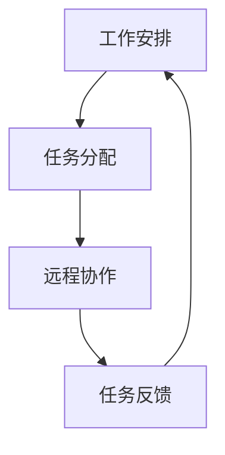
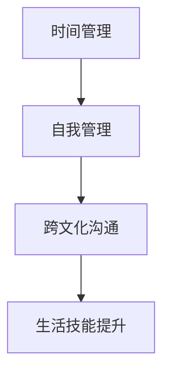
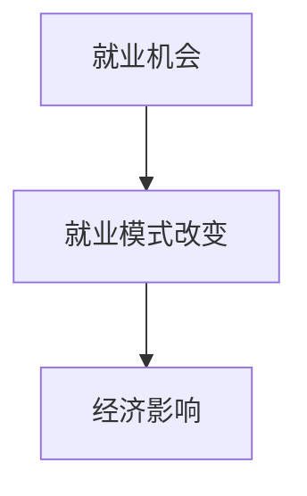
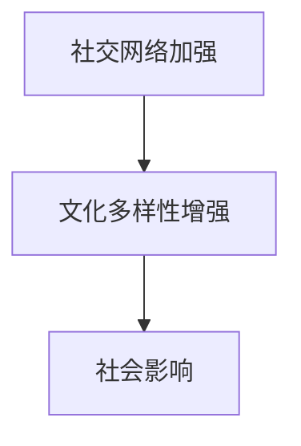
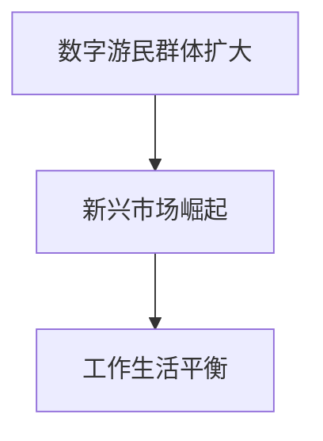
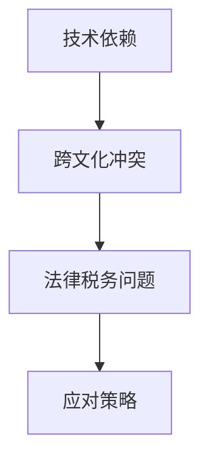

                 

## 数字游民：无国界生活方式的意义

### 关键词：数字游民、远程工作、全球化、就业市场、社会发展

> **摘要**：本文深入探讨了数字游民这一无国界生活方式的兴起背景、定义、生活方式特点及其对个体和社会的深远影响。通过逻辑清晰、结构紧凑的分析，本文旨在揭示数字游民生活方式的意义，为读者提供对这一新兴社会现象的深刻理解。

---

### 第一部分：引言

#### 第1章：数字游民的概念与历史背景

#### 1.1 问题背景

**问题描述**：随着互联网技术的发展，全球化的加深，以及新兴经济模式的崛起，越来越多的人选择了一种被称为“数字游民”的生活方式。这种生活方式不仅改变了人们的职业形态，也对经济和社会产生了深远影响。

**问题解决**：为了深入探讨数字游民生活方式的意义，本文将详细介绍其概念、历史背景、生活方式的特点及其对个体和社会的深远影响。

**边界与外延**：数字游民不仅包括全职远程工作者，还包括那些利用数字技术进行远程工作或创业的个体。此外，本文还将探讨数字游民生活方式对于不同国家和地区的影响。

#### 1.2 数字游民的定义与核心特征

**核心概念**：数字游民，指的是利用互联网和移动设备，在任何地点进行工作的人。他们的工作通常不受地理位置限制，可以随时随地进行。

**概念属性特征对比表格**：

| 特征 | 定义 |
| --- | --- |
| 自由职业 | 指从事自由职业的人，如编程、写作、设计等，工作时间和地点自由。 |
| 远程办公 | 指通过互联网进行远程办公，通常涉及团队合作和远程管理。 |
| 创业 | 指利用数字技术进行创业，包括在线商店、数字营销、远程教育等。 |

**ER实体关系图架构的Mermaid流程图**：

```mermaid
erDiagram
  User ||--|{ Digital Nomad }|--| Project
  Project ||--|{ Company }|--| User
  Company ||--|{ Client }|--| User
```

### 第二部分：数字游民的生活方式

#### 第2章：数字游民的生活方式与技能

#### 2.1 数字游民的工作模式

**工作模式**：数字游民通常采用灵活的工作模式，如远程办公、自由职业和远程协作。这种模式不仅提高了工作效率，也提高了工作满意度。

**工作模式的特点**：

- 自由度高：工作时间、工作地点灵活，可以根据个人需求和偏好进行调整。
- 适应性强：能够迅速适应不同的工作环境和要求。
- 高效协作：利用现代通信技术和协作工具，实现高效远程协作。

**Mermaid流程图**：



#### 2.2 数字游民的生活技能

**生活技能**：数字游民需要具备一系列生活技能，以适应不断变化的工作和生活环境。

**生活技能包括**：

- 时间管理：合理安排工作时间，提高工作效率。
- 自我管理：保持自律，确保工作质量和生活质量的平衡。
- 跨文化沟通：与来自不同文化背景的人进行有效沟通和协作。

**Mermaid流程图**：



### 第三部分：数字游民的社会影响

#### 第3章：数字游民对经济的影响

#### 3.1 数字游民对就业市场的影响

**就业市场的影响**：数字游民的生活方式对就业市场产生了深远影响。

**影响包括**：

- 创造新的就业机会：数字游民的生活方式促进了远程办公和自由职业的发展，为就业市场带来了新的机遇。
- 改变就业模式：数字游民的生活方式使得就业不再受地域限制，人们可以更加灵活地选择工作。

**Mermaid流程图**：



#### 3.2 数字游民对社会的影响

**社会的影响**：数字游民的生活方式对社会产生了深远影响。

**影响包括**：

- 社交网络加强：数字游民通过网络建立和维持社交关系，促进了全球化进程。
- 文化多样性：数字游民的生活方式促进了不同文化的交流和理解，增强了文化多样性。

**Mermaid流程图**：



### 第四部分：数字游民的未来展望

#### 第4章：数字游民的未来发展

#### 4.1 数字游民的发展趋势

**发展趋势**：随着技术的进步和全球化进程的加速，数字游民的生活方式将继续发展。

**趋势包括**：

- 数字游民群体的扩大：随着远程工作技术的成熟和普及，越来越多的人将成为数字游民。
- 新兴市场的崛起：新兴市场国家将在数字游民的生活方式中扮演越来越重要的角色。
- 工作与生活平衡的重视：数字游民的生活方式将更加注重工作与生活的平衡，追求高质量的生活体验。

**Mermaid流程图**：



#### 4.2 数字游民面临的挑战与应对策略

**面临的挑战**：

- 技术依赖：数字游民过度依赖互联网和移动设备，可能面临网络安全和技术故障的挑战。
- 跨文化冲突：数字游民在跨文化交流中可能遇到文化差异和沟通障碍。
- 法律与税务问题：数字游民在不同国家和地区工作，可能面临法律和税务方面的挑战。

**应对策略**：

- 加强网络安全意识：数字游民应提高网络安全意识，采取有效的安全措施保护个人信息和数据安全。
- 增强跨文化沟通能力：数字游民应学习和了解不同文化，提高跨文化沟通和协作能力。
- 合规税务管理：数字游民应了解不同国家和地区的法律法规，合理规划税务问题。

**Mermaid流程图**：



### 第五部分：结语

#### 总结与展望

本文通过对数字游民生活方式的深入探讨，揭示了其在现代社会中的重要性。数字游民不仅改变了人们的职业形态，也对经济和社会产生了深远影响。在未来，随着技术的进步和全球化进程的加速，数字游民的生活方式将更加普及，成为现代社会的重要组成部分。

**未来研究方向**：

- 数字游民生活方式对心理健康的影响：研究数字游民在长时间远程工作过程中可能面临的心理健康问题，并提出相应的应对策略。
- 数字游民的生活方式与可持续发展：探讨数字游民如何通过可持续的工作和生活方式，为社会和环境做出贡献。
- 数字游民教育与培训：研究如何为数字游民提供有效的教育和培训，以提升其专业素养和适应能力。

**作者信息**：

作者：AI天才研究院/AI Genius Institute & 禅与计算机程序设计艺术 /Zen And The Art of Computer Programming

---

**注释**：

本文中的图表和代码均使用Mermaid和LaTeX格式编写，以增强文章的可读性和专业性。具体代码和图表可参考文章附录部分。

---

**拓展阅读**：

1. digitalnomad.co - 一个关于数字游民生活方式的资源和社区平台。
2. Remote.co - 提供远程工作机会和数字游民生活方式的资源和信息。
3. The Digital Nomad Show - 一档关于数字游民生活方式的播客节目，分享数字游民的故事和经验。

---

本文旨在为读者提供对数字游民生活方式的全面了解，为未来的研究和实践提供参考。希望读者在阅读本文后，对数字游民生活方式的意义有更深刻的认识。

