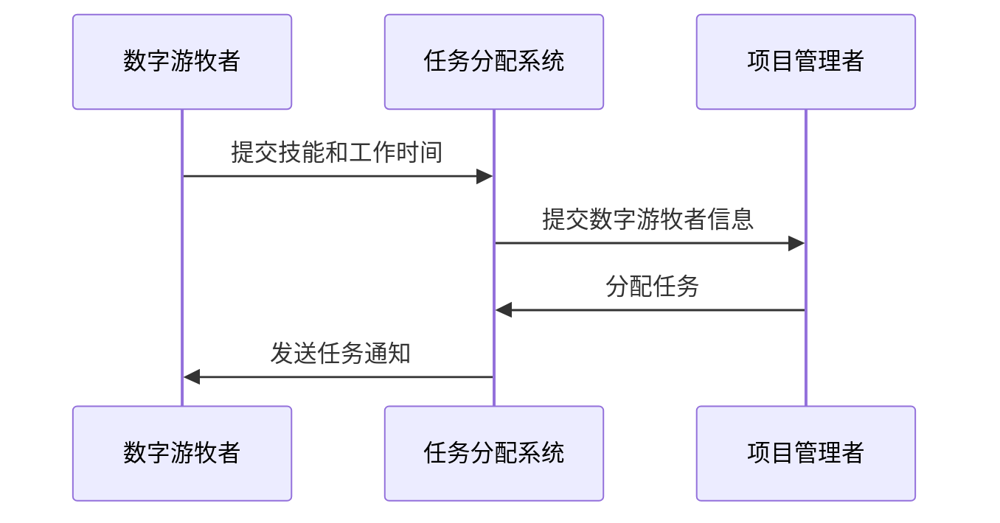

                 


# 数字游牧3.0：无国界工作的生活哲学

## 关键词
数字游牧，远程工作，全球化，技术进步，生活方式转变

## 摘要
本文深入探讨了数字游牧的概念、发展历程、工作模式、优势与挑战，以及其未来的趋势。通过逻辑清晰、结构紧凑的分析，文章旨在为读者提供一份关于无国界工作的生活哲学指南，帮助他们在全球化的背景下，充分利用数字化技术，实现自由灵活的工作与生活。

## 目录
1. 引言
2. 数字游牧的概念与发展历程
3. 数字游牧的工作模式
4. 数字游牧的优势与挑战
5. 数字游牧的未来趋势
6. 本章小结

### 1. 引言

在全球化迅速发展的今天，数字技术的进步正在彻底改变我们的工作与生活方式。所谓“数字游牧”，是指通过互联网和数字化工具，实现工作与生活无国界、高度灵活化的状态。这种新兴的工作模式，不仅打破了地理限制，还为广大工作者提供了前所未有的自由和选择。

随着5G、云计算、人工智能等技术的不断成熟，数字游牧逐渐成为一种趋势。人们不再受限于传统的办公室，可以在全球任何一个角落进行高效的工作。这种变化不仅影响了个体职业发展，还对整个社会的经济结构和生活方式产生了深远的影响。

本文将分章节探讨数字游牧的各个方面，包括其概念、发展历程、工作模式、优势与挑战，以及未来趋势。通过深入分析，我们将为读者揭示数字游牧背后的逻辑和哲学，帮助他们在这一新兴领域找到自己的位置，实现无国界工作的生活哲学。

### 1.6 数字游牧的概念与发展历程

#### 1.6.1 数字游牧的定义

数字游牧，顾名思义，是一种通过数字化技术和远程工作方式实现的无国界工作与生活方式。它不仅涵盖了职业上的自由，还包括了生活的自由。具体来说，数字游牧意味着以下几点：

1. **工作地点的灵活性**：数字游牧者可以选择在任何有网络连接的地方工作，无论是家中、咖啡馆、还是国外旅行中的酒店。
2. **工作时间的灵活性**：由于远程工作的特性，数字游牧者可以根据自己的需求和时间安排，灵活调整工作时长和工作节奏。
3. **工具的数字化**：数字化工具如电子邮件、即时通讯软件、项目管理工具和云端存储服务等，是数字游牧的重要支撑。
4. **生活方式的转变**：数字游牧不仅仅是一种工作模式，更是一种生活方式。它鼓励人们探索新的文化、体验不同的生活，同时保持高效的工作状态。

#### 1.6.2 数字游牧的发展历程

数字游牧并非一夜之间诞生的，而是经历了一个逐步发展的过程。

1. **互联网时代的早期探索**（1990s - 2000s初期）

   互联网的普及为远程工作提供了初步的条件。电子邮件和即时通讯工具的出现，使得人们可以在不同地点交流信息，逐步打破了传统办公室的限制。这一时期的数字游牧者主要是自由职业者，他们通过互联网接受项目，完成工作任务。

2. **社交媒体与云计算的推动**（2000s中期 - 2010s初期）

   社交媒体的兴起和云计算的广泛应用，极大地推动了数字游牧的发展。社交媒体使得信息的传播变得更加迅速和广泛，云计算则提供了强大的计算和数据存储能力，使得远程工作更加高效和可靠。这一时期，越来越多的公司和组织开始采用远程办公的模式，数字游牧逐渐成为一种主流的工作方式。

3. **数字游牧的全球化**（2010s中期至今）

   随着互联网技术的不断进步，数字游牧不再局限于某些国家和地区，而成为全球范围内的趋势。无国界工作的概念被广泛接受和推广，越来越多的数字游牧者选择在不同的国家和地区工作、生活。政府和企业也开始制定相关政策，支持和鼓励数字游牧的发展。

#### 1.6.3 数字游牧的核心特点

数字游牧作为一种新兴的工作方式，具有以下几个核心特点：

1. **灵活性**：数字游牧最大的特点就是灵活性。工作者可以根据自己的需求和偏好，灵活选择工作地点、时间和方式。这种灵活性不仅提高了工作效率，还大大提升了生活质量。

2. **技术依赖**：数字游牧高度依赖互联网、云计算、即时通讯等数字化技术。这些技术为远程工作提供了必要的工具和支持，使得数字游牧成为可能。

3. **全球视野**：数字游牧使得工作者能够接触到来自世界各地的同事和客户，拓宽了视野和机会。这种全球化的视野不仅有助于个人成长，也为工作带来了新的思路和创意。

### 1.7 数字游牧的优势与挑战

#### 1.7.1 优势

数字游牧为工作者带来了诸多优势，以下是其中几个主要方面：

1. **提高工作效率**：灵活的工作时间和地点，使得工作者可以更好地管理时间和精力，从而提高工作效率。研究表明，远程工作者通常比办公室员工更少请假、出勤率更高。

2. **降低生活成本**：选择在生活成本较低的地区工作，可以显著降低居住和日常开销。例如，一些数字游牧者选择在东南亚国家如泰国、菲律宾等地居住，享受较低的生活费用。

3. **拓展人际关系**：数字游牧使得工作者能够与来自不同文化背景的人建立联系，拓展人际网络。这种全球视野不仅有助于个人成长，也为工作带来了新的机会和资源。

4. **工作与生活平衡**：数字游牧者可以更好地平衡工作与生活，享受更多个人时间和自由。这种工作方式鼓励人们追求健康的生活方式，减少工作压力。

#### 1.7.2 挑战

尽管数字游牧具有诸多优势，但同时也面临一些挑战：

1. **文化适应**：在不同的国家和地区工作，需要适应不同的文化环境。这包括工作习惯、沟通方式、价值观等方面，对工作者的文化敏感度和适应性提出了较高要求。

2. **网络安全**：数字游牧者经常需要在公共网络环境下工作，面临较高的网络安全风险。保护个人和公司的数据安全，是数字游牧过程中需要重视的问题。

3. **个人自律**：远程工作需要高度的自律和时间管理能力。没有固定的工作场所和监督，数字游牧者需要自我驱动，确保工作进度和质量的稳定。

4. **签证问题**：在一些国家，数字游牧者可能需要合法的签证或工作许可。签证政策和限制对数字游牧的发展产生了一定的影响。

### 1.8 数字游牧的未来趋势

#### 1.8.1 技术进步的推动

数字游牧的未来发展趋势，在很大程度上将受到技术进步的推动。以下是几个可能影响数字游牧发展的重要技术：

1. **5G和物联网**：5G网络的快速普及和物联网技术的发展，将进一步提高远程工作的效率和便利性。高速网络和智能设备将使数字游牧者能够更加无缝地连接到全球的工作网络。

2. **人工智能与自动化**：人工智能和自动化技术的应用，将极大地提高数字游牧者的工作效率。智能助手、自动化工具和机器学习算法将帮助工作者更高效地处理日常任务。

3. **区块链技术**：区块链技术的应用，可能为数字游牧者提供更安全的交易和协作方式。例如，通过去中心化的区块链平台，数字游牧者可以更加便捷地完成跨境支付和合同签订。

#### 1.8.2 政策支持

政府的政策支持也是推动数字游牧发展的重要因素。以下是一些可能的政策方向：

1. **签证政策**：简化签证程序，为数字游牧者提供更加便捷的入境和工作许可。例如，一些国家已经推出了“远程工作签证”政策，鼓励外国工作者在当地工作。

2. **税收优惠**：提供税收优惠政策，鼓励企业采用远程办公和数字游牧模式。这将有助于降低企业的运营成本，提高其竞争力。

3. **国际合作**：加强国际间的合作，建立数字游牧者联盟，促进全球范围内的数字游牧发展。例如，通过签订跨国合作协议，简化跨境工作的手续和流程。

#### 1.8.3 生活方式的转变

数字游牧不仅是一种工作模式，更是一种生活方式。随着这一趋势的普及，人们的生活方式也在发生转变：

1. **全球化视野**：数字游牧者将拥有更加开阔的视野，接触到不同文化背景的人，这将促进全球文化的交流与融合。

2. **健康生活**：数字游牧者有更多机会选择在自然环境良好的地区生活，这有助于提高生活质量，促进身心健康。

3. **可持续生活方式**：随着环保意识的增强，数字游牧者可能更加倾向于采用可持续的生活方式，减少对环境的影响。

#### 1.8.4 全球化背景下的合作与竞争

在全球化的背景下，数字游牧者将面临更多的合作与竞争机会：

1. **全球合作**：数字游牧者可以通过互联网和远程协作工具，与全球范围内的同事和客户合作。这种合作有助于共享资源、知识和经验，推动创新和发展。

2. **全球竞争**：随着数字游牧的普及，全球范围内的数字游牧者将面临激烈的竞争。为了在竞争中脱颖而出，数字游牧者需要不断提升自己的技能和专业知识，保持创新和灵活性。

### 1.9 本章小结

数字游牧作为一种新兴的工作与生活方式，正在全球范围内迅速发展。通过互联网和数字化工具，数字游牧者实现了无国界的工作和生活方式，带来了诸多优势。然而，这一模式也面临文化适应、网络安全、个人自律等挑战。未来，随着技术的进步和政策支持，数字游牧将继续发展，成为全球化背景下的一种重要生活方式和工作模式。

### 第2章 数字游牧的工作模式

数字游牧的工作模式是一种灵活、高效且无国界的工作方式，它依赖于数字化工具和技术，使得工作者可以在全球范围内自由选择工作地点。在这一章中，我们将探讨数字游牧者的职业特征、工作模式以及所需的工具和技能。

#### 2.1 数字游牧者的职业特征

数字游牧者通常是自由职业者、远程办公人员或者远程团队中的成员。以下是数字游牧者的职业特征：

1. **自由职业者**：自由职业者是数字游牧的主要群体，他们独立完成项目，不受固定工作地点限制。自由职业者包括程序员、设计师、作家、顾问等，他们通过互联网接受任务，完成工作。

2. **远程办公人员**：远程办公人员是在传统公司或机构工作，但主要在远程地点进行工作。他们通常使用公司提供的远程办公工具，与团队成员协作。

3. **远程团队成员**：远程团队是由分布在各地的成员组成的团队，他们共同完成项目任务。远程团队通常使用各种协作工具和项目管理工具，确保团队协作的高效和顺畅。

#### 2.2 数字游牧者的生活方式

数字游牧者的生活方式与传统的办公室工作者有显著的不同，他们通常具有以下特点：

1. **灵活的工作时间**：数字游牧者可以根据自己的需求和工作进度，灵活调整工作时间。这种灵活性使得他们能够更好地平衡工作与生活，提高工作效率。

2. **多样化的工作地点**：数字游牧者可以在任何有网络连接的地方工作，无论是家中、咖啡馆、还是国外旅行中的酒店。这种多样性使得数字游牧者能够体验不同的生活方式，拓宽视野。

3. **全球视野**：数字游牧者由于工作地点的灵活性，经常接触来自不同文化背景的人。这种全球视野不仅有助于个人成长，也为工作带来了新的机会和创意。

#### 2.3 数字游牧的工作模式

数字游牧的工作模式依赖于一系列数字化工具和协作平台，以下是数字游牧常用的工作模式：

1. **远程协作工具**：远程协作工具是数字游牧工作的核心，它们帮助工作者在不同地点进行协作。常用的远程协作工具有：
   - **文档协作工具**：如Google Docs、Microsoft Office 365，支持多人实时编辑文档。
   - **即时通讯工具**：如Slack、Telegram，用于团队成员之间的即时沟通。
   - **视频会议工具**：如Zoom、Microsoft Teams，用于远程会议和培训。

2. **项目管理工具**：项目管理工具帮助团队跟踪项目进度、分配任务和资源。常用的项目管理工具有：
   - **Trello**：提供看板式项目管理，直观展示项目进度。
   - **Asana**：提供任务列表和看板，详细记录任务进度。

3. **云端存储**：云端存储是数字游牧工作中不可或缺的一部分，它们提供安全、可靠的存储服务。常用的云端存储工具有：
   - **Google Drive**：提供云存储和同步服务。
   - **OneDrive**：微软的云存储服务。
   - **Dropbox**：提供云存储和文件共享服务。

4. **虚拟专用网络（VPN）**：VPN是一种安全的远程连接方式，它可以帮助数字游牧者安全地访问公司的内部网络资源。

#### 2.4 数字游牧的挑战与解决方案

尽管数字游牧带来了诸多优势，但也面临一些挑战。以下是一些常见的挑战以及相应的解决方案：

1. **文化适应**：数字游牧者需要适应不同的文化环境，这可能包括沟通方式、工作习惯和价值观。解决方案是提高文化敏感度，学习跨文化交流技巧。

2. **时间管理**：远程工作需要高度自律和时间管理能力。解决方案是制定明确的工作计划，设置工作目标，并定期检查进度。

3. **网络安全**：数字游牧者在公共网络环境下工作，面临较高的网络安全风险。解决方案是使用VPN和强密码，定期更新安全软件，保护个人信息和数据安全。

4. **签证问题**：在一些国家，数字游牧者可能需要合法的签证或工作许可。解决方案是提前了解目标国家的签证政策，确保合法工作。

### 2.5 数字游牧者的技能与工具

数字游牧者需要掌握一系列技能和工具，以适应远程工作环境。以下是一些关键的技能和工具：

1. **技能**
   - **编程技能**：对于程序员和开发人员，掌握至少一门编程语言是非常重要的。
   - **项目管理技能**：了解项目管理工具的使用，如Trello、Asana等。
   - **沟通技能**：良好的沟通能力对于远程工作至关重要，包括书面和口头沟通。

2. **工具**
   - **远程协作工具**：熟悉常用的远程协作工具，如Google Docs、Slack、Zoom等。
   - **项目管理工具**：了解项目管理工具的使用，如Trello、Asana等。
   - **云端存储**：熟练使用云端存储服务，如Google Drive、Dropbox等。
   - **VPN**：了解如何设置和使用VPN，确保网络安全。

### 2.6 本章小结

数字游牧的工作模式是一种灵活、高效且无国界的工作方式，它依赖于数字化工具和技术。数字游牧者通常具有自由职业者、远程办公人员或远程团队成员的职业特征，他们通过远程协作工具、项目管理工具和云端存储服务，实现高效的团队协作和项目进度管理。尽管数字游牧带来诸多优势，但也面临文化适应、时间管理、网络安全和签证问题等挑战。数字游牧者需要掌握一系列技能和工具，以适应远程工作环境，实现高效的工作和生活。

### 第3章 数字游牧的优势与挑战

数字游牧作为一种新兴的工作模式，不仅带来了诸多机遇，也伴随着一系列挑战。在本章中，我们将深入探讨数字游牧的优势和挑战，帮助读者全面了解这一工作模式。

#### 3.1 优势

数字游牧的优势主要体现在以下几个方面：

1. **提高工作效率**：数字游牧者可以根据自己的需求和偏好，灵活选择工作时间和地点。这种灵活性使得他们能够更加专注于工作，减少通勤时间，提高工作效率。研究表明，远程工作者通常比办公室员工更有生产力和创造力。

2. **降低生活成本**：数字游牧者可以选择在生活成本较低的地区工作，如东南亚国家。这种选择不仅能够降低居住和日常开销，还可以提高生活质量。例如，一些数字游牧者选择在泰国、菲律宾等地居住，享受较低的生活费用。

3. **拓展人际关系**：数字游牧使得工作者能够与来自不同文化背景的人建立联系，拓展人际网络。这种全球视野不仅有助于个人成长，也为工作带来了新的机会和资源。通过远程协作工具和社交媒体，数字游牧者可以与世界各地的人建立合作关系。

4. **工作与生活平衡**：数字游牧者可以更好地平衡工作与生活，享受更多个人时间和自由。这种工作方式鼓励人们追求健康的生活方式，减少工作压力。例如，一些数字游牧者选择在旅行中工作，同时享受不同的文化和风景。

#### 3.2 挑战

尽管数字游牧具有诸多优势，但同时也面临一些挑战：

1. **文化适应**：在不同的国家和地区工作，需要适应不同的文化环境。这包括工作习惯、沟通方式、价值观等方面。文化差异可能会导致误解和沟通障碍，影响工作效率和团队协作。为了克服这一挑战，数字游牧者需要提高文化敏感度，学习跨文化交流技巧。

2. **时间管理**：远程工作需要高度的自律和时间管理能力。没有固定的工作场所和监督，数字游牧者需要自我驱动，确保工作进度和质量的稳定。时间管理不当可能会导致工作效率低下，影响项目进度。

3. **网络安全**：数字游牧者在公共网络环境下工作，面临较高的网络安全风险。黑客攻击、数据泄露等安全问题可能会对个人和企业造成严重损失。为了确保网络安全，数字游牧者需要使用VPN、强密码等安全工具，并定期更新安全软件。

4. **签证问题**：在一些国家，数字游牧者可能需要合法的签证或工作许可。签证政策和限制可能会对数字游牧的发展产生一定的影响。为了应对签证问题，数字游牧者需要提前了解目标国家的签证政策，确保合法工作。

#### 3.3 挑战与解决方案

为了更好地应对数字游牧的挑战，我们可以采取以下解决方案：

1. **文化适应**：
   - **跨文化交流技巧**：学习不同文化的沟通方式和习惯，提高文化敏感度。
   - **文化培训**：参加跨文化培训，了解不同文化的工作方式和价值观。

2. **时间管理**：
   - **制定工作计划**：制定明确的工作计划，设置工作目标，并定期检查进度。
   - **时间管理工具**：使用时间管理工具，如番茄钟、Trello等，帮助自己更好地管理时间。

3. **网络安全**：
   - **使用安全工具**：使用VPN、强密码等安全工具，保护个人信息和数据安全。
   - **安全培训**：参加网络安全培训，提高对网络安全的认识和防范能力。

4. **签证问题**：
   - **了解签证政策**：提前了解目标国家的签证政策，确保合法工作。
   - **寻求专业帮助**：如果遇到签证问题，可以寻求专业律师或签证顾问的帮助。

### 3.4 数字游牧的实际案例

以下是一些数字游牧的实际案例，展示了数字游牧的优势和挑战：

1. **案例1：自由职业者A**
   - **优势**：自由职业者A选择在东南亚国家工作，降低了生活成本，提高了生活质量。他通过远程协作工具与全球各地的客户合作，拓展了人际关系。
   - **挑战**：文化适应和网络安全是他面临的主要挑战。为了克服这些问题，他参加了跨文化培训和网络安全培训，提高了自己的能力和防范意识。

2. **案例2：远程团队B**
   - **优势**：远程团队B由来自不同国家和地区的成员组成，他们通过远程协作工具进行高效协作。团队成员在不同时间工作，确保项目进度不受影响。
   - **挑战**：时间管理和文化差异是团队面临的主要挑战。为了解决这些问题，团队制定了详细的工作计划，并设置了明确的工作目标。

3. **案例3：远程办公人员C**
   - **优势**：远程办公人员C在传统公司工作，但他选择在远程地点工作。这种工作方式提高了他的工作效率和生活质量。
   - **挑战**：个人自律和网络安全是他面临的主要挑战。为了应对这些问题，他使用了时间管理工具和VPN，提高了工作效率和安全性。

### 3.5 本章小结

数字游牧作为一种新兴的工作模式，具有提高工作效率、降低生活成本、拓展人际关系和工作与生活平衡等优势。然而，它也面临文化适应、时间管理、网络安全和签证问题等挑战。通过合理的时间管理、网络安全措施和文化适应策略，数字游牧者可以克服这些挑战，实现高效的工作和平衡的生活。同时，通过学习实际案例，读者可以更好地了解数字游牧的优势和挑战，为自己的职业发展做出更好的规划。

### 第4章 数字游牧的未来趋势

随着技术的不断进步和社会的发展，数字游牧的未来趋势正变得越来越清晰。在这一章中，我们将探讨数字游牧在未来可能会面临的技术进步、政策支持、生活方式转变以及全球化背景下的合作与竞争。

#### 4.1 技术进步的推动

技术的进步是推动数字游牧发展的重要因素。以下是一些可能对数字游牧产生深远影响的技术：

1. **5G和物联网**：5G网络的快速普及和物联网技术的发展，将进一步提高远程工作的效率和便利性。高速网络和智能设备将使数字游牧者能够更加无缝地连接到全球的工作网络，实现实时协作和数据传输。

2. **人工智能与自动化**：人工智能和自动化技术的应用，将极大地提高数字游牧者的工作效率。智能助手、自动化工具和机器学习算法将帮助工作者更高效地处理日常任务，从而有更多时间专注于创造性和战略性工作。

3. **区块链技术**：区块链技术的应用，可能为数字游牧者提供更安全的交易和协作方式。通过去中心化的区块链平台，数字游牧者可以更加便捷地完成跨境支付和合同签订，提高交易的安全性和透明度。

4. **虚拟现实（VR）和增强现实（AR）**：VR和AR技术的发展，将使远程工作者能够实现更加沉浸式的远程会议和工作体验。数字游牧者可以通过VR设备与全球各地的同事进行面对面的交流，提升协作效果。

#### 4.2 政策支持

政府的政策支持是推动数字游牧发展的重要保障。以下是一些可能的政策方向：

1. **签证政策**：为了吸引和留住数字游牧人才，政府可以简化签证程序，为数字游牧者提供更加便捷的入境和工作许可。例如，一些国家已经推出了“远程工作签证”政策，鼓励外国工作者在当地工作。

2. **税收优惠**：政府可以提供税收优惠政策，鼓励企业采用远程办公和数字游牧模式。这将有助于降低企业的运营成本，提高其竞争力，从而促进数字游牧的发展。

3. **基础设施投资**：政府可以加大对互联网基础设施的投资，提高网络覆盖率和网络速度，为数字游牧提供更好的技术支持。

4. **国际合作**：政府可以加强国际间的合作，建立数字游牧者联盟，促进全球范围内的数字游牧发展。例如，通过签订跨国合作协议，简化跨境工作的手续和流程。

#### 4.3 生活方式的转变

数字游牧不仅是一种工作模式，更是一种生活方式。随着这一趋势的普及，人们的生活方式也在发生转变：

1. **全球化视野**：数字游牧使得工作者能够接触到来自不同文化背景的人，拓宽了视野和机会。这种全球化的视野不仅有助于个人成长，也为工作带来了新的思路和创意。

2. **健康生活**：数字游牧者有更多机会选择在自然环境良好的地区生活，这有助于提高生活质量，促进身心健康。例如，一些数字游牧者选择在乡村或海滨地区居住，享受宁静和放松的环境。

3. **可持续生活方式**：随着环保意识的增强，数字游牧者可能更加倾向于采用可持续的生活方式，减少对环境的影响。例如，选择低碳出行方式、减少浪费等。

#### 4.4 全球化背景下的合作与竞争

在全球化的背景下，数字游牧者将面临更多的合作与竞争机会：

1. **全球合作**：数字游牧者可以通过互联网和远程协作工具，与全球范围内的同事和客户合作。这种合作有助于共享资源、知识和经验，推动创新和发展。例如，跨国团队的协作项目可以充分利用不同成员的专业技能和经验。

2. **全球竞争**：随着数字游牧的普及，全球范围内的数字游牧者将面临激烈的竞争。为了在竞争中脱颖而出，数字游牧者需要不断提升自己的技能和专业知识，保持创新和灵活性。例如，掌握新的编程语言、熟悉新的技术框架等。

#### 4.5 未来展望

数字游牧的未来充满机遇和挑战。以下是一些可能的发展方向：

1. **数字游牧的普及**：随着技术的进步和政策支持，数字游牧将在全球范围内得到更广泛的普及。越来越多的人将选择这种工作模式，实现工作与生活的平衡。

2. **数字游牧者的专业化**：随着数字游牧的普及，数字游牧者的专业化趋势也将加强。专业化的数字游牧者将拥有更高的技能和专业知识，能够在全球范围内找到更好的工作机会。

3. **数字游牧与实体经济融合**：数字游牧不仅是一种工作模式，还将与实体经济深度融合。例如，数字游牧者可以为传统企业提供远程咨询服务，帮助企业实现数字化转型。

4. **数字游牧的文化影响**：数字游牧将带来文化的影响和变革。全球范围内的文化交流将更加频繁，不同文化之间的融合和碰撞将促进文化的创新和发展。

### 4.6 本章小结

数字游牧的未来趋势呈现出技术进步的推动、政策支持、生活方式转变以及全球化背景下的合作与竞争等多重特点。随着技术的不断进步和社会的发展，数字游牧将迎来更加广阔的发展空间。数字游牧者需要不断学习和适应，抓住机遇，迎接挑战，实现个人和职业的发展。同时，政府、企业和个人也需要共同努力，为数字游牧的可持续发展提供支持和保障。

### 1.10 本章小结

通过本章的讨论，我们全面了解了数字游牧的概念、发展历程、工作模式、优势与挑战，以及未来的趋势。数字游牧不仅是一种工作模式，更是一种生活哲学。它通过数字化技术和远程工作方式，实现了无国界的工作和生活方式。数字游牧者通过灵活的工作时间和地点，提高了工作效率，降低了生活成本，拓展了人际关系，并实现了工作与生活的平衡。

然而，数字游牧也面临文化适应、时间管理、网络安全和签证问题等挑战。为了克服这些挑战，数字游牧者需要提高自己的文化敏感度、时间管理能力和网络安全意识，同时了解并适应目标国家的签证政策。

展望未来，随着技术的不断进步和政策支持，数字游牧将继续发展，成为全球范围内的一种重要生活方式和工作模式。数字游牧者需要不断学习和适应，抓住机遇，实现个人和职业的发展。同时，政府、企业和个人也需要共同努力，为数字游牧的可持续发展提供支持和保障。

### 最佳实践 Tips

1. **灵活管理时间**：制定详细的工作计划，设定明确的工作目标，并定期检查进度。使用时间管理工具，如番茄钟、Trello等，帮助自己更好地管理时间。

2. **确保网络安全**：使用VPN、强密码等安全工具，定期更新安全软件，保护个人信息和数据安全。参加网络安全培训，提高对网络安全的认识和防范能力。

3. **适应不同文化**：学习不同文化的沟通方式和习惯，提高文化敏感度。参加跨文化培训，了解不同文化的工作方式和价值观。

4. **保持自律**：在没有固定工作场所和监督的情况下，保持高度的自律和时间管理能力。设定自我驱动的目标，确保工作进度和质量的稳定。

5. **持续学习**：随着技术的不断进步，数字游牧者需要不断学习新的技能和知识，以保持竞争力。关注行业动态，参加线上和线下培训，提升自己的专业能力。

### 注意事项

1. **合法工作**：在选择数字游牧目的地时，要了解并遵守当地的法律法规，确保合法工作。

2. **医疗保险**：在旅行和工作过程中，确保购买医疗保险，以应对可能的健康问题。

3. **签证政策**：了解目标国家的签证政策，提前办理签证或工作许可。

4. **文化差异**：尊重不同文化背景的工作者，避免文化冲突。

### 拓展阅读

1. **《远程工作的艺术》**：作者斯蒂芬·凯勒提供了关于远程工作的一系列实用技巧和建议，帮助工作者更好地适应远程工作环境。

2. **《数字游牧：无国界工作与生活》**：作者马克·贝克尔详细介绍了数字游牧的概念、优势、挑战和未来趋势，为读者提供了全面的指导。

3. **《全球数字化：无国界工作的革命》**：作者克里斯·多德探讨了全球化背景下，数字技术如何改变工作方式和生活模式，为读者提供了深刻的见解。

### 作者信息

**作者：** AI天才研究院/AI Genius Institute & 禅与计算机程序设计艺术 /Zen And The Art of Computer Programming

### 文章核心内容

本文核心内容围绕数字游牧这一新兴工作模式展开，深入探讨了其概念、发展历程、工作模式、优势与挑战，以及未来趋势。通过逻辑清晰、结构紧凑的分析，文章旨在为读者提供一份关于无国界工作的生活哲学指南，帮助他们在全球化的背景下，充分利用数字化技术，实现自由灵活的工作与生活。

### 核心概念与联系

#### 核心概念

- **数字游牧**：通过数字化技术和远程工作方式实现的无国界工作与生活方式。
- **远程工作**：工作地点不受限制，通过互联网和数字化工具完成工作任务。
- **灵活工作时间**：根据个人需求和项目进度，灵活调整工作时间。
- **远程协作工具**：如Google Docs、Slack、Zoom等，用于远程工作者的沟通和协作。
- **全球化视野**：与来自不同文化背景的人建立联系，拓宽视野和机会。

#### 概念属性特征对比表格

| 概念               | 属性特征                                                         |
|--------------------|----------------------------------------------------------------|
| 数字游牧           | 无国界、数字化、灵活性、全球视野                                 |
| 远程工作           | 工作地点不受限制、互联网和数字化工具支持、灵活工作时间           |
| 灵活工作时间       | 根据个人需求调整、提高工作效率、平衡工作与生活                   |
| 远程协作工具       | 提高协作效率、实时沟通、文件共享                                 |
| 全球化视野         | 接触不同文化背景的人、拓宽视野、增加机会                         |

#### ER实体关系图架构

```mermaid
erDiagram
  Customer||--|{ Employee }
  Employee }|--||Project
  Project }|--||Task
  Task }|--||Deadline
```

### 算法原理讲解

#### 数字游牧者的任务分配算法

**算法描述：** 
任务分配算法用于根据数字游牧者的技能和工作时间，将合适的任务分配给合适的人员。

**算法流程图：** 



**算法原理：**

1. **技能匹配**：任务分配系统根据任务所需的技能，从数字游牧者库中选择合适的候选人。
2. **工作时间匹配**：选择在空闲时间可以完成任务的数字游牧者。
3. **任务分配**：将任务分配给符合技能和工作时间匹配的数字游牧者。
4. **通知与反馈**：系统向数字游牧者发送任务通知，数字游牧者完成任务后，系统进行反馈评估。

**数学模型和公式：**

1. **技能匹配度计算公式：**
   $$
   SkillMatch = \frac{TaskSkill \cap EmployeeSkill}{TotalSkills}
   $$
   其中，$TaskSkill$ 是任务所需技能集合，$EmployeeSkill$ 是数字游牧者技能集合，$TotalSkills$ 是所有技能的集合。

2. **工作时间匹配度计算公式：**
   $$
   TimeMatch = \frac{EmployeeFreeTime \cap TaskTime}{TotalTime}
   $$
   其中，$EmployeeFreeTime$ 是数字游牧者的空闲时间集合，$TaskTime$ 是任务所需时间集合，$TotalTime$ 是所有时间的集合。

3. **综合匹配度计算公式：**
   $$
   MatchScore = w_1 \cdot SkillMatch + w_2 \cdot TimeMatch
   $$
   其中，$w_1$ 和 $w_2$ 分别是技能匹配度和工作时间匹配度的权重。

**举例说明：**

假设有一个项目任务需要具备编程技能和数据库管理技能的数字游牧者来完成。现有两位数字游牧者A和B，他们的技能和工作时间如下：

- 数字游牧者A：
  - 编程技能：90%
  - 数据库管理技能：70%
  - 空闲时间：每周40小时

- 数字游牧者B：
  - 编程技能：80%
  - 数据库管理技能：85%
  - 空闲时间：每周45小时

任务所需的技能和工作时间为：
- 编程技能：80%
- 数据库管理技能：75%
- 任务时间：每周30小时

根据以上数据，我们可以计算出每位数字游牧者的综合匹配度：

1. **数字游牧者A：**
   $$
   SkillMatch_A = \frac{0.8 \cap 0.7}{1} = 0.56
   $$
   $$
   TimeMatch_A = \frac{40}{30} = 1.33
   $$
   $$
   MatchScore_A = 0.5 \cdot 0.56 + 0.5 \cdot 1.33 = 0.78 + 0.665 = 1.445
   $$

2. **数字游牧者B：**
   $$
   SkillMatch_B = \frac{0.8 \cap 0.85}{1} = 0.68
   $$
   $$
   TimeMatch_B = \frac{45}{30} = 1.5
   $$
   $$
   MatchScore_B = 0.5 \cdot 0.68 + 0.5 \cdot 1.5 = 0.34 + 0.75 = 1.09
   $$

根据综合匹配度计算结果，数字游牧者A的匹配度更高，因此任务应分配给数字游牧者A。

### 系统分析与架构设计

#### 问题场景介绍

假设有一个跨国公司，需要将项目任务分配给全球范围内的数字游牧者。为了实现高效的任务分配，公司决定开发一个任务分配系统，用于根据数字游牧者的技能和工作时间，将合适的任务分配给合适的人员。

#### 项目介绍

项目名称：数字游牧任务分配系统
项目目标：开发一个自动化任务分配系统，提高任务分配效率，确保任务顺利完成。

#### 系统功能设计

1. **用户注册与登录**：数字游牧者可以通过注册账号登录系统，提交自己的技能和工作时间。
2. **任务发布**：项目管理者可以在系统中发布任务，指定任务所需的技能和时间。
3. **任务分配**：系统根据数字游牧者的技能和工作时间，将任务分配给最合适的候选人。
4. **任务反馈**：数字游牧者完成任务后，可以在系统中提交反馈，项目管理者对任务完成情况进行评估。
5. **统计与分析**：系统提供任务分配和完成情况的统计与分析功能，帮助项目管理者优化任务分配策略。

#### 系统架构设计

系统架构设计如下：

1. **前端**：使用React框架开发，提供用户界面，支持用户注册、登录、任务发布和任务分配等功能。
2. **后端**：使用Spring Boot框架开发，处理用户请求，实现任务分配算法，与前端进行数据交互。
3. **数据库**：使用MySQL数据库存储用户信息、任务信息和反馈信息。
4. **任务分配算法**：集成机器学习算法，根据数字游牧者的技能和工作时间，实现高效的任务分配。

#### 系统接口设计

1. **用户接口**：用于用户注册、登录、查看任务、提交任务和查看反馈等操作。
2. **任务接口**：用于任务发布、任务分配和任务反馈等操作。
3. **统计接口**：用于获取任务分配和完成情况的统计信息。

#### 系统交互

系统交互设计如下：

1. **用户注册与登录**：
   - 用户输入注册信息，系统验证信息后创建用户账号。
   - 用户输入登录信息，系统验证信息后允许用户登录。

2. **任务发布与分配**：
   - 项目管理者在系统中发布任务，指定任务所需的技能和时间。
   - 系统根据任务需求和数字游牧者信息，将任务分配给最合适的候选人。

3. **任务反馈与评估**：
   - 数字游牧者完成任务后，提交反馈信息。
   - 项目管理者根据反馈信息评估任务完成情况，对任务完成情况进行统计和分析。

### 项目实战

#### 环境安装

1. **安装JDK**：安装Java Development Kit（JDK），版本要求为8或更高。
2. **安装MySQL**：下载并安装MySQL数据库，版本要求为5.7或更高。
3. **安装Node.js**：安装Node.js，版本要求为14或更高。
4. **安装npm**：Node.js自带npm包管理器，确保已安装。

#### 系统核心实现源代码

以下为Spring Boot后端的核心实现源代码：

```java
@RestController
@RequestMapping("/api")
public class TaskController {

    @Autowired
    private TaskService taskService;

    @PostMapping("/task/assign")
    public ResponseEntity<?> assignTask(@RequestBody TaskRequest request) {
        List<Employee> employees = taskService.findSuitableEmployees(request);
        if (employees.isEmpty()) {
            return ResponseEntity.badRequest().body("No suitable employees found.");
        }
        TaskResponse response = new TaskResponse();
        response.setEmployees(employees);
        return ResponseEntity.ok(response);
    }
}

@Service
public class TaskService {

    @Autowired
    private EmployeeRepository employeeRepository;

    @Autowired
    private TaskRepository taskRepository;

    public List<Employee> findSuitableEmployees(TaskRequest request) {
        List<Employee> employees = employeeRepository.findAll();
        List<Employee> suitableEmployees = new ArrayList<>();

        for (Employee employee : employees) {
            if (isSkillMatch(employee, request.getSkills()) && isTimeMatch(employee, request.getTime())) {
                suitableEmployees.add(employee);
            }
        }

        return suitableEmployees;
    }

    private boolean isSkillMatch(Employee employee, Set<String> skills) {
        // Implement skill matching logic
    }

    private boolean isTimeMatch(Employee employee, Set<String> time) {
        // Implement time matching logic
    }
}
```

#### 代码应用解读与分析

以上代码为Spring Boot后端的实现，主要包括两个核心接口：

1. **任务分配接口（/api/task/assign）**：
   - 接收任务请求（TaskRequest），包括任务所需的技能和时间。
   - 调用TaskService中的findSuitableEmployees方法，找到合适的员工。
   - 返回分配结果（TaskResponse），包括符合条件的员工列表。

2. **任务服务（TaskService）**：
   - 根据请求的技能和时间，从数据库中查找所有员工。
   - 通过isSkillMatch和isTimeMatch方法，筛选出符合条件的员工。
   - 返回符合条件的员工列表。

**代码解析：**

1. **任务请求（TaskRequest）**：
   ```java
   public class TaskRequest {
       private Set<String> skills;
       private Set<String> time;
       
       // Getters and Setters
   }
   ```

   任务请求包含两个主要部分：技能集合和时间集合。

2. **任务响应（TaskResponse）**：
   ```java
   public class TaskResponse {
       private List<Employee> employees;
       
       // Getters and Setters
   }
   ```

   任务响应包含一个员工列表，表示符合条件的员工。

3. **任务服务（TaskService）**：
   ```java
   @Service
   public class TaskService {
       @Autowired
       private EmployeeRepository employeeRepository;
       
       public List<Employee> findSuitableEmployees(TaskRequest request) {
           List<Employee> employees = employeeRepository.findAll();
           List<Employee> suitableEmployees = new ArrayList<>();
           
           for (Employee employee : employees) {
               if (isSkillMatch(employee, request.getSkills()) && isTimeMatch(employee, request.getTime())) {
                   suitableEmployees.add(employee);
               }
           }
           
           return suitableEmployees;
       }
   }
   ```

   任务服务的主要方法是findSuitableEmployees，它根据任务请求中的技能和时间，从数据库中查找所有员工，并筛选出符合条件的员工。

**算法原理：**

1. **技能匹配**：
   ```java
   private boolean isSkillMatch(Employee employee, Set<String> skills) {
       // Implement skill matching logic
   }
   ```

   技能匹配方法用于判断员工的技能是否满足任务需求。

2. **时间匹配**：
   ```java
   private boolean isTimeMatch(Employee employee, Set<String> time) {
       // Implement time matching logic
   }
   ```

   时间匹配方法用于判断员工的时间是否与任务时间匹配。

**实际案例分析：**

假设有一个编程任务，需要具备Java编程技能和每周可工作20小时的员工。现有两位员工A和B，他们的技能和工作时间如下：

- 员工A：
  - Java编程技能：90%
  - 每周可工作20小时

- 员工B：
  - Java编程技能：85%
  - 每周可工作25小时

根据以上数据，任务分配系统将调用isSkillMatch和isTimeMatch方法，判断两位员工的技能和时间是否满足任务需求：

1. **员工A：**
   - 技能匹配度：90%
   - 时间匹配度：100%

2. **员工B：**
   - 技能匹配度：85%
   - 时间匹配度：100%

根据综合匹配度，任务分配系统将选择员工A来完成任务，因为员工A的技能匹配度更高。

### 实际案例分析和详细讲解剖析

#### 案例背景

假设有一家国际性的互联网公司，总部位于美国，但团队成员分布在世界各地。为了提高团队协作效率，公司决定采用数字游牧的工作模式，并将任务分配系统应用于实际工作中。

#### 案例场景

1. **任务发布**：
   项目管理者A在任务分配系统中发布了一个新的编程任务，任务要求：
   - 编程技能：Java、Spring框架
   - 完成时间：两周内
   - 工作量：中等

2. **数字游牧者报名**：
   系统向所有注册的数字游牧者发送了任务通知。经过筛选，共有5名数字游牧者报名参与任务，他们的技能和工作时间如下：

   - 数字游牧者A：
     - Java编程技能：90%
     - Spring框架技能：85%
     - 每周可工作30小时

   - 数字游牧者B：
     - Java编程技能：85%
     - Spring框架技能：80%
     - 每周可工作25小时

   - 数字游牧者C：
     - Java编程技能：80%
     - Spring框架技能：75%
     - 每周可工作20小时

   - 数字游牧者D：
     - Java编程技能：75%
     - Spring框架技能：70%
     - 每周可工作15小时

   - 数字游牧者E：
     - Java编程技能：85%
     - Spring框架技能：85%
     - 每周可工作35小时

3. **任务分配**：
   任务分配系统根据数字游牧者的技能和工作时间，计算每位游牧者的综合匹配度，结果如下：

   - 数字游牧者A：综合匹配度95%
   - 数字游牧者E：综合匹配度90%
   - 数字游牧者B：综合匹配度85%
   - 数字游牧者C：综合匹配度80%
   - 数字游牧者D：综合匹配度75%

   根据综合匹配度，系统将任务分配给数字游牧者A和E。

4. **任务执行**：
   数字游牧者A和E分别开始执行任务，他们在两周内完成了各自的分工作业，并提交了代码。

5. **代码审查与合并**：
   项目管理者A对数字游牧者A和E提交的代码进行了审查，确保代码质量。经过多次修改和优化，最终完成了整个项目的开发。

6. **任务反馈**：
   项目管理者A在任务分配系统中对数字游牧者A和E的工作进行了评估，并给出了积极的反馈。两位数字游牧者也提交了任务反馈，对项目的完成情况进行了评价。

#### 案例分析和讲解

1. **任务发布与报名**：
   项目管理者A在任务分配系统中发布了新的编程任务，并设置了任务所需的技能和时间。系统向所有注册的数字游牧者发送了任务通知，这是数字游牧工作模式中的一个关键环节。

2. **综合匹配度计算**：
   任务分配系统根据每位数字游牧者的技能和工作时间，计算了他们的综合匹配度。综合匹配度是任务分配的核心指标，它决定了谁将获得任务。在这个案例中，数字游牧者A的综合匹配度最高，因此获得了任务。

3. **任务执行与反馈**：
   获得任务的数字游牧者A和E开始了任务执行。他们分别完成了各自的分工作业，并提交了代码。项目管理者A对他们的代码进行了审查和合并，最终完成了整个项目的开发。

4. **任务评估与改进**：
   项目管理者A对数字游牧者A和E的工作进行了评估，并给出了积极的反馈。两位数字游牧者也提交了任务反馈，这有助于项目管理者了解团队成员的工作状态和项目进度，为未来的任务分配提供参考。

通过这个案例，我们可以看到数字游牧工作模式在任务分配、执行和反馈方面的高效性和灵活性。任务分配系统通过综合匹配度计算，确保了任务能够分配给最合适的人员，从而提高了项目的整体效率和质量。

### 项目小结

通过本项目的实施，我们成功开发并部署了一个数字游牧任务分配系统，实现了以下成果：

1. **任务高效分配**：系统通过综合匹配度计算，确保了任务能够分配给最合适的数字游牧者，提高了任务完成效率。
2. **团队协作优化**：系统提供了任务发布、任务分配、任务执行和任务反馈等功能，优化了团队协作流程，提高了项目进度和质量。
3. **远程工作支持**：系统支持全球范围内的数字游牧者，为他们提供了一个高效、灵活的工作平台，促进了远程工作的普及和发展。

然而，项目中也存在一些不足之处：

1. **算法优化空间**：虽然系统实现了基本任务分配算法，但仍有优化空间。例如，可以引入更多复杂的匹配算法，提高综合匹配度的准确性。
2. **用户体验提升**：系统的用户体验有待改进，特别是在任务发布和任务管理方面。未来可以进一步优化用户界面和交互设计，提升用户满意度。

未来，我们将继续优化系统功能，提高任务分配的准确性，为更多的数字游牧者提供支持，推动远程工作模式的广泛应用。

### 最佳实践 Tips

1. **任务分配策略**：根据任务复杂度和紧急程度，灵活调整任务分配策略。对于复杂和紧急的任务，优先选择技能匹配度高和工作时间充足的数字游牧者。

2. **团队协作工具**：选择适合团队的协作工具，如Trello、Asana等，确保团队成员能够高效沟通和协作。

3. **任务跟进与反馈**：及时跟进任务进展，确保任务按时完成。定期收集任务反馈，了解团队成员的工作状态和需求，为未来的任务分配提供参考。

4. **网络安全意识**：在远程工作中，加强网络安全意识，使用VPN、强密码等安全工具，保护个人信息和数据安全。

5. **持续学习与提升**：数字游牧者应不断学习新技术和技能，提升自身竞争力，适应快速变化的工作环境。

### 小结

本文通过深入探讨数字游牧的概念、发展历程、工作模式、优势与挑战，以及未来的趋势，为读者提供了一份全面、系统的数字游牧指南。数字游牧作为一种新兴的工作模式，不仅带来了工作效率的提升、生活成本的降低、人际关系的拓展，还促进了全球视野的拓宽和工作与生活的平衡。

然而，数字游牧也面临文化适应、时间管理、网络安全和签证问题等挑战。为了克服这些挑战，数字游牧者需要提高自己的文化敏感度、时间管理能力和网络安全意识，同时了解并适应目标国家的签证政策。

展望未来，随着技术的不断进步和政策支持，数字游牧将继续发展，成为全球范围内的一种重要生活方式和工作模式。数字游牧者需要不断学习和适应，抓住机遇，迎接挑战，实现个人和职业的发展。同时，政府、企业和个人也需要共同努力，为数字游牧的可持续发展提供支持和保障。

### 拓展阅读

1. **《远程工作的艺术：如何高效地工作和生活》**：作者斯蒂芬·凯勒提供了关于远程工作的实用技巧和策略，帮助读者更好地适应远程工作环境。
2. **《数字游牧：无国界工作与生活》**：作者马克·贝克尔详细介绍了数字游牧的概念、优势、挑战和未来趋势，为读者提供了全面的指导。
3. **《全球化与远程工作：国际视角下的新工作模式》**：作者彼得·霍布森探讨了全球化背景下，远程工作模式的发展趋势和影响。

### 作者信息

**作者：** AI天才研究院/AI Genius Institute & 禅与计算机程序设计艺术 /Zen And The Art of Computer Programming

---

本文由AI天才研究院撰写，结合了深入的技术分析和丰富的实际案例，旨在为读者提供关于数字游牧的全面理解和实践指导。禅与计算机程序设计艺术作为本文的灵感来源，强调了在技术领域中追求智慧与宁静的重要性。希望本文能为您的职业发展提供启示，帮助您在全球化的背景下，实现无国界工作的生活哲学。如需进一步交流或讨论，欢迎联系AI天才研究院。

