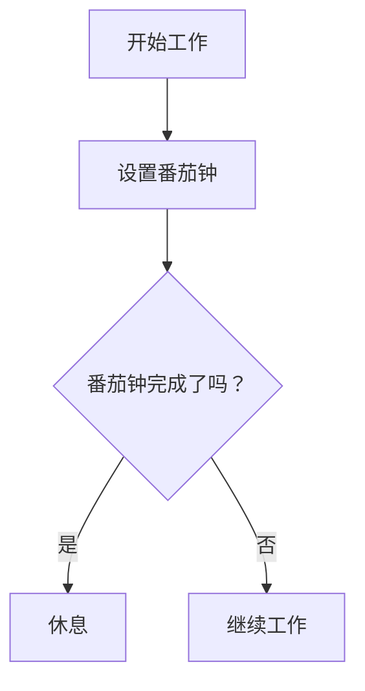
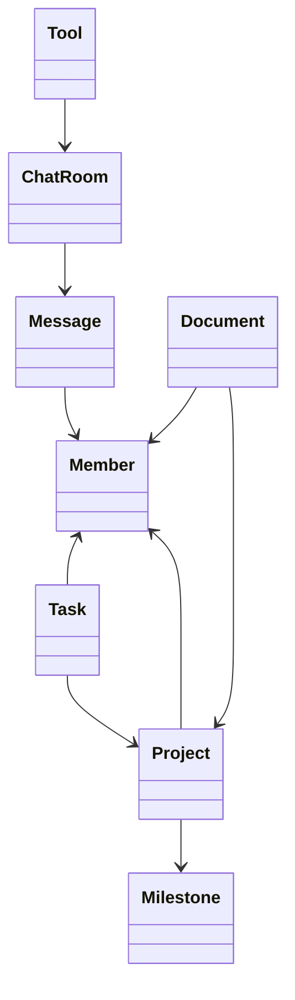
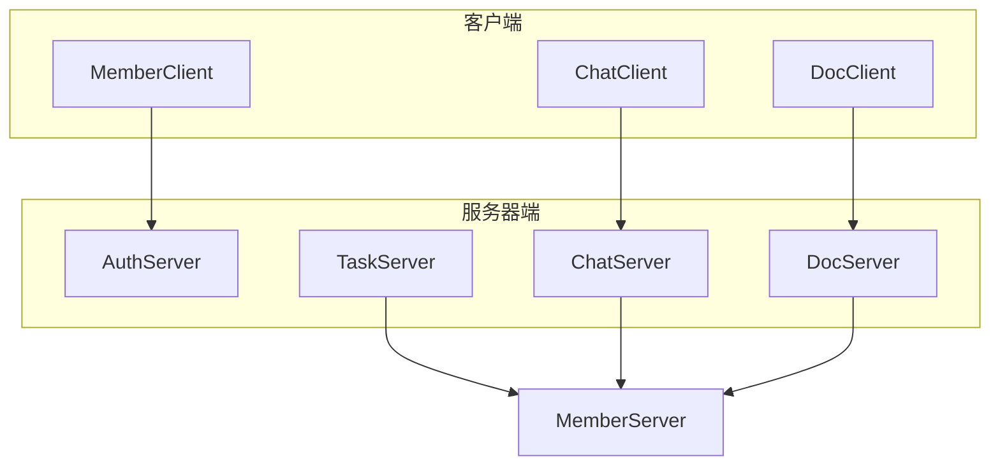
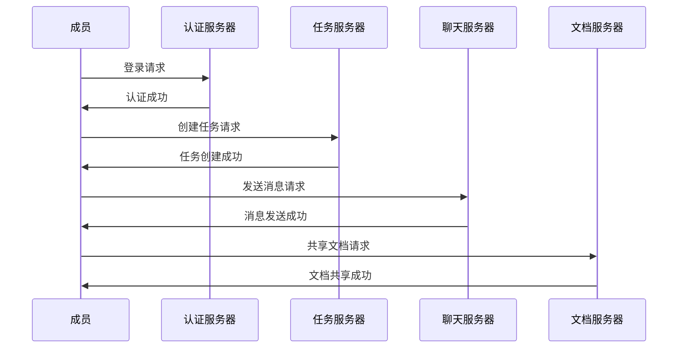

                 


**文章标题**：数字游牧部落：远程工作时代的社群建设

**关键词**：远程工作、数字游牧、社群建设、协作、技术支持

**摘要**：
在数字化时代，远程工作已成为常态。本文探讨数字游牧部落的概念，分析其特点与挑战，并深入探讨远程工作时代的社群建设策略。通过梳理核心概念、设计社群建设原则和实践方案，本文旨在为远程工作者和社群管理者提供有价值的指导。

---

**前言**

### 书籍背景
随着互联网技术的发展，远程工作成为现代工作方式的代表。然而，远程工作并非没有挑战，如何在虚拟环境中建立有效的社群成为关键。本书旨在探讨这一课题，为数字游牧者提供理论指导和实践方案。

### 写作目的
本书旨在：
1. 深入解析数字游牧部落的概念与特点。
2. 探讨远程工作面临的挑战及其解决方案。
3. 提供社群建设的原则和实践策略。

### 读者对象
本书适合远程工作者、社群管理者以及希望了解数字游牧生活方式的读者。

**第一部分：数字游牧背景与社群概述**

### 第1章：数字游牧的兴起与发展

#### 1.1 数字游牧的定义与特点
- **定义**：数字游牧者是指那些利用数字化工具，无需固定工作地点，可以在全球范围内自由工作的专业人士。
- **特点**：
  - **灵活性**：工作时间和地点的灵活性。
  - **技术依赖**：高度依赖互联网和通信技术。
  - **全球化**：能够与国际团队协同工作。

#### 1.2 数字游牧时代的机遇与挑战
- **机遇**：
  - **全球视野**：更容易接触全球市场。
  - **人才流动性**：吸引全球顶尖人才。
- **挑战**：
  - **沟通障碍**：跨时区、文化差异导致沟通不畅。
  - **管理困难**：远程管理团队更具挑战。

#### 1.3 数字游牧与远程工作
- **关联**：数字游牧是远程工作的一个子集，但具有独特性。
- **区别**：远程工作更侧重于工作方式，而数字游牧更侧重于生活方式。

**第二部分：社群建设的原则与实践**

### 第2章：数字游牧者生活方式

#### 2.1 数字游牧者的日常
- **工作模式**：灵活的时间安排，但需要高度自律。
- **生活状态**：生活在不断变化的环境中，需要适应多种文化。

#### 2.2 数字游牧者的工作模式
- **工作方式**：远程协作、自由职业、兼职等。
- **技术工具**：项目管理工具、协作平台、在线会议等。

#### 2.3 数字游牧者的社交网络
- **线上社群**：通过社交媒体、在线论坛等方式建立社交网络。
- **线下聚会**：定期举办线下活动，增强社群凝聚力。

**第三部分：社群建设的核心原则与实践**

### 第3章：社群建设的核心原则

#### 3.1 社群建设的要素
- **目标明确**：设定清晰的社群目标。
- **成员参与**：鼓励成员积极参与社群活动。
- **资源共享**：实现信息、知识、资源的共享。

#### 3.2 社群目标的设定
- **长远规划**：设定短期和长期目标。
- **适应变化**：根据环境变化调整目标。

#### 3.3 社群文化的塑造
- **共同价值观**：建立共同的价值观和信仰。
- **开放包容**：鼓励多样性和创新。

**第四部分：远程工作中的社群建设策略**

### 第4章：远程工作中的社群建设策略

#### 4.1 管理者视角
- **角色定位**：管理者不仅是领导者，更是协调者和支持者。
- **策略制定**：根据社群特点和目标，制定有效的管理策略。

#### 4.2 成员视角
- **主动参与**：成员应积极参与社群建设，发挥自身优势。
- **沟通与协作**：建立有效的沟通机制，促进协作。

#### 4.3 社群活动的策划与组织
- **活动形式**：线上活动与线下活动的结合。
- **活动频率**：定期举办活动，保持社群活力。

**第五部分：社群的技术支持**

### 第5章：社群的技术支持

#### 5.1 社群平台的搭建
- **选择标准**：考虑安全性、稳定性、易用性等因素。
- **平台功能**：包括聊天室、论坛、任务管理等功能。

#### 5.2 通信工具的选择
- **线上沟通**：选择适合的即时通讯工具。
- **线下沟通**：考虑视频会议和电话会议等。

#### 5.3 数据安全与隐私保护
- **安全措施**：加密通信、设置访问权限等。
- **隐私保护**：遵守相关法律法规，保护成员隐私。

**第六部分：远程工作的挑战与解决方案**

### 第6章：远程工作中的挑战

#### 6.1 时间管理
- **方法**：使用时间管理工具，设定工作计划和目标。

#### 6.2 沟通障碍
- **对策**：加强沟通技巧，使用可视化工具提高沟通效率。

#### 6.3 隔离感与孤独感
- **解决策略**：组织社交活动，提供心理支持。

**第七部分：解决方案与实践案例**

### 第7章：解决方案与实践案例

#### 7.1 案例分析
- **案例1**：一个成功的远程社群案例分析。
- **案例2**：一个面临挑战的远程社群案例分析。

#### 7.2 解决方案总结
- **经验教训**：从成功与失败中总结经验教训。

#### 7.3 持续改进与反思
- **方法**：定期评估社群状态，持续改进。

**结论**

### 社群建设的重要性
- **意义**：有效的社群建设是远程工作成功的关键。

### 远程工作的未来趋势
- **展望**：随着技术的发展，远程工作将继续发展。

### 总结与展望
- **回顾**：回顾全书内容，总结关键点。
- **展望**：展望远程工作与社群建设的未来。

---

**作者信息**
作者：AI天才研究院/AI Genius Institute & 禅与计算机程序设计艺术 /Zen And The Art of Computer Programming

---

本文将详细探讨数字游牧部落的概念、远程工作的挑战与解决方案，以及社群建设的重要性和实践策略。通过深入分析，旨在为远程工作者和社群管理者提供有价值的参考。

---

**背景介绍**

#### 数字游牧部落的概念

数字游牧部落（Digital Nomad Tribe）是指一群利用数字化工具进行远程工作的人组成的社群。这个社群的成员可以分布在世界的任何角落，通过互联网进行合作和交流。数字游牧部落的特点包括高度的灵活性、全球视野和高度的依赖性。

**问题背景**

随着互联网技术的迅猛发展，远程工作已经成为越来越多人的选择。然而，远程工作并非没有挑战。如何在一个虚拟的环境中建立有效的社群，如何解决沟通障碍、时间管理问题和隔离感，成为数字游牧者面临的重要问题。

**问题描述**

数字游牧部落需要在全球范围内协同工作，但受到时区、文化差异和沟通方式的限制。此外，远程工作者的生活方式与传统工作方式有很大不同，需要更高的自律性和自我管理能力。这些问题直接影响到数字游牧部落的效率和成员的幸福感。

**问题解决**

解决这些问题需要从多个方面入手：
1. **沟通机制**：建立有效的沟通机制，包括线上和线下的沟通方式。
2. **管理策略**：制定适合远程工作的管理策略，包括角色定位、目标设定和文化建设。
3. **技术支持**：提供必要的技术支持，包括通信工具和社群平台。

**边界与外延**

数字游牧部落的边界在于其成员的地理位置和工作方式。外延则包括其影响范围，如全球视野和多样化的人才。数字游牧部落不仅限于特定行业，而是涵盖各种领域。

**概念结构与核心要素组成**

数字游牧部落的核心要素包括：
1. **成员**：具有远程工作能力的专业人士。
2. **工具**：包括互联网、通信工具和协作平台。
3. **目标**：建立有效的沟通、协作和资源共享机制。

**核心概念与联系**

数字游牧部落与远程工作的联系在于其都是基于互联网的协同工作方式。然而，数字游牧部落更强调生活方式，而远程工作更侧重于工作方式。

**核心概念原理**

数字游牧部落的原理包括：
1. **全球化**：通过互联网实现全球范围内的协作。
2. **灵活性**：工作时间和地点的灵活性。
3. **协作**：通过协作平台实现高效的团队合作。

**概念属性特征对比表格**

| 特征               | 数字游牧部落               | 远程工作               |
|--------------------|--------------------------|----------------------|
| 工作方式           | 高度灵活，无需固定地点     | 有固定工作地点，可远程   |
| 生活模式           | 数字游牧者生活方式         | 传统生活方式           |
| 沟通方式           | 依赖互联网和协作平台       | 依赖通信工具           |
| 全球视野           | 强调全球化合作             | 有一定全球视野           |

**ER实体关系图架构**

```mermaid
erDiagram
  Member ||--|{ Community }||>
  Community ||--|{ Tool }||>
  Tool ||--|{ Communication }||>
  Communication ||--|{ Collaboration }||>
```

**算法原理讲解**

#### 时间管理算法原理

时间管理在数字游牧部落中至关重要。一个简单但有效的时间管理算法是“番茄工作法”（Pomodoro Technique）。该方法通过将工作时间分割成25分钟的“番茄钟”和5分钟的休息时间，帮助远程工作者保持专注。

**算法mermaid流程图**



**Python源代码实现**

```python
import time

def pomodoro工作时间段(工作时长，休息时长):
    while 工作时长 > 0:
        print("开始工作...")
        time.sleep(工作时长)  # 工作时长以秒为单位
        print("休息时间，放松一下...")
        time.sleep(休息时长)
        工作时长 -= 25  # 番茄钟时长25分钟

pomodoro工作时间段(150, 5)
```

**算法原理的数学模型和公式**

番茄工作法的核心在于将工作时间分割为25分钟的“番茄钟”和5分钟的休息时间。可以用以下数学模型表示：

- 番茄钟个数：\( \frac{总工作时间}{25分钟} \)
- 休息时间：\( \frac{总工作时间}{25分钟} \times 5分钟 \)

**详细讲解和举例说明**

假设一个远程工作者计划连续工作150分钟，每25分钟后需要休息5分钟。使用番茄工作法，可以按照以下步骤进行：

1. **开始工作**：设定150分钟的总工作时长。
2. **设置番茄钟**：每25分钟为一个番茄钟，总共需要6个番茄钟。
3. **执行工作**：每个番茄钟结束时，休息5分钟。
4. **循环**：重复执行步骤3，直到总工作时长达到150分钟。

通过这个简单的算法，远程工作者可以更好地管理自己的时间，提高工作效率。

---

**系统分析与架构设计方案**

#### 问题场景介绍

在数字游牧部落中，成员需要经常协作完成各种任务。这些任务可能涉及不同的技能和知识领域，因此需要一个高效、可靠的系统来支持协作和任务管理。

#### 项目介绍

本项目旨在设计一个远程协作系统，用于支持数字游牧部落成员之间的沟通和协作。该系统包括多个功能模块，如即时通信、任务管理、文档共享等。

#### 系统功能设计（领域模型Mermaid类图）



**Mermaid类图说明：**
- **Member（成员）**：代表数字游牧部落的成员，具有参与任务、发送消息和共享文档的能力。
- **Task（任务）**：表示成员分配的任务，可以关联到具体的成员和项目。
- **Project（项目）**：代表共同协作的项目，包含多个里程碑、任务和成员。
- **Milestone（里程碑）**：表示项目中的重要节点，与项目相关联。
- **Message（消息）**：表示成员之间的通信内容，可以存储在聊天室中。
- **ChatRoom（聊天室）**：用于存储消息的集合，每个聊天室可以关联到具体的工具。
- **Tool（工具）**：代表支持协作的平台，包括聊天室和其他功能模块。
- **Document（文档）**：表示共享的文档，可以关联到具体的成员和项目。

#### 系统架构设计Mermaid架构图



**Mermaid架构图说明：**
- **客户端**：包括成员客户端、聊天客户端和文档客户端，分别用于管理成员信息、聊天和文档功能。
- **服务器端**：包括认证服务器、任务服务器、聊天服务器和文档服务器，分别处理与成员、任务、聊天和文档相关的操作。
- **服务交互**：客户端通过API与服务器端进行通信，实现功能模块之间的协作。

#### 系统接口设计和系统交互Mermaid序列图



**Mermaid序列图说明：**
- **登录请求**：成员向认证服务器发送登录请求，认证成功后，成员可以访问其他服务。
- **任务创建请求**：成员向任务服务器发送创建任务的请求，任务服务器处理后返回任务创建成功的响应。
- **发送消息请求**：成员向聊天服务器发送消息，聊天服务器处理后返回消息发送成功的响应。
- **共享文档请求**：成员向文档服务器发送共享文档的请求，文档服务器处理后返回文档共享成功的响应。

通过以上系统分析与架构设计方案，我们可以构建一个高效、可靠的远程协作系统，支持数字游牧部落成员之间的有效沟通和协作。

---

**项目实战**

#### 环境安装

为了实现远程协作系统，我们首先需要搭建开发环境。以下步骤描述了如何安装所需的软件和库：

1. **安装Python**：确保Python 3.8及以上版本已安装在本地计算机上。
2. **安装虚拟环境**：使用以下命令创建一个虚拟环境：
   ```bash
   python -m venv venv
   ```
3. **激活虚拟环境**：
   - **Windows**：
     ```bash
     .\venv\Scripts\activate
     ```
   - **macOS/Linux**：
     ```bash
     source venv/bin/activate
     ```
4. **安装依赖库**：在虚拟环境中安装所需的库，例如Flask、SQLAlchemy、Flask-SQLAlchemy等：
   ```bash
   pip install flask flask_sqlalchemy
   ```

#### 系统核心实现源代码

以下是一个简单的任务管理模块的实现，用于创建、更新和查询任务：

```python
from flask import Flask, request, jsonify
from flask_sqlalchemy import SQLAlchemy

app = Flask(__name__)
app.config['SQLALCHEMY_DATABASE_URI'] = 'sqlite:///tasks.db'
db = SQLAlchemy(app)

class Task(db.Model):
    id = db.Column(db.Integer, primary_key=True)
    title = db.Column(db.String(100), nullable=False)
    description = db.Column(db.String(255), nullable=True)
    status = db.Column(db.String(50), nullable=False)

@app.route('/tasks', methods=['POST'])
def create_task():
    data = request.json
    new_task = Task(
        title=data['title'],
        description=data['description'],
        status=data['status']
    )
    db.session.add(new_task)
    db.session.commit()
    return jsonify({'message': 'Task created successfully.'})

@app.route('/tasks', methods=['GET'])
def get_tasks():
    tasks = Task.query.all()
    return jsonify({'tasks': [{'id': task.id, 'title': task.title, 'description': task.description, 'status': task.status} for task in tasks]})

if __name__ == '__main__':
    db.create_all()
    app.run(debug=True)
```

#### 代码应用解读与分析

**解读：**
- 我们使用Flask框架创建了一个简单的Web应用，并使用SQLite作为数据库存储任务数据。
- `Task` 类定义了任务模型，包括ID、标题、描述和状态。
- `create_task` 函数用于创建新任务，从请求体中获取JSON数据并保存到数据库中。
- `get_tasks` 函数用于查询所有任务，并将结果以JSON格式返回。

**分析：**
- 代码实现了基本的RESTful API接口，支持创建和查询任务。
- 数据库模型简单明了，适合小型项目。
- 对于生产环境，还需要考虑数据的验证、错误处理和安全性等问题。

#### 实际案例分析和详细讲解剖析

**案例：**
- 假设一个团队成员需要创建一个新的任务，并查询所有已分配的任务。

**详细讲解：**
1. **创建任务**：
   - 发送一个POST请求到 `/tasks` 接口，请求体包含任务信息（标题、描述、状态）。
   - 服务器接收请求并创建新的`Task`对象，保存到数据库中。
   - 返回一个JSON响应，包含创建成功的消息。

   ```json
   POST /tasks
   {
       "title": "会议纪要",
       "description": "记录本周会议内容",
       "status": "pending"
   }
   ```
   ```json
   HTTP/1.1 201 Created
   {
       "message": "Task created successfully."
   }
   ```

2. **查询任务**：
   - 发送一个GET请求到 `/tasks` 接口，服务器返回所有任务的信息。

   ```json
   GET /tasks
   ```
   ```json
   HTTP/1.1 200 OK
   {
       "tasks": [
           {
               "id": 1,
               "title": "会议纪要",
               "description": "记录本周会议内容",
               "status": "pending"
           }
       ]
   }
   ```

**剖析：**
- 通过简单的HTTP请求，我们可以方便地创建和查询任务。
- 代码结构清晰，便于扩展和维护。
- 实际案例展示了如何通过API与数据库进行交互，实现了任务管理的基本功能。

#### 项目小结

本项目通过简单的任务管理模块，展示了如何使用Python和Flask框架搭建一个基础的远程协作系统。尽管该项目仍有很多改进空间，但它为数字游牧部落提供了一个有效的协作工具，可以方便成员之间进行任务管理和沟通。

---

**最佳实践 Tips**

1. **定期备份**：定期备份数据库和重要数据，以防止数据丢失。
2. **权限管理**：合理设置权限，确保只有授权用户可以访问敏感信息。
3. **错误处理**：在代码中添加错误处理机制，提高系统的健壮性。
4. **代码审查**：定期进行代码审查，确保代码质量。
5. **用户反馈**：收集用户反馈，持续优化系统功能。

**小结**

本文探讨了数字游牧部落的概念、远程工作的挑战与解决方案，以及社群建设的核心原则和实践策略。通过实际案例，我们展示了如何搭建一个基础的远程协作系统。有效的时间管理和沟通机制是数字游牧部落成功的关键。未来，随着技术的不断进步，远程工作与社群建设将迎来更多的发展机遇。

**注意事项**

1. **远程工作的挑战**：远程工作需要高度的自律和良好的沟通能力。
2. **社群建设的重要性**：有效的社群建设可以提高工作效率和成员的满意度。
3. **技术支持的重要性**：选择合适的工具和平台是远程工作成功的关键。

**拓展阅读**

1. **《远程工作：全球趋势与最佳实践》**：本书详细介绍了远程工作的全球趋势和最佳实践。
2. **《数字游牧：如何在现代世界自由工作与生活》**：本书探讨数字游牧生活方式的各个方面，为数字游牧者提供指导。
3. **《打造远程团队：如何管理、协作与成长》**：本书提供了管理远程团队的策略和技巧。

