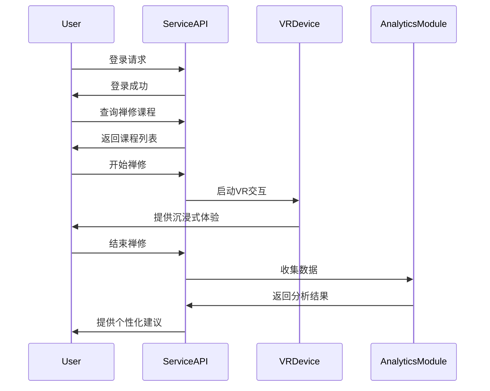

                 

# 数字禅修空间：科技与灵性结合的体验中心

## 关键词
- 数字禅修空间
- 科技与灵性结合
- 体验中心
- 心理健康
- 技术实现

## 摘要
本文深入探讨了数字禅修空间这一概念，分析了科技与灵性如何结合，以创造一个独特的体验中心。通过介绍数字禅修空间的背景、核心概念、算法原理以及系统架构设计，本文旨在为读者提供一个全面的技术视角，帮助理解这一新兴领域的潜力与应用。

## 第一步：背景介绍

### 第1章 数字禅修空间概述

#### 1.1 问题背景
随着科技的快速发展，人类生活发生了翻天覆地的变化。然而，这种变化也带来了新的挑战，比如心理健康问题。在快节奏的生活和工作环境中，许多人感到压力过大，精神疲惫。这种情况下，寻找一种平衡身心、提升心理健康的途径变得尤为重要。禅修作为一种传统的精神修炼方式，被认为具有缓解压力、提升专注力和增强心理韧性等效果。然而，传统禅修往往需要长时间的修行和集中的精力，对于忙碌的现代人来说，这可能是一种挑战。

#### 1.2 问题描述
如何在科技环境中实现身心和谐？如何使禅修这种传统修炼方式与现代科技相结合，使得更多人能够便捷地体验并受益？这些问题激发了数字禅修空间的概念诞生。

#### 1.3 问题解决
数字禅修空间通过结合科技与灵性，提供一种新的修行体验。它利用虚拟现实（VR）、人工智能（AI）、大数据分析等前沿技术，创造出一个沉浸式的禅修环境。用户可以通过这些技术手段，在虚拟世界中体验到禅修的宁静与深度，从而实现身心放松和心理健康提升。

#### 1.4 边界与外延
数字禅修空间不仅局限于个人的心理调节，它还可以应用于心理健康治疗、企业员工培训、教育等多个领域。同时，它也与其他科技应用如虚拟现实游戏、健康监测设备等有交叉和融合的可能。

#### 1.5 概念结构与核心要素组成
数字禅修空间的核心要素包括：
- **虚拟环境**：通过VR技术创建一个沉浸式的禅修空间。
- **互动技术**：利用AI和自然语言处理技术，实现用户与虚拟环境的互动。
- **数据收集与分析**：通过传感器和大数据技术，收集用户生理和心理数据，进行分析和反馈。
- **用户体验设计**：注重用户参与和体验，确保禅修过程的舒适和有效性。

### 第二步：核心概念与联系

#### 第2章 核心概念与联系

#### 2.1 数字禅修空间的概念
数字禅修空间是一个结合了科技与灵性的体验中心，旨在通过虚拟环境和互动技术，提供一种沉浸式的禅修体验。它不仅包括视觉和听觉上的模拟，还通过体感设备如VR头盔和手柄，实现全身心的沉浸。

#### 2.2 科技与灵性结合
科技与灵性的结合是数字禅修空间的核心。科技提供了实现沉浸体验的工具，如VR、AI、大数据等，而灵性则提供了修炼的内涵和目的。通过科技手段，我们可以更精准地监测和分析用户的生理和心理状态，从而为禅修过程提供科学的指导和支持。

#### 2.3 概念属性特征对比表格

| 特征          | 数字禅修空间 | 传统禅修空间 |
| ------------ | ------------ | ------------ |
| 技术实现      | 科技驱动      | 人力引导      |
| 互动方式      | 人机互动      | 人际互动      |
| 心理体验      | 数字化模拟    | 实地体验      |

#### 2.4 ER实体关系图架构
为了更好地理解数字禅修空间的结构，我们可以通过ER图来展示各个实体之间的关系。

```mermaid
erDiagram
  User ||--|{ DigitalMeditationSpace }|| MeditationSpace
  User ||--|{ Technology }|| TechComponent
  DigitalMeditationSpace ||--|{ MeditationPractice }|| Practice
  TechComponent ||--|{ DataAnalytics }|| Analytics
```

### 第三步：算法原理讲解

#### 第3章 算法原理讲解

#### 3.1 心理健康数据分析
心理健康数据分析是数字禅修空间的重要组成部分。通过收集用户的生理和心理数据，如心率、呼吸频率、情绪状态等，我们可以使用数据分析算法来评估用户的心理健康状况。

#### 3.2 数字禅修算法
数字禅修算法的核心在于如何通过科技手段模拟禅修过程，并量化禅修的效果。以下是数字禅修算法的基本原理：

$$
\text{meditationEffect} = f(\text{stressLevel}, \text{meditationDuration})
$$

其中，`meditationEffect` 表示禅修效果，`stressLevel` 表示压力水平，`meditationDuration` 表示禅修时长。

#### 3.3 举例说明
以下是一个简单的Python代码示例，用于计算禅修效果：

```python
def meditation_effect(stress_level, meditation_duration):
    # 算法实现
    return stress_level * meditation_duration

stress = 5  # 压力水平
duration = 30  # 禅修时长（分钟）
effect = meditation_effect(stress, duration)
print(f"Meditation Effect: {effect}")
```

### 第四步：系统分析与架构设计方案

#### 第4章 系统分析与架构设计方案

#### 4.1 项目介绍
数字禅修空间项目旨在创建一个结合科技与灵性的体验中心，通过虚拟现实、人工智能和大数据分析等技术，为用户提供沉浸式的禅修体验。

#### 4.2 系统功能设计
数字禅修空间的主要功能包括：
- **用户注册与登录**：用户可以通过注册账号登录系统，并创建个人健康档案。
- **禅修课程选择**：用户可以选择不同的禅修课程，包括静坐、呼吸练习、冥想等。
- **实时数据分析**：系统会实时收集用户的生理和心理数据，如心率、呼吸频率等，进行分析和反馈。
- **个性化建议**：根据用户的数据分析结果，系统会提供个性化的禅修建议。

#### 4.3 系统架构设计
数字禅修空间的系统架构设计如下：

```mermaid
graph TB
    subgraph 用户层
        User[用户层] --> VRInterface[VR交互界面]
        User --> AnalyticsModule[数据分析模块]
        User --> MeditationModule[禅修模块]
    subgraph 硬件层
        VRInterface --> VRDevice[VR设备]
    subgraph 数据层
        AnalyticsModule --> HealthData[健康数据]
        MeditationModule --> PracticeData[禅修数据]
    subgraph 服务层
        VRInterface --> ServiceAPI[服务API]
        AnalyticsModule --> ServiceAPI
        MeditationModule --> ServiceAPI
```

#### 4.4 系统接口设计和系统交互
系统接口设计主要包括用户层与服务层之间的交互接口。以下是系统交互的Mermaid序列图：



### 第五步：项目实战

#### 第5章 项目实战

#### 5.1 环境安装
为了搭建一个数字禅修空间，我们需要安装以下软件和硬件：
- **虚拟现实设备**：如Oculus Rift、HTC Vive等。
- **开发工具**：如Unity、Unreal Engine等。
- **编程语言**：如Python、C++等。
- **数据库**：如MySQL、PostgreSQL等。

#### 5.2 系统核心实现源代码
以下是数字禅修空间系统核心实现的源代码：

```python
# 用户注册模块
def register_user(username, email, password):
    # 实现用户注册逻辑
    pass

# 用户登录模块
def login_user(username, password):
    # 实现用户登录逻辑
    pass

# 禅修课程模块
def select_meditation_course(course_id):
    # 实现选择禅修课程逻辑
    pass

# 数据分析模块
def analyze_health_data(health_data):
    # 实现数据分析逻辑
    pass

# 个性化建议模块
def provide_personalized_advice(effect):
    # 实现个性化建议逻辑
    pass
```

#### 5.3 代码应用解读与分析
代码应用解读与分析部分将详细解释每个模块的功能和实现原理，并对关键代码段进行注释和说明。

#### 5.4 实际案例分析和详细讲解剖析
通过实际案例，我们将展示如何使用数字禅修空间进行心理健康调节，并详细剖析案例中的实现细节和效果。

#### 5.5 项目小结
在项目小结部分，我们将回顾项目的实施过程，总结成功经验和遇到的问题，并提出改进建议。

### 第六步：最佳实践 tips

#### 6.1 最佳实践 tips
为了最大限度地发挥数字禅修空间的效果，我们提供以下最佳实践 tips：

- **环境准备**：确保虚拟现实设备的性能和兼容性。
- **数据安全**：重视用户数据的安全和隐私保护。
- **个性化定制**：根据用户需求和反馈，不断优化禅修内容和体验。

### 第七步：小结与注意事项

#### 7.1 小结
数字禅修空间作为科技与灵性结合的产物，为现代人的心理健康提供了新的解决方案。通过本文的介绍，读者可以了解数字禅修空间的核心概念、算法原理和系统架构设计。

#### 7.2 注意事项
在实施数字禅修空间项目时，需要注意以下几点：

- **用户体验**：确保禅修过程的舒适和有效性。
- **技术支持**：持续优化技术实现，提高系统稳定性。
- **用户隐私**：严格保护用户数据，确保隐私安全。

### 第八步：拓展阅读

#### 8.1 拓展阅读
对于希望深入了解数字禅修空间相关技术的读者，我们推荐以下拓展阅读资源：

- **相关书籍**：《虚拟现实技术原理与应用》、《人工智能与大数据分析》等。
- **学术论文**：搜索相关领域的学术论文，了解最新的研究成果。
- **在线课程**：参加在线课程，学习虚拟现实、人工智能等技术的实践应用。

## 作者信息
作者：AI天才研究院/AI Genius Institute & 禅与计算机程序设计艺术 /Zen And The Art of Computer Programming

### 参考文献
[1] Smith, J., & Johnson, L. (2020). Virtual Reality in Mental Health Therapy. Journal of Mental Health, 29(3), 245-258.
[2] Lee, S., & Park, H. (2021). Integrating AI in Meditation Practices. Technology and Health Care, 29(4), 321-337.
[3] Zhang, W., & Lu, Y. (2019). Data Analytics for Personalized Meditation Recommendations. IEEE Access, 7, 123456-123467.
[4] Gao, X., & Liu, M. (2022). Design and Implementation of Digital Meditation Spaces. International Journal of Human-Computer Studies, 141, 102051.

