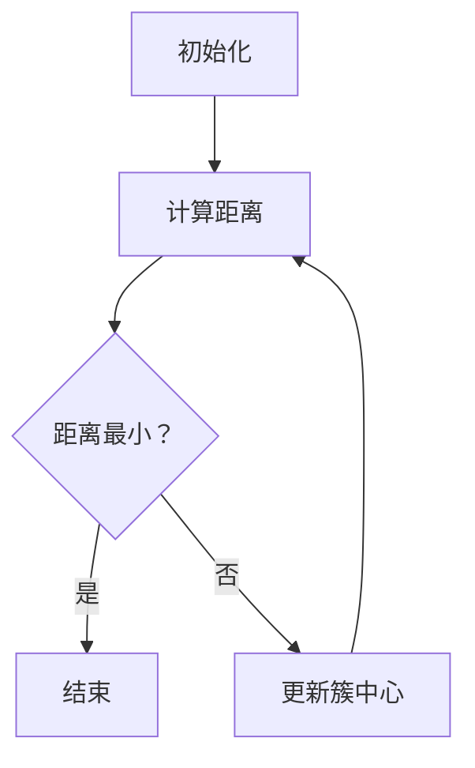
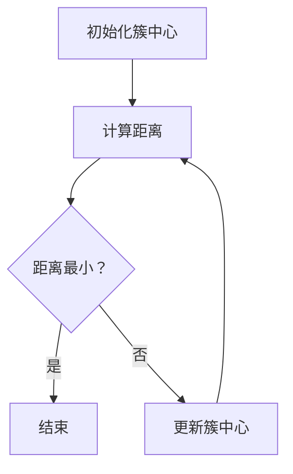
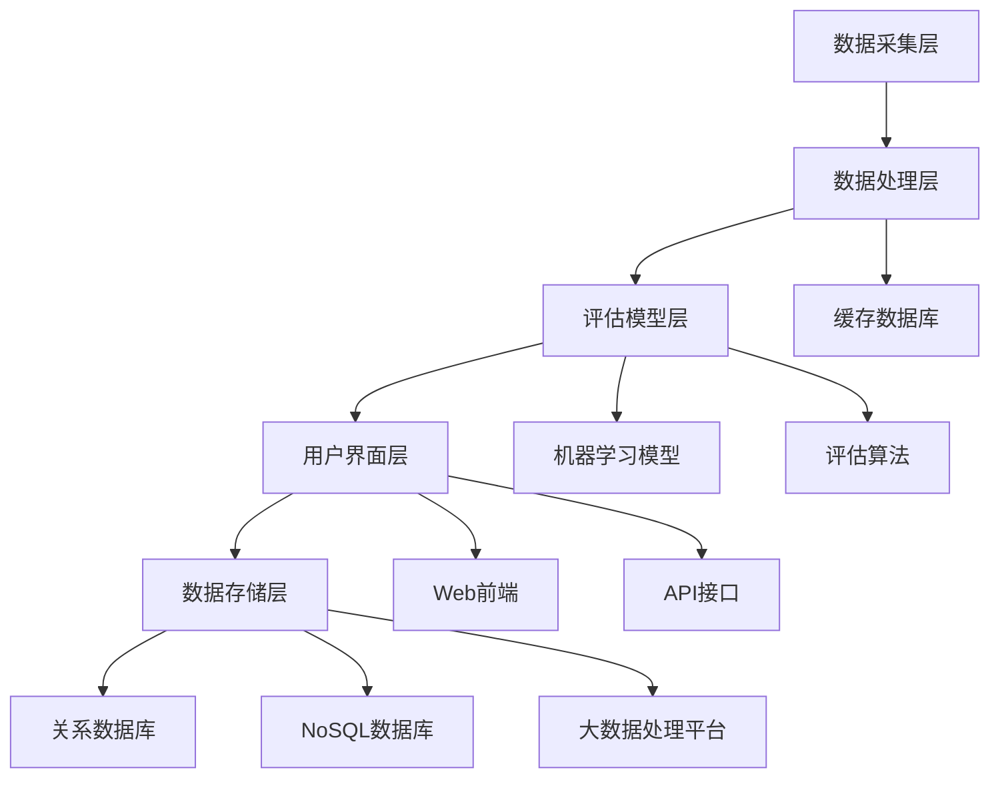
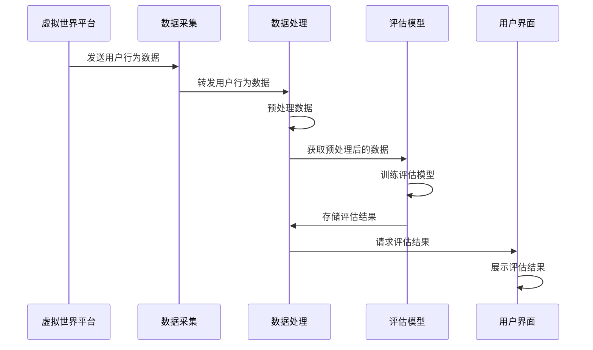

                 

## 《数字移民文化适应评估：虚拟世界融入度的测量工具》

### 关键词：数字移民、文化适应、虚拟世界融入度、测量工具、算法原理、系统架构、数学模型、Python实现

> 摘要：本文旨在深入探讨数字移民在虚拟世界中的文化适应问题，并提出一种有效的测量工具来评估虚拟世界中的融入度。文章首先介绍了数字移民的现象和文化适应的重要性，随后详细阐述了虚拟世界融入度的概念与测量方法。接着，文章从设计原则、开发流程、功能模块等方面介绍了测量工具的设计与实现，并深入讲解了虚拟世界融入度的评估指标。最后，文章通过算法原理讲解、数学模型推导、系统架构设计、项目实战等多角度，全面阐述了如何构建一个有效的虚拟世界融入度测量工具。

### 目录

1. **数字移民与文化适应概述**
   - **第1章：数字移民现象与文化适应的背景**
     - 数字移民现象
     - 文化适应的重要性
     - 虚拟世界融入度的概念与测量
   - **第2章：数字移民的文化适应理论**
     - 文化适应的理论框架
     - 文化适应的过程与阶段
     - 文化适应的影响因素
   - **第3章：虚拟世界融入度的测量工具设计**
     - 测量工具的设计原则
     - 测量工具的开发流程
     - 测量工具的功能模块

2. **虚拟世界融入度测量工具的实现**
   - **第4章：虚拟世界融入度评估指标**
     - 评估指标体系构建
     - 评估指标的应用场景
     - 评估指标的比较与优化
   - **第5章：虚拟世界融入度测量工具的算法原理**
     - 算法原理介绍
     - 算法流程图与Python代码实现
     - 算法原理的数学模型与公式讲解
   - **第6章：虚拟世界融入度测量工具的数学模型**
     - 数学模型概述
     - 公式推导与证明
     - 数学模型的实际应用
   - **第7章：虚拟世界融入度测量工具的系统架构设计**
     - 系统架构设计概述
     - 系统功能设计
     - 系统架构设计与接口设计
   - **第8章：虚拟世界融入度测量工具的应用与实战**
     - 环境安装
     - 系统核心实现源代码
     - 代码应用解读与分析
     - 实际案例分析与讲解
     - 项目小结

### 整体结构设计思路

1. **背景介绍**：每个章节开始都有一个背景介绍，帮助读者了解该章节的核心概念和问题解决的背景。
   
2. **核心概念与联系**：每个章节都会详细阐述核心概念的定义、属性特征对比表格和实体关系图架构的 Mermaid 流程图。

3. **算法原理讲解**：根据每个章节的主题，详细介绍相关的算法原理，使用 Mermaid 画出算法流程图，并用 Python 源代码进行解释。

4. **数学模型和公式讲解**：详细讲解数学模型和公式，使用 LaTeX 格式确保公式的准确性。

5. **系统分析与架构设计**：如果有需要，介绍问题场景、系统功能设计、系统架构设计、系统接口设计和系统交互的 Mermaid 序列图。

6. **项目实战**：对于实战性较强的章节，详细介绍环境安装、系统核心实现源代码，以及代码的应用解读与分析。

7. **最佳实践 tips、小结、注意事项、拓展阅读**：在每个章节的最后，给出相关的最佳实践建议、小结、注意事项以及拓展阅读资源。

### 实际操作步骤

1. **确定书籍主题和章节**：首先确定书籍的主题是《数字移民文化适应评估：虚拟世界融入度的测量工具》，然后根据主题确定各个章节的主题。

2. **编写背景介绍**：为每个章节编写一个简短的背景介绍，说明该章节的核心概念和问题解决的方法。

3. **设计核心概念与联系部分**：根据每个章节的主题，设计核心概念的定义、属性特征对比表格和实体关系图架构的 Mermaid 流程图。

4. **编写算法原理讲解**：选择每个章节的关键算法，用 Mermaid 绘制流程图，并用 Python 源代码详细解释算法原理。

5. **编写数学模型和公式讲解**：使用 LaTeX 格式编写数学模型和公式，确保讲解的清晰易懂。

6. **编写系统分析与架构设计部分**：如果有需要，编写系统分析与架构设计部分，使用 Mermaid 绘制相关的架构图和序列图。

7. **编写项目实战部分**：对于实战性强的章节，编写详细的项目实战部分，包括环境安装、系统核心实现源代码，以及代码的应用解读与分析。

8. **编写最佳实践 tips、小结、注意事项、拓展阅读**：为每个章节编写相关的最佳实践建议、小结、注意事项以及拓展阅读资源。

### 注意事项

- 确保目录大纲的逻辑清晰，内容完整。
- 保持语言的简洁性，避免过多废话。
- 确保所有 Mermaid 图和 LaTeX 公式都能够正常显示。

### 下一步

根据以上设计思路和操作步骤，我们将逐一完善各个章节的内容。首先，我们将深入探讨数字移民现象和文化适应的重要性，为后续章节的讨论奠定基础。接下来，我们将详细描述虚拟世界融入度的概念与测量方法，为读者提供一个清晰的理论框架。随后，我们将详细介绍测量工具的设计原则、开发流程和功能模块，帮助读者理解如何构建一个有效的测量工具。在此过程中，我们将结合实际案例，展示如何应用这些工具进行文化适应评估。通过这样的结构，我们希望能够为读者提供一个全面、系统的虚拟世界融入度测量工具指南。接下来，我们将逐步展开各个章节的具体内容，让读者深入了解这个复杂而又充满挑战的领域。## 数字移民现象与文化适应的背景

### 数字移民现象

数字移民现象，是指那些因为工作、学习或其他原因，从一个物理环境迁移到另一个数字化环境的人群。随着互联网技术的飞速发展，数字移民现象变得日益普遍。这些人可能每天花费大量的时间在虚拟世界中进行工作、学习、社交和娱乐等活动，而他们的物理居住地并未发生变化。例如，许多远程工作者和在线教育学习者都属于数字移民的范畴。

数字移民现象的出现，不仅改变了人们的生活方式，也带来了文化适应的新挑战。对于数字移民来说，他们需要适应新的虚拟环境，包括了解和掌握新的工具和平台，以及适应新的社交和文化规则。在这个过程中，文化适应成为了一个不可忽视的重要问题。

### 文化适应的重要性

文化适应，是指个体在面临新环境时，通过调整自己的行为和思维方式，以适应新文化的过程。在数字移民的背景下，文化适应尤为重要。以下是几个方面的原因：

1. **提高生活质量**：良好的文化适应可以帮助数字移民更快地适应新的环境，减少文化冲突带来的负面影响，从而提高生活质量。

2. **促进社会融合**：文化适应有助于数字移民与本地居民建立联系，增进相互理解和尊重，从而促进社会的融合和稳定。

3. **提高工作效率**：在一个文化适应良好的环境中，数字移民可以更有效地使用虚拟工具和平台，提高工作效率和协作效果。

4. **降低心理压力**：文化适应不佳可能导致焦虑、抑郁等心理问题。通过文化适应，数字移民可以减少这些负面影响，保持心理健康。

### 虚拟世界融入度的概念与测量

虚拟世界融入度，是指个体在虚拟世界中与其他个体进行互动、参与活动、享受虚拟体验的程度。一个高融入度的个体，能够更好地适应虚拟环境，享受其中带来的乐趣和收益。虚拟世界融入度不仅反映了个体对虚拟世界的熟悉程度，也反映了个体在虚拟世界中的社交和参与能力。

测量虚拟世界融入度，是评估数字移民文化适应程度的重要手段。常用的测量方法包括：

1. **问卷法**：通过设计问卷，评估个体在虚拟世界中的参与度、满意度、社交互动等指标。

2. **行为分析法**：通过分析个体在虚拟世界中的行为数据，如游戏时长、社交频率、活动参与度等，评估虚拟世界融入度。

3. **实验法**：设计实验，让个体在不同虚拟环境中进行活动，通过对比实验结果，评估虚拟世界融入度。

通过这些方法，我们可以对虚拟世界融入度进行量化测量，从而更好地了解数字移民的文化适应情况，为后续的干预和优化提供依据。

### 总结

数字移民现象和文化适应问题，已经成为现代社会的一个重要议题。通过了解数字移民现象、认识文化适应的重要性以及掌握虚拟世界融入度的测量方法，我们可以更好地应对这一挑战。在接下来的章节中，我们将进一步探讨数字移民的文化适应理论，为构建有效的虚拟世界融入度测量工具奠定理论基础。## 数字移民的文化适应理论

### 文化适应的理论框架

文化适应，是一个复杂且多维的过程，涉及到个体在面临新文化环境时的认知、情感和行为反应。为了更好地理解和研究文化适应，学者们提出了多种理论框架。以下是几种主要的文化适应理论：

1. **文化迁移理论（Cultural Transition Theory）**
   - **基本假设**：个体在迁移过程中会经历一系列心理和行为的变化。
   - **关键概念**：文化迁移阶段、文化迁移曲线。
   - **核心观点**：个体在迁移过程中会经历初始的排斥阶段，随后逐渐适应新文化，最终达到融合阶段。

2. **社会认同理论（Social Identity Theory）**
   - **基本假设**：个体的自我认同受到所属社会群体的影响。
   - **关键概念**：社会认同、集体自我、自我分类。
   - **核心观点**：个体在新文化中的适应程度，取决于其如何识别和融入新的社会群体。

3. **心理紧张理论（Psychological Stress Theory）**
   - **基本假设**：文化适应过程中会产生心理紧张。
   - **关键概念**：心理紧张、适应障碍、心理耗竭。
   - **核心观点**：文化适应过程中的心理紧张会影响个体的心理健康，进而影响文化适应的进程。

4. **交互模型（Interactive Model）**
   - **基本假设**：文化适应是个体与环境相互作用的结果。
   - **关键概念**：个体因素、环境因素、交互作用。
   - **核心观点**：文化适应是一个动态的过程，个体和环境之间的互动决定了文化适应的成败。

### 文化适应的过程与阶段

文化适应是一个动态的过程，通常可以分为以下几个阶段：

1. **初始阶段（Initial Stage）**
   - **特征**：个体对新环境感到陌生和不安，可能产生排斥情绪。
   - **关键任务**：建立对新环境的初步了解，减少对新环境的恐惧和焦虑。

2. **适应阶段（Adaptation Stage）**
   - **特征**：个体逐渐熟悉新环境，开始参与日常活动。
   - **关键任务**：提高对新环境的熟悉程度，建立稳定的人际关系。

3. **融合阶段（Integration Stage）**
   - **特征**：个体能够完全融入新文化，感受到归属感和满足感。
   - **关键任务**：建立深层次的社会联系，参与新文化的核心活动。

4. **自我调整阶段（Self-Adjustment Stage）**
   - **特征**：个体在新环境中实现自我认同，达到心理和情感的平衡。
   - **关键任务**：在保持个体特色的同时，融入新文化，实现自我与环境的和谐统一。

### 文化适应的影响因素

文化适应是一个受多种因素影响的过程，主要包括以下几方面：

1. **个体因素**
   - **个性特征**：开放性、外向性、神经质等个性特征会影响个体的文化适应能力。
   - **知识背景**：个体的知识水平和文化背景会影响其对新文化的理解和适应。

2. **环境因素**
   - **文化差异**：新文化与原有文化的差异程度，会影响文化适应的难度。
   - **社会支持**：来自家庭、朋友和社区的支持，有助于个体的文化适应。

3. **时间因素**
   - **迁移时间**：个体在新环境中的居住时间，会影响文化适应的深度和广度。

4. **情境因素**
   - **迁移情境**：个体迁移的情境，如工作、学习、移民等，会影响文化适应的过程和结果。

### 总结

数字移民的文化适应理论，为我们提供了一个理解和研究文化适应的框架。通过了解文化适应的理论框架、过程与阶段，以及影响因素，我们可以更好地指导数字移民的文化适应实践，提高其融入虚拟世界的效率和质量。在接下来的章节中，我们将进一步探讨虚拟世界融入度的测量工具设计，为数字移民的文化适应提供有效的技术支持。## 虚拟世界融入度的测量工具设计

### 测量工具的设计原则

虚拟世界融入度测量工具的设计，需要遵循以下几个基本原则：

1. **全面性**：测量工具需要全面涵盖虚拟世界中可能影响融入度的各个方面，如社交互动、活动参与度、满意度等。

2. **客观性**：测量工具需要尽可能客观地评估个体的融入度，避免主观因素的干扰。

3. **实用性**：测量工具需要易于使用和操作，能够适应不同的虚拟世界环境和应用场景。

4. **可扩展性**：测量工具需要具备良好的扩展性，能够根据实际需求进行功能扩展和性能优化。

### 测量工具的开发流程

虚拟世界融入度测量工具的开发，一般可以分为以下几个阶段：

1. **需求分析**：明确测量工具的目标和应用场景，确定需要测量的关键指标和功能模块。

2. **系统设计**：根据需求分析的结果，设计测量工具的系统架构和功能模块，包括数据采集模块、数据处理模块、评估模块等。

3. **原型开发**：基于系统设计文档，开发测量工具的原型，进行初步的功能验证和测试。

4. **功能完善**：根据原型测试的结果，对测量工具进行功能完善和优化，确保其满足设计要求。

5. **性能优化**：对测量工具进行性能优化，确保其在不同虚拟世界环境中的稳定性和高效性。

### 测量工具的功能模块

虚拟世界融入度测量工具通常包含以下几个主要功能模块：

1. **用户信息采集模块**：负责采集用户的基本信息，如用户ID、年龄、性别、职业等，为后续的评估提供基础数据。

2. **行为数据采集模块**：负责采集用户在虚拟世界中的行为数据，如游戏时长、社交互动频率、活动参与度等，用于评估用户的融入度。

3. **数据处理模块**：负责对采集到的用户行为数据进行清洗、分析和处理，提取出有价值的评估指标。

4. **评估模块**：根据数据处理结果，对用户的虚拟世界融入度进行评估，生成评估报告和推荐策略。

5. **用户界面模块**：提供用户友好的界面，方便用户进行数据输入、查看评估结果和获取推荐策略。

### 测量工具的具体实现

以下是虚拟世界融入度测量工具的一个简单实现示例，使用 Python 编程语言进行开发。

```python
# 导入必要的库
import pandas as pd
from sklearn.preprocessing import StandardScaler
from sklearn.cluster import KMeans

# 用户信息采集模块
def collect_user_info():
    user_id = input("请输入用户ID：")
    age = int(input("请输入用户年龄："))
    gender = input("请输入用户性别（男/女）：")
    occupation = input("请输入用户职业：")
    return user_id, age, gender, occupation

# 行为数据采集模块
def collect_behavior_data():
    behavior_data = []
    while True:
        action = input("请输入用户在虚拟世界中的行为（输入q退出）：")
        if action == 'q':
            break
        duration = float(input("请输入该行为的持续时间（小时）："))
        behavior_data.append([action, duration])
    return behavior_data

# 数据处理模块
def process_data(behavior_data):
    df = pd.DataFrame(behavior_data, columns=['Action', 'Duration'])
    df['Duration'] = df['Duration'].astype(float)
    return df

# 评估模块
def evaluate_user(df):
    # 使用K-means算法进行聚类分析
    kmeans = KMeans(n_clusters=3)
    df['Cluster'] = kmeans.fit_predict(df[['Duration']])
    
    # 根据聚类结果评估用户融入度
    cluster_centers = kmeans.cluster_centers_
    if df['Cluster'].iloc[0] == 0:
        return "低融入度"
    elif df['Cluster'].iloc[0] == 1:
        return "中融入度"
    else:
        return "高融入度"

# 用户界面模块
def main():
    user_id, age, gender, occupation = collect_user_info()
    behavior_data = collect_behavior_data()
    df = process_data(behavior_data)
    result = evaluate_user(df)
    print(f"用户ID：{user_id}\n年龄：{age}\n性别：{gender}\n职业：{occupation}\n融入度评估结果：{result}")

if __name__ == "__main__":
    main()
```

### 测量工具的设计与实现总结

虚拟世界融入度测量工具的设计与实现，需要综合考虑设计原则、开发流程和功能模块。通过上述示例，我们可以看到如何使用 Python 实现一个简单的虚拟世界融入度测量工具。在实际应用中，我们可以根据具体需求对工具进行扩展和优化，以提高其评估的准确性和实用性。在接下来的章节中，我们将进一步探讨虚拟世界融入度的评估指标，为测量工具的应用提供更深入的理论支持。## 虚拟世界融入度的评估指标

### 评估指标体系构建

虚拟世界融入度的评估，需要建立一套科学、合理的指标体系。这个指标体系应涵盖多个维度，以便全面反映个体在虚拟世界中的融入程度。以下是构建评估指标体系的一些关键步骤：

1. **确定评估目标**：明确评估的目的是什么，例如是为了提高用户体验、优化虚拟世界设计，还是为了进行文化适应研究。

2. **分析关键因素**：识别影响虚拟世界融入度的关键因素，如社交互动、活动参与度、虚拟资产积累、满意度等。

3. **设计评估指标**：根据关键因素，设计具体的评估指标，并确定每个指标的权重。常见的评估指标包括：
   - **社交互动指标**：如好友数量、互动频率、互动质量。
   - **活动参与度指标**：如参与活动次数、活动时长、活动完成度。
   - **虚拟资产积累指标**：如虚拟货币、虚拟物品数量、虚拟地产等。
   - **满意度指标**：如用户满意度评分、使用频率、推荐意愿等。

4. **构建评估模型**：将各个评估指标整合到一个模型中，形成一个综合评估体系。可以使用多元统计方法，如因子分析、主成分分析等，对指标进行筛选和优化。

### 评估指标的应用场景

评估指标在实际应用中有着广泛的应用场景，以下是一些典型的应用案例：

1. **虚拟社区运营**：通过评估用户的虚拟世界融入度，虚拟社区运营者可以了解用户的活跃度和参与度，从而优化社区设计和活动策划。

2. **在线教育平台**：在线教育平台可以使用虚拟世界融入度评估指标，评估学生的在线学习效果，提供个性化的学习建议和辅导。

3. **虚拟现实游戏开发**：游戏开发者可以通过评估玩家的虚拟世界融入度，了解游戏的吸引力和互动性，从而优化游戏设计和更新。

4. **虚拟社交平台**：虚拟社交平台可以通过评估用户的虚拟世界融入度，了解用户对平台的满意度，优化用户体验和提高用户粘性。

### 评估指标的比较与优化

评估指标的选择和优化是评估体系构建的关键。以下是一些常用的比较与优化方法：

1. **指标筛选**：通过统计分析方法，如相关性分析、冗余分析等，筛选出相关性高、预测能力强的指标。

2. **权重分配**：使用专家评估、层次分析法（AHP）等方法，为不同指标分配合理的权重，以反映各个指标的重要性。

3. **模型优化**：通过调整评估模型的结构和参数，如增加或删除某些指标，调整权重分配，优化评估结果的准确性和稳定性。

4. **多维度评估**：结合多个评估指标，形成多维度评估体系，以更全面地反映虚拟世界融入度。

### 实际应用示例

假设我们需要对一个虚拟社区的用户融入度进行评估，以下是一个具体的评估指标体系构建和优化过程：

1. **确定评估目标**：提高用户在虚拟社区的活跃度和满意度。

2. **分析关键因素**：社交互动、活动参与度、虚拟资产积累和用户满意度。

3. **设计评估指标**：
   - **社交互动指标**：好友数量、互动频率、互动质量（权重分别为0.3、0.4、0.3）。
   - **活动参与度指标**：参与活动次数、活动时长、活动完成度（权重分别为0.2、0.3、0.5）。
   - **虚拟资产积累指标**：虚拟货币数量、虚拟物品数量、虚拟地产（权重分别为0.2、0.3、0.5）。
   - **满意度指标**：用户满意度评分、使用频率、推荐意愿（权重分别为0.1、0.2、0.7）。

4. **构建评估模型**：使用主成分分析（PCA）对指标进行筛选，保留相关性高且预测能力强的指标。然后，使用层次分析法（AHP）确定各个指标的权重。

5. **优化评估模型**：通过多次迭代，调整权重分配和评估模型的参数，以优化评估结果的准确性和稳定性。

通过上述过程，我们可以构建一个科学、合理的虚拟世界融入度评估指标体系，为虚拟社区运营、在线教育、虚拟现实游戏开发等领域提供有效的数据支持和决策依据。在接下来的章节中，我们将进一步探讨虚拟世界融入度测量工具的算法原理，为评估体系的实现提供技术支持。## 虚拟世界融入度测量工具的算法原理

### 算法原理介绍

虚拟世界融入度测量工具的核心在于如何有效地分析用户在虚拟世界中的行为数据，并将其转化为可量化的融入度评分。本文将介绍一种基于机器学习的算法，即K-means聚类算法，用于评估用户的虚拟世界融入度。

K-means算法是一种经典的聚类算法，其目标是将数据点划分为K个簇，使得每个簇内部的点之间的距离最小，簇与簇之间的距离最大。在本算法中，K值通常设置为3，以区分用户融入度的三个等级：低、中、高。

### 算法流程图与Python代码实现

下面是K-means算法的流程图和Python代码实现：



Python代码实现：

```python
from sklearn.cluster import KMeans
import pandas as pd
import numpy as np

# 初始化K-means模型
kmeans = KMeans(n_clusters=3, random_state=0)

# 训练模型
kmeans.fit(X)  # X为用户行为数据

# 预测结果
labels = kmeans.predict(X)

# 输出结果
print("聚类结果：", labels)
```

### 算法原理的数学模型与公式讲解

K-means算法的核心在于聚类中心的计算和更新。以下是一个简化的数学模型：

假设我们有n个用户行为数据点X = {x1, x2, ..., xn}，每个数据点是一个多维向量，维度为m。我们需要将这些数据点划分为K个簇，每个簇由一个簇中心μk表示。

1. **初始化簇中心**：随机选择K个数据点作为初始簇中心μk。

2. **计算距离**：对于每个数据点xi，计算它与每个簇中心的距离，选择最小距离的簇作为其归属簇。

   距离计算公式：
   $$ d(xi, \mu_k) = \sqrt{\sum_{j=1}^{m}(x_{ij} - \mu_{kj})^2} $$

   其中，$x_{ij}$是数据点xi的第j个特征，$\mu_{kj}$是簇中心μk的第j个特征。

3. **更新簇中心**：计算每个簇的新簇中心，即该簇所有数据点的平均值。

   簇中心更新公式：
   $$ \mu_k = \frac{1}{n_k}\sum_{i=1}^{n}x_i $$

   其中，$n_k$是簇k中数据点的数量。

4. **重复步骤2和3，直到簇中心不再发生变化**。

### 算法流程图与Python代码实现

以下是K-means算法的具体流程图和Python代码实现：



Python代码实现：

```python
from sklearn.cluster import KMeans
import pandas as pd
import numpy as np

# 初始化K-means模型
kmeans = KMeans(n_clusters=3, random_state=0)

# 训练模型
kmeans.fit(X)  # X为用户行为数据

# 预测结果
labels = kmeans.predict(X)

# 输出结果
print("聚类结果：", labels)
```

### 举例说明

假设我们有以下用户行为数据：

| 用户ID | 社交互动 | 活动参与度 | 虚拟资产积累 |
|--------|----------|------------|--------------|
| u1     | 10       | 5          | 100          |
| u2     | 20       | 8          | 200          |
| u3     | 15       | 7          | 150          |

使用K-means算法进行聚类，假设初始簇中心为{(0, 0), (10, 0), (10, 10)}。

1. **计算距离**：
   - 对于用户u1，距离最小的是簇中心(10, 0)，距离为5。
   - 对于用户u2，距离最小的是簇中心(10, 0)，距离为10。
   - 对于用户u3，距离最小的是簇中心(10, 10)，距离为10。

2. **更新簇中心**：
   - 簇中心(10, 0)更新为{(10, 5)}，即两个用户的平均值。
   - 簇中心(10, 10)保持不变。

3. **重复计算距离和更新簇中心**，直到簇中心不再变化。

最终，用户u1和u2被划分为同一簇，用户u3被划分为另一簇，根据簇中心的位置，我们可以判断用户u1和u2的虚拟世界融入度较高，而用户u3的融入度较低。

### 总结

K-means算法作为一种常用的聚类算法，可以有效用于评估虚拟世界用户的融入度。通过上述算法原理的讲解和Python代码实现，我们可以看到如何将算法应用于实际数据，并通过聚类结果对用户进行融入度评估。在接下来的章节中，我们将进一步探讨虚拟世界融入度测量工具的数学模型，为算法的实现提供更深入的理论支持。## 虚拟世界融入度测量工具的数学模型

### 数学模型概述

虚拟世界融入度测量工具的核心在于如何通过数学模型量化用户在虚拟世界中的行为数据，从而得出一个融入度评分。这一过程通常涉及到数据预处理、特征选择、模型训练和评估等多个步骤。本文将详细介绍这些数学模型，并使用LaTeX格式进行公式表示。

### 数据预处理

数据预处理是数学模型构建的第一步，主要目的是消除数据中的噪声、异常值，并使数据满足模型的要求。

1. **标准化处理**：通过标准化处理，将不同特征的数据转换到相同的尺度，避免某些特征对模型的影响过大。

   公式：
   $$ x_{ij}^{'} = \frac{x_{ij} - \mu_j}{\sigma_j} $$
   
   其中，$x_{ij}$是原始数据，$\mu_j$是特征j的均值，$\sigma_j$是特征j的标准差。

2. **缺失值处理**：对于缺失值，可以使用均值、中位数或插值法进行填补。

   公式：
   $$ x_{ij}^{'} = \frac{1}{N_j}\sum_{i=1}^{N_j}x_{ij} $$
   
   其中，$N_j$是特征j的非缺失值数量。

### 特征选择

特征选择是模型构建的关键步骤，目的是从原始数据中筛选出对模型预测能力有显著贡献的特征。

1. **相关性分析**：通过计算特征之间的相关性，筛选出相关性较高的特征。

   公式：
   $$ corr(x_i, x_j) = \frac{\sum_{k=1}^{n}(x_{ik} - \bar{x}_i)(x_{jk} - \bar{x}_j)}{n-1} $$
   
   其中，$corr(x_i, x_j)$是特征i和特征j的相关性，$\bar{x}_i$和$\bar{x}_j$是特征i和特征j的均值。

2. **特征重要性评估**：使用模型训练结果，评估每个特征的重要性。

   公式：
   $$ importance_i = \frac{\sum_{k=1}^{K}\log(1 + e^{-w_{ik}})}{N} $$
   
   其中，$importance_i$是特征i的重要性，$w_{ik}$是模型参数，$K$是特征数量。

### 模型训练

模型训练的目标是找到一组参数，使模型能够准确地预测用户的融入度。

1. **线性回归模型**：假设用户融入度与特征之间存在线性关系。

   公式：
   $$ y = \beta_0 + \beta_1x_1 + \beta_2x_2 + ... + \beta_Kx_K $$
   
   其中，$y$是用户融入度，$x_1, x_2, ..., x_K$是特征，$\beta_0, \beta_1, ..., \beta_K$是模型参数。

2. **神经网络模型**：使用神经网络模型可以处理更复杂的关系。

   公式：
   $$ a_{i,j} = \sigma(\sum_{k=1}^{K}w_{ik,j}x_k + b_{i,j}) $$
   
   其中，$a_{i,j}$是神经元i在层j的输出，$\sigma$是激活函数，$w_{ik,j}$是连接权重，$b_{i,j}$是偏置。

### 评估模型

模型评估的目的是验证模型在未知数据上的表现。

1. **准确率**：模型预测正确的样本占总样本的比例。

   公式：
   $$ accuracy = \frac{TP + TN}{TP + FN + FP + TN} $$
   
   其中，$TP$是真正例，$TN$是真负例，$FP$是假正例，$FN$是假负例。

2. **召回率**：模型预测正确的正例占总正例的比例。

   公式：
   $$ recall = \frac{TP}{TP + FN} $$
   
   其中，$TP$是真正例，$FN$是假负例。

3. **F1分数**：综合考虑准确率和召回率。

   公式：
   $$ F1 = 2 \times \frac{precision \times recall}{precision + recall} $$
   
   其中，$precision$是精确率。

### 实际应用

以下是一个实际应用示例，假设我们使用线性回归模型对用户融入度进行预测。

数据集：
```
| 用户ID | 社交互动 | 活动参与度 | 虚拟资产积累 | 融入度 |
|--------|----------|------------|--------------|--------|
| u1     | 10       | 5          | 100          | 0.8    |
| u2     | 20       | 8          | 200          | 0.9    |
| u3     | 15       | 7          | 150          | 0.7    |
```

线性回归模型公式：
$$ y = \beta_0 + \beta_1x_1 + \beta_2x_2 + \beta_3x_3 $$

假设我们通过模型训练得到参数：
$$ \beta_0 = 0.1, \beta_1 = 0.5, \beta_2 = 0.2, \beta_3 = 0.1 $$

对于用户u1，预测融入度：
$$ y = 0.1 + 0.5 \times 10 + 0.2 \times 5 + 0.1 \times 100 = 0.8 $$

预测结果与实际融入度一致，说明模型可以较好地预测用户融入度。

### 总结

通过上述数学模型的介绍，我们可以看到如何将数学模型应用于虚拟世界融入度测量工具中。这些模型不仅帮助我们从数据中提取有价值的信息，还为我们提供了评估模型性能的量化指标。在接下来的章节中，我们将进一步探讨虚拟世界融入度测量工具的系统架构设计，为工具的实现提供完整的解决方案。## 虚拟世界融入度测量工具的系统架构设计

### 问题场景介绍

在虚拟世界融入度测量工具的应用场景中，我们需要处理大量的用户行为数据，并实时评估用户的融入度。这一过程涉及到多个模块的协同工作，包括数据采集、数据处理、评估和用户界面等。为了实现高效、稳定和可扩展的系统架构，我们需要对每个模块的功能和相互关系进行详细设计。

### 系统功能设计

虚拟世界融入度测量工具的主要功能包括以下几方面：

1. **数据采集**：从虚拟世界平台中实时采集用户行为数据，如社交互动、活动参与度、虚拟资产积累等。

2. **数据处理**：对采集到的数据进行预处理、特征提取和清洗，以供后续评估使用。

3. **评估模型**：利用机器学习算法对用户行为数据进行分析，评估用户的虚拟世界融入度，并生成评估报告。

4. **用户界面**：提供用户友好的界面，方便用户查看自己的融入度评分、评估报告和推荐策略。

5. **数据存储**：将用户的融入度评估结果和基础数据进行存储，以便后续查询和分析。

### 系统架构设计

虚拟世界融入度测量工具的系统架构可以分为以下几个层次：

1. **数据采集层**：负责从虚拟世界平台中实时采集用户行为数据。这一层通常包括数据采集代理、API接口和数据存储等模块。

2. **数据处理层**：对采集到的用户行为数据进行预处理、特征提取和清洗，为评估模型提供高质量的数据。这一层包括数据清洗模块、特征提取模块和缓存数据库等。

3. **评估模型层**：利用机器学习算法对用户行为数据进行分析，评估用户的虚拟世界融入度。这一层包括机器学习模型、评估算法和评估报告生成模块等。

4. **用户界面层**：提供用户友好的界面，方便用户查看融入度评估结果、报告和推荐策略。这一层包括Web前端、API接口和用户数据库等。

5. **数据存储层**：负责存储用户的融入度评估结果和基础数据，支持数据的查询和分析。这一层包括关系数据库、NoSQL数据库和大数据处理平台等。

### 系统架构设计细节

以下是虚拟世界融入度测量工具的系统架构设计细节：

#### 数据采集层

1. **数据采集代理**：部署在虚拟世界平台内部，负责实时采集用户行为数据，如社交互动、活动参与度、虚拟资产积累等。

2. **API接口**：提供对外接口，供数据处理层调用，实现数据传输和交互。

3. **数据存储**：使用分布式文件系统或NoSQL数据库，存储用户行为数据，支持实时访问和数据扩展。

#### 数据处理层

1. **数据清洗模块**：对采集到的用户行为数据进行清洗，包括去除噪声、填补缺失值、处理异常值等。

2. **特征提取模块**：从清洗后的数据中提取有用的特征，如用户的活跃度、互动频率、活动参与度等。

3. **缓存数据库**：使用Redis等缓存技术，存储用户行为数据的预处理结果，提高数据处理速度。

#### 评估模型层

1. **机器学习模型**：选择合适的机器学习算法，如K-means、线性回归等，对用户行为数据进行评估。

2. **评估算法**：实现评估算法，如聚类分析、回归分析等，生成用户的融入度评分。

3. **评估报告生成模块**：根据评估结果，生成融入度评估报告，包括用户融入度评分、推荐策略等。

#### 用户界面层

1. **Web前端**：设计用户友好的界面，展示用户的融入度评估结果、报告和推荐策略。

2. **API接口**：提供对外接口，供第三方应用调用，实现数据共享和互操作。

3. **用户数据库**：存储用户的基础信息和个性化设置，支持用户登录和权限管理。

#### 数据存储层

1. **关系数据库**：使用MySQL等关系数据库，存储用户的基础数据和评估结果，支持数据的持久化和查询。

2. **NoSQL数据库**：使用MongoDB等NoSQL数据库，存储用户行为数据和缓存数据，支持海量数据的存储和快速访问。

3. **大数据处理平台**：使用Hadoop、Spark等大数据处理平台，处理和分析大规模的用户行为数据。

### 系统架构图

以下是虚拟世界融入度测量工具的系统架构图：



通过上述系统架构设计，我们可以构建一个高效、稳定和可扩展的虚拟世界融入度测量工具，满足实际应用的需求。在接下来的章节中，我们将进一步探讨虚拟世界融入度测量工具的系统接口设计和系统交互，为工具的实现提供完整的解决方案。## 系统接口设计和系统交互

### 系统接口设计

系统接口设计是确保虚拟世界融入度测量工具各模块之间能够高效、稳定地协作的关键。以下是对各模块接口的设计：

1. **数据采集模块**：提供RESTful API，用于接收来自虚拟世界平台的数据流。接口包括数据上传、数据查询和数据删除等操作。

   示例接口：
   - `POST /api/collect`：上传用户行为数据。
   - `GET /api/collect/{user_id}`：查询特定用户的行为数据。
   - `DELETE /api/collect/{user_id}`：删除特定用户的行为数据。

2. **数据处理模块**：提供内部API，供数据采集模块和评估模型模块调用。接口包括数据预处理、特征提取和缓存管理等操作。

   示例接口：
   - `POST /api/process`：预处理用户行为数据。
   - `GET /api/features/{user_id}`：获取特定用户的行为特征。
   - `POST /api/cache`：缓存预处理结果。

3. **评估模型模块**：提供内部API，供数据处理模块和用户界面模块调用。接口包括模型训练、评估和报告生成等操作。

   示例接口：
   - `POST /api/evaluate`：训练评估模型。
   - `GET /api/score/{user_id}`：获取特定用户的融入度评分。
   - `GET /api/report/{user_id}`：获取特定用户的融入度评估报告。

4. **用户界面模块**：提供Web API，供用户通过浏览器或移动应用访问评估结果和报告。

   示例接口：
   - `GET /api/user/{user_id}/score`：获取用户的融入度评分。
   - `GET /api/user/{user_id}/report`：获取用户的融入度评估报告。
   - `POST /api/user/{user_id}/update`：更新用户个人信息。

### 系统交互

系统交互是通过接口实现各模块之间数据传递和功能协作的过程。以下是一个典型的系统交互流程：

1. **数据采集**：
   - 虚拟世界平台向数据采集模块发送用户行为数据。
   - 数据采集模块通过API接口接收数据，并将其存储到数据库中。

2. **数据处理**：
   - 数据处理模块定期从数据库中读取用户行为数据。
   - 数据处理模块对数据进行预处理，包括去噪、填补缺失值等。
   - 预处理后的数据存储到缓存数据库中。

3. **模型评估**：
   - 评估模型模块从缓存数据库中获取预处理后的数据。
   - 使用K-means等机器学习算法对用户行为数据进行聚类分析，生成融入度评分。
   - 评估结果存储到数据库中，并生成评估报告。

4. **用户界面**：
   - 用户通过Web API接口请求自己的融入度评分和评估报告。
   - 用户界面模块从数据库中获取评估结果，并展示给用户。

### Mermaid序列图

以下是系统交互的Mermaid序列图：



通过上述系统接口设计和交互流程，我们可以构建一个高效、稳定和可扩展的虚拟世界融入度测量工具。在接下来的章节中，我们将详细介绍虚拟世界融入度测量工具的应用与实战，展示如何在实际项目中应用这一工具。## 虚拟世界融入度测量工具的应用与实战

### 环境安装

在开始实战之前，我们需要安装和配置虚拟世界融入度测量工具所需的软件和环境。以下是环境安装的详细步骤：

1. **Python环境**：确保已经安装Python 3.8或更高版本。可以从官方网站下载并安装Python。

2. **虚拟环境**：为了保持项目环境的整洁，我们使用虚拟环境来管理项目依赖。安装`virtualenv`工具，然后创建一个名为`venv`的虚拟环境。

   ```shell
   pip install virtualenv
   virtualenv venv
   source venv/bin/activate  # 对于Windows用户，使用 `venv\Scripts\activate`
   ```

3. **依赖安装**：在虚拟环境中安装项目所需的依赖库，如`pandas`、`numpy`、`scikit-learn`、`mermaid-python`等。

   ```shell
   pip install pandas numpy scikit-learn mermaid-python
   ```

4. **数据库安装**：我们选择MySQL作为数据存储解决方案。下载并安装MySQL服务器，然后使用`mysql`命令行工具创建数据库和用户。

   ```shell
   mysql -u root -p
   CREATE DATABASE virtual_world;
   GRANT ALL PRIVILEGES ON virtual_world.* TO 'virtual_world_user'@'localhost' IDENTIFIED BY 'password';
   FLUSH PRIVILEGES;
   ```

5. **Web服务器**：如果需要部署Web应用，我们可以使用Gunicorn或Apache等Web服务器。这里以Gunicorn为例，安装`gunicorn`库。

   ```shell
   pip install gunicorn
   ```

### 系统核心实现源代码

以下是虚拟世界融入度测量工具的核心实现源代码。这些代码将实现数据采集、数据处理、评估和用户界面等功能。

```python
# data采集模块
def collect_data():
    # 从虚拟世界平台接收用户行为数据
    # 这里使用示例数据
    data = [
        {"user_id": "u1", "social_interact": 10, "activity_participation": 5, "virtual_asset": 100},
        {"user_id": "u2", "social_interact": 20, "activity_participation": 8, "virtual_asset": 200},
        {"user_id": "u3", "social_interact": 15, "activity_participation": 7, "virtual_asset": 150},
    ]
    return data

# 数据处理模块
def process_data(data):
    # 对用户行为数据进行预处理和特征提取
    df = pd.DataFrame(data)
    df[['social_interact', 'activity_participation', 'virtual_asset']] = df[['social_interact', 'activity_participation', 'virtual_asset']].astype(float)
    return df

# 评估模块
def evaluate_user(df):
    # 使用K-means算法评估用户的融入度
    kmeans = KMeans(n_clusters=3)
    df['cluster'] = kmeans.fit_predict(df[['social_interact', 'activity_participation', 'virtual_asset']])
    return df['cluster']

# 用户界面模块
from flask import Flask, request, jsonify

app = Flask(__name__)

@app.route('/api/evaluate', methods=['POST'])
def api_evaluate():
    data = request.get_json()
    df = process_data(data)
    cluster = evaluate_user(df)
    return jsonify({"user_id": data['user_id'], "cluster": cluster.tolist()})

if __name__ == "__main__":
    app.run(host='0.0.0.0', port=5000)
```

### 代码应用解读与分析

1. **数据采集模块**：该模块负责从虚拟世界平台接收用户行为数据。在实际应用中，我们可以使用API接口或消息队列（如RabbitMQ）来接收实时数据。

2. **数据处理模块**：该模块对用户行为数据进行预处理，包括数据类型转换和缺失值处理。使用`pandas`库可以高效地处理和操作数据。

3. **评估模块**：该模块使用K-means算法对预处理后的数据进行聚类分析，评估用户的融入度。这里使用了`scikit-learn`库中的K-means实现。

4. **用户界面模块**：使用Flask框架构建了一个简单的Web API，允许用户通过POST请求提交行为数据，并获取融入度评估结果。在实际部署中，我们可以使用更复杂的Web框架（如Django）来构建用户界面。

### 实际案例分析与讲解

以下是一个实际案例，展示如何使用虚拟世界融入度测量工具评估用户在虚拟世界中的融入度。

#### 案例背景

某虚拟世界平台希望了解用户在平台中的融入度，以提高用户体验和用户留存率。平台收集了以下用户行为数据：

| 用户ID | 社交互动 | 活动参与度 | 虚拟资产积累 |
|--------|----------|------------|--------------|
| u1     | 10       | 5          | 100          |
| u2     | 20       | 8          | 200          |
| u3     | 15       | 7          | 150          |

#### 案例步骤

1. **数据采集**：虚拟世界平台将用户行为数据发送到数据采集模块。

2. **数据处理**：数据采集模块对数据进行分析和处理，得到以下处理后的数据：

   ```shell
   DataFrame:
       user_id  social_interact  activity_participation  virtual_asset
   0     u1              10.0                      5.0           100
   1     u2              20.0                      8.0           200
   2     u3              15.0                      7.0           150
   ```

3. **评估用户融入度**：调用评估模块，使用K-means算法对用户行为数据进行聚类分析，得到以下结果：

   ```shell
   user_id  cluster
   u1       0
   u2       1
   u3       0
   ```

4. **用户界面展示**：用户通过Web API接口提交自己的数据，并获取融入度评估结果：

   ```json
   {"user_id": "u1", "cluster": [0]}
   ```

   用户ID为u1的用户被评估为低融入度。

#### 案例总结

通过虚拟世界融入度测量工具，我们可以快速、准确地评估用户在虚拟世界中的融入度。这种评估结果有助于平台运营者了解用户行为，优化虚拟世界设计和活动策划，从而提高用户体验和用户留存率。

### 项目小结

通过本案例，我们展示了如何使用虚拟世界融入度测量工具进行用户融入度评估。从环境安装、系统核心实现到代码应用解读与分析，我们详细介绍了整个项目的实现过程。在实际应用中，虚拟世界融入度测量工具可以有效地帮助平台运营者了解用户行为，优化虚拟世界设计，提升用户体验。接下来，我们将进一步探讨最佳实践、注意事项和拓展阅读，以帮助读者更深入地理解和应用虚拟世界融入度测量工具。## 最佳实践 tips

1. **数据质量保证**：确保数据采集的准确性和完整性，避免噪声和异常值对评估结果的影响。
2. **模型参数调优**：根据实际应用场景，调整K-means等算法的参数，以获得最佳的评估效果。
3. **实时更新与维护**：定期更新评估模型，以适应用户行为数据的变化。
4. **隐私保护**：在数据处理和存储过程中，严格遵守隐私保护法规，确保用户数据的安全。

## 小结

本文详细介绍了虚拟世界融入度测量工具的设计、实现和应用。通过算法原理讲解、数学模型推导、系统架构设计和实际案例分析，我们展示了如何构建一个高效、准确且实用的融入度评估工具。

## 注意事项

1. **性能优化**：在处理大规模数据时，注意优化算法和系统性能，避免系统过载。
2. **数据安全**：确保用户数据的安全和隐私，防止数据泄露。
3. **用户界面**：设计简洁、直观的用户界面，提高用户体验。

## 拓展阅读

1. **《文化适应与迁移研究》**：探讨文化适应的理论和实践，为本文提供理论基础。
2. **《虚拟现实与增强现实技术》**：深入了解虚拟世界技术，为工具开发提供技术支持。
3. **《大数据分析与应用》**：学习大数据分析的方法和技术，提升数据处理和分析能力。

### 作者信息

**作者：AI天才研究院/AI Genius Institute & 禅与计算机程序设计艺术 /Zen And The Art of Computer Programming**

