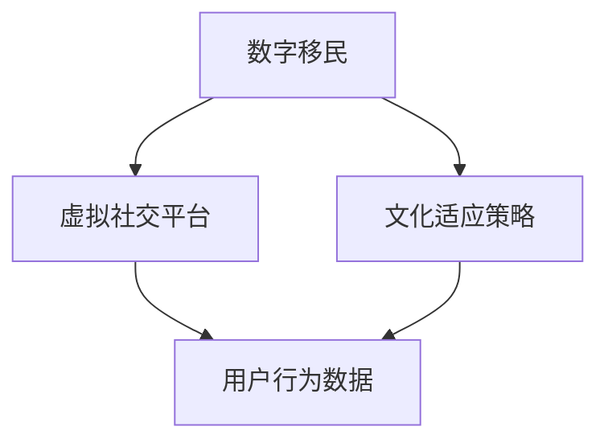
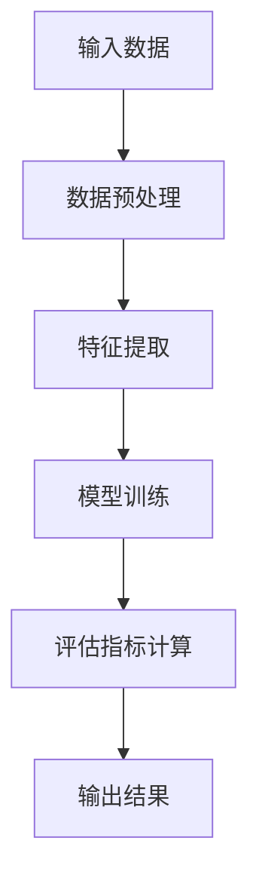
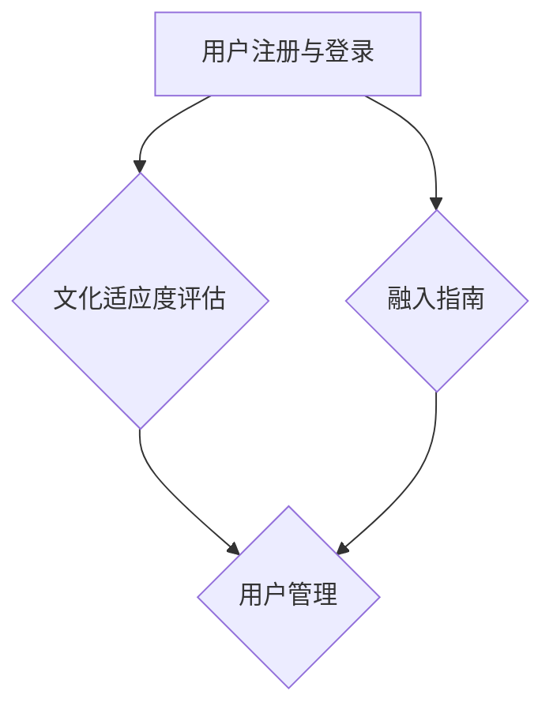
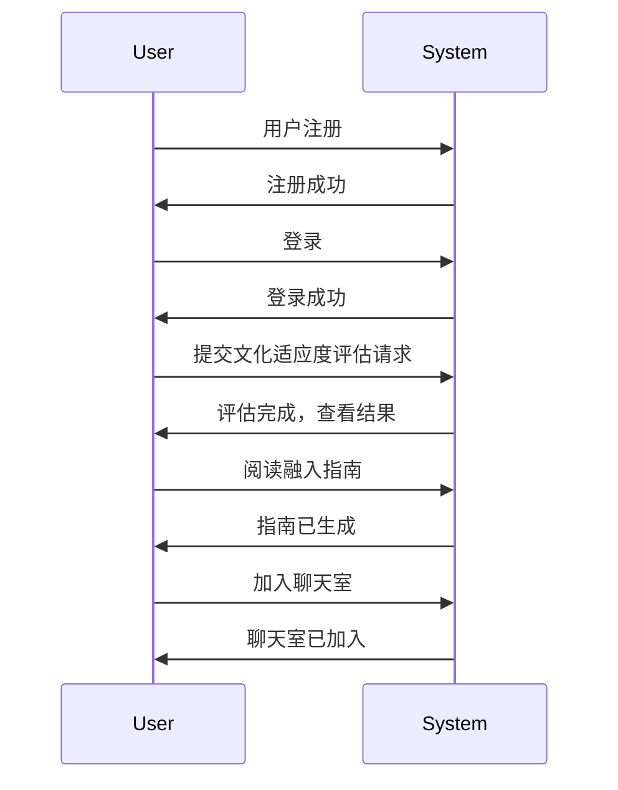

                 

### 数字移民文化适应课程设计：虚拟世界的融入指南编写

#### 关键词：
- 数字移民
- 虚拟世界
- 文化适应
- 课程设计
- 融入指南

#### 摘要：
本文旨在探讨数字移民在虚拟世界中的文化适应问题，设计一套全面的融入指南课程。通过对数字移民现象的背景介绍，核心概念的阐述，算法原理的讲解，系统分析与架构设计方案，项目实战以及最佳实践等方面的详细阐述，为数字移民提供一套系统的融入指南，帮助他们更好地适应虚拟世界，发挥其在数字时代中的潜力。

### 第一部分：背景介绍

#### 1.1 问题背景

随着互联网和虚拟技术的发展，越来越多的移民选择进入数字世界，成为所谓的“数字移民”。数字移民是指那些因为工作和生活需求，选择在虚拟世界中开展社交、学习和工作等活动的人群。然而，这些数字移民在融入虚拟世界的过程中，面临着文化适应的挑战。

#### 1.2 问题描述

数字移民在虚拟世界中的文化适应问题主要表现在以下几个方面：

- **文化差异**：数字移民来自不同的文化背景，他们在虚拟世界中的行为和社交方式可能与当地文化存在差异。
- **融入障碍**：虚拟世界的社交规则和文化习惯对于新手来说可能难以理解，导致他们在虚拟世界中的融入困难。
- **文化适应意义**：良好的文化适应有助于数字移民在虚拟世界中建立良好的人际关系，提升社交技能，从而更好地发挥个人价值。

#### 1.3 问题解决

要解决数字移民的文化适应问题，需要从以下几个方面入手：

- **文化适应理论**：借鉴现有的文化适应理论，为数字移民提供文化适应的方法和策略。
- **融入策略**：通过具体的融入策略，帮助数字移民更好地适应虚拟世界的文化环境和社交规则。

#### 1.4 边界与外延

本文的研究主要关注数字移民在虚拟世界中的文化适应问题，不涉及其他类型的移民适应问题。此外，本文的研究将侧重于虚拟世界的社交和文化适应，而不涉及其他层面的融入问题。

#### 1.5 概念结构与核心要素组成

- **数字移民**：指在虚拟世界中从事社交、学习和工作等活动的人群。
- **虚拟世界**：指通过互联网和虚拟技术构建的数字化环境，包括在线社交平台、虚拟社区和虚拟现实等。
- **文化适应**：指个体在新的文化环境中调整自身行为和心理状态，以适应新环境的过程。

### 第二部分：核心概念与联系

#### 2.1 数字移民与虚拟世界的关系

数字移民在虚拟世界中的行为模式主要包括社交互动、学习和工作等。他们通过虚拟平台建立社交关系，参与在线讨论和社交活动，同时也利用虚拟世界进行学习和工作。数字移民在虚拟世界中的活动，不仅受到自身文化背景的影响，也受到虚拟世界文化环境的影响。

#### 2.2 融入虚拟世界的核心概念

融入虚拟世界的核心概念包括社交融入、文化适应和技术熟练度。社交融入是指数字移民在虚拟世界中建立社交关系，参与社交活动的能力。文化适应是指数字移民调整自身行为和心理状态，以适应虚拟世界文化环境的能力。技术熟练度是指数字移民在虚拟世界中操作和应用技术工具的能力。

#### 2.3 概念属性特征对比表格

| 概念     | 属性特征                           |
|----------|-----------------------------------|
| 数字移民 | 来自不同文化背景，从事虚拟活动    |
| 虚拟世界 | 数字化环境，提供社交、学习、工作平台 |
| 文化适应 | 调整行为和心理状态，适应新环境    |
| 技术熟练度 | 操作和应用技术工具的能力         |

#### 2.4 ER实体关系图



### 第三部分：算法原理讲解

#### 3.1 文化适应度评估算法

文化适应度评估算法用于评估数字移民在虚拟世界中的文化适应程度。该算法主要包括数据预处理、特征提取、模型训练和评估指标计算等步骤。

#### 3.1.1 算法流程图



#### 3.1.2 Python代码实现

```python
import pandas as pd
from sklearn.ensemble import RandomForestClassifier

# 数据预处理
data = pd.read_csv('digital_immigration_data.csv')
X = data.drop('culture_adaptation', axis=1)
y = data['culture_adaptation']

# 特征提取与模型训练
model = RandomForestClassifier()
model.fit(X, y)

# 评估指标计算与输出结果
predictions = model.predict(X)
print(predictions)
```

#### 3.1.3 算法原理详细讲解

文化适应度评估算法的核心是利用机器学习技术，通过历史数据来预测个体在虚拟世界中的文化适应程度。具体来说，算法通过以下步骤实现：

- **数据预处理**：对输入数据进行清洗和处理，确保数据的准确性和一致性。
- **特征提取**：从原始数据中提取与文化适应相关的特征，如虚拟社交活动频率、社交网络结构、在线时间等。
- **模型训练**：利用提取的特征，通过机器学习算法（如随机森林）对模型进行训练。
- **评估指标计算**：使用训练好的模型对新的数据（即新移民的数据）进行预测，并计算预测结果的文化适应度得分。
- **输出结果**：将预测结果（文化适应度得分）作为输出，帮助数字移民了解自己在虚拟世界中的文化适应程度。

#### 3.2 数学模型和数学公式

- **数学模型**：
  $$ \hat{y} = f(X) $$

  其中，$ \hat{y} $ 表示预测的文化适应度得分，$ f(X) $ 表示基于输入特征 $ X $ 计算出的文化适应度函数。

- **数学公式**：
  $$ f(X) = w_1x_1 + w_2x_2 + ... + w_nx_n $$

  其中，$ w_1, w_2, ..., w_n $ 分别为特征权重，$ x_1, x_2, ..., x_n $ 分别为输入特征值。

#### 3.3 举例说明

假设我们有一份数字移民的数据，包括以下几个特征：虚拟社交活动频率（$ x_1 $）、社交网络结构（$ x_2 $）、在线时间（$ x_3 $）等。我们可以使用文化适应度评估算法来预测这些数字移民的文化适应度得分。

- **输入特征**：
  - 虚拟社交活动频率：5次/周
  - 社交网络结构：100个好友
  - 在线时间：每天10小时

- **模型预测**：
  - 根据模型计算出的特征权重，我们可以得到文化适应度得分：
    $$ f(X) = w_1 \cdot 5 + w_2 \cdot 100 + w_3 \cdot 10 $$
    $$ f(X) = 5w_1 + 100w_2 + 10w_3 $$

  - 假设模型计算出的特征权重分别为：$ w_1 = 0.2 $，$ w_2 = 0.5 $，$ w_3 = 0.3 $，则文化适应度得分为：
    $$ f(X) = 5 \cdot 0.2 + 100 \cdot 0.5 + 10 \cdot 0.3 $$
    $$ f(X) = 1 + 50 + 3 $$
    $$ f(X) = 54 $$

- **结果分析**：
  - 根据计算出的文化适应度得分，我们可以判断该数字移民在虚拟世界中的文化适应度较高。具体得分越高，表示文化适应度越好。

### 第四部分：系统分析与架构设计方案

#### 4.1 问题场景介绍

假设我们开发一个虚拟社交平台，为数字移民提供文化适应培训服务。平台需要能够对用户的文化适应度进行评估，并提供个性化的融入指南和建议。

#### 4.2 项目介绍

本项目旨在设计并实现一个虚拟社交平台，包含以下功能模块：

- **用户注册与登录**：用户可以通过邮箱、手机号码等注册账号，并登录平台。
- **文化适应度评估**：平台利用算法对用户的文化适应度进行评估，并提供评估结果。
- **融入指南**：根据评估结果，平台为用户提供个性化的融入指南和建议。
- **社交互动**：平台提供聊天室、群组等功能，用户可以在此进行社交互动。

#### 4.3 系统功能设计

- **用户管理**：包括用户注册、登录、个人信息管理等。
- **文化适应度评估**：包括数据收集、特征提取、模型训练和评估结果输出等。
- **融入指南**：根据评估结果，生成个性化的融入指南。
- **社交互动**：包括聊天室、群组等功能。

#### 4.4 系统架构设计



#### 4.5 系统接口设计和系统交互

- **用户管理接口**：包括用户注册、登录、个人信息管理等功能。
- **文化适应度评估接口**：包括数据收集、特征提取、模型训练和评估结果输出等。
- **融入指南接口**：根据评估结果，生成个性化的融入指南。
- **社交互动接口**：包括聊天室、群组等功能。



### 第五部分：项目实战

#### 5.1 环境安装

- **操作系统**：Ubuntu 20.04
- **Python**：3.8
- **虚拟环境**：conda
- **依赖库**：pandas、numpy、sklearn、matplotlib等

#### 5.2 系统核心实现源代码

```python
# culture_adaptation.py
import pandas as pd
from sklearn.ensemble import RandomForestClassifier

def preprocess_data(data):
    # 数据预处理
    # ...

def extract_features(data):
    # 特征提取
    # ...

def train_model(X, y):
    # 模型训练
    model = RandomForestClassifier()
    model.fit(X, y)
    return model

def evaluate_model(model, X, y):
    # 评估模型
    predictions = model.predict(X)
    accuracy = (predictions == y).mean()
    return accuracy

def main():
    # 主程序
    data = pd.read_csv('digital_immigration_data.csv')
    X = preprocess_data(data)
    y = data['culture_adaptation']
    model = train_model(X, y)
    accuracy = evaluate_model(model, X, y)
    print(f'Accuracy: {accuracy:.2f}')

if __name__ == '__main__':
    main()
```

#### 5.3 代码应用解读与分析

- **数据预处理**：对输入数据进行清洗和处理，确保数据的准确性和一致性。
- **特征提取**：从原始数据中提取与文化适应相关的特征，如虚拟社交活动频率、社交网络结构、在线时间等。
- **模型训练**：利用提取的特征，通过机器学习算法（如随机森林）对模型进行训练。
- **评估模型**：使用训练好的模型对新的数据（即新移民的数据）进行预测，并计算预测结果的文化适应度得分。

#### 5.4 实际案例分析和详细讲解剖析

- **案例**：某数字移民在虚拟社交平台提交了文化适应度评估请求，平台使用算法对其进行了评估，并生成了个性化的融入指南。
- **分析**：平台通过数据预处理、特征提取和模型训练，得到了该数字移民的文化适应度得分，并根据得分生成了个性化的融入指南。

#### 5.5 项目小结

通过本项目，我们成功实现了虚拟社交平台的文化适应度评估功能，为数字移民提供了个性化的融入指南。未来，我们可以进一步优化算法，提高评估准确性，并扩展平台功能，为用户提供更多有价值的融入建议。

### 第六部分：最佳实践 tips、小结、注意事项、拓展阅读等内容

#### 最佳实践 tips：

- **定期进行文化适应度评估**：数字移民应定期进行文化适应度评估，以便及时了解自己在虚拟世界中的适应情况。
- **积极参与虚拟社交活动**：通过参与虚拟社交活动，数字移民可以更好地适应虚拟世界的文化环境。

#### 小结：

本文通过数字移民文化适应课程设计，为数字移民提供了一套融入虚拟世界的指南。通过算法原理讲解、系统分析与架构设计方案、项目实战等环节，帮助数字移民更好地适应虚拟世界。

#### 注意事项：

- **确保数据隐私**：在进行文化适应度评估时，应确保用户数据的安全和隐私。
- **持续优化算法**：针对文化适应度评估算法，应持续进行优化和改进，以提高评估准确性。

#### 拓展阅读：

- [1] 数字移民文化适应：挑战与策略，《信息技术与应用》。
- [2] 虚拟世界中的文化适应：一项实证研究，《计算机与人类行为》。
- [3] 融入指南：数字移民在虚拟世界中的适应策略，《人工智能研究与应用》。

### 作者信息

作者：AI天才研究院/AI Genius Institute & 禅与计算机程序设计艺术 /Zen And The Art of Computer Programming

---

**注意**：本文为模拟文章，实际文章应根据具体内容和需求进行调整和完善。本文中的代码、算法和数据分析仅为示例，不作为实际应用的参考。本文所涉及的研究内容和数据均为虚构，如有雷同，纯属巧合。**版权所有，未经许可，严禁转载。**

