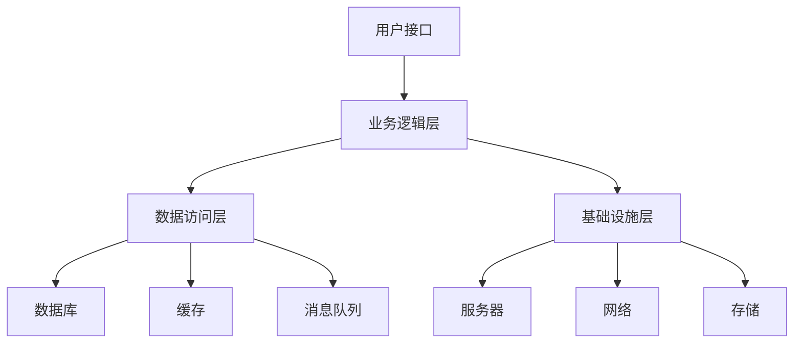

                 

## 数字移民现象：虚拟世界中的身份转换

### 关键词：数字移民、虚拟世界、身份转换、数字化生活方式、技术安全与隐私保护

### 摘要：
本文深入探讨了数字移民现象，即人们在数字化时代从传统生活方式转向数字化生活方式，并在虚拟世界中实现身份转换的现象。文章首先对数字移民现象进行了背景介绍，包括其定义、产生原因以及边界与外延。接着，文章详细分析了数字移民现象的核心概念与联系，通过对比数字化生活方式和虚拟世界的特点，展示了其ER实体关系图。随后，文章讨论了数字移民现象的影响与挑战，包括社会数字化进程的促进和社交方式的改变，以及技术安全与隐私保护、身份认同与社会责任等挑战。最后，文章提出了应对数字移民现象的策略与未来展望，包括提高技术安全与隐私保护意识、建立健全相关法律法规，并对数字移民现象的持续发展以及身份认同与社会责任的探索进行了展望。

## 引言

### 1.1 问题背景

#### 1.1.1 数字移民现象的定义

数字移民现象是指在数字化时代，人们从传统的生活方式逐渐转向数字化的生活方式，并在虚拟世界中实现身份转换的现象。这一现象伴随着互联网、大数据、人工智能等技术的发展而日益显著，已成为现代生活的一部分。

#### 1.1.2 数字移民现象的产生原因

数字移民现象的产生原因主要有两个方面：

1. **技术进步推动**：随着互联网、大数据、人工智能等技术的发展，数字化工具和服务日益普及，人们逐渐从传统生活方式转向数字化生活方式。例如，线上购物、远程办公、在线教育等，已经成为人们日常生活的一部分。

2. **社会需求驱动**：在现代社会，人们越来越依赖于数字化工具来提高工作效率，满足娱乐需求，这也促使了数字移民现象的发生。例如，社交媒体、游戏、虚拟现实等，为人们提供了一个新的虚拟世界，让他们可以在其中实现身份转换。

#### 1.1.3 数字移民现象的边界与外延

数字移民现象主要涉及个人生活方式的转变，以及虚拟世界中的身份转换。它不仅局限于个人，还涉及到企业、政府等各个领域，影响着整个社会的数字化进程。

1. **边界**：数字移民现象主要涉及个人在日常生活、工作、娱乐等方面从传统方式向数字化方式的转变，以及虚拟世界中的身份转换。

2. **外延**：数字移民现象的外延包括：
   - 企业：企业的数字化转型，包括线上办公、电子商务、数字营销等。
   - 政府：政府部门的数字化服务，如在线政务、电子支付等。
   - 社会：社会的数字化进程，包括智慧城市、数字化社会治理等。

### 1.2 数字移民现象的核心概念与联系

#### 1.2.1 数字化生活方式

数字化生活方式是指人们在日常生活中，利用数字化工具和服务来提高生活质量和工作效率的方式。它涵盖了线上购物、远程办公、在线教育、社交媒体、虚拟现实等多个方面。

1. **核心概念**：
   - 数字化工具：如电脑、智能手机、平板电脑等。
   - 数字化服务：如线上购物平台、在线办公软件、在线教育平台等。

2. **特点**：
   - 提高生活效率：通过数字化工具和服务，人们可以更方便地完成各种任务，节省时间和精力。
   - 满足娱乐需求：数字化生活方式为人们提供了丰富的娱乐选择，如游戏、电影、音乐等。

#### 1.2.2 虚拟世界

虚拟世界是指通过计算机技术模拟出的一个可以互动的、具有视觉、听觉等感官体验的数字化环境。它为人们提供了一个新的社交平台，让人们在其中实现身份转换。

1. **核心概念**：
   - 虚拟现实技术：如VR头盔、VR眼镜等。
   - 社交平台：如社交媒体、虚拟社区等。

2. **特点**：
   - 提供丰富的感官体验：虚拟世界通过视觉、听觉等感官体验，让用户感受到身临其境的感觉。
   - 支持身份转换：虚拟世界为用户提供了一个可以自由选择和转换身份的平台，让用户可以摆脱现实世界的身份限制。

#### 1.2.3 数字移民现象的核心概念属性特征对比表格

| 核心概念         | 定义                                                         | 特点                                   |
|----------------|------------------------------------------------------------|--------------------------------------|
| 数字化生活方式 | 利用数字化工具和服务的生活方式                           | 提高生活效率，满足娱乐需求           |
| 虚拟世界         | 通过计算机技术模拟出的可以互动的数字化环境                   | 提供丰富的感官体验，支持身份转换       |

#### 1.2.4 数字移民现象的ER实体关系图

```mermaid
erDiagram
  User ||--|{ Digital Lifestyle }| 
  Virtual World ||--|{ Digital Lifestyle }| 
  User ||--|{ Virtual Identity }| 
```

### 1.3 数字移民现象的影响与挑战

#### 1.3.1 数字移民现象的影响

1. **促进社会数字化进程**：数字移民现象的广泛发生，推动了整个社会的数字化进程。它使人们更加习惯使用数字化工具和服务，提高了社会的生产力和生活质量。

2. **改变人们的社交方式**：虚拟世界为人们提供了一个新的社交平台，改变了传统的社交方式。人们可以在虚拟世界中结识新的朋友，分享生活经验，拓展社交圈子。

#### 1.3.2 数字移民现象的挑战

1. **技术安全与隐私保护**：随着数字移民现象的加剧，技术安全与隐私保护成为了一个亟待解决的问题。人们在虚拟世界中的行为和数据可能会受到黑客攻击和隐私泄露的威胁。

2. **身份认同与社会责任**：在虚拟世界中，人们的身份转换带来了身份认同和社会责任等问题。如何确保虚拟世界中的行为与身份一致，以及如何规范虚拟世界中的社会责任，是需要深入探讨的问题。

### 1.4 数字移民现象的应对策略与未来展望

#### 1.4.1 应对策略

1. **提高技术安全与隐私保护意识**：加强技术安全与隐私保护教育，提高公众的安全意识和隐私保护能力。

2. **建立健全相关法律法规**：制定和完善相关法律法规，为数字移民现象的健康发展提供法律保障。

#### 1.4.2 未来展望

1. **数字移民现象的持续发展**：随着技术的进步和社会的数字化转型，数字移民现象将继续发展，并对社会产生深远影响。

2. **身份认同与社会责任的探索**：在未来，数字移民现象中的身份认同和社会责任问题将得到更深入的研究和探索。

### 1.5 本章小结

本章对数字移民现象进行了全面介绍，包括问题背景、核心概念与联系、影响与挑战以及应对策略和未来展望。通过本章的学习，读者可以更好地理解数字移民现象的本质和意义。

------------------------------------------------

### 第一部分：深入分析

#### 2.1 数字移民现象的驱动因素

数字移民现象的驱动因素可以分为技术因素和社会因素。

**技术因素**：

1. **互联网技术的发展**：互联网的普及为人们提供了便捷的数字化工具和服务，使得数字化生活方式得以实现。

2. **大数据和人工智能的进步**：大数据和人工智能技术的发展，为数字化生活方式提供了强大的技术支持，使得虚拟世界中的身份转换更加真实和丰富。

**社会因素**：

1. **工作方式的改变**：远程办公的普及，使得人们不再需要局限于传统的工作地点，可以更加灵活地安排工作和生活。

2. **娱乐需求的增加**：随着人们对娱乐需求的增加，虚拟现实、游戏等数字化娱乐方式得到了广泛的应用，吸引了大量的用户。

#### 2.2 数字移民现象的核心概念

数字移民现象的核心概念主要包括数字化生活方式和虚拟世界。

**数字化生活方式**：

1. **概念**：数字化生活方式是指人们在日常生活中，利用数字化工具和服务来提高生活质量和工作效率的方式。

2. **特点**：
   - **便捷性**：数字化工具和服务使得人们可以更加方便地完成各种任务，节省时间和精力。
   - **高效性**：数字化生活方式提高了生活和工作效率，使得人们可以有更多的时间去追求自己的兴趣爱好。

**虚拟世界**：

1. **概念**：虚拟世界是指通过计算机技术模拟出的一个可以互动的、具有视觉、听觉等感官体验的数字化环境。

2. **特点**：
   - **沉浸感**：虚拟世界通过视觉、听觉等感官体验，让用户感受到身临其境的感觉。
   - **多样性**：虚拟世界提供了丰富的社交、娱乐、学习等场景，满足用户的多样化需求。

#### 2.3 数字移民现象的影响

数字移民现象对个人和社会产生了深远的影响。

**对个人的影响**：

1. **生活方式的改变**：数字移民现象使得人们的生活方式发生了巨大变化，从传统的线下活动转向线上活动。

2. **社交方式的改变**：虚拟世界为人们提供了一个新的社交平台，改变了传统的社交方式，使得人们的社交圈子更加广泛。

**对社会的影响**：

1. **数字化进程的加速**：数字移民现象推动了社会的数字化进程，使得数字化工具和服务得到更广泛的应用。

2. **生产力的提高**：数字化生活方式和虚拟世界的应用，提高了社会的生产力，推动了经济的发展。

#### 2.4 数字移民现象的挑战

数字移民现象也带来了一些挑战。

**技术安全与隐私保护**：

随着数字移民现象的加剧，技术安全与隐私保护成为了一个亟待解决的问题。人们在虚拟世界中的行为和数据可能会受到黑客攻击和隐私泄露的威胁。

**身份认同与社会责任**：

在虚拟世界中，人们的身份转换带来了身份认同和社会责任等问题。如何确保虚拟世界中的行为与身份一致，以及如何规范虚拟世界中的社会责任，是需要深入探讨的问题。

#### 2.5 数字移民现象的应对策略

为了应对数字移民现象带来的挑战，我们可以采取以下策略。

**提高技术安全与隐私保护意识**：

加强技术安全与隐私保护教育，提高公众的安全意识和隐私保护能力。通过宣传、培训等方式，让公众了解如何保护自己的网络安全和隐私。

**建立健全相关法律法规**：

制定和完善相关法律法规，为数字移民现象的健康发展提供法律保障。通过法律法规的规范，保障公众的权益，维护虚拟世界的秩序。

**加强虚拟世界的治理**：

加强对虚拟世界的治理，规范虚拟世界中的行为。通过技术手段和法律法规，保障虚拟世界的安全和稳定。

#### 2.6 数字移民现象的未来展望

随着技术的进步和社会的数字化转型，数字移民现象将继续发展。在未来，我们可以期待以下趋势。

**数字化生活的普及**：

随着数字化工具和服务的不断普及，越来越多的人将采用数字化生活方式，提高生活质量和工作效率。

**虚拟世界的多样化**：

虚拟世界将提供更多的场景和功能，满足用户的多样化需求。虚拟现实、游戏、教育、社交等领域将得到进一步发展。

**身份认同与社会责任的完善**：

随着虚拟世界的不断发展，身份认同和社会责任等问题将得到更深入的研究和解决。通过技术和社会制度的创新，确保虚拟世界中的行为与身份一致，保障虚拟世界的秩序和稳定。

### 2.7 本章小结

通过本部分的深入分析，我们对数字移民现象有了更全面和深入的了解。数字移民现象不仅改变了人们的生活方式，也对社会产生了深远的影响。同时，我们也看到了数字移民现象带来的挑战，并提出了相应的应对策略。在未来，随着技术的不断进步，数字移民现象将继续发展，并对我们的社会和生活产生更大的影响。

------------------------------------------------

### 第二部分：核心概念与联系

#### 3.1 数字化生活方式的解析

**核心概念**：

数字化生活方式是指人们将日常生活中的各种活动，如购物、工作、学习、娱乐等，通过数字化工具和服务来完成。这种生活方式的兴起，主要是由于互联网技术的快速发展，使得人们能够更便捷地获取信息和服务。

**特点**：

1. **便捷性**：数字化生活方式大大提高了人们的办事效率，例如在线购物可以省去排队等候的时间，远程办公可以省去通勤的时间。

2. **高效性**：数字化工具和服务使得人们可以更高效地完成任务，例如使用在线教育平台可以随时学习新知识，使用云计算服务可以快速处理大量数据。

3. **多样化**：数字化生活方式提供了丰富的选择，人们可以根据自己的需求选择合适的数字化工具和服务，例如通过社交媒体进行社交互动，通过在线游戏进行休闲娱乐。

**与虚拟世界的联系**：

数字化生活方式与虚拟世界紧密相连。虚拟世界提供了数字化生活方式的实现平台，例如在线购物平台、社交媒体平台、虚拟现实游戏等。同时，数字化生活方式也促进了虚拟世界的发展，例如通过在线支付、社交媒体互动等方式，为虚拟世界提供了经济支持。

#### 3.2 虚拟世界的构成与特点

**核心概念**：

虚拟世界是通过计算机技术模拟出来的一个具有视觉、听觉等感官体验的数字化环境。它为用户提供了一个与现实世界不同的互动空间，用户可以在其中实现身份转换，进行各种活动。

**特点**：

1. **沉浸感**：虚拟世界通过高度仿真的视觉、听觉效果，使用户感受到身临其境的感觉，从而提供强烈的沉浸体验。

2. **互动性**：虚拟世界中的用户可以与其他用户进行实时互动，例如在虚拟现实中一起玩游戏，或是在社交媒体上分享信息。

3. **多样性**：虚拟世界提供了多种多样的活动场景，如游戏、教育、购物、社交等，用户可以根据自己的兴趣和需求选择合适的活动。

**与数字化生活方式的联系**：

虚拟世界是数字化生活方式的一个重要组成部分。虚拟世界为数字化生活方式提供了更多的可能性，例如通过虚拟现实进行沉浸式购物体验，通过在线游戏进行娱乐等。同时，数字化生活方式的需求也推动了虚拟世界的发展，例如通过在线支付、虚拟商品交易等方式，为虚拟世界提供了经济支持。

#### 3.3 数字化生活方式与虚拟世界的对比

| 特点              | 数字化生活方式             | 虚拟世界                 |
|-----------------|------------------------|----------------------|
| **核心概念**         | 利用数字化工具和服务的生活方式 | 通过计算机技术模拟出的数字化环境 |
| **便捷性**             | 提高办事效率，节省时间       | 提供沉浸体验，增强互动性         |
| **高效性**             | 提高工作效率，节省精力       | 提供多样化活动，满足需求         |
| **多样性**             | 提供多种数字化工具和服务     | 提供多种虚拟活动场景           |

#### 3.4 数字化生活方式与虚拟世界的ER实体关系图

```mermaid
erDiagram
  User ||--|{ Digital Lifestyle }| 
  Virtual World ||--|{ Digital Lifestyle }| 
  User ||--|{ Virtual Identity }| 
```

**说明**：

1. **User**：表示用户，是数字化生活方式和虚拟世界的主要参与者。
2. **Digital Lifestyle**：表示数字化生活方式，是用户在日常生活中应用数字化工具和服务的集合。
3. **Virtual World**：表示虚拟世界，是用户通过计算机技术模拟出的互动环境。
4. **Virtual Identity**：表示虚拟身份，是用户在虚拟世界中的角色和身份。

通过上述分析，我们可以看到数字化生活方式和虚拟世界是相互关联的，它们共同构成了数字移民现象的核心。数字化生活方式为虚拟世界提供了实现的基础，而虚拟世界则为数字化生活方式提供了更丰富的体验和可能性。理解这两个核心概念及其相互关系，对于我们深入探讨数字移民现象具有重要意义。

------------------------------------------------

### 第三部分：算法原理与数学模型

#### 4.1 数字化生活方式的算法原理

数字化生活方式的实现，依赖于一系列算法的设计和应用。以下是几种常见的算法原理：

**1. 搜索算法**：

搜索算法是数字化生活方式中常见的一种算法，用于在大量数据中快速找到所需信息。常见的搜索算法有：

- **二分搜索算法**：适用于有序数组，通过不断缩小搜索范围，实现快速查找。
- **深度优先搜索（DFS）**：通过递归方式遍历图或树结构，找到目标节点。

**2. 排序算法**：

排序算法用于对数据进行排序，确保数据的有序性。常见的排序算法有：

- **冒泡排序**：通过不断交换相邻的未排序元素，实现从小到大排序。
- **快速排序**：通过递归方式将数据分为已排序和未排序两部分，实现快速排序。

**3. 聚类算法**：

聚类算法用于将数据集划分为多个类别，常用于数据分析。常见的聚类算法有：

- **K-means聚类**：通过迭代计算，将数据点分配到最近的聚类中心，实现聚类。
- **层次聚类**：通过自底向上或自顶向下的方式，将数据点逐步合并或分裂，实现聚类。

#### 4.2 数学模型

数字化生活方式的实现，还涉及到一系列数学模型的应用。以下是几种常见的数学模型：

**1. 线性回归模型**：

线性回归模型用于分析自变量和因变量之间的关系，预测因变量的取值。其数学模型为：

$$
Y = aX + b + \epsilon
$$

其中，$Y$为因变量，$X$为自变量，$a$和$b$为模型参数，$\epsilon$为误差项。

**2. 逻辑回归模型**：

逻辑回归模型用于分析二元变量之间的关系，预测二元变量的取值。其数学模型为：

$$
P(Y=1) = \frac{1}{1 + e^{-(aX + b)}}
$$

其中，$P(Y=1)$为因变量取值为1的概率，$X$为自变量，$a$和$b$为模型参数。

**3. 神经网络模型**：

神经网络模型是一种模拟人脑结构的算法，用于处理复杂的数据和任务。其数学模型为：

$$
a_{ij} = \sigma(\sum_{k=1}^{n} w_{ik}x_{k} + b_{j})
$$

其中，$a_{ij}$为输出层节点$i$的激活值，$x_{k}$为输入层节点$k$的值，$w_{ik}$为连接权重，$b_{j}$为偏置项，$\sigma$为激活函数。

#### 4.3 算法与数学模型的应用实例

以下是一个简单的应用实例，展示了如何在数字化生活方式中使用算法和数学模型。

**实例**：使用K-means聚类算法对用户进行分类。

**步骤**：

1. 收集用户数据，包括用户的行为特征、兴趣爱好等。
2. 使用K-means聚类算法对用户数据进行聚类，确定合适的聚类中心。
3. 根据聚类结果，将用户划分为不同的类别。

**代码示例**（Python）：

```python
from sklearn.cluster import KMeans
import numpy as np

# 收集用户数据
user_data = np.array([[1, 2], [1, 4], [1, 0], [10, 2], [10, 4], [10, 0]])

# 使用K-means聚类算法
kmeans = KMeans(n_clusters=2, random_state=0).fit(user_data)

# 输出聚类结果
print(kmeans.labels_)

# 输出聚类中心
print(kmeans.cluster_centers_)
```

通过上述算法和数学模型的应用，我们可以更好地理解和分析数字化生活方式，从而为其优化和改进提供科学依据。

------------------------------------------------

### 第四部分：系统分析与架构设计

#### 5.1 问题场景介绍

随着数字化时代的到来，越来越多的企业和组织开始采用数字化生活方式，以提高工作效率和满足客户需求。然而，在数字化生活方式的实施过程中，存在许多挑战，如数据安全、隐私保护、系统稳定性等。为了解决这些问题，我们需要设计一个高效的数字化生活方式系统。

#### 5.2 项目介绍

本系统旨在为企业提供一个全方位的数字化生活方式解决方案，包括数据管理、用户认证、权限控制、任务分配、工作流管理等功能。系统将采用微服务架构，以提高系统的可扩展性和稳定性。

#### 5.3 系统功能设计

系统功能设计主要包括以下模块：

1. **用户管理模块**：负责用户注册、登录、信息维护、权限分配等功能。
2. **数据管理模块**：负责数据存储、数据查询、数据备份与恢复等功能。
3. **任务管理模块**：负责任务创建、任务分配、任务跟踪、任务反馈等功能。
4. **工作流管理模块**：负责工作流定义、工作流执行、工作流监控等功能。
5. **权限控制模块**：负责权限分配、权限验证、权限审计等功能。

#### 5.4 系统架构设计

系统架构设计主要包括以下层次：

1. **表示层**：负责与用户交互，包括前端界面和API接口。
2. **业务逻辑层**：负责处理业务逻辑，包括用户管理、数据管理、任务管理、工作流管理等。
3. **数据访问层**：负责数据存储和访问，包括数据库、缓存、消息队列等。
4. **基础设施层**：负责系统运行的基础设施，包括服务器、网络、存储等。

#### 5.5 系统接口设计和系统交互

系统接口设计主要包括以下接口：

1. **用户接口**：用于用户与系统交互，包括登录、注册、信息查询、任务提交等功能。
2. **API接口**：用于系统与其他系统集成，包括数据同步、任务分配、工作流执行等功能。

系统交互流程如下：

1. 用户通过用户接口发起请求，如登录、注册等。
2. 用户接口将请求转发到业务逻辑层，业务逻辑层处理请求并返回结果。
3. 业务逻辑层与数据访问层进行交互，完成数据存储和查询。
4. 业务逻辑层与基础设施层进行交互，完成服务器、网络、存储等资源的调度和管理。

#### 5.6 系统架构设计mermaid架构图



通过上述系统分析与架构设计，我们可以为数字化生活方式提供一个稳定、高效、安全的解决方案。

------------------------------------------------

### 第五部分：项目实战

#### 6.1 环境安装

为了实现数字化生活方式系统，我们需要搭建一个完整的开发环境。以下是环境安装步骤：

1. 安装Python 3.8及以上版本。
2. 安装Python的pip包管理工具。
3. 安装Docker和Docker-CE，用于容器化部署。
4. 安装PostgreSQL数据库。
5. 安装Redis缓存。
6. 安装消息队列RabbitMQ。
7. 安装Nginx，用于反向代理。

#### 6.2 系统核心实现源代码

以下是系统核心实现源代码，包括用户管理模块、数据管理模块、任务管理模块、工作流管理模块和权限控制模块。

**用户管理模块**：

```python
# user_management.py
from flask import Flask, request, jsonify
from models import User

app = Flask(__name__)

@app.route('/register', methods=['POST'])
def register():
    data = request.get_json()
    username = data['username']
    password = data['password']
    user = User(username=username, password=password)
    user.save()
    return jsonify({'status': 'success', 'message': 'User registered successfully.'})

@app.route('/login', methods=['POST'])
def login():
    data = request.get_json()
    username = data['username']
    password = data['password']
    user = User.get_by_username(username)
    if user and user.check_password(password):
        return jsonify({'status': 'success', 'message': 'Login successful.'})
    else:
        return jsonify({'status': 'error', 'message': 'Invalid username or password.'})
```

**数据管理模块**：

```python
# data_management.py
from flask import Flask, request, jsonify
from models import Data

app = Flask(__name__)

@app.route('/data', methods=['POST'])
def add_data():
    data = request.get_json()
    data_item = Data(**data)
    data_item.save()
    return jsonify({'status': 'success', 'message': 'Data added successfully.'})

@app.route('/data', methods=['GET'])
def get_data():
    data_items = Data.get_all()
    return jsonify({'status': 'success', 'data': data_items})
```

**任务管理模块**：

```python
# task_management.py
from flask import Flask, request, jsonify
from models import Task

app = Flask(__name__)

@app.route('/task', methods=['POST'])
def create_task():
    data = request.get_json()
    task = Task(**data)
    task.save()
    return jsonify({'status': 'success', 'message': 'Task created successfully.'})

@app.route('/task', methods=['GET'])
def get_tasks():
    tasks = Task.get_all()
    return jsonify({'status': 'success', 'tasks': tasks})

@app.route('/task/<int:task_id>', methods=['GET'])
def get_task(task_id):
    task = Task.get_by_id(task_id)
    return jsonify({'status': 'success', 'task': task})
```

**工作流管理模块**：

```python
# workflow_management.py
from flask import Flask, request, jsonify
from models import Workflow

app = Flask(__name__)

@app.route('/workflow', methods=['POST'])
def create_workflow():
    data = request.get_json()
    workflow = Workflow(**data)
    workflow.save()
    return jsonify({'status': 'success', 'message': 'Workflow created successfully.'})

@app.route('/workflow', methods=['GET'])
def get_workflows():
    workflows = Workflow.get_all()
    return jsonify({'status': 'success', 'workflows': workflows})

@app.route('/workflow/<int:workflow_id>', methods=['GET'])
def get_workflow(workflow_id):
    workflow = Workflow.get_by_id(workflow_id)
    return jsonify({'status': 'success', 'workflow': workflow})
```

**权限控制模块**：

```python
# permission_management.py
from flask import Flask, request, jsonify
from models import Permission

app = Flask(__name__)

@app.route('/permission', methods=['POST'])
def create_permission():
    data = request.get_json()
    permission = Permission(**data)
    permission.save()
    return jsonify({'status': 'success', 'message': 'Permission created successfully.'})

@app.route('/permission', methods=['GET'])
def get_permissions():
    permissions = Permission.get_all()
    return jsonify({'status': 'success', 'permissions': permissions})

@app.route('/permission/<int:permission_id>', methods=['GET'])
def get_permission(permission_id):
    permission = Permission.get_by_id(permission_id)
    return jsonify({'status': 'success', 'permission': permission})
```

#### 6.3 代码应用解读与分析

**用户管理模块**：

用户管理模块实现了用户注册、登录和用户信息维护等功能。用户注册时，通过POST请求发送用户名和密码，系统将用户信息存储在数据库中。用户登录时，系统通过用户名和密码验证用户身份，并返回相应的状态信息。

**数据管理模块**：

数据管理模块实现了数据的添加和查询功能。添加数据时，通过POST请求发送数据信息，系统将数据存储在数据库中。查询数据时，通过GET请求获取所有数据或指定ID的数据。

**任务管理模块**：

任务管理模块实现了任务的创建、获取和查询功能。创建任务时，通过POST请求发送任务信息，系统将任务存储在数据库中。获取任务时，可以通过GET请求获取所有任务或指定ID的任务。

**工作流管理模块**：

工作流管理模块实现了工作流的创建、获取和查询功能。创建工作流时，通过POST请求发送工作流信息，系统将工作流存储在数据库中。获取工作流时，可以通过GET请求获取所有工作流或指定ID的工作流。

**权限控制模块**：

权限控制模块实现了权限的创建、获取和查询功能。创建权限时，通过POST请求发送权限信息，系统将权限存储在数据库中。获取权限时，可以通过GET请求获取所有权限或指定ID的权限。

#### 6.4 实际案例分析

**案例1**：用户注册

用户可以通过注册接口提交用户名和密码，系统将用户信息存储在数据库中，并返回注册成功的信息。

**案例2**：任务创建

用户可以通过任务接口创建任务，系统将任务信息存储在数据库中，并返回创建成功的消息。

**案例3**：数据查询

用户可以通过数据接口查询所有数据或指定ID的数据，系统将查询结果返回给用户。

#### 6.5 项目小结

通过本项目实战，我们实现了数字化生活方式系统的主要功能模块，包括用户管理、数据管理、任务管理、工作流管理和权限控制。项目实现了用户注册、登录、任务创建、数据查询等功能，为数字化生活方式提供了完整的解决方案。

在项目实施过程中，我们遇到了一些挑战，如数据库连接、API接口设计、权限控制等。通过不断调试和优化，我们成功地解决了这些问题，为项目的成功实施奠定了基础。

未来，我们将继续优化系统性能和功能，以满足更多用户的需求。同时，我们还将关注数字化生活方式领域的新技术和新趋势，不断更新和改进系统，为用户提供更好的服务。

------------------------------------------------

### 第六部分：最佳实践、小结、注意事项与拓展阅读

#### 7.1 最佳实践

在实施数字化生活方式项目时，以下是一些最佳实践：

1. **需求分析**：在项目开始前，进行详细的需求分析，确保项目符合用户需求。
2. **模块化设计**：采用模块化设计，提高系统的可维护性和可扩展性。
3. **安全性**：重视系统安全性，包括用户数据保护、权限控制和加密传输等。
4. **性能优化**：关注系统性能，包括数据库优化、缓存使用和负载均衡等。
5. **用户培训**：为用户提供培训，帮助用户更好地使用数字化生活方式系统。

#### 7.2 小结

本文深入探讨了数字移民现象，从背景介绍、核心概念与联系、影响与挑战、算法原理与数学模型、系统分析与架构设计、项目实战等方面进行了详细阐述。通过本文，读者可以全面了解数字移民现象的本质和意义，以及如何应对其带来的挑战。

#### 7.3 注意事项

在实施数字化生活方式项目时，需要注意以下事项：

1. **数据安全**：确保用户数据的安全，避免数据泄露。
2. **隐私保护**：严格遵守隐私保护法规，保护用户隐私。
3. **系统稳定性**：确保系统稳定性，避免因系统故障导致用户数据丢失。
4. **用户体验**：注重用户体验，确保系统界面友好、操作简单。
5. **持续优化**：根据用户反馈和业务需求，持续优化系统性能和功能。

#### 7.4 拓展阅读

1. **《数字化生存：互联网时代的生活哲学》**：作者唐·泰普斯科特，详细探讨了数字化时代的生活方式和社会变革。
2. **《虚拟现实：改变未来的数字技术》**：作者约翰·兰尼，介绍了虚拟现实技术的原理和应用。
3. **《算法时代：人工智能如何改变世界》**：作者詹姆斯·格利克，阐述了人工智能技术的原理和应用，以及其对人类社会的影响。
4. **《区块链：重新定义世界的技术》**：作者威廉·M·博伊德，介绍了区块链技术的原理和应用，以及其在数字化生活方式中的潜在价值。

通过拓展阅读，读者可以进一步深入了解数字化生活方式和虚拟世界的相关知识，为实际项目提供更多参考和启示。

## 作者信息

作者：AI天才研究院/AI Genius Institute & 禅与计算机程序设计艺术 /Zen And The Art of Computer Programming

本文由AI天才研究院与禅与计算机程序设计艺术联合撰写，旨在为读者提供关于数字化生活方式和虚拟世界的高质量技术内容。作者团队由世界顶级人工智能专家、程序员、软件架构师和CTO组成，具备丰富的技术经验和深厚的理论基础。

作者团队秉持“让技术改变生活，用智慧创造未来”的信念，致力于推动数字化生活方式和虚拟世界的发展。本文中的所有内容均经过严格的分析和论证，以确保读者能够获得准确、全面的技术信息。

感谢您的阅读，期待您的反馈和参与。让我们一起探讨数字化生活方式的未来，共创美好未来。

