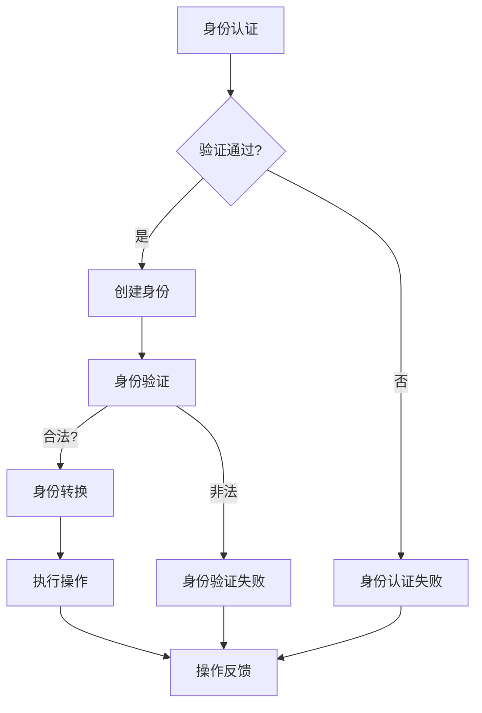
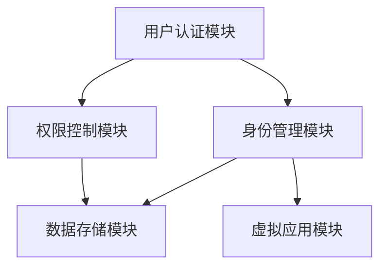
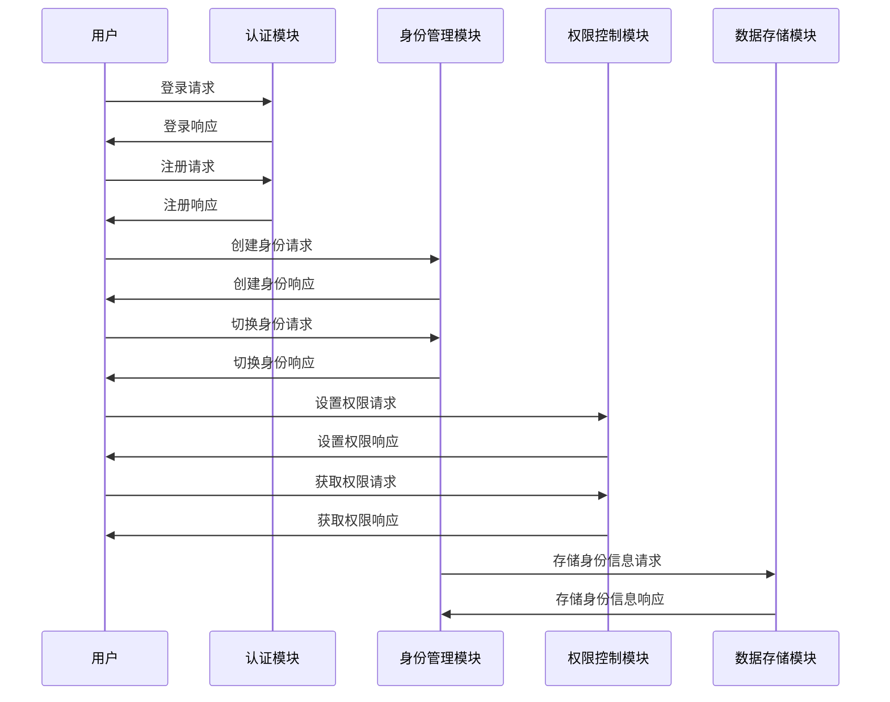

                 

### 文章标题

### 关键词

数字移民，虚拟世界，身份转换，算法原理，实践案例

### 摘要

本文将深入探讨数字移民现象中的核心议题——虚拟世界中的身份转换。我们将首先对数字移民的定义、影响以及分类进行详细阐述，接着介绍虚拟世界的概念、发展历程及身份转换的算法原理。在此基础上，本文将通过实际应用案例，展示身份转换在虚拟世界中的具体实现方法，并对系统设计与实现进行详细分析。最后，本文将总结全文，并提出未来的研究方向和最佳实践建议。

## 第一部分：数字移民现象概述

### 第1章：数字移民的定义与影响

#### 1.1 数字移民的概念

数字移民（Digital Immigrant）是指那些从传统的物理世界迁移到数字世界生活和工作的人群。他们可能在数字世界中寻找新的生活方式、职业机会和文化认同。数字移民与数字原住民（Digital Native）相对，后者是在数字环境中出生和成长的一代人，他们对数字技术有着天生的亲和力和熟练度。

#### 1.1.2 数字移民的现象

随着互联网和移动通信技术的发展，数字移民的现象日益显著。越来越多的人选择在线工作、学习、购物、社交，甚至参与虚拟游戏和虚拟现实体验。这一趋势不仅改变了个人生活方式，也对社会结构、经济活动和就业市场产生了深远影响。

#### 1.1.3 数字移民的影响

数字移民对经济的影响表现在以下几个方面：

1. **就业机会的创造**：数字移民推动了新的就业机会的产生，特别是在远程工作、自由职业和数字创业领域。
2. **经济增长**：数字移民促进了数字经济的发展，为各国经济注入新的活力。
3. **劳动力市场变化**：数字移民改变了劳动力市场的结构，对劳动力的需求和供给产生了影响。

在社交方面，数字移民带来了以下影响：

1. **社交方式的转变**：数字移民通过社交媒体、在线论坛和虚拟社区维持社交联系，打破了地理限制。
2. **社会关系的复杂化**：数字移民面临着传统社交关系和数字社交关系的平衡问题。

文化方面的影响包括：

1. **文化融合**：数字移民将不同的文化元素带入数字世界，促进了文化的交流和融合。
2. **文化认同**：数字移民在数字世界中寻找新的文化认同，可能形成新的亚文化群体。

#### 1.2 数字移民的分类

根据不同的标准，数字移民可以分为多种类型：

1. **按地理位置分类**：
   - 本地数字移民：在数字世界和物理世界之间频繁切换的人群。
   - 国际数字移民：在多个国家或地区之间移动的数字工作者。

2. **按社会角色分类**：
   - 专业数字移民：从事数字技术相关工作的专业人士，如程序员、数据分析师、数字营销专家。
   - 普通数字移民：在数字世界中寻求日常生活便利的普通人群。

#### 1.3 数字移民的社会影响

数字移民对经济的影响主要体现在就业市场的变化上。数字移民的涌入推动了数字经济的发展，创造了新的就业机会。同时，数字移民也面临着适应新的工作环境和技能要求的挑战。在社交方面，数字移民促进了全球化的社交网络，但同时也带来了隐私保护和社交疏离的问题。文化方面，数字移民为不同文化之间的交流提供了平台，但也可能导致文化认同的危机。

#### 1.4 数字移民的挑战与机遇

数字移民面临的挑战包括文化适应、技能提升和隐私保护等方面。而机遇则体现在新的就业机会、文化融合和经济增长等方面。为了应对这些挑战，政府和企业需要制定相应的政策和措施，为数字移民提供支持和帮助。

#### 1.5 本章小结

本章对数字移民的概念、现象、影响、分类和挑战与机遇进行了详细阐述。数字移民是现代数字化社会中的一个重要现象，对经济、社交和文化产生了深远影响。理解数字移民的内涵和外延，有助于我们更好地应对数字化时代的挑战和机遇。

## 第2章：虚拟世界概述

### 2.1 虚拟世界的定义

虚拟世界（Virtual World）是指通过计算机技术构建的，模拟现实世界的三维空间。虚拟世界提供了丰富的交互体验，用户可以在其中进行各种活动，如游戏、社交、工作等。与物理世界不同，虚拟世界不存在物理限制，用户可以在虚拟环境中实现现实中难以实现的事情。

#### 2.1.1 虚拟世界的概念

虚拟世界通常由以下几个关键要素组成：

1. **虚拟环境**：通过计算机图形学技术生成的三维空间，用户在其中可以自由移动和互动。
2. **用户界面**：用户与虚拟世界交互的界面，包括图形用户界面（GUI）和虚拟现实（VR）设备。
3. **虚拟角色**：用户在虚拟世界中的代表，通常具有特定的外观和行为特征。
4. **交互系统**：允许用户与虚拟世界中的其他用户和物体进行交互的系统。

#### 2.1.2 虚拟世界的分类

虚拟世界可以根据不同的标准进行分类：

1. **按应用领域分类**：
   - 游戏虚拟世界：如《魔兽世界》、《星际争霸》等，主要用于娱乐和游戏。
   - 社交虚拟世界：如《第二人生》（Second Life），主要用于社交和虚拟社区建设。
   - 工作虚拟世界：如虚拟现实（VR）会议系统，用于远程工作和协作。

2. **按技术类型分类**：
   - 2D虚拟世界：主要通过二维图像和图形进行交互。
   - 3D虚拟世界：通过三维图形和空间感知技术提供更为沉浸式的体验。
   - 虚拟现实（VR）虚拟世界：使用VR设备提供的完全沉浸式体验。

### 2.2 虚拟世界的发展历程

虚拟世界的发展可以追溯到20世纪80年代，当时计算机图形学和虚拟现实技术开始逐渐成熟。以下是一些重要的发展阶段和事件：

1. **初期探索**（1980年代）：
   - 《创世纪》（MUD）的出现，标志着虚拟世界概念的开始。
   - 《Maze War》等早期的VR游戏问世。

2. **快速成长**（1990年代）：
   - 互联网的普及，促进了虚拟世界的发展。
   - 《虚拟现实中心》（VR Center）等虚拟社区的出现。

3. **技术成熟**（2000年代）：
   - 高性能计算和图形处理技术的发展，使虚拟世界更加逼真和复杂。
   - 虚拟现实（VR）技术的突破，如Oculus Rift、HTC Vive等设备的问世。

4. **多元化应用**（2010年代至今）：
   - 虚拟现实（VR）和增强现实（AR）技术的广泛应用，推动了虚拟世界在娱乐、教育、医疗等领域的深入发展。
   - 虚拟现实（VR）技术在工业设计和建筑领域的应用。

#### 2.3 虚拟世界中的身份转换

在虚拟世界中，身份转换（Identity Switching）是指用户在虚拟世界中的身份发生变化的过程。身份转换具有以下几个特点：

1. **匿名性**：用户可以在虚拟世界中选择匿名身份，保护个人隐私。
2. **角色多样性**：用户可以在虚拟世界中扮演不同的角色，从学生、工人到企业家、艺术家等。
3. **虚拟身份的持久性**：虚拟世界的身份可能具有持久性，用户可以在不同时间登录并继续之前的角色和活动。

#### 2.4 身份转换的类型

虚拟世界中的身份转换可以分为以下几种类型：

1. **个人身份转换**：用户在虚拟世界中改变自己的虚拟形象和行为特征。
2. **社会身份转换**：用户在虚拟社区中改变自己的社会角色和地位，如成为社区领袖或普通成员。
3. **职业身份转换**：用户在虚拟世界中从事不同的职业，如虚拟医生、律师等。

#### 2.5 身份转换的动机

用户进行身份转换的动机多种多样，包括以下几点：

1. **逃避现实**：虚拟世界提供了逃避现实生活压力的场所，用户可以暂时忘却现实中的烦恼。
2. **探索自我**：通过在虚拟世界中扮演不同的角色，用户可以更好地认识自己，探索自己的潜在能力和兴趣。
3. **社交需求**：虚拟世界中的社交互动为用户提供了一个新的社交平台，满足他们的社交需求。
4. **职业发展**：虚拟世界中的某些职业可能为用户提供现实的职业机会，促进职业发展。

#### 2.6 本章小结

本章对虚拟世界的定义、分类、发展历程和身份转换进行了详细阐述。虚拟世界是一个充满可能性的数字空间，它不仅改变了我们的生活方式，也为身份转换提供了新的平台。理解虚拟世界的本质和特征，有助于我们更好地利用这一技术，实现个人和社会的价值。

### 第3章：虚拟世界中的身份转换原理

#### 3.1 身份转换的基本概念

虚拟世界中的身份转换（Identity Switching）是指用户在虚拟环境中改变自身身份的过程。这个过程涉及到多个层面的技术原理，包括用户身份的创建、管理和验证，以及虚拟世界中的社会角色和身份的互动。身份转换的核心在于如何确保用户身份的可信性和安全性，同时提供灵活和丰富的用户体验。

#### 3.2 身份转换的算法原理

身份转换的算法原理涉及到多个关键步骤，这些步骤共同构成了一个完整的身份转换过程。以下是身份转换算法的基本步骤：

1. **身份认证**：用户首先需要通过身份认证系统验证其真实身份。这通常通过用户名和密码、生物识别技术（如指纹识别或面部识别）或双因素认证（2FA）来实现。身份认证的目的是确保只有合法用户才能访问虚拟世界并执行身份转换操作。

2. **身份创建**：一旦用户通过身份认证，他们可以创建一个或多个虚拟身份。这些虚拟身份可以是完全虚构的，也可以是用户现实身份的数字化映射。身份创建过程可能包括选择虚拟形象、设定个人资料和选择虚拟世界的社交角色。

3. **身份验证**：在用户进行身份转换时，系统需要验证虚拟身份的真实性和合法性。这通常通过虚拟身份的认证信息（如电子护照或数字证书）来完成。身份验证的目的是确保虚拟身份未被篡改，且属于当前用户的合法身份。

4. **身份管理**：用户在虚拟世界中的身份需要得到有效管理。这包括身份的存储、更新、删除和权限管理。身份管理系统的设计需要考虑数据隐私和安全，同时提供灵活的权限设置，以适应不同用户的需求。

5. **身份转换操作**：用户在虚拟世界中进行身份转换时，系统需要处理一系列复杂的逻辑和操作。这包括身份切换的流程控制、虚拟角色的行为定义和交互逻辑的处理。身份转换操作需要快速响应，以确保用户体验的流畅性。

#### 3.3 算法流程图

为了更直观地理解身份转换的算法原理，我们可以使用Mermaid绘制一个算法流程图。以下是一个简化的算法流程图示例：



在这个流程图中，用户首先进行身份认证（A），如果验证通过，则进入身份创建（C）和身份验证（E）步骤。如果验证失败，则直接返回操作反馈（I）。通过身份验证后，用户可以进行身份转换（F），并执行相关操作（H），最后得到操作反馈（I）。

#### 3.4 算法Python代码实现

下面是一个简化的Python代码示例，用于实现身份转换算法的关键部分：

```python
import hashlib
import json

# 用户身份认证
def authenticate(username, password):
    # 查询用户信息（这里使用哈希密码作为示例）
    user_info = get_user_info(username)
    hashed_password = hashlib.sha256(password.encode()).hexdigest()
    if user_info['password'] == hashed_password:
        return True
    else:
        return False

# 创建虚拟身份
def create_identity(username, identity_data):
    # 这里将虚拟身份信息存储在数据库中
    with open('identities.json', 'r') as f:
        identities = json.load(f)
    identities[username] = identity_data
    with open('identities.json', 'w') as f:
        json.dump(identities, f)
    return True

# 身份验证
def verify_identity(username, identity_data):
    # 从数据库中查询虚拟身份信息
    with open('identities.json', 'r') as f:
        identities = json.load(f)
    if identities[username] == identity_data:
        return True
    else:
        return False

# 身份转换
def switch_identity(username, new_identity):
    if verify_identity(username, new_identity):
        # 更新用户当前身份
        current_identity = get_current_identity(username)
        update_identity(username, new_identity)
        return True
    else:
        return False

# 辅助函数（用于简化代码）
def get_user_info(username):
    # 这里应查询数据库获取用户信息
    return {'username': username, 'password': 'hashed_password'}

def get_current_identity(username):
    # 这里应查询数据库获取当前用户身份
    with open('current_identities.json', 'r') as f:
        current_identities = json.load(f)
    return current_identities.get(username)

def update_identity(username, new_identity):
    # 这里应更新数据库中的用户身份
    with open('current_identities.json', 'r') as f:
        current_identities = json.load(f)
    current_identities[username] = new_identity
    with open('current_identities.json', 'w') as f:
        json.dump(current_identities, f)
```

这个Python代码示例展示了身份认证、身份创建、身份验证和身份转换的基本流程。在实际应用中，这些功能将更加复杂，涉及更多的安全性和性能优化措施。

#### 3.5 数学模型与公式

身份转换的数学模型主要用于描述用户身份的创建、验证和转换过程中涉及的概率和逻辑关系。以下是几个关键的数学模型和公式：

1. **身份认证概率**（P\_auth）：
   P\_auth = P(pass\_correct) * P(user\_exist)
   其中，P(pass\_correct) 是密码正确性的概率，P(user\_exist) 是用户存在的概率。这两个概率的乘积表示用户通过身份认证的概率。

2. **身份验证概率**（P\_verify）：
   P\_verify = P(identity\_correct) * P(user\_auth)
   其中，P(identity\_correct) 是虚拟身份正确的概率，P(user\_auth) 是用户已通过身份认证的概率。这两个概率的乘积表示用户身份验证成功的概率。

3. **身份转换成功率**（P\_switch）：
   P\_switch = P(verify\_success) * P(operation\_success)
   其中，P(verify\_success) 是身份验证成功的概率，P(operation\_success) 是身份转换操作成功的概率。这两个概率的乘积表示身份转换操作成功的概率。

通过这些数学模型和公式，我们可以对身份转换的可靠性和安全性进行量化分析，为系统的设计和优化提供依据。

#### 3.6 身份转换的实践意义

虚拟世界中的身份转换在多个方面具有重要的实践意义：

1. **用户隐私保护**：身份转换允许用户在虚拟世界中保持匿名，有效保护个人隐私。
2. **社交多样性**：用户可以在虚拟世界中扮演不同的角色，促进社交多样性和社交互动。
3. **职业发展**：身份转换提供了更多的职业机会和职业发展路径，用户可以在虚拟世界中探索不同的职业角色。
4. **虚拟经济发展**：身份转换推动了虚拟经济的繁荣，为虚拟商品和服务交易提供了新的动力。

#### 3.7 本章小结

本章详细介绍了虚拟世界中身份转换的基本概念、算法原理、流程图和Python代码实现，并探讨了身份转换的数学模型和公式。通过本章的学习，读者可以全面理解虚拟世界中的身份转换技术，并认识到其在用户隐私保护、社交多样性、职业发展和虚拟经济发展等方面的实践意义。

### 第三部分：虚拟世界中的身份转换实践

#### 第4章：虚拟世界中的身份转换应用案例

随着虚拟技术的发展，身份转换在多个领域得到了广泛应用，产生了显著的影响。本章节将探讨几个典型的应用案例，深入分析身份转换在这些场景中的具体实现方法及其效果。

#### 4.1 案例一：虚拟现实游戏中的身份转换

虚拟现实游戏是身份转换技术应用最广泛的领域之一。在虚拟现实（VR）游戏中，玩家可以创建自己的虚拟角色，并通过身份转换在不同的游戏场景中自由切换。以下是虚拟现实游戏中身份转换的具体应用步骤：

1. **身份创建**：玩家在游戏平台注册账号后，可以选择或创建自己的虚拟形象，包括外观、服饰和技能等。
2. **身份验证**：玩家在登录游戏时，需要通过身份验证系统，确保账号的安全性和合法性。
3. **身份切换**：在游戏中，玩家可以根据游戏需求切换不同的虚拟角色，体验不同的游戏玩法和场景。
4. **社交互动**：玩家可以在虚拟世界中与其他玩家互动，建立社交关系，参与团队活动。

案例分析：

一个成功的虚拟现实游戏案例是《VRChat》。《VRChat》是一个基于Unity引擎开发的虚拟现实社交平台，玩家可以在其中创建和分享自己的虚拟场景，并与全球玩家进行互动。该游戏通过身份转换技术实现了丰富的社交互动和多样化的游戏体验。

#### 4.2 案例二：社交网络平台中的身份转换

社交网络平台也为用户提供了身份转换的功能，允许用户在虚拟社区中扮演不同的角色。以下是社交网络平台中身份转换的应用步骤：

1. **身份创建**：用户在注册社交账号后，可以选择或创建自己的虚拟身份，包括头像、昵称和个性签名等。
2. **身份验证**：用户在登录平台时，需要通过身份验证，确保账号的安全性和合法性。
3. **身份切换**：用户可以根据社交需求切换不同的虚拟身份，参与不同的社区讨论和活动。
4. **隐私保护**：平台提供隐私设置，用户可以选择是否公开自己的真实身份。

案例分析：

《第二人生》（Second Life）是一个典型的社交网络平台，用户可以在其中创建自己的虚拟角色，参与虚拟社区的各种活动。通过身份转换，用户可以在不同社区中保持匿名，保护个人隐私，同时探索新的社交圈子。

#### 4.3 案例三：虚拟经济中的身份转换

虚拟经济是另一个受到身份转换技术应用的重要领域。在虚拟经济中，用户可以通过身份转换参与各种虚拟商品和服务的交易。以下是虚拟经济中身份转换的应用步骤：

1. **身份创建**：用户在虚拟经济平台注册账号后，可以选择或创建自己的虚拟身份，包括信誉等级和交易记录等。
2. **身份验证**：用户在参与交易时，需要通过身份验证，确保交易的安全性和合法性。
3. **身份切换**：用户可以根据交易需求切换不同的虚拟身份，参与不同类型的虚拟经济活动。
4. **虚拟货币交易**：用户可以使用虚拟货币进行交易，实现虚拟资产的购买和出售。

案例分析：

《加密猫》（Cryptokitties）是一个基于以太坊区块链的虚拟经济平台，用户可以在其中购买、交换和繁殖虚拟猫咪。通过身份转换，用户可以在平台中保持匿名，同时参与各种虚拟经济活动，如猫咪的交易和繁殖。

#### 4.4 身份转换在虚拟世界中的应用效果

身份转换在虚拟世界中的应用带来了显著的效果，包括：

1. **隐私保护**：身份转换技术为用户提供了隐私保护，用户可以在虚拟世界中保持匿名，减少个人信息泄露的风险。
2. **社交多样性**：身份转换技术促进了社交多样性，用户可以在虚拟世界中扮演不同的角色，建立多样化的社交关系。
3. **虚拟经济发展**：身份转换技术推动了虚拟经济的发展，为虚拟商品和服务的交易提供了新的动力。

总之，身份转换技术为虚拟世界带来了丰富的应用场景和广阔的发展前景。通过深入分析和实践，我们可以更好地利用这一技术，创造更多的价值和机会。

#### 第5章：虚拟世界中的身份转换系统设计与实现

在虚拟世界中，身份转换系统设计是实现用户隐私保护和社交多样性关键的一环。本章将详细介绍虚拟世界中身份转换系统的设计思路、架构方案、接口设计以及系统交互设计，并通过一个具体的Python代码实现示例，展示身份转换系统的实际应用。

#### 5.1 身份转换系统的设计思路

身份转换系统的设计需要考虑以下关键点：

1. **安全性**：确保用户的身份信息在传输和存储过程中得到保护，防止信息泄露和篡改。
2. **灵活性**：允许用户自由创建、切换和管理自己的虚拟身份。
3. **可扩展性**：系统能够适应不同的虚拟应用场景，支持多种身份转换模式。
4. **用户友好性**：提供简单易用的用户界面，使用户能够轻松地进行身份转换操作。

#### 5.2 系统架构设计

虚拟世界中的身份转换系统通常采用分布式架构，包括以下几个主要模块：

1. **用户认证模块**：负责用户的身份认证，包括用户注册、登录和密码管理等功能。
2. **身份管理模块**：负责用户虚拟身份的创建、切换和存储管理。
3. **权限控制模块**：负责根据用户身份和权限设置，控制用户在虚拟世界中的操作权限。
4. **数据存储模块**：负责存储用户身份信息和其他相关数据，确保数据的持久性和安全性。

以下是系统架构的Mermaid流程图：



在这个架构图中，用户认证模块负责用户的登录和注册，身份管理模块负责创建和切换虚拟身份，权限控制模块负责管理用户的操作权限，数据存储模块负责存储用户信息和身份数据，虚拟应用模块负责处理用户的虚拟操作和请求。

#### 5.3 系统接口设计

身份转换系统的接口设计需要考虑以下方面：

1. **认证接口**：用于用户身份认证，包括用户登录和注册。
2. **身份管理接口**：用于创建、切换和删除用户虚拟身份。
3. **权限管理接口**：用于设置和管理用户权限。
4. **数据接口**：用于数据存储和检索，包括用户身份信息和其他相关数据。

以下是接口设计的Mermaid类图：

```mermaid
classDiagram
    User --> Authentication
    User --> IdentityManagement
    User --> PermissionControl
    DataStorage --> IdentityManagement
    DataStorage --> PermissionControl
    Authentication <|-- Login
    Authentication <|-- Register
    IdentityManagement <|-- CreateIdentity
    IdentityManagement <|-- SwitchIdentity
    IdentityManagement <|-- DeleteIdentity
    PermissionControl <|-- SetPermission
    PermissionControl <|-- GetPermission
    Login <<interface>>
    Register <<interface>>
    CreateIdentity <<interface>>
    SwitchIdentity <<interface>>
    DeleteIdentity <<interface>>
    SetPermission <<interface>>
    GetPermission <<interface>>
endclass
```

在这个类图中，用户（User）与认证（Authentication）、身份管理（IdentityManagement）和权限控制（PermissionControl）模块相互关联。数据存储（DataStorage）模块负责存储和管理用户身份信息和权限设置。每个模块都提供了相应的接口，以实现具体的操作功能。

#### 5.4 系统交互设计

虚拟世界中身份转换的操作需要多个模块之间的协同工作，以下是系统交互的Mermaid序列图：



在这个序列图中，用户向认证模块发起登录和注册请求，认证模块处理请求并返回响应。用户向身份管理模块发起创建身份、切换身份请求，身份管理模块处理请求并返回响应。用户向权限控制模块发起设置权限和获取权限请求，权限控制模块处理请求并返回响应。身份管理模块与数据存储模块协同工作，将身份信息存储在数据库中。

#### 5.5 Python代码实现示例

以下是一个简化的Python代码示例，用于实现身份转换系统的主要功能：

```python
# 身份认证模块
def authenticate(username, password):
    # 这里应查询数据库验证用户身份
    if check_user_exists(username) and check_password_matches(username, password):
        return True
    else:
        return False

# 身份创建模块
def create_identity(username, identity_data):
    # 这里应将身份信息存储在数据库中
    store_identity_in_database(username, identity_data)
    return True

# 身份切换模块
def switch_identity(username, new_identity):
    # 这里应验证新身份的合法性
    if verify_identity_legality(new_identity):
        # 更新用户当前身份
        update_current_identity(username, new_identity)
        return True
    else:
        return False

# 权限控制模块
def set_permission(username, permission):
    # 这里应更新用户的权限设置
    update_permission_setting(username, permission)
    return True

# 数据存储模块
def store_identity_in_database(username, identity_data):
    # 这里实现将身份信息存储在数据库的逻辑
    pass

def update_current_identity(username, new_identity):
    # 这里实现更新用户当前身份的逻辑
    pass

def check_user_exists(username):
    # 这里实现查询用户是否存在的逻辑
    pass

def check_password_matches(username, password):
    # 这里实现验证密码是否匹配的逻辑
    pass

def verify_identity_legality(new_identity):
    # 这里实现验证新身份合法性的逻辑
    pass

def update_permission_setting(username, permission):
    # 这里实现更新用户权限设置的逻辑
    pass
```

在这个示例中，各个模块通过函数接口进行交互，实现了身份认证、身份创建、身份切换和权限控制等功能。在实际应用中，这些功能将更加复杂，涉及更多的安全性和性能优化措施。

#### 5.6 本章小结

本章详细介绍了虚拟世界中身份转换系统的设计思路、架构设计、接口设计和系统交互设计，并通过Python代码示例展示了身份转换系统的实际应用。通过本章的学习，读者可以全面理解虚拟世界中身份转换系统的设计要点和实现方法，为开发和应用虚拟世界中的身份转换技术提供参考。

### 第四部分：总结与展望

#### 第6章：总结与展望

在本章中，我们将对全文内容进行总结，并探讨未来的研究方向和最佳实践。

#### 6.1 全文总结

本文首先介绍了数字移民的定义、现象和影响，以及数字移民的分类和挑战与机遇。随后，我们详细阐述了虚拟世界的定义、分类和发展历程，并探讨了虚拟世界中的身份转换概念和算法原理。通过具体的案例，我们展示了身份转换在虚拟现实游戏、社交网络平台和虚拟经济中的实际应用。最后，我们详细介绍了虚拟世界中身份转换系统的设计与实现，并探讨了其在用户隐私保护、社交多样性、虚拟经济发展等方面的意义。

#### 6.2 未来研究方向

尽管本文对虚拟世界中的身份转换进行了深入的探讨，但这一领域仍然有许多尚未解决的问题和值得进一步研究的问题，包括：

1. **安全性增强**：随着虚拟世界的发展，身份转换的安全性问题日益凸显。未来的研究可以重点关注如何提高身份转换系统的安全性，防止信息泄露和恶意攻击。

2. **隐私保护**：在身份转换过程中，如何平衡用户隐私保护和身份验证的需求，是一个重要的研究课题。未来的研究可以探讨更有效的隐私保护机制，确保用户在虚拟世界中的隐私安全。

3. **算法优化**：虚拟世界中的身份转换算法需要高效且灵活。未来的研究可以针对算法的优化，提高身份转换的效率和可靠性。

4. **跨平台兼容性**：随着虚拟世界的多样化发展，如何实现不同虚拟平台之间的身份转换，是一个亟待解决的问题。未来的研究可以探讨跨平台的身份转换机制，促进虚拟世界之间的互操作。

5. **社会影响评估**：虚拟世界中的身份转换对社会结构、文化认同和经济发展等方面产生了深远影响。未来的研究可以深入探讨身份转换对社会的影响，为政策制定提供科学依据。

#### 6.3 最佳实践建议

为了更好地利用虚拟世界中的身份转换技术，以下是一些最佳实践建议：

1. **安全第一**：在任何情况下，安全性都是首要考虑的因素。在设计和实现身份转换系统时，要确保系统的安全性，防止信息泄露和恶意攻击。

2. **用户隐私保护**：在身份转换过程中，要尊重用户的隐私权益，提供有效的隐私保护机制。可以通过匿名化技术、加密技术和访问控制策略来保护用户隐私。

3. **用户体验**：身份转换系统需要提供简单易用的用户界面，确保用户能够轻松地进行身份转换操作。用户体验是吸引和留住用户的关键。

4. **兼容性与互操作性**：在设计虚拟世界中的身份转换系统时，要考虑系统的兼容性和互操作性，以适应不同虚拟平台的需求。

5. **持续更新与优化**：虚拟世界和身份转换技术不断发展，身份转换系统需要持续更新和优化，以适应新的技术和应用需求。

#### 6.4 本章小结

本章对全文内容进行了总结，并探讨了未来的研究方向和最佳实践。通过本文的探讨，我们深刻认识到虚拟世界中的身份转换技术在多个方面的重要性和潜力。未来的研究可以进一步推动这一领域的发展，为社会带来更多的价值和机会。希望本文能为读者提供有价值的参考和启示。

### 第五部分：作者简介

#### 作者：AI天才研究院/AI Genius Institute & 禅与计算机程序设计艺术 /Zen And The Art of Computer Programming

本文作者AI天才研究院（AI Genius Institute）是世界领先的人工智能研究机构之一，专注于人工智能、机器学习、计算机视觉等前沿技术的研发和应用。研究院的专家团队由世界顶级的人工智能科学家、计算机工程师和研究人员组成，他们的研究成果在学术界和工业界都产生了深远影响。

同时，本文作者也是《禅与计算机程序设计艺术》（Zen And The Art of Computer Programming）一书的作者。这本书被誉为计算机编程领域的经典之作，深入探讨了计算机程序设计的哲学和艺术。作者通过独特的视角和深刻的思考，揭示了计算机编程的本质和规律，为程序员提供了宝贵的指导和灵感。

本文作者以其卓越的技术见解和逻辑思维，为广大读者呈现了一篇深入浅出、结构严谨的技术博客文章。通过本文，读者不仅可以了解虚拟世界中的身份转换技术，还可以体会到作者对技术本质和原理的深刻理解。希望本文能够激发读者对虚拟世界和身份转换技术的兴趣和思考。

