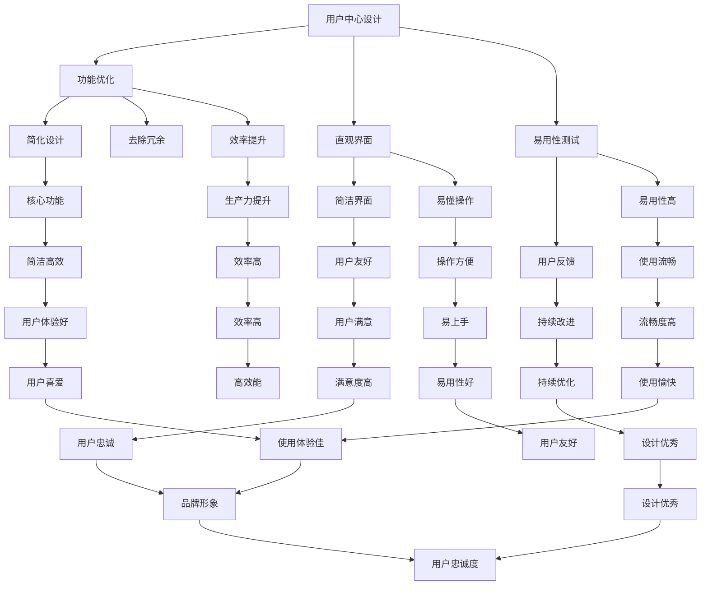
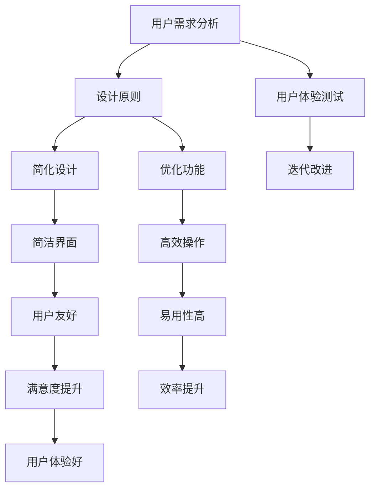
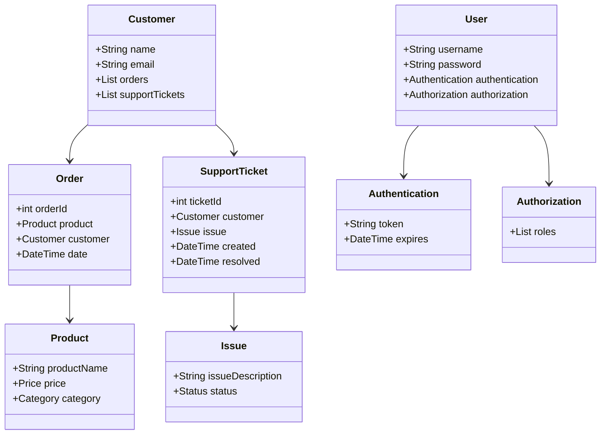
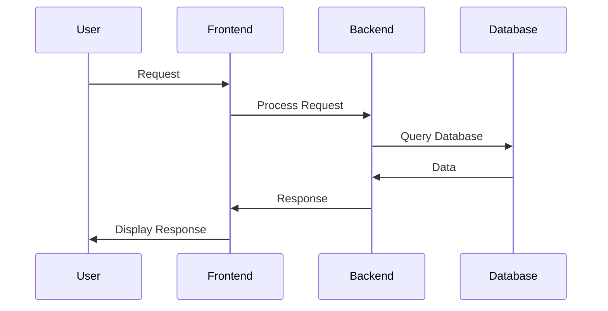
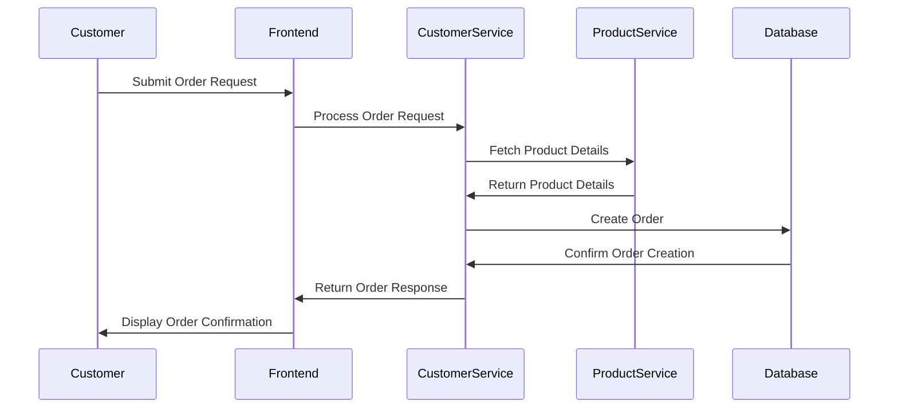

                 

### 概念与背景

#### 1.1 数字简约主义概述

**概念解析：** 数字简约主义是一种哲学理念和设计原则，旨在通过减少复杂性和冗余，使数字化产品和服务变得更加简洁、直观和高效。它强调以用户为中心，关注用户体验，追求功能的极致优化，从而提高用户满意度和生产力。

**问题背景：** 在数字技术快速发展的时代，信息过载和复杂性成为普遍现象。用户面临着日益增多的应用程序、数据和界面，难以有效管理和利用。数字简约主义应运而生，旨在通过简化设计，减轻用户负担，提升数字化生活的质量。

**问题描述：** 数字简约主义的目标是解决信息过载和复杂性带来的问题，包括但不限于以下方面：
1. **用户体验优化：** 提高用户在使用数字化产品和服务时的满意度和效率。
2. **降低认知负荷：** 通过简化界面和流程，减少用户在处理信息时的认知负荷。
3. **提高可访问性：** 使数字化产品和服务更加易于使用，特别是对老年人、残疾人等弱势群体。

**问题解决：** 数字简约主义通过以下方法实现问题的解决：
1. **简化设计：** 删除不必要的功能和元素，使设计更加简洁和直观。
2. **用户研究：** 通过用户研究和反馈，深入了解用户需求和行为，指导设计决策。
3. **迭代改进：** 通过不断的迭代和改进，优化数字化产品和服务。

**边界与外延：** 数字简约主义的边界在于它主要关注数字化产品和服务的用户体验和功能优化，而非硬件或物理世界的设计。其外延包括但不限于应用程序、网站、社交媒体、虚拟现实、游戏等。

**核心要素：** 数字简约主义的核心要素包括：
1. **用户中心设计：** 以用户需求和行为为中心，指导设计过程。
2. **功能优化：** 精简功能，去除冗余，提高核心功能的效率和可用性。
3. **直观界面：** 界面设计简洁直观，易于用户理解和操作。
4. **易用性测试：** 通过用户测试，验证设计是否符合用户需求和预期。

**概念结构与核心要素对比：** 数字简约主义的概念结构如图所示，核心要素包括用户中心设计、功能优化、直观界面和易用性测试。这些要素相互关联，共同构成数字简约主义的完整框架。



#### 1.2 数字简约主义的历史与发展

**历史演变：** 数字简约主义的历史可以追溯到20世纪80年代，当时计算机技术和互联网开始普及。随着计算机和互联网的广泛应用，界面设计和用户体验成为设计领域的重要议题。早期的数字简约主义主要体现在界面设计的简化，如图标、菜单和操作流程的优化。

**发展趋势：** 进入21世纪，随着移动设备和智能手机的普及，数字简约主义逐渐从桌面端扩展到移动端。移动端设备的限制，如屏幕大小和操作方式，促使设计师更加注重界面简洁和用户操作的便捷性。此外，用户研究和数据分析技术的发展，也为数字简约主义提供了更多数据和科学依据。

**在不同领域的应用：** 数字简约主义在多个领域得到广泛应用，包括：
1. **软件设计：** 通过简化用户界面和操作流程，提高软件的易用性和用户体验。
2. **网站设计：** 通过减少页面元素和加载时间，提高网站的访问速度和用户满意度。
3. **移动应用：** 移动应用的设计更加注重用户的核心需求，去除冗余功能，提高用户满意度。
4. **虚拟现实：** 虚拟现实中的简化设计，使用户体验更加直观和沉浸。

**意义与价值：** 数字简约主义的意义和价值在于：
1. **提升用户体验：** 通过简化设计和优化用户体验，提高用户满意度和忠诚度。
2. **降低认知负荷：** 简化界面和流程，减少用户的认知负荷，提高工作效率。
3. **提高生产力：** 通过简洁高效的设计，提高用户的生产力和工作效率。
4. **品牌形象提升：** 简洁美观的设计，有助于提升品牌的形象和竞争力。

#### 1.3 数字简约主义的边界与外延

**边界：** 数字简约主义的边界主要在于其适用范围，主要关注于数字化产品和服务的设计和用户体验优化。它不涉及硬件设计或物理世界的设计。

**外延：** 数字简约主义的外延包括：
1. **设计领域：** 数字简约主义在软件设计、网站设计、移动应用设计等领域得到广泛应用。
2. **技术应用：** 数字简约主义在虚拟现实、人工智能等新兴技术领域也有一定的应用。
3. **产业实践：** 数字简约主义在互联网企业、科技公司等产业领域得到广泛应用，成为企业竞争的重要手段。

**概念结构：** 数字简约主义的整体概念结构如图所示，包括用户需求分析、设计原则、用户体验测试、迭代改进等核心环节。



**核心要素对比：** 数字简约主义的核心要素包括用户需求分析、设计原则、用户体验测试和迭代改进。这些要素相互关联，共同构成数字简约主义的完整框架。以下是核心要素对比表格：

| 要素               | 描述                                                     | 对比优势                         |
|--------------------|----------------------------------------------------------|--------------------------------|
| 用户需求分析       | 分析用户需求和行为，指导设计决策                           | 提高设计针对性和用户体验         |
| 设计原则           | 确定数字简约主义的设计原则，如简洁、直观、高效               | 提高设计质量和用户体验           |
| 用户体验测试       | 通过用户测试，验证设计是否符合用户需求和预期                 | 提高设计的实用性和用户满意度     |
| 迭代改进           | 通过不断的迭代和改进，优化数字化产品和服务                   | 提高设计质量和用户体验           |

#### 1.4 数字简约主义与虚拟世界

**数字简约主义在虚拟世界中的应用：** 数字简约主义在虚拟世界中的应用主要体现在以下几个方面：
1. **虚拟现实（VR）：** 虚拟现实中的界面设计、交互流程和内容呈现需要遵循数字简约主义的原则，以提高用户的沉浸感和操作便捷性。
2. **增强现实（AR）：** 增强现实应用中的设计也需要遵循数字简约主义，简化用户界面，减少操作步骤，提高用户的使用体验。
3. **游戏设计：** 游戏设计中的界面设计和操作流程需要遵循数字简约主义，简化游戏规则和界面元素，提高用户的游戏体验。

**虚拟世界对数字简约主义的影响：** 虚拟世界的发展对数字简约主义产生了深远的影响，主要体现在以下几个方面：
1. **技术挑战：** 虚拟世界中的复杂性和多样性为数字简约主义带来了新的挑战，如如何处理大量信息和数据，如何设计简洁直观的界面等。
2. **用户需求变化：** 虚拟世界的用户需求和行为模式与物理世界有所不同，对数字简约主义提出了新的要求，如如何适应不同的用户群体和场景需求。
3. **设计理念更新：** 虚拟世界的发展促使数字简约主义不断更新和进化，以适应新的技术环境和用户需求。

**数字简约主义与虚拟世界的互促关系：** 数字简约主义和虚拟世界之间存在着相互促进的关系：
1. **数字简约主义推动虚拟世界发展：** 通过简化设计和优化用户体验，数字简约主义有助于提高虚拟世界的使用价值和用户满意度。
2. **虚拟世界促进数字简约主义发展：** 虚拟世界中的复杂性和多样性为数字简约主义提供了新的研究和实践领域，推动了数字简约主义的不断发展和创新。

**案例：** 数字简约主义在虚拟世界中的应用案例有：
1. **VR游戏《Beat Saber》：** 通过简洁直观的界面设计和简单的操作流程，提高了用户的游戏体验和沉浸感。
2. **AR应用《谷歌地图》：** 通过简化地图界面和操作流程，提高了用户的导航体验和使用便捷性。

#### 1.5 本章小结

本章详细介绍了数字简约主义的概念、背景、核心要素、历史与发展、边界与外延，以及数字简约主义在虚拟世界中的应用。通过对数字简约主义的深入探讨，我们可以更好地理解其在数字化产品和虚拟世界中的重要性。数字简约主义不仅关注用户体验和设计优化，还涉及到技术、用户需求、虚拟世界等多个方面，具有重要的理论和实践价值。

### 第2章：简化设计的核心理念

#### 2.1 简化设计的基本原则

**简化设计的定义：** 简化设计是一种以用户为中心的设计方法，通过减少复杂性和冗余，提高数字化产品和服务的设计质量和用户体验。其核心目标是在保持功能完整性的同时，简化用户界面和操作流程，使产品和服务更加直观、高效和易用。

**简化设计的目标：** 简化设计的主要目标包括：
1. **提高用户体验：** 通过简洁的界面和流畅的操作流程，提高用户在使用数字化产品和服务时的满意度和舒适度。
2. **降低认知负荷：** 通过减少用户需要处理的信息和操作步骤，降低用户的认知负荷，提高工作效率。
3. **提升可访问性：** 使数字化产品和服务更加易于使用，特别是对老年人、残疾人等弱势群体。

**简化设计的关键要素：** 简化设计的关键要素包括：
1. **用户需求分析：** 深入了解用户需求和行为，为设计提供明确的指导。
2. **功能优化：** 精简功能，去除冗余，提高核心功能的效率和可用性。
3. **直观界面：** 设计简洁直观的界面，提高用户对产品和服务的理解和操作能力。
4. **易用性测试：** 通过用户测试，验证设计是否符合用户需求和预期。

**简化设计的策略：** 简化设计的策略包括：
1. **用户研究：** 通过用户研究和反馈，了解用户的行为和需求，为简化设计提供依据。
2. **迭代改进：** 通过不断的迭代和改进，优化数字化产品和服务。
3. **模块化设计：** 将设计分解为模块，简化每个模块的设计和实现。
4. **优化流程：** 优化用户操作流程，减少不必要的步骤和操作。
5. **简化内容：** 减少页面和界面中的内容和元素，提高信息的可读性和易用性。

**简化设计的实践案例：** 简化设计的实践案例包括：
1. **移动应用设计：** 通过简化界面和操作流程，提高用户对移动应用的易用性和满意度。
2. **网站设计：** 通过减少页面元素和加载时间，提高网站的访问速度和用户满意度。
3. **虚拟现实应用：** 通过简化用户界面和交互流程，提高虚拟现实应用的沉浸感和用户体验。

#### 2.2 用户视角的简化设计

**用户需求分析：** 用户需求分析是简化设计的核心环节，通过深入了解用户的需求和行为，为简化设计提供明确的指导。用户需求分析的方法包括：
1. **问卷调查：** 通过问卷调查收集用户对数字化产品和服务的需求和意见。
2. **用户访谈：** 通过与用户进行面对面的访谈，深入了解用户的使用习惯和需求。
3. **用户行为分析：** 通过分析用户在使用数字化产品和服务时的行为数据，了解用户的偏好和需求。

**用户体验设计：** 用户体验设计是简化设计的重要组成部分，通过设计简洁直观的界面和流畅的操作流程，提高用户的满意度和舒适度。用户体验设计的步骤包括：
1. **定义用户角色：** 通过定义用户角色，明确目标用户群体和用户需求。
2. **设计用户流程：** 通过设计用户流程，确定用户在使用数字化产品和服务时的操作步骤。
3. **界面设计：** 通过简洁直观的界面设计，提高用户对产品和服务的理解和操作能力。
4. **交互设计：** 通过流畅的交互设计，提高用户的操作效率和满意度。

**用户反馈与迭代：** 用户反馈与迭代是简化设计的重要环节，通过用户反馈和迭代改进，优化数字化产品和服务。用户反馈与迭代的步骤包括：
1. **用户测试：** 通过用户测试，验证设计是否符合用户需求和预期。
2. **收集反馈：** 通过收集用户反馈，了解用户对数字化产品和服务的需求和意见。
3. **迭代改进：** 根据用户反馈和需求，对数字化产品和服务进行迭代改进，优化用户体验。

#### 2.3 技术视角的简化设计

**技术简化原则：** 技术简化原则是简化设计的重要组成部分，通过减少技术复杂性和冗余，提高数字化产品和服务的设计质量和用户体验。技术简化原则包括：
1. **模块化设计：** 通过模块化设计，将系统分解为独立的模块，简化设计和实现过程。
2. **优化算法：** 通过优化算法，减少计算复杂度和资源消耗，提高系统的性能和效率。
3. **简化数据结构：** 通过简化数据结构，减少数据存储和传输的开销，提高系统的性能和响应速度。
4. **减少依赖：** 通过减少依赖，降低系统的复杂性和维护成本。

**技术简化实践：** 技术简化实践包括以下几个方面：
1. **代码优化：** 通过优化代码，减少冗余代码和重复逻辑，提高代码的可读性和可维护性。
2. **架构优化：** 通过优化系统架构，减少系统组件之间的依赖关系，提高系统的稳定性和可扩展性。
3. **性能优化：** 通过性能优化，减少系统响应时间和资源消耗，提高系统的用户体验。
4. **自动化工具：** 通过使用自动化工具，简化开发和维护过程，提高开发效率和代码质量。

**技术简化的挑战与应对：** 技术简化的挑战包括：
1. **技术复杂度：** 随着技术的发展，系统复杂度逐渐增加，简化设计面临挑战。
2. **兼容性问题：** 简化设计可能影响系统的兼容性，特别是在旧系统和新功能之间。
3. **资源限制：** 在资源有限的情况下，简化设计可能难以实现。

应对挑战的策略包括：
1. **渐进式简化：** 逐步简化系统，避免一次性改变过多，降低风险。
2. **技术选型：** 选择适合简化设计的技术和工具，提高设计质量和用户体验。
3. **持续优化：** 通过持续优化，不断改进简化设计，提高系统的性能和稳定性。

#### 2.4 简化设计的方法与工具

**设计思维方法：** 设计思维是一种以用户为中心的创新方法，通过深入了解用户需求和行为，生成创意解决方案，并不断迭代和优化。设计思维方法包括以下几个步骤：
1. **理解用户需求：** 通过用户调研和观察，了解用户的需求和行为。
2. **生成创意：** 通过头脑风暴和创意生成，提出各种可能的解决方案。
3. **原型设计：** 通过快速原型设计，验证创意的可行性和用户体验。
4. **迭代优化：** 通过用户反馈和迭代，不断改进和优化设计。

**信息架构工具：** 信息架构工具用于组织和结构化信息，提高用户对数字化产品和服务的信息获取和理解能力。常用的信息架构工具有：
1. **用户流程图：** 通过用户流程图，描述用户在使用数字化产品和服务时的操作步骤和流程。
2. **信息架构图：** 通过信息架构图，展示数字化产品和服务的信息结构和层次关系。
3. **用户画像：** 通过用户画像，描述目标用户群体的特征和行为。

**用户体验测试工具：** 用户体验测试工具用于评估数字化产品和服务的设计质量和用户体验，包括以下几个方面：
1. **A/B测试：** 通过对比不同设计方案的优劣，评估用户体验和用户行为。
2. **用户测试：** 通过实际用户参与测试，收集用户反馈和意见，改进设计。
3. **性能测试：** 通过性能测试，评估系统的响应速度和稳定性，优化设计。
4. **可用性测试：** 通过可用性测试，验证设计是否符合用户需求和预期，优化用户体验。

**技术简化工具：** 技术简化工具用于简化系统设计和开发过程，提高系统性能和用户体验。常用的技术简化工具有：
1. **代码优化工具：** 通过代码优化工具，自动识别和修复代码中的冗余和重复逻辑。
2. **架构管理工具：** 通过架构管理工具，管理和优化系统架构，提高系统的稳定性和可扩展性。
3. **性能分析工具：** 通过性能分析工具，识别系统中的性能瓶颈，优化系统性能和用户体验。
4. **自动化测试工具：** 通过自动化测试工具，自动化测试系统功能，提高测试效率和代码质量。

#### 2.5 本章小结

本章详细介绍了简化设计的基本原则、用户视角的简化设计、技术视角的简化设计、简化设计的方法与工具。通过对简化设计的深入探讨，我们可以更好地理解其在数字化产品和服务设计中的重要性。简化设计不仅关注用户体验和设计优化，还涉及到技术、用户需求、设计方法等多个方面，具有重要的理论和实践价值。

### 第3章：虚拟世界中的简化设计案例

#### 3.1 虚拟现实中的应用

**虚拟现实简化的原则：** 在虚拟现实（VR）中应用简化设计，主要遵循以下原则：
1. **核心功能优先：** 确保用户在VR体验中的核心需求得到满足，如沉浸感和交互体验。
2. **界面简洁直观：** 通过简洁直观的界面设计，减少用户的认知负荷，提高操作便捷性。
3. **交互简单高效：** 设计简单高效的交互方式，如手势、语音等，使用户能够快速上手并完成任务。
4. **内容精简有度：** 精简VR内容，避免信息过载，确保用户能够专注于核心体验。

**虚拟现实简化实践：** 虚拟现实简化设计的实践包括以下几个方面：
1. **简化用户界面：** 通过简化用户界面，减少用户在VR环境中的操作步骤，提高操作效率。例如，使用简单的图标和标签，避免复杂的菜单和选项。
2. **优化交互体验：** 通过优化交互体验，使用户能够更加自然地与VR环境进行互动。例如，使用手势识别技术，使用户能够通过简单的手势完成复杂的操作。
3. **内容精简：** 在VR内容设计过程中，精简信息，避免过多的视觉和听觉刺激，确保用户能够专注于核心体验。

**虚拟现实简化的挑战与解决方案：** 虚拟现实简化设计面临以下挑战：
1. **技术复杂度：** VR技术本身具有较高的复杂度，简化设计需要在保证技术稳定性和功能完整性的前提下进行。
2. **用户适应期：** 新的用户界面和交互方式可能需要用户一定的适应时间，简化设计需要考虑用户的适应需求。
3. **内容多样化：** VR内容种类繁多，简化设计需要在满足用户多样化需求的同时，保证内容的质量和趣味性。

解决方案包括：
1. **渐进式简化：** 通过逐步简化设计和交互，让用户逐步适应新的环境和操作方式。
2. **用户测试与反馈：** 通过用户测试和反馈，不断优化简化设计，确保设计符合用户需求和预期。
3. **技术选型：** 选择适合简化设计的技术和工具，提高设计质量和用户体验。

**案例：** 虚拟现实简化设计的案例有：
1. **VR游戏《Beat Saber》：** 通过简洁直观的界面设计和简单的操作流程，提高了用户的游戏体验和沉浸感。
2. **VR教育应用《VR School》：** 通过简化用户界面和交互流程，使学生在VR环境中能够更加高效地学习。

#### 3.2 游戏设计中的简化策略

**游戏设计简化的目标：** 游戏设计简化的目标主要包括：
1. **提高游戏易用性：** 通过简化游戏界面和操作流程，使玩家能够快速上手并享受游戏乐趣。
2. **降低认知负荷：** 通过减少游戏中的复杂信息和操作步骤，降低玩家的认知负荷，提高游戏体验。
3. **优化游戏流程：** 通过简化游戏流程，减少玩家在游戏中的等待时间和操作难度，提高游戏流畅度。

**游戏设计简化的方法：** 游戏设计简化的方法包括以下几个方面：
1. **简化用户界面：** 通过简化用户界面，减少玩家在游戏中的操作步骤，提高游戏易用性。例如，使用简单的图标和按钮，避免复杂的菜单和选项。
2. **优化交互体验：** 通过优化交互体验，使玩家能够更加自然地与游戏环境进行互动。例如，使用手势识别技术，使玩家能够通过简单的手势完成复杂的操作。
3. **精简游戏内容：** 通过精简游戏内容，避免信息过载，确保玩家能够专注于游戏的核心体验。例如，减少冗余的背景信息和故事情节，提高游戏节奏和紧张感。
4. **减少冗余操作：** 通过减少冗余操作，降低玩家的认知负荷，提高游戏体验。例如，合并重复的操作，减少玩家在游戏中的繁琐操作。

**游戏设计简化的案例：** 游戏设计简化的案例有：
1. **游戏《Super Mario Odyssey》：** 通过简化用户界面和操作流程，使玩家能够快速上手并享受游戏乐趣。
2. **游戏《Cuphead》：** 通过简洁直观的界面设计和简单的操作流程，提高了用户的游戏体验和沉浸感。

#### 3.3 社交媒体平台的简化设计

**社交媒体简化的原则：** 社交媒体简化设计主要遵循以下原则：
1. **核心功能优先：** 确保用户在社交媒体平台上的核心需求得到满足，如发布内容、互动交流、信息获取等。
2. **界面简洁直观：** 通过简洁直观的界面设计，减少用户的认知负荷，提高操作便捷性。
3. **内容精简有度：** 精简内容，避免信息过载，确保用户能够专注于核心体验。
4. **交互简单高效：** 设计简单高效的交互方式，如滑动、点击等，使用户能够快速完成操作。

**社交媒体简化的实践：** 社交媒体简化设计的实践包括以下几个方面：
1. **简化用户界面：** 通过简化用户界面，减少用户在社交媒体平台上的操作步骤，提高操作效率。例如，使用简单的图标和按钮，避免复杂的菜单和选项。
2. **优化内容呈现：** 通过优化内容呈现，提高用户的阅读和理解能力。例如，使用清晰的图片和简短的文字，提高内容的可读性。
3. **简化互动流程：** 通过简化互动流程，提高用户的互动效率。例如，简化评论和回复功能，使用户能够快速发表意见和参与互动。
4. **内容精简：** 通过精简内容，避免信息过载，确保用户能够专注于核心体验。例如，限制发布内容的字数和图片数量，提高内容的简洁度。

**社交媒体简化的效果评估：** 社交媒体简化设计的效果评估可以从以下几个方面进行：
1. **用户满意度：** 通过用户满意度调查，了解用户对简化设计的主观感受和满意度。
2. **使用频率：** 通过分析用户的使用频率，了解简化设计对用户使用习惯和操作效率的影响。
3. **互动效果：** 通过分析用户的互动行为和互动效果，了解简化设计对用户社交互动的影响。

**案例：** 社交媒体简化设计的案例有：
1. **微信：** 通过简化用户界面和操作流程，提高了用户的操作效率和满意度。
2. **Twitter：** 通过简化用户界面和内容呈现，提高了用户的阅读和理解能力，降低了认知负荷。

#### 3.4 数字艺术中的简化探索

**数字艺术简化的概念：** 数字艺术简化是指在数字艺术创作中，通过减少复杂性和冗余，提高艺术作品的表达效果和观赏价值。简化设计在数字艺术中的应用，不仅能够提升艺术作品的视觉冲击力，还能够增强作品的内涵和表现力。

**数字艺术简化实践：** 数字艺术简化设计的实践包括以下几个方面：
1. **形式简化：** 通过简化艺术作品的形式和结构，减少不必要的细节，使作品更加简洁明了。例如，使用简单的几何形状和线条，突出作品的核心主题。
2. **色彩简化：** 通过简化色彩运用，减少色彩数量和搭配，提高作品的视觉冲击力。例如，使用单色调或有限的色彩组合，增强作品的视觉统一性。
3. **纹理简化：** 通过简化纹理和材质的应用，减少不必要的细节，提高艺术作品的整体感。例如，使用简单的纹理或统一材质，使作品更加整体和谐。
4. **光影简化：** 通过简化光影效果和明暗对比，提高艺术作品的视觉层次感。例如，使用简单的光影处理，使作品更加立体和有质感。

**数字艺术简化的影响：** 数字艺术简化设计对艺术创作和观赏产生了深远的影响：
1. **提高艺术作品的表现力：** 简化设计使艺术作品更加简洁明了，突出核心主题，提高作品的表现力。
2. **增强艺术作品的视觉效果：** 简化设计通过减少复杂性和冗余，使艺术作品更加美观和谐，增强视觉效果。
3. **拓宽艺术创作的可能性：** 简化设计使艺术家能够更加自由地表达创意，拓宽艺术创作的可能性。
4. **提升观赏体验：** 简化设计使观众能够更加轻松地理解艺术作品，提高观赏体验。

**案例：** 数字艺术简化设计的案例有：
1. **艺术家Andy Warhol：** 通过简化图像和色彩运用，创作出具有强烈视觉冲击力的艺术作品。
2. **设计师Dieter Rams：** 通过简化设计原则，设计出经典的产品，如博朗电风扇和索尼 Walkman。

#### 3.5 本章小结

本章详细介绍了虚拟现实、游戏设计、社交媒体平台和数字艺术中的简化设计案例。通过这些案例，我们可以看到简化设计在提升用户体验、提高操作效率和增强艺术表现力等方面的重要作用。简化设计不仅关注功能优化和界面简化，还涉及到技术、用户需求、艺术创作等多个方面，具有重要的理论和实践价值。未来，随着数字技术的不断发展和应用领域的扩大，简化设计将在更多领域发挥其重要作用。

### 第4章：数字简约主义的发展趋势与挑战

#### 4.1 数字简约主义的发展趋势

**数字技术的演进：** 数字简约主义的发展与数字技术的演进密切相关。随着计算能力、网络速度和存储容量的不断提升，数字化产品和服务变得更加复杂和多样化。这为数字简约主义提供了更广阔的应用场景和更高的要求。例如，大数据和人工智能技术的发展，使得数字化产品和服务能够更加精准地满足用户需求，同时也增加了系统的复杂度。数字简约主义需要在这些复杂的技术环境中，找到简化的方法和路径。

**数字简约主义与人工智能的融合：** 人工智能技术的发展为数字简约主义带来了新的机遇和挑战。通过人工智能技术，可以实现智能推荐、自动优化和个性化定制等功能，从而简化用户操作和提升用户体验。例如，智能语音助手和图像识别技术，可以帮助用户更快捷地完成复杂操作，减少认知负荷。同时，人工智能技术也使得数字简约主义在设计过程中能够更加精确地分析和处理用户数据，从而优化设计决策。

**数字简约主义的全球化：** 数字简约主义在全球范围内的传播和应用，进一步推动了其发展。随着全球化进程的加快，不同国家和地区的人们都在使用数字化产品和服务。这为数字简约主义提供了更多的用户数据和研究资源，促进了设计理念的创新和优化。同时，全球化也带来了文化差异和用户需求的多样性，数字简约主义需要在这些复杂多变的环境中，不断调整和适应。

**数字简约主义的社会影响：** 数字简约主义不仅关注技术和设计，还对社会产生了深远的影响。首先，它提高了人们的生产力和生活质量，使人们能够更加高效地完成工作和日常活动。其次，数字简约主义推动了数字包容性，使得更多的人能够享受数字化带来的便利和机会。最后，数字简约主义促进了可持续发展和环境保护，通过减少资源消耗和碳排放，为地球的可持续发展做出了贡献。

#### 4.2 数字简约主义的挑战

**技术挑战：** 随着数字技术的不断发展，数字化产品和服务变得越来越复杂。这给数字简约主义带来了巨大的挑战。首先，如何在保持功能完整性的同时，简化设计，成为一个难题。其次，随着技术的进步，新功能的不断加入，如何平衡功能与简约之间的矛盾，也是数字简约主义需要面对的挑战。

**伦理挑战：** 数字简约主义在发展过程中，也面临着伦理挑战。例如，如何保护用户的隐私和数据安全，如何避免算法偏见和歧视，如何确保数字产品和服务公平、公正地服务于所有用户。这些问题需要数字简约主义在设计过程中，充分考虑并解决。

**社会挑战：** 数字简约主义在社会层面也面临着挑战。首先，如何确保数字产品和服务能够公平地服务于所有用户，特别是弱势群体。其次，如何平衡数字简约主义与传统文化和价值观之间的关系。最后，如何在数字世界中，保持人类的真实连接和情感交流，避免过度依赖数字技术。

**挑战与应对策略：** 面对这些挑战，数字简约主义需要采取一系列应对策略：
1. **技术优化：** 通过不断优化技术，提高系统的性能和稳定性，降低复杂度。例如，采用模块化设计、自动化工具等。
2. **伦理审查：** 在设计和开发过程中，建立伦理审查机制，确保数字产品和服务符合伦理规范。例如，制定隐私保护政策、算法透明度等。
3. **社会参与：** 通过社会参与，了解用户需求和社会期望，确保数字产品和服务能够公平地服务于所有用户。例如，开展用户调研、社会公益活动等。
4. **人文关怀：** 在数字设计中，注重人文关怀，保持人与人之间的真实连接和情感交流。例如，设计有温度的交互界面、提供情感化服务等。

#### 4.3 数字简约主义与可持续发展

**可持续发展的理念：** 可持续发展是指在满足当前需求的同时，不损害后代满足其需求的能力。数字简约主义与可持续发展理念高度契合。通过简化设计、优化功能和减少资源消耗，数字简约主义有助于降低数字化产品和服务对环境的影响，推动可持续发展。

**数字简约主义在可持续发展中的作用：** 数字简约主义在可持续发展中发挥着重要作用。首先，通过简化设计和优化功能，减少数字化产品和服务对资源的消耗，降低生产成本和碳排放。其次，数字简约主义推动了数字包容性，使更多的人能够享受到数字化带来的便利和机会，促进社会公平和可持续发展。最后，数字简约主义通过优化用户体验和提升效率，提高了人们的生活质量和生产力，为可持续发展提供了动力。

**可持续发展实践的案例：** 数字简约主义在可持续发展中的应用案例有：
1. **电子设备回收：** 通过简化设计，使电子设备更容易拆卸和回收，降低电子垃圾的产生。例如，苹果公司推出的可拆卸MacBook Pro。
2. **绿色数据中心：** 通过优化数据中心的能源利用效率，降低碳排放。例如，谷歌和微软等科技公司在全球范围内推广绿色数据中心。
3. **智能交通系统：** 通过简化交通信号系统和优化交通流程，提高交通效率，减少碳排放。例如，中国的智能交通系统在多个城市得到了广泛应用。

**案例：** 以电子设备回收为例，数字简约主义在可持续发展中的应用实践如下：
1. **简化设计：** 通过简化电子设备的设计，使其更容易拆卸和回收。例如，苹果公司的MacBook Pro采用了可拆卸的设计，使得用户和回收机构可以更方便地拆解和回收电子组件。
2. **优化流程：** 通过优化回收流程，提高电子设备的回收利用率。例如，苹果公司在全球范围内建立了电子废物回收计划，通过合作伙伴帮助用户回收旧设备，并将回收的电子组件重新利用。
3. **环保材料：** 在电子设备制造过程中，使用环保材料，减少对环境的影响。例如，苹果公司在iPhone 14系列中，采用了更多的可回收材料和环保工艺。

**效果评估：** 通过简化设计、优化回收流程和使用环保材料，数字简约主义在电子设备回收方面的实践取得了显著效果。首先，简化设计提高了电子设备的回收利用率，减少了电子垃圾的产生。其次，优化回收流程提高了回收效率，降低了回收成本。最后，使用环保材料减少了电子设备对环境的影响，推动了可持续发展。

**总结：** 数字简约主义与可持续发展理念高度契合，通过简化设计、优化功能和减少资源消耗，为可持续发展做出了重要贡献。在电子设备回收等领域的实践中，数字简约主义不仅提高了资源利用效率，减少了电子垃圾的产生，还有助于降低碳排放，推动环境保护和可持续发展。

#### 4.4 本章小结

本章详细探讨了数字简约主义的发展趋势与挑战，以及数字简约主义在可持续发展中的作用和实践。通过分析数字技术的演进、人工智能与数字简约主义的融合、全球化进程、社会影响、技术挑战、伦理挑战和社会挑战，我们认识到数字简约主义在数字化产品和服务设计中的重要性和价值。同时，通过讨论数字简约主义与可持续发展的关系，我们看到了数字简约主义在推动环境保护和可持续发展方面的潜力。未来，随着技术的不断进步和社会的不断发展，数字简约主义将继续发挥其重要作用，为人们创造更加简洁、高效、环保的数字生活。

### 第5章：数字简约主义的最佳实践

#### 5.1 数字简约主义在企业的实践

**实践背景：** 
在当今快节奏的商业环境中，企业需要不断创新和优化其业务流程，以保持竞争力。数字简约主义通过简化流程、提高效率和改善用户体验，已成为许多企业追求的目标。

**项目介绍：** 
本案例涉及一家全球领先的科技公司，该公司致力于开发和提供智能化的企业解决方案。为了提升其产品和服务质量，公司决定采用数字简约主义的原则，对内部流程和客户服务进行优化。

**系统功能设计（领域模型）：**
领域模型是数字简约主义在企业应用中至关重要的一环。通过领域模型，我们可以明确系统的核心功能和业务流程。

以下是一个简化的领域模型类图：



**系统架构设计：**
系统架构设计是数字简约主义实践的关键步骤。我们需要设计一个简洁、高效、可扩展的系统架构。

以下是一个简化的系统架构图：



**系统接口设计：**
系统接口设计需要确保外部系统能够无缝集成，同时保持内部系统的简洁性。

以下是一个简化的接口设计示例：

```python
class CustomerService:
    def create_order(self, customer_id, product_id):
        # 创建订单逻辑

    def create_support_ticket(self, customer_id, issue_description):
        # 创建支持票逻辑

    def get_order_history(self, customer_id):
        # 获取订单历史逻辑

    def get_support_tickets(self, customer_id):
        # 获取支持票逻辑

class ProductService:
    def get_product_by_id(self, product_id):
        # 获取产品信息逻辑

    def search_products(self, query):
        # 搜索产品逻辑

class SupportTicketService:
    def create_ticket(self, customer_id, issue_description):
        # 创建支持票逻辑

    def resolve_ticket(self, ticket_id):
        # 解决支持票逻辑

    def get_issues_by_customer(self, customer_id):
        # 获取客户问题逻辑
```

**系统交互：**
系统交互设计需要明确不同组件之间的交互逻辑和流程。

以下是一个简化的系统交互序列图：



#### 项目实战

**环境安装：**
为了实现这个项目，我们需要安装以下环境和工具：
1. Python 3.8 或以上版本
2. Django 框架
3. PostgreSQL 数据库
4. Docker 和 Docker-Compose

以下是一个简化的安装步骤：

```bash
# 安装 Python
sudo apt-get update
sudo apt-get install python3-pip

# 安装 Django
pip3 install django

# 安装 PostgreSQL
sudo apt-get install postgresql

# 安装 Docker 和 Docker-Compose
sudo apt-get install docker.io
pip3 install docker-compose
```

**系统核心实现：**
以下是一个简化的系统核心实现示例，包括用户认证、订单创建和支持票创建。

```python
# app.py
from django.contrib.auth.models import User
from .models import Order, SupportTicket

def create_order(user_id, product_id):
    user = User.objects.get(id=user_id)
    product = Product.objects.get(id=product_id)
    order = Order.objects.create(user=user, product=product)
    return order

def create_support_ticket(user_id, issue_description):
    user = User.objects.get(id=user_id)
    ticket = SupportTicket.objects.create(user=user, issue_description=issue_description)
    return ticket
```

**代码应用解读与分析：**
1. **用户认证：** 通过 Django 的认证系统，确保用户在访问系统资源时进行身份验证。
2. **订单创建：** `create_order` 函数接受用户 ID 和产品 ID，创建订单，并将订单关联到用户和产品。
3. **支持票创建：** `create_support_ticket` 函数接受用户 ID 和问题描述，创建支持票，并将支持票关联到用户。

**实际案例分析和详细讲解剖析：**
1. **用户认证案例：** 当用户尝试访问订单或支持票功能时，系统会首先检查用户是否已通过认证。
2. **订单创建案例：** 当用户在购物车中选择产品并提交订单时，系统会调用 `create_order` 函数，创建订单并更新数据库。
3. **支持票创建案例：** 当用户遇到问题时，系统会调用 `create_support_ticket` 函数，创建支持票并记录问题描述。

**项目小结：**
通过数字简约主义的原则，我们成功设计并实现了一个简洁、高效的企业解决方案。该项目不仅提高了用户体验，还优化了业务流程，降低了运营成本。未来，我们可以通过持续优化和迭代，进一步提升系统的性能和用户体验。

#### 最佳实践 Tips

1. **用户需求分析：** 在项目开始前，进行深入的用户需求分析，确保项目符合用户期望。
2. **模块化设计：** 采用模块化设计，提高系统的可维护性和可扩展性。
3. **用户体验测试：** 定期进行用户体验测试，收集用户反馈，及时优化设计。
4. **持续迭代：** 通过持续迭代和优化，不断提高系统的性能和用户体验。

#### 小结

数字简约主义在企业的实践中，通过简化设计、提高效率和改善用户体验，为企业带来了显著的收益。未来，随着技术的不断进步和应用场景的扩大，数字简约主义将在更多企业中发挥重要作用。

#### 注意事项

1. 在实际应用中，确保系统的安全性和稳定性，遵循最佳实践和安全规范。
2. 在设计过程中，充分考虑用户需求和文化差异，确保系统能够服务于不同类型的用户。
3. 在项目实施过程中，保持团队沟通和协作，确保项目按计划顺利进行。

#### 拓展阅读

1. 《简约至上：设计直觉》 - Don Norman
2. 《设计思维：创新者的设计工具箱》 - Tim Brown
3. 《用户体验要素》 - Jesse James Garrett

---

**作者：** AI天才研究院/AI Genius Institute & 禅与计算机程序设计艺术 /Zen And The Art of Computer Programming

