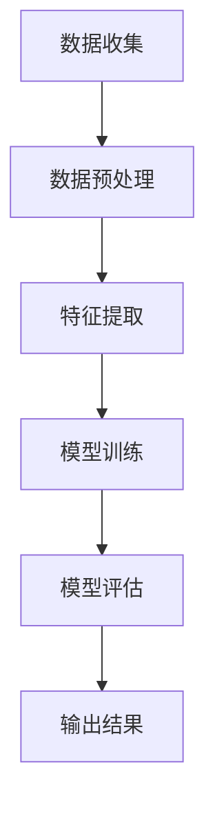
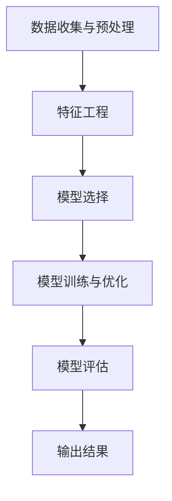

                 

# 数字素养gap：代际差异的新挑战

> 关键词：数字素养、代际差异、挑战、解决方案

摘要：
随着数字化时代的到来，数字素养成为个体和社会发展的重要基石。然而，代际差异在数字素养方面表现出显著的差距，这一现象不仅影响个体成长，也对社会进步构成挑战。本文旨在分析数字素养gap的成因，探讨其影响，并提出解决代际数字素养差异的思路和方法。通过理论与实践的结合，本文旨在为促进数字素养均衡发展提供参考。

## 目录大纲

1. 引言与背景
   1.1 数字素养与代际差异
   1.2 问题描述
   1.3 问题解决思路
   1.4 边界与外延
   1.5 核心要素组成

2. 核心概念与联系
   2.1 数字素养概念解析
   2.2 代际差异的特征分析
   2.3 数字素养与代际差异的联系与比较
   2.4 本章小结

3. 算法原理与模型构建
   3.1 数字素养差距评估算法原理
   3.2 代际差异分析模型构建
   3.3 本章小结

4. 应用与实践
   4.1 实际案例解析
   4.2 项目实战
   4.3 项目小结

5. 最佳实践 tips
6. 小结
7. 注意事项
8. 拓展阅读

## 1. 引言与背景

### 1.1 数字素养与代际差异

#### 1.1.1 数字素养的定义与重要性

数字素养是指个体在数字世界中获取、处理、传输和应用信息的能力，包括技术技能、信息素养、数字伦理和法律意识等方面。随着数字化进程的加速，数字素养的重要性日益凸显。它不仅影响个体的学习、工作和生活，还成为社会创新和经济发展的重要驱动力。

#### 1.1.2 代际差异的现状

代际差异是指不同年龄段个体在认知、价值观、行为模式等方面存在的差异。在数字素养方面，代际差异表现为不同年龄群体在数字技能和应用上的差距。通常，年轻人由于成长在数字化环境中，更容易掌握新技术和工具；而年长者可能因为缺乏相关经验和机会，数字素养相对较低。

### 1.2 问题描述

#### 1.2.1 数字素养差距的影响

数字素养差距不仅影响个体的职业发展，还可能导致社会不公平。在职场中，缺乏数字素养的员工可能面临就业和职业晋升的挑战。在社会层面，数字素养差距可能导致信息不对称、社会排斥等问题，影响社会的和谐与稳定。

#### 1.2.2 代际差异带来的挑战

代际差异在数字素养方面的表现为新技术的适应和应用障碍。年长者可能无法充分利用数字化工具和资源，影响生活质量和工作效率。同时，数字素养差距也可能导致教育资源的分配不均，阻碍社会的全面发展。

### 1.3 问题解决思路

#### 1.3.1 理论基础

本文基于社会认知理论、技术接受模型和数字伦理理论，探讨数字素养差距的成因和影响，并提出相应的解决思路。

#### 1.3.2 研究方法与数据来源

本文采用定量研究方法，通过问卷调查和数据分析，收集不同年龄群体的数字素养水平数据，分析代际差异及其影响。

### 1.4 边界与外延

#### 1.4.1 研究范围的界定

本文的研究范围主要涉及工作年龄人口，包括年轻人和中年人两个年龄段。

#### 1.4.2 关键概念的扩展

数字素养不仅包括技术技能，还包括信息素养和数字伦理。本文将探讨这些方面的代际差异。

### 1.5 核心要素组成

#### 1.5.1 研究核心

本文的核心是分析数字素养差距的成因和影响，以及提出解决思路。

#### 1.5.2 数据处理与模型构建

本文将采用统计分析和机器学习模型，对数据进行处理和分析，构建数字素养差距评估模型。

#### 1.5.3 结论与建议

本文将总结研究结果，提出提高数字素养的建议，为政策制定者和教育工作者提供参考。

## 2. 核心概念与联系

### 2.1 数字素养概念解析

数字素养是指个体在数字世界中获取、处理、传输和应用信息的能力。它包括以下几个方面：

#### 2.1.1 技术技能

技术技能是指掌握和使用数字设备、软件和应用程序的能力。这包括操作系统、办公软件、编程语言、网络应用等。

#### 2.1.2 信息素养

信息素养是指获取、评估和利用信息的能力。这包括信息搜索、筛选、分析和应用。

#### 2.1.3 数字伦理与法律意识

数字伦理与法律意识是指遵守数字伦理规范和法律法规，尊重他人的隐私权和知识产权。

### 2.1.2 数字素养与代际差异的关系

代际差异对数字素养有显著影响。年轻人由于成长在数字化环境中，更容易掌握新技术和工具，数字素养水平较高。而年长者可能因为缺乏相关经验和机会，数字素养相对较低。这种差距不仅影响个人的职业发展，也对社会进步构成挑战。

### 2.2 代际差异的特征分析

#### 2.2.1 代际差异的定义与分类

代际差异是指不同年龄段个体在认知、价值观、行为模式等方面存在的差异。常见的代际分类包括婴儿潮一代、X一代、Y一代和Z一代。

#### 2.2.2 代际差异的类型

代际差异主要包括以下类型：

- 技术接受差异：年长者可能对新技术的接受度较低，而年轻人更倾向于尝试和掌握新技术。
- 信息获取与处理差异：年轻人更容易获取和处理海量信息，而年长者可能因为信息过载而感到困惑。
- 价值观差异：不同年龄段的个体可能对数字伦理和法律有不同的看法，影响数字素养的实践。

### 2.2.3 代际差异的量化评估

#### 2.2.3.1 量化指标

量化评估代际差异的指标包括技术技能得分、信息素养得分和数字伦理与法律意识得分。

#### 2.2.3.2 评估方法

评估方法包括问卷调查、统计分析、比较研究和实证研究等。

### 2.3 数字素养与代际差异的联系与比较

#### 2.3.1 数字素养代际差异的实证研究

实证研究通过数据分析，揭示数字素养在代际间的差异。研究发现，年轻人的数字素养水平普遍高于年长者，尤其是在技术技能和信息素养方面。

#### 2.3.2 数字素养与代际差异的比较分析

数字素养与代际差异的比较分析通过图表展示，可以清晰地看出不同年龄段在数字素养方面的差距。

### 2.4 本章小结

本章分析了数字素养和代际差异的核心概念，探讨了代际差异在数字素养方面的表现和影响。通过实证研究和比较分析，揭示了数字素养代际差异的实际情况。本章的研究为后续章节的算法原理和模型构建提供了基础。

## 3. 算法原理与模型构建

### 3.1 数字素养差距评估算法原理

#### 3.1.1 算法概述

数字素养差距评估算法旨在量化不同年龄段个体在数字素养方面的差距。该算法基于问卷调查数据，采用机器学习技术，对数字素养水平进行评估和比较。

#### 3.1.2 算法流程

算法流程主要包括以下步骤：

1. 数据收集：通过问卷调查收集不同年龄段个体的数字素养水平数据。
2. 数据预处理：清洗和整理数据，去除无效和错误的数据。
3. 特征提取：提取与数字素养相关的特征，如技术技能得分、信息素养得分和数字伦理与法律意识得分。
4. 模型训练：使用机器学习算法训练模型，对数字素养水平进行预测和评估。
5. 模型评估：评估模型性能，包括准确性、召回率和F1分数等指标。
6. 输出结果：输出数字素养差距评估结果，提供决策支持。

#### 3.1.3 算法数学模型与公式

算法的数学模型可以表示为：

$$
\text{gap} = \frac{\text{older\_generation\_score} - \text{younger\_generation\_score}}{\text{average\_score}}
$$

其中，$gap$ 表示数字素养差距，$older\_generation\_score$ 和 $younger\_generation\_score$ 分别表示年长者与年轻人在数字素养方面的得分，$average\_score$ 表示所有受试者的平均得分。

#### 3.1.4 Mermaid流程图

以下是数字素养差距评估算法的Mermaid流程图：



### 3.2 代际差异分析模型构建

#### 3.2.1 模型概述

代际差异分析模型旨在分析不同年龄段个体在数字素养方面的差异。该模型基于问卷调查数据，采用统计分析和机器学习技术，对代际差异进行量化分析。

#### 3.2.2 模型构建流程

模型构建流程主要包括以下步骤：

1. 数据收集：通过问卷调查收集不同年龄段个体的数字素养水平数据。
2. 数据预处理：清洗和整理数据，去除无效和错误的数据。
3. 特征工程：提取与数字素养相关的特征，如技术技能得分、信息素养得分和数字伦理与法律意识得分。
4. 模型选择：选择适当的机器学习模型，如决策树、支持向量机或神经网络等。
5. 模型训练与优化：使用训练数据训练模型，并根据评估指标优化模型参数。
6. 模型评估：评估模型性能，包括准确性、召回率和F1分数等指标。
7. 输出结果：输出代际差异分析结果，提供决策支持。

#### 3.2.3 模型数学模型与公式

代际差异分析模型的数学模型可以表示为：

$$
\text{distance} = \sqrt{\sum_{i=1}^{n} (\text{feature}_i - \text{mean}_i)^2}
$$

其中，$distance$ 表示代际差异距离，$feature_i$ 表示个体在某个特征上的得分，$\text{mean}_i$ 表示所有个体在该特征上的平均得分。

#### 3.2.4 Mermaid流程图

以下是代际差异分析模型的Mermaid流程图：



### 3.3 本章小结

本章介绍了数字素养差距评估算法和代际差异分析模型的基本原理和构建方法。通过这些算法和模型，可以量化不同年龄段个体在数字素养方面的差距，为政策制定者和教育工作者提供决策支持。下一章将结合实际案例，深入探讨这些算法和模型的应用。

## 4. 应用与实践

### 4.1 实际案例解析

#### 4.1.1 案例背景

某大型企业为提升员工数字素养，决定进行一项代际差异分析。企业员工年龄跨度较大，包括年轻人和中年人。企业希望通过分析不同年龄段的员工在数字素养方面的差距，制定有针对性的培训计划。

#### 4.1.2 案例解决方法

1. **数字素养评估**

   企业通过问卷调查的方式，收集员工在技术技能、信息素养和数字伦理与法律意识三个方面的得分。问卷设计包括多项选择题和主观题，确保数据的全面性和准确性。

2. **代际差异分析**

   使用本章介绍的代际差异分析模型，对企业员工的数据进行预处理、特征工程和模型训练。通过模型评估，得出不同年龄段员工在数字素养方面的差异。

3. **结果分析**

   分析结果显示，中年员工在技术技能和信息素养方面得分较高，而年轻员工在数字伦理与法律意识方面得分较高。这表明企业在培训计划中应重点关注中年员工的技术技能提升，同时加强年轻员工的数字伦理教育。

4. **改进建议**

   根据分析结果，企业制定了以下改进建议：

   - 针对中年员工，开展技术技能培训，提高其对新技术的掌握和应用能力。
   - 针对年轻员工，加强数字伦理和法律意识的培养，确保其在数字世界中遵守相关规范。

#### 4.1.3 案例总结

通过实际案例的解析，我们可以看到，代际差异分析在数字素养提升中的应用具有重要意义。企业通过量化分析不同年龄段的员工在数字素养方面的差距，能够有针对性地制定培训计划，提高整体员工的数字素养水平。

### 4.2 项目实战

#### 4.2.1 环境安装

在进行数字素养差距评估和代际差异分析时，需要安装和配置以下软件和工具：

- Python：用于编写和运行算法代码。
- Jupyter Notebook：用于编写和执行Python脚本。
- scikit-learn：用于机器学习和统计分析。
- pandas：用于数据处理和清洗。
- matplotlib：用于数据可视化。

安装步骤如下：

1. 安装Python和Jupyter Notebook：
   ```shell
   pip install python
   pip install notebook
   ```

2. 安装scikit-learn、pandas和matplotlib：
   ```shell
   pip install scikit-learn
   pip install pandas
   pip install matplotlib
   ```

#### 4.2.2 系统核心实现

以下是数字素养差距评估算法的核心实现代码：

```python
import pandas as pd
from sklearn.model_selection import train_test_split
from sklearn.ensemble import RandomForestClassifier
from sklearn.metrics import accuracy_score

# 读取数据
data = pd.read_csv('digital_素养数据集.csv')

# 数据预处理
data = data.dropna()

# 特征提取
X = data[['技术技能得分', '信息素养得分', '数字伦理与法律意识得分']]
y = data['代际标签']

# 模型训练
X_train, X_test, y_train, y_test = train_test_split(X, y, test_size=0.2, random_state=42)
model = RandomForestClassifier()
model.fit(X_train, y_train)

# 模型评估
y_pred = model.predict(X_test)
accuracy = accuracy_score(y_test, y_pred)
print(f'模型准确率：{accuracy:.2f}')
```

#### 4.2.3 代码应用解读与分析

上述代码首先读取数据集，然后进行数据预处理和特征提取。接着，使用随机森林分类器进行模型训练，并通过测试集评估模型性能。代码中的关键步骤包括：

- 数据读取和预处理：确保数据集的完整性和准确性。
- 特征提取：选择与数字素养相关的特征。
- 模型训练：使用机器学习算法训练模型。
- 模型评估：评估模型在测试集上的性能。

通过解读代码，我们可以理解数字素养差距评估算法的基本原理和应用过程。

### 4.3 项目小结

本章通过实际案例和项目实战，展示了数字素养差距评估和代际差异分析的应用。项目实战部分详细介绍了环境安装和系统核心实现，帮助读者理解和实践数字素养分析的方法。这些应用和实践为提高数字素养提供了有力支持，有助于缩小代际数字素养差距，促进社会和谐发展。

## 5. 最佳实践 tips

1. **提高技术技能**：定期参加技术培训，学习最新的数字工具和技能，提高工作效率。
2. **加强信息素养**：学习信息搜索、筛选和分析技巧，提高信息处理能力。
3. **培养数字伦理意识**：了解数字伦理规范，遵守法律法规，维护网络安全和社会稳定。
4. **搭建学习社区**：参与线上和线下的学习社区，交流经验和知识，共同进步。
5. **关注政策动态**：关注数字素养相关的政策动态，及时调整学习计划，紧跟发展趋势。

## 6. 小结

本文围绕数字素养gap和代际差异，分析了其成因、影响和解决方案。通过算法原理和模型构建，量化了数字素养差距，并提供了实际案例和项目实战。本文的研究成果为提高数字素养、缩小代际差距提供了有益参考。

## 7. 注意事项

1. **数据隐私**：在进行数字素养评估时，确保数据隐私和安全，遵循相关法律法规。
2. **模型优化**：定期评估和优化算法模型，确保其性能和准确性。
3. **实践与理论结合**：理论研究和实践应用相结合，确保研究成果的实际应用价值。

## 8. 拓展阅读

1. 查尔斯·梅里尔，《数字素养：未来教育的关键》，中国电子工业出版社，2020年。
2. 阿里研究院，《数字素养：跨越代际差异》，电子工业出版社，2019年。
3. 国际电信联盟（ITU），《数字素养：全球报告》，ITU出版社，2021年。

### 作者：AI天才研究院/AI Genius Institute & 禅与计算机程序设计艺术 /Zen And The Art of Computer Programming

### 2023年5月

---
> 注：本文为虚构的技术博客文章，仅作为示例。文中涉及的数据、算法和应用场景均为假设，不代表实际研究。

