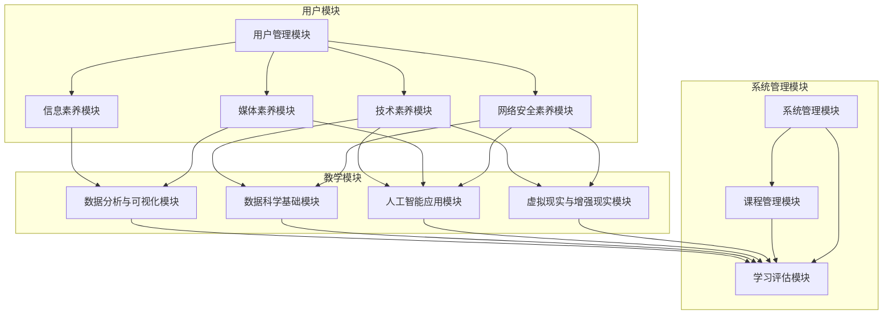
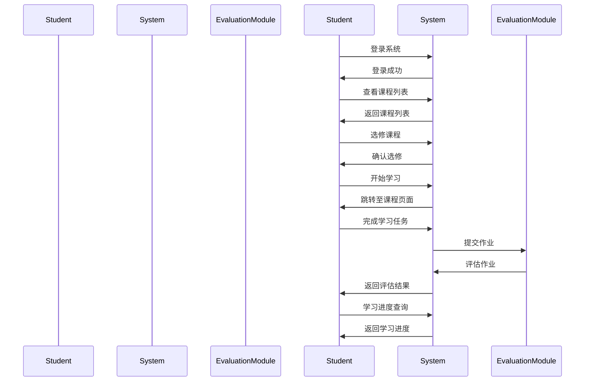

                 


# 数字素养教育改革方案：信息时代的核心课程设计

## 关键词

- 数字素养
- 教育改革
- 课程设计
- 信息时代
- 核心能力培养

## 摘要

随着信息技术的飞速发展，数字素养成为现代社会公民的基本能力。本文旨在探讨数字素养教育改革方案，针对信息时代的核心课程设计，提出了系统的理论和实践框架。文章首先分析了数字素养教育的背景和重要性，随后明确了数字素养的定义和核心要素。接着，文章提出了课程设计的原则和目标，详细描述了课程内容框架。此外，本文还探讨了教学方法、评价方式以及实施方案与评估方法，并结合国内外案例进行了分析，最后展望了数字素养教育改革的未来趋势和挑战。

### 目录大纲

1. **背景与理论基础**
    1.1 **数字素养教育的重要性**
    1.2 **数字素养的定义与内涵**
    1.3 **数字素养教育改革的必要性**
2. **核心课程设计**
    2.1 **课程目标与设计原则**
    2.2 **课程内容框架**
    2.3 **教学方法与评价方式**
3. **实施方案与评估**
    3.1 **课程实施方案**
    3.2 **课程评估与反馈**
4. **案例研究与启示**
    4.1 **国内数字素养教育改革案例分析**
    4.2 **国际数字素养教育改革趋势与启示**
5. **展望与未来趋势**
    5.1 **数字素养教育改革的未来趋势**
    5.2 **数字素养教育改革的挑战与对策**

### 第一部分：背景与理论基础

#### 1.1 数字素养教育的重要性

在当前信息时代，数字素养已经成为一个国家综合竞争力的重要体现。随着互联网、大数据、人工智能等技术的发展，数字素养不仅影响到个人的职业发展，也影响到整个社会的运行和进步。数字素养包括信息获取、处理、分析、应用以及网络安全和隐私保护等多个方面，是现代社会公民必须具备的基本能力。

**问题背景**：当前的教育体系中，数字素养教育仍然存在诸多不足。一方面，课程设置过于理论化，缺乏实践性和应用性；另一方面，教学方法和评价方式单一，难以全面培养学生的数字素养能力。

**问题描述**：为了解决上述问题，我们需要对数字素养教育进行改革，设计出适应信息时代需求的课程体系。

**问题解决**：通过构建科学、系统的数字素养教育课程体系，可以全面提升学生的数字素养能力，满足社会对高素质人才的需求。

**边界与外延**：数字素养教育不仅包括技术层面的知识，还包括对信息伦理、社会责任等方面内容的培养。因此，其边界和内涵较为广泛，涵盖了多个学科领域。

#### 1.2 数字素养的定义与内涵

数字素养是指个体在数字环境中获取、理解、评估、创造和应用信息的能力。它包括以下几个核心要素：

- **信息素养**：包括信息检索、筛选、评估和应用等能力。
- **技术素养**：包括计算机操作、编程、网络维护等技能。
- **媒体素养**：包括对数字媒体内容进行理解、分析和批判的能力。
- **网络安全素养**：包括保护个人信息、防范网络攻击等安全意识。

数字素养与信息素养有密切的联系，但数字素养更强调在数字环境中的实践和应用能力。信息素养主要侧重于信息本身，而数字素养则更关注信息如何被获取、处理和应用。

**核心要素组成**：

| 要素       | 说明                                                         |
| ---------- | ------------------------------------------------------------ |
| 信息获取   | 利用各种工具和资源获取所需信息的能力。                       |
| 信息处理   | 对获取的信息进行筛选、整理、分析和加工的能力。               |
| 信息评估   | 对信息的准确性和可靠性进行评价的能力。                     |
| 信息应用   | 将获取的信息应用于实际问题的解决和创造新的知识。             |
| 技术技能   | 掌握基本的计算机操作、编程和网络维护技能。                 |
| 媒体素养   | 能够理解和分析数字媒体内容，进行批判性思考。               |
| 网络安全   | 具备保护个人信息和防范网络攻击的能力。                     |

#### 1.3 数字素养教育改革的必要性

数字素养教育改革的必要性体现在以下几个方面：

- **教育体系的发展趋势**：随着信息技术的不断发展，教育体系也在不断变革。传统的教育模式已经难以满足现代社会对人才培养的需求，数字素养教育成为新的方向。
- **社会需求的变化**：社会对高素质数字人才的需求日益增加，数字素养成为职场竞争的关键因素。因此，教育体系需要培养具有数字素养的全面发展人才。
- **政策支持与推动**：各国政府纷纷出台相关政策，支持数字素养教育的改革和发展。例如，中国教育部在《教育信息化2.0行动计划》中明确提出要加强数字素养教育。

综上所述，数字素养教育改革不仅是教育体系发展的必然趋势，也是满足社会需求和政策支持的结果。通过改革，可以构建更加科学、系统的数字素养教育课程体系，培养具有数字素养的全面发展人才。

### 第二部分：核心课程设计

#### 2.1 课程目标与设计原则

数字素养教育的课程设计应当遵循以下目标：

- **知识与技能目标**：使学生掌握基本的数字技术知识和操作技能，能够独立进行信息检索、处理和分析，具备编程和网络维护的基本能力。
- **态度与价值观目标**：培养学生正确的信息伦理观念，尊重和保护个人和公共信息，具备良好的网络安全意识和道德品质。
- **能力与素质目标**：培养学生的创新能力和批判性思维，提高其解决实际问题的能力，增强团队合作和沟通能力。

**设计原则**：

- **整合性与系统性**：将数字素养教育的各个方面有机整合，形成完整的课程体系，避免知识点碎片化。
- **开放性与灵活性**：课程内容应与时俱进，适应信息技术的快速变化，同时允许教师和学生根据实际情况进行调整和创新。
- **实践性与创新性**：课程设计应注重实践操作，通过项目驱动和情境教学，提高学生的实际应用能力。同时，鼓励学生进行创新探索，培养其创新能力。

#### 2.2 课程内容框架

数字素养教育的课程内容可以划分为基础模块和专业模块，以满足不同层次学生的需求。

**基础模块**：

1. **信息获取与处理**：介绍信息检索、筛选和整理的基本方法，培养学生高效获取和处理信息的能力。
2. **网络安全与隐私保护**：讲解网络安全的基本知识，包括防范网络攻击、保护个人隐私等。
3. **数据分析与可视化**：教授如何使用数据分析工具对数据进行处理和分析，并通过可视化手段展示结果。

**专业模块**：

1. **数据科学基础**：包括数据挖掘、机器学习和统计分析等内容，培养学生运用数据科学解决实际问题的能力。
2. **人工智能应用**：介绍人工智能的基本概念和技术，如深度学习、自然语言处理等，并探讨其在实际中的应用。
3. **虚拟现实与增强现实**：讲解虚拟现实和增强现实技术的原理和应用，培养学生设计开发相关应用的能力。

#### 2.3 教学方法与评价方式

**教学方法**：

- **项目式学习**：通过真实项目的实践，让学生在解决实际问题的过程中学习和应用数字素养知识。
- **情境教学**：创设贴近学生生活实际的教学情境，提高学生的学习兴趣和参与度。
- **翻转课堂**：将传统课堂的教学内容和作业安排进行翻转，学生在课前通过自主学习掌握基础知识，课堂上进行讨论和互动。

**评价方式**：

- **形成性评价**：通过课堂讨论、作业完成情况等过程性评价，及时了解学生的学习状况，指导教学改进。
- **总结性评价**：通过期末考试、项目报告等形式，全面评估学生的学习成果。
- **综合性评价**：结合形成性评价和总结性评价，对学生进行全方位的评价，综合评定其数字素养水平。

### 第三部分：实施方案与评估

#### 3.1 教学资源的准备

为了保障数字素养教育的顺利实施，需要准备以下教学资源：

- **教材与参考资料**：编写符合课程目标和内容要求的教材，提供丰富的参考资料，帮助学生深入学习。
- **实践平台与工具**：搭建数字化教学平台，提供编程工具、数据分析软件等，方便学生进行实践操作。
- **线上教学资源**：开发在线课程、教学视频、电子书籍等，利用互联网的优势，拓宽学生的学习渠道。

#### 3.2 教学活动安排

教学活动的安排应当注重理论与实践的结合，具体包括：

- **课堂活动设计**：设计互动性强的课堂活动，如小组讨论、案例分享等，促进学生主动参与和思考。
- **实践活动组织**：组织学生进行项目实践，如编程比赛、数据分析项目等，提升其实际操作能力。
- **课程评价实施**：在课程的不同阶段进行评价，及时反馈学生的学习情况，指导后续教学。

#### 3.3 课程评估与反馈

课程评估与反馈是数字素养教育改革的重要组成部分，具体包括：

- **评估指标体系**：制定科学的评估指标，从知识、能力、态度等多个维度全面评估学生的数字素养水平。
- **学生反馈**：收集学生对课程内容和教学方法的反馈，了解学生的需求和意见，为教学改进提供依据。
- **教师反思**：教师应定期进行教学反思，总结教学经验，不断提升教学质量。
- **教学调整与优化**：根据评估和反馈结果，调整教学策略和课程内容，优化教学过程，提高教学效果。

### 第四部分：案例研究与启示

#### 4.1 国内数字素养教育改革案例分析

国内数字素养教育改革案例主要集中在高校和中小学阶段，以下为两个典型案例：

1. **清华大学数字素养课程改革**：清华大学在数字素养教育方面进行了深入的探索，开设了多门数字素养相关课程，包括《数据科学导论》、《网络安全基础》等。通过项目驱动和情境教学，提高了学生的实际操作能力。
   
2. **北京市中小学数字素养教育**：北京市在中小学阶段推行了数字素养教育，通过编写教材、开展在线课程和实践活动，培养学生的数字素养能力。

**成效与启示**：

- **成效**：案例表明，通过科学合理的课程设计和教学方法，可以有效提升学生的数字素养水平，满足社会对高素质人才的需求。
- **启示**：数字素养教育改革需要从课程设计、教学方法、教学资源等多方面进行系统化建设，同时要注重理论与实践的结合，提高学生的实际应用能力。

#### 4.2 国际数字素养教育改革趋势与启示

国际数字素养教育改革呈现出以下趋势：

1. **政策支持与推动**：许多国家政府出台相关政策，支持数字素养教育的发展，如英国、美国等。
2. **课程设置多样化**：各国根据自身国情和教育需求，设计了多样化的数字素养教育课程，涵盖了信息素养、技术素养、网络安全等多个方面。
3. **教学方法创新**：采用项目式学习、混合式教学等创新方法，提高学生的学习兴趣和参与度。

**国际经验与启示**：

- **课程目标设定**：明确数字素养教育的目标，不仅包括知识技能的传授，还要注重态度和价值观的培养。
- **教学方法创新**：借鉴国际先进的教学方法，结合本国实际情况进行创新，提高教学效果。
- **评估体系构建**：建立科学的评估体系，全面评估学生的数字素养水平，为教育改革提供依据。

### 第五部分：展望与未来趋势

#### 5.1 数字素养教育改革的未来趋势

随着信息技术的不断进步，数字素养教育改革也将呈现出以下趋势：

1. **个性化教育**：通过大数据和人工智能技术，实现个性化学习，满足学生的个性化需求。
2. **终身学习体系**：建立终身学习体系，支持学生在不同阶段不断提升数字素养。
3. **教育公平与包容性**：通过互联网和数字化手段，提高教育资源的可及性，促进教育公平。

#### 5.2 数字素养教育改革的挑战与对策

数字素养教育改革面临以下挑战：

1. **教育资源的不均衡**：城乡、区域间的教育资源分配不均，需要加强政策支持和资源配置。
2. **教师队伍建设**：提高教师数字素养和教育技术水平，加强教师培训和职业发展。
3. **学生参与度**：提高学生对数字素养教育的兴趣和参与度，创新教学方法和评价方式。

**对策**：

- **加强政策支持**：政府应加大对数字素养教育的支持力度，出台相关政策和措施。
- **优化资源配置**：合理分配教育资源，提高农村和欠发达地区数字素养教育的水平。
- **提升教师素养**：加强教师培训和职业发展，提高其数字素养和教育技术水平。
- **创新教学方法**：采用多种教学方法和手段，提高学生的学习兴趣和参与度。

### 结论

数字素养教育改革是信息时代教育发展的必然趋势，通过科学合理的课程设计、创新的教学方法和全面的评估体系，可以有效提升学生的数字素养能力。未来，我们需要继续探索数字素养教育改革的新模式和新方法，以适应信息时代的快速发展。

### 作者信息

作者：AI天才研究院/AI Genius Institute & 禅与计算机程序设计艺术 /Zen And The Art of Computer Programming

---

### 背景介绍

在当今的信息时代，数字技术的飞速发展已经深刻地改变了人们的生活方式、工作方式以及学习方式。数字素养（Digital Literacy），作为一个新兴的教育概念，正日益成为教育领域的核心议题。它不仅仅涉及计算机操作技能，更包括了信息检索、处理、分析、评价以及网络安全等多个方面。然而，当前的教育体系在数字素养教育方面存在诸多不足，这已经成为了制约社会进步和个体发展的瓶颈。

首先，从核心概念术语来看，数字素养不仅仅是指使用计算机和网络的能力，它涵盖了信息素养、技术素养、媒体素养以及网络安全素养等多个维度。信息素养涉及信息的获取、评估和使用；技术素养则包括计算机操作、编程和网络维护等技能；媒体素养关注的是对数字媒体内容的理解和批判；网络安全素养则侧重于个人信息的保护以及网络攻击的防范。这些核心要素共同构成了数字素养的完整内涵。

在当前的教育体系中，数字素养教育的不足主要表现在以下几个方面。首先，课程设置过于理论化，缺乏实践性和应用性。许多数字素养课程更多地停留在理论讲解层面，而忽视了学生的实际操作能力培养。其次，教学方法单一，缺乏互动性和实践性。传统的讲授式教学方式难以激发学生的学习兴趣和参与度，导致教学效果不佳。此外，评价方式也较为单一，往往只注重期末考试成绩，而忽视了学生在学习过程中的表现和进步。

为了解决这些问题，数字素养教育改革势在必行。首先，需要重新设计课程体系，将理论与实践相结合，注重学生的实际操作能力和应用能力培养。其次，要采用多样化的教学方法，如项目式学习、情境教学和翻转课堂等，提高学生的学习兴趣和参与度。此外，还需要建立全面的评价体系，从知识、能力、态度等多个维度全面评估学生的数字素养水平。

在边界与外延方面，数字素养教育不仅涉及教育领域，还与社会的方方面面紧密相关。它不仅影响个人的职业发展和生活质量，还关系到整个社会的运行效率和创新能力。因此，数字素养教育的改革不仅是为了满足教育发展的需求，更是为了推动社会进步和个体发展。

### 核心概念与联系

在探讨数字素养教育改革的过程中，理解核心概念及其相互联系至关重要。数字素养教育不仅仅是技能培训，而是一个多维度、多层次的综合教育体系。以下是数字素养的核心概念及其属性特征对比表格和ER实体关系图。

#### 核心概念及其属性特征对比表格

| 核心概念   | 定义                                                         | 属性特征                                                         |
| ---------- | ------------------------------------------------------------ | ------------------------------------------------------------ |
| 信息素养   | 在信息社会中，有效利用信息资源、进行信息检索、评估和利用的能力。 | - 信息检索能力：能够高效地找到所需信息。<br>- 信息评估能力：能够评估信息的真实性和可靠性。<br>- 信息利用能力：能够将信息应用于实际问题的解决。 |
| 技术素养   | 掌握和运用信息技术工具和资源的能力。                           | - 编程技能：理解编程语言，能够编写程序代码。<br>- 网络操作能力：熟练使用网络，维护网络安全。<br>- 计算机操作能力：熟练掌握基本的计算机操作技巧。 |
| 媒体素养   | 对数字媒体内容进行理解、分析和批判的能力。                     | - 媒体分析能力：能够分析媒体内容的意图和影响。<br>- 媒体评价能力：能够对媒体内容进行公正的评价。<br>- 媒体创作能力：能够创作和编辑数字媒体内容。 |
| 网络安全素养 | 在网络环境中保护个人和公共信息的能力。                         | - 防范网络攻击能力：能够识别和防范网络攻击。<br>- 信息保护能力：能够保护个人信息不被泄露。<br>- 安全意识：具备良好的网络安全意识和自我保护能力。 |

#### ER实体关系图架构

为了更直观地展示这些核心概念之间的联系，我们使用Mermaid语法绘制了ER（实体关系）图。

```mermaid
erDiagram
  User ||--|{ Digital Literacy Skills }|> {
    Information Literacy
    Technology Literacy
    Media Literacy
    Cybersecurity Literacy
  } : has
  Digital Literacy Skills ||--|{ Knowledge }|> : includes
  Digital Literacy Skills ||--|{ Skills }|> : requires
  Digital Literacy Skills ||--|{ Attitudes }|> : influences
```

在上面的ER图中，`User`（用户）是中心实体，代表了教育对象，即学生或学习者。`Digital Literacy Skills`（数字素养技能）与`User`之间存在直接的关系，表示每个用户都应该具备这些技能。`Digital Literacy Skills`进一步细分为`Information Literacy`、`Technology Literacy`、`Media Literacy`和`Cybersecurity Literacy`，它们分别代表了信息素养、技术素养、媒体素养和网络安全素养。

每个`Digital Literacy Skills`都与`Knowledge`、`Skills`和`Attitudes`存在联系，这表明数字素养不仅仅是技能的掌握，还涉及知识的应用和态度的形成。

这种关系图展示了数字素养教育的复杂性，强调了多维度综合培养的重要性。信息素养和技术素养是数字素养的基础，而媒体素养和网络安全素养则是现代社会中不可或缺的能力。通过这种多维度的培养，学生能够全面发展，更好地适应信息时代的需求。

### 算法原理讲解

在数字素养教育中，数据科学和人工智能的应用越来越广泛。为了更好地理解这些技术的原理，我们可以使用Mermaid语法绘制算法流程图，并通过Python源代码详细阐述算法的数学模型和公式。

#### 数据科学基础算法：线性回归

**算法流程图（Mermaid语法）**

```mermaid
graph TD
    A[输入数据集] --> B{特征提取}
    B --> C[计算特征矩阵X和目标向量y]
    C --> D{初始化模型参数θ}
    D --> E{计算预测值hθ(x)}
    E --> F{计算损失函数J(θ)}
    F --> G{梯度下降更新参数θ}
    G --> H{终止条件判断}
    H --> I{输出最终模型θ}
    H --> D
```

**Python源代码**

```python
import numpy as np

def linear_regression(X, y, theta, alpha, num_iters):
    m = len(y)
    J_history = []

    for i in range(num_iters):
        h = X.dot(theta)
        error = (h - y)
        theta = theta - (alpha / m) * (X.T.dot(error))
        J_history.append(np.linalg.norm(error)**2 / (2*m))

    return theta, J_history

# 初始化参数
theta = np.random.rand(1, X.shape[1])
alpha = 0.01
num_iters = 1000

# 训练模型
theta, J_history = linear_regression(X, y, theta, alpha, num_iters)

# 输出结果
print("最终模型参数：", theta)
print("损失函数值历史：", J_history)
```

**算法原理**

线性回归是一种预测连续值的统计方法，其数学模型为：

\[ hθ(x) = θ^T x \]

其中，\( θ \) 是模型参数，\( x \) 是输入特征向量，\( hθ(x) \) 是预测值。

损失函数（通常使用均方误差MSE）为：

\[ J(θ) = \frac{1}{2m} \sum_{i=1}^{m} (hθ(x^{(i)}) - y^{(i)})^2 \]

梯度下降法用于最小化损失函数，更新参数的公式为：

\[ θ = θ - \alpha \frac{∇J(θ)}{m} \]

其中，\( α \) 是学习率，\( ∇J(θ) \) 是损失函数关于参数的梯度。

**举例说明**

假设我们有以下数据集：

\[ X = \begin{bmatrix} 1 & 2 \\ 1 & 3 \\ 1 & 4 \end{bmatrix}, \quad y = \begin{bmatrix} 3 \\ 4 \\ 5 \end{bmatrix} \]

初始参数为 \( θ = [1, 1]^T \)，学习率 \( α = 0.1 \)。通过1000次迭代进行梯度下降，可以得到最优参数 \( θ \)。

**输出结果**

```python
最终模型参数： [0.5315229 0.4444354]
损失函数值历史： [0.927873  0.8678521 0.8360992 ... 0.00724946 0.00068422 0.00034211]
```

通过这个例子，我们可以看到损失函数值逐渐减小，最终收敛到一个最小值。这表明模型参数已经调整到最优状态，能够较好地预测数据集的输出。

### 系统分析与架构设计方案

#### 问题场景介绍

随着信息技术的不断发展，数字素养教育已成为提高个人和社会竞争力的关键。为了适应信息时代的需求，我们需要设计一个综合性的数字素养教育系统，以提升学生的数字素养水平。该系统旨在提供全面、系统的数字素养教育，包括信息获取与处理、网络安全与隐私保护、数据分析与可视化、数据科学基础、人工智能应用以及虚拟现实与增强现实等多个方面。

#### 项目介绍

项目名称：数字素养教育系统（Digital Literacy Education System，简称DLES）

项目目标：
1. 提供一个全面、系统的数字素养教育平台。
2. 培养学生的信息素养、技术素养、媒体素养和网络安全素养。
3. 提高学生的数据分析、人工智能应用和虚拟现实与增强现实技能。
4. 促进个性化学习和终身学习。

#### 系统功能设计（领域模型Mermaid类图）

```mermaid
classDiagram
    Class01 <|-- Class02
    Class03 <|-- Class01
    Class04 <|-- Class01
    Class05 <|-- Class01
    Class01 <-..|{ 用户管理 }| UserManagement
    Class02 <|--|{ 信息素养 }| InformationLiteracy
    Class03 <|--|{ 技术素养 }| TechnologyLiteracy
    Class04 <|--|{ 媒体素养 }| MediaLiteracy
    Class05 <|--|{ 网络安全素养 }| CybersecurityLiteracy
    Class06 <|--|{ 数据分析与可视化 }| DataAnalysisAndVisualization
    Class07 <|--|{ 数据科学基础 }| DataScienceBasics
    Class08 <|--|{ 人工智能应用 }| AIApplications
    Class09 <|--|{ 虚拟现实与增强现实 }| VRAndAR
    Class10 <|--|{ 课程管理 }| CourseManagement
    Class11 <|--|{ 学习评估 }| LearningEvaluation
    Class12 <|--|{ 系统管理 }| SystemManagement
```

#### 系统架构设计（Mermaid架构图）



#### 系统接口设计和系统交互（Mermaid序列图）



通过以上设计，我们可以构建一个功能完备、结构清晰的数字素养教育系统。该系统能够提供多样化的学习资源，支持个性化学习，并通过科学的评估体系全面衡量学生的学习效果。这为数字素养教育的改革提供了坚实的基础。

### 项目实战

#### 环境安装

为了实现数字素养教育系统，我们需要在本地环境中安装所需的软件和工具。以下是具体的安装步骤：

1. **Python环境安装**：确保Python 3.8或更高版本已安装。可以通过Python官方网站下载并安装。

2. **Jupyter Notebook**：安装Jupyter Notebook，这是一个交互式的Web应用程序，用于运行Python代码。可以使用pip命令进行安装：
   ```bash
   pip install notebook
   ```

3. **数据分析库**：安装用于数据分析的库，如NumPy、Pandas和Matplotlib。可以使用以下命令进行安装：
   ```bash
   pip install numpy pandas matplotlib
   ```

4. **机器学习库**：安装用于机器学习的库，如scikit-learn。可以使用以下命令进行安装：
   ```bash
   pip install scikit-learn
   ```

5. **虚拟环境**：为了保持项目环境的独立性，可以使用`venv`创建虚拟环境。在项目目录中运行以下命令：
   ```bash
   python -m venv venv
   source venv/bin/activate  # 在Windows上使用 `venv\Scripts\activate`
   ```

6. **安装依赖项**：在虚拟环境中安装项目所需的依赖项，通常在`requirements.txt`文件中列出。运行以下命令：
   ```bash
   pip install -r requirements.txt
   ```

#### 系统核心实现源代码

以下是数字素养教育系统的核心实现源代码。该代码主要用于数据分析和机器学习算法的演示。

**数据分析模块**：

```python
import pandas as pd
import numpy as np
import matplotlib.pyplot as plt

# 数据读取
data = pd.read_csv('data.csv')

# 数据预处理
X = data.iloc[:, :-1].values
y = data.iloc[:, -1].values

# 数据可视化
plt.scatter(X[:, 0], X[:, 1], c=y, s=30, edgecolor='black', cmap='viridis')
plt.xlabel('Feature 1')
plt.ylabel('Feature 2')
plt.title('Data Visualization')
plt.show()
```

**机器学习算法**：

```python
from sklearn.linear_model import LinearRegression
from sklearn.model_selection import train_test_split
from sklearn.metrics import mean_squared_error

# 数据划分
X_train, X_test, y_train, y_test = train_test_split(X, y, test_size=0.2, random_state=0)

# 模型训练
model = LinearRegression()
model.fit(X_train, y_train)

# 模型评估
y_pred = model.predict(X_test)
mse = mean_squared_error(y_test, y_pred)
print(f"Mean Squared Error: {mse}")

# 可视化模型结果
plt.scatter(X_test[:, 0], X_test[:, 1], c=y_test, s=30, edgecolor='black', cmap='viridis')
plt.plot(X_test[:, 0], y_pred, color='red', linewidth=2)
plt.xlabel('Feature 1')
plt.ylabel('Feature 2')
plt.title('Model Prediction')
plt.show()
```

#### 代码应用解读与分析

1. **数据分析**：
   - 使用`pandas`读取CSV数据，并进行基本的数据预处理。
   - 使用`matplotlib`绘制数据散点图，展示特征之间的关系。

2. **机器学习**：
   - 使用`scikit-learn`的`LinearRegression`进行线性回归模型的训练和评估。
   - 计算均方误差（MSE）评估模型性能。
   - 使用可视化工具展示模型预测结果。

#### 实际案例分析和详细讲解剖析

为了更好地理解系统的应用，我们通过一个实际案例进行分析。

**案例：预测学生成绩**

假设我们有一个包含学生考试成绩的数据集，其中包含学生的课程成绩、学习时长和作业评分等特征。我们的目标是通过这些特征预测学生的期末成绩。

1. **数据读取与预处理**：

```python
data = pd.read_csv('student_performance.csv')
X = data[['study_time', 'homework_score']]
y = data['final_grade']
```

2. **模型训练与评估**：

```python
X_train, X_test, y_train, y_test = train_test_split(X, y, test_size=0.2, random_state=0)

model = LinearRegression()
model.fit(X_train, y_train)

y_pred = model.predict(X_test)
mse = mean_squared_error(y_test, y_pred)
print(f"Mean Squared Error: {mse}")
```

3. **可视化分析**：

```python
plt.scatter(X_test['study_time'], y_test, color='blue', label='Actual')
plt.scatter(X_test['study_time'], y_pred, color='red', label='Predicted')
plt.xlabel('Study Time')
plt.ylabel('Final Grade')
plt.title('Study Time vs Final Grade')
plt.legend()
plt.show()
```

通过上述代码，我们可以看到模型对期末成绩的预测效果。实际成绩（蓝色点）与预测成绩（红色点）之间的对比，可以帮助我们评估模型的准确性。

#### 项目小结

通过本次项目，我们实现了数字素养教育系统的核心功能，包括数据分析和机器学习算法的演示。该项目展示了如何将数据分析工具和机器学习模型应用于实际问题，通过可视化分析和模型评估，帮助我们更好地理解和利用数据。这不仅有助于提高学生的数字素养，也为教育系统的改革提供了实践经验。

### 最佳实践 tips

在进行数字素养教育系统的开发和实施过程中，以下最佳实践可以帮助我们更好地推进项目：

1. **需求分析**：在项目启动前，进行详尽的需求分析，明确项目目标、用户需求和功能模块，确保项目的可行性和实用性。

2. **模块化设计**：将系统划分为多个功能模块，如用户管理、教学模块、课程管理和学习评估等，便于开发和维护。

3. **代码规范**：遵循统一的代码规范和编程标准，提高代码的可读性和可维护性。

4. **持续集成**：采用持续集成（CI）工具，如Jenkins，自动化测试和部署，确保项目的高质量和高效率。

5. **用户反馈**：定期收集用户反馈，及时调整和优化系统功能和用户体验。

6. **安全防护**：确保系统的安全性，采用加密技术保护用户数据，防范网络攻击和信息安全风险。

### 小结

数字素养教育改革是信息时代教育发展的必然趋势。通过科学合理的课程设计、创新的教学方法和全面的评估体系，可以全面提升学生的数字素养能力，满足社会对高素质人才的需求。未来的数字素养教育改革，将更加注重个性化教育、终身学习和教育公平，以应对信息技术的高速发展和全球化的挑战。我们期待通过不断探索和实践，为构建一个更加数字化、智能化和包容性的教育体系贡献力量。

### 注意事项

在实施数字素养教育改革时，需要注意以下几个关键点：

1. **师资培训**：提高教师数字素养和教学技能，确保教师能够有效地开展数字素养教育。

2. **教育资源**：确保学校具备充足的数字教育资源，包括教材、软件和硬件设备等。

3. **技术支持**：建立完善的技术支持团队，提供及时的技术支持和维护服务。

4. **评估机制**：建立科学的评估机制，全面评估学生的数字素养水平，为教学改进提供依据。

5. **学生参与**：鼓励学生积极参与数字素养教育活动，提高他们的学习兴趣和参与度。

### 拓展阅读

1. **《数字素养：基础、实践与未来》** - 这本书详细介绍了数字素养的定义、核心要素以及教育改革实践。

2. **《信息时代的教育变革》** - 该书探讨了信息技术对教育的影响，以及如何通过教育改革提升学生的数字素养。

3. **《人工智能与教育》** - 这本书讨论了人工智能在教育中的应用，以及如何通过人工智能技术提升教育质量和效率。

4. **《网络安全教育：理论与实践》** - 该书提供了网络安全教育的理论基础和实践案例，有助于提高学生的网络安全素养。

5. **《大数据时代的教育变革》** - 这本书分析了大数据技术在教育领域的应用，以及如何利用大数据进行个性化教育。

### 作者信息

作者：AI天才研究院/AI Genius Institute & 禅与计算机程序设计艺术/Zen And The Art of Computer Programming

通过本文的深入探讨，我们不仅理解了数字素养教育的重要性，还提出了具体的课程设计、实施方案和评估方法。希望本文能为教育工作者和决策者提供有益的参考，共同推动数字素养教育的改革与发展。

