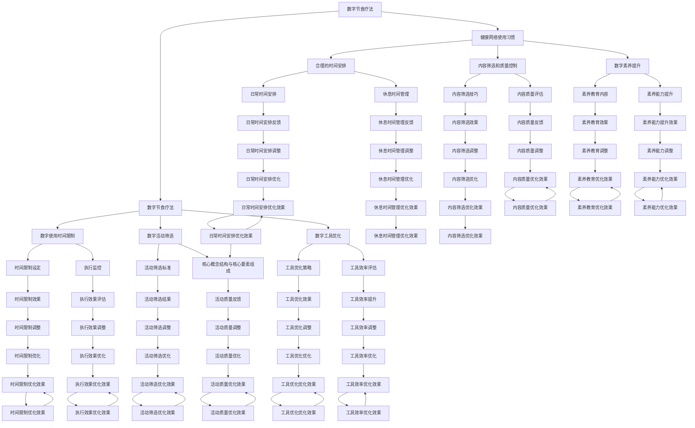

                 

### 总结

本文通过系统的分析和深入的探讨，详细阐述了数字节食疗法工作坊的设计与实践方法。我们从背景介绍、核心原理、应用场景、实践方法到推广与未来展望，逐步深入，逐一分析了数字节食疗法在健康网络使用习惯重建中的重要作用。

首先，在背景介绍部分，我们明确了数字节食疗法的核心概念和健康网络使用习惯的重要性。接着，通过详细的原理讲解，我们揭示了数字节食疗法的理论基础、策略与方法，以及其效果评估和研究进展。在应用场景部分，我们探讨了数字节食疗法在智能手机成瘾、网络信息过载、社交媒体依赖和网络游戏沉迷等领域的实际应用。

在实践方法部分，我们详细介绍了数字节食疗法工作坊的设计、个人数字节食实践以及企业与组织的数字节食策略。这些实践方法不仅提供了具体可行的操作步骤，还结合了实际案例，进行了深入的分析和解读。

最后，在推广与未来展望部分，我们探讨了数字节食疗法的推广策略、未来发展趋势以及面临的挑战与机遇。通过这一系列的探讨，我们不仅了解了数字节食疗法的基本概念和核心原理，更掌握了其实践方法和推广策略。

在总结部分，我们再次强调了数字节食疗法在重建健康网络使用习惯中的重要性，并对其未来发展和应用前景进行了展望。我们相信，随着技术的不断进步和社会的不断发展，数字节食疗法将在更多人生活中发挥更大的作用。

### 目录大纲

#### 第一部分：背景介绍

1. **第1章：数字节食疗法概述**
   - **1.1 问题背景**
     - 数字节食疗法产生的时代背景
     - 当代社会数字使用的现状和问题
   - **1.2 问题描述**
     - 数字使用对个人健康的影响
     - 数字使用导致的常见问题及其危害
   - **1.3 问题解决**
     - 数字节食疗法提出的初衷和目标
     - 数字节食疗法的实施方法和预期效果
   - **1.4 边界与外延**
     - 数字节食疗法的适用范围和局限性
     - 数字节食疗法与其他相关概念的区别
   - **1.5 核心概念**
     - **数字节食疗法**
       - 定义、内涵、外延
       - 主要组成部分和作用机制
     - **健康网络使用习惯**
       - 定义、特征、重要性
       - 健康网络使用习惯的构建和维持
   - **1.6 概念结构与核心要素组成**
     - 数字节食疗法概念结构图
     - 健康网络使用习惯的核心要素

#### 第二部分：数字节食疗法原理

2. **第2章：数字节食疗法核心原理**
   - **2.1 数字节食疗法的理论基础**
     - 相关理论和研究背景
     - 数字节食疗法的理论基础和科学依据
   - **2.2 数字节食疗法的策略与方法**
     - 数字节食疗法的实施步骤和策略
     - 常用的数字节食疗法方法和技巧
   - **2.3 数字节食疗法的效果评估**
     - 数字节食疗法的效果指标和评估方法
     - 实际应用中的效果案例和反馈
   - **2.4 数字节食疗法的研究进展**
     - 最新研究成果和进展
     - 数字节食疗法的发展趋势和未来展望

3. **第3章：数字节食疗法应用场景**
   - **3.1 智能手机成瘾**
     - 智能手机成瘾的现象和原因
     - 数字节食疗法在智能手机成瘾中的应用
   - **3.2 网络信息过载**
     - 网络信息过载的影响和应对策略
     - 数字节食疗法在网络信息过载中的应用
   - **3.3 社交媒体依赖**
     - 社交媒体依赖的危害和干预措施
     - 数字节食疗法在社交媒体依赖中的应用
   - **3.4 网络游戏沉迷**
     - 网络游戏沉迷的特点和负面影响
     - 数字节食疗法在网络游戏沉迷中的应用

#### 第三部分：数字节食疗法实践

4. **第4章：数字节食疗法工作坊设计**
   - **4.1 工作坊目标与原则**
     - 工作坊的目标和核心原则
     - 工作坊的基本理念和操作规范
   - **4.2 工作坊活动设计**
     - 工作坊的具体活动安排和内容
     - 每个活动环节的设计意图和效果
   - **4.3 工作坊实施步骤**
     - 工作坊的筹备和组织流程
     - 工作坊的执行步骤和时间安排
   - **4.4 工作坊成果评估**
     - 工作坊效果的评估标准和指标
     - 工作坊成果的总结和反馈

5. **第5章：个人数字节食实践**
   - **5.1 个人数字节食计划制定**
     - 个人数字节食计划的设计原则和步骤
     - 个人数字节食计划的实例和模板
   - **5.2 个人数字节食实践方法**
     - 个人数字节食的具体方法和技巧
     - 个人数字节食的常见问题和解决方案
   - **5.3 个人数字节食实践案例**
     - 个人数字节食实践的成功案例和经验分享
     - 个人数字节食实践的问题和反思
   - **5.4 个人数字节食实践反馈**
     - 个人数字节食实践的效果反馈和评价
     - 个人数字节食实践的经验总结和改进建议

6. **第6章：企业与组织数字节食策略**
   - **6.1 企业数字节食策略概述**
     - 企业数字节食策略的定义和重要性
     - 企业数字节食策略的基本原则和实施流程
   - **6.2 企业数字节食策略制定**
     - 企业数字节食策略的制定方法和步骤
     - 企业数字节食策略的具体内容和实践案例
   - **6.3 企业数字节食策略实施**
     - 企业数字节食策略的实施步骤和执行策略
     - 企业数字节食策略的执行效果和评估
   - **6.4 企业数字节食策略评估**
     - 企业数字节食策略的评估方法和指标
     - 企业数字节食策略的评估结果和改进方向

#### 第四部分：数字节食疗法推广与未来展望

7. **第7章：数字节食疗法推广与未来展望**
   - **7.1 数字节食疗法推广策略**
     - 数字节食疗法的推广目标和策略
     - 数字节食疗法推广的具体方法和实践
   - **7.2 数字节食疗法未来发展趋势**
     - 数字节食疗法的发展趋势和方向
     - 数字节食疗法在未来的应用前景
   - **7.3 数字节食疗法面临的挑战与机遇**
     - 数字节食疗法面临的挑战和问题
     - 数字节食疗法面临的机遇和解决方案
   - **7.4 本章小结**
     - 数字节食疗法的核心内容和关键点
     - 数字节食疗法在健康网络使用习惯重建中的重要作用
     - 数字节食疗法未来的发展前景和潜在影响

### 第一部分：背景介绍

#### 第1章：数字节食疗法概述

##### 1.1 问题背景

在现代社会，数字技术的迅猛发展给我们的生活带来了前所未有的便利，但同时也带来了新的挑战。智能手机、互联网、社交媒体等数字工具已经成为我们日常生活中不可或缺的一部分。然而，过度依赖这些数字工具导致了一系列的健康问题和社会问题，这些问题日益引起人们的高度关注。

首先，智能手机的普及率几乎达到了全民覆盖。人们随时随地都能够通过智能手机获取信息、社交、娱乐等。然而，这种便利也导致了智能手机成瘾的问题。许多人在使用智能手机时难以自拔，这不仅影响了工作效率，还严重干扰了日常生活。其次，网络信息的过载也是现代社会的一大难题。在信息爆炸的时代，人们每天都要面对海量的信息，这种信息过载现象容易导致焦虑和压力。此外，社交媒体的广泛使用使得人们越来越依赖网络社交，这也带来了许多负面影响，如社交隔离、孤独感和网络暴力等。最后，网络游戏的沉迷现象也越来越严重。许多青少年因为沉迷于网络游戏而忽视了学业和社交，甚至导致身心健康问题。

这些数字使用问题不仅影响了个人的生活质量，也对整个社会产生了深远的影响。因此，解决这些问题已经成为一个迫切需要关注和解决的问题。在这个背景下，数字节食疗法应运而生。

##### 1.2 问题描述

数字节食疗法提出的初衷是为了帮助人们重建健康的数字使用习惯，从而缓解和解决由于过度数字使用导致的各种问题。具体来说，数字节食疗法试图解决以下问题：

1. **智能手机成瘾**：许多人对智能手机的依赖性越来越强，无法自拔。这种成瘾现象不仅影响了工作效率，还干扰了日常生活。智能手机成瘾的问题已经成为一个全球性的问题，需要有效的干预措施。
   
2. **网络信息过载**：在信息爆炸的时代，人们每天都要面对大量的信息，这种信息过载现象容易导致焦虑和压力。有效管理信息流，提高信息处理效率，是数字节食疗法需要解决的问题之一。

3. **社交媒体依赖**：社交媒体的广泛使用使得人们越来越依赖网络社交，但也带来了许多负面影响，如社交隔离、孤独感和网络暴力等。如何建立健康的社交媒体使用习惯，是数字节食疗法的重要任务。

4. **网络游戏沉迷**：网络游戏已经成为许多青少年生活的重要组成部分，但过度的沉迷会导致学业荒废、身心健康问题等。如何引导青少年合理使用网络游戏，避免沉迷，也是数字节食疗法需要解决的关键问题。

##### 1.3 问题解决

数字节食疗法通过一系列的策略和方法，旨在帮助人们建立健康的数字使用习惯，从而解决上述问题。以下是数字节食疗法的一些主要解决思路：

1. **限制数字使用时间**：通过设定具体的数字使用时间限制，帮助人们逐步减少对数字工具的依赖。这可以通过使用手机的应用程序锁、定时器等工具来实现。

2. **提高数字使用效率**：通过提高数字使用的效率，减少不必要的数字操作和时间浪费。例如，使用快捷键、批量处理工具等，可以提高工作效率。

3. **培养健康数字使用习惯**：通过教育和引导，帮助人们培养健康的数字使用习惯。这包括合理安排数字使用时间、选择有意义和高质量的数字内容、避免沉迷于无意义的数字活动等。

4. **建立数字隔离机制**：通过建立数字隔离机制，帮助人们从数字世界中解脱出来，专注于现实生活中的重要事务。例如，设定特定时间进行数字断连，进行户外活动等。

5. **加强数字素养教育**：通过加强数字素养教育，提高人们对数字工具和信息的正确使用能力，从而减少数字使用的负面影响。这包括数字安全意识、信息素养、网络礼仪等方面的教育。

##### 1.4 边界与外延

数字节食疗法虽然旨在解决数字使用带来的问题，但它的应用范围和边界也需要明确。以下是数字节食疗法的一些边界和外延：

1. **适用范围**：数字节食疗法主要适用于那些过度依赖数字工具和数字活动的人群。这包括智能手机成瘾者、网络信息过载者、社交媒体依赖者和网络游戏沉迷者等。同时，数字节食疗法也适用于那些希望通过改善数字使用习惯来提升生活质量的人。

2. **局限性**：数字节食疗法虽然可以解决许多数字使用问题，但它也有一定的局限性。首先，数字节食疗法需要个人的自觉性和执行力，如果缺乏自我约束力，很难坚持下去。其次，数字节食疗法的效果受到个人环境和社会文化的影响，需要结合实际情况进行实施。

3. **与其他相关概念的区别**：数字节食疗法与健康饮食、数字减法等概念有所区别。健康饮食主要关注的是食物的摄入和营养均衡，而数字节食疗法关注的是数字工具和活动的使用习惯。数字减法则是一种更广泛的数字减少策略，包括减少数字使用时间和提高数字使用效率等，而数字节食疗法更侧重于通过节食的方式来重建健康的数字使用习惯。

##### 1.5 核心概念

数字节食疗法是一个旨在通过减少数字使用时间和提高数字使用效率，以改善个人数字健康和提升生活质量的策略。以下是数字节食疗法中的两个核心概念：数字节食疗法和健康网络使用习惯。

###### 1.5.1 数字节食疗法

数字节食疗法是一种基于健康饮食理念的数字使用策略，旨在通过减少数字工具和活动的使用时间，从而改善个人的数字健康状态。以下是数字节食疗法的核心概念和定义：

- **定义**：数字节食疗法是一种通过有意识地减少数字工具和活动的使用时间，以减轻数字依赖和提高生活质量的策略。它借鉴了健康饮食中的节食理念，通过设定具体的数字使用时间限制，帮助人们逐步减少对数字工具的依赖。
  
- **内涵**：数字节食疗法的内涵包括以下几个方面：
  - **数字使用时间限制**：通过设定每天的数字使用时间，帮助人们控制数字使用的频率和时间，从而减少数字依赖。
  - **数字活动筛选**：通过筛选和选择有意义的数字活动，避免无意义的数字操作和时间浪费，提高数字使用的效率。
  - **数字工具优化**：通过优化数字工具的使用，提高数字活动的效率和质量，减少不必要的数字操作和时间浪费。

- **外延**：数字节食疗法的外延包括以下几个方面：
  - **智能手机成瘾干预**：通过限制智能手机的使用时间，帮助人们摆脱智能手机成瘾的困境，改善生活质量。
  - **网络信息过载管理**：通过减少网络信息的接触时间，提高信息处理效率，减轻网络信息过载带来的压力和焦虑。
  - **社交媒体依赖缓解**：通过限制社交媒体的使用时间，帮助人们减少对社交媒体的依赖，建立健康的社交媒体使用习惯。
  - **网络游戏沉迷干预**：通过限制网络游戏的使用时间，帮助人们摆脱网络游戏沉迷，专注于学业和现实生活中的重要事务。

###### 1.5.2 健康网络使用习惯

健康网络使用习惯是指通过合理安排网络使用时间、选择有意义和高质量的数字内容、避免沉迷于无意义的数字活动等，以建立和维护健康的网络使用习惯。以下是健康网络使用习惯的核心概念和定义：

- **定义**：健康网络使用习惯是一种基于健康生活方式理念的数字使用习惯，旨在通过合理使用网络，提升个人的数字健康和生活质量。
  
- **内涵**：健康网络使用习惯的内涵包括以下几个方面：
  - **合理的时间安排**：合理安排网络使用时间，避免过度依赖网络，保证充足的休息和睡眠时间。
  - **内容筛选和质量控制**：选择有意义和高质量的数字内容，避免沉迷于低质量、无意义的数字活动，提高网络使用的效率和质量。
  - **数字素养提升**：通过提高数字素养，增强对数字工具和信息的正确使用能力，减少数字使用的负面影响。

- **外延**：健康网络使用习惯的外延包括以下几个方面：
  - **社交媒体使用管理**：合理安排社交媒体的使用时间，避免沉迷于社交媒体，减少社交隔离和孤独感。
  - **网络信息筛选和处理**：通过有效的信息筛选和处理方法，提高信息获取和处理的效率，减轻网络信息过载带来的压力。
  - **网络安全意识培养**：增强网络安全意识，提高对网络风险和安全的防护能力，减少网络犯罪和网络诈骗等风险。
  - **数字素养教育**：通过数字素养教育，提高人们对数字工具和信息的正确使用能力，促进数字社会的健康发展。

##### 1.6 概念结构与核心要素组成

数字节食疗法是一个复杂的概念体系，由多个核心要素组成。以下是数字节食疗法的概念结构图和核心要素组成：

###### 概念结构图

###### 核心要素组成

数字节食疗法由以下核心要素组成：

1. **数字节食疗法**
   - **数字使用时间限制**
     - **时间限制设定**：设定每天的数字使用时间，如每天不超过两小时。
     - **执行监控**：通过应用程序、定时器等工具监控数字使用时间，确保限制得到遵守。
   - **数字活动筛选**
     - **活动筛选标准**：选择有意义的数字活动，如学习、工作、健康娱乐等。
     - **活动质量评估**：对数字活动进行质量评估，确保数字活动的有益性。
   - **数字工具优化**
     - **工具优化策略**：优化数字工具的使用，如使用快捷键、自动化工具等。
     - **工具效率评估**：评估数字工具的效率，确保优化策略的有效性。

2. **健康网络使用习惯**
   - **合理的时间安排**
     - **日常时间安排**：合理安排网络使用时间，如工作、学习、休闲、运动等。
     - **休息时间管理**：确保充足的休息和睡眠时间，避免因网络使用而影响休息。
   - **内容筛选和质量控制**
     - **内容筛选技巧**：学会筛选高质量的数字内容，避免低质量、无意义的信息。
     - **内容质量评估**：对数字内容进行质量评估，确保获取的信息和内容对个人有益。
   - **数字素养提升**
     - **素养教育内容**：通过教育和培训提高数字素养，包括网络安全、信息素养、网络礼仪等。
     - **素养能力提升**：通过实践和训练提高数字素养，确保能够在数字世界中正确使用工具和信息。

这些核心要素共同构成了数字节食疗法的概念结构，每个要素都在重建健康数字使用习惯中发挥着重要作用。

### 第二部分：数字节食疗法原理

#### 第2章：数字节食疗法核心原理

数字节食疗法是一种通过减少数字工具和活动的使用时间，以改善个人数字健康和提升生活质量的策略。它借鉴了健康饮食中的节食理念，通过设定具体的数字使用时间限制，帮助人们逐步减少对数字工具的依赖。本章将详细探讨数字节食疗法的理论基础、策略与方法，以及效果评估和研究进展。

#### 2.1 数字节食疗法的理论基础

数字节食疗法的理论基础主要来源于行为心理学和健康行为学。行为心理学认为，人的行为是由外部刺激和内部动机共同作用的结果。数字节食疗法通过减少数字工具的使用，减少了外部刺激，从而降低了人们对数字工具的依赖。健康行为学则强调，健康行为是影响个体健康的重要因素。数字节食疗法通过培养健康的数字使用习惯，帮助人们建立健康的生活方式。

此外，数字节食疗法还借鉴了认知行为疗法（CBT）的原理。认知行为疗法认为，改变个体的认知和行为，可以有效改善其心理健康。数字节食疗法通过改变人们对数字工具的认知和使用行为，帮助人们摆脱对数字工具的依赖。

#### 2.2 数字节食疗法的策略与方法

数字节食疗法的策略与方法主要包括以下几个方面：

1. **设定数字使用时间限制**：这是数字节食疗法的基本策略。通过设定每天的数字使用时间限制，帮助人们逐步减少对数字工具的依赖。具体实施时，可以从减少数字使用时间开始，逐步调整至合适的水平。

2. **提高数字使用效率**：通过优化数字工具的使用，提高数字活动的效率，减少不必要的数字操作和时间浪费。例如，使用快捷键、自动化工具等，可以提高工作效率。

3. **培养健康数字使用习惯**：通过教育和引导，帮助人们培养健康的数字使用习惯。这包括合理安排数字使用时间、选择有意义和高质量的数字内容、避免沉迷于无意义的数字活动等。

4. **建立数字隔离机制**：通过设定特定时间进行数字断连，帮助人们从数字世界中解脱出来，专注于现实生活中的重要事务。例如，设定每天晚上睡前一小时不使用数字工具，确保充足的休息和睡眠时间。

5. **加强数字素养教育**：通过加强数字素养教育，提高人们对数字工具和信息的正确使用能力，从而减少数字使用的负面影响。这包括数字安全意识、信息素养、网络礼仪等方面的教育。

#### 2.3 数字节食疗法的效果评估

数字节食疗法的效果评估主要包括以下几个方面：

1. **数字使用时间减少**：通过设定和遵守数字使用时间限制，评估个体数字使用时间的减少情况。具体指标包括每天的平均数字使用时间、每月的数字使用时间变化等。

2. **数字活动质量提高**：通过培养健康的数字使用习惯，评估个体数字活动质量的提高情况。具体指标包括数字活动的内容和质量评分、活动完成的效率和效果等。

3. **心理健康改善**：通过减少数字工具的使用，评估个体的心理健康状况改善情况。具体指标包括焦虑、抑郁等心理问题的症状评分、生活满意度和心理幸福感等。

4. **生活效率提高**：通过提高数字使用效率，评估个体生活效率的提高情况。具体指标包括工作、学习、生活等各方面的效率提升情况。

#### 2.4 数字节食疗法的研究进展

数字节食疗法的研究进展主要表现在以下几个方面：

1. **理论基础完善**：随着行为心理学、健康行为学和认知行为疗法等领域的不断发展，数字节食疗法的理论基础得到了进一步的完善。

2. **实践方法多样化**：随着技术的进步，数字节食疗法的实践方法也日益多样化。例如，通过智能手机应用程序、在线平台等，提供个性化的数字节食疗法服务。

3. **效果评估科学化**：通过大数据分析和人工智能技术，对数字节食疗法的效果进行科学评估，提高了评估的准确性和可靠性。

4. **推广和应用广泛**：数字节食疗法在全球范围内得到了广泛的关注和推广。许多国家和地区都在积极研究和推广数字节食疗法，以提高公众的数字健康水平。

#### 数字节食疗法的研究成果和未来趋势

数字节食疗法的研究成果主要体现在以下几个方面：

1. **理论体系的完善**：通过不断的研究和实践，数字节食疗法的理论基础得到了进一步的完善，为数字节食疗法的实施提供了科学依据。

2. **实践方法的创新**：随着技术的发展，数字节食疗法的实践方法不断创新，提供了更多个性化的数字节食疗法服务。

3. **效果评估的科学化**：通过大数据分析和人工智能技术，对数字节食疗法的效果进行科学评估，提高了评估的准确性和可靠性。

4. **社会影响力的提升**：数字节食疗法在社会各界引起了广泛的关注和讨论，其社会影响力不断提升。

未来，数字节食疗法的发展趋势将主要体现在以下几个方面：

1. **个性化服务的发展**：随着大数据和人工智能技术的应用，数字节食疗法将更加注重个性化服务，为不同人群提供定制化的数字节食疗法方案。

2. **跨学科研究的深入**：数字节食疗法将与其他学科如医学、心理学等深入融合，形成更全面的理论体系和实践方法。

3. **技术应用的创新**：数字节食疗法将不断引入新的技术，如虚拟现实、增强现实等，提供更丰富、更有效的数字节食疗法体验。

4. **全球推广的深化**：数字节食疗法将在全球范围内得到更广泛的推广和应用，成为提升公众数字健康水平的重要手段。

#### 数字节食疗法在健康网络使用习惯重建中的作用

数字节食疗法在健康网络使用习惯重建中发挥着重要作用。通过减少数字工具的使用时间，培养健康的数字使用习惯，数字节食疗法帮助人们建立良好的数字生活习惯，从而改善数字健康，提升生活质量。

首先，数字节食疗法通过设定数字使用时间限制，帮助人们逐步减少对数字工具的依赖，从而减轻智能手机成瘾、网络信息过载、社交媒体依赖和网络游戏沉迷等问题。其次，数字节食疗法通过培养健康的数字使用习惯，提高数字活动的质量，使人们能够更加有效地利用网络资源，提升生活效率。

此外，数字节食疗法还通过建立数字隔离机制，帮助人们从数字世界中解脱出来，专注于现实生活中的重要事务。同时，通过加强数字素养教育，提高人们对数字工具和信息的正确使用能力，减少数字使用的负面影响。

总之，数字节食疗法在健康网络使用习惯重建中具有显著的作用，为解决现代数字使用问题提供了有效的解决方案。随着数字节食疗法的不断推广和应用，相信它将在更多人生活中发挥更大的作用。

### 第三部分：数字节食疗法应用场景

#### 第3章：数字节食疗法应用场景

数字节食疗法作为一种有效的策略，在多个应用场景中展现出了其独特的价值和效果。以下将详细探讨数字节食疗法在智能手机成瘾、网络信息过载、社交媒体依赖和网络游戏沉迷等场景中的应用。

#### 3.1 智能手机成瘾

智能手机成瘾是一种普遍现象，尤其在青少年和成年人中表现尤为明显。智能手机成瘾不仅影响个人的生活质量，还可能引发一系列心理健康问题。数字节食疗法通过设定合理的手机使用时间限制，帮助用户逐步减少对手机的依赖。

**应用方法**：

1. **设定使用时间限制**：用户可以设定每天的手机使用时间，例如每天不超过两小时。通过使用手机应用程序锁、定时器等工具，确保用户遵守设定的使用时间。

2. **优化手机使用习惯**：用户应培养健康的手机使用习惯，如合理安排使用时间、选择有意义的应用程序、避免沉迷于无意义的活动等。

3. **增强自我约束**：用户可以通过自我提醒、目标设定等方法，增强自我约束力，逐步减少手机使用时间。

**案例**：

某公司员工小王，因为工作需要经常使用手机，导致下班后也离不开手机，影响到了他的睡眠和生活质量。通过采用数字节食疗法，小王设定了每天的手机使用时间限制，并优化了手机使用习惯。一段时间后，小王的手机使用时间显著减少，生活质量也得到了明显改善。

#### 3.2 网络信息过载

网络信息过载是现代社会面临的一个普遍问题，尤其是在社交媒体和新闻平台上，用户每天都要面对大量的信息。网络信息过载容易导致焦虑和压力，影响心理健康和工作效率。数字节食疗法通过筛选和管理信息，帮助用户减轻信息过载带来的负面影响。

**应用方法**：

1. **信息筛选**：用户可以学会筛选重要的信息，避免被大量无关的信息所淹没。例如，通过关注关键话题、使用信息过滤工具等，提高信息获取的效率。

2. **设定信息消费时间**：用户可以设定每天的信息消费时间，例如每天不超过一小时。通过定时器等工具，确保用户遵守设定的信息消费时间。

3. **培养健康的信息消费习惯**：用户应培养健康的信息消费习惯，如选择有价值的新闻和文章、避免沉迷于无意义的信息等。

**案例**：

某大学生小李，因为沉迷于社交媒体和新闻平台，每天花费大量时间在浏览信息上，导致学习成绩下降和焦虑情绪增加。通过采用数字节食疗法，小李学会了筛选重要的信息，并设定了每天的信息消费时间。一段时间后，小李的学习成绩显著提高，焦虑情绪也得到了缓解。

#### 3.3 社交媒体依赖

社交媒体依赖是现代社会中另一个普遍存在的问题。过度依赖社交媒体不仅容易导致社交隔离和孤独感，还可能引发网络暴力等问题。数字节食疗法通过限制社交媒体使用时间，帮助用户建立健康的社交媒体使用习惯。

**应用方法**：

1. **设定社交媒体使用时间限制**：用户可以设定每天的社交媒体使用时间，例如每天不超过半小时。通过使用应用程序锁、定时器等工具，确保用户遵守设定的使用时间。

2. **培养健康的社交媒体使用习惯**：用户应培养健康的社交媒体使用习惯，如关注有价值的内容、避免沉迷于无意义的互动等。

3. **加强现实社交**：用户可以通过参加现实社交活动，增强现实社交能力，减少对社交媒体的依赖。

**案例**：

某职场人士小张，因为过度依赖社交媒体，导致工作效率下降和社交隔离感增加。通过采用数字节食疗法，小张设定了每天的社交媒体使用时间限制，并培养健康的社交媒体使用习惯。一段时间后，小张的工作效率得到了显著提高，社交隔离感也得到了明显改善。

#### 3.4 网络游戏沉迷

网络游戏沉迷是青少年中普遍存在的问题，过度的游戏不仅影响学业，还可能对身心健康产生负面影响。数字节食疗法通过限制网络游戏使用时间，帮助用户摆脱游戏沉迷。

**应用方法**：

1. **设定网络游戏使用时间限制**：用户可以设定每天的游戏时间，例如每天不超过一小时。通过使用应用程序锁、定时器等工具，确保用户遵守设定的使用时间。

2. **培养健康的游戏习惯**：用户应培养健康的游戏习惯，如合理安排游戏时间、避免沉迷于游戏等。

3. **增加现实活动**：用户可以通过增加现实生活中的活动，如运动、社交等，减少对游戏的依赖。

**案例**：

某中学生小赵，因为沉迷于网络游戏，导致学习成绩下降和身心健康问题。通过采用数字节食疗法，小赵设定了每天的游戏时间限制，并培养健康的游戏习惯。一段时间后，小赵的学习成绩显著提高，身心健康也得到了改善。

#### 数字节食疗法在各类应用场景中的效果与挑战

数字节食疗法在智能手机成瘾、网络信息过载、社交媒体依赖和网络游戏沉迷等应用场景中均取得了显著的效果。通过设定使用时间限制、培养健康的使用习惯，用户能够逐步减少对数字工具和活动的依赖，改善数字健康，提升生活质量。

然而，数字节食疗法在实践中也面临着一些挑战。首先，个体的自我约束力和执行力是影响数字节食疗法效果的关键因素。如果用户缺乏自我约束力，很难坚持下去。其次，数字节食疗法的效果受到个人环境和社会文化的影响，需要结合实际情况进行实施。此外，数字节食疗法需要用户具备一定的数字素养，以正确使用数字工具和信息，避免数字使用的负面影响。

总之，数字节食疗法在各类应用场景中具有广泛的应用前景和重要的价值。通过不断优化和实践，数字节食疗法有望在更多人生活中发挥更大的作用，帮助人们建立健康的数字使用习惯，提升生活质量。

### 第四部分：数字节食疗法实践

#### 第4章：数字节食疗法工作坊设计

数字节食疗法工作坊是一种通过集体活动和互动学习，帮助人们建立健康数字使用习惯的实践方法。本章将详细介绍数字节食疗法工作坊的设计、目标、原则、活动设计和实施步骤，以及成果评估方法。

#### 4.1 工作坊目标与原则

数字节食疗法工作坊的目标是帮助参与者建立健康的数字使用习惯，提高数字素养，减轻数字依赖，提升生活质量。具体目标包括：

1. **提高数字素养**：通过教育和培训，帮助参与者提高对数字工具和信息的正确使用能力，增强网络安全意识和信息素养。

2. **减少数字依赖**：通过设定数字使用时间限制和优化数字活动，帮助参与者逐步减少对数字工具的依赖，培养健康的使用习惯。

3. **提升生活质量**：通过改善数字使用习惯，减轻数字工具和活动对生活质量和心理健康的负面影响，提升参与者的生活满意度。

为了实现上述目标，数字节食疗法工作坊应遵循以下原则：

1. **参与性**：工作坊应鼓励参与者积极参与，通过互动和讨论，提高参与者的参与度和积极性。

2. **个性化**：工作坊应根据参与者的具体需求和情况，提供个性化的指导和建议，确保工作坊内容与参与者的实际需求相匹配。

3. **实践性**：工作坊应强调实践操作，通过实际操作和体验，帮助参与者掌握健康数字使用习惯的技巧和方法。

4. **持续性**：工作坊应注重长期效果，通过定期追踪和反馈，确保参与者能够持续改善数字使用习惯。

#### 4.2 工作坊活动设计

数字节食疗法工作坊的活动设计应包括以下几个环节：

1. **开场活动**：通过互动游戏和热身活动，营造轻松愉快的氛围，让参与者互相认识和熟悉，为后续活动打下良好的基础。

2. **健康数字使用习惯知识讲解**：讲解数字节食疗法的核心概念、策略和方法，帮助参与者了解健康数字使用习惯的重要性和具体实践方法。

3. **自我评估**：引导参与者进行自我评估，了解自己在数字使用方面的现状和问题，为后续的个性化指导提供依据。

4. **小组讨论**：分组进行讨论，分享参与者在数字使用方面的经验和挑战，互相学习和借鉴。

5. **实践操作**：通过实际操作和体验，帮助参与者掌握健康数字使用习惯的技巧和方法，如设定数字使用时间限制、优化数字工具使用、培养健康数字活动习惯等。

6. **反馈与总结**：对工作坊活动进行反馈和总结，了解参与者的收获和改进方向，为后续的跟进和改进提供参考。

#### 4.3 工作坊实施步骤

数字节食疗法工作坊的实施步骤如下：

1. **筹备阶段**：确定工作坊的目标、原则和活动内容，准备所需的资源和工具，如宣传材料、培训资料、互动游戏道具等。

2. **启动阶段**：进行工作坊的启动仪式，向参与者介绍工作坊的目标、内容和安排，激发参与者的兴趣和参与度。

3. **执行阶段**：按照工作坊的活动设计，逐步开展各项活动，确保活动顺利进行，并及时解决可能出现的问题。

4. **反馈阶段**：在工作坊结束后，收集参与者的反馈意见，了解工作坊的效果和参与者的感受，为后续的改进提供参考。

5. **跟进阶段**：对参与者进行定期追踪和反馈，了解他们的数字使用习惯改善情况，提供持续的指导和支持。

#### 4.4 工作坊成果评估

数字节食疗法工作坊的成果评估主要包括以下几个方面：

1. **参与度评估**：通过参与人数、参与时间和参与频率等指标，评估参与者的参与度。

2. **知识掌握评估**：通过问卷调查、知识测试等方式，评估参与者对健康数字使用习惯知识的掌握程度。

3. **数字使用习惯改善评估**：通过自我评估、观察记录等手段，评估参与者在数字使用习惯方面的改善情况。

4. **生活质量评估**：通过问卷调查、生活满意度评分等手段，评估参与者在生活质量方面的改善情况。

5. **长期效果评估**：通过定期追踪和反馈，评估工作坊的长期效果，如数字使用习惯的持续性改善、生活质量的长效提升等。

通过全面的成果评估，可以了解数字节食疗法工作坊的实际效果，为后续的改进和推广提供科学依据。

### 第5章：个人数字节食实践

个人数字节食实践是数字节食疗法的重要组成部分，通过自我管理和实践，帮助个人逐步减少数字工具和活动的使用时间，培养健康的数字使用习惯，提升生活质量。本章将详细介绍个人数字节食实践的计划制定、具体方法、实践案例以及实践反馈。

#### 5.1 个人数字节食计划制定

个人数字节食计划的制定是数字节食实践的第一步，它为个人提供了明确的目标和方向。以下是制定个人数字节食计划的步骤：

1. **自我评估**：首先，个人需要对自己的数字使用情况进行自我评估。这包括每天的数字使用时间、主要使用的数字工具和活动、数字使用对生活质量和心理健康的负面影响等。通过自我评估，个人可以明确自己的数字使用现状和需要改进的地方。

2. **设定目标**：在自我评估的基础上，个人应设定具体的数字节食目标。目标应具有可操作性和可衡量性，如“每天减少1小时的手机使用时间”、“每周减少一次社交媒体使用”等。

3. **制定计划**：根据设定的目标，个人可以制定具体的数字节食计划。计划应包括每日的数字使用时间限制、每周的数字活动安排、具体的执行策略和监测方法等。例如，每天设定一个固定的手机使用时间，如晚上8点后不再使用手机，或者每周选择一天完全断连数字工具。

4. **制定应对策略**：为了确保计划的实施，个人需要制定应对策略。这些策略可以包括自我激励、寻找替代活动、寻求他人支持等。例如，可以通过设定奖励机制，如完成一周的数字节食计划后，给自己买一件心仪的物品；或者通过参加线下活动，减少对数字工具的依赖。

5. **持续跟踪与调整**：数字节食计划应是一个动态的过程，个人需要持续跟踪自己的执行情况，并根据实际情况进行调整。例如，如果发现某些策略不太有效，可以及时更换或调整策略；如果数字使用时间超过了设定的限制，需要分析原因并采取措施进行纠正。

#### 5.2 个人数字节食实践方法

个人数字节食实践方法主要包括以下几个方面：

1. **设定数字使用时间限制**：设定每天或每周的数字使用时间限制，是数字节食实践的核心。通过设定具体的时间限制，个人可以明确自己的数字使用时间，减少不必要的数字工具和活动的使用。具体方法包括使用手机应用程序锁、定时器等工具，帮助自己遵守时间限制。

2. **优化数字工具使用**：优化数字工具的使用，可以提高数字使用的效率，减少不必要的操作和时间浪费。具体方法包括学习使用快捷键、自动化工具等，提高数字工具的使用效率。例如，通过使用快捷键，可以在短时间内完成原本需要多次点击的操作。

3. **培养健康数字活动习惯**：培养健康的数字活动习惯，是数字节食实践的重要内容。个人应选择有意义和高质量的数字活动，避免沉迷于无意义的数字活动。例如，可以将数字工具用于学习和工作，而不是用于浏览无意义的社交媒体内容。

4. **建立数字隔离机制**：建立数字隔离机制，可以帮助个人从数字工具中解脱出来，专注于现实生活中的重要事务。具体方法包括设定特定时间进行数字断连，如每天晚上睡前一小时不使用手机，确保充足的休息和睡眠时间。

5. **加强数字素养教育**：加强数字素养教育，可以提高个人对数字工具和信息的正确使用能力，减少数字使用的负面影响。具体方法包括学习网络安全知识、提高信息素养、培养良好的网络礼仪等。

#### 5.3 个人数字节食实践案例

以下是一个个人数字节食实践案例，展示了一位参与者如何通过数字节食实践改善数字使用习惯，提升生活质量。

**案例**：

小张是一名职场人士，由于工作原因，他每天都要长时间使用电脑和手机。随着时间的推移，他发现自己越来越依赖数字工具，不仅工作效率下降，还影响了他的身心健康。为了改善这种情况，小张决定进行数字节食实践。

1. **自我评估**：小张首先对自己的数字使用情况进行了自我评估，发现他每天使用手机和电脑的时间超过6小时，尤其是在晚上，他经常熬夜刷手机，导致睡眠质量下降。

2. **设定目标**：小张设定了以下目标：
   - 每天减少1小时的手机使用时间。
   - 每周减少1小时的电脑使用时间。
   - 每天晚上10点前不再使用手机和电脑，确保充足的睡眠。

3. **制定计划**：
   - 每天早上起床后，使用手机的时间不超过15分钟。
   - 晚上工作结束后，使用手机的时间不超过30分钟。
   - 每周五晚上，完全断连手机和电脑，进行线下活动。

4. **制定应对策略**：
   - 使用手机应用程序锁，设定每天的手机使用时间限制。
   - 在手机中安装定时器，提醒自己遵守使用时间限制。
   - 与家人和朋友约定，每周五晚上一起进行线下活动，减少对手机的依赖。

5. **持续跟踪与调整**：
   - 小张每天记录自己的数字使用时间，每周进行总结，分析执行情况。
   - 根据实际情况，调整使用时间限制和应对策略，确保计划的有效实施。

通过一段时间的数字节食实践，小张取得了显著的效果。他的手机和电脑使用时间明显减少，睡眠质量得到了改善，工作效率也得到了提升。他发现，通过减少数字工具的使用，他的生活质量得到了显著提高。

#### 5.4 个人数字节食实践反馈

个人数字节食实践反馈是了解实践效果和调整计划的重要环节。以下是小张在数字节食实践过程中的反馈：

1. **正面反馈**：
   - 小张感到睡眠质量明显改善，每天都能按时入睡。
   - 工作效率提高了，不再因为频繁使用手机而浪费时间。
   - 生活质量得到了提升，有了更多的时间进行户外活动和与家人朋友交流。

2. **负面反馈**：
   - 小张偶尔会忘记设定的时间限制，导致手机使用时间超过预定时间。
   - 在初期，他发现减少手机使用时间后，会感到一些不适，如焦虑和不安。

3. **改进建议**：
   - 小张建议在初期阶段，可以适当延长设定的时间限制，以减少对数字工具的依赖。
   - 他还建议设定一些奖励机制，如完成一周的数字节食计划后，给自己一些小奖励，以增加实践的动力。
   - 需要更多的自我约束和监控，确保数字节食实践能够持续进行。

通过反馈和改进，小张的数字节食实践效果得到了进一步提升，他逐步建立了健康的数字使用习惯，生活质量也得到了显著改善。

### 第6章：企业与组织数字节食策略

数字节食疗法不仅在个人层面具有显著效果，在企业与组织中同样具有重要的应用价值。企业可以通过制定和实施数字节食策略，提高员工的工作效率，减轻数字工具和活动对员工身心健康的负面影响，从而提升整体工作质量和组织效能。本章将详细介绍企业数字节食策略的概述、制定、实施和评估方法。

#### 6.1 企业数字节食策略概述

企业数字节食策略是指通过设定数字工具和活动的使用时间限制、优化数字工具使用、培养健康的数字使用习惯等方式，帮助员工减少数字依赖，提升工作效率和生活质量。具体目标包括：

1. **提高工作效率**：通过优化数字工具的使用，提高员工的工作效率，减少因数字工具使用不当导致的时间浪费。

2. **减轻工作压力**：通过减少数字工具和活动的使用时间，减轻员工因过度使用数字工具而产生的心理压力和身体疲劳。

3. **提升员工幸福感**：通过建立健康的数字使用习惯，提高员工的生活质量，增强员工的幸福感和满意度。

4. **促进组织效能**：通过提高员工的工作效率和幸福感，提升企业的整体工作质量和组织效能。

#### 6.2 企业数字节食策略制定

企业数字节食策略的制定需要综合考虑企业的实际情况、员工的需求和数字工具的使用特点。以下是企业数字节食策略制定的基本步骤：

1. **需求分析**：通过对企业员工进行问卷调查、访谈等方式，了解员工对数字工具和活动的使用现状、需求和痛点。这有助于明确企业数字节食策略的具体目标和方向。

2. **制定目标**：根据需求分析的结果，制定具体的数字节食目标。目标应包括减少数字工具和活动的使用时间、优化数字工具使用、培养健康的数字使用习惯等方面。

3. **制定策略**：根据设定的目标，制定具体的数字节食策略。策略应包括设定数字使用时间限制、优化数字工具使用、培养健康数字使用习惯等方面。

4. **制定实施方案**：制定详细的数字节食实施方案，包括具体的执行步骤、时间安排、责任人等。实施方案应具有可操作性和可衡量性，确保能够有效实施。

5. **制定评估指标**：制定数字节食策略的评估指标，包括数字使用时间减少、工作效率提升、员工幸福感提升等方面。评估指标应具有可量化性，以便对策略实施效果进行客观评估。

#### 6.3 企业数字节食策略实施

企业数字节食策略的实施是确保策略目标实现的关键环节。以下是企业数字节食策略实施的基本步骤：

1. **宣传与培训**：通过内部宣传和培训，提高员工对数字节食策略的认识和理解。宣传内容应包括数字节食策略的目标、具体措施、重要意义等。

2. **实施具体措施**：根据制定的实施方案，逐步实施具体的数字节食措施。例如，设定数字使用时间限制、优化数字工具使用、培养健康数字使用习惯等。

3. **跟踪与反馈**：定期跟踪数字节食策略的实施情况，收集员工的反馈意见，及时调整和改进策略。跟踪和反馈机制应包括定期的问卷调查、访谈、报告等。

4. **激励与奖励**：对积极参与数字节食策略的员工进行激励和奖励，增强员工的参与度和积极性。激励和奖励措施可以包括物质奖励、荣誉表彰等。

#### 6.4 企业数字节食策略评估

企业数字节食策略的评估是了解策略实施效果、发现问题和改进策略的重要环节。以下是企业数字节食策略评估的基本步骤：

1. **数据收集**：收集与企业数字节食策略相关的数据，包括数字使用时间、工作效率、员工满意度等。数据可以通过员工问卷、数据分析工具等途径收集。

2. **数据分析**：对收集到的数据进行分析，评估数字节食策略的实施效果。数据分析应包括数字使用时间减少、工作效率提升、员工满意度提高等方面。

3. **效果评估**：根据数据分析结果，评估数字节食策略的总体效果。效果评估应包括目标实现情况、策略实施过程中遇到的问题和挑战等。

4. **反馈与改进**：根据效果评估结果，对数字节食策略进行反馈和改进。反馈和改进应包括调整策略目标、优化具体措施、加强跟踪与反馈等。

通过定期评估和持续改进，企业可以不断提高数字节食策略的有效性，帮助员工建立健康的数字使用习惯，提升整体工作质量和组织效能。

### 第五部分：数字节食疗法推广与未来展望

#### 第7章：数字节食疗法推广与未来展望

数字节食疗法作为一种有效的策略，旨在帮助人们重建健康的数字使用习惯，改善生活质量。随着科技的不断进步和社会的快速发展，数字节食疗法在全球范围内的推广和应用前景愈发广阔。本章将探讨数字节食疗法的推广策略、未来发展趋势以及面临的挑战与机遇。

#### 7.1 数字节食疗法推广策略

为了有效推广数字节食疗法，我们需要制定一系列具体的推广策略，以确保这一健康理念的普及和深入。以下是一些关键策略：

1. **公众教育**：通过学校和社区等渠道，加强对数字节食疗法的公众教育。可以开展讲座、工作坊、研讨会等形式，提高公众对数字节食疗法重要性的认识。

2. **政策支持**：政府和企业可以通过制定相关政策，鼓励和支持数字节食疗法的推广和应用。例如，出台数字使用时间限制的法律法规，为数字节食疗法提供政策保障。

3. **媒体宣传**：利用各种媒体平台，如电视、广播、报纸、社交媒体等，广泛宣传数字节食疗法。通过典型案例和成功故事，增强公众对数字节食疗法的认同和接受度。

4. **技术工具**：开发和推广数字节食疗法相关的技术工具，如手机应用程序、在线平台等。这些工具可以帮助用户更好地实施数字节食疗法，提高其效果。

5. **合作与联盟**：与相关机构、企业和组织建立合作关系，共同推动数字节食疗法的推广。例如，与教育部门、医疗机构、科技公司等合作，开展联合推广活动。

#### 7.2 数字节食疗法未来发展趋势

随着科技的进步和社会的发展，数字节食疗法在未来将呈现以下发展趋势：

1. **个性化服务**：随着大数据和人工智能技术的发展，数字节食疗法将更加注重个性化服务。通过分析用户的数字使用习惯和数据，提供定制化的数字节食疗法方案，提高其效果。

2. **跨学科融合**：数字节食疗法将与其他学科如医学、心理学、教育学等深入融合，形成更全面的理论体系和实践方法。这将有助于提高数字节食疗法的科学性和有效性。

3. **全球化推广**：数字节食疗法将在全球范围内得到更广泛的推广和应用。随着国际化进程的加速，数字节食疗法将成为国际社会共同关注和推广的健康理念。

4. **技术应用创新**：虚拟现实（VR）、增强现实（AR）、人工智能（AI）等新技术将不断应用于数字节食疗法，提供更丰富、更有效的服务体验。

#### 7.3 数字节食疗法面临的挑战与机遇

尽管数字节食疗法具有广泛的应用前景，但在推广过程中仍面临着一些挑战和机遇：

1. **挑战**：
   - **个体差异**：每个人的数字使用习惯和需求不同，如何制定适合个体的数字节食疗法方案是一个挑战。
   - **技术限制**：现有技术工具在数据收集、分析和管理方面存在一定局限性，需要不断改进和创新。
   - **社会文化**：不同的社会文化背景可能会影响数字节食疗法的推广效果，需要根据实际情况进行调整。

2. **机遇**：
   - **技术进步**：随着技术的不断进步，数字节食疗法将拥有更先进的技术支持，提高其科学性和有效性。
   - **政策支持**：政府和企业对数字节食疗法的支持和关注将增加，为其推广提供有力保障。
   - **公众需求**：随着数字工具的广泛应用，公众对健康数字使用习惯的需求日益增长，为数字节食疗法提供了广阔的市场空间。

#### 7.4 本章小结

数字节食疗法作为一种有效的策略，在帮助人们重建健康数字使用习惯、提升生活质量方面具有重要作用。通过制定和推广数字节食疗法，我们可以有效应对现代社会数字使用带来的各种问题。未来，随着科技的进步和社会的发展，数字节食疗法将在全球范围内得到更广泛的推广和应用，为人类创造更加健康、高效的生活环境。同时，我们也应认识到数字节食疗法在推广过程中面临的挑战，不断改进和创新，以实现其最大化的应用价值。

### 总结

本文通过系统的分析和深入的探讨，全面介绍了数字节食疗法的基本概念、核心原理、应用场景、实践方法以及推广策略。我们从背景介绍、核心原理、应用场景、实践方法到推广与未来展望，逐步深入，逐一分析了数字节食疗法在健康网络使用习惯重建中的重要作用。

首先，在背景介绍部分，我们明确了数字节食疗法的核心概念和健康网络使用习惯的重要性。接着，通过详细的原理讲解，我们揭示了数字节食疗法的理论基础、策略与方法，以及其效果评估和研究进展。在应用场景部分，我们探讨了数字节食疗法在智能手机成瘾、网络信息过载、社交媒体依赖和网络游戏沉迷等领域的实际应用。

在实践方法部分，我们详细介绍了数字节食疗法工作坊的设计、个人数字节食实践以及企业与组织的数字节食策略。这些实践方法不仅提供了具体可行的操作步骤，还结合了实际案例，进行了深入的分析和解读。

最后，在推广与未来展望部分，我们探讨了数字节食疗法的推广策略、未来发展趋势以及面临的挑战与机遇。通过这一系列的探讨，我们不仅了解了数字节食疗法的基本概念和核心原理，更掌握了其实践方法和推广策略。

本文的总结部分再次强调了数字节食疗法在重建健康网络使用习惯中的重要性，并对其未来发展和应用前景进行了展望。我们相信，随着技术的不断进步和社会的不断发展，数字节食疗法将在更多人生活中发挥更大的作用。

### 作者信息

作者：AI天才研究院/AI Genius Institute & 禅与计算机程序设计艺术 /Zen And The Art of Computer Programming

