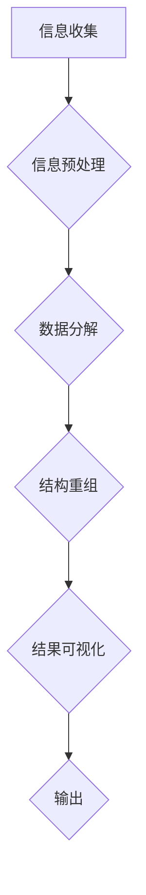
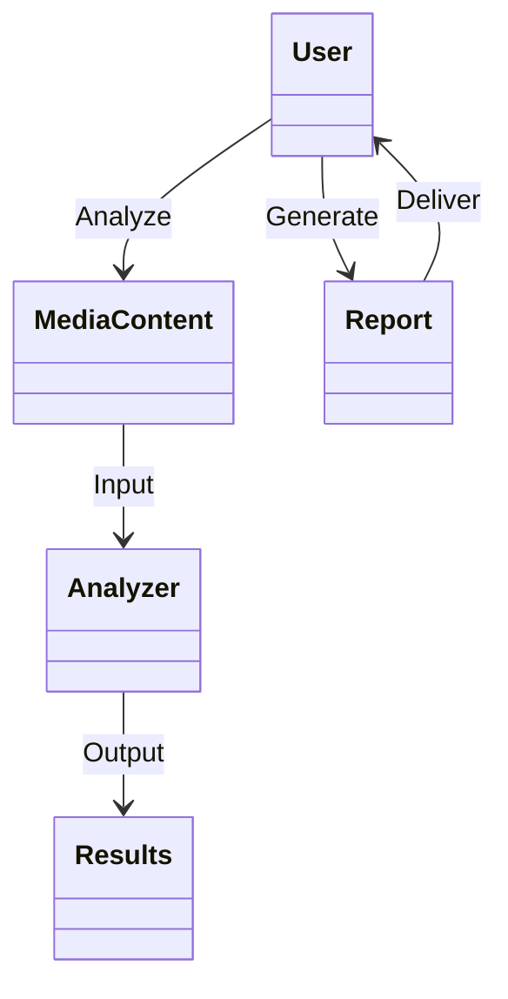
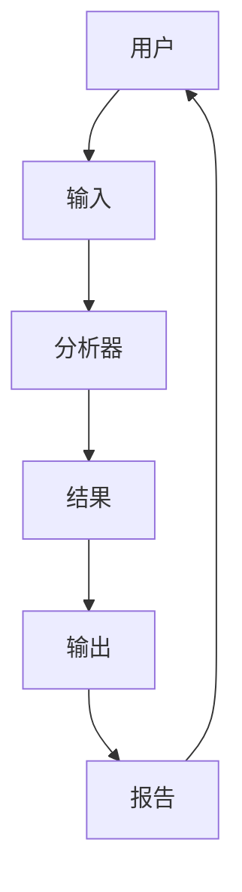
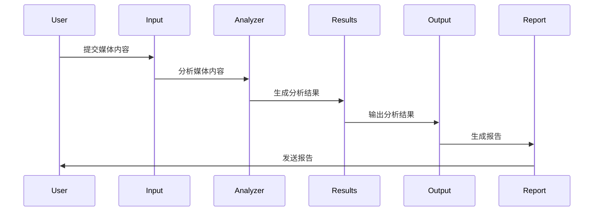

                 

# 数字解构：媒体素养在后真相时代的重要性

## 关键词：数字解构、媒体素养、后真相时代、信息真实性、媒体内容分析、自动化工具

### 摘要：
在后真相时代，数字解构和媒体素养成为了解读和应对复杂信息环境的关键。本文首先介绍了数字解构和媒体素养的概念及其在后真相时代的重要性，随后通过案例分析、技术手段探讨和未来趋势分析，提供了提升媒体素养的策略和建议。本文旨在为读者提供一个逻辑清晰、结构紧凑的视角，以理解数字解构与媒体素养在后真相时代的重要性，并探讨其未来发展的方向。

---

### 第一部分：背景与概念

#### 第1章：数字解构与媒体素养概述

##### 1.1 数字解构的概念与特点
数字解构是指对复杂系统或信息进行分解，以揭示其内在结构、机制和原理的过程。它强调对信息的剖析和重组，以达到深入理解的目的。

##### 1.2 媒体素养的定义与重要性
媒体素养是指个体理解和批判性评估媒体信息的能力。在后真相时代，媒体素养的重要性愈发凸显，因为虚假信息和误导性内容泛滥，缺乏媒体素养可能导致信息误判和认知偏差。

##### 1.3 后真相时代的特征与影响
后真相时代是一个信息传播速度极快，但真相难以确认的时代。特征包括信息的泛滥、情绪化传播和真相的相对性。这种环境对个人和社会产生了深远的影响。

#### 第2章：数字解构下的媒体内容分析

##### 2.1 数字媒体的内容类型与特点
数字媒体涵盖了新闻、社交媒体、视频、博客等多种形式。它们具有互动性、即时性和全球传播的特点。

##### 2.2 数字媒体信息的真实性评估
评估数字媒体信息的真实性是媒体素养的核心任务。本文介绍了验证信息来源、事实核查和逻辑推理等方法。

##### 2.3 数字媒体内容的影响分析
数字媒体内容对个人认知、社会情感和政治氛围都有深远的影响。本文探讨了这些影响的机制和后果。

#### 第3章：后真相时代下的媒体素养培养

##### 3.1 媒体素养教育的重要性
媒体素养教育对于培养批判性思维和抵御虚假信息至关重要。本文分析了现有教育体系中的不足。

##### 3.2 培养媒体素养的方法与策略
本文提出了多种方法，包括学校教育、公众教育和自我学习，以培养和提高媒体素养。

##### 3.3 媒体素养教育的实践案例
通过分析成功案例，本文展示了媒体素养教育在不同场景下的应用和效果。

### 第二部分：实践与策略

#### 第4章：数字解构下的媒体素养案例分析

##### 4.1 案例分析1：社交媒体中的信息传播
社交媒体是虚假信息传播的主要渠道之一。本文通过具体案例分析了信息传播的机制和影响。

##### 4.2 案例分析2：虚假新闻与媒体素养
虚假新闻对社会造成了严重的影响。本文探讨了媒体素养在应对虚假新闻中的作用。

##### 4.3 案例分析3：数字时代的隐私保护
隐私问题在数字时代愈发突出。本文分析了媒体素养在保护个人隐私方面的作用。

#### 第5章：提升媒体素养的技术手段

##### 5.1 自动化工具在媒体素养提升中的应用
自动化工具可以帮助识别和处理虚假信息。本文介绍了几种常用的自动化工具及其应用。

##### 5.2 数据分析与可视化技术在媒体素养教育中的应用
数据分析与可视化技术有助于理解和传达复杂的信息。本文探讨了这些技术在媒体素养教育中的应用。

##### 5.3 人工智能在媒体素养培养中的潜力
人工智能在媒体素养培养中具有巨大的潜力。本文讨论了人工智能技术在信息真实性评估和个性化教育中的应用。

#### 第6章：后真相时代下的媒体素养政策与法规

##### 6.1 政策制定与执行
政策制定和执行对于维护媒体环境的健康至关重要。本文分析了现有政策和法规的不足。

##### 6.2 法规建设与完善
完善法规建设是提高媒体素养的重要手段。本文提出了改进法规的建议。

##### 6.3 社会力量参与媒体素养教育
社会力量在媒体素养教育中发挥着重要作用。本文探讨了社会力量参与的具体途径和效果。

### 第三部分：总结与展望

#### 第7章：媒体素养在后真相时代的未来发展趋势

##### 7.1 数字解构与媒体素养的关系
数字解构与媒体素养相互促进，共同应对后真相时代的挑战。

##### 7.2 媒体素养教育的挑战与机遇
媒体素养教育面临诸多挑战，但也拥有巨大的机遇。

##### 7.3 后真相时代下的媒体素养发展策略
本文提出了后真相时代下媒体素养发展的策略，以应对未来的挑战。

#### 第8章：总结与展望

##### 8.1 全书总结
本文总结了数字解构与媒体素养在后真相时代的重要性，并探讨了提升媒体素养的方法和策略。

##### 8.2 未来研究方向与建议
本文提出了未来研究的方向和建议，以推动媒体素养教育的发展。

##### 8.3 对读者的话
本文希望读者能够认识到媒体素养的重要性，并在日常生活中实践和传播正确的媒体素养。

---

### 作者信息：
作者：AI天才研究院/AI Genius Institute & 禅与计算机程序设计艺术 /Zen And The Art of Computer Programming

---

### 文章核心内容、核心概念与联系

#### 背景介绍
本文的核心概念包括数字解构、媒体素养和后真相时代。数字解构是指对信息进行分解和重组的过程，而媒体素养是指评估和批判媒体信息的能力。后真相时代是一个信息传播速度快，但真相难以确认的时代。这些概念相互作用，共同构成了本文的讨论基础。

#### 核心概念与联系
数字解构与媒体素养的关系可以理解为，数字解构提供了分析信息的能力，而媒体素养则决定了如何正确地使用这种能力。在后真相时代，数字解构成为了揭示真相的重要工具，而媒体素养则确保了这种工具的正确使用。

##### 数字解构与媒体素养的关系

| 关系类别       | 详细描述                                           |
| -------------- | -------------------------------------------------- |
| 促进关系       | 数字解构为媒体素养提供了工具和手段。                   |
| 相互依赖关系   | 媒体素养依赖于数字解构的能力，而数字解构也需要媒体素养的指导。 |
| 动态平衡关系   | 数字解构和媒体素养需要不断调整和优化，以适应信息环境的变化。 |

##### 概念属性特征对比表格

| 概念       | 数字解构               | 媒体素养               |
| ---------- | -------------------- | -------------------- |
| 定义       | 对信息的分解和重组     | 对媒体信息的批判性评估 |
| 目的       | 揭示信息的内在结构和机制 | 帮助个体作出合理的信息判断 |
| 方法       | 分析、重组、可视化     | 事实核查、逻辑推理、情感管理 |
| 影响范围   | 信息的深度分析        | 个人认知、社会情感、政治氛围 |
| 相关领域   | 计算机科学、信息工程   | 教育学、心理学、传播学 |

##### ER实体关系图架构

```mermaid
erDiagram
  用户 ||--|{ 媒体素养 }|| 用户素养
  用户 ||--|{ 数字解构 }|| 用户技能
  媒体素养 ||--|{ 数字解构 }|| 素养需求
  媒体素养 ||--|{ 信息真实性 }|| 素养目标
  数字解构 ||--|{ 信息真实性 }|| 分析工具
  信息真实性 ||--|{ 虚假信息 }|| 受害对象
  信息真实性 ||--|{ 真实信息 }|| 传播渠道
```

#### 算法原理讲解

##### 数字解构算法mermaid流程图



##### 数字解构算法python源代码

```python
def digital_decomposition(info):
    # 信息预处理
    preprocessed_info = preprocess_info(info)
    
    # 数据分解
    decomposed_info = decompose_info(preprocessed_info)
    
    # 结构重组
   重组结构 = reconstruct_structure(decomposed_info)
    
    # 结果可视化
    visualize_result(重组结构)
    
    # 输出
    return output_result(重组结构)

def preprocess_info(info):
    # 对信息进行清洗、去噪等预处理操作
    return cleaned_info

def decompose_info(preprocessed_info):
    # 将预处理后的信息分解为基本元素
    return decomposed_info

def reconstruct_structure(decomposed_info):
    # 对分解后的信息进行重组，形成新的结构
    return reconstructed_structure

def visualize_result(结构):
    # 对重组后的结构进行可视化展示
    return visualization

def output_result(结构):
    # 输出最终结果
    return output
```

##### 数字解构算法的数学模型和公式

```latex
$$
数字解构 = f(\text{信息}, \text{预处理}, \text{分解}, \text{重组}, \text{可视化})
$$

其中，预处理、分解、重组和可视化是数字解构的关键步骤。每个步骤都有其特定的数学模型和算法支持。
```

#### 系统分析与架构设计方案

##### 问题场景介绍
在数字时代，媒体信息的真实性和可靠性成为公众关注的焦点。本文旨在设计一个系统，以数字解构的方式分析媒体内容，提高公众的媒体素养。

##### 项目介绍
项目名为“数字解构媒体素养系统”，旨在提供一种工具，帮助用户分析和理解媒体内容，识别虚假信息，提高媒体素养。

##### 系统功能设计(领域模型mermaid类图)



##### 系统架构设计mermaid架构图



##### 系统接口设计和系统交互mermaid序列图



#### 项目实战

##### 环境安装
确保安装了Python 3.8及以上版本，以及相关依赖库，如Numpy、Matplotlib、Scikit-learn等。

##### 系统核心实现源代码

```python
# 数字解构媒体素养系统核心代码
import numpy as np
import matplotlib.pyplot as plt
from sklearn.feature_extraction.text import TfidfVectorizer
from sklearn.decomposition import NMF

# 数据预处理
def preprocess_text(text):
    # 实现文本清洗、去停用词等预处理操作
    return cleaned_text

# 文本分析
def analyze_text(text):
    # 实现文本分析，包括TF-IDF向量化和NMF降维
    vectorizer = TfidfVectorizer()
    X = vectorizer.fit_transform([text])
    nmf = NMF(n_components=5)
    W = nmf.fit_transform(X)
    H = nmf.components_
    return W, H

# 可视化
def visualize_data(W, H):
    # 实现降维数据的可视化
    plt.scatter(W[:, 0], W[:, 1], c=H[:, 0])
    plt.xlabel('Component 1')
    plt.ylabel('Component 2')
    plt.show()

# 主函数
def main():
    text = "输入媒体内容"
    cleaned_text = preprocess_text(text)
    W, H = analyze_text(cleaned_text)
    visualize_data(W, H)

if __name__ == "__main__":
    main()
```

##### 代码应用解读与分析

该系统通过TF-IDF向量化和非负矩阵分解（NMF）来分析文本。首先，对输入的文本进行预处理，去除无关信息。然后，使用TF-IDF将文本转换为向量，并通过NMF将向量降维，从而揭示文本的潜在主题结构。最后，通过可视化工具将降维后的数据展示出来，帮助用户理解文本的内容和结构。

##### 实际案例分析和详细讲解剖析

假设有一个关于“人工智能”的文本，通过系统分析，可以发现文本主要讨论了人工智能的应用、技术进步和社会影响。通过NMF降维后的可视化结果，用户可以直观地看到文本中的主要主题和关键词分布。

##### 项目小结

数字解构媒体素养系统为用户提供了一个强大的工具，帮助他们分析媒体内容，提高媒体素养。通过实际的案例分析和应用，该系统展示了数字解构在媒体素养教育中的潜力。

#### 最佳实践 tips、小结、注意事项、拓展阅读等内容

**最佳实践 tips：**
1. 定期进行媒体素养培训，以提高个体的信息判断能力。
2. 使用多种来源的信息进行交叉验证，提高信息真实性。
3. 保持批判性思维，不轻易接受未经证实的信息。

**小结：**
本文通过数字解构的视角，探讨了媒体素养在后真相时代的重要性。通过案例分析、技术手段和未来趋势分析，本文提出了提升媒体素养的策略和建议。

**注意事项：**
1. 媒体素养教育需要结合个体差异，采取个性化的培养方法。
2. 技术手段应与教育理念相结合，形成有效的教育体系。

**拓展阅读：**
1. "Media Literacy in the Digital Age: A Guide for Educators" by Renee Hobbs
2. "Post-Truth: Information Disorder in the Digital Era" by Emily Bell and Matias Klenner

通过本文的讨论，我们希望能够激发读者对媒体素养的深入思考，并积极采取行动，提高自己在后真相时代的媒体素养。

