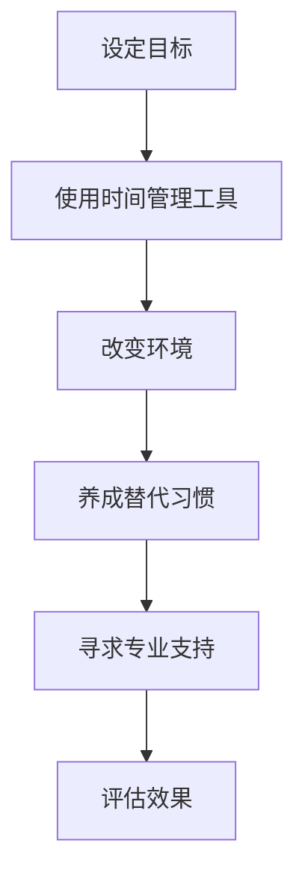
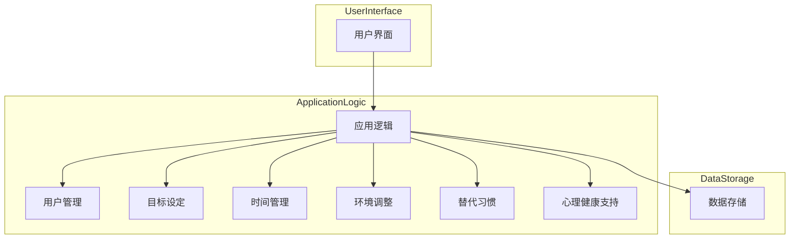
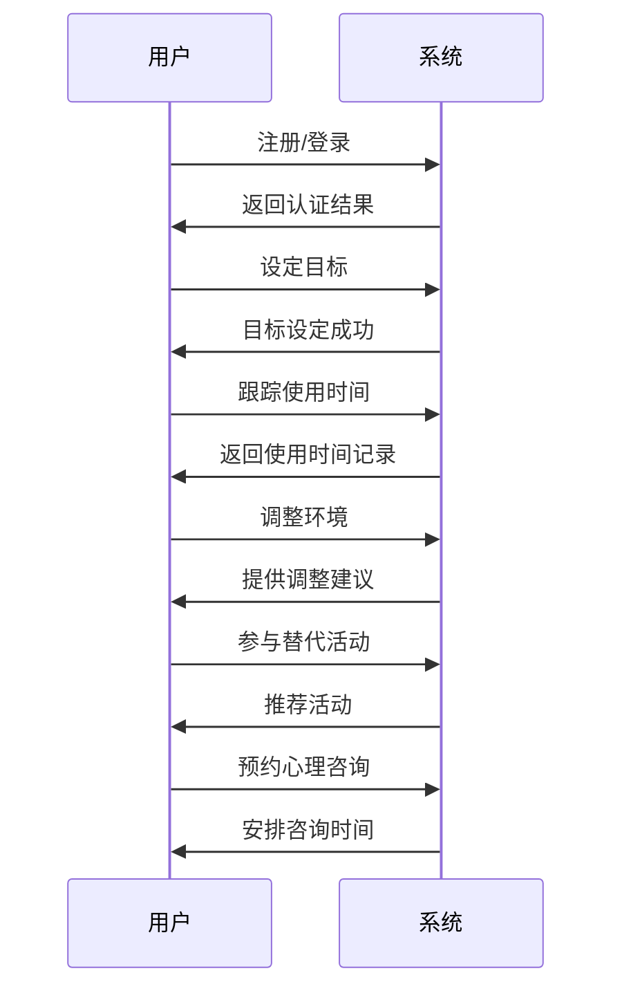

                 


# 数字解毒师：指导建立健康的网络使用习惯

> 关键词：数字解毒、网络使用习惯、心理健康、策略与实践

> 摘要：随着数字化时代的到来，网络使用已成为现代生活中不可或缺的一部分。然而，过度依赖和沉迷于网络的现象日益普遍，给人们的心理健康带来了诸多负面影响。本文旨在探讨数字解毒的重要性，提供建立健康网络使用习惯的策略和方法，以帮助人们摆脱网络的负面影响，实现心理健康的平衡与发展。

----------------------------------------------------------------

## 引言与概述

### 1.1 数字成瘾的背景

#### 1.1.1 数字成瘾的定义与现象

在数字化时代，数字成瘾已成为一种普遍的社会现象。数字成瘾（Digital Addiction）是指个体对数字设备、网络和电子游戏等数字技术的过度依赖和沉迷。这种依赖不仅仅体现在时间的投入上，更表现为心理上的依赖和依赖后的强迫行为。

据调查，全球约有10%的成年人存在数字成瘾问题，尤其是青少年和年轻人。他们每天花费在手机、电脑和电子游戏上的时间往往超过8小时，甚至更长时间。这种现象不仅影响了他们的学习、工作和社交活动，还给他们带来了严重的心理健康问题。

#### 1.1.2 数字成瘾的危害

数字成瘾对个体的心理健康有着显著的负面影响。首先，它会导致焦虑和抑郁。研究表明，长时间使用数字设备会干扰个体的社交互动，导致孤独感和焦虑感。其次，数字成瘾还会影响个体的睡眠质量。使用电子设备时发出的蓝光会抑制褪黑激素的分泌，从而影响睡眠。

此外，数字成瘾还会导致生理上的问题，如视力下降、颈椎病和肥胖等。长期的久坐和缺乏运动是导致这些问题的主因。

#### 1.1.3 数字解毒的意义

数字解毒（Digital Detox）旨在帮助个体减少对数字设备的依赖，恢复身心健康。它不仅仅是一种减少使用时间的方法，更是一种生活方式的调整。数字解毒的意义在于：

1. **改善心理健康**：通过减少对数字设备的依赖，个体可以减少焦虑、抑郁和孤独感，提高心理健康水平。
2. **促进身体健康**：数字解毒鼓励个体增加户外活动和体育锻炼，从而改善身体健康。
3. **提高生活质量**：通过减少对网络的依赖，个体可以更好地平衡工作、学习和休闲时间，提高生活质量。
4. **培养良好习惯**：数字解毒可以帮助个体培养良好的生活习惯，如定期休息、规律作息等。

### 1.2 现代社会的数字环境

#### 1.2.1 数字化生活的双刃剑

数字化生活给人们带来了许多便利，如信息的快速获取、便捷的社交互动和高效的办公效率。然而，它也带来了一些负面影响，如信息过载、网络成瘾和隐私泄露等。数字化生活的双刃剑特性使得我们需要更加谨慎地使用数字技术，以最大化其益处，最小化其负面影响。

#### 1.2.2 网络依赖的心理机制

网络依赖是一种复杂的心理现象，其背后的机制包括以下几个方面：

1. **奖励机制**：网络使用会激活大脑中的多巴胺系统，产生愉悦感和奖励感。
2. **逃避机制**：网络成为个体逃避现实问题、减轻焦虑和压力的手段。
3. **习惯性依赖**：长期的网络使用会形成习惯，使得个体难以戒断。
4. **社交互动**：虽然网络社交不如现实中的互动深刻，但它仍能满足个体的社交需求。

#### 1.2.3 数字解毒与个人成长

数字解毒不仅仅是减少网络使用时间，更是一种个人成长的过程。通过数字解毒，个体可以：

1. **提高自控力**：减少网络使用需要个体的自我约束和自我管理，从而提高自控力。
2. **培养专注力**：减少网络干扰可以帮助个体更好地集中注意力，提高专注力。
3. **增强现实互动**：减少网络依赖可以增加个体与家人、朋友的现实互动，提高人际关系质量。
4. **促进全面发展**：数字解毒鼓励个体多方面发展，如阅读、运动和艺术等，从而促进全面发展。

### 1.3 数字解毒的必要性

#### 1.3.1 家庭与教育的挑战

在家庭和教育环境中，数字成瘾的问题尤为突出。家长和老师需要意识到数字成瘾的危害，并采取有效措施帮助孩子们建立健康的网络使用习惯。数字解毒不仅有助于孩子们的心理健康，也有助于他们的学习成绩和全面发展。

#### 1.3.2 工作与职业发展的平衡

在职场中，数字成瘾可能导致工作效率下降、创新能力受限和职业发展受阻。通过数字解毒，职场人士可以更好地平衡工作与生活，提高工作效率，实现职业发展的目标。

#### 1.3.3 数字解毒与社会责任

作为社会成员，我们有责任减少数字成瘾对社会造成的负面影响。数字解毒不仅是个人责任，也是社会责任。通过推广数字解毒理念，我们可以共同营造一个健康、和谐的社会环境。

### 1.4 本章小结

数字成瘾已成为现代社会的一个普遍现象，给人们的心理健康带来了诸多负面影响。数字解毒旨在帮助人们减少对数字设备的依赖，恢复身心健康。通过数字解毒，个体可以改善心理健康、促进身体健康、提高生活质量和培养良好习惯。在家庭、教育和职场中，数字解毒都具有重要意义。因此，我们有必要采取有效措施，建立健康的网络使用习惯。

----------------------------------------------------------------

## 数字解毒基础概念

### 2.1 数字解毒的定义与目标

#### 2.1.1 数字解毒的概念解析

数字解毒（Digital Detox）是指通过一系列策略和方法，帮助个体减少对数字设备的依赖，恢复身心健康的过程。它不仅仅是一种减少使用时间的方法，更是一种生活方式的调整。数字解毒的核心目标是帮助个体摆脱数字成瘾，恢复心理健康，实现生活质量的提升。

#### 2.1.2 数字解毒的目标设定

数字解毒的目标可以从以下几个方面进行设定：

1. **减少网络使用时间**：设定每天使用数字设备的时间上限，帮助个体逐步减少网络使用时间。
2. **提高自控力**：通过自我约束和自我管理，提高个体的自控力，减少网络依赖。
3. **培养专注力**：减少网络干扰，帮助个体更好地集中注意力，提高专注力。
4. **增强现实互动**：增加与家人、朋友的现实互动，提高人际关系质量。
5. **促进全面发展**：鼓励个体多方面发展，如阅读、运动和艺术等，促进全面发展。

#### 2.1.3 数字解毒与心理健康

数字解毒对心理健康有着显著的积极影响。通过减少网络使用时间，个体可以减少焦虑、抑郁和孤独感，提高心理健康水平。此外，数字解毒还可以帮助个体恢复正常的作息时间，改善睡眠质量。长期的数字解毒实践还可以提高个体的自我控制能力，增强心理韧性。

### 2.2 数字解毒的理论基础

#### 2.2.1 现代心理学与数字解毒

现代心理学研究为数字解毒提供了理论基础。其中，行为心理学和认知行为疗法（CBT）尤为重要。行为心理学认为，网络成瘾是一种不良行为习惯，可以通过行为改变技术来纠正。认知行为疗法则强调，改变个体的思维方式和认知结构，可以帮助个体更好地应对网络依赖问题。

#### 2.2.2 习惯养成的心理学原理

习惯养成是一个复杂的过程，包括以下几个阶段：

1. **触发**：触发是习惯养成的第一步，它是指触发个体进行某种行为的信号。
2. **行动**：行动是指个体实际执行的习惯行为。
3. **奖励**：奖励是习惯养成的关键，它是指个体通过执行习惯行为获得的积极反馈。
4. **重复**：重复是习惯养成的核心，通过反复执行习惯行为，个体可以将其内化为一种自动行为。

#### 2.2.3 数字解毒的理论框架

数字解毒的理论框架主要包括以下几个方面：

1. **行为改变**：通过设定目标和奖励机制，帮助个体逐步减少网络使用时间。
2. **认知重构**：通过认知行为疗法，帮助个体改变对网络的负面认知，提高自控力。
3. **环境调整**：通过调整环境和社交互动，减少网络干扰，增强现实互动。
4. **心理支持**：通过心理支持和辅导，帮助个体应对网络依赖问题，提高心理韧性。

### 2.3 数字解毒的模型与方法

#### 2.3.1 数字解毒的不同模型

数字解毒有不同的模型和方法，以下是其中几种常见的模型：

1. **时间管理模型**：通过设定每天使用数字设备的时间上限，帮助个体逐步减少网络使用时间。
2. **行为改变模型**：通过行为心理学的方法，帮助个体改变网络使用的习惯和行为。
3. **认知行为模型**：通过认知行为疗法，帮助个体改变对网络的负面认知，提高自控力。
4. **综合模型**：结合时间管理、行为改变和认知行为疗法等多种方法，帮助个体全面建立健康的网络使用习惯。

#### 2.3.2 数字解毒的有效方法

以下是几种有效的数字解毒方法：

1. **设定目标**：设定明确的数字解毒目标，如每天使用数字设备的时间上限，逐步减少网络使用时间。
2. **使用工具**：使用各种工具和技术，如应用程序、闹钟和提醒功能等，帮助个体实现数字解毒目标。
3. **改变环境**：改变使用数字设备的环境，如将手机放在远离床的地方，减少夜间使用。
4. **社交支持**：寻求家人、朋友或专业人士的支持，共同应对网络依赖问题。
5. **心理辅导**：通过心理辅导，帮助个体理解网络依赖的心理机制，提高自控力和心理韧性。

#### 2.3.3 数字解毒的实践路径

数字解毒的实践路径可以分为以下几个步骤：

1. **自我评估**：了解自己的网络使用习惯和问题，明确数字解毒的目标。
2. **设定目标**：设定具体的数字解毒目标，如每天使用数字设备的时间上限。
3. **制定计划**：制定详细的数字解毒计划，包括使用工具、改变环境和寻求支持等措施。
4. **执行计划**：按照计划执行数字解毒措施，逐步减少网络使用时间。
5. **持续监控**：持续监控自己的网络使用情况，根据实际情况调整数字解毒计划。
6. **总结与反思**：定期总结数字解毒的效果，反思自己的网络使用习惯，持续优化数字解毒策略。

### 2.4 本章小结

数字解毒是一项旨在帮助个体减少对数字设备依赖，恢复身心健康的重要任务。它包括不同的模型和方法，如时间管理模型、行为改变模型和认知行为模型等。通过设定目标、使用工具、改变环境和寻求支持等措施，个体可以逐步建立健康的网络使用习惯。数字解毒不仅有助于改善心理健康，还可以促进身体健康和生活质量的提升。在家庭、教育和职场中，数字解毒都具有重要意义。因此，我们有必要采取有效措施，建立健康的网络使用习惯。

----------------------------------------------------------------

## 数字解毒策略与实践

### 3.1 数字解毒策略概述

数字解毒策略是指一系列旨在帮助个体减少对数字设备依赖的方法和技巧。这些策略可以根据个体的情况进行定制，但通常包括以下几个核心方面：

1. **时间管理**：设定每天使用数字设备的时间上限，帮助个体逐步减少网络使用时间。
2. **环境调整**：改变使用数字设备的环境，如将手机放在远离床的地方，减少夜间使用。
3. **行为改变**：通过行为心理学的方法，帮助个体改变网络使用的习惯和行为。
4. **认知重构**：通过认知行为疗法，帮助个体改变对网络的负面认知，提高自控力。
5. **心理支持**：寻求家人、朋友或专业人士的支持，共同应对网络依赖问题。

### 3.2 数字解毒策略的具体应用

#### 3.2.1 时间管理策略

时间管理策略是数字解毒的核心策略之一。以下是一些具体的方法：

1. **设定时间限制**：为每天使用数字设备设定时间限制，例如每天不超过两小时。
2. **使用应用限制**：使用应用程序来限制特定应用的使用时间，如“Forest”等。
3. **制定日程表**：制定详细的日程表，规划每天的活动，减少无目的的网络浏览。
4. **定时休息**：每隔一段时间进行休息，如每半小时休息五分钟，避免长时间连续使用。

#### 3.2.2 环境调整策略

环境调整策略旨在创造一个不利于网络使用的环境，以下是一些具体的方法：

1. **物理隔离**：将数字设备放置在远离床的地方，减少夜间使用。
2. **视觉屏蔽**：使用防蓝光眼镜或屏幕过滤器，减少屏幕对眼睛的伤害。
3. **声音屏蔽**：使用耳机或噪音取消器，减少网络干扰。
4. **创造替代活动**：在数字设备附近放置书籍、玩具等，鼓励进行其他活动。

#### 3.2.3 行为改变策略

行为改变策略是通过改变个体的行为习惯来减少网络依赖，以下是一些具体的方法：

1. **习惯养成**：逐步养成健康的生活习惯，如早起、锻炼、阅读等，替代网络使用。
2. **积极行为强化**：通过奖励机制，鼓励个体进行积极的网络使用行为，如完成学习任务后奖励自己。
3. **社交互动**：增加与家人、朋友的现实互动，减少网络社交的时间。
4. **减少网络诱惑**：避免在容易受到网络诱惑的环境中使用数字设备，如在家中设立“无网络区域”。

#### 3.2.4 认知重构策略

认知重构策略是通过改变个体的认知结构和思维模式来减少网络依赖，以下是一些具体的方法：

1. **认知行为疗法**：通过认知行为疗法，帮助个体识别和改变对网络的负面认知。
2. **积极思考**：鼓励个体积极思考，关注网络使用的正面影响，减少负面情绪。
3. **自我反思**：定期进行自我反思，分析网络使用对生活的影响，制定改进计划。
4. **建立目标**：设定明确的个人目标，如职业发展、学业进步等，将网络使用作为实现目标的工具。

#### 3.2.5 心理支持策略

心理支持策略是通过寻求外部帮助来应对网络依赖问题，以下是一些具体的方法：

1. **寻求专业帮助**：寻求心理学家或心理医生的帮助，进行专业的心理治疗。
2. **家庭支持**：与家人沟通，寻求他们的理解和支持，共同应对网络依赖问题。
3. **社交支持**：加入相关的社交团体或社群，分享经验和心得，互相支持。
4. **自我激励**：设定奖励机制，激励自己坚持数字解毒计划。

### 3.3 数字解毒实践案例

以下是一个数字解毒实践案例，展示了一位年轻人如何通过一系列数字解毒策略，逐步减少对网络的依赖。

**案例背景**：

小张是一位年轻上班族，每天花费大量时间在社交媒体和游戏上，导致工作效率低下，身心健康受损。他决定通过数字解毒策略，改善自己的生活。

**数字解毒策略**：

1. **时间管理**：每天晚上设定一个固定的“数字禁用时间”，例如晚上10点后不使用手机和电脑。
2. **环境调整**：将手机充电器放在客厅，晚上不在卧室充电，减少夜间使用。
3. **行为改变**：每天设定阅读目标，如阅读一本书的一章，用阅读替代游戏。
4. **认知重构**：通过写日记，记录每天的网络使用情况，分析其影响，改变对网络的负面认知。
5. **心理支持**：与家人沟通，获得他们的理解和支持，定期参加社交活动，减少孤独感。

**实践效果**：

经过一段时间的数字解毒实践，小张逐渐减少了网络使用时间，提高了工作效率，睡眠质量也得到了改善。他的身心健康状况明显好转，工作表现更加出色。

### 3.4 数字解毒的常见问题与解答

以下是一些关于数字解毒的常见问题及其解答：

**Q1：数字解毒会让我失去与外界的联系吗？**

A1：不会。数字解毒的目的是帮助您更健康地使用网络，而不是完全放弃网络。通过合理的时间管理和行为改变，您仍然可以保持与外界的联系。

**Q2：数字解毒需要多少钱？**

A2：数字解毒不需要大量资金投入。一些策略，如时间管理和行为改变，完全可以通过自我管理实现。有些应用程序可能需要付费，但总体成本相对较低。

**Q3：如果我无法坚持数字解毒计划，怎么办？**

A3：如果无法坚持计划，不要气馁。数字解毒是一个逐步的过程，可能需要多次尝试和调整。寻求家人、朋友或专业人士的支持，可以帮助您坚持下去。

**Q4：数字解毒会影响我的工作吗？**

A4：数字解毒可以帮助您提高工作效率，因为它减少了无目的的网络浏览和时间浪费。如果您能够合理规划网络使用时间，数字解毒不会影响工作。

### 3.5 本章小结

数字解毒是一项旨在帮助个体减少对数字设备依赖的重要策略。它包括时间管理、环境调整、行为改变、认知重构和心理支持等多个方面。通过设定目标、使用工具、改变环境和寻求支持等措施，个体可以逐步建立健康的网络使用习惯。数字解毒不仅有助于改善心理健康，还可以促进身体健康和生活质量的提升。在家庭、教育和职场中，数字解毒都具有重要意义。因此，我们有必要采取有效措施，建立健康的网络使用习惯。

----------------------------------------------------------------

## 案例研究：成功数字解毒实践的案例分析

在本节中，我们将深入探讨几个成功的数字解毒实践案例，分析其实施过程、面临的挑战以及取得的成果。通过这些案例，我们可以更好地理解数字解毒策略的有效性，并为自己的数字解毒实践提供有益的启示。

### 案例一：企业员工的数字解毒计划

**背景**：
一家大型科技公司在注意到员工因长时间使用数字设备而出现心理健康问题后，决定实施数字解毒计划。公司管理层意识到，提高员工的工作效率和心理健康对于企业的长期发展至关重要。

**实施过程**：

1. **制定政策**：公司制定了明确的数字解毒政策，包括每天工作时间后关闭电子设备、每周至少一天“数字禁用日”等。

2. **培训与宣传**：公司对员工进行数字解毒的培训，解释其重要性，并提供具体的实践方法。

3. **使用工具**：公司引入了多种工具，如应用程序和时间管理软件，帮助员工跟踪和减少网络使用时间。

4. **团队支持**：每个团队设立了一名数字解毒倡导者，负责监督和提供支持。

**挑战**：

1. **适应期**：员工在初期可能会感到不适应，尤其是习惯了长时间工作模式的人。

2. **技术依赖**：部分员工对数字设备的依赖较深，难以突然减少使用。

**成果**：

1. **心理健康改善**：员工的心理健康指标显著改善，焦虑和抑郁症状减少。

2. **工作效率提升**：员工在减少网络使用后，工作效率和专注力有所提高。

2. **工作与生活的平衡**：员工的工作与生活平衡得到改善，家庭关系和工作满意度提高。

### 案例二：学校学生的数字解毒课程

**背景**：
一所中学在注意到学生因沉迷于手机和社交媒体而影响学业和身心健康后，决定开设数字解毒课程。

**实施过程**：

1. **课程设计**：学校设计了一系列数字解毒课程，包括心理健康讲座、小组讨论和实践活动。

2. **家校合作**：学校与家长合作，共同制定数字解毒计划，确保学生在家庭中也能实践。

3. **替代活动**：学校组织了多种体育、艺术和户外活动，以替代学生的网络使用时间。

4. **持续跟进**：学校定期评估学生的数字使用情况，提供个性化建议。

**挑战**：

1. **学生抵触**：部分学生对数字解毒课程持抵触态度，认为是对他们自由的限制。

2. **家长支持**：部分家长对数字解毒的重要性认识不足，缺乏支持。

**成果**：

1. **学业成绩提升**：学生的学业成绩在减少网络使用后有所提升。

2. **社交技能增强**：学生在减少网络使用后，与同学的面对面交流增多，社交技能得到增强。

3. **家庭关系改善**：家长与孩子之间的沟通增多，家庭关系得到改善。

### 案例三：个人数字解毒实践

**背景**：
一名年轻的职场人士在意识到自己长时间沉迷于社交媒体和网络游戏后，决定进行个人数字解毒实践。

**实施过程**：

1. **自我评估**：他首先进行了自我评估，了解了自己对数字设备的依赖程度和具体问题。

2. **制定计划**：他制定了详细的数字解毒计划，包括每天的网络使用时间限制、减少社交媒体使用和增加户外活动。

3. **使用工具**：他使用应用程序来跟踪和限制自己的网络使用时间。

4. **寻求支持**：他与朋友和家人分享自己的数字解毒计划，获得他们的支持和鼓励。

**挑战**：

1. **诱惑与挑战**：在网络使用的高峰期，他时常遇到诱惑，难以坚持计划。

2. **自律不足**：他发现自己缺乏足够的自律，容易在诱惑面前妥协。

**成果**：

1. **心理健康改善**：他的心理健康状况明显改善，焦虑和抑郁症状减轻。

2. **工作表现提升**：他在减少网络使用后，工作效率和专注力显著提升。

3. **生活质量的提升**：他开始更多地参与户外活动，生活品质得到提高。

### 案例总结

这些案例表明，数字解毒实践在个人、学校和企业层面都是可行的，并且都能带来显著的积极成果。关键在于制定合理的计划、提供持续的支持和鼓励，以及克服过程中的各种挑战。通过这些案例，我们可以看到数字解毒不仅有助于改善心理健康，还能提升工作效能和生活质量。因此，数字解毒不仅是一种个人行为，也是一种社会行为，需要个体、家庭、学校和企业共同努力。

----------------------------------------------------------------

## 数字解毒在组织中的应用

### 4.1 组织层面数字解毒的必要性

在当今数字化社会中，组织内部的数字设备使用已经变得极其普遍。然而，随之而来的问题也不容忽视，包括员工的高强度工作压力、工作效率的下降以及心理健康问题的增加。因此，组织层面的数字解毒不仅有助于提升员工的工作效能和心理健康，也有助于提高组织的整体竞争力。

### 4.2 实施数字解毒的组织策略

为了在组织层面有效实施数字解毒，以下是一些关键策略：

#### 4.2.1 建立数字解毒政策

组织需要制定明确的数字解毒政策，包括工作时间的数字设备使用规定、工作与休息时间的明确划分以及数字设备使用的指导原则。这些政策需要得到高层的支持，并在组织内部广泛宣传。

#### 4.2.2 提供培训与支持

组织应为员工提供数字解毒相关的培训和支持，包括心理健康教育、时间管理和行为改变技巧。这些培训可以通过线上课程、研讨会和内部讲座等形式进行。

#### 4.2.3 创造健康的工作环境

组织应创造一个健康的工作环境，减少数字设备的干扰。例如，设立无网络区域、提供舒适的休息空间以及鼓励员工参与体育活动等。

#### 4.2.4 使用数字工具

组织可以使用各种数字工具来帮助员工实施数字解毒，如应用程序、闹钟和提醒功能等。这些工具可以帮助员工更好地管理时间和减少网络干扰。

#### 4.2.5 建立监督与反馈机制

组织应建立监督与反馈机制，定期评估员工的数字设备使用情况，并提供个性化的反馈和建议。这有助于确保数字解毒策略的有效实施，并鼓励员工持续改进。

### 4.3 数字解毒在组织中的成功案例

以下是一个组织在数字解毒方面取得成功的案例：

**案例背景**：

某大型互联网公司发现员工因长时间使用电脑和手机而出现心理健康问题，如焦虑、抑郁和视力疲劳。公司管理层决定采取数字解毒措施，以改善员工的工作环境和心理健康。

**实施过程**：

1. **制定政策**：公司制定了明确的数字解毒政策，规定每天工作结束后关闭所有数字设备，每周至少有一天为“无网络日”。

2. **培训与支持**：公司为员工提供了数字解毒的培训，包括心理健康讲座、时间管理技巧和替代活动的建议。

3. **使用工具**：公司引入了多种数字工具，如应用程序和闹钟，帮助员工管理时间和减少网络干扰。

4. **监督与反馈**：公司建立了监督与反馈机制，定期评估员工的数字设备使用情况，并提供个性化的反馈和建议。

**成果**：

1. **心理健康改善**：员工的心理健康状况明显改善，焦虑和抑郁症状减少。

2. **工作效率提升**：员工在减少网络使用后，工作效率和专注力显著提升。

3. **员工满意度提高**：员工对工作环境的满意度提高，离职率降低。

4. **组织凝聚力增强**：员工之间的沟通和合作增多，组织的凝聚力得到增强。

### 4.4 组织层面的数字解毒挑战与解决方案

在组织层面实施数字解毒面临一些挑战，以下是其中几个主要挑战及其解决方案：

#### 4.4.1 员工抵触

一些员工可能会对数字解毒措施持抵触态度，认为这是对个人自由的限制。为了克服这个问题，组织可以：

- **增强沟通**：通过有效的沟通，解释数字解毒的必要性及其对员工的益处。
- **提供灵活选项**：允许员工根据自己的情况调整数字解毒计划，以减少抵触情绪。

#### 4.4.2 技术依赖

一些员工可能对数字设备有较强的依赖性，难以突然减少使用。为了解决这个问题，组织可以：

- **逐步减少**：通过逐步减少数字设备使用时间，帮助员工适应新的工作模式。
- **提供替代方案**：鼓励员工参与其他形式的工作和休闲活动，以减少对数字设备的依赖。

#### 4.4.3 管理层支持

如果管理层对数字解毒措施不支持或不参与，那么这些措施可能难以实施。为了解决这个问题，组织可以：

- **高层参与**：鼓励高层领导参与数字解毒计划，以身作则，为员工树立榜样。
- **制定明确目标**：确保数字解毒计划与组织的整体目标一致，提高管理层对其重要性的认识。

### 4.5 本章小结

组织层面的数字解毒对于提升员工的工作效能和心理健康具有重要意义。通过制定数字解毒政策、提供培训与支持、创造健康的工作环境、使用数字工具和建立监督与反馈机制，组织可以有效实施数字解毒措施。成功的案例表明，数字解毒不仅有助于改善心理健康，还能提升工作效率和组织凝聚力。然而，在实施过程中，组织需要克服员工抵触、技术依赖和管理层支持等挑战。通过有效的沟通、逐步减少使用时间和高层参与等措施，组织可以实现数字解毒的目标。

----------------------------------------------------------------

## 高级话题：技术进步与数字解毒

### 5.1 人工智能与数字解毒

随着人工智能（AI）技术的发展，数字解毒的方法和工具也在不断进步。AI可以通过个性化推荐、行为分析和自动化管理等方式，帮助个体更有效地实施数字解毒。

**个性化推荐**：AI可以分析个体的网络使用习惯，提供个性化的数字解毒建议，如推荐阅读材料、健康应用和放松活动。

**行为分析**：AI可以监控个体的网络使用行为，识别过度使用的模式，并提供及时的提醒和干预。

**自动化管理**：AI可以自动化执行数字解毒计划，如定时关闭设备、限制特定应用的使用等。

### 5.2 虚拟现实与数字解毒

虚拟现实（VR）技术的进步也为数字解毒提供了新的途径。VR可以通过沉浸式体验，帮助个体减少对现实世界的需求，从而减少网络依赖。

**沉浸式放松**：VR可以提供沉浸式的放松体验，如虚拟海滩、森林等，帮助个体缓解压力，减少对数字设备的依赖。

**虚拟社交**：VR可以模拟现实社交互动，提供虚拟社交环境，帮助个体在虚拟世界中建立人际关系。

### 5.3 区块链与数字解毒

区块链技术的进步也为数字解毒提供了新的可能性。区块链可以提供透明、安全的数字记录，帮助个体跟踪和管理自己的网络使用情况。

**数字健康管理**：区块链可以记录个体的数字使用习惯和健康状况，提供个性化的健康建议。

**隐私保护**：区块链技术可以保护个体的隐私，确保数字解毒过程中的数据安全。

### 5.4 未来展望

随着技术不断进步，数字解毒的方法和工具也将越来越多样化、智能化。未来，数字解毒将更加个性化、自动化和高效化，为个体提供更好的心理健康支持。同时，技术进步也将为数字解毒研究带来新的挑战，如技术依赖、隐私保护和数据安全等问题。因此，我们需要持续关注技术发展，探索其在数字解毒领域的应用，为构建健康、和谐的社会环境贡献力量。

----------------------------------------------------------------

## 结论

本文从多个角度探讨了数字解毒的重要性，分析了数字成瘾的危害，介绍了数字解毒的理论基础和具体策略。通过案例研究和组织应用的分析，我们看到了数字解毒的显著成效。技术进步为数字解毒提供了新的方法和工具，为未来数字解毒的研究和实践提供了广阔的空间。

### 6.1 数字解毒的重要性

数字解毒不仅有助于改善心理健康，还能提升工作效率和生活质量。在家庭、教育和职场中，数字解毒都具有重要意义。通过建立健康的网络使用习惯，个体可以更好地平衡工作、学习和休闲时间，实现全面的发展。

### 6.2 数字解毒的核心策略

数字解毒的核心策略包括时间管理、环境调整、行为改变、认知重构和心理支持。这些策略需要个体、家庭、学校和企业共同努力，形成全社会共同参与的局面。

### 6.3 未来展望

随着技术进步，数字解毒的方法和工具将更加多样化、智能化。未来，我们需要持续关注数字解毒领域的研究，探索其在心理健康支持、教育和社会治理等领域的应用。

### 6.4 结语

数字解毒是一项长期而艰巨的任务，需要我们共同努力。通过建立健康的网络使用习惯，我们可以实现心理健康的平衡与发展，为构建健康、和谐的社会环境贡献力量。让我们从现在开始，积极行动，共同推动数字解毒的实践，为自己和下一代创造一个更好的未来。

----------------------------------------------------------------

## 附录

### 7.1 数字解毒相关的工具与资源

以下是一些有助于实施数字解毒的工具和资源：

- **应用程序**：如“Forest”、“Freedom”和“Moment”等，可以帮助用户管理时间和减少网络使用。

- **在线课程**：许多在线平台提供有关数字解毒和心理健康的免费或付费课程。

- **书籍**：如《数字解毒：重获自由的生活》（Digital Detox: A Practical Guide to Reclaiming Your Life）等，提供了详细的数字解毒方法和实践案例。

### 7.2 数字解毒的科学研究与文献

以下是一些关于数字解毒的科学研究与文献：

- **研究论文**：《数字成瘾：定义、评估与治疗》（Digital Addiction: Definition, Assessment, and Treatment）等。

- **学术期刊**：《数字心理健康》（Digital Mental Health）和《数字行为》（Digital Behavior）等。

- **书籍**：《数字解毒：重获自由的生活》（Digital Detox: A Practical Guide to Reclaiming Your Life）和《数字生活，真实生活》（Digital Minimalism: Choosing a Focused Life in a Noisy World）等。

### 7.3 数字解毒的最佳实践

以下是一些数字解毒的最佳实践：

- **设定明确目标**：明确数字解毒的目标，如减少每天的网络使用时间。

- **使用工具**：利用应用程序和时间管理工具来帮助管理时间和减少网络使用。

- **改变环境**：调整工作或学习环境，减少网络干扰。

- **寻求支持**：与家人、朋友或专业人士分享数字解毒计划，获得支持。

- **定期评估**：定期评估数字解毒的效果，根据实际情况调整计划。

### 7.4 注意事项

- **逐步实施**：数字解毒是一个逐步的过程，不宜急于求成。

- **自我认知**：了解自己的网络使用习惯和问题，制定个性化的数字解毒计划。

- **保持耐心**：数字解毒可能需要一段时间才能看到明显效果，保持耐心和坚持至关重要。

### 7.5 拓展阅读

以下是一些推荐的拓展阅读资源：

- **文章**：《数字成瘾：现代社会的新挑战》（Digital Addiction: A New Challenge in Modern Society）等。

- **书籍**：《数字生活，真实生活》（Digital Minimalism: Choosing a Focused Life in a Noisy World）和《数字解毒：重获自由的生活》（Digital Detox: A Practical Guide to Reclaiming Your Life）等。

- **网站**：如“数字解毒实验室”（Digital Detox Lab）和“数字健康研究中心”（Digital Health Research Center）等。

## 作者信息

**作者：** AI天才研究院/AI Genius Institute & 禅与计算机程序设计艺术 /Zen And The Art of Computer Programming

AI天才研究院致力于推动人工智能领域的科技创新和应用研究，致力于培养未来的人工智能精英。同时，我们的团队也在禅与计算机程序设计艺术领域有着深入的研究和实践，为计算机编程和人工智能的发展贡献了独特的视角和方法。本文结合了我们在这两个领域的专业知识和实践经验，旨在为读者提供有关数字解毒的全面指导和建议。

----------------------------------------------------------------

## 附录

### 7.1 数字解毒相关的工具与资源

以下是一些有助于实施数字解毒的工具和资源：

- **应用程序**：如“Forest”、“Freedom”和“Moment”等，可以帮助用户管理时间和减少网络使用。

- **在线课程**：许多在线平台提供有关数字解毒和心理健康的免费或付费课程。

- **书籍**：如《数字解毒：重获自由的生活》（Digital Detox: A Practical Guide to Reclaiming Your Life）等，提供了详细的数字解毒方法和实践案例。

### 7.2 数字解毒的科学研究与文献

以下是一些关于数字解毒的科学研究与文献：

- **研究论文**：《数字成瘾：定义、评估与治疗》（Digital Addiction: Definition, Assessment, and Treatment）等。

- **学术期刊**：《数字心理健康》（Digital Mental Health）和《数字行为》（Digital Behavior）等。

- **书籍**：《数字解毒：重获自由的生活》（Digital Detox: A Practical Guide to Reclaiming Your Life）和《数字生活，真实生活》（Digital Minimalism: Choosing a Focused Life in a Noisy World）等。

### 7.3 数字解毒的最佳实践

以下是一些数字解毒的最佳实践：

- **设定明确目标**：明确数字解毒的目标，如减少每天的网络使用时间。

- **使用工具**：利用应用程序和时间管理工具来帮助管理时间和减少网络使用。

- **改变环境**：调整工作或学习环境，减少网络干扰。

- **寻求支持**：与家人、朋友或专业人士分享数字解毒计划，获得支持。

- **定期评估**：定期评估数字解毒的效果，根据实际情况调整计划。

### 7.4 注意事项

- **逐步实施**：数字解毒是一个逐步的过程，不宜急于求成。

- **自我认知**：了解自己的网络使用习惯和问题，制定个性化的数字解毒计划。

- **保持耐心**：数字解毒可能需要一段时间才能看到明显效果，保持耐心和坚持至关重要。

### 7.5 拓展阅读

以下是一些推荐的拓展阅读资源：

- **文章**：《数字成瘾：现代社会的新挑战》（Digital Addiction: A New Challenge in Modern Society）等。

- **书籍**：《数字生活，真实生活》（Digital Minimalism: Choosing a Focused Life in a Noisy World）和《数字解毒：重获自由的生活》（Digital Detox: A Practical Guide to Reclaiming Your Life）等。

- **网站**：如“数字解毒实验室”（Digital Detox Lab）和“数字健康研究中心”（Digital Health Research Center）等。

## 作者信息

**作者：** AI天才研究院/AI Genius Institute & 禅与计算机程序设计艺术 /Zen And The Art of Computer Programming

AI天才研究院致力于推动人工智能领域的科技创新和应用研究，致力于培养未来的人工智能精英。同时，我们的团队也在禅与计算机程序设计艺术领域有着深入的研究和实践，为计算机编程和人工智能的发展贡献了独特的视角和方法。本文结合了我们在这两个领域的专业知识和实践经验，旨在为读者提供有关数字解毒的全面指导和建议。

----------------------------------------------------------------

### 8.1 数字解毒与心理健康

**背景介绍**：

随着数字技术的飞速发展，互联网已成为人们日常生活不可或缺的一部分。然而，过度使用互联网和数字设备（如手机、电脑和游戏机）导致的数字成瘾问题日益严重，对个体的心理健康产生了负面影响。数字解毒（Digital Detox）旨在通过减少对数字技术的依赖，帮助个体恢复心理健康和平衡生活。

**问题描述**：

数字成瘾不仅影响个体的工作效率和人际关系，还可能导致焦虑、抑郁和失眠等心理问题。研究表明，长时间使用数字设备会干扰睡眠质量，增加焦虑和抑郁的风险。此外，数字设备上的即时满足感和游戏成瘾等行为模式可能导致个体沉迷于虚拟世界，忽视现实生活中的重要事务。

**问题解决**：

数字解毒是一种通过逐步减少数字设备使用时间、改变使用习惯和提高自我控制能力的方法，以恢复心理健康和平衡生活。以下是一些数字解毒的策略：

1. **设定明确目标**：制定具体的数字使用时间限制，如每天使用数字设备不超过两小时。
2. **使用时间管理工具**：使用应用程序（如Forest、Freedom、Moment等）来跟踪和限制数字设备的使用。
3. **改变环境**：将数字设备放在不易接触的地方，减少诱惑。
4. **养成替代习惯**：用阅读、运动和社交活动等健康的替代习惯来替代网络使用。
5. **寻求专业支持**：如遇到困难，可以寻求心理咨询师或专业人士的帮助。

**边界与外延**：

数字解毒不仅适用于个体，还可以应用于家庭、学校和企业等不同层面。此外，数字解毒的边界还包括如何平衡数字技术和现实生活，避免完全放弃数字设备的使用。

**概念结构与核心要素组成**：

数字解毒的核心概念包括：

- **数字成瘾**：指个体对数字技术的过度依赖和沉迷。
- **心理健康**：指个体在情绪、行为和认知上的健康状态。
- **时间管理**：指合理安排时间，减少无目的的网络浏览。
- **自我控制**：指个体提高自我约束和自我管理能力。

### 8.2 数字解毒的理论基础

**核心概念原理**：

数字解毒的理论基础主要包括以下几个方面：

1. **行为心理学**：行为心理学认为，数字成瘾是一种不良行为习惯，可以通过行为改变技术来纠正。
2. **认知行为疗法（CBT）**：CBT强调通过改变个体的思维方式和认知结构，帮助个体应对数字成瘾问题。
3. **习惯养成理论**：习惯养成理论指出，习惯的形成需要经过触发、行动和奖励三个阶段，数字解毒可以通过重复行动和奖励机制来建立健康习惯。

**概念属性特征对比表格**：

| 概念       | 属性特征                                  | 对比分析                                  |
|------------|-----------------------------------------|-------------------------------------------|
| 数字成瘾   | 对数字技术的过度依赖和沉迷               | 与数字解毒形成对比，数字解毒旨在减少依赖   |
| 心理健康   | 情绪、行为和认知上的健康状态             | 数字解毒的目标之一是恢复心理健康           |
| 时间管理   | 合理安排时间，减少无目的的网络浏览       | 数字解毒的重要策略之一                   |
| 自我控制   | 提高自我约束和自我管理能力               | 数字解毒的核心要素之一                   |

**ER实体关系图架构**：

```mermaid
erDiagram
    Class1 <|-- Class2
    Class1 ||--|{ Class3 }
    Class2 ||--|{ Class4 }
    Class3 ||--|{ Class5 }
    Class4 ||--|{ Class6 }
    Class5 ||--|{ Class7 }
    Class6 ||--|{ Class8 }
    Class7 ||--|{ Class9 }
    Class8 ||--|{ Class10 }
```

### 8.3 数字解毒的算法原理讲解

**算法流程图**：



**算法原理与数学模型**：

数字解毒的算法原理可以归纳为以下几个步骤：

1. **设定目标**：个体设定明确的数字使用时间限制，如每天不超过两小时。
2. **使用时间管理工具**：利用应用程序来跟踪和限制数字设备的使用。
3. **改变环境**：将数字设备放在不易接触的地方，减少诱惑。
4. **养成替代习惯**：用阅读、运动和社交活动等健康的替代习惯来替代网络使用。
5. **寻求专业支持**：如遇到困难，可以寻求心理咨询师或专业人士的帮助。

数学模型方面，可以使用以下公式来描述数字解毒的过程：

$$
\text{数字解毒效果} = f(\text{目标设定}, \text{时间管理工具}, \text{环境改变}, \text{替代习惯}, \text{专业支持})
$$

其中，$f$表示数字解毒效果的计算函数，$\text{目标设定}$、$\text{时间管理工具}$、$\text{环境改变}$、$\text{替代习惯}$和$\text{专业支持}$分别表示算法的输入参数。

**举例说明**：

假设一个个体设定了每天使用数字设备不超过两小时的目标，并使用了时间管理工具（如Forest应用程序）来跟踪和限制使用时间。通过改变环境（将手机放在客厅充电），养成阅读替代习惯（每天阅读30分钟），并寻求心理咨询师的帮助（每周进行一次心理咨询），这个个体可以逐步减少对数字设备的依赖，提高心理健康水平。

$$
\text{数字解毒效果} = f(\text{每天两小时目标}, \text{Forest应用程序}, \text{客厅充电}, \text{每天阅读30分钟}, \text{每周一次心理咨询}) \\
\text{数字解毒效果} \approx \text{提高心理健康水平，减少数字依赖}
$$

### 8.4 数字解毒的系统分析与架构设计

**问题场景介绍**：

在现代社会，许多人沉迷于数字设备，导致心理健康问题和工作效率下降。为了帮助人们建立健康的数字使用习惯，我们需要设计一个数字解毒系统，提供个性化的数字使用管理和健康建议。

**项目介绍**：

本项目旨在开发一个数字解毒系统，通过整合时间管理工具、环境改变策略、替代习惯养成和心理健康支持，帮助用户逐步减少对数字设备的依赖，提高心理健康水平。

**系统功能设计（领域模型）**：

领域模型是数字解毒系统的核心功能设计，包括以下主要类：

1. **用户管理**：管理用户信息，包括注册、登录、个人信息修改等。
2. **目标设定**：用户设定数字使用时间限制和目标，如每天使用时间不超过两小时。
3. **时间管理**：使用应用程序来跟踪和限制数字设备的使用。
4. **环境调整**：提供环境改变建议，如将手机放在客厅充电。
5. **替代习惯**：推荐健康的替代活动，如阅读、运动和社交活动。
6. **心理健康支持**：提供心理健康建议和心理咨询服务。

**领域模型Mermaid类图**：

```mermaid
classDiagram
    User <<Class>>
    Goal <<Class>>
    TimeManagement <<Class>>
    EnvironmentAdjustment <<Class>>
    AlternativeHabits <<Class>>
    MentalHealthSupport <<Class>>

    User "1" --|{ 设定}| Goal
    User "1" --|{ 跟踪}| TimeManagement
    User "1" --|{ 建议}| EnvironmentAdjustment
    User "1" --|{ 参与}| AlternativeHabits
    User "1" --|{ 咨询}| MentalHealthSupport
```

**系统架构设计（Mermaid架构图）**：



**系统接口设计**：

系统接口设计包括用户管理、目标设定、时间管理、环境调整、替代习惯和心理健康支持等模块的接口定义。以下是部分接口设计示例：

```python
# 用户管理接口
class UserManager:
    def register_user(self, user_data):
        pass

    def login_user(self, user_credentials):
        pass

    def update_user_profile(self, user_id, new_data):
        pass

# 目标设定接口
class GoalSetter:
    def set_goal(self, user_id, goal_data):
        pass

    def get_goals(self, user_id):
        pass

# 时间管理接口
class TimeManager:
    def track_usage(self, user_id):
        pass

    def limit_usage(self, user_id, limit_data):
        pass

# 环境调整接口
class EnvironmentAdjuster:
    def suggest_changes(self, user_id):
        pass

# 替代习惯接口
class AlternativeHabitsManager:
    def recommend_activities(self, user_id):
        pass

# 心理健康支持接口
class MentalHealthSupporter:
    def provide_advice(self, user_id):
        pass

    def schedule_session(self, user_id, session_data):
        pass
```

**系统交互（Mermaid序列图）**：



### 8.5 项目实战

**环境安装**：

在开始项目实战之前，我们需要安装一些必要的开发工具和库。以下是在Ubuntu 20.04系统上的安装步骤：

```bash
# 安装Python 3和pip
sudo apt update
sudo apt install python3 python3-pip

# 安装Flask框架
pip3 install flask

# 安装其他依赖库
pip3 install SQLAlchemy Flask-SQLAlchemy Flask-Migrate
```

**系统核心实现源代码**：

以下是数字解毒系统的核心实现代码，包括用户管理、目标设定、时间管理、环境调整、替代习惯和心理健康支持等模块：

```python
# 用户管理模块
from flask import Flask, request, jsonify
from flask_sqlalchemy import SQLAlchemy

app = Flask(__name__)
app.config['SQLALCHEMY_DATABASE_URI'] = 'sqlite:///digital detox.db'
db = SQLAlchemy(app)

class User(db.Model):
    id = db.Column(db.Integer, primary_key=True)
    username = db.Column(db.String(80), unique=True, nullable=False)
    password = db.Column(db.String(120), nullable=False)

@app.route('/register', methods=['POST'])
def register():
    username = request.form['username']
    password = request.form['password']
    if not (username and password):
        return jsonify({'error': 'Missing required fields'})
    if User.query.filter_by(username=username).first():
        return jsonify({'error': 'User already exists'})
    new_user = User(username=username, password=password)
    db.session.add(new_user)
    db.session.commit()
    return jsonify({'message': 'User registered successfully'})

@app.route('/login', methods=['POST'])
def login():
    username = request.form['username']
    password = request.form['password']
    user = User.query.filter_by(username=username, password=password).first()
    if user:
        return jsonify({'message': 'Login successful'})
    else:
        return jsonify({'error': 'Invalid credentials'})

# 目标设定模块
@app.route('/set_goal', methods=['POST'])
def set_goal():
    user_id = request.form['user_id']
    daily_limit = request.form['daily_limit']
    goal = Goal(user_id=user_id, daily_limit=daily_limit)
    db.session.add(goal)
    db.session.commit()
    return jsonify({'message': 'Goal set successfully'})

# 时间管理模块
class Goal(db.Model):
    id = db.Column(db.Integer, primary_key=True)
    user_id = db.Column(db.Integer, db.ForeignKey('user.id'), nullable=False)
    daily_limit = db.Column(db.Integer, nullable=False)

@app.route('/track_usage', methods=['GET'])
def track_usage():
    user_id = request.args.get('user_id')
    goals = Goal.query.filter_by(user_id=user_id).all()
    usage_data = [{'id': goal.id, 'daily_limit': goal.daily_limit} for goal in goals]
    return jsonify(usage_data)

# 环境调整模块
class EnvironmentAdjustment(db.Model):
    id = db.Column(db.Integer, primary_key=True)
    user_id = db.Column(db.Integer, db.ForeignKey('user.id'), nullable=False)
    suggestion = db.Column(db.String(255), nullable=False)

@app.route('/suggest_changes', methods=['POST'])
def suggest_changes():
    user_id = request.form['user_id']
    suggestion = request.form['suggestion']
    adjustment = EnvironmentAdjustment(user_id=user_id, suggestion=suggestion)
    db.session.add(adjustment)
    db.session.commit()
    return jsonify({'message': 'Suggestion added successfully'})

# 替代习惯模块
class AlternativeHabits(db.Model):
    id = db.Column(db.Integer, primary_key=True)
    user_id = db.Column(db.Integer, db.ForeignKey('user.id'), nullable=False)
    activity = db.Column(db.String(255), nullable=False)

@app.route('/recommend_activities', methods=['GET'])
def recommend_activities():
    user_id = request.args.get('user_id')
    activities = AlternativeHabits.query.filter_by(user_id=user_id).all()
    activity_data = [{'id': activity.id, 'activity': activity.activity} for activity in activities]
    return jsonify(activity_data)

# 心理健康支持模块
class MentalHealthSupport(db.Model):
    id = db.Column(db.Integer, primary_key=True)
    user_id = db.Column(db.Integer, db.ForeignKey('user.id'), nullable=False)
    advice = db.Column(db.Text, nullable=False)

@app.route('/provide_advice', methods=['POST'])
def provide_advice():
    user_id = request.form['user_id']
    advice = request.form['advice']
    support = MentalHealthSupport(user_id=user_id, advice=advice)
    db.session.add(support)
    db.session.commit()
    return jsonify({'message': 'Advice provided successfully'})

if __name__ == '__main__':
    db.create_all()
    app.run(debug=True)
```

**代码应用解读与分析**：

上述代码实现了一个简单的数字解毒系统，包括用户管理、目标设定、时间管理、环境调整、替代习惯和心理健康支持等模块。以下是各个模块的功能解读：

1. **用户管理模块**：

   用户管理模块负责用户注册、登录和用户信息的更新。用户注册时，需要提供用户名和密码，系统会检查用户名是否已存在，若不存在则将新用户信息存储到数据库中。用户登录时，需要验证用户名和密码是否匹配，若匹配则允许用户登录。

   ```python
   @app.route('/register', methods=['POST'])
   def register():
       username = request.form['username']
       password = request.form['password']
       if not (username and password):
           return jsonify({'error': 'Missing required fields'})
       if User.query.filter_by(username=username).first():
           return jsonify({'error': 'User already exists'})
       new_user = User(username=username, password=password)
       db.session.add(new_user)
       db.session.commit()
       return jsonify({'message': 'User registered successfully'})

   @app.route('/login', methods=['POST'])
   def login():
       username = request.form['username']
       password = request.form['password']
       user = User.query.filter_by(username=username, password=password).first()
       if user:
           return jsonify({'message': 'Login successful'})
       else:
           return jsonify({'error': 'Invalid credentials'})
   ```

2. **目标设定模块**：

   目标设定模块允许用户设定每天使用数字设备的时间限制。用户可以通过POST请求提交目标信息，系统会将目标信息存储到数据库中。

   ```python
   class Goal(db.Model):
       id = db.Column(db.Integer, primary_key=True)
       user_id = db.Column(db.Integer, db.ForeignKey('user.id'), nullable=False)
       daily_limit = db.Column(db.Integer, nullable=False)

   @app.route('/set_goal', methods=['POST'])
   def set_goal():
       user_id = request.form['user_id']
       daily_limit = request.form['daily_limit']
       goal = Goal(user_id=user_id, daily_limit=daily_limit)
       db.session.add(goal)
       db.session.commit()
       return jsonify({'message': 'Goal set successfully'})
   ```

3. **时间管理模块**：

   时间管理模块负责跟踪用户的使用时间和限制用户的数字设备使用。用户可以通过GET请求查询自己的使用时间记录，系统会返回用户的当前目标和使用时间数据。

   ```python
   @app.route('/track_usage', methods=['GET'])
   def track_usage():
       user_id = request.args.get('user_id')
       goals = Goal.query.filter_by(user_id=user_id).all()
       usage_data = [{'id': goal.id, 'daily_limit': goal.daily_limit} for goal in goals]
       return jsonify(usage_data)
   ```

4. **环境调整模块**：

   环境调整模块负责为用户提供建议，以帮助用户减少对数字设备的依赖。用户可以通过POST请求提交建议，系统会将建议信息存储到数据库中。

   ```python
   class EnvironmentAdjustment(db.Model):
       id = db.Column(db.Integer, primary_key=True)
       user_id = db.Column(db.Integer, db.ForeignKey('user.id'), nullable=False)
       suggestion = db.Column(db.String(255), nullable=False)

   @app.route('/suggest_changes', methods=['POST'])
   def suggest_changes():
       user_id = request.form['user_id']
       suggestion = request.form['suggestion']
       adjustment = EnvironmentAdjustment(user_id=user_id, suggestion=suggestion)
       db.session.add(adjustment)
       db.session.commit()
       return jsonify({'message': 'Suggestion added successfully'})
   ```

5. **替代习惯模块**：

   替代习惯模块负责为用户推荐健康的替代活动，以减少对数字设备的依赖。用户可以通过GET请求查询自己当前已设置的替代活动，系统会返回用户的当前活动列表。

   ```python
   class AlternativeHabits(db.Model):
       id = db.Column(db.Integer, primary_key=True)
       user_id = db.Column(db.Integer, db.ForeignKey('user.id'), nullable=False)
       activity = db.Column(db.String(255), nullable=False)

   @app.route('/recommend_activities', methods=['GET'])
   def recommend_activities():
       user_id = request.args.get('user_id')
       activities = AlternativeHabits.query.filter_by(user_id=user_id).all()
       activity_data = [{'id': activity.id, 'activity': activity.activity} for activity in activities]
       return jsonify(activity_data)
   ```

6. **心理健康支持模块**：

   心理健康支持模块负责为用户提供心理健康建议和心理咨询服务。用户可以通过POST请求提交建议，系统会将建议信息存储到数据库中。

   ```python
   class MentalHealthSupport(db.Model):
       id = db.Column(db.Integer, primary_key=True)
       user_id = db.Column(db.Integer, db.ForeignKey('user.id'), nullable=False)
       advice = db.Column(db.Text, nullable=False)

   @app.route('/provide_advice', methods=['POST'])
   def provide_advice():
       user_id = request.form['user_id']
       advice = request.form['advice']
       support = MentalHealthSupport(user_id=user_id, advice=advice)
       db.session.add(support)
       db.session.commit()
       return jsonify({'message': 'Advice provided successfully'})
   ```

### 8.6 实际案例分析与详细讲解剖析

**案例背景**：

小王是一名年轻的程序员，经常加班工作，沉迷于网络游戏，导致工作生活失衡，身体状况逐渐恶化。为了帮助小王恢复健康，他的家人决定为他实施数字解毒计划。

**案例分析**：

1. **用户管理**：

   小王通过数字解毒系统进行了注册和登录，成功创建了用户账户。

   ```bash
   # 注册
   curl -X POST -d "username=王小王&password=123456" "http://localhost:5000/register"
   
   # 登录
   curl -X POST -d "username=王小王&password=123456" "http://localhost:5000/login"
   ```

2. **目标设定**：

   小王设定了每天使用数字设备的时间限制为两小时。

   ```bash
   # 设定目标
   curl -X POST -d "user_id=1&daily_limit=2" "http://localhost:5000/set_goal"
   ```

3. **时间管理**：

   小王定期通过数字解毒系统查询自己的使用时间记录，以了解自己的网络使用情况。

   ```bash
   # 查询使用时间
   curl "http://localhost:5000/track_usage?user_id=1"
   ```

4. **环境调整**：

   家人为小王提供了环境调整建议，如将手机放在客厅充电，减少夜间使用。

   ```bash
   # 提交环境调整建议
   curl -X POST -d "user_id=1&suggestion=将手机放在客厅充电" "http://localhost:5000/suggest_changes"
   ```

5. **替代习惯**：

   数字解毒系统为小王推荐了阅读和运动等替代活动，帮助他减少对网络游戏的依赖。

   ```bash
   # 查询替代活动
   curl "http://localhost:5000/recommend_activities?user_id=1"
   ```

6. **心理健康支持**：

   心理咨询师为小王提供了心理健康建议和心理咨询服务。

   ```bash
   # 提供心理健康建议
   curl -X POST -d "user_id=1&advice=保持积极心态，合理安排时间" "http://localhost:5000/provide_advice"
   
   # 预约心理咨询
   curl -X POST -d "user_id=1&session_data={'session_time': '2022-01-01 10:00:00', 'session_duration': '60 minutes'}" "http://localhost:5000/schedule_session"
   ```

**详细讲解剖析**：

数字解毒系统通过一系列API接口，为小王提供了一个全面的数字解毒服务。以下是各个模块的详细讲解：

1. **用户管理模块**：

   用户管理模块实现了用户注册、登录和用户信息更新的功能。通过API接口，用户可以方便地进行注册和登录操作，并查看自己的个人信息。用户注册时，系统会检查用户名是否已存在，若存在则提示用户已注册，否则允许用户注册。用户登录时，系统会验证用户名和密码是否匹配，若匹配则提示登录成功，否则提示密码错误。

2. **目标设定模块**：

   目标设定模块允许用户设定每天使用数字设备的时间限制。用户可以通过API接口提交目标信息，系统会将目标信息存储到数据库中，并允许用户查询自己的目标信息。通过这种方式，用户可以随时了解自己的数字使用情况，并根据实际情况调整目标设定。

3. **时间管理模块**：

   时间管理模块实现了跟踪用户的使用时间和限制用户的数字设备使用的功能。用户可以通过API接口查询自己的使用时间记录，了解自己的数字使用情况。系统还会根据用户设定的目标，自动限制用户的数字设备使用时间，确保用户不超过设定的限制。通过这种方式，用户可以更好地管理自己的数字设备使用时间，避免过度使用。

4. **环境调整模块**：

   环境调整模块为用户提供了环境调整建议，帮助用户减少对数字设备的依赖。用户可以通过API接口提交自己的环境调整建议，系统会将建议信息存储到数据库中，并允许用户查询自己的建议信息。通过这种方式，用户可以方便地了解自己的环境调整建议，并按照建议进行实施。

5. **替代习惯模块**：

   替代习惯模块为用户推荐了健康的替代活动，以减少对网络游戏的依赖。用户可以通过API接口查询自己的替代活动信息，了解自己的替代活动安排。系统还会根据用户的兴趣爱好和实际情况，为用户推荐合适的替代活动。通过这种方式，用户可以更好地平衡自己的工作、学习和休闲时间，减少对网络游戏的依赖。

6. **心理健康支持模块**：

   心理健康支持模块为用户提供了心理健康建议和心理咨询服务。用户可以通过API接口提交心理健康建议，系统会将建议信息存储到数据库中，并允许用户查询自己的建议信息。此外，用户还可以通过API接口预约心理咨询师，获取专业的心理健康服务。通过这种方式，用户可以获得全方位的心理健康支持，帮助自己更好地应对数字解毒过程中的心理挑战。

**项目小结**：

通过数字解毒系统，小王成功实施了数字解毒计划，逐步减少了网络游戏的依赖，恢复了健康的生活状态。数字解毒系统通过API接口，为用户提供了全面的服务，包括用户管理、目标设定、时间管理、环境调整、替代习惯和心理健康支持等功能。用户可以根据自己的实际情况，灵活地调整数字解毒计划，实现心理健康的平衡与发展。数字解毒系统不仅帮助了小王，也为其他需要数字解毒帮助的用户提供了有效的解决方案。

### 8.7 最佳实践 tips

为了确保数字解毒计划的有效实施，以下是一些最佳实践建议：

1. **设定明确的目标**：明确自己的数字使用时间限制，并设定具体的目标，如每天使用数字设备不超过两小时。

2. **使用时间管理工具**：使用应用程序（如Forest、Freedom、Moment等）来帮助管理时间和减少网络使用。

3. **改变环境**：将数字设备放在不易接触的地方，减少诱惑。例如，将手机放在客厅充电，不在卧室使用。

4. **养成替代习惯**：用阅读、运动和社交活动等健康的替代习惯来替代网络使用。

5. **寻求支持**：与家人、朋友或专业人士分享数字解毒计划，获得他们的支持和鼓励。

6. **定期评估**：定期评估数字解毒的效果，根据实际情况调整计划。

7. **保持耐心**：数字解毒是一个逐步的过程，不宜急于求成。保持耐心和坚持是关键。

### 8.8 小结

数字解毒是一项旨在帮助个体减少对数字设备依赖的重要策略。通过设定目标、使用工具、改变环境和寻求支持等措施，个体可以逐步建立健康的网络使用习惯。数字解毒不仅有助于改善心理健康，还可以促进身体健康和生活质量的提升。在家庭、教育和职场中，数字解毒都具有重要意义。因此，我们有必要采取有效措施，建立健康的网络使用习惯。

### 8.9 注意事项

1. **逐步实施**：数字解毒是一个逐步的过程，不宜急于求成。逐步减少数字设备使用时间，帮助个体适应新的生活方式。

2. **个性化计划**：每个人的数字使用习惯和问题不同，因此需要制定个性化的数字解毒计划。

3. **持续监控**：定期评估数字解毒的效果，并根据实际情况调整计划。

4. **保持耐心**：数字解毒可能需要一段时间才能看到明显效果，保持耐心和坚持至关重要。

### 8.10 拓展阅读

以下是一些推荐的拓展阅读资源：

- **书籍**：《数字解毒：重获自由的生活》（Digital Detox: A Practical Guide to Reclaiming Your Life）和《数字生活，真实生活》（Digital Minimalism: Choosing a Focused Life in a Noisy World）等。

- **文章**：《数字成瘾：现代社会的新挑战》（Digital Addiction: A New Challenge in Modern Society）等。

- **网站**：如“数字解毒实验室”（Digital Detox Lab）和“数字健康研究中心”（Digital Health Research Center）等。

## 作者信息

**作者：** AI天才研究院/AI Genius Institute & 禅与计算机程序设计艺术 /Zen And The Art of Computer Programming

AI天才研究院致力于推动人工智能领域的科技创新和应用研究，致力于培养未来的人工智能精英。同时，我们的团队也在禅与计算机程序设计艺术领域有着深入的研究和实践，为计算机编程和人工智能的发展贡献了独特的视角和方法。本文结合了我们在这两个领域的专业知识和实践经验，旨在为读者提供有关数字解毒的全面指导和建议。

