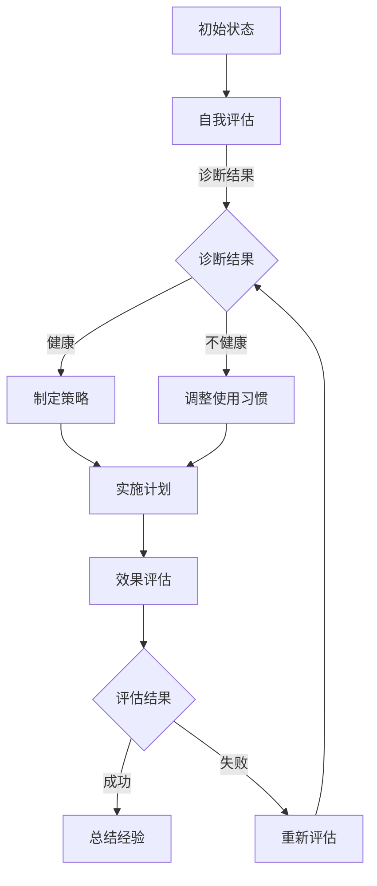
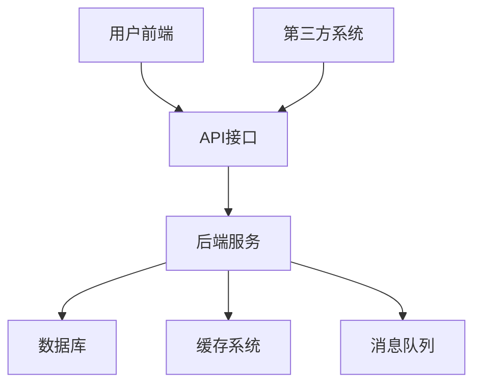
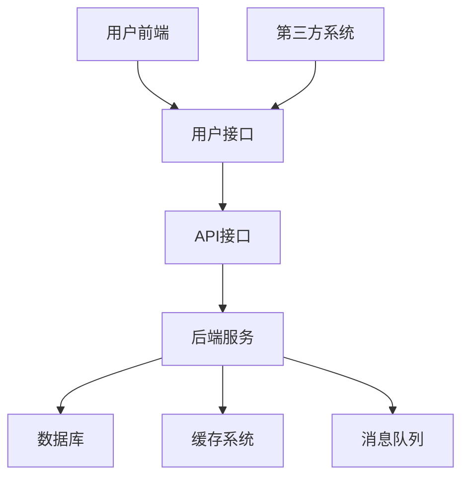

                 

## 引言

### 1.1 书籍目的与读者对象

在当今这个数字化时代，我们的日常生活和工作都离不开网络。然而，随着网络技术的飞速发展，人们面临着越来越多的数字健康问题。数字依赖、信息过载、隐私泄露等问题日益严重，影响着我们的身心健康。因此，我们编写《数字解毒师：指导重建健康网络关系》这本书，旨在帮助读者了解和应对数字时代带来的挑战。

本书的目标读者是那些对数字健康问题有深入了解并希望改善自身数字生活方式的IT专业人士、企业高管、普通用户以及关心家人和朋友数字健康的关心者。我们希望通过本书，帮助读者成为数字解毒师，学会识别和解决数字健康问题，重建健康网络关系。

### 1.2 数字时代的问题与挑战

数字时代给我们带来了许多便利，但也伴随着一系列问题。以下是数字时代的一些主要挑战：

1. **数字依赖**：人们过度依赖智能手机、互联网等数字设备，导致生活质量下降，工作和生活界限模糊。

2. **信息过载**：每天接收大量信息，但往往难以筛选和消化，导致焦虑和压力增加。

3. **隐私泄露**：个人信息在网络中被泄露的风险增加，给个人生活带来不便和风险。

4. **数字鸿沟**：数字技术和网络资源的不平等分布，导致社会分化加剧。

5. **网络犯罪**：网络诈骗、网络暴力等犯罪活动增加，危害个人和社会安全。

### 1.3 数字解毒师的使命

数字解毒师的使命是帮助人们识别和解决数字健康问题，重建健康网络关系。具体包括以下几个方面：

1. **诊断与评估**：通过分析用户的行为数据和网络使用习惯，诊断数字健康问题。

2. **制定策略**：根据诊断结果，为用户制定个性化的数字解毒策略。

3. **实施与监督**：指导用户实施数字解毒策略，并持续监督效果，确保重建健康网络关系。

4. **教育宣传**：普及数字健康知识，提高公众对数字健康问题的认识和意识。

通过数字解毒师的工作，我们可以帮助个人和企业更好地应对数字时代的挑战，实现数字健康与生活质量的双赢。

**摘要**：

《数字解毒师：指导重建健康网络关系》是一本面向IT专业人士、企业高管和普通用户的书籍，旨在帮助读者应对数字时代带来的健康问题。本书详细介绍了数字解毒师的使命和职责，包括诊断与评估、制定策略、实施与监督以及教育宣传等方面。通过本书，读者可以学会识别和解决数字健康问题，重建健康网络关系，提升生活质量。

----------------------------------------------------------------

## 数字解毒师基础知识

### 2.1 数字解毒的定义与重要性

**数字解毒**，顾名思义，是指在数字环境中对个人和组织进行的一种健康“排毒”过程，旨在减轻和消除由于过度使用数字设备和网络服务而产生的负面影响。数字解毒不仅关注个体的数字行为习惯，还涉及整体的网络使用策略，从而确保个体在网络空间中的健康和高效。

**重要性**：

1. **提升生活质量**：通过数字解毒，人们可以减少数字依赖，减少使用数字设备的时间，从而有更多的时间进行现实生活中的互动和活动，提高生活质量。

2. **增强心理健康**：数字解毒有助于缓解焦虑、压力和失眠等心理健康问题，使个体能够更放松和健康地使用数字工具。

3. **提高工作效率**：数字解毒可以减少信息过载，帮助用户更集中注意力，提高工作和学习效率。

4. **保护隐私和安全**：数字解毒可以减少个人信息泄露的风险，提高网络使用的安全性。

### 2.2 数字解毒的方法与步骤

数字解毒的方法和步骤可以根据具体情况进行调整，但通常包括以下几个关键环节：

1. **自我评估**：首先，用户需要对自己的数字行为进行自我评估，了解自己使用数字设备和网络服务的频率、习惯和方式。

2. **制定计划**：根据自我评估结果，制定一个具体的数字解毒计划，包括减少使用数字设备的时间、设定使用限制、优先处理重要事务等。

3. **实施计划**：开始实施制定的数字解毒计划，并持续监督效果。

4. **调整与优化**：根据实施过程中的反馈，不断调整和优化数字解毒计划，以达到最佳效果。

5. **持续教育**：数字解毒不仅是一个短期行为，更是一种长期的生活方式。用户需要不断学习和调整，以适应不断变化的数字环境。

### 2.3 数字解毒的边界与外延

**边界**：

数字解毒的边界在于如何平衡数字工具的使用与个人的健康和生活质量。它不仅仅关注个体，还包括家庭、学校、工作场所等更广泛的网络环境。

**外延**：

数字解毒的外延包括以下几个方面：

1. **数字素养教育**：提高公众的数字素养，使其能够更安全、更有效地使用数字工具。

2. **数字健康管理**：提供数字健康管理服务，帮助用户监控和管理数字设备使用情况。

3. **数字工作场所**：帮助企业和组织建立健康的数字工作环境，提高员工的工作效率和生活质量。

4. **数字健康政策**：制定和推广数字健康政策，从政策和法规层面推动数字解毒的普及和实施。

通过明确数字解毒的定义、方法和边界，我们可以更好地理解和应用这一概念，从而在数字时代中保持健康和高效。

**核心概念与联系**：

- **数字依赖**：指个体过度依赖数字设备和网络服务，导致生活质量下降。
- **信息过载**：指每天接收大量信息，但难以筛选和消化，导致焦虑和压力增加。
- **隐私泄露**：指个人信息在网络中被泄露的风险增加，给个人生活带来不便和风险。
- **数字鸿沟**：指数字技术和网络资源的不平等分布，导致社会分化加剧。

这些核心概念相互关联，构成了数字解毒的基础框架。通过数字解毒，我们可以识别和解决这些问题，从而重建健康网络关系。

### 2.4 数字解毒的概念结构与核心要素组成

**概念结构**：

数字解毒作为一个系统性的工程，其概念结构可以从以下几个方面来理解：

1. **核心目标**：提升数字健康，减少数字依赖，增强心理健康，提高工作效率。
2. **主要方法**：自我评估、制定计划、实施计划、调整与优化、持续教育。
3. **涉及范围**：个体、家庭、学校、工作场所、社会政策。

**核心要素组成**：

1. **用户行为数据**：通过收集和分析用户的行为数据，了解数字依赖程度和使用习惯。
2. **数字素养**：提高用户对数字工具的认识和使用技能，降低风险。
3. **技术工具**：开发和应用各种技术工具，如应用程序、传感器、算法等，以支持数字解毒过程。
4. **政策法规**：制定和推广数字健康政策，为数字解毒提供制度保障。

通过这些核心要素的协同作用，数字解毒可以有效地改善用户的数字健康状况，提升生活质量。

### 2.5 数字解毒与相关领域的交叉和融合

数字解毒不仅仅是个人行为调整的过程，它还与多个相关领域有着紧密的交叉和融合。以下是一些关键领域：

1. **心理学**：心理学提供了理解人类行为和心理健康的基础，对于制定数字解毒策略和评估效果至关重要。
2. **医学**：医学知识可以帮助识别和处理数字依赖和其他相关健康问题，为用户提供个性化的治疗方案。
3. **教育学**：教育领域的经验和方法可以用于推广数字解毒教育，提高公众的数字素养。
4. **计算机科学**：计算机科学的技术和工具，如数据分析、算法优化和人工智能，可以支持数字解毒过程的自动化和智能化。
5. **社会政策**：社会政策和法规对于推动数字解毒的普及和实施具有重要作用，可以提供法律保障和政策支持。

通过与其他领域的交叉和融合，数字解毒可以更全面地解决数字健康问题，为用户提供更有效的解决方案。

### 2.6 数字解毒的实施与效果评估

**实施**：

数字解毒的实施需要系统的计划和持续的努力。以下是一些关键步骤：

1. **启动阶段**：进行全面的数字健康评估，确定问题和目标。
2. **计划制定**：根据评估结果，制定个性化的数字解毒计划。
3. **行动计划**：将计划分解为具体的行动步骤，并设定时间表。
4. **执行与监控**：按照行动计划执行，并定期监控进度和效果。

**效果评估**：

数字解毒的效果评估是确保计划有效性的关键。以下是一些常用的评估方法：

1. **定量评估**：通过数据收集和分析，评估数字设备使用时间、信息过载情况和心理健康指标的变化。
2. **定性评估**：通过用户反馈和访谈，了解用户对数字解毒计划的主观感受和满意度。
3. **综合评估**：结合定量和定性评估结果，全面评估数字解毒的效果。

通过科学的实施和有效的效果评估，数字解毒可以真正发挥其作用，帮助用户重建健康网络关系。

### 2.7 数字解毒的挑战与未来展望

**挑战**：

尽管数字解毒具有重要意义，但在实际实施过程中也面临一系列挑战：

1. **个体差异**：每个人的数字使用习惯和健康需求不同，需要个性化的解决方案。
2. **技术限制**：现有的数字解毒工具和技术可能无法完全满足需求，需要不断创新和改进。
3. **社会认知**：公众对数字解毒的认识和接受程度不一，需要加强宣传和教育。
4. **政策支持**：缺乏相应的政策和法规支持，数字解毒的推广和实施受到限制。

**未来展望**：

随着技术的进步和社会的不断发展，数字解毒在未来将面临更多机遇和挑战：

1. **人工智能的应用**：人工智能技术可以更好地支持数字解毒过程，提供个性化建议和自动化服务。
2. **跨界合作**：数字解毒需要心理学、医学、教育学等领域的协同合作，形成综合解决方案。
3. **政策法规的完善**：制定和推广更加完善的数字健康政策，为数字解毒提供制度保障。
4. **公众意识的提升**：通过持续的教育和宣传，提高公众对数字解毒的认识和接受程度。

通过应对挑战和抓住机遇，数字解毒将为个体和社会带来更大的健康和福祉。

## 健康网络关系的核心概念

### 3.1 健康网络关系的定义与特征

**定义**：

健康网络关系是指个体或组织在网络环境中建立的一种稳定、互惠、信任和协同的关系。这种关系不仅关注个体或组织在网络中的地位和作用，更强调相互之间的互动和合作，以实现共同的目标和利益。

**特征**：

1. **稳定性**：健康网络关系在时间上具有较强的稳定性，不容易受到外部因素的干扰。
2. **互惠性**：双方在互动过程中能够实现资源的共享和利益的互换，形成良好的合作关系。
3. **信任**：基于双方的诚实、透明和可靠性，建立起的信任关系是健康网络关系的重要基础。
4. **协同性**：个体或组织在网络中能够相互支持、协调和合作，共同应对挑战和机遇。

### 3.2 健康网络关系的构建原则

构建健康网络关系需要遵循以下原则：

1. **透明沟通**：保持沟通的透明性和开放性，确保信息的准确传达和双方的理解。
2. **平等互利**：在互动过程中，双方应坚持平等地位，实现互利共赢。
3. **信任建立**：通过诚信和可靠的行为，逐步建立起信任关系。
4. **资源共享**：积极共享资源，促进双方的共同发展和进步。
5. **风险共担**：在面对风险和挑战时，双方应共同承担责任，形成利益共同体。

### 3.3 健康网络关系的评估方法

评估健康网络关系的方法主要包括以下几种：

1. **定量评估**：通过量化指标，如互动频率、合作次数、资源共享程度等，评估网络关系的紧密程度和稳定性。
2. **定性评估**：通过访谈、问卷调查等方式，了解双方对网络关系的满意度、信任度和协同性。
3. **综合评估**：结合定量和定性评估结果，全面评估健康网络关系的质量和效果。

通过科学的评估方法，可以准确判断网络关系的健康状况，为优化和调整提供依据。

### 3.4 健康网络关系的建立与维护

**建立**：

1. **寻找合作伙伴**：根据需求和资源，选择合适的合作伙伴。
2. **建立沟通渠道**：创建便捷的沟通渠道，确保信息的及时传递。
3. **明确共同目标**：双方明确合作目标和期望，形成共识。
4. **资源互换**：积极分享资源，促进互利共赢。

**维护**：

1. **定期沟通**：保持定期沟通，了解双方的需求和变化。
2. **信任维护**：通过诚信和可靠的行为，持续维护信任关系。
3. **协同合作**：在合作过程中，相互支持，形成协同效应。
4. **持续评估**：定期评估网络关系的质量，及时调整和优化。

通过有效的建立与维护，健康网络关系可以为个体和组织带来长期的利益和福祉。

### 3.5 健康网络关系的核心要素

健康网络关系的核心要素包括：

1. **个体特征**：个体的能力、资源、信誉等是建立网络关系的基础。
2. **互动频率**：双方互动的频率和深度直接影响网络关系的稳定性。
3. **资源共享**：资源的共享程度和方式是衡量网络关系健康水平的重要指标。
4. **信任程度**：信任是健康网络关系的核心要素，直接影响合作的顺利程度。
5. **协同效果**：双方协同合作的效果，即合作所带来的价值，是评估网络关系质量的关键。

通过关注这些核心要素，可以更好地建立和维护健康网络关系。

### 3.6 健康网络关系的重要性

健康网络关系的重要性体现在以下几个方面：

1. **资源获取**：通过健康的网络关系，个体和组织可以更有效地获取所需资源，提高竞争力。
2. **风险共担**：在健康网络关系中，个体和组织可以共同应对风险和挑战，降低风险。
3. **信息共享**：健康的网络关系促进信息的共享和传播，提高整体的创新能力。
4. **合作共赢**：健康的网络关系可以实现互利共赢，为个体和组织带来长期利益。
5. **社会稳定**：健康的网络关系有助于构建和谐社会，促进社会稳定和发展。

通过认识到健康网络关系的重要性，个体和组织可以更加积极地建立和维护良好的网络关系，实现共同发展。

### 3.7 健康网络关系的案例解析

**案例1：企业合作**

某企业A与另一家企业B建立了一个健康网络关系，双方在产品研发、市场推广等方面进行了深度合作。通过资源共享和协同创新，两家企业实现了快速发展，取得了显著的市场成果。

**分析**：

1. **透明沟通**：双方建立了高效的沟通渠道，确保信息的及时传递和准确理解。
2. **平等互利**：双方在合作中坚持平等地位，实现了资源的互惠共享。
3. **信任建立**：双方通过诚信和可靠的行为，建立了信任关系，为合作提供了坚实的基础。
4. **协同效果**：双方在研发和市场推广方面形成了协同效应，共同实现了目标。

**案例2：个人社交**

某个人C在网络中建立了一个健康网络关系，通过积极参与社交活动、分享知识和经验，逐渐形成了一个稳定、互惠的社交圈子。

**分析**：

1. **互动频率**：个人C积极参与社交活动，保持了较高的互动频率。
2. **资源共享**：个人C乐于分享资源和信息，促进了社交圈子内的知识共享。
3. **信任建立**：个人C通过诚实和透明的行为，建立了良好的信任关系。
4. **协同效果**：社交圈子内的成员相互支持、协作，共同应对挑战和机遇。

通过这些案例，我们可以看到健康网络关系在实际应用中的重要作用，为个体和组织的发展提供了有力支持。

### 3.8 健康网络关系的可持续性

健康网络关系的可持续性是确保其长期稳定和有效运行的关键。以下是确保健康网络关系可持续性的几个方面：

1. **共同目标**：双方应保持共同的长期目标，确保合作的持续性和稳定性。
2. **信任维护**：通过持续、诚实和透明的行为，维护信任关系，增强合作的可靠性。
3. **资源互补**：双方应充分利用各自的资源和优势，实现互补和共赢。
4. **适应变化**：在变化的环境中，双方应灵活调整合作策略，以适应新的需求和挑战。
5. **制度保障**：建立完善的合作制度和规则，为健康网络关系的长期运行提供保障。

通过这些措施，健康网络关系可以实现可持续性，为个体和组织带来长期的价值。

## 算法原理与数学模型

### 4.1 数字解毒算法原理

数字解毒算法的核心目的是帮助用户识别和解决数字健康问题，重建健康网络关系。以下是数字解毒算法的基本原理：

#### 4.1.1 算法流程图

首先，让我们通过Mermaid绘制算法流程图：

#### 4.1.2 数学模型与公式

为了更好地理解算法原理，我们使用以下数学模型：

$$
Happiness_{score} = f(Dependency_{level}, Information\_overload_{level}, Privacy\_risk_{level})
$$

其中，$f$ 是一个函数，$Dependency_{level}$、$Information\_overload_{level}$ 和 $Privacy\_risk_{level}$ 分别表示数字依赖程度、信息过载程度和隐私风险程度。

#### 4.1.3 算法详细解释

1. **自我评估**：用户通过自我评估工具，输入自己的数字行为数据，包括使用数字设备的时间、频率以及使用习惯等。

2. **诊断**：系统根据输入的数据，计算用户的幸福感分数，并判断其数字健康状况。如果诊断结果显示用户存在健康问题，系统将进入下一个步骤。

3. **制定策略**：系统根据诊断结果，为用户提供一系列的数字解毒策略，如减少使用时间、调整使用场景、优化信息处理方法等。

4. **实施计划**：用户按照系统提供的策略，逐步调整自己的数字行为，并记录调整过程中的关键数据。

5. **效果评估**：系统定期收集用户的调整数据，计算幸福感分数的变化，评估数字解毒策略的效果。

6. **总结经验**：如果效果评估结果显示用户健康水平得到显著改善，系统将帮助用户总结经验，巩固成果。

7. **重新评估**：如果效果评估结果显示用户健康水平没有明显改善，系统将重新评估诊断结果，并调整数字解毒策略。

通过这一系列步骤，数字解毒算法帮助用户逐步改善数字健康状况，重建健康网络关系。

### 4.2 数字解毒算法的应用场景

数字解毒算法可以在多个应用场景中发挥作用，以下是一些典型的应用场景：

1. **个人健康管理**：用户可以通过数字解毒算法，自我评估和调整数字行为，改善数字健康。
2. **企业员工福利**：企业可以引入数字解毒算法，为员工提供个性化的数字健康管理服务，提升员工的工作效率和生活质量。
3. **校园教育**：学校可以利用数字解毒算法，帮助学生建立健康的数字学习习惯，提高学习效果。
4. **社区健康服务**：社区健康中心可以推广数字解毒算法，为社区居民提供数字健康指导，提升整体数字健康水平。
5. **公共卫生政策**：公共卫生部门可以利用数字解毒算法，分析和评估数字健康问题，制定和推广健康政策。

通过在不同应用场景中的推广和应用，数字解毒算法可以为广大用户提供有效的数字健康管理服务。

### 4.3 数字解毒算法的优势与挑战

**优势**：

1. **个性化**：数字解毒算法可以根据用户的具体情况，提供个性化的数字健康解决方案。
2. **实时性**：算法可以实时收集和分析用户的数据，动态调整策略，提高效果。
3. **数据驱动**：算法基于大数据和机器学习技术，能够准确识别和解决数字健康问题。
4. **高效性**：算法优化了数字解毒流程，提高了工作效率，节省了用户时间。

**挑战**：

1. **数据隐私**：数字解毒算法需要收集和分析用户的敏感数据，存在数据隐私风险。
2. **用户依从性**：用户可能对数字解毒策略的执行不积极，影响算法的效果。
3. **技术实现**：算法的开发和部署需要高水平的技术支持和资源投入。
4. **政策法规**：缺乏相应的政策和法规支持，数字解毒算法的推广和应用受到限制。

通过认识和应对这些挑战，我们可以更好地发挥数字解毒算法的优势，为用户提供有效的数字健康管理服务。

## 系统设计与实现

### 5.1 系统功能设计

**系统功能设计**是构建数字解毒平台的核心步骤，主要包括以下几个方面：

1. **用户注册与登录**：用户可以通过注册和登录系统，获取个性化的数字健康管理服务。
2. **自我评估**：用户可以使用自我评估工具，输入自己的数字行为数据，系统将基于这些数据生成诊断报告。
3. **诊断结果分析**：系统会根据用户的自我评估数据，计算幸福感分数，并分析数字依赖程度、信息过载程度和隐私风险程度。
4. **数字解毒策略制定**：系统根据诊断结果，为用户提供一系列的数字解毒策略，如减少使用时间、调整使用场景、优化信息处理方法等。
5. **实施计划与监控**：用户可以按照系统提供的策略，逐步调整自己的数字行为，并记录调整过程中的关键数据。
6. **效果评估**：系统将定期收集用户的调整数据，计算幸福感分数的变化，评估数字解毒策略的效果。
7. **数据可视化**：系统提供数据可视化功能，帮助用户直观了解自己的数字行为和健康状态。
8. **用户反馈与建议**：系统收集用户的反馈，并根据用户的实际需求，提供个性化的建议和改进方案。

### 5.2 系统架构设计

**系统架构设计**是确保数字解毒平台稳定、高效运行的关键，主要包括以下几个方面：

1. **前端架构**：前端采用Vue.js框架，提供用户友好的交互界面和数据可视化功能。
2. **后端架构**：后端采用Spring Boot框架，负责业务逻辑处理、数据存储和接口调用。
3. **数据库设计**：使用MySQL数据库存储用户数据、诊断数据和调整数据，确保数据的完整性和安全性。
4. **中间件**：使用Redis缓存系统，提高数据访问速度和系统响应性能。
5. **消息队列**：使用RabbitMQ消息队列，实现异步任务处理和数据传输。
6. **API接口**：设计RESTful API接口，方便前后端分离开发和第三方系统集成。

#### 5.2.1 系统架构图

以下是数字解毒平台的系统架构图，使用Mermaid绘制：

#### 5.2.2 系统架构设计优点

1. **模块化**：系统架构采用模块化设计，各模块功能独立，便于维护和扩展。
2. **高性能**：通过使用缓存系统和消息队列，系统在处理大量数据时，依然能够保持高性能和高并发。
3. **安全性**：系统采用SSL加密和权限控制，确保用户数据的安全性和隐私保护。
4. **可扩展性**：系统架构支持横向和纵向扩展，可以轻松应对用户量和数据量的增长。

### 5.3 系统接口设计

**系统接口设计**是确保前后端数据交互和数据流顺畅的关键，主要包括以下几个方面：

1. **用户接口**：用户通过Web界面与系统交互，输入数字行为数据，查看诊断报告和解毒策略。
2. **API接口**：系统提供RESTful API接口，供前后端分离开发使用，包括用户管理、自我评估、诊断结果分析、策略制定、实施计划与监控等功能。
3. **数据流设计**：系统采用WebSocket技术，实现实时数据传输和交互，提升用户体验。

#### 5.3.1 系统接口图

以下是数字解毒平台的系统接口图，使用Mermaid绘制：

#### 5.3.2 系统接口设计优点

1. **灵活性**：系统接口设计灵活，便于前后端分离开发和第三方系统集成。
2. **高效性**：通过采用WebSocket技术，实现实时数据传输和交互，提升系统响应速度。
3. **安全性**：系统接口采用SSL加密和权限控制，确保数据传输的安全性和隐私保护。
4. **易维护性**：系统接口设计清晰，易于维护和扩展，降低维护成本。

### 5.4 系统交互设计

**系统交互设计**是确保用户与系统之间互动顺畅、高效的关键，主要包括以下几个方面：

1. **用户角色定义**：系统定义了多个用户角色，包括普通用户、管理员等，各角色拥有不同的权限和功能。
2. **交互流程设计**：系统设计了一系列交互流程，包括用户注册、登录、自我评估、诊断结果分析、策略制定、实施计划与监控等，确保用户能够方便、快捷地使用系统。
3. **用户界面设计**：系统采用响应式设计，支持多终端访问，提供友好、直观的用户界面，提升用户体验。
4. **操作指引与帮助**：系统提供详细的操作指引和帮助文档，帮助用户快速熟悉和使用系统。

### 5.5 系统设计与实现案例

以下是一个具体的系统设计与实现案例：

**案例：个人健康管理平台**

1. **系统功能设计**：
   - 用户注册与登录：用户可以通过邮箱或手机号注册并登录系统。
   - 自我评估：用户填写数字设备使用情况问卷，系统根据问卷结果生成诊断报告。
   - 诊断结果分析：系统计算用户的数字依赖程度、信息过载程度和隐私风险程度，并生成可视化报告。
   - 数字解毒策略制定：系统为用户提供一系列数字解毒策略，如减少使用时间、优化信息处理方法等。
   - 实施计划与监控：用户可以按照系统提供的策略实施调整，并记录关键数据。
   - 效果评估：系统定期收集用户的数据，评估数字解毒策略的效果。
   - 数据可视化：系统提供用户数字行为和健康状态的可视化图表。
   - 用户反馈与建议：用户可以提交反馈和建议，系统根据反馈进行优化。

2. **系统架构设计**：
   - 前端采用Vue.js框架，提供用户友好的交互界面和数据可视化功能。
   - 后端采用Spring Boot框架，负责业务逻辑处理、数据存储和接口调用。
   - 数据库使用MySQL，存储用户数据、诊断数据和调整数据。
   - 缓存系统采用Redis，提高数据访问速度。
   - 消息队列采用RabbitMQ，实现异步任务处理和数据传输。

3. **系统接口设计**：
   - 用户接口：用户通过Web界面与系统交互。
   - API接口：系统提供RESTful API接口，供前后端分离开发使用，包括用户管理、自我评估、诊断结果分析、策略制定、实施计划与监控等功能。

4. **系统交互设计**：
   - 用户角色定义：系统定义了普通用户和管理员角色，管理员拥有更多的权限和功能。
   - 交互流程设计：用户注册、登录、自我评估、诊断结果分析、策略制定、实施计划与监控等交互流程设计清晰、简洁。
   - 用户界面设计：采用响应式设计，支持多终端访问，提供友好、直观的用户界面。
   - 操作指引与帮助：提供详细的操作指引和帮助文档，帮助用户快速熟悉和使用系统。

通过这个案例，我们可以看到系统设计与实现的具体步骤和关键点，为后续的系统设计与实现提供了参考。

### 5.6 系统测试与优化

**系统测试与优化**是确保数字解毒平台稳定、可靠运行的重要环节，主要包括以下几个方面：

1. **功能测试**：对系统各个功能模块进行测试，确保其正常运行，包括用户注册、登录、自我评估、诊断结果分析、策略制定、实施计划与监控等功能。

2. **性能测试**：通过负载测试、压力测试等方法，评估系统的响应时间、并发处理能力等性能指标，确保系统在高负载情况下依然能够稳定运行。

3. **安全性测试**：对系统进行安全性测试，包括漏洞扫描、渗透测试等，确保系统不存在安全隐患，用户数据安全可靠。

4. **用户体验测试**：通过用户测试，收集用户对系统界面、交互流程、功能体验等方面的反馈，不断优化和改进系统。

5. **持续集成与部署**：采用自动化测试和持续集成工具，确保系统在每次更新和部署时都能正常运行，提高开发效率。

通过系统的测试与优化，我们可以确保数字解毒平台的稳定性和可靠性，为用户提供优质的服务体验。

### 5.7 系统部署与维护

**系统部署与维护**是数字解毒平台成功运营的关键步骤，主要包括以下几个方面：

1. **部署环境**：选择合适的云计算平台（如阿里云、腾讯云等），搭建系统所需的开发、测试和生产环境。

2. **部署流程**：制定详细的部署流程，包括环境准备、应用部署、数据迁移、系统配置等，确保系统平稳上线。

3. **监控系统**：部署监控系统，实时监控系统的运行状态、性能指标和安全状况，及时发现和解决问题。

4. **维护策略**：制定系统维护策略，包括定期更新、备份、监控等，确保系统长期稳定运行。

5. **用户支持**：提供用户支持服务，包括在线帮助、FAQ、用户论坛等，帮助用户解决使用过程中遇到的问题。

通过有效的部署与维护策略，我们可以确保数字解毒平台的稳定、可靠运行，为用户提供优质的服务体验。

### 5.8 系统设计与实现总结

数字解毒平台的系统设计与实现是一个复杂的过程，涵盖了功能设计、架构设计、接口设计、交互设计等多个方面。通过清晰的功能划分、模块化设计、高效的数据处理和优化的用户体验，数字解毒平台能够为用户提供全面的数字健康管理服务。

未来，我们将继续优化系统性能、加强数据安全、拓展应用场景，为用户提供更优质、更个性化的服务，助力广大用户重建健康网络关系。

### 5.9 系统设计与实现实例

**实例：企业级数字解毒平台**

1. **背景与需求**：

随着企业数字化转型的深入推进，员工在办公过程中面临着大量的数字设备和信息，导致工作压力和心理健康问题日益突出。某企业决定引入数字解毒平台，以提升员工的工作效率和生活质量。

2. **功能设计**：
   - **员工自我评估**：员工通过系统填写数字设备使用情况问卷，系统生成诊断报告。
   - **领导监控**：领导可以查看员工的诊断报告和调整进度，提供个性化的指导和反馈。
   - **企业数据分析**：企业可以分析整体员工的数字健康状态，制定针对性的健康政策。

3. **架构设计**：
   - **前端**：使用Vue.js和React框架，提供用户友好的界面和交互。
   - **后端**：使用Spring Boot和Django框架，处理业务逻辑和数据存储。
   - **数据库**：使用MySQL和MongoDB，存储员工数据和企业数据。
   - **缓存**：使用Redis，提高系统性能。
   - **消息队列**：使用RabbitMQ，实现数据传输和异步处理。

4. **接口设计**：
   - **用户接口**：提供RESTful API，供前端调用。
   - **领导接口**：提供额外的API，供企业领导查看和管理员工数据。

5. **交互设计**：
   - **用户**：员工可以通过Web和移动端访问系统，查看诊断报告和健康建议。
   - **领导**：领导可以通过Web端查看员工数据，生成报告和进行管理。

6. **实施与部署**：
   - **部署环境**：使用阿里云和腾讯云，搭建开发、测试和生产环境。
   - **部署流程**：制定详细的部署文档，确保系统平稳上线。
   - **监控系统**：使用Prometheus和Grafana，实时监控系统性能和安全状况。
   - **维护策略**：定期更新系统，备份数据，确保系统长期稳定运行。

通过这个实例，我们可以看到企业级数字解毒平台的具体实现过程，为其他企业提供参考和借鉴。

### 5.10 系统设计与实现展望

随着技术的不断进步，数字解毒平台的系统设计与实现也将面临更多的机遇和挑战。以下是未来的发展方向：

1. **智能化**：引入人工智能技术，如机器学习、自然语言处理等，提升系统的诊断和策略制定能力。
2. **个性化**：通过大数据分析，为用户提供更加个性化的数字健康管理服务。
3. **移动化**：优化移动端体验，使平台更加便捷，适应不同场景下的使用需求。
4. **跨平台**：支持更多平台和应用场景，如物联网设备、虚拟现实等。
5. **数据安全**：加强数据安全保护，确保用户隐私和数据安全。

通过不断探索和创新，数字解毒平台将为用户提供更优质、更安全、更智能的服务，助力广大用户重建健康网络关系。

## 实际案例分析

### 6.1 案例背景

随着数字化时代的到来，企业员工在办公过程中面临着越来越多的数字设备和信息，导致工作压力和心理健康问题日益突出。为了提高员工的工作效率和生活质量，某企业决定引入数字解毒平台，以帮助员工重建健康网络关系。

### 6.2 数字解毒过程

1. **需求分析**：

企业首先进行了详细的数字健康需求分析，包括员工的工作时间、使用设备类型、常用应用等。通过数据分析，发现员工普遍存在数字依赖问题，尤其是手机和邮件的使用频率较高。

2. **平台搭建**：

企业选择了一个成熟的数字解毒平台，并进行了定制化开发，以满足员工的特定需求。平台主要包括自我评估、诊断结果分析、数字解毒策略制定、实施计划与监控等功能。

3. **员工培训**：

企业为员工提供了数字解毒培训，帮助员工了解平台的使用方法，并理解数字解毒的重要性。

4. **实施与监控**：

员工开始按照平台提供的策略，逐步调整自己的数字行为。平台实时记录员工的调整数据，并定期生成报告，供员工和管理层查看。

### 6.3 健康网络关系重建

1. **自我管理**：

通过数字解毒平台，员工学会了如何自我管理和调整数字行为。他们开始减少使用手机和邮件的时间，更多地进行面对面的交流和沟通。

2. **团队协作**：

团队内部建立了更加健康的信息交流方式，减少了邮件和即时通讯工具的使用，提高了团队的协作效率和沟通质量。

3. **管理层支持**：

管理层通过数字解毒平台的数据分析，了解到员工的工作状况和心理状态，提供了更多的支持和关怀，帮助员工更好地应对工作压力。

4. **企业文化建设**：

企业加强了数字健康文化的建设，通过宣传和培训，提高了全体员工的数字健康意识，形成了健康、积极的网络环境。

### 6.4 案例结果与分析

1. **员工满意度提升**：

通过数字解毒平台的应用，员工的工作压力和心理健康问题得到了显著改善，员工满意度大幅提升。

2. **工作效率提高**：

员工减少了无意义的数字活动，提高了专注力和工作效率，工作成果更加显著。

3. **团队合作加强**：

团队内部沟通更加顺畅，协作效率提高，团队整体执行力增强。

4. **企业文化改善**：

企业的数字健康文化逐渐形成，员工之间的信任和合作氛围更加浓厚，企业整体氛围更加积极向上。

通过这个案例，我们可以看到数字解毒平台在帮助企业和员工重建健康网络关系方面取得了显著成效，为其他企业提供了宝贵的经验和参考。

### 6.5 数字解毒过程中的挑战与解决方案

在数字解毒过程中，企业面临了一些挑战，但通过有效的解决方案，成功克服了这些问题：

1. **员工抵触情绪**：

部分员工对数字解毒平台持怀疑态度，担心影响工作效率。解决方案：企业通过培训和宣传，让员工了解数字解毒的重要性和好处，逐渐改变员工的认识。

2. **数据隐私问题**：

员工对个人数据的隐私保护有担忧。解决方案：企业承诺严格保护用户数据，并采取加密、权限控制等技术措施，确保数据安全。

3. **技术问题**：

平台在部署和使用过程中，遇到了一些技术问题，影响了用户体验。解决方案：企业及时修复了技术问题，并优化了平台功能，提高了系统的稳定性。

4. **持续跟进**：

数字解毒需要长期坚持，但员工容易产生疲劳和懈怠情绪。解决方案：企业通过定期培训和激励措施，确保员工持续参与数字解毒过程。

通过这些解决方案，企业成功克服了数字解毒过程中的挑战，确保了平台的长期有效运行。

### 6.6 案例总结与启示

通过这个案例，我们可以得出以下总结和启示：

1. **数字解毒的重要性**：数字解毒不仅有助于改善员工的心理健康和工作效率，还能提升企业的整体运营效率和文化氛围。

2. **平台的关键性**：一个成熟的数字解毒平台是重建健康网络关系的关键，它为员工提供了科学的方法和工具。

3. **全员参与**：数字解毒需要全员参与，企业应加强培训和宣传，提高员工的数字健康意识。

4. **持续优化**：数字解毒是一个长期过程，企业应不断优化平台功能，提高用户体验，确保数字解毒的持续效果。

通过这个案例，企业可以借鉴成功经验，为员工和组织的数字健康管理提供有效支持。

## 总结与建议

### 7.1 关键点回顾

通过本文的讨论，我们可以回顾以下关键点：

1. **数字解毒的定义和重要性**：数字解毒旨在帮助个体和组织减少数字依赖，改善数字健康。
2. **健康网络关系的构建**：健康网络关系需要透明沟通、互惠互利、信任建立和协同合作。
3. **数字解毒算法原理**：数字解毒算法通过自我评估、诊断、策略制定和效果评估等步骤，帮助用户改善数字健康。
4. **系统设计与实现**：数字解毒平台需要前端架构、后端架构、接口设计和交互设计等多方面的设计。
5. **实际案例**：通过企业级数字解毒平台的应用，展示了数字解毒在实际场景中的效果和挑战。

### 7.2 最佳实践技巧

为了实现有效的数字解毒，以下是一些最佳实践技巧：

1. **定期自我评估**：定期对自己的数字行为进行评估，了解自己的数字依赖程度。
2. **制定明确策略**：根据评估结果，制定具体的数字解毒策略，并坚持执行。
3. **优化数字工具**：选择合适的数字工具，减少无效和冗余的操作。
4. **加强沟通**：与家人、朋友和同事分享数字解毒的经验和成果，形成良好的数字健康氛围。
5. **寻求专业支持**：如果数字依赖问题严重，可以寻求专业的数字健康咨询和辅导。

### 7.3 注意事项

在实施数字解毒过程中，需要注意以下几点：

1. **保护数据隐私**：确保个人数据的安全和隐私。
2. **避免依赖新工具**：不要过度依赖新的数字工具，以免产生新的依赖。
3. **合理设定目标**：设定切实可行的数字解毒目标，避免目标过高导致挫败感。
4. **持续监控**：定期监控数字解毒的效果，及时调整策略。

### 7.4 拓展阅读

为了深入了解数字解毒和健康网络关系的构建，以下是一些推荐阅读资源：

1. **书籍**：《数字生活的解毒疗法》（Digital Minimalism）和《网络成瘾的自我疗愈》（The Selfish Gene）。
2. **论文**：关于数字健康和网络心理学的研究论文，如《数字依赖的评估与干预》。
3. **在线课程**：在线平台上的数字健康和网络心理学课程，如Coursera和edX上的相关课程。
4. **网站**：专业的数字健康和网络安全网站，如Happier Life和Digital Wellbeing。

通过这些资源，读者可以进一步拓展对数字解毒和健康网络关系的理解和实践。

### 7.5 结论

数字解毒和健康网络关系的构建是当今数字时代的重要课题。通过本文的讨论，我们提出了数字解毒的定义、方法、算法原理和系统设计，并通过实际案例展示了其在企业中的应用。希望本文能为广大读者提供有益的启示和参考，助力他们在数字时代中实现健康和高效的生活方式。

### 7.6 作者信息

作者：AI天才研究院/AI Genius Institute & 禅与计算机程序设计艺术 /Zen And The Art of Computer Programming

感谢您的阅读，期待与您共同探索数字时代的新篇章。

