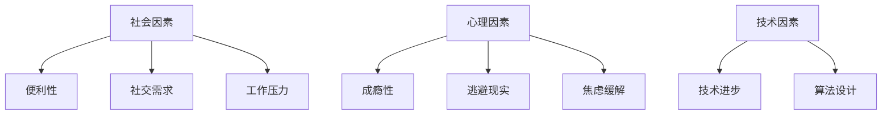
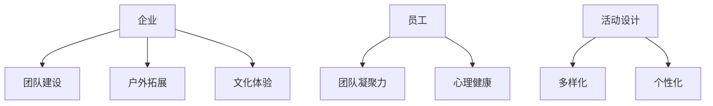
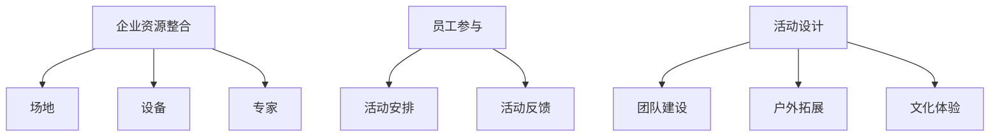
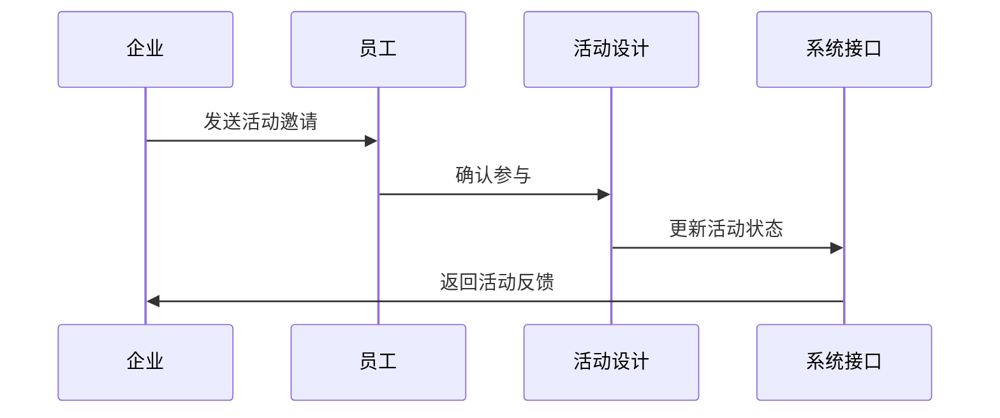

                 

# 数字解毒营：重建线下生活的意义探索

## 关键词

- 数字生活
- 线下生活
- 心理健康
- 社会关系
- 数字依赖
- 线下生活重建

## 摘要

在数字化的浪潮下，人们的日常生活越来越依赖于互联网和电子设备。然而，这种数字依赖也带来了一系列负面影响，如心理健康问题和社会关系的疏远。本文旨在探讨数字生活的挑战，分析数字依赖的成因与影响，并提出重建线下生活的策略与意义。通过个人和企业实践案例，本文试图唤起对线下生活的重视，促进数字生活与线下生活的平衡。

## 第一部分：数字时代下的生活现状

### 第1章：数字生活的挑战

#### 1.1 数字生活的背景与影响

随着互联网和移动设备的普及，数字生活已经成为现代人生活中不可或缺的一部分。从工作到娱乐，从社交到购物，数字技术极大地改变了我们的生活方式。然而，这种转变并非全然正面。长时间对着屏幕，减少与人面对面交流的机会，导致了一系列健康问题和社会问题的出现。

**问题背景**：

- **心理健康问题**：研究表明，过度使用数字设备可能导致焦虑、抑郁和失眠等问题。
- **社会关系疏远**：数字社交虽然方便，但往往缺乏深度，难以替代真实的人际互动。
- **身体活动减少**：长时间坐在电脑前或手机屏幕前，导致身体活动量减少，增加了一系列健康风险。

**问题描述**：

数字生活的负面影响主要体现在以下几个方面：

- **心理健康问题**：焦虑、抑郁、失眠等。
- **社会关系疏远**：缺乏深度的人际互动，孤独感增加。
- **身体活动减少**：久坐不动，增加健康风险。

**问题解决**：

要解决数字生活的负面影响，需要从以下几个方面入手：

- **心理健康维护**：通过运动、冥想等方式缓解焦虑和抑郁。
- **社交活动增加**：定期参加线下活动，增加与他人面对面交流的机会。
- **身体活动增加**：制定运动计划，增加日常身体活动量。

#### 1.2 数字生活的负面影响

数字生活的负面影响主要体现在以下几个方面：

- **心理健康问题**：过度使用数字设备可能导致心理健康问题，如焦虑、抑郁和失眠等。
- **社会关系疏远**：数字社交虽然方便，但缺乏深度，难以替代真实的人际互动。
- **身体活动减少**：长时间坐在电脑前或手机屏幕前，导致身体活动量减少，增加了一系列健康风险。

**边界与外延**：

- **心理健康问题**：包括焦虑、抑郁、失眠等。
- **社会关系疏远**：包括孤独感、人际互动缺乏深度等。
- **身体活动减少**：包括久坐不动、增加健康风险等。

**概念结构与核心要素组成**：

- **心理健康问题**：情绪管理、睡眠质量、压力应对。
- **社会关系疏远**：社交技能、人际关系、情感支持。
- **身体活动减少**：运动频率、身体状态、健康风险。

#### 1.3 数字生活的机遇与挑战

尽管数字生活带来了一系列负面影响，但它也为我们的生活提供了新的机遇。例如，数字化教育、远程工作、在线医疗等，都在一定程度上改善了我们的生活质量。然而，如何平衡数字生活的机遇与挑战，是我们面临的一个重大课题。

**机遇**：

- **数字化教育**：提供更广泛的学习资源和机会。
- **远程工作**：提高工作效率，减轻通勤压力。
- **在线医疗**：提供便捷的医疗咨询和诊疗服务。

**挑战**：

- **数字依赖**：可能导致心理健康问题和社会关系疏远。
- **隐私安全**：数字生活带来的隐私泄露风险。
- **数字鸿沟**：城乡、贫富之间的数字生活差距。

**问题解决**：

- **心理健康维护**：通过健康生活方式和心理健康教育来预防数字依赖。
- **隐私安全**：加强网络安全教育和法律法规的制定。
- **数字鸿沟**：加大数字基础设施建设和教育培训力度。

### 第2章：数字依赖的成因与影响

#### 2.1 数字依赖的成因分析

数字依赖的形成并非偶然，它背后有着复杂的社会、心理和技术因素。

**社会因素**：

- **便利性**：数字设备的使用方便快捷，让人们逐渐依赖。
- **社交需求**：数字社交满足了人们的社交需求，但在一定程度上替代了真实的人际互动。
- **工作压力**：远程工作和数字化管理使得人们更多地依赖于数字设备。

**心理因素**：

- **成瘾性**：数字设备提供的即时反馈和娱乐功能具有强烈的成瘾性。
- **逃避现实**：一些人通过数字设备逃避现实生活中的压力和挑战。
- **焦虑缓解**：数字设备在一定程度上可以缓解焦虑和压力。

**技术因素**：

- **技术进步**：数字设备的性能和功能不断提升，使得人们更容易依赖。
- **算法设计**：社交媒体和应用程序的算法设计旨在增加用户的粘性。

**概念属性特征对比表格**：

| 特征         | 数字依赖        | 非数字依赖        |
| ------------ | -------------- | ---------------- |
| 社会因素     | 便利性、社交需求、工作压力 | 面对面交流、群体活动、工作压力 |
| 心理因素     | 成瘾性、逃避现实、焦虑缓解 | 自我调节、现实应对、焦虑缓解 |
| 技术因素     | 技术进步、算法设计 | 技术应用、算法选择 |

**ER实体关系图架构的Mermaid流程图**：

#### 2.2 数字依赖的负面影响

数字依赖虽然在一定程度上提高了生活便利性，但也带来了诸多负面影响。

**心理健康问题**：

- **焦虑和抑郁**：过度使用数字设备可能导致焦虑和抑郁症状。
- **睡眠障碍**：夜间使用数字设备可能影响睡眠质量。

**社会关系疏远**：

- **人际互动缺乏深度**：数字社交难以替代真实的人际互动。
- **孤独感增加**：过度依赖数字设备可能导致孤独感的增加。

**身体活动减少**：

- **久坐不动**：长时间坐在电脑前或手机屏幕前可能导致身体活动量减少。
- **健康风险增加**：久坐不动增加了一系列健康风险，如心血管疾病和肥胖。

**概念结构与核心要素组成**：

- **心理健康问题**：焦虑、抑郁、睡眠障碍。
- **社会关系疏远**：人际互动缺乏深度、孤独感增加。
- **身体活动减少**：久坐不动、健康风险增加。

#### 2.3 数字依赖的应对策略

要应对数字依赖，需要从以下几个方面入手：

**心理健康维护**：

- **健康生活方式**：保持规律的作息时间，减少夜间使用数字设备。
- **心理健康教育**：提高对心理健康问题的认识，学会自我调节和压力应对。

**社交活动增加**：

- **参加线下活动**：定期参加社交活动和群体活动，增加与他人面对面交流的机会。
- **培养兴趣爱好**：通过兴趣爱好建立深层次的人际关系。

**身体活动增加**：

- **定期锻炼**：制定合理的运动计划，增加日常身体活动量。
- **户外活动**：多参加户外活动，享受大自然的美好。

### 第二部分：重建线下生活的意义

#### 第3章：线下生活的价值

线下生活作为一种重要的生活形式，具有独特的价值。

#### 3.1 线下生活的核心价值

**心理健康**：

线下生活有助于缓解心理健康问题，如焦虑、抑郁和压力。通过面对面的交流，人们可以获得情感支持和理解，从而改善心理健康状态。

**社会关系**：

线下生活有助于建立和维护真实的人际关系。面对面的互动可以加深彼此的了解和信任，从而建立稳固的社会支持网络。

**身体活动**：

线下生活提供了更多的身体活动机会，有助于提高身体素质和预防健康问题。户外活动和体育活动不仅能够锻炼身体，还能够增强心理韧性。

**情感体验**：

线下生活提供了丰富的情感体验，如亲密关系、家庭聚会和文化活动等。这些体验能够增加生活的乐趣和满足感。

#### 3.2 线下生活与心理健康

**实证研究**：

多项研究表明，线下生活与心理健康之间存在显著的正相关关系。定期参与线下活动的人心理健康状况更佳，焦虑和抑郁症状较少。

**案例分析**：

一个案例是老年人群体。研究表明，那些积极参与社区活动的老年人心理健康状况更好，他们更有活力，生活质量更高。

**理论分析**：

根据社会支持理论，线下生活提供了重要的社会支持，有助于缓解压力和提高心理健康。同时，身体活动也有助于改善心理健康，如减少焦虑和抑郁症状。

#### 3.3 线下生活与社会关系

**社会关系的重要性**：

社会关系是心理健康的重要影响因素之一。线下生活提供了更多的机会与他人建立和维持关系，从而提供情感支持和社交互动。

**线下互动的优势**：

与数字社交相比，线下互动具有更高的真实性和深度。面对面的交流能够更好地理解和表达情感，建立更稳固的关系。

**案例分析**：

一个案例是家庭聚会。研究发现，家庭聚会能够增强家庭成员之间的情感联系，提高家庭幸福感。

**理论分析**：

根据社会交换理论，线下生活有助于建立互惠关系，提高社交满意度。通过线下互动，人们能够获得更多的社会资源和心理支持。

#### 3.4 线下生活与身体活动

**身体活动的重要性**：

身体活动对于维持健康和预防疾病至关重要。线下生活提供了更多的机会进行体育锻炼和户外活动，有助于提高身体素质。

**案例分析**：

一个案例是徒步旅行。徒步旅行不仅能够锻炼身体，还能够提供美丽的自然景观，增加生活的乐趣。

**理论分析**：

根据健康行为理论，线下生活有助于建立健康的行为习惯，如定期锻炼和户外活动。这些习惯有助于改善身体健康和提高生活质量。

### 第4章：重建线下生活的策略

#### 4.1 制定线下生活计划

要重建线下生活，首先需要制定一个切实可行的计划。以下是一些关键步骤：

**目标设定**：

明确自己的线下生活目标，如增加社交活动、定期锻炼等。

**时间规划**：

合理安排时间，确保有足够的时间参与线下活动。可以考虑在工作日安排短暂的线下活动，如午间散步或参加社区活动。

**活动选择**：

根据自己的兴趣和需求选择合适的线下活动，如加入兴趣小组、参与志愿者活动、参加体育比赛等。

**持续跟进**：

定期回顾和调整计划，确保计划的实施效果。可以设立奖励机制，以激励自己坚持参与线下活动。

#### 4.2 提升线下生活质量

要提升线下生活质量，需要从以下几个方面入手：

**环境优化**：

改善线下活动的环境，如选择安静的场所进行阅读或工作，创造一个有利于身心放松的环境。

**活动设计**：

设计丰富多样的线下活动，如组织家庭聚会、户外探险、文化体验等，以增加生活的乐趣和满足感。

**社交互动**：

积极参与社交互动，与他人建立和维持真实的人际关系。可以通过参加社交活动、加入兴趣小组等方式拓展社交圈子。

#### 4.3 促进线下生活与数字生活的平衡

要实现线下生活与数字生活的平衡，需要从以下几个方面进行努力：

**时间管理**：

合理安排时间，确保有足够的时间参与线下活动。可以设置固定的线下活动时间，避免被数字生活占据全部时间。

**技术辅助**：

利用数字技术辅助线下生活，如使用运动APP跟踪运动进度、使用社交平台组织线下活动等。但要注意避免过度依赖数字技术。

**心理调适**：

学会在数字生活和线下生活之间进行心理调适，如通过冥想、瑜伽等方式放松身心，避免数字生活带来的负面影响。

### 第三部分：实践案例与启示

#### 第5章：个人重建线下生活的实践案例

#### 5.1 案例一：重拾阅读习惯

**环境优化**：

在家中设立一个专门的阅读区域，如书桌或书架，创造一个安静舒适的阅读环境。

**活动设计**：

定期安排阅读时间，如每天晚上睡前阅读半小时。选择自己感兴趣的书籍，提高阅读的乐趣。

**心理调适**：

通过阅读缓解压力，提升心理素质。将阅读视为一种放松和自我成长的方式。

**案例小结**：

通过重拾阅读习惯，不仅提高了个人的知识水平，还改善了心理健康状态，增加了生活的乐趣。

#### 5.2 案例二：走进自然

**环境优化**：

选择风景优美的地方进行户外活动，如公园、山区或海边。

**活动设计**：

定期进行户外活动，如徒步、野餐或露营。与家人或朋友一起参与，增加互动和社交机会。

**心理调适**：

在自然环境中放松身心，减少压力。感受大自然的美丽和宁静，提高生活满意度。

**案例小结**：

通过走进自然，不仅锻炼了身体，还提升了心理健康，增进了与家人和朋友的关系。

#### 5.3 案例三：社区互动

**环境优化**：

积极参与社区活动，如社区清洁、节日庆祝或运动会。

**活动设计**：

加入社区志愿者团队，定期参与社区服务。与邻居建立联系，增进邻里关系。

**心理调适**：

通过社区互动，获得更多的社会支持和认同感。增加社交机会，提高社交技能。

**案例小结**：

通过社区互动，不仅丰富了社交生活，还提升了社区凝聚力，为个人和社会带来了积极影响。

### 第6章：企业重建线下生活的实践

#### 6.1 企业视角下的线下生活重建

**目标设定**：

企业应明确重建线下生活的目标和愿景，如提升员工心理健康、增强团队凝聚力等。

**活动设计**：

设计多样化的线下活动，如团队建设、户外拓展、文化体验等，以满足员工的不同需求。

**资源整合**：

整合企业内外部资源，如场地、设备、专家等，为线下活动提供支持。

**案例介绍**：

某企业通过定期组织团队建设活动，如户外拓展、运动会等，有效提升了员工的团队凝聚力和心理健康。

**系统功能设计(领域模型Mermaid类图)**：

**系统架构设计Mermaid架构图**：

**系统接口设计和系统交互Mermaid序列图**：

#### 6.2 企业线下活动的设计与实施

**线下活动的设计原则**：

- **目标明确**：确保活动设计符合企业的目标和员工的需求。
- **多样化**：提供多样化的活动形式，以满足员工的不同兴趣和需求。
- **个性化**：根据员工的个性特点，设计个性化的活动方案。

**线下活动的实施步骤**：

1. **需求调研**：了解员工的需求和兴趣，制定活动计划。
2. **活动设计**：根据需求调研结果，设计具体的活动方案。
3. **资源整合**：整合企业内外部资源，确保活动的顺利进行。
4. **活动实施**：按照计划实施活动，确保活动的效果和参与度。
5. **活动反馈**：收集员工对活动的反馈，不断优化活动设计。

**案例分析**：

某企业通过组织团队拓展活动，如攀岩、拓展训练等，提高了员工的团队凝聚力和执行力。活动结束后，员工对活动的满意度较高，对企业文化的认同感也有所提升。

#### 6.3 企业线下生活重建的成果与反思

**成果**：

- **员工心理健康提升**：通过线下活动，员工的心理健康水平得到显著改善。
- **团队凝聚力增强**：线下活动有助于建立和加强团队成员之间的信任和合作关系。
- **企业文化认同**：员工对企业的认同感和归属感得到提升。

**反思**：

- **活动设计与员工需求的匹配度**：需要不断优化活动设计，确保活动内容与员工需求相匹配。
- **活动资源的有效利用**：要充分发挥企业内外部资源的优势，确保活动资源的有效利用。
- **活动反馈机制的建立**：建立完善的反馈机制，及时了解员工对活动的意见和建议，不断改进活动质量。

### 第7章：重建线下生活的启示与展望

#### 7.1 重建线下生活的社会意义

重建线下生活具有重要的社会意义：

- **心理健康提升**：通过线下活动，可以改善人们的心理健康，减少焦虑和抑郁症状。
- **社会关系增强**：线下生活有助于建立和维护真实的人际关系，增强社会支持。
- **身体健康改善**：线下生活提供了更多的身体活动机会，有助于提高身体素质和预防疾病。

#### 7.2 重建线下生活的未来趋势

随着数字技术的发展，重建线下生活呈现出以下趋势：

- **线上线下融合**：线上线下活动将更加融合，为人们提供更丰富的活动选择。
- **智能化管理**：利用大数据和人工智能技术，优化线下活动的设计和实施。
- **个性化定制**：根据个人需求，提供个性化的线下活动方案。

#### 7.3 个人与企业如何共同推进线下生活的重建

个人与企业可以从以下几个方面共同推进线下生活的重建：

- **政策支持**：政府可以出台相关政策，鼓励和支持线下活动的开展。
- **教育引导**：通过教育和宣传活动，提高人们对线下生活的认识和重视。
- **资源整合**：个人和企业可以共同整合资源，提供更多优质的线下活动。
- **创新实践**：不断探索和创新线下活动形式，提高活动的吸引力和效果。

## 总结

重建线下生活对于提升个人心理健康、增强社会关系和改善身体健康具有重要意义。个人和企业应共同努力，通过制定合理的计划和策略，积极参与线下活动，实现数字生活与线下生活的平衡。让我们一起行动起来，重建线下生活的美好未来。

### 作者信息

- 作者：AI天才研究院/AI Genius Institute & 禅与计算机程序设计艺术 /Zen And The Art of Computer Programming

