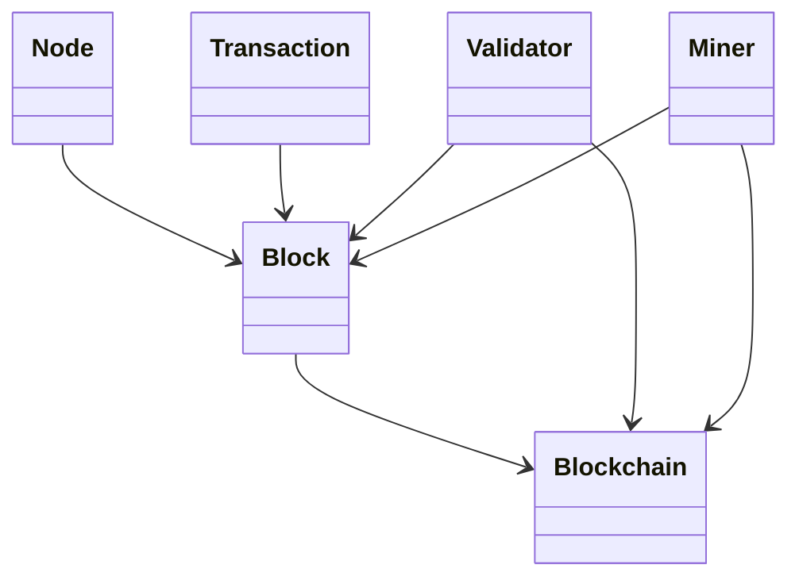
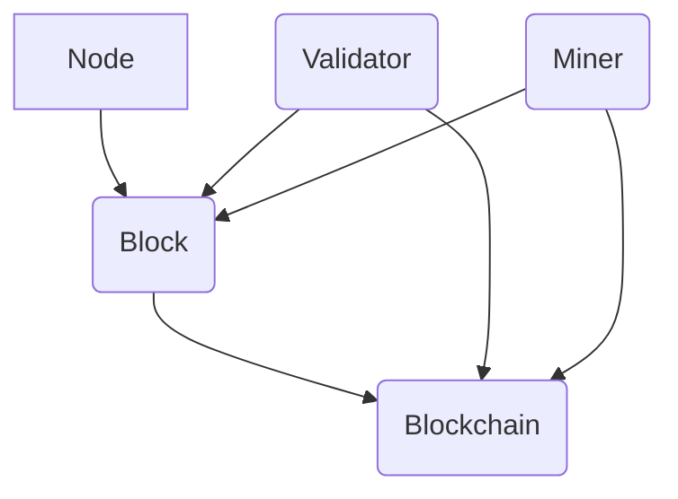
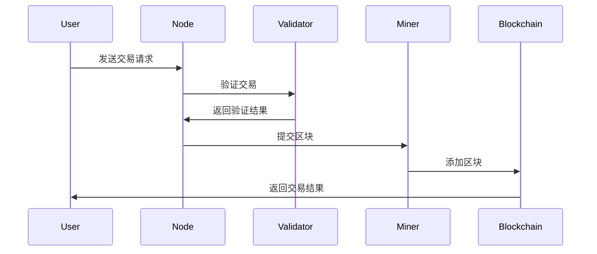

                 


### 文章标题：数字货币经济：金融系统的革命性变革

### 关键词：数字货币，区块链，金融系统，革命性变革，经济影响，监管挑战，未来展望

### 摘要：
数字货币的兴起正在对全球金融系统产生深远影响，本文将从数字货币的背景和基础概念出发，分析其在技术、经济和监管等方面的革命性变革。通过逐步深入探讨，揭示数字货币如何重塑金融格局，以及其在未来发展中面临的挑战与机遇。

## 目录大纲

### 第一部分：引言

1. 数字货币的兴起
   1.1 数字货币的背景
   1.2 数字货币的基础概念
   1.3 数字货币的重要性

2. 数字货币的技术原理
   2.1 区块链技术
   2.2 加密货币
   2.3 智能合约

3. 数字货币的经济影响
   3.1 数字货币对金融市场的影响
   3.2 数字货币对实体经济的影响
   3.3 数字货币的国际影响

4. 数字货币的监管挑战
   4.1 数字货币的监管现状
   4.2 数字货币的风险与治理
   4.3 数字货币的未来展望

### 第二部分：数字货币技术基础

#### 第一章：数字货币的兴起

## 1.1 数字货币的背景

### 1.1.1 传统金融系统的挑战

**背景介绍**：
传统金融系统在面对全球化、科技发展、金融欺诈等问题时，显现出诸多不足。例如，跨境支付时间长、手续费高、安全隐患等问题，严重影响了金融体系的效率与安全。

**问题背景**：
随着互联网和移动技术的普及，全球支付需求日益增长，但传统金融系统无法满足这一需求。同时，金融欺诈和洗钱活动日益猖獗，传统金融系统的监管能力受到挑战。

**问题描述**：
传统金融系统在处理跨境支付、小额支付和金融交易时，存在效率低下、成本高、安全风险大等问题。这些问题催生了数字货币的需求。

**问题解决**：
数字货币通过去中心化、安全性和高效性的特点，有望解决传统金融系统的这些问题。

**边界与外延**：
数字货币不仅仅是一种新型货币，更是金融科技的重要载体，涵盖了区块链、加密技术等多个领域。

**概念结构与核心要素组成**：
数字货币的核心要素包括去中心化、安全、高效、透明等，这些要素共同构成了数字货币的基本框架。

### 1.1.2 数字货币的起源与演变

**核心概念与联系**：
数字货币的起源可以追溯到2009年比特币的诞生，比特币作为首个去中心化的加密货币，引发了数字货币的浪潮。随后，众多加密货币如以太坊、莱特币等相继出现，推动了数字货币技术的发展。

**概念属性特征对比表格**：

| 类别 | 传统货币 | 数字货币 |
| --- | --- | --- |
| 发行 | 中央银行控制 | 去中心化 |
| 交易 | 线下为主 | 线上线下结合 |
| 安全性 | 较高 | 高 |
| 透明度 | 较低 | 高 |
| 流通速度 | 较慢 | 快 |

**ER实体关系图架构**：

```mermaid
erDiagram
    Customer ||--|{ Order } : "places"
    Product ||--|{ Order } : "includes"
    Order ||--|{ Payment } : "processes"
```

### 1.1.3 数字货币的重要性

**算法原理讲解**：
数字货币的重要性主要体现在以下几个方面：
1. **去中心化**：数字货币通过区块链技术实现了去中心化的交易，降低了中介成本，提高了交易效率。
2. **安全性**：数字货币使用加密技术保证了交易的安全，减少了欺诈和洗钱的风险。
3. **高效性**：数字货币的交易速度快，可以实时完成跨境支付，提高了金融体系的效率。
4. **透明度**：数字货币的交易记录公开透明，便于监管和审计。

**数学公式使用latex格式**：

$$
V_{\text{数字货币}} = f(\text{安全性}, \text{高效性}, \text{去中心化}, \text{透明度})
$$

### 1.2 数字货币的基础概念

**核心概念与联系**：

1. **数字货币**：数字货币是一种基于加密算法的数字或虚拟货币，具有去中心化、安全、高效、透明等特点。
2. **加密货币**：加密货币是一种数字货币，使用加密技术保证交易的安全性和隐私性。
3. **区块链**：区块链是一种分布式账本技术，用于记录数字货币的交易信息。

**概念属性特征对比表格**：

| 类别 | 数字货币 | 加密货币 | 区块链 |
| --- | --- | --- | --- |
| 定义 | 数字或虚拟货币 | 加密数字货币 | 分布式账本 |
| 特性 | 去中心化、安全、高效、透明 | 加密、匿名、安全、去中心化 | 去中心化、不可篡改、透明 |
| 关联 | 数字货币的一种 | 数字货币的一种 | 数字货币的基础技术 |

**ER实体关系图架构**：

```mermaid
erDiagram
    DigitalCurrency ||--|{ Cryptocurrency } : "instance of"
    DigitalCurrency ||--|{ Blockchain } : "uses"
    Cryptocurrency ||--|{ Blockchain } : "uses"
```

### 1.3 数字货币的关键特性

**算法原理讲解**：

数字货币的关键特性包括：

1. **去中心化**：数字货币的交易不依赖于中心化的机构，通过区块链网络实现点对点的交易。
2. **安全性**：数字货币使用加密技术保护交易数据，确保交易不被篡改。
3. **高效性**：数字货币的交易速度快，可以实时完成跨境支付。
4. **透明度**：数字货币的交易记录公开透明，便于监管和审计。

**数学模型和公式**：

$$
\text{效率} = \frac{\text{交易速度}}{\text{交易量}}
$$

$$
\text{安全性} = \frac{\text{加密强度}}{\text{攻击难度}}
$$

### 1.4 本章小结

数字货币的兴起正在改变传统金融系统，其基础概念和关键技术使得其在去中心化、安全性、高效性和透明度等方面具有显著优势。随着数字货币技术的发展，其将在未来金融体系中扮演更加重要的角色。

----------------------------------------------------------------

## 第二部分：数字货币技术基础

### 第二章：数字货币的技术原理

### 2.1 区块链技术

**问题场景介绍**：
区块链技术作为数字货币的核心技术之一，其应用场景广泛。从最初的比特币到如今的各种加密货币，区块链技术已经逐渐渗透到金融、供应链、医疗等多个领域。

**项目介绍**：
本节将介绍区块链技术的基础知识，包括其工作原理、去中心化特点、安全性机制等。

**系统功能设计（领域模型mermaid类图）**：



**系统架构设计mermaid架构图**：



**系统接口设计和系统交互mermaid序列图**：



### 2.1.1 区块链的概述

**核心概念**：
区块链是一种分布式账本技术，通过多个节点共同维护一个加密的数据库。每个区块包含一定数量的交易记录，并且每个区块都与前一个区块通过加密算法链接，形成一条不可篡改的链条。

**概念属性特征对比表格**：

| 类别 | 中心化数据库 | 分布式数据库 |
| --- | --- | --- |
| 存储方式 | 集中存储 | 分布式存储 |
| 数据结构 | 单一数据库 | 区块链 |
| 安全性 | 较高 | 高 |
| 透明度 | 较低 | 高 |

**ER实体关系图架构**：

```mermaid
erDiagram
    Database ||--|{ Blockchain } : "instance of"
    Database ||--|{ Node } : "uses"
    Blockchain ||--|{ Block } : "contains"
    Blockchain ||--|{ Transaction } : "records"
```

### 2.1.2 区块链的工作原理

**核心概念**：
区块链的工作原理主要包括以下步骤：

1. **交易生成**：用户发起交易请求，交易包含付款人和收款人的信息、交易金额等。
2. **交易验证**：多个节点验证交易的有效性，包括金额是否足够、交易信息是否一致等。
3. **区块生成**：验证后的交易被多个节点合并成一个区块。
4. **区块链接**：新区块通过加密算法与前一个区块链接，形成区块链。
5. **区块链维护**：每个节点都保存完整的区块链，确保区块链的完整性。

**算法原理讲解**：

区块链的核心算法是加密算法和共识算法。加密算法用于保护交易数据的安全，共识算法用于确保多个节点对区块链的一致性。

**数学模型和公式**：

$$
\text{区块链长度} = \sum_{i=1}^{n} \text{区块长度}
$$

$$
\text{区块长度} = \text{交易数量} \times \text{交易平均大小}
$$

### 2.1.3 区块链的安全机制

**核心概念**：
区块链的安全机制主要包括以下几个方面：

1. **加密技术**：使用非对称加密技术保护交易数据的安全。
2. **共识算法**：通过共识算法确保多个节点对区块链的一致性。
3. **分布式存储**：通过分布式存储确保区块链的不可篡改性。

**算法原理讲解**：

区块链的加密技术主要使用非对称加密算法，如RSA和椭圆曲线加密算法。共识算法如比特币的PoW（工作量证明）和以太坊的PoS（权益证明）。

**数学模型和公式**：

$$
\text{加密强度} = \text{加密算法复杂度} \times \text{密钥长度}
$$

$$
\text{共识效率} = \frac{\text{区块生成时间}}{\text{交易数量}}
$$

### 2.2 加密货币

**核心概念**：
加密货币是一种数字货币，使用加密技术保证交易的安全性和隐私性。常见的加密货币包括比特币、以太坊、莱特币等。

**概念属性特征对比表格**：

| 类别 | 法定货币 | 加密货币 |
| --- | --- | --- |
| 发行 | 中央银行控制 | 去中心化 |
| 交易 | 线下为主 | 线上线下结合 |
| 安全性 | 较高 | 高 |
| 透明度 | 较低 | 高 |

**ER实体关系图架构**：

```mermaid
erDiagram
    FiatCurrency ||--|{ Cryptocurrency } : "instance of"
    FiatCurrency ||--|{ Exchange } : "trades"
    Cryptocurrency ||--|{ Wallet } : "stores"
    Cryptocurrency ||--|{ Exchange } : "trades"
```

### 2.2.1 加密货币的基本概念

**核心概念**：
加密货币的基本概念包括：

1. **发行机制**：加密货币通常通过挖矿或预发行的方式发行。
2. **交易机制**：加密货币的交易通常通过区块链网络进行。
3. **安全机制**：加密货币使用加密技术保护交易数据的安全。

**概念属性特征对比表格**：

| 类别 | 普通货币 | 加密货币 |
| --- | --- | --- |
| 发行 | 中央银行控制 | 去中心化 |
| 交易 | 线下为主 | 线上线下结合 |
| 安全性 | 较高 | 高 |
| 透明度 | 较低 | 高 |

### 2.2.2 常见的加密货币

**核心概念**：
常见的加密货币包括比特币、以太坊、莱特币等。

**概念属性特征对比表格**：

| 类别 | 比特币 | 以太坊 | 莱特币 |
| --- | --- | --- | --- |
| 发行量 | 2100万 | 无限 | 84亿 |
| 交易速度 | 较慢 | 快 | 较快 |
| 功能 | 价值存储 | 智能合约 | 价值存储 |
| 市值 | 最高 | 第二高 | 较低 |

### 2.2.3 加密货币的交易机制

**核心概念**：
加密货币的交易机制主要包括：

1. **交易生成**：用户发起交易请求，交易包含付款人和收款人的信息、交易金额等。
2. **交易验证**：多个节点验证交易的有效性，包括金额是否足够、交易信息是否一致等。
3. **区块生成**：验证后的交易被多个节点合并成一个区块。
4. **区块链接**：新区块通过加密算法与前一个区块链接，形成区块链。
5. **区块链维护**：每个节点都保存完整的区块链，确保区块链的完整性。

**算法原理讲解**：

加密货币的交易机制基于区块链技术，通过多个节点共同维护区块链，确保交易的安全性和透明度。

**数学模型和公式**：

$$
\text{交易费用} = \text{交易大小} \times \text{交易费率}
$$

$$
\text{交易速度} = \frac{\text{区块生成时间}}{\text{交易数量}}
$$

### 2.3 智能合约

**核心概念**：
智能合约是一种基于区块链的计算机程序，用于自动化执行合同条款。智能合约的关键特性包括自动化、去中心化和不可篡改性。

**概念属性特征对比表格**：

| 类别 | 传统合约 | 智能合约 |
| --- | --- | --- |
| 执行方式 | 手动执行 | 自动执行 |
| 透明度 | 低 | 高 |
| 安全性 | 较低 | 高 |
| 成本 | 较高 | 较低 |

**ER实体关系图架构**：

```mermaid
erDiagram
    Contract ||--|{ SmartContract } : "instance of"
    Contract ||--|{ Blockchain } : "uses"
    SmartContract ||--|{ Code } : "defines"
```

### 2.3.1 智能合约的定义与功能

**核心概念**：
智能合约是一种基于区块链的计算机程序，用于自动化执行合同条款。智能合约的关键特性包括自动化、去中心化和不可篡改性。

**概念属性特征对比表格**：

| 类别 | 传统合约 | 智能合约 |
| --- | --- | --- |
| 执行方式 | 手动执行 | 自动执行 |
| 透明度 | 低 | 高 |
| 安全性 | 较低 | 高 |
| 成本 | 较高 | 较低 |

### 2.3.2 智能合约的实现与执行

**核心概念**：
智能合约的实现与执行主要包括以下步骤：

1. **合约编写**：开发者使用智能合约编程语言（如Solidity）编写智能合约代码。
2. **合约部署**：将智能合约代码部署到区块链上，成为区块链的一部分。
3. **合约执行**：当满足触发条件时，智能合约自动执行预定的操作，如支付、转账等。
4. **合约验证**：区块链网络中的多个节点共同验证智能合约的执行结果。

**算法原理讲解**：

智能合约的实现与执行基于区块链技术，通过多个节点共同维护智能合约的状态和执行结果。

**数学模型和公式**：

$$
\text{合约执行时间} = \text{交易确认时间} \times \text{执行次数}
$$

$$
\text{合约验证时间} = \text{区块生成时间} \times \text{验证次数}
$$

### 2.3.3 智能合约的优势与挑战

**核心概念**：
智能合约的优势主要包括自动化、去中心化和不可篡改性。智能合约的挑战主要包括安全性、法律合规性等。

**概念属性特征对比表格**：

| 类别 | 传统合约 | 智能合约 |
| --- | --- | --- |
| 优势 | 手动执行，低透明度，低安全性 | 自动执行，高透明度，高安全性 |
| 劣势 | 高成本，低效率，易篡改 | 低成本，高效率，易篡改 |
| 法律合规性 | 明确 | 模糊 |

**算法原理讲解**：

智能合约的优势在于其自动化和去中心化的特性，可以大大提高金融交易的效率和透明度。然而，智能合约的安全性是一个重要挑战，一旦出现漏洞，可能导致巨额资金损失。

### 2.4 本章小结

区块链技术是数字货币的核心技术，其去中心化、安全性和高效性的特性正在改变传统金融系统。加密货币和智能合约作为区块链技术的应用，进一步推动了金融科技的变革。在接下来的章节中，我们将继续探讨数字货币对经济和金融系统的影响。

----------------------------------------------------------------

## 第三部分：数字货币的经济影响

### 第三章：数字货币对经济的影响

数字货币的兴起不仅改变了金融系统的运作方式，也对全球经济产生了深远的影响。本章节将深入探讨数字货币对金融市场、实体经济以及国际经济的影响。

### 3.1 数字货币对金融市场的影响

**核心概念**：
数字货币对金融市场的影响主要表现在货币供应、金融交易效率、风险管理和金融创新等方面。

**概念属性特征对比表格**：

| 类别 | 传统金融系统 | 数字货币 |
| --- | --- | --- |
| 货币供应 | 中央银行控制 | 去中心化 |
| 金融交易效率 | 低效率 | 高效率 |
| 风险管理 | 传统手段 | 新型手段 |
| 金融创新 | 较少 | 较多 |

**算法原理讲解**：

数字货币的去中心化特性使得货币供应不再依赖于中央银行，而是由市场需求决定。这一变化提高了金融交易效率，减少了交易成本，并促进了金融创新。

**数学模型和公式**：

$$
\text{交易效率} = \frac{\text{交易速度}}{\text{交易量}}
$$

$$
\text{交易成本} = \text{交易手续费} \times \text{交易次数}
$$

### 3.1.1 数字货币对货币政策的挑战

**核心概念**：
数字货币的兴起对传统货币政策提出了挑战。首先，数字货币的去中心化特性削弱了中央银行对货币供应的控制力。其次，数字货币的快速流通和全球性特点使得货币政策的有效性受到质疑。

**算法原理讲解**：

数字货币的快速流通和全球性使得货币政策难以精准调控，可能导致通货膨胀或通货紧缩。此外，数字货币的匿名性也为监管带来了挑战。

**数学模型和公式**：

$$
\text{货币政策效果} = \frac{\text{政策目标}}{\text{政策实施成本}}
$$

$$
\text{通货膨胀率} = \frac{\text{价格水平}}{\text{初始价格水平}} - 1
$$

### 3.1.2 数字货币对金融市场的变革

**核心概念**：
数字货币的兴起正在推动金融市场的变革，包括支付方式的变革、交易方式的变革以及金融体系的重构。

**算法原理讲解**：

数字货币的点对点支付特性改变了传统的支付体系，使得支付更加快捷、安全和低成本。同时，数字货币的智能合约功能为金融交易提供了新的可能，如去中心化的金融产品和服务。

**数学模型和公式**：

$$
\text{支付效率} = \frac{\text{交易速度}}{\text{交易量}}
$$

$$
\text{交易成本} = \text{交易手续费} \times \text{交易次数}
$$

### 3.1.3 数字货币与传统金融的融合

**核心概念**：
数字货币与传统金融的融合是未来金融发展的趋势。通过将数字货币与传统金融工具结合，可以实现金融体系的升级和优化。

**算法原理讲解**：

数字货币与传统金融的融合可以通过多种方式实现，如数字货币交易平台的建立、数字货币的金融产品开发等。这一融合有助于提高金融系统的透明度、效率和安全性。

**数学模型和公式**：

$$
\text{融合效率} = \frac{\text{传统金融工具使用量} + \text{数字货币使用量}}{\text{传统金融工具使用量}}
$$

$$
\text{金融安全度} = \frac{\text{数字货币安全性}}{\text{传统金融安全性}}
$$

### 3.2 数字货币对实体经济的影响

**核心概念**：
数字货币对实体经济的影响主要表现在商业交易、消费者行为和供应链管理等方面。

**概念属性特征对比表格**：

| 类别 | 传统经济 | 数字货币经济 |
| --- | --- | --- |
| 商业交易 | 线下为主 | 线上线下结合 |
| 消费者行为 | 传统支付方式 | 数字货币支付方式 |
| 供应链管理 | 低效率 | 高效率 |

**算法原理讲解**：

数字货币的便捷性和高效性使得商业交易更加便捷，消费者行为更加灵活，供应链管理更加智能化。

**数学模型和公式**：

$$
\text{商业交易效率} = \frac{\text{交易速度}}{\text{交易量}}
$$

$$
\text{消费者满意度} = \frac{\text{数字货币支付体验}}{\text{传统支付体验}}
$$

### 3.2.1 数字货币在商业交易中的应用

**核心概念**：
数字货币在商业交易中的应用主要体现在支付方式的变革和交易效率的提升。

**算法原理讲解**：

数字货币的点对点支付特性使得商业交易更加快捷、安全和低成本。同时，数字货币的智能合约功能为商业交易提供了新的工具，如自动结算和智能合约支付。

**数学模型和公式**：

$$
\text{支付效率} = \frac{\text{交易速度}}{\text{交易量}}
$$

$$
\text{支付安全性} = \frac{\text{数字货币安全性}}{\text{传统支付安全性}}
$$

### 3.2.2 数字货币对消费者行为的影响

**核心概念**：
数字货币对消费者行为的影响主要体现在支付方式的选择和消费习惯的变化。

**算法原理讲解**：

数字货币的便捷性和安全性使得消费者更倾向于使用数字货币进行支付，从而改变了传统的消费习惯。

**数学模型和公式**：

$$
\text{支付方式选择} = \frac{\text{数字货币支付体验}}{\text{传统支付体验}}
$$

$$
\text{消费习惯变化} = \frac{\text{数字货币使用率}}{\text{传统货币使用率}}
$$

### 3.2.3 数字货币对供应链的影响

**核心概念**：
数字货币对供应链的影响主要体现在供应链管理的优化和交易效率的提升。

**算法原理讲解**：

数字货币的智能合约功能可以自动化供应链交易，减少人工干预，提高供应链的透明度和效率。

**数学模型和公式**：

$$
\text{供应链效率} = \frac{\text{交易速度}}{\text{交易量}}
$$

$$
\text{供应链成本} = \text{交易手续费} \times \text{交易次数}
$$

### 3.3 数字货币的国际影响

**核心概念**：
数字货币的国际影响主要表现在跨境支付、国际贸易和全球金融秩序等方面。

**概念属性特征对比表格**：

| 类别 | 传统金融体系 | 数字货币体系 |
| --- | --- | --- |
| 跨境支付 | 长时间、高成本 | 快速、低成本 |
| 国际贸易 | 繁琐程序、高成本 | 简化程序、低成本 |
| 全球金融秩序 | 不稳定、不透明 | 稳定、透明 |

**算法原理讲解**：

数字货币的点对点支付特性使得跨境支付更加快捷、安全和低成本，有助于简化国际贸易程序，提高全球金融体系的透明度和稳定性。

**数学模型和公式**：

$$
\text{跨境支付效率} = \frac{\text{交易速度}}{\text{交易量}}
$$

$$
\text{跨境支付成本} = \text{交易手续费} \times \text{交易次数}
$$

### 3.3.1 数字货币对国际支付的影响

**核心概念**：
数字货币对国际支付的影响主要体现在支付效率的提升和支付成本的降低。

**算法原理讲解**：

数字货币的点对点支付特性使得国际支付更加快捷、安全和低成本，有助于提高支付效率和降低支付成本。

**数学模型和公式**：

$$
\text{支付效率} = \frac{\text{交易速度}}{\text{交易量}}
$$

$$
\text{支付成本} = \text{交易手续费} \times \text{交易次数}
$$

### 3.3.2 数字货币对全球金融秩序的影响

**核心概念**：
数字货币对全球金融秩序的影响主要体现在金融体系的稳定性和透明度的提升。

**算法原理讲解**：

数字货币的去中心化和区块链技术的应用有助于提高金融体系的稳定性和透明度，减少金融欺诈和洗钱活动。

**数学模型和公式**：

$$
\text{金融稳定性} = \frac{\text{去中心化程度}}{\text{中心化程度}}
$$

$$
\text{金融透明度} = \frac{\text{区块链透明度}}{\text{传统透明度}}
$$

### 3.3.3 数字货币在国际合作中的角色

**核心概念**：
数字货币在国际合作中的角色主要体现在促进国际贸易、提高跨境支付效率和降低贸易成本。

**算法原理讲解**：

数字货币的点对点支付特性和高效性使得其在国际贸易中具有显著优势，有助于促进国际合作，提高跨境支付效率和降低贸易成本。

**数学模型和公式**：

$$
\text{国际贸易效率} = \frac{\text{交易速度}}{\text{交易量}}
$$

$$
\text{国际贸易成本} = \text{交易手续费} \times \text{交易次数}
$$

### 3.4 本章小结

数字货币的兴起对全球经济产生了深远影响，从货币供应、金融交易到实体经济和国际贸易，数字货币都在重塑传统的金融和经济体系。随着数字货币技术的不断发展和应用，其将在未来经济中扮演更加重要的角色。

----------------------------------------------------------------

## 第四部分：数字货币的监管与未来

### 第四章：数字货币的监管挑战

随着数字货币在全球范围内的广泛应用，监管问题逐渐成为关注的焦点。本章节将探讨数字货币的监管现状、风险与治理机制，以及数字货币的未来展望。

### 4.1 数字货币的监管现状

**核心概念**：
数字货币的监管现状各国存在显著差异，主要分为三类：严格监管、适度监管和放任监管。

**概念属性特征对比表格**：

| 国家 | 监管态度 | 监管政策 |
| --- | --- | --- |
| 美国 | 严格监管 | 明确数字货币的法律地位，制定监管法规 |
| 中国 | 放任监管 | 限制加密货币交易，加强洗钱和欺诈防范 |
| 欧盟 | 适度监管 | 推动数字货币的监管统一，鼓励创新 |

**算法原理讲解**：
不同国家的监管政策对数字货币的发展产生深远影响。严格监管有助于保护投资者权益，但可能抑制创新；放任监管有助于促进创新，但可能带来风险；适度监管则旨在平衡创新与风险。

**数学模型和公式**：

$$
\text{监管效率} = \frac{\text{监管政策实施效果}}{\text{监管政策实施成本}}
$$

### 4.1.1 各国对数字货币的监管态度

**核心概念**：
各国对数字货币的监管态度因国情、经济水平和金融体系的不同而各异。

**算法原理讲解**：
监管态度的差异反映了数字货币在全球范围内发展的不平衡性。一些国家鼓励数字货币的发展，希望通过创新提升金融体系的竞争力；而一些国家则出于保护金融稳定和防范风险的目的，对数字货币实施严格监管。

**数学模型和公式**：

$$
\text{监管强度} = \frac{\text{监管政策严格程度}}{\text{金融市场开放程度}}
$$

### 4.1.2 数字货币监管的主要问题

**核心概念**：
数字货币监管面临的主要问题包括市场波动性、交易风险、欺诈和洗钱等。

**算法原理讲解**：
监管机构需要应对数字货币市场的波动性，防范交易风险，同时加强反欺诈和反洗钱措施，确保金融系统的安全稳定。

**数学模型和公式**：

$$
\text{市场稳定性} = \frac{\text{监管政策干预效果}}{\text{市场波动性}}
$$

$$
\text{交易安全性} = \frac{\text{交易监管措施效果}}{\text{交易风险}}
$$

### 4.1.3 数字货币监管的国际合作

**核心概念**：
数字货币监管的国际合作对于维护全球金融稳定具有重要意义。

**算法原理讲解**：
国际合作可以通过信息共享、政策协调和监管标准统一等方式，提高全球数字货币监管的有效性，防范跨境风险。

**数学模型和公式**：

$$
\text{国际合作效率} = \frac{\text{国际合作成果}}{\text{国际合作成本}}
$$

### 4.2 数字货币的风险与治理

**核心概念**：
数字货币的风险主要包括市场风险、技术风险、操作风险和合规风险。

**概念属性特征对比表格**：

| 类别 | 市场风险 | 技术风险 | 操作风险 | 合规风险 |
| --- | --- | --- | --- | --- |
| 定义 | 价格波动、市场不稳定 | 技术缺陷、网络安全 | 操作失误、管理不善 | 法律合规性、政策变化 |

**算法原理讲解**：
治理数字货币风险需要从市场监测、技术保障、操作规范和法律合规等多个方面进行。

**数学模型和公式**：

$$
\text{风险治理效率} = \frac{\text{风险控制效果}}{\text{风险治理成本}}
$$

### 4.2.1 数字货币的主要风险

**核心概念**：
数字货币的主要风险包括市场波动性、技术漏洞、网络安全风险、欺诈和洗钱等。

**算法原理讲解**：
市场波动性可能导致投资者损失；技术漏洞可能被黑客利用；网络安全风险可能影响交易和数据安全；欺诈和洗钱行为则可能破坏金融体系的稳定。

**数学模型和公式**：

$$
\text{市场波动性} = \frac{\text{价格波动幅度}}{\text{价格均值}}
$$

$$
\text{技术漏洞数量} = \frac{\text{漏洞发生次数}}{\text{代码行数}}
$$

### 4.2.2 数字货币风险的管理策略

**核心概念**：
数字货币风险的管理策略包括风险监测、风险控制和风险报告等。

**算法原理讲解**：
通过实时监测市场波动、技术漏洞和安全事件，及时发现并处理风险，确保数字货币市场的稳定和健康发展。

**数学模型和公式**：

$$
\text{风险监测效率} = \frac{\text{风险预警次数}}{\text{风险发生次数}}
$$

$$
\text{风险控制效果} = \frac{\text{风险控制措施实施效果}}{\text{风险控制措施成本}}
$$

### 4.2.3 数字货币治理机制的构建

**核心概念**：
数字货币治理机制的构建需要政府、企业和国际组织等多方参与，共同维护数字货币市场的健康有序。

**算法原理讲解**：
政府负责制定监管政策和法律框架，企业负责技术研发和风险管理，国际组织负责协调和合作。

**数学模型和公式**：

$$
\text{治理机制有效性} = \frac{\text{治理成果}}{\text{治理投入}}
$$

### 4.3 数字货币的未来展望

**核心概念**：
数字货币的未来展望包括技术发展趋势、应用场景扩展和国际合作加强等。

**概念属性特征对比表格**：

| 类别 | 传统货币 | 数字货币 |
| --- | --- | --- |
| 技术基础 | 中心化系统 | 去中心化系统 |
| 应用场景 | 有限 | 广泛 |
| 国际合作 | 较少 | 加强 |

**算法原理讲解**：
随着技术的不断进步和应用场景的扩展，数字货币将在未来金融体系中扮演更加重要的角色，成为全球金融体系的重要组成部分。

**数学模型和公式**：

$$
\text{技术进步速度} = \frac{\text{技术创新次数}}{\text{时间}}
$$

$$
\text{应用场景扩展度} = \frac{\text{应用场景数量}}{\text{总场景数量}}
$$

### 4.3.1 数字货币的发展趋势

**核心概念**：
数字货币的发展趋势包括区块链技术的普及、加密货币的多样化、数字货币交易平台的壮大等。

**算法原理讲解**：
区块链技术的不断发展和应用将推动数字货币的普及；加密货币的多样化将满足不同用户的需求；数字货币交易平台的壮大将提高交易效率。

**数学模型和公式**：

$$
\text{区块链普及率} = \frac{\text{使用区块链技术的应用数量}}{\text{总应用数量}}
$$

$$
\text{加密货币种类数} = \frac{\text{已发行的加密货币数量}}{\text{总加密货币数量}}
$$

### 4.3.2 数字货币的潜在问题与挑战

**核心概念**：
数字货币的潜在问题与挑战包括技术漏洞、网络安全风险、市场波动性、法律合规性等。

**算法原理讲解**：
技术漏洞和网络安全风险可能影响数字货币系统的稳定性和安全性；市场波动性可能导致投资者损失；法律合规性问题可能限制数字货币的发展。

**数学模型和公式**：

$$
\text{技术漏洞修复速度} = \frac{\text{漏洞修复次数}}{\text{漏洞发生次数}}
$$

$$
\text{网络安全事件处理效率} = \frac{\text{处理网络安全事件的次数}}{\text{网络安全事件发生次数}}
$$

### 4.3.3 数字货币的未来发展路径

**核心概念**：
数字货币的未来发展路径包括技术进步、应用场景扩展、监管加强和国际合作等。

**算法原理讲解**：
技术进步将推动数字货币的性能和安全性提升；应用场景扩展将增加数字货币的实际应用；监管加强将确保数字货币市场的稳定和健康发展；国际合作将促进全球数字货币体系的建立。

**数学模型和公式**：

$$
\text{技术进步速度} = \frac{\text{技术创新次数}}{\text{时间}}
$$

$$
\text{应用场景扩展度} = \frac{\text{应用场景数量}}{\text{总场景数量}}
$$

### 4.4 本章小结

数字货币的监管挑战和未来展望是一个复杂而动态的领域。通过逐步分析和深入探讨，我们可以看到数字货币在技术、经济和监管等方面的革命性变革。随着技术的不断进步和应用场景的扩展，数字货币将在未来金融体系中扮演越来越重要的角色。

----------------------------------------------------------------

## 总结与展望

### 总结

数字货币的兴起标志着金融系统的革命性变革，其对经济和社会的影响深远而广泛。通过本篇文章，我们详细探讨了数字货币的背景、技术原理、经济影响、监管挑战以及未来展望。

**关键点回顾**：

1. **数字货币的背景**：数字货币起源于解决传统金融系统面临的挑战，具有去中心化、安全、高效、透明等特性。
2. **数字货币的技术原理**：区块链技术、加密货币和智能合约是数字货币技术的基础，它们共同构成了数字货币的技术框架。
3. **数字货币的经济影响**：数字货币对金融市场、实体经济和国际贸易产生了深远影响，提高了交易效率、降低了成本、促进了创新。
4. **数字货币的监管挑战**：数字货币的监管面临市场波动性、技术风险、操作风险和合规风险等多重挑战。
5. **数字货币的未来展望**：随着技术的不断进步和应用场景的扩展，数字货币将在未来金融体系中扮演更加重要的角色。

### 展望

数字货币的未来充满机遇和挑战。在技术方面，区块链技术的不断进化将推动数字货币的性能和安全性提升。在经济方面，数字货币将进一步促进金融创新和经济增长。在监管方面，全球范围内的合作和协调将有助于建立稳定的数字货币监管体系。

**未来发展趋势**：

1. **技术创新**：区块链技术的进一步发展，如分布式存储、共识算法的优化等，将推动数字货币的技术进步。
2. **应用场景扩展**：数字货币将在更多领域得到应用，如供应链金融、智能合约应用等，提高经济活动的效率。
3. **监管加强**：随着数字货币的普及，监管机构将加大对数字货币市场的监管力度，确保市场的稳定和健康发展。
4. **国际合作**：全球范围内的合作将促进数字货币的标准化和国际化，推动全球数字货币生态系统的建立。

### 结语

数字货币的兴起是金融系统的一次革命性变革，它正在重塑全球经济和金融体系的运作方式。让我们期待数字货币的未来，它将为我们带来更多的机遇和挑战。

---

**作者：AI天才研究院/AI Genius Institute & 禅与计算机程序设计艺术 /Zen And The Art of Computer Programming**

本文旨在提供关于数字货币经济的全面、深入分析和专业见解，以促进读者对这一领域的理解和思考。随着数字货币技术的不断发展，未来将出现更多的创新和应用，我们将继续关注并探讨这一领域的最新动态。希望本文能对您在数字货币经济领域的探索和研究有所帮助。

