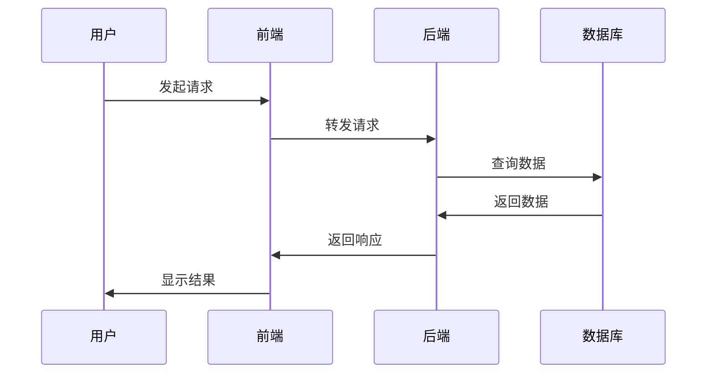

                 

# 数字身份管理平台构建：虚拟世界中的个人品牌塑造服务

## 关键词

数字身份管理、个人品牌、安全、隐私、多因素身份验证、加密技术、权限管理、用户体验。

## 摘要

随着互联网和数字化的加速发展，数字身份管理成为保障个人隐私和数据安全的重要手段。本文旨在探讨数字身份管理平台的建设，通过分析其背景、核心概念、技术原理及解决方案，为构建一个安全、可靠、易于使用的数字身份管理平台提供参考。同时，本文将探讨数字身份管理在虚拟世界中的个人品牌塑造服务，以期为读者提供一个全面的视角，深入了解数字身份管理的重要性及其在现实世界中的应用。

---

## 第一部分：背景介绍

### 第1章：数字身份管理平台概述

### 1.1 问题背景

随着互联网的快速发展，个人信息和数据的安全问题日益凸显。在虚拟世界中，如何保护个人隐私，防止信息泄露，成为了一个亟需解决的问题。数字身份管理应运而生，它通过技术手段，确保个人在数字世界中的身份安全、唯一性和可控性。

#### 1.1.1 数字身份管理的需求

数字身份管理的主要需求包括：

1. **安全性**：确保用户在数字世界中的身份信息不会被篡改或盗用。
2. **唯一性**：在庞大的数字世界中，每个用户的身份应具有唯一性，以防止重复身份的出现。
3. **可控性**：用户应能够自主管理自己的数字身份信息，包括修改和删除等操作。

#### 1.1.2 数字身份管理的发展

数字身份管理经历了从简单的用户名和密码验证，到更为复杂的生物识别技术，再到现在的多因素身份验证。随着技术的进步，数字身份管理平台逐渐成为维护网络安全和个人隐私的关键。

### 1.2 问题描述

#### 1.2.1 数字身份的潜在风险

数字身份管理面临的挑战主要包括：

1. **用户密码泄露**：用户使用的密码过于简单或相同，导致密码被盗用。
2. **账户被盗用**：黑客利用技术手段获取用户身份信息，进而盗用用户的账户。
3. **个人隐私泄露**：用户在数字世界中的行为和交易数据被不法分子获取，导致隐私泄露。

#### 1.2.2 数字身份管理平台的构建需求

为了应对这些挑战，需要构建一个功能完善、安全可靠的数字身份管理平台。该平台应能够提供用户身份认证、权限管理、数据安全等功能，确保用户在虚拟世界中的个人信息安全。

### 1.3 问题解决

#### 1.3.1 核心技术

数字身份管理平台的核心技术包括：

1. **身份认证技术**：利用多因素身份验证技术，确保用户身份的合法性和唯一性。
2. **加密技术**：采用加密技术，保护用户数据不被未授权访问。
3. **权限管理技术**：根据用户身份，为不同用户提供相应的权限，确保数据的安全和隐私。
4. **用户行为分析技术**：通过分析用户行为，识别潜在的安全威胁，提前采取防护措施。

#### 1.3.2 解决方案

通过构建数字身份管理平台，可以实现以下目标：

1. **身份认证**：利用多因素身份验证技术，确保用户身份的合法性和唯一性。
2. **权限管理**：根据用户身份，为不同用户提供相应的权限，确保数据的安全和隐私。
3. **数据安全**：采用加密技术，保护用户数据不被未授权访问。

### 1.4 边界与外延

#### 1.4.1 数字身份管理平台的应用场景

数字身份管理平台可广泛应用于电子商务、在线金融、社交媒体、政务服务等领域。

#### 1.4.2 数字身份管理平台的边界

数字身份管理平台需要考虑到用户隐私保护、法律合规性等问题，确保在合法、合规的前提下提供服务。

### 1.5 本章小结

本章对数字身份管理平台进行了概述，介绍了其背景、问题、解决方案和边界。在后续章节中，将详细介绍数字身份管理平台的核心概念、技术原理、构建方法和实战应用。希望通过本书，读者能够对数字身份管理平台有一个全面、深入的理解。

---

## 第二部分：核心概念与联系

### 第2章：数字身份管理平台的核心概念与联系

### 2.1 核心概念

#### 2.1.1 数字身份

数字身份是指个人在数字世界中的唯一标识，包括用户的身份信息、行为习惯等。数字身份是数字身份管理平台的基础。

#### 2.1.2 身份认证

身份认证是指验证用户身份的过程，常用的方法包括用户名和密码、生物识别、多因素身份验证等。

#### 2.1.3 加密技术

加密技术用于保护用户数据，防止数据在传输和存储过程中被窃取。常见的加密算法包括AES、RSA等。

#### 2.1.4 权限管理

权限管理是指根据用户身份，为不同用户提供相应的权限，确保数据的安全和隐私。

### 2.2 概念属性特征对比表格

| 概念         | 定义                                                         | 主要特征         | 关联概念         |
| ------------ | ------------------------------------------------------------ | --------------- | --------------- |
| 数字身份     | 个人在数字世界中的唯一标识                                   | 唯一性、关联性   | 身份认证、数据安全 |
| 身份认证     | 验证用户身份的过程                                           | 安全性、便捷性   | 加密技术、权限管理 |
| 加密技术     | 保护用户数据的技术                                           | 安全性、效率     | 数字身份、数据安全 |
| 权限管理     | 管理用户权限的技术                                           | 安全性、灵活性   | 数字身份、身份认证 |

### 2.3 ER实体关系图架构

```mermaid
erDiagram
    User ||--|{ DigitalIdentity }||>
    DigitalIdentity ||--|{ AuthenticationRecord }||>
    AuthenticationRecord ||--|{ Permission }||>
    User ||--|{ Data }||>
    Data ||--|{ EncryptionKey }||>
```

在上面的ER实体关系图中，`User` 是数字身份管理平台的核心实体，包括用户的身份信息和行为数据。`DigitalIdentity` 代表用户的数字身份，与`AuthenticationRecord` 相关联，记录用户通过哪些方式完成身份认证。`AuthenticationRecord` 又与`Permission` 相关联，用于管理用户权限。用户的数据（`Data`）与加密密钥（`EncryptionKey`）相关联，用于保护用户数据。

---

## 第三部分：算法原理讲解

### 第3章：数字身份管理算法原理

#### 3.1 身份认证算法

身份认证算法是数字身份管理平台的核心，常用的身份认证算法包括用户名和密码、生物识别、多因素身份验证等。

#### 3.1.1 用户名和密码认证算法

用户名和密码认证算法是最常见的身份认证方式。用户在注册时，需要设置一个用户名和密码，登录时，系统会验证用户输入的用户名和密码是否与数据库中存储的匹配。其算法原理可以简化为：

$$
\text{匹配} = (\text{用户输入的用户名} == \text{数据库中的用户名}) \land (\text{用户输入的密码} == \text{数据库中的密码})
$$

#### 3.1.2 生物识别认证算法

生物识别认证算法利用人体生物特征进行身份验证，如指纹、面部识别、虹膜识别等。其算法原理通常涉及特征提取和匹配。例如，指纹识别算法会首先提取指纹图像中的特征点，然后与数据库中的指纹特征进行匹配。其算法原理可以表示为：

$$
\text{匹配度} = \text{相似度度量}(\text{用户指纹特征}, \text{数据库中的指纹特征})
$$

#### 3.1.3 多因素身份验证算法

多因素身份验证算法结合多种认证方式，提高身份认证的安全性。例如，可以结合用户名和密码、生物识别和手机验证码等多种方式进行认证。其算法原理可以表示为：

$$
\text{验证结果} = \text{用户名密码验证结果} \land \text{生物识别验证结果} \land \text{手机验证码验证结果}
$$

#### 3.2 加密技术

加密技术是保护用户数据的重要手段。常用的加密算法包括对称加密算法（如AES）和非对称加密算法（如RSA）。

#### 3.2.1 对称加密算法

对称加密算法使用相同的密钥进行加密和解密。其算法原理可以表示为：

$$
\text{加密}(\text{明文}, \text{密钥}) = \text{密文}
$$

$$
\text{解密}(\text{密文}, \text{密钥}) = \text{明文}
$$

#### 3.2.2 非对称加密算法

非对称加密算法使用一对密钥进行加密和解密，其中一个为公钥，用于加密，另一个为私钥，用于解密。其算法原理可以表示为：

$$
\text{加密}(\text{明文}, \text{公钥}) = \text{密文}
$$

$$
\text{解密}(\text{密文}, \text{私钥}) = \text{明文}
$$

#### 3.3 权限管理算法

权限管理算法根据用户身份，为不同用户提供相应的权限，确保数据的安全和隐私。其算法原理可以表示为：

$$
\text{权限验证}(\text{用户身份}, \text{操作}) = \text{是否允许操作}
$$

其中，`用户身份` 和 `操作` 是输入参数，`是否允许操作` 是输出结果。

---

## 第四部分：系统分析与架构设计

### 第4章：数字身份管理平台系统分析与架构设计

#### 4.1 问题场景介绍

在当前数字化时代，企业和个人在互联网上的活动日益频繁，数字身份管理的重要性愈发凸显。数字身份管理平台的目标是确保用户在数字世界中的身份安全、唯一性和可控性，从而保护用户隐私和数据安全。

#### 4.2 项目介绍

本项目旨在构建一个功能完善、安全可靠的数字身份管理平台，包括用户身份认证、权限管理、数据安全等功能。项目采用前后端分离的架构，前端负责用户交互，后端负责处理业务逻辑和存储数据。

#### 4.3 系统功能设计

数字身份管理平台的系统功能设计主要包括以下几个方面：

1. **用户注册与登录**：用户可以通过注册功能创建自己的数字身份，并通过登录功能验证自己的身份。
2. **身份认证**：系统支持多种身份认证方式，包括用户名和密码、生物识别、多因素身份验证等。
3. **权限管理**：根据用户身份，系统为不同用户提供相应的权限，确保数据的安全和隐私。
4. **数据安全**：系统采用加密技术保护用户数据，防止数据在传输和存储过程中被窃取。
5. **用户行为分析**：系统通过分析用户行为，识别潜在的安全威胁，提前采取防护措施。

#### 4.4 系统架构设计

数字身份管理平台的系统架构设计采用分层架构，主要包括以下几个方面：

1. **前端层**：负责用户交互，提供用户友好的界面。
2. **服务层**：负责处理业务逻辑，包括用户身份认证、权限管理、数据安全等功能。
3. **数据库层**：负责存储用户数据，包括用户身份信息、认证记录、权限信息等。
4. **缓存层**：负责提高系统性能，减少数据库访问压力。
5. **安全层**：负责保障系统的安全，包括防火墙、入侵检测、加密技术等。

#### 4.5 系统接口设计和系统交互

数字身份管理平台提供了一系列接口，用于与其他系统进行交互。主要包括以下几个方面：

1. **用户注册与登录接口**：用于用户注册和登录功能。
2. **身份认证接口**：用于用户身份认证功能。
3. **权限管理接口**：用于权限管理功能。
4. **数据安全接口**：用于数据加密和解密功能。
5. **用户行为分析接口**：用于用户行为分析功能。

系统交互图如下所示：



---

## 第五部分：项目实战

### 第5章：数字身份管理平台项目实战

#### 5.1 环境安装

在进行项目实战之前，首先需要安装项目所需的开发环境和依赖库。以下是一个简单的安装步骤：

1. 安装Python环境：从官方网站下载并安装Python，版本建议为3.8及以上。
2. 安装依赖库：使用pip命令安装项目所需的依赖库，如Flask、SQLAlchemy、Flask-Migrate等。

#### 5.2 系统核心实现源代码

以下是数字身份管理平台的核心实现源代码，包括用户注册、登录、身份认证、权限管理等功能。

```python
# user.py
from flask import Flask, request, jsonify
from flask_sqlalchemy import SQLAlchemy
from flask_migrate import Migrate

app = Flask(__name__)
app.config['SQLALCHEMY_DATABASE_URI'] = 'sqlite:///users.db'
db = SQLAlchemy(app)
migrate = Migrate(app, db)

class User(db.Model):
    id = db.Column(db.Integer, primary_key=True)
    username = db.Column(db.String(80), unique=True, nullable=False)
    password = db.Column(db.String(120), nullable=False)

@app.route('/register', methods=['POST'])
def register():
    username = request.form['username']
    password = request.form['password']
    if User.query.filter_by(username=username).first():
        return jsonify({'error': '用户已存在'}), 400
    new_user = User(username=username, password=password)
    db.session.add(new_user)
    db.session.commit()
    return jsonify({'message': '注册成功'})

@app.route('/login', methods=['POST'])
def login():
    username = request.form['username']
    password = request.form['password']
    user = User.query.filter_by(username=username).first()
    if user and user.password == password:
        return jsonify({'token': 'your_token'})
    else:
        return jsonify({'error': '用户名或密码错误'}), 401

if __name__ == '__main__':
    db.create_all()
    app.run(debug=True)
```

#### 5.3 代码应用解读与分析

以上代码实现了数字身份管理平台的基本功能。首先，定义了一个`User` 类，用于表示用户表。然后，通过`register` 和 `login` 两个路由函数，实现了用户注册和登录功能。

在`register` 函数中，首先获取用户提交的用户名和密码，然后检查数据库中是否已存在同名用户。如果不存在，将新用户信息存储到数据库中。在`login` 函数中，首先获取用户提交的用户名和密码，然后从数据库中查询用户信息。如果用户名和密码匹配，返回一个令牌（token），用于后续的身份认证。

#### 5.4 实际案例分析和详细讲解剖析

为了更好地理解数字身份管理平台在实际应用中的工作原理，以下是一个简单的实际案例：

**案例**：小明想要在电商平台购买一件商品，他需要先注册一个账号并登录。

1. 小明在电商平台填写用户注册表单，输入用户名"xiaoming"和密码"123456"，然后提交表单。
2. 电商平台后端接收到注册请求，调用`register` 函数，将用户名和密码存储到数据库中。
3. 小明在购买商品时，再次访问电商平台，填写用户登录表单，输入用户名"xiaoming"和密码"123456"，然后提交表单。
4. 电商平台后端接收到登录请求，调用`login` 函数，从数据库中查询用户信息，验证用户名和密码。如果验证成功，返回一个令牌（token），如"your_token"。
5. 小明使用返回的令牌，在后续的购物过程中进行身份认证，确保操作的安全性。

#### 5.5 项目小结

通过以上实战案例，我们了解了数字身份管理平台的基本实现过程，包括用户注册、登录和身份认证等功能。在实际应用中，数字身份管理平台需要考虑到更多的安全性和用户体验方面的问题，如密码加密存储、多因素身份验证、权限管理等。通过不断完善和优化，数字身份管理平台将为用户提供更加安全、可靠的服务。

---

## 第六部分：最佳实践、小结、注意事项、拓展阅读

### 6.1 最佳实践

在构建数字身份管理平台时，以下是一些最佳实践：

1. **密码加密存储**：将用户密码存储为加密形式，如使用bcrypt算法进行加密。
2. **多因素身份验证**：结合多种认证方式，提高身份认证的安全性。
3. **权限分级管理**：根据用户身份，为不同用户提供相应的权限，确保数据的安全和隐私。
4. **用户行为分析**：通过分析用户行为，识别潜在的安全威胁，提前采取防护措施。

### 6.2 小结

本文详细介绍了数字身份管理平台的背景、核心概念、技术原理、系统架构设计、项目实战等内容。数字身份管理平台在保障个人隐私和数据安全方面具有重要意义，通过多因素身份验证、加密技术、权限管理等技术手段，实现了用户身份的安全认证和管理。

### 6.3 注意事项

在构建数字身份管理平台时，需要注意以下事项：

1. **合规性**：遵守相关法律法规，确保数字身份管理平台在合法、合规的前提下提供服务。
2. **用户隐私保护**：加强对用户隐私的保护，避免用户信息泄露。
3. **系统安全性**：定期对系统进行安全检查和升级，确保系统的安全性。

### 6.4 拓展阅读

1. 《数字身份管理：技术与实践》 - 详细介绍了数字身份管理的技术原理和实践方法。
2. 《网络安全：从入门到实践》 - 介绍了网络安全的基本概念、技术和实践方法。

---

**作者：AI天才研究院/AI Genius Institute & 禅与计算机程序设计艺术 /Zen And The Art of Computer Programming**

