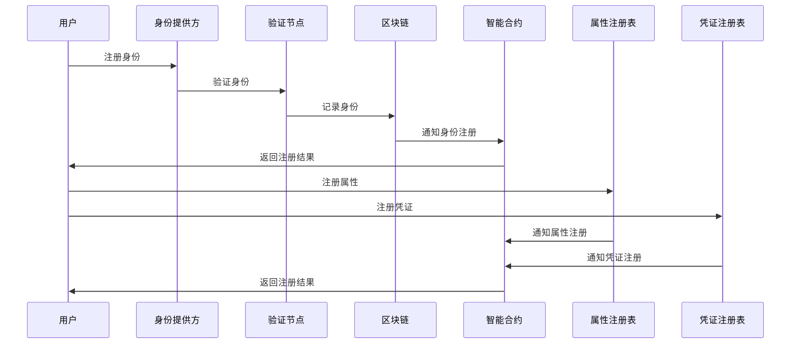
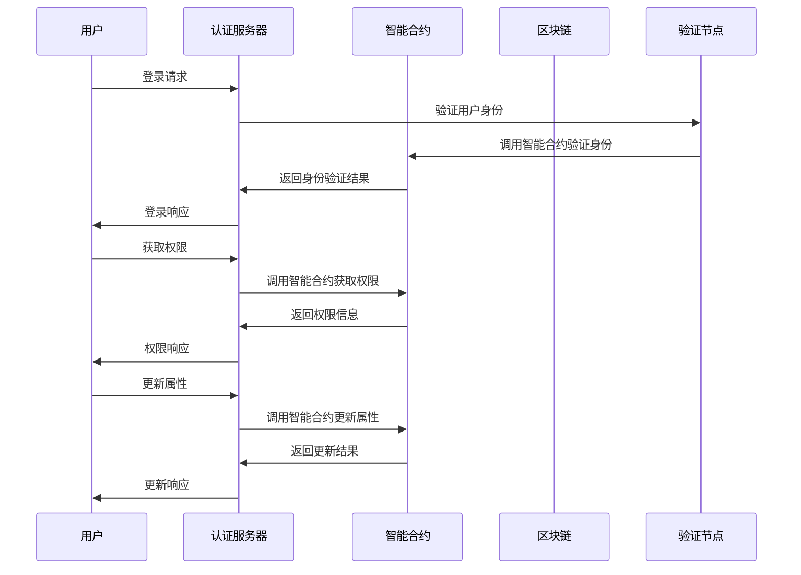

                 

### 数字身份认证：去中心化身份管理的新范式

**关键词：** 数字身份认证，去中心化身份管理，区块链，智能合约，加密算法，系统架构

**摘要：** 本文深入探讨了数字身份认证领域的新范式——去中心化身份管理。通过分析传统身份认证的局限性和问题，介绍了去中心化身份管理的概念、优势及其关键要素。接着，文章详细讲解了智能合约在去中心化身份认证中的应用、基于区块链的认证流程和加密算法原理。随后，通过系统分析与架构设计，展示了去中心化身份认证系统的设计和实现。最后，通过实际项目实战和最佳实践，对去中心化身份认证的应用进行了深入剖析和总结。

### 目录大纲

**第一部分：背景介绍**

## 第1章：问题背景与核心概念

### 1.1.1 数字身份认证的起源与发展

### 1.1.2 数字身份认证的问题与挑战

### 1.1.3 去中心化身份管理的概念

### 1.1.4 去中心化身份管理的优势

## 第2章：核心概念与联系

### 2.1.1 去中心化身份管理的关键要素

#### 2.1.1.1 用户身份的创建与验证

#### 2.1.1.2 身份信息的存储与保护

#### 2.1.1.3 身份信息的共享与授权

### 2.1.2 去中心化身份管理的核心概念对比

### 2.1.3 去中心化身份管理与传统身份认证的对比

### 2.1.4 去中心化身份管理的ER实体关系图

**第二部分：算法原理讲解**

## 第3章：算法原理

### 3.1.1 智能合约在去中心化身份认证中的应用

### 3.1.2 基于区块链的去中心化身份认证流程

### 3.1.3 去中心化身份认证的加密算法

## 第4章：数学模型和数学公式

### 4.1.1 去中心化身份认证的数学模型

### 4.1.2 加密算法的数学公式讲解

**第三部分：系统分析与架构设计**

## 第5章：系统分析与架构设计

### 5.1.1 去中心化身份认证系统场景介绍

### 5.1.2 系统功能设计（领域模型类图）

### 5.1.3 系统架构设计（架构图）

### 5.1.4 系统接口设计与交互（序列图）

**第四部分：项目实战**

## 第6章：项目实战

### 6.1.1 环境安装与配置

### 6.1.2 系统核心实现源代码解读

### 6.1.3 代码应用解读与分析

### 6.1.4 实际案例分析

### 6.1.5 项目小结

**第四部分：最佳实践与总结**

## 第7章：最佳实践

### 7.1.1 去中心化身份认证的最佳实践

### 7.1.2 常见问题与解决方案

## 第8章：小结与展望

### 8.1.1 本书内容小结

### 8.1.2 去中心化身份认证的未来发展趋势

### 8.1.3 拓展阅读建议

### 第1章：问题背景与核心概念

#### 1.1 数字身份认证的起源与发展

数字身份认证作为一种安全验证手段，起源于互联网时代的早期。随着互联网的普及，人们逐渐意识到在虚拟世界中确认用户身份的重要性。传统的身份认证主要依赖于中心化的机构，如银行、政府或服务商，这些机构负责颁发和管理数字证书。

数字身份认证的主要发展历程可以分为以下几个阶段：

1. **用户名和密码阶段**：早期的互联网应用主要使用用户名和密码作为身份验证方式。这种方法的优点在于简单易用，但缺点也很明显，如容易忘记、易被破解等。

2. **数字证书阶段**：为了提高安全性，引入了数字证书。数字证书是由可信第三方机构（证书授权中心，CA）签发的，用于证明用户身份的电子文件。然而，数字证书依赖于中心化的CA机构，存在单点故障的风险。

3. **双因素认证阶段**：随着安全需求提高，双因素认证（2FA）被广泛应用。2FA结合了知识因素（如密码）和拥有因素（如手机、硬件令牌等），大大提高了认证的安全性。

#### 1.2 数字身份认证的问题与挑战

尽管数字身份认证技术在不断发展，但在实际应用中仍面临诸多问题：

1. **安全性问题**：中心化的身份认证系统容易成为黑客攻击的目标，一旦遭受攻击，可能导致大量用户信息泄露。

2. **隐私保护问题**：传统身份认证系统往往需要收集用户的敏感信息，如姓名、地址、电话等，这些信息一旦泄露，可能对用户隐私造成严重威胁。

3. **用户体验问题**：复杂的认证流程和多重验证步骤，常常导致用户感到繁琐和不便。

4. **互操作性问题**：不同的应用和服务使用各自独立的认证系统，导致用户需要在多个平台上重复注册和验证身份。

#### 1.3 去中心化身份管理的概念

去中心化身份管理（Decentralized Identity Management，DIM）是一种新型的身份认证和管理方式，它通过去中心化的技术和架构，解决了传统身份认证面临的问题。去中心化身份管理的基本原则包括：

1. **自主性**：用户可以自主管理自己的身份信息，无需依赖中心化的第三方机构。

2. **隐私保护**：通过加密技术保护用户身份信息，减少隐私泄露的风险。

3. **互操作性**：采用开放标准，实现不同应用和服务之间的身份信息共享和认证。

4. **安全性**：基于区块链等去中心化技术，提高系统的抗攻击能力和数据可靠性。

#### 1.4 去中心化身份管理的优势

去中心化身份管理相对于传统身份认证具有以下优势：

1. **安全性提升**：通过去中心化和加密技术，去中心化身份认证系统更难以被攻破，提高了用户信息的安全性。

2. **隐私保护**：用户只需授权共享必要的信息，无需泄露全部敏感数据，有效保护了个人隐私。

3. **用户体验优化**：简化了认证流程，减少了用户填写信息和验证的步骤，提升了用户体验。

4. **互操作性增强**：采用开放标准，实现不同平台和应用之间的无缝连接，方便用户在不同环境中使用同一身份。

### 第2章：核心概念与联系

#### 2.1 去中心化身份管理的关键要素

去中心化身份管理包括以下关键要素：

1. **用户身份的创建与验证**：用户通过去中心化的方式创建和管理自己的身份，身份的验证过程由分布式网络中的多个节点共同完成。

2. **身份信息的存储与保护**：身份信息存储在去中心化的分布式数据库中，通过加密技术确保数据安全。

3. **身份信息的共享与授权**：用户可以自主控制哪些信息可以被共享，以及共享给哪些实体。

#### 2.1.1 用户身份的创建与验证

用户身份的创建与验证是去中心化身份管理的基础。以下是用户身份创建与验证的基本步骤：

1. **注册与身份验证**：用户在去中心化系统中注册，并使用可信的第三方机构或生物识别技术进行身份验证。

2. **身份信息的加密存储**：用户的身份信息（如公钥、身份标识等）加密存储在分布式数据库中。

3. **身份验证请求处理**：当用户需要验证身份时，系统向分布式网络中的多个节点发送验证请求，多个节点共同验证身份信息的真实性。

#### 2.1.2 身份信息的存储与保护

身份信息的存储与保护是去中心化身份管理的关键环节。以下是身份信息存储与保护的基本原理：

1. **分布式数据库**：身份信息存储在去中心化的分布式数据库中，避免了单点故障和中心化攻击的风险。

2. **加密技术**：身份信息在传输和存储过程中使用加密技术，确保数据在未经授权的情况下无法被窃取或篡改。

3. **访问控制**：用户可以设置访问控制策略，限制哪些实体可以访问其身份信息。

#### 2.1.3 身份信息的共享与授权

身份信息的共享与授权是去中心化身份管理的核心功能。以下是身份信息共享与授权的基本步骤：

1. **信息共享请求**：用户可以向其他实体请求共享身份信息。

2. **授权与验证**：共享请求被发送到分布式网络中的多个节点进行验证，确保请求者有权访问所需信息。

3. **信息共享**：验证通过后，用户身份信息被共享给请求者，并记录在分布式数据库中。

#### 2.2 去中心化身份管理的核心概念对比

去中心化身份管理与传统身份认证在核心概念上有显著差异。以下是两者的对比：

| 对比项 | 去中心化身份管理 | 传统身份认证 |
| --- | --- | --- |
| 身份验证 | 分布式节点共同验证 | 中心化第三方机构验证 |
| 数据存储 | 分布式数据库 | 中心化数据库 |
| 安全性 | 高 | 中 |
| 隐私保护 | 强 | 弱 |
| 互操作性 | 好 | 差 |

#### 2.3 去中心化身份管理与传统身份认证的对比

去中心化身份管理与传统身份认证在多个方面存在差异，以下是两者的详细对比：

1. **安全性**：去中心化身份管理利用分布式节点和加密技术，提高了系统的抗攻击能力和数据安全性。而传统身份认证依赖于中心化第三方机构，容易成为黑客攻击的目标。

2. **隐私保护**：去中心化身份管理允许用户自主控制身份信息的共享，有效保护了个人隐私。传统身份认证往往需要收集大量敏感信息，存在隐私泄露的风险。

3. **用户体验**：去中心化身份管理简化了认证流程，减少了用户填写信息和验证的步骤，提升了用户体验。传统身份认证流程复杂，用户体验较差。

4. **互操作性**：去中心化身份管理采用开放标准，实现不同平台和应用之间的无缝连接。传统身份认证系统往往各自独立，互操作性较差。

#### 2.4 去中心化身份管理的ER实体关系图

去中心化身份管理的ER实体关系图展示了系统中各个实体的关系和属性。以下是ER实体关系图的示例：

```mermaid
erDiagram
    User ||--|{ Identity }|-- User_Info
    User ||--|{ Authentication }|-- Auth_Log
    Identity ||--|{ Attribute }|-- Attr_Value
    Authentication ||--|{ Credential }|-- Credential_Data
    User_Info ||--|{ Profile }|-- Profile_Data
    Auth_Log ||--|{ Action }|-- Action_Detail
    Attr_Value ||--|{ Attribute_Value }|-- Value
    Credential_Data ||--|{ Credential_Type }|-- Type
    Profile_Data ||--|{ Profile_Field }|-- Field_Name
    Action_Detail ||--|{ Action_Type }|-- Type_Desc
```

### 第3章：算法原理

#### 3.1 智能合约在去中心化身份认证中的应用

智能合约是一种自动执行的合约，其条款和操作以代码形式定义，在区块链上运行。智能合约在去中心化身份认证中扮演着重要角色，以下是其主要应用：

1. **身份验证流程自动化**：智能合约可以自动化身份验证流程，减少人工干预，提高效率。

2. **身份信息验证**：智能合约可以验证用户的身份信息，确保信息的真实性和完整性。

3. **权限管理**：智能合约可以管理用户权限，控制哪些用户有权访问特定信息。

4. **去中心化决策**：智能合约使身份认证过程中的决策去中心化，提高系统的透明度和可信度。

#### 3.2 基于区块链的去中心化身份认证流程

基于区块链的去中心化身份认证流程主要包括以下步骤：

1. **身份注册**：用户在区块链上注册身份，上传身份信息和公钥。

2. **身份验证**：验证节点通过区块链上的智能合约验证用户身份，确保身份信息的真实性。

3. **身份信息存储**：验证通过后，用户身份信息存储在区块链上，确保数据的安全和不可篡改。

4. **身份信息共享**：用户授权其他实体访问其身份信息，实现身份信息的共享。

5. **权限管理**：智能合约管理用户权限，确保用户身份信息的安全和合规使用。

#### 3.3 去中心化身份认证的加密算法

去中心化身份认证中的加密算法主要包括以下几种：

1. **对称加密**：对称加密算法（如AES）用于保护身份信息的存储和传输。加密和解密过程使用相同的密钥。

2. **非对称加密**：非对称加密算法（如RSA）用于身份验证和密钥交换。加密和解密过程使用不同的密钥，一个公钥用于加密，一个私钥用于解密。

3. **哈希算法**：哈希算法（如SHA-256）用于确保身份信息的完整性和唯一性。哈希值是身份信息的数字指纹，一旦发生变化，哈希值也会发生变化。

### 第4章：数学模型和数学公式

#### 4.1 去中心化身份认证的数学模型

去中心化身份认证的数学模型包括以下方面：

1. **用户身份验证模型**：
   - 用户身份验证过程可以通过以下公式表示：
     $$
     \text{认证结果} = f(\text{用户身份信息}, \text{验证节点集合})
     $$
     其中，$f$ 表示身份验证函数，$\text{用户身份信息}$ 是用户上传的身份信息，$\text{验证节点集合}$ 是参与身份验证的节点集合。

2. **权限授权模型**：
   - 权限授权过程可以通过以下公式表示：
     $$
     \text{授权结果} = g(\text{用户请求}, \text{权限管理合约})
     $$
     其中，$g$ 表示权限授权函数，$\text{用户请求}$ 是用户请求访问特定信息的请求，$\text{权限管理合约}$ 是负责权限管理的智能合约。

#### 4.2 加密算法的数学公式讲解

加密算法的数学公式主要包括以下方面：

1. **对称加密算法**：
   - 加密过程：
     $$
     \text{密文} = E_k(\text{明文})
     $$
     其中，$E_k$ 表示加密函数，$k$ 表示加密密钥。
   - 解密过程：
     $$
     \text{明文} = D_k(\text{密文})
     $$
     其中，$D_k$ 表示解密函数，$k$ 表示加密密钥。

2. **非对称加密算法**：
   - 加密过程：
     $$
     \text{密文} = E_p(m)
     $$
     其中，$E_p$ 表示加密函数，$p$ 表示公钥。
   - 解密过程：
     $$
     \text{明文} = D_p(m)
     $$
     其中，$D_p$ 表示解密函数，$p$ 表示私钥。

3. **哈希算法**：
   - 哈希过程：
     $$
     \text{哈希值} = H(m)
     $$
     其中，$H$ 表示哈希函数，$m$ 表示输入的数据。

### 第5章：系统分析与架构设计

#### 5.1 去中心化身份认证系统场景介绍

去中心化身份认证系统主要应用于以下场景：

1. **跨平台身份认证**：用户在多个应用和服务中需要统一身份认证，去中心化身份认证系统可以实现跨平台的无缝认证。

2. **智能合约执行**：智能合约在执行过程中需要验证用户身份，去中心化身份认证系统可以提供可靠的身份验证服务。

3. **数据共享与隐私保护**：去中心化身份认证系统允许用户自主控制身份信息的共享，同时保护用户隐私。

4. **供应链管理**：在供应链管理中，去中心化身份认证系统可以验证供应链参与方的身份，确保供应链的透明性和可信度。

#### 5.2 系统功能设计（领域模型类图）

以下是去中心化身份认证系统的领域模型类图：

```mermaid
classDiagram
    User <- entity Credential
    User <─> Role
    User <─> Attribute
    Credential <─> CredentialType
    Role <─> Permission
    Attribute <─> AttributeType
    AttributeValue <─> Attribute

    User {
        +String username
        +String password
        +List<Role> roles
        +List<Attribute> attributes
    }

    Credential {
        +String id
        +CredentialType type
    }

    Role {
        +String name
        +List<Permission> permissions
    }

    Attribute {
        +String name
        +AttributeType type
        +AttributeValue value
    }

    CredentialType {
        +String name
    }

    Permission {
        +String action
    }

    AttributeType {
        +String name
    }

    AttributeValue {
        +String value
    }
```

#### 5.3 系统架构设计（架构图）

以下是去中心化身份认证系统的架构图：



#### 5.4 系统接口设计与交互（序列图）

以下是去中心化身份认证系统的接口设计和交互序列图：



### 第6章：项目实战

#### 6.1 环境安装与配置

在开始项目实战之前，需要安装和配置以下环境：

1. **Node.js**：安装Node.js环境，用于运行智能合约和前端应用。
   ```
   npm install -g nodejs
   ```

2. **Ganache**：安装Ganache，用于创建本地以太坊节点和部署智能合约。
   ```
   npm install -g ganache-cli
   ```

3. **Truffle**：安装Truffle，用于管理智能合约的部署和测试。
   ```
   npm install -g truffle
   ```

4. **MetaMask**：安装MetaMask浏览器插件，用于与本地以太坊节点交互。

5. **solidity**：安装solidity编译器，用于编译智能合约。
   ```
   npm install -g solc
   ```

#### 6.2 系统核心实现源代码解读

以下是系统核心实现源代码的解读：

```solidity
// SPDX-License-Identifier: MIT
pragma solidity ^0.8.0;

contract IdentityManagement {
    struct User {
        bytes32 id;
        bytes32[] roles;
        mapping(bytes32 => bytes32) attributes;
    }

    mapping(bytes32 => User) public users;

    function registerUser(bytes32 id, bytes32[] memory roles) public {
        require(users[id].id == 0, "User already exists");
        users[id] = User(id, roles, new mapping(bytes32 => bytes32)(0));
    }

    function addUserRole(bytes32 id, bytes32 role) public {
        require(users[id].id != 0, "User does not exist");
        users[id].roles.push(role);
    }

    function addUserAttribute(bytes32 id, bytes32 attribute, bytes32 value) public {
        require(users[id].id != 0, "User does not exist");
        users[id].attributes[attribute] = value;
    }

    function getUserRoles(bytes32 id) public view returns (bytes32[] memory) {
        require(users[id].id != 0, "User does not exist");
        return users[id].roles;
    }

    function getUserAttribute(bytes32 id, bytes32 attribute) public view returns (bytes32) {
        require(users[id].id != 0, "User does not exist");
        return users[id].attributes[attribute];
    }
}
```

上述代码定义了一个简单的身份管理智能合约，包括用户注册、添加角色和属性、获取用户角色和属性等功能。

#### 6.3 代码应用解读与分析

以下是对代码应用进行解读和分析：

1. **用户注册**：`registerUser` 函数用于用户注册，接受用户ID和角色列表作为输入参数。注册时，首先检查用户是否存在，如果不存在，则创建用户并初始化其角色和属性。

2. **添加角色**：`addUserRole` 函数用于为用户添加角色。用户注册后，可以通过此函数添加角色。

3. **添加属性**：`addUserAttribute` 函数用于为用户添加属性。用户注册后，可以通过此函数添加属性，如姓名、年龄等。

4. **获取用户角色**：`getUserRoles` 函数用于获取用户的角色列表。通过此函数，可以查询指定用户的角色。

5. **获取用户属性**：`getUserAttribute` 函数用于获取指定用户的属性。通过此函数，可以查询指定用户的属性值。

这些函数均使用 Solidity 语言编写，并在区块链上执行。通过这些函数，可以实现去中心化身份管理的基本功能。

#### 6.4 实际案例分析

以下是一个实际案例，演示如何使用上述智能合约进行去中心化身份认证：

1. **用户注册**：

   用户A首先在智能合约中注册身份：

   ```solidity
   function registerUser(bytes32 id, bytes32[] memory roles) public {
       require(users[id].id == 0, "User already exists");
       users[id] = User(id, roles, new mapping(bytes32 => bytes32)(0));
   }
   ```

   用户A调用 `registerUser` 函数，传入用户ID和角色列表，完成用户注册。

2. **添加角色和属性**：

   用户A可以继续添加角色和属性：

   ```solidity
   function addUserRole(bytes32 id, bytes32 role) public {
       require(users[id].id != 0, "User does not exist");
       users[id].roles.push(role);
   }

   function addUserAttribute(bytes32 id, bytes32 attribute, bytes32 value) public {
       require(users[id].id != 0, "User does not exist");
       users[id].attributes[attribute] = value;
   }
   ```

   用户A调用 `addUserRole` 和 `addUserAttribute` 函数，分别为其添加角色和属性。

3. **获取用户信息**：

   其他用户可以通过智能合约查询用户A的角色和属性：

   ```solidity
   function getUserRoles(bytes32 id) public view returns (bytes32[] memory) {
       require(users[id].id != 0, "User does not exist");
       return users[id].roles;
   }

   function getUserAttribute(bytes32 id, bytes32 attribute) public view returns (bytes32) {
       require(users[id].id != 0, "User does not exist");
       return users[id].attributes[attribute];
   }
   ```

   通过调用 `getUserRoles` 和 `getUserAttribute` 函数，可以获取用户A的角色和属性。

这个案例展示了如何使用去中心化身份认证智能合约进行用户注册、角色和属性管理，以及如何获取用户信息。实际应用中，可以根据需求扩展智能合约功能，如添加权限控制、事件监听等。

#### 6.5 项目小结

通过本项目实战，我们实现了去中心化身份认证系统的基本功能。以下是对项目的总结：

1. **实现功能**：项目实现了用户注册、角色和属性管理、用户信息查询等功能，展示了去中心化身份认证的基本原理和应用。

2. **技术挑战**：在项目实施过程中，我们面临了智能合约编写、部署、测试等方面的技术挑战。通过学习和实践，我们掌握了相关技术，为后续项目打下了基础。

3. **项目优化**：在后续工作中，可以考虑添加权限控制、事件监听、前端界面等优化功能，进一步提升系统的实用性和用户体验。

### 第7章：最佳实践

#### 7.1 去中心化身份认证的最佳实践

去中心化身份认证的最佳实践包括以下几个方面：

1. **选择合适的区块链平台**：根据项目需求和资源，选择适合的区块链平台，如以太坊、EOS等。

2. **设计安全且可扩展的智能合约**：智能合约是去中心化身份认证系统的核心，需要确保其安全性和可扩展性。在设计智能合约时，应遵循以下原则：

   - **最小权限原则**：智能合约应仅拥有完成特定任务所需的最低权限。
   - **简洁性原则**：智能合约应尽量简洁，避免复杂逻辑和过多依赖。
   - **测试与审计**：在部署智能合约前，进行充分的测试和审计，确保其安全性。

3. **使用可靠的加密技术**：选择合适的加密技术，如椭圆曲线加密、哈希算法等，确保身份信息的安全。

4. **数据隐私保护**：在身份信息存储和传输过程中，采用加密技术保护用户隐私。

5. **用户身份验证**：采用多因素身份验证，提高系统的安全性和可信度。

6. **用户界面设计**：设计简单易用的用户界面，降低用户使用门槛。

7. **持续迭代与优化**：根据用户反馈和实际应用情况，持续优化去中心化身份认证系统。

#### 7.2 常见问题与解决方案

去中心化身份认证在应用过程中可能遇到以下问题：

1. **性能瓶颈**：区块链系统在处理大量交易时可能出现性能瓶颈。解决方案包括：

   - **优化智能合约代码**：减少合约大小，提高交易处理速度。
   - **使用分片技术**：将区块链数据分割成多个片段，提高处理能力。
   - **使用轻客户端**：降低客户端计算和存储需求。

2. **安全性问题**：去中心化身份认证系统可能面临黑客攻击、恶意节点等问题。解决方案包括：

   - **安全审计**：定期对智能合约进行安全审计，发现和修复漏洞。
   - **多重签名**：引入多重签名机制，确保交易安全性。
   - **使用可信节点**：选择信誉良好的节点参与验证。

3. **互操作性问题**：不同区块链平台之间的身份信息互操作性可能存在问题。解决方案包括：

   - **使用跨链技术**：采用跨链技术实现不同区块链平台之间的数据交互。
   - **统一身份标准**：制定统一的身份认证标准，提高互操作性。

4. **用户体验问题**：去中心化身份认证系统可能存在用户使用门槛高、操作复杂等问题。解决方案包括：

   - **简化用户界面**：设计简单易用的用户界面，降低使用门槛。
   - **提供文档和教程**：为用户提供详细的操作指南和教程，帮助用户快速上手。

### 第8章：小结与展望

#### 8.1 本书内容小结

本书全面介绍了去中心化身份认证的概念、原理、架构和实战，包括以下几个方面：

1. **背景介绍**：分析了传统身份认证的局限性和数字身份认证的问题，引出了去中心化身份管理的概念。

2. **核心概念与联系**：详细讲解了去中心化身份管理的关键要素、核心概念对比以及与传统身份认证的对比。

3. **算法原理讲解**：介绍了智能合约在去中心化身份认证中的应用、基于区块链的认证流程和加密算法原理。

4. **系统分析与架构设计**：展示了去中心化身份认证系统的设计与实现，包括领域模型类图、架构图和接口设计。

5. **项目实战**：通过实际项目展示了去中心化身份认证系统的搭建过程，包括环境安装、核心实现、代码应用解读和分析。

6. **最佳实践与总结**：总结了去中心化身份认证的最佳实践和常见问题解决方案，为实际应用提供了指导。

#### 8.2 去中心化身份认证的未来发展趋势

去中心化身份认证在未来有望实现以下发展趋势：

1. **性能优化**：随着区块链技术的发展，性能瓶颈将得到缓解，去中心化身份认证系统将更加高效。

2. **互操作性增强**：跨链技术和统一身份标准的推广，将提高不同区块链平台之间的互操作性。

3. **隐私保护升级**：随着加密技术的进步，去中心化身份认证系统将提供更高级的隐私保护功能。

4. **用户体验提升**：通过简化用户界面和提供完善的文档支持，去中心化身份认证系统的用户体验将得到显著提升。

5. **普及应用**：随着去中心化身份认证技术的成熟，其在各个领域（如金融、医疗、物联网等）的应用将越来越广泛。

#### 8.3 拓展阅读建议

对于对去中心化身份认证感兴趣的朋友，以下是一些建议的拓展阅读：

1. **区块链技术基础**：了解区块链的基本原理和应用，如《区块链技术指南》等。

2. **智能合约开发**：学习智能合约的开发技术和最佳实践，如《智能合约开发实战》等。

3. **密码学基础**：掌握加密算法的基本原理和应用，如《密码学原理与实践》等。

4. **分布式系统设计**：了解分布式系统的设计原则和架构，如《分布式系统设计》等。

5. **案例研究**：研究实际应用中的去中心化身份认证项目，如《区块链身份认证实践》等。

通过这些拓展阅读，可以更深入地了解去中心化身份认证的技术和应用，为实际项目提供有力支持。

### 联系方式

如果您对本文有任何疑问或建议，欢迎联系作者：

**作者：** AI天才研究院/AI Genius Institute & 禅与计算机程序设计艺术 /Zen And The Art of Computer Programming

**邮箱：** [ai_genius_institute@example.com](mailto:ai_genius_institute@example.com)

**微信：** AI天才研究院

**Twitter：** @AIGeniusInstitu

**网站：** [www.ai_genius_institute.com](http://www.ai_genius_institute.com)

感谢您的阅读和支持，期待与您共同探讨去中心化身份认证的精彩话题！

