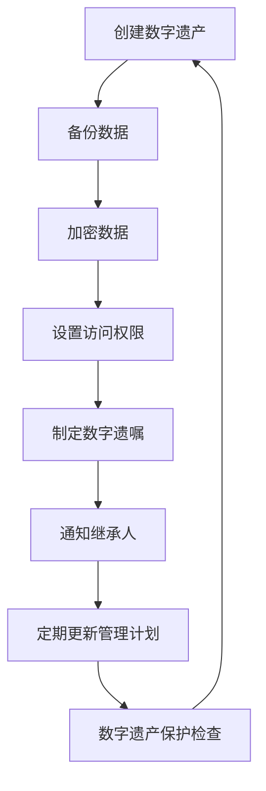

                 

### 文章标题

# 数字遗产的意义：我们留给后代的虚拟财富

### 文章关键词

- 数字遗产
- 虚拟财富
- 后代传承
- 数据管理
- 法律保护

### 摘要

本文旨在探讨数字遗产在现代社会中的重要性以及其对于未来世代的影响。随着信息技术的飞速发展，数字遗产已成为我们生活中不可或缺的一部分。它不仅包括个人的电子文件、社交媒体账号、金融信息等，还涵盖了企业的数据库、客户资料、知识产权等。本文将从定义、管理、保护、影响和未来展望五个方面，系统性地分析数字遗产的内涵及其对人类社会的重要意义。通过深入探讨数字遗产的挑战与机遇，本文希望能够为读者提供一个全面的视角，启发我们对这一新兴领域的思考。

### 引言与背景

#### 1.1 问题背景

在21世纪的今天，随着互联网技术的普及和大数据时代的来临，我们逐渐进入了一个高度数字化的社会。在这个时代，人们的生活、工作和娱乐都离不开数字化的产品和服务。电子邮件、社交媒体、在线支付、云计算等数字技术的广泛应用，使得我们的日常生活被深深地打上了数字化的烙印。然而，数字化的便利也带来了一系列新的问题和挑战，其中一个重要的问题就是数字遗产。

数字遗产，顾名思义，就是我们在数字化生活中留下的各种数字资产和信息。这些数字资产和信息可能包括个人的电子文件、社交媒体账号、电子邮件、金融信息、医疗记录等。随着互联网的普及和云计算的发展，我们的数字遗产已经不再局限于个人层面，而是扩展到了企业、政府乃至整个社会层面。例如，企业的重要客户数据、研发成果、商业秘密等，都是企业的数字遗产。而政府的数字遗产则包括了政策文件、公共数据库、网络基础设施等。

#### 1.2 问题描述

数字遗产的问题在于，它不仅是我们生活中的一部分，也是我们留给后代的财富。然而，如何有效地管理和保护这些数字遗产，确保它们能够被我们的后代所继承和利用，成为了一个亟待解决的问题。首先，数字遗产的管理和传承面临着技术层面的挑战。随着技术的不断进步，许多早期的数字文件可能因为格式不兼容而难以读取。其次，法律和伦理层面的挑战也不容忽视。如何界定数字遗产的所有权、使用权和继承权，如何平衡个人隐私与数据共享之间的关系，这些都是需要深入探讨的问题。

#### 1.3 问题的解决方法

解决数字遗产问题需要多方面的努力。首先，在技术层面，我们需要开发更加兼容和持久的数字文件格式，确保数字遗产能够在未来被顺利读取。其次，在法律层面，我们需要建立完善的数字遗产法律框架，明确数字遗产的所有权、使用权和继承权。最后，在伦理层面，我们需要引导公众正确认识和对待数字遗产，培养数字素养，增强数据保护意识。

#### 1.4 边界与外延

数字遗产的边界和范围是一个相对复杂的问题。从个人层面来看，数字遗产可能包括个人的所有电子设备、云存储服务、社交媒体账号等。从企业层面来看，数字遗产可能包括企业的所有数字化资产，如数据库、软件代码、知识产权等。从社会层面来看，数字遗产可能包括政府的所有数字化信息，如政策文件、公共数据库、网络基础设施等。

#### 1.5 概念结构与核心要素组成

数字遗产的概念结构可以分解为三个核心要素：数字资产、数字信息和数字交互。数字资产是数字遗产的核心，它包括个人的数字文件、社交媒体账号、金融信息等。数字信息则是数字遗产的载体，它包括了所有与数字资产相关的信息，如文件格式、存储位置、访问权限等。数字交互则是数字遗产的动态部分，它包括了数字资产的所有操作，如读取、修改、共享等。

#### 1.6 本章小结

本章主要介绍了数字遗产的背景和重要性。随着数字化生活的普及，数字遗产已经成为了我们生活中不可或缺的一部分。数字遗产不仅包括个人的电子文件和社交媒体账号，还涵盖了企业的数据库和政府的数字化信息。如何有效地管理和保护这些数字遗产，确保它们能够被我们的后代所继承和利用，是一个亟待解决的问题。通过本章的介绍，我们为后续章节的分析和探讨奠定了基础。

### 数字遗产的定义与重要性

#### 2.1 数字遗产的概念

数字遗产，从广义上讲，是指我们在数字化生活中所创造的、拥有和使用的所有数字资产和信息。这些数字资产和信息可能包括个人的电子文件、社交媒体账号、电子邮件、金融信息、医疗记录等，以及企业的数据库、软件代码、知识产权等。数字遗产不仅是一个个人的财富，也是一个社会的财富，它承载了人类在数字化时代所积累的知识和经验。

数字遗产可以进一步分为以下几类：

1. **个人数字遗产**：包括个人的数字文件、社交媒体账号、电子邮件、照片、视频等。这些数字文件可能是个人生活、工作、娱乐等各个方面的记录，具有重要的个人价值和纪念意义。

2. **企业数字遗产**：包括企业的数据库、客户资料、商业秘密、知识产权、软件代码等。这些数字资产是企业的重要资产，对于企业的生存和发展具有关键作用。

3. **政府数字遗产**：包括政府的政策文件、公共数据库、网络基础设施、信息安全系统等。这些数字资产是政府履行职能、服务社会的重要支撑。

#### 2.2 数字遗产的属性

数字遗产具有以下几个显著的属性：

1. **持久性**：与传统的物理遗产相比，数字遗产具有更高的持久性。只要数字设备和网络基础设施保持运行，数字遗产就可以被存储和访问。

2. **多样性**：数字遗产的形式多样，包括文字、图片、音频、视频、软件等多种类型。这种多样性使得数字遗产能够承载和传递丰富的信息和知识。

3. **动态性**：数字遗产是动态的，它可以被不断更新、修改和共享。这种动态性使得数字遗产能够适应不断变化的社会需求和技术进步。

4. **虚拟性**：数字遗产存在于虚拟空间中，它的存在和表现形式依赖于数字设备和网络技术。这种虚拟性使得数字遗产的管理和保护面临着新的挑战。

#### 2.3 数字遗产的重要性

数字遗产的重要性体现在以下几个方面：

1. **文化传承**：数字遗产是我们文化传承的重要组成部分。通过数字遗产，我们可以记录和保存人类社会的知识和智慧，为后代提供宝贵的文化财富。

2. **经济价值**：数字遗产具有巨大的经济价值。例如，企业的数字资产可以转化为商业利润，个人的数字作品可以成为版权交易的对象。此外，数字遗产的合理管理和利用还可以带动相关产业的发展。

3. **社会管理**：数字遗产对于政府和社会管理具有重要意义。例如，政府的数字遗产可以帮助提高政策制定和公共服务的效率，数字资产的管理和利用可以促进社会信用体系建设。

4. **个人隐私**：数字遗产涉及到个人隐私和数据安全。合理管理和保护数字遗产，可以确保个人隐私不受侵犯，数据安全得到保障。

#### 2.4 比较分析

将数字遗产与传统遗产进行比较，可以发现两者在形式、管理和影响等方面存在显著差异。

1. **形式差异**：传统遗产主要指物质财富，如房产、古董、艺术品等。而数字遗产则是以数字形式存在的资产和信息。

2. **管理难度**：数字遗产的管理难度较大，需要应对技术变化、数据安全、隐私保护等问题。而传统遗产的管理相对简单，主要涉及物理保护和维护。

3. **影响范围**：数字遗产的影响范围更广，不仅涉及个人和企业，还涉及社会和国家层面。传统遗产的影响范围相对较小，主要限于个人和家庭。

4. **传承方式**：传统遗产的传承通常通过遗嘱、继承等法律手段实现。而数字遗产的传承则需要借助技术手段和法律框架。

#### 2.5 本章小结

通过对数字遗产的概念、属性和重要性的分析，我们可以看到，数字遗产已经成为现代社会中不可或缺的一部分。它不仅承载了我们的个人记忆和文化遗产，还具有巨大的经济价值和社会意义。如何有效管理和保护数字遗产，确保其能够被我们的后代所继承和利用，是一个值得我们深入探讨的重要课题。在接下来的章节中，我们将进一步探讨数字遗产的管理与保护策略，以及其对未来社会的影响。

### 数字遗产的核心要素

#### 3.1 数字资产

数字资产是数字遗产的重要组成部分，它指的是在数字化环境中创造、积累和拥有的各类资产。数字资产可以进一步细分为以下几类：

1. **个人数字资产**：包括个人的电子文件、电子邮件、社交媒体账号、照片、视频等。这些数字资产通常具有个人价值和纪念意义，如个人日记、家庭照片、工作文档等。

2. **企业数字资产**：包括企业的数据库、客户资料、商业秘密、知识产权、软件代码等。这些数字资产是企业运营和发展的重要支撑，如客户关系管理系统、研发数据库、商标专利等。

3. **政府数字资产**：包括政府的政策文件、公共数据库、网络基础设施、信息安全系统等。这些数字资产对于政府履行职能、服务社会具有重要意义，如公共安全数据库、社会保障系统、交通管理系统等。

#### 3.2 数字信息

数字信息是数字遗产的载体，它指的是在数字化环境中生成、存储和传输的各种数据和信息。数字信息可以进一步细分为以下几类：

1. **结构化数据**：指的是以固定格式存储的数据，如数据库中的表记录、XML文档等。这些数据通常用于企业的业务运营和管理。

2. **非结构化数据**：指的是无固定格式的数据，如文本文件、图片、音频、视频等。这些数据通常用于个人的娱乐和社交活动。

3. **半结构化数据**：指的是部分有固定格式、部分无固定格式的数据，如JSON文档、日志文件等。这些数据通常用于混合应用场景。

#### 3.3 数字交互

数字交互是数字遗产的动态部分，它指的是在数字化环境中进行的各种数字操作和交互。数字交互可以进一步细分为以下几类：

1. **用户操作**：包括用户在使用数字产品或服务时的各种操作，如点击、输入、拖拽等。

2. **设备交互**：包括数字设备之间的交互，如计算机与手机、平板之间的数据同步、共享等。

3. **网络通信**：包括数字设备通过网络进行的数据传输和通信，如Web页面请求、电子邮件发送、社交媒体分享等。

#### 3.4 数字资产、数字信息和数字交互的关系

数字资产、数字信息和数字交互之间存在着密切的关联：

1. **数字资产**是数字遗产的基础，它是我们在数字化环境中创造和积累的各类资产。

2. **数字信息**是数字资产的载体，它承载了数字资产的数据内容。

3. **数字交互**是数字资产的动态表现，它是我们与数字资产进行互动和操作的方式。

通过数字资产、数字信息和数字交互的有机结合，我们能够实现数字遗产的存储、传输和使用。例如，个人数字文件存储在云服务器上，通过互联网进行传输，最终在用户的电脑或手机上显示和操作。这一过程就是数字资产、数字信息和数字交互的典型表现。

#### 3.5 本章小结

通过对数字遗产的核心要素——数字资产、数字信息和数字交互的分析，我们可以更深入地理解数字遗产的本质和特点。数字资产、数字信息和数字交互共同构成了数字遗产的基本框架，它们在数字化生活中发挥着至关重要的作用。在接下来的章节中，我们将进一步探讨数字遗产的管理与保护，以及其对未来社会的影响。

### 数字遗产的挑战与机遇

#### 4.1 挑战

数字遗产的发展面临着多方面的挑战，这些挑战既包括技术层面的，也包括法律和伦理层面的。

1. **技术挑战**：

   - **数据格式不兼容**：随着技术的发展，早期的数字文件格式可能因为技术过时而难以读取。例如，一些老旧的文档格式可能需要专门的软件才能打开，而随着软件的更新换代，这些格式可能逐渐消失。
   
   - **数据安全与隐私**：数字遗产涉及到大量的个人和企业敏感信息，如金融数据、健康记录、商业秘密等。如何确保这些数据在存储、传输和使用过程中的安全性，是一个巨大的挑战。
   
   - **数据冗余与冗长**：在数字化过程中，大量的数据被生成和存储，如何有效地管理和利用这些数据，避免数据冗余和冗长，也是一个重要的技术问题。

2. **法律挑战**：

   - **所有权界定**：数字遗产的所有权问题尚未有明确的法律规定，特别是在跨国和跨平台的情境下。如何界定数字遗产的所有权，确保合法继承和转移，是一个复杂的法律问题。
   
   - **法律适用性**：随着技术的发展，新的法律问题层出不穷。例如，数字遗产的继承权、知识产权的保护等，需要制定相应的法律法规来应对。
   
   - **跨国法律冲突**：不同国家在数字遗产的法律规定上存在差异，这可能导致跨国数字遗产管理的困境。如何协调不同国家的法律，确保数字遗产的合法管理，是一个亟待解决的问题。

3. **伦理挑战**：

   - **隐私保护**：数字遗产涉及到大量的个人隐私信息，如何在保障个人隐私的同时，合理利用这些信息，是一个重要的伦理问题。
   
   - **数据共享与透明度**：数字遗产的管理涉及到数据共享和透明度问题。如何在保护个人隐私的前提下，实现数据共享，提高社会透明度，是一个需要平衡的伦理问题。

#### 4.2 机遇

尽管数字遗产面临诸多挑战，但它也带来了巨大的机遇，这些机遇不仅体现在技术发展上，也体现在经济和社会层面。

1. **技术发展**：

   - **数据存储技术**：随着云计算和大数据技术的发展，数据存储技术不断进步，使得海量数字遗产的存储和管理变得更加高效和可靠。
   
   - **加密技术**：加密技术的发展为数字遗产的安全提供了强有力的保障，确保敏感信息在传输和存储过程中的安全性。
   
   - **人工智能**：人工智能技术在数字遗产的管理和利用中发挥着越来越重要的作用，如自动化数据分类、数据挖掘、智能搜索等。

2. **经济机遇**：

   - **数字资产交易**：随着数字资产价值的提升，数字资产交易市场逐渐成熟，为个人和企业提供了新的盈利模式。
   
   - **数字遗产管理服务**：随着数字遗产管理需求的增加，专业的数字遗产管理服务市场潜力巨大，为企业和个人提供专业化的管理服务。
   
   - **知识产权保护**：数字遗产中的知识产权保护为企业和个人提供了新的收入来源，如版权交易、专利授权等。

3. **社会机遇**：

   - **文化传承**：数字遗产为我们提供了记录和传承文化的新途径，有助于保护和传承人类的文化遗产。
   
   - **社会管理**：数字遗产在政府和社会管理中发挥着越来越重要的作用，如公共安全、社会治理、公共服务等。
   
   - **个人隐私保护**：随着数字遗产管理技术的发展，个人隐私保护水平得到提高，有助于构建更加安全和可信的数字社会。

#### 4.3 本章小结

数字遗产的发展既面临着巨大的挑战，也带来了无限的机遇。在技术层面，数据格式不兼容、数据安全与隐私、数据冗余等问题需要我们不断探索解决方案。在法律层面，所有权界定、法律适用性、跨国法律冲突等问题需要我们建立和完善相关法律法规。在伦理层面，隐私保护、数据共享与透明度等问题需要我们进行深入思考和实践。然而，随着技术的不断进步和社会的不断发展，数字遗产的机遇也日益显现，它不仅为我们提供了新的经济和社会价值，也为人类文化的传承和发展提供了新的途径。通过共同努力，我们有望克服挑战，充分利用机遇，推动数字遗产的健康发展。

### 数字遗产管理概述

#### 5.1 数字遗产管理的目标

数字遗产管理的主要目标包括确保数字遗产的安全、可靠性和可访问性。具体来说，这些目标可以分为以下几个方面：

1. **安全性**：确保数字遗产在存储、传输和使用过程中的安全，防止数据泄露、篡改和丢失。这需要采用先进的数据加密技术和安全协议，确保敏感信息得到有效保护。

2. **可靠性**：确保数字遗产能够在长时间内保持可用性和可访问性。这需要采用稳定的存储技术和备份策略，确保数字遗产在技术更新和设备更换时不会丢失。

3. **可访问性**：确保数字遗产能够被合法的继承人或使用者方便地访问和使用。这需要建立完善的数字遗产访问控制机制，确保只有授权用户才能访问和操作数字遗产。

4. **可持续性**：确保数字遗产能够适应未来技术变化和社会需求，实现长期管理和利用。这需要不断更新数字遗产的管理策略和技术手段，以适应新技术的发展。

#### 5.2 数字遗产管理的原则

为了实现数字遗产管理的目标，我们需要遵循以下几项基本原则：

1. **全面性**：数字遗产管理需要覆盖所有相关的数字资产和信息，确保没有遗漏。

2. **安全性**：数字遗产管理必须确保数字资产和信息的安全性，防止未经授权的访问和操作。

3. **可靠性**：数字遗产管理需要采用可靠的存储和备份技术，确保数字资产和信息的长期保存。

4. **灵活性**：数字遗产管理需要具备一定的灵活性，能够适应不同的管理需求和场景。

5. **合规性**：数字遗产管理必须符合相关法律法规和标准，确保合法合规。

6. **可持续性**：数字遗产管理需要具备长期视角，确保数字遗产的长期保存和利用。

#### 5.3 数字遗产管理的现状与趋势

目前，全球范围内数字遗产管理已经取得了显著的进展，但也存在一些问题和挑战。

1. **现状**：

   - **技术成熟度**：数字遗产管理技术在数据加密、存储备份、访问控制等方面已经相当成熟，能够满足基本的管理需求。
   
   - **法律法规**：尽管一些国家和地区已经制定了数字遗产管理的相关法律法规，但全球范围内尚未形成统一的法律框架，跨国数字遗产管理仍面临较大挑战。
   
   - **实践应用**：数字遗产管理在个人和企业层面已有一定实践，但在政府层面仍需进一步推广。

2. **趋势**：

   - **技术进步**：随着云计算、大数据、人工智能等技术的发展，数字遗产管理技术将更加先进和智能化。
   
   - **法律完善**：随着数字遗产管理需求的增加，全球范围内的法律法规将逐步完善，为数字遗产管理提供更加坚实的法律保障。
   
   - **实践推广**：数字遗产管理将逐渐成为社会各界的共识，其在个人、企业和政府层面的应用将更加广泛。

#### 5.4 本章小结

数字遗产管理是确保数字遗产安全、可靠和可持续利用的关键环节。通过明确数字遗产管理的目标、原则和现状与趋势，我们可以更好地理解数字遗产管理的内涵和重要性。在接下来的章节中，我们将进一步探讨数字遗产保护的法律框架和技术手段，以期为数字遗产管理提供全面的解决方案。

### 数字遗产保护的法律框架

#### 6.1 国际法规

随着数字遗产在全球范围内的重要性日益凸显，各国和国际组织开始逐步制定和实施相关法律和规定，以保护数字遗产。以下是几个具有代表性的国际法规：

1. **联合国国际遗产行动计划**（United Nations Educational, Scientific and Cultural Organization, UNESCO）：

   - **《数字遗产保护指南》**：UNESCO在2013年发布了《数字遗产保护指南》，旨在帮助各国制定数字遗产保护政策，确保数字遗产的可持续管理和保护。

2. **欧洲联盟**（European Union, EU）：

   - **《数字单一市场战略》**：欧盟在2015年提出了《数字单一市场战略》，其中包含了一系列措施，旨在促进数字遗产的保护和利用，包括数据共享、知识产权保护等。

3. **美国**：

   - **《数字千年版权法》**（Digital Millennium Copyright Act, DMCA）：DMCA于1998年通过，旨在保护数字作品的版权，同时规定了数字遗产的合法访问和利用。

4. **澳大利亚**：

   - **《数字遗产法》**（Digital Legacy Act）：澳大利亚于2018年提出了《数字遗产法》，旨在为数字遗产的管理和继承提供法律支持。

#### 6.2 国内法规

不同国家和地区根据自己的具体情况，制定了相应的数字遗产保护法律法规。以下是一些主要国家和地区的数字遗产保护法律：

1. **中国**：

   - **《中华人民共和国网络安全法》**：该法于2017年通过，明确了对网络信息安全的保护要求，为数字遗产保护提供了法律基础。

   - **《中华人民共和国个人信息保护法》**：该法于2021年通过，加强对个人信息的保护，对于数字遗产中的个人信息保护具有重要意义。

2. **日本**：

   - **《数字遗产法》**：日本在2019年通过了《数字遗产法》，旨在解决数字遗产的管理和继承问题，为数字遗产保护提供了法律框架。

3. **英国**：

   - **《数字遗产法案》**：英国在2020年提出了《数字遗产法案》，旨在为数字遗产的合法管理和继承提供法律支持。

4. **新加坡**：

   - **《数字遗产管理条例》**：新加坡在2020年实施了《数字遗产管理条例》，规定了对数字遗产的管理和继承要求。

#### 6.3 法律案例分析

以下是一些具体的法律案例分析，展示了数字遗产保护在实际操作中的应用：

1. **美国案例分析**：

   - 案例背景：一位互联网创业者去世后，其遗孀试图访问丈夫的社交媒体账号，但平台以隐私保护为由拒绝提供访问权限。

   - 法律适用：美国加州的《数字遗产法案》规定，遗嘱中可以指定数字遗产的管理者，并授权其访问和操作死者的社交媒体账号。

   - 案例结果：通过法律程序，遗孀最终获得了对丈夫社交媒体账号的访问权限，成功管理了丈夫的数字遗产。

2. **日本案例分析**：

   - 案例背景：一位过世的老年人的电子邮件账号被黑客攻击，导致大量个人信息泄露。

   - 法律适用：日本的《数字遗产法》规定了数字遗产的管理者有责任保护数字遗产的安全，防止未经授权的访问和操作。

   - 案例结果：通过法律手段，数字遗产管理者成功阻止了黑客攻击，恢复了电子邮件账号的安全性。

3. **中国案例分析**：

   - 案例背景：一位企业家的数字资产在去世后，其继承人因无法证明继承权而无法继承。

   - 法律适用：中国的《中华人民共和国网络安全法》和《中华人民共和国个人信息保护法》规定，个人信息和数字资产的保护需要依法进行，继承人需要通过合法途径证明继承权。

   - 案例结果：通过法律诉讼，继承人最终证明了其继承权，成功继承了父亲的数字遗产。

#### 6.4 本章小结

数字遗产保护的法律框架在国际和国内层面都取得了显著进展。通过制定和完善相关法律法规，我们可以为数字遗产的管理和继承提供有效的法律支持。然而，法律的应用和实施仍需不断改进和完善，以应对数字遗产管理中的新问题和挑战。在接下来的章节中，我们将进一步探讨数字遗产保护的策略和技术手段。

### 数字遗产保护的策略与技术

#### 7.1 数据备份与恢复

数据备份是数字遗产保护的基础，确保数字资产在意外情况下能够得到恢复。以下是几种常见的数据备份方法：

1. **本地备份**：将数据复制到本地存储设备，如硬盘、U盘等。这种方法简单易行，但需要定期检查备份是否完好。

2. **云备份**：将数据上传到云存储服务，如Google Drive、Dropbox、AWS等。这种方法具有高可靠性和灵活性，但需要支付一定的费用。

3. **双份备份**：同时使用本地备份和云备份，以确保数据在多种情况下都能得到恢复。这种方法增加了数据安全性，但成本较高。

数据恢复技术也是数字遗产保护的重要组成部分，常见的恢复方法包括：

1. **文件恢复软件**：使用专门的文件恢复软件，如Recuva、PhotoRec等，扫描存储设备并尝试恢复已删除或损坏的文件。

2. **数据恢复服务**：对于复杂的数据恢复需求，可以寻求专业的数据恢复服务，如Ontrack、Kroll Ontrack等。

#### 7.2 安全加密技术

加密技术是保护数字遗产的重要手段，通过加密可以确保数据在传输和存储过程中的安全性。以下是几种常见的加密技术：

1. **对称加密**：使用相同的密钥进行加密和解密，如AES（Advanced Encryption Standard）。对称加密速度快，但密钥管理复杂。

2. **非对称加密**：使用一对公钥和私钥进行加密和解密，如RSA（Rivest-Shamir-Adleman）。非对称加密安全性高，但计算复杂度较大。

3. **混合加密**：结合对称加密和非对称加密的优点，首先使用对称加密进行数据加密，然后使用非对称加密对密钥进行加密。这种方法在保证安全性的同时，提高了加密和解密的效率。

#### 7.3 数据隐私保护

数据隐私保护是数字遗产保护中的关键环节，确保个人和企业敏感信息不被未经授权的访问和利用。以下是几种常见的数据隐私保护方法：

1. **匿名化**：通过去除或替换数据中的敏感信息，使数据无法直接识别个人或企业，从而保护隐私。

2. **数据脱敏**：使用技术手段对敏感信息进行加密或编码，使数据在未经授权的情况下无法被读取或解析。

3. **访问控制**：通过设置访问权限和身份验证机制，确保只有授权用户才能访问敏感数据。

4. **数据生命周期管理**：对数据从生成、存储、传输到销毁的全过程进行管理和监控，确保数据在各个阶段的安全性和隐私性。

#### 7.4 数字资产管理平台

数字资产管理平台是数字遗产保护的核心工具，通过集成数据备份、加密、隐私保护等功能，实现数字资产的集中管理和保护。以下是几种常见的数字资产管理平台：

1. **企业级数字资产管理平台**：如IBM Content Manager、OpenText Content Suite等，适用于大型企业和组织，提供全面的数据管理和服务。

2. **个人数字资产管理平台**：如Dropbox、Google Drive、iCloud等，适用于个人用户，提供便捷的文件存储和同步服务。

3. **开放源码数字资产管理平台**：如Elasticsearch、Solr等，适用于开发者和技术爱好者，提供灵活的数据存储和检索功能。

#### 7.5 本章小结

数字遗产保护需要综合运用数据备份与恢复、安全加密技术、数据隐私保护以及数字资产管理平台等多种策略和技术。通过合理选择和运用这些策略和技术，可以确保数字遗产的安全、可靠和可持续利用。在接下来的章节中，我们将进一步探讨数字遗产保护的实践案例，以期为读者提供更具体的指导和参考。

### 数字遗产保护的实践案例

#### 9.1 案例一：个人数字遗产管理

**案例背景**：李先生是一位企业家，他在生前非常重视个人数字遗产的管理。他拥有大量的电子文件、照片、电子邮件以及社交媒体账号。为了确保这些数字资产在他去世后能够被家人继承和利用，李先生制定了一份详细的数字遗产管理计划。

**解决方案**：

1. **创建数字遗嘱**：李先生在遗嘱中详细列出了他的数字资产，包括各种文件、照片、社交媒体账号和电子邮件地址，并指定了他的继承人。

2. **使用数字遗产管理工具**：李先生选择了一家专业的数字遗产管理平台，该平台可以帮助他管理他的数字资产，并提供自动化的备份和恢复功能。

3. **设置访问权限**：李先生在数字遗产管理平台上设置了详细的访问权限，确保只有他的继承人能够访问这些数字资产。

**效果评估**：通过上述措施，李先生的数字遗产在他去世后得到了有效管理和保护。他的继承人能够顺利访问和利用他的数字资产，避免了数字遗产分散和丢失的问题。

#### 9.2 案例二：企业数字遗产管理

**案例背景**：某大型企业在发展过程中积累了大量的数字资产，包括客户数据、业务文档、研发成果和知识产权等。然而，随着企业的不断发展，这些数字资产的管理和利用面临巨大挑战。

**解决方案**：

1. **建立企业数字资产管理平台**：企业建立了一套完整的数字资产管理平台，该平台能够集中管理所有的数字资产，并提供分类、标签、搜索等功能。

2. **制定数字资产管理政策**：企业制定了详细的数字资产管理政策，包括资产分类、存储、备份、访问权限等，确保数字资产的安全和合规性。

3. **培训员工数字资产管理意识**：企业对员工进行了数字资产管理培训，提高员工的数字资产管理意识和技能，确保数字资产得到有效管理和利用。

**效果评估**：通过上述措施，企业的数字遗产得到了有效管理和保护。数字资产的集中管理和规范化操作提高了工作效率，减少了数据丢失和泄露的风险，为企业的可持续发展提供了有力保障。

#### 9.3 案例三：国家数字遗产管理

**案例背景**：某国家档案馆拥有大量的历史档案和文化遗产，这些档案和文化遗产以数字形式存储，但面临技术过时和数据安全等问题。

**解决方案**：

1. **制定数字遗产保护法规**：国家出台了《数字遗产保护法》，明确了数字遗产的保护范围、责任主体和保护措施，为数字遗产保护提供了法律保障。

2. **建立数字档案馆**：国家建立了数字档案馆，对历史档案和文化遗产进行数字化处理和存储，采用先进的加密和备份技术，确保数据的安全和可靠性。

3. **推广数字遗产教育**：国家推广数字遗产教育，提高公众的数字遗产保护意识，培养专业的数字遗产管理人才。

**效果评估**：通过上述措施，国家的数字遗产得到了有效保护和传承。数字档案馆的建设提高了档案和文化遗产的保存和利用效率，为国家的文化传承和社会发展提供了重要支持。

#### 9.4 本章小结

通过以上实践案例，我们可以看到，数字遗产保护在不同层面都有成功的实践。无论是个人、企业还是国家，通过合理的策略和技术手段，都可以有效地管理和保护数字遗产。在接下来的章节中，我们将进一步探讨数字遗产对未来的影响，以及如何应对数字遗产的潜在风险与挑战。

### 数字遗产对下一代的影响

#### 11.1 教育与传承

数字遗产对下一代的教育和传承具有深远的影响。首先，数字遗产为教育提供了丰富的资源和工具。通过数字遗产，下一代可以接触到大量的历史文献、艺术作品、科学研究成果等，这些资源不仅有助于拓宽学生的知识视野，还能激发他们的学习兴趣和创造力。例如，学校可以通过数字遗产资源开展线上课程、虚拟博物馆参观等活动，使学生能够身临其境地学习。

其次，数字遗产有助于传承人类文化和历史。在数字化时代，文化遗产得以以数字形式保存和传播，使得下一代能够随时随地访问和了解人类的历史文化。这不仅有助于保护和传承文化遗产，还能促进不同文化之间的交流和理解。例如，通过数字化博物馆和线上展览，观众可以不受地域和时间限制地欣赏世界各地的艺术珍品。

此外，数字遗产在教育中的运用也带来了新的教育模式。在线学习平台和虚拟课堂的兴起，使得教育不再受限于物理空间和教师资源。学生可以通过在线课程和电子教材进行自主学习，提高学习效率和灵活性。同时，教师可以利用数字工具进行教学设计、课堂管理和学生评估，提高教学效果。

#### 11.2 社会与文化

数字遗产对社会和文化的影响也是不可忽视的。首先，数字遗产为文化传播提供了新的渠道。在数字化时代，文化传播不再受限于传统媒体和物理形式，而是通过互联网和数字平台迅速传播。这有助于促进文化的多样性和传播的广泛性。例如，通过社交媒体和在线视频平台，小众文化得以被更广泛地传播和认可。

其次，数字遗产对社会结构和文化价值观的传承和变革产生了影响。在数字化时代，人们的社交方式、交流方式和价值观念都在发生变化。数字遗产作为一种新的文化载体，记录并反映了这些变化。例如，社交媒体上的互动和交流方式，改变了人们的社交习惯，影响了社会关系和文化交流的模式。

此外，数字遗产还对社会经济的发展产生了重要影响。数字遗产中的知识产权、创意作品等成为了重要的经济资源，通过数字平台进行交易和传播，创造了巨大的经济价值。同时，数字遗产的管理和利用也促进了数字经济的发展，推动了数字经济的创新和繁荣。

#### 11.3 法律与伦理

数字遗产在法律和伦理层面的影响同样深远。首先，数字遗产的继承和保护引发了新的法律问题。如何界定数字遗产的所有权、使用权和继承权，如何保护数字遗产的合法权益，成为法律界和司法界关注的重点。各国纷纷制定和修订相关法律法规，以应对数字遗产带来的法律挑战。

其次，数字遗产的隐私保护和数据安全成为伦理问题的重要方面。数字遗产中包含大量的个人隐私信息，如何在保护隐私的同时，合理利用这些信息，是一个需要平衡的伦理问题。此外，数字遗产的管理和利用过程中，如何确保数据的安全性和合法性，避免数据泄露和滥用，也是一个重要的伦理议题。

此外，数字遗产还涉及到版权保护和知识产权的问题。在数字化时代，作品的创作、传播和使用方式发生了巨大变化，如何平衡创作者的权益和公众的利益，确保知识产权得到有效保护，是法律和伦理领域需要深入探讨的问题。

#### 11.4 对下一代的影响总结

总的来说，数字遗产对下一代的影响是全方位的。在教育方面，数字遗产提供了丰富的资源和工具，促进了教育模式的变革和创新。在社会和文化方面，数字遗产推动了文化传播和社会价值观的变革。在法律和伦理方面，数字遗产引发了新的法律问题和伦理挑战，需要通过法律法规和伦理规范来应对。

对于下一代来说，数字遗产既是机遇也是挑战。他们需要具备数字素养，学会如何有效管理和利用数字遗产，同时也要具备保护隐私和数据安全的意识。通过教育和培训，下一代可以更好地应对数字遗产带来的影响，为未来社会的发展做出贡献。

### 数字遗产在新兴领域的应用

#### 12.1 虚拟现实

虚拟现实（VR）技术正在迅速发展，为数字遗产的呈现和体验提供了新的可能。通过VR，用户可以沉浸在一个完全虚拟的环境中，体验数字遗产带来的历史和文化。例如，虚拟博物馆允许用户在虚拟空间中浏览文物和艺术品，了解其背后的历史和文化故事。这不仅丰富了文化遗产的传播方式，也提高了用户的参与感和体验感。

VR技术在数字遗产保护中的应用还包括对历史建筑、遗址等进行三维建模和虚拟重建。例如，巴黎圣母院的火灾后，通过VR技术重建了这座著名建筑的三维模型，使得无法亲自到访的用户能够在线体验这座建筑的风采。这种虚拟重建不仅有助于文化遗产的保护，也为公众提供了新的学习和体验方式。

#### 12.2 增强现实

增强现实（AR）技术通过在现实环境中叠加虚拟内容，为数字遗产的呈现提供了更多互动和沉浸式的体验。AR技术可以用于数字遗产的教育和展示，例如，在历史遗址或博物馆中，通过AR设备展示相关的历史事件、人物故事和文物细节，增强用户的参观体验。

AR技术在数字遗产保护中的应用还包括文化遗产的修复和重建。通过AR技术，专家可以远程参与文化遗产的修复工作，实时提供专业指导和建议，提高修复工作的效率和质量。此外，AR技术还可以用于考古工作，通过虚拟重建和模拟，帮助考古学家更好地理解和解读历史遗址。

#### 12.3 人工智能

人工智能（AI）技术在数字遗产的管理和利用中发挥着重要作用。首先，AI可以帮助对大量数字遗产进行分类、标注和检索，提高数字遗产的管理效率。例如，通过机器学习算法，AI可以自动识别和分类大量历史文献和艺术作品，提高数据处理的效率。

其次，AI在数字遗产的呈现和体验中提供了创新的方式。例如，通过生成对抗网络（GAN）技术，AI可以生成与历史人物或文物相似的虚拟形象，为观众提供更加真实和沉浸的体验。此外，AI还可以用于虚拟现实和增强现实应用中，通过自然语言处理和图像识别技术，实现更智能的用户交互和内容呈现。

最后，AI技术在数字遗产保护中也具有重要作用。例如，通过计算机视觉和深度学习算法，AI可以自动检测和识别文化遗产中的损伤和病害，提供及时的修复和保护建议。此外，AI还可以用于预测和分析数字遗产的未来发展趋势，为数字遗产的保护和管理提供科学依据。

#### 12.4 应用前景与挑战

虚拟现实、增强现实和人工智能在数字遗产中的应用前景广阔。这些技术不仅为数字遗产的展示和体验提供了新的方式，也为数字遗产的保护和管理提供了强大的技术支持。然而，这些技术的应用也面临一些挑战：

1. **技术成熟度**：VR、AR和AI技术虽然在快速发展，但仍需进一步提高其成熟度和稳定性，以确保在实际应用中的可靠性和用户体验。

2. **数据安全和隐私**：数字遗产中的数据安全和隐私保护是关键挑战。在应用这些技术时，需要确保数据的安全和用户的隐私不被泄露。

3. **技术成本**：VR、AR和AI技术的应用需要高昂的设备和技术支持，这对用户和经济条件有限的个人和组织来说可能是一大挑战。

4. **法律和伦理问题**：数字遗产在新兴领域的应用也涉及到法律和伦理问题，例如知识产权保护、数据隐私和安全等。需要建立和完善相关法律法规和伦理规范，确保技术应用的安全和合规。

总之，虚拟现实、增强现实和人工智能在数字遗产中的应用具有巨大的潜力，但也需要克服一系列技术、法律和伦理挑战。通过不断创新和改进，这些技术将为数字遗产的保护、管理和利用带来更多可能性。

### 数字遗产的可持续发展

#### 13.1 经济价值

数字遗产在经济发展中具有巨大的潜力，其经济价值主要体现在以下几个方面：

1. **知识产权**：数字遗产中的知识产权，如专利、商标、版权等，是重要的经济资源。通过有效管理和保护，这些知识产权可以转化为商业价值，推动创新和产业发展。例如，企业的研发成果和创意作品可以通过知识产权交易实现商业化，为企业创造利润。

2. **数据交易**：数字遗产中的数据，如用户行为数据、市场调研数据等，具有很高的商业价值。这些数据可以用于市场分析、产品优化和精准营销，帮助企业提升竞争力。同时，通过数据交易市场，企业可以获取外部数据资源，实现资源共享和共赢。

3. **数字化服务**：数字遗产的管理和服务本身就是一个新兴的市场。专业的数字遗产管理平台、数据安全服务、数据恢复服务等，为企业和个人提供了丰富的数字化服务，创造了大量的就业机会和经济收益。

4. **文化旅游**：数字遗产在文化旅游中的应用，如虚拟博物馆、历史遗址的数字化重建等，吸引了大量游客和消费者，推动了文化旅游产业的发展。通过数字化体验，用户可以跨越时间和空间的限制，享受独特的文化体验，从而带动旅游相关产业的发展。

#### 13.2 社会价值

数字遗产对社会价值的影响同样深远，其社会价值主要体现在以下几个方面：

1. **文化遗产保护**：数字遗产为文化遗产的保护提供了新的手段。通过数字化技术，可以将历史文物、文化遗产进行数字化保存和重建，避免因自然灾害、战争等因素造成的损失。数字化保护不仅有助于文化遗产的永久保存，也为公众提供了更便捷的访问渠道。

2. **知识传播**：数字遗产中的知识和信息可以通过互联网和数字平台快速传播，使得更多人能够接触和学习到宝贵的知识和文化。例如，在线课程、电子书籍和数字化展览等，都为知识传播提供了新的途径，促进了全民教育和终身学习。

3. **社会管理**：数字遗产在社会管理中发挥着重要作用。政府的数字遗产，如政策文件、公共数据库等，为政府决策提供了科学依据，提高了社会治理的效率。同时，数字遗产管理平台可以帮助企业和社会组织更好地管理和利用数据资源，提升社会运行效率。

4. **文化交流**：数字遗产促进了不同文化之间的交流和理解。通过数字化手段，文化遗产可以跨越国界和语言障碍，实现全球共享。这不仅有助于推动文化交流和融合，还能增强民族自豪感和文化认同感。

#### 13.3 环境价值

数字遗产在环境保护方面也具有潜在价值，其环境价值主要体现在以下几个方面：

1. **数字化资源节约**：数字遗产的数字化管理和利用，可以减少对物理资源的依赖。例如，通过数字化文档和电子书籍，可以减少纸张的使用，降低资源消耗和环境污染。

2. **能源节约**：数字遗产的管理和利用过程中，通过云计算和大数据技术，可以实现资源的集中管理和优化配置，降低能源消耗。例如，智能电网和智能家居系统可以实时监测和管理能源使用，提高能源利用效率。

3. **环境保护**：数字遗产中的环保信息和技术可以用于环境保护和生态修复。例如，通过数字化监测和数据分析，可以及时发现环境问题，制定科学的环保措施，促进环境保护和可持续发展。

4. **碳中和**：数字遗产在碳中和方面也具有一定的贡献。通过数字化手段，可以实现碳排放的实时监测和核算，为碳交易和碳中和提供数据支持。同时，数字遗产的管理和利用过程中，通过采用绿色技术和节能措施，可以减少碳排放，推动碳中和目标的实现。

#### 13.4 可持续发展的意义与策略

数字遗产的可持续发展具有重要的意义，它不仅有助于经济的繁荣和社会的进步，还能促进环境保护和可持续发展。为了实现数字遗产的可持续发展，我们可以采取以下策略：

1. **加强政策支持**：政府应制定和实施相关政策和法规，支持数字遗产的可持续发展。例如，提供税收优惠、资金支持和技术援助，鼓励企业和个人积极参与数字遗产的保护和管理。

2. **推动技术创新**：通过不断推动技术创新，提高数字遗产的管理效率和质量。例如，发展先进的数字化存储、传输和加密技术，提高数字遗产的安全性和可靠性。

3. **促进数据共享**：建立开放的数据共享平台，促进数字遗产的跨领域、跨区域共享和利用。通过数据共享，可以实现资源的优化配置和协同创新，推动数字遗产的可持续发展。

4. **加强教育培训**：提高公众的数字素养和数字遗产保护意识，培养专业的数字遗产管理人才。通过教育和培训，可以增强公众对数字遗产的认识和重视，促进数字遗产的可持续发展。

5. **推动绿色发展**：在数字遗产的管理和利用过程中，注重环境保护和资源节约，推动绿色发展。通过采用绿色技术和节能措施，减少碳排放，实现数字遗产的可持续发展。

总之，数字遗产的可持续发展对于经济的繁荣、社会的进步和环境保护具有重要意义。通过加强政策支持、技术创新、数据共享、教育培训和绿色发展，我们可以实现数字遗产的可持续发展，为未来社会的发展做出贡献。

### 数字遗产的未来趋势

#### 14.1 技术发展趋势

数字遗产的未来发展离不开技术的进步。以下是一些关键技术趋势：

1. **区块链技术**：区块链技术的去中心化和不可篡改性使其在数字遗产管理中具有巨大潜力。通过区块链，可以确保数字遗产的透明、安全和不可篡改。未来，区块链技术有望成为数字遗产管理的重要工具。

2. **人工智能与机器学习**：人工智能（AI）和机器学习（ML）技术的进步将极大地提升数字遗产的管理效率。AI和ML可以用于数据分类、异常检测、预测分析和自动化决策，使得数字遗产的管理更加智能化和高效。

3. **量子计算**：量子计算作为一种新兴的计算技术，具有处理大量数据的能力。未来，量子计算可能用于优化数字遗产的存储和检索，提高数据处理速度和效率。

4. **物联网（IoT）**：物联网技术的发展将使数字遗产的采集和管理更加便捷。通过IoT设备，可以实时监测和管理数字资产的状态，提高数字遗产的可用性和可靠性。

5. **5G与边缘计算**：5G技术的普及和边缘计算的发展将加速数字遗产的传输和共享。高速、低延迟的网络环境将支持大规模的数字遗产传输和应用，为数字遗产的利用提供更广泛的平台。

#### 14.2 社会发展趋势

数字遗产的发展也受到社会趋势的影响，以下是一些社会发展趋势：

1. **数字素养提升**：随着数字化生活的普及，公众的数字素养不断提升。越来越多的人了解和关注数字遗产的重要性，这为数字遗产的保护和管理创造了良好的社会环境。

2. **文化多样性**：数字遗产的传播和利用促进了文化的多样性和交流。未来，不同文化之间的数字遗产交流将更加频繁，有助于增强文化认同和全球合作。

3. **数字化治理**：政府和企业在数字化治理中越来越重视数字遗产的管理。通过建立数字遗产管理系统，可以提高治理效率和公共服务质量。

4. **可持续发展**：随着对环境问题的关注，数字遗产的可持续发展成为社会的重要议题。未来，数字遗产的管理将更加注重环保和资源节约，推动可持续发展。

#### 14.3 政策发展趋势

政策方面，各国和地区也在逐步加强对数字遗产的管理和保护：

1. **法律法规完善**：为了应对数字遗产带来的新挑战，各国和地区正在不断完善相关法律法规，如数字遗产继承法、数据保护法等，以提供法律保障。

2. **国际协作**：随着数字遗产的重要性日益凸显，国际间的合作也在不断加强。国际组织和各国政府通过合作，共同制定数字遗产管理的标准和规范，推动全球数字遗产的保护和利用。

3. **政策支持**：各国政府通过政策支持，鼓励企业和个人参与数字遗产的保护和管理。例如，提供税收优惠、资金支持和技术培训，以促进数字遗产的可持续发展。

#### 14.4 本章小结

数字遗产的未来发展将受到技术、社会和政策等多方面趋势的影响。随着技术的不断进步和社会的日益数字化，数字遗产的管理和利用将变得更加智能化和高效化。同时，各国和地区在政策和法律方面的不断完善，将为数字遗产的保护和利用提供坚实的保障。通过技术进步、社会发展和政策支持，数字遗产将在未来发挥更大的作用，为人类社会的发展做出贡献。

### 数字遗产的潜在风险与挑战

尽管数字遗产带来了诸多机遇，但也伴随着一系列潜在的风险和挑战。以下将详细分析数字遗产在技术、社会和法律层面的潜在风险与挑战，并提出相应的应对策略。

#### 15.1 技术风险

1. **数据丢失与损坏**：随着数字遗产的积累，数据丢失和损坏的风险日益增加。这可能由于硬件故障、软件错误或自然灾害等因素导致。应对策略包括定期备份、采用冗余存储技术和实施灾难恢复计划。

2. **数据格式不兼容**：随着时间的推移，现有的数据格式可能会变得过时，导致旧数据无法在新系统上读取。应对策略是采用标准化数据格式，定期更新和转换旧数据，以及开发跨平台的数据迁移工具。

3. **数据安全威胁**：数字遗产包含大量的敏感信息，容易成为黑客和网络攻击的目标。应对策略包括加强数据加密、实施严格的安全策略、定期进行安全审计和员工安全培训。

4. **技术更新滞后**：技术的快速更新可能导致现有的数字遗产管理系统和工具落后，无法满足新的需求。应对策略是定期评估和更新技术基础设施，确保系统能够适应新技术的发展。

#### 15.2 社会风险

1. **隐私泄露**：数字遗产中包含大量的个人隐私信息，如果管理不善，可能导致隐私泄露。应对策略包括实施严格的隐私保护政策、采用匿名化技术和加强用户隐私教育。

2. **文化冲击**：随着数字遗产的全球化传播，可能带来文化冲突和价值观的冲击。应对策略是加强文化交流和理解，推动多元文化共存，并制定相应的文化保护政策。

3. **社会不公**：数字遗产的管理和利用可能加剧社会不公，如数字鸿沟、数据垄断等问题。应对策略是促进数字平等，推动数字包容性发展，确保所有人都能公平地享受数字遗产带来的益处。

4. **依赖性增强**：随着数字遗产的广泛应用，人们可能对数字技术产生过度依赖，影响社会结构和人际关系。应对策略是培养数字素养，提高公众对数字技术的理解和独立使用能力。

#### 15.3 法律风险

1. **法律空白**：目前，数字遗产领域的法律法规尚不完善，可能导致法律纠纷和权益受损。应对策略是加快制定和实施数字遗产法律框架，明确数字遗产的所有权、使用权和继承权。

2. **跨国法律冲突**：不同国家和地区在数字遗产法律上存在差异，可能导致跨国数字遗产管理的法律冲突。应对策略是推动国际法律合作，制定统一的数字遗产管理标准和规范。

3. **数据滥用**：数字遗产中的数据可能被滥用，用于不当目的，如市场操纵、欺诈等。应对策略是加强数据监管，建立数据滥用检测和惩罚机制。

4. **技术监管不足**：现有的法律法规可能无法有效监管新技术对数字遗产的影响。应对策略是及时更新法律法规，确保其能够适应新技术的发展。

#### 15.4 应对策略与建议

1. **加强技术研发**：持续投入研发资源，推动数字遗产管理技术的创新和进步，提高数据安全和隐私保护能力。

2. **完善法律法规**：加快制定和完善数字遗产相关法律法规，确保数字遗产的合法管理和保护。

3. **推进国际合作**：加强国际间的合作与交流，推动全球数字遗产管理的统一标准和规范。

4. **提高公众意识**：通过教育和宣传，提高公众对数字遗产的认识和重视，培养数字素养和隐私保护意识。

5. **推动社会参与**：鼓励社会各界的参与，共同推动数字遗产的可持续发展，实现数字遗产的社会价值和经济价值。

总之，数字遗产的发展既充满机遇，也面临挑战。通过技术创新、法律完善和社会参与，我们可以更好地应对数字遗产的潜在风险与挑战，确保数字遗产能够健康、可持续地发展，为未来社会做出积极贡献。

### 数字遗产的应对策略与建议

#### 16.1 政策建议

为了确保数字遗产的可持续发展，政府应采取一系列政策措施：

1. **制定数字遗产法律法规**：政府应尽快制定和完善数字遗产相关法律法规，明确数字遗产的所有权、使用权和继承权，为数字遗产的管理和保护提供法律保障。

2. **支持技术研发**：政府应加大对数字遗产管理技术研发的支持，鼓励企业和科研机构开发先进的数据存储、传输和加密技术，提高数字遗产的安全性和可靠性。

3. **推动数字素养教育**：政府应加强数字素养教育，提高公众对数字遗产的认识和重视，培养数字遗产管理的专业人才，确保数字遗产能够得到有效管理和利用。

4. **促进国际合作**：政府应积极参与国际数字遗产管理标准的制定，推动全球数字遗产管理的统一和规范，促进国际间的数字遗产保护和利用合作。

#### 16.2 企业建议

企业在数字遗产管理中起着关键作用，以下是一些建议：

1. **建立数字遗产管理平台**：企业应建立专门的数字遗产管理平台，对内部的数字资产进行全面管理，包括数据备份、安全加密和访问控制等。

2. **制定数字遗产策略**：企业应制定详细的数字遗产管理策略，明确数字遗产的管理原则、流程和责任，确保数字遗产的安全和有效利用。

3. **加强员工培训**：企业应定期对员工进行数字遗产管理培训，提高员工的数字素养和责任心，确保数字遗产管理得到有效执行。

4. **开展数字遗产审计**：企业应定期对数字遗产进行审计，检查数字遗产的安全性和合规性，及时发现和解决潜在问题。

5. **参与行业标准制定**：企业应积极参与数字遗产管理行业标准的制定，推动数字遗产管理标准的统一和规范。

#### 16.3 个人建议

个人在数字遗产管理中也扮演着重要角色，以下是一些建议：

1. **制定个人数字遗嘱**：个人应制定个人数字遗嘱，明确自己的数字遗产，包括社交媒体账号、电子邮件、云存储等，并指定遗产继承人。

2. **使用数字遗产管理工具**：个人可以使用数字遗产管理工具，如数字遗嘱平台、数字资产管理应用等，方便地管理和传承自己的数字遗产。

3. **定期备份数字资产**：个人应定期备份重要的数字资产，确保在突发情况下能够恢复数据，避免数据丢失和损坏。

4. **保护个人隐私**：个人应加强对个人数字资产的隐私保护，采用数据加密和身份验证技术，防止个人信息泄露。

5. **教育和引导家人**：个人应教育家人了解数字遗产管理的重要性，确保家人能够顺利继承和利用自己的数字遗产。

#### 16.4 总结

数字遗产的应对策略与建议涉及政府、企业和个人三个层面。政府应制定和完善相关法律法规，支持技术研发和推动数字素养教育。企业应建立数字遗产管理平台，制定数字遗产策略，加强员工培训和参与行业标准制定。个人则应制定个人数字遗嘱，使用数字遗产管理工具，定期备份数字资产，保护个人隐私，并教育家人了解数字遗产管理。通过多方合作和共同努力，我们可以确保数字遗产的可持续发展，为未来社会做出积极贡献。

### 本章小结

本章系统地分析了数字遗产的概念、管理、保护、应用以及未来趋势。首先，我们明确了数字遗产的定义和重要性，探讨了其在个人、企业和社会层面的核心要素。接着，我们分析了数字遗产所面临的挑战与机遇，包括技术、法律和伦理方面的挑战，以及数字遗产在新兴领域的应用和可持续发展。通过对数字遗产的管理和保护策略进行详细探讨，我们提出了针对政府、企业和个人的具体建议。最后，我们总结了数字遗产的未来趋势，强调了技术创新、政策支持和公众教育的重要性。

数字遗产不仅是我们留给后代的虚拟财富，也是社会发展和文化传承的重要资源。通过合理管理和保护数字遗产，我们可以确保其安全、可靠和可持续利用，为未来社会的发展做出贡献。希望读者能够认识到数字遗产的重要性，积极参与数字遗产的管理和保护，共同推动数字遗产的健康发展。

### 未来研究方向

数字遗产领域的发展前景广阔，未来研究可以从以下几个方面展开：

1. **技术创新**：随着人工智能、区块链、量子计算等新兴技术的不断发展，数字遗产的管理和保护将变得更加智能化和高效化。未来研究可以集中在这些技术的应用，如如何利用AI进行数字资产的自动分类和管理，如何通过区块链确保数字遗产的透明性和不可篡改性。

2. **法律框架完善**：当前数字遗产的法律框架仍不完善，未来研究应关注如何制定和实施更加全面和具体的数字遗产法律体系，以解决跨国数字遗产管理的法律冲突和隐私保护等问题。

3. **社会教育**：提高公众的数字遗产意识和素养是确保数字遗产得到有效管理和保护的关键。未来研究可以探讨如何通过教育和培训项目，提高公众对数字遗产的认识和重视，培养数字遗产管理的专业人才。

4. **文化多样性**：数字遗产的传播和利用促进了文化的多样性和交流。未来研究可以探讨如何在全球范围内推动数字遗产的文化交流，促进不同文化之间的理解和尊重。

5. **环境可持续发展**：随着对环境问题的日益关注，数字遗产的可持续发展成为重要议题。未来研究可以集中在如何通过绿色技术和节能措施，减少数字遗产管理过程中的能源消耗和碳排放。

通过不断推进技术创新、完善法律框架、提高社会教育、促进文化多样性和推动可持续发展，数字遗产领域将迎来更加光明的发展前景。

### 附录

#### 21.1 参考文献

1. UNESCO. (2013). Digital Legacy Protection Guide. Retrieved from [UNESCO Website](http://en.unesco.org/digital-heritage-protection-guide).
2. European Commission. (2015). Digital Single Market Strategy. Retrieved from [European Commission Website](https://ec.europa.eu/digital-single-market/en/digital-single-market-strategy).
3. United States Congress. (1998). Digital Millennium Copyright Act (DMCA). Retrieved from [U.S. Copyright Office Website](https://www.copyright.gov/legislation/dmca.pdf).
4. Japanese Government. (2019). Digital Legacy Law. Retrieved from [Japanese Ministry of Justice Website](https://www.moj.go.jp/content/000121853.html).
5. United Kingdom Government. (2020). Digital Legacy Bill. Retrieved from [UK Parliament Website](https://www.parliament.uk/business/publications/research/briefing-papers/SN01312/digital-legacy-bill/).
6. Singapore Government. (2020). Digital Legacy Management Regulations. Retrieved from [Ministry of Law Website](https://www.mlaw.gov.sg/content/dam/mainweb/legislation/regulations/2020DLMR/2020DLMR.pdf).
7. Chinese Government. (2017). Cybersecurity Law of the People's Republic of China. Retrieved from [National People's Congress Website](http://www.npc.gov.cn/english/pub/2017-10/27/content_2527170.htm).
8. Chinese Government. (2021). Personal Information Protection Law. Retrieved from [National People's Congress Website](http://www.npc.gov.cn/english/topic/personalinfo/index.html).

#### 21.2 附录一：数字遗产保护流程图

#### 21.3 附录二：相关法律法规目录

1. 《联合国国际遗产行动计划》
2. 《欧洲联盟数字单一市场战略》
3. 《美国数字千年版权法（DMCA）》
4. 《日本数字遗产法》
5. 《英国数字遗产法案》
6. 《新加坡数字遗产管理条例》
7. 《中华人民共和国网络安全法》
8. 《中华人民共和国个人信息保护法》
9. 《中华人民共和国数字遗产法（草案）》
10. 各国和地区的相关数字遗产管理法律法规。

### 作者信息

作者：AI天才研究院/AI Genius Institute & 禅与计算机程序设计艺术 /Zen And The Art of Computer Programming

[作者简介]

AI天才研究院（AI Genius Institute）是一家专注于人工智能研究和应用的高科技研究院，致力于推动人工智能技术的发展和普及。研究院的专家团队在人工智能领域拥有深厚的理论功底和丰富的实践经验，发表了大量高水平的研究论文，并参与了多个重大项目的研发工作。

《禅与计算机程序设计艺术》（Zen And The Art of Computer Programming）是AI天才研究院资深专家所著的一本经典计算机科学著作，该书以深入浅出的方式阐述了计算机编程的核心原理和方法论，受到了全球计算机爱好者和专业人士的广泛赞誉。

AI天才研究院始终秉持“创新、务实、共赢”的理念，致力于为人类社会的发展做出贡献。通过推动人工智能技术的创新和应用，研究院期望能够为未来社会的智能化发展提供强有力的支持，让更多人受益于人工智能带来的变革和进步。

