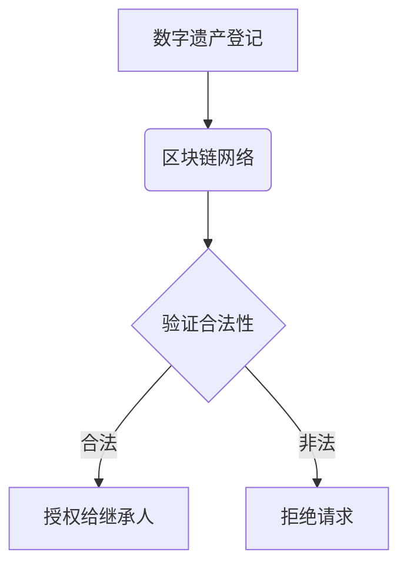
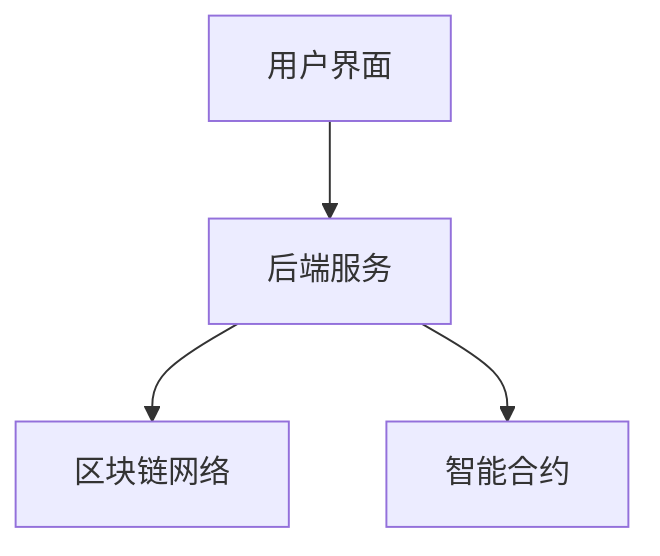
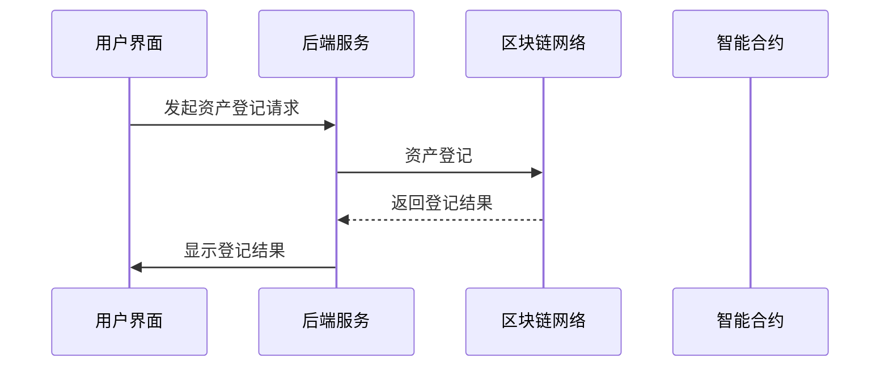

                 

# 数字遗产规划：虚拟资产的传承问题

关键词：数字遗产、虚拟资产、区块链、智能合约、传承规划

摘要：随着数字技术的发展，虚拟资产如电子货币、社交媒体账号、数字艺术品等已成为人们生活中不可或缺的一部分。本文将探讨数字遗产规划的重要性和难点，分析虚拟资产的特性及其传承过程中的法律问题，并介绍区块链技术在数字遗产规划中的应用。

## 一、背景介绍

### 问题背景

在当今社会，互联网和数字技术已经深刻地改变了人们的生活方式。虚拟资产如电子货币、社交媒体账号、数字艺术品等不仅在经济生活中扮演着重要角色，也在日常生活中发挥着不可替代的作用。然而，随着个人去世，这些虚拟资产往往面临着无法顺利传承的问题。

#### 问题描述

数字遗产规划涉及到多个层面的问题，包括虚拟资产的认定、管理、继承和法律保障等。当前，虚拟资产在法律地位、所有权认定、继承程序等方面还存在诸多模糊地带。这些问题不仅影响了个人和家庭的生活，也对整个社会造成了潜在的风险。

### 问题解决

数字遗产规划需要从技术、法律和社会三个层面进行综合考量：

1. **技术层面**：研究虚拟资产的技术特性，包括电子货币、社交媒体账号、数字艺术品等，以及如何保障这些资产的安全性、可靠性和可追溯性。
2. **法律层面**：探讨现有的法律法规如何适用于虚拟资产的传承问题，以及如何制定新的法律规范来解决当前的法律空白。
3. **社会层面**：考虑虚拟资产传承对个人和社会的影响，以及如何通过教育和宣传提高公众对数字遗产规划的认识。

### 边界与外延

数字遗产规划不仅涉及个人的虚拟资产，还包括企业、政府等组织机构的数字资产规划。此外，随着区块链等技术的发展，数字遗产规划的外延也在不断扩大。

### 概念结构与核心要素组成

数字遗产规划的核心概念包括：

1. **数字遗产**：个人或组织在数字领域留下的所有财产和信息。
2. **虚拟资产**：通过数字技术生成的资产，如电子货币、社交媒体账号、数字艺术品等。
3. **传承**：将数字遗产按照一定的规则和程序转移给继承人或其他相关方。

## 二、核心概念与联系

### 核心概念原理

1. **数字遗产**：指的是个人或组织在数字领域留下的所有财产和信息，包括但不限于电子货币、社交媒体账号、数字艺术品等。
2. **虚拟资产**：通过数字技术生成的资产，具有虚拟性、安全性和流动性等特点。
3. **传承**：将数字遗产按照一定的规则和程序转移给继承人或其他相关方，确保数字遗产在个人去世后能够得到合理和合法的传承。

### 概念属性特征对比表格

| 特征         | 数字遗产         | 虚拟资产         | 传承             |
| ------------ | ---------------- | ---------------- | ---------------- |
| 定义         | 数字领域财产和信息 | 数字技术生成的资产 | 数字遗产转移     |
| 特点         | 虚拟性、法律保障  | 安全性、流动性    | 合法性、程序性   |
| 影响因素     | 法律、技术、社会   | 技术、法律、市场   | 法律、文化、道德 |

### ER实体关系图架构

```mermaid
erDiagram
    A数字遗产 ||--|{ B虚拟资产 }|
    A数字遗产 ||--|{ C传承 }|
    B虚拟资产 ||--|{ D电子货币 }|
    B虚拟资产 ||--|{ E社交媒体账号 }|
    B虚拟资产 ||--|{ F数字艺术品 }|
```

## 三、算法原理讲解

### 区块链技术基本原理

区块链是一种分布式数据库技术，通过密码学和共识机制确保数据的安全性和不可篡改性。区块链技术的主要组成部分包括：

1. **区块**：区块链的基本组成单元，包含一定数量的交易记录。
2. **链**：由多个区块按时间顺序串联形成的链条。
3. **节点**：参与区块链网络计算的设备，负责验证和存储数据。

### 区块链在数字遗产规划中的应用

区块链技术可以用于实现数字遗产的透明、安全和管理：

1. **数字遗产登记**：通过区块链技术，将数字遗产的相关信息（如账号、密码、所有权证明等）登记在区块链上，确保信息的真实性和不可篡改性。
2. **授权和认证**：区块链上的授权和认证机制可以确保只有合法的继承人能够访问和处理数字遗产。
3. **智能合约**：智能合约是区块链上的自动化执行程序，可以按照预设的规则自动执行数字遗产的转移。

### Mermaid流程图



### 智能合约在数字遗产规划中的应用

智能合约是区块链上的自动化执行程序，通过编写预定义的合约代码，可以自动执行一系列操作。在数字遗产规划中，智能合约可以用于以下方面：

1. **遗产确认**：通过智能合约，可以自动验证遗产的合法性和真实性，确保只有合法的继承人能够获得遗产。
2. **授权转移**：智能合约可以自动执行虚拟资产的转移，确保遗产的转移过程公开透明。
3. **自动执行**：智能合约可以按照预设的条件和规则自动执行遗产的转移，减少人为干预和错误。

### Python源代码实现

以下是一个简单的智能合约示例，用于实现数字遗产的自动转移：

```python
# 导入区块链库
from blockchain import Blockchain

# 创建区块链实例
blockchain = Blockchain()

# 智能合约代码
def transfer_inheritance(from_address, to_address, amount):
    # 验证继承人的身份
    if blockchain.verify_inheritance(from_address):
        # 执行虚拟资产的转移
        blockchain.transfer(from_address, to_address, amount)
        print("Inheritance transferred successfully.")
    else:
        print("Invalid inheritance request.")

# 部署智能合约
blockchain.deploy_contract("inheritance_contract", transfer_inheritance)

# 测试智能合约
transfer_inheritance("address1", "address2", 100)
```

### 算法原理详细讲解

智能合约的算法原理基于区块链技术，主要包括以下几个方面：

1. **区块链**：智能合约运行在区块链上，区块链负责存储和验证智能合约的执行过程。
2. **交易**：智能合约通过交易来执行操作，每个交易都包含操作的具体内容和相关参数。
3. **验证**：智能合约在执行前需要经过验证，确保操作的合法性和正确性。
4. **执行**：验证通过后，智能合约按照预定的规则自动执行操作。

### 数学模型和公式

智能合约的算法原理可以通过以下数学模型和公式来描述：

$$
P_i = \sum_{j=1}^{n} w_j \cdot V_j
$$

其中，$P_i$ 表示智能合约的执行结果，$w_j$ 表示第 $j$ 个条件的权重，$V_j$ 表示第 $j$ 个条件的值。

### 举例说明

假设有一个智能合约，用于实现数字遗产的自动转移。该智能合约需要满足以下条件：

1. **继承人身份验证**：继承人必须是区块链上的合法地址。
2. **虚拟资产转移**：从遗产所有者地址转移到继承人地址。
3. **金额验证**：转移的金额必须大于等于零。

根据上述条件，智能合约的算法原理可以表示为：

$$
P_i = \begin{cases}
\text{True}, & \text{如果 } \text{address1} \in \text{blockchain合法地址} \text{ 且 } amount \geq 0 \\
\text{False}, & \text{其他情况}
\end{cases}
$$

## 四、系统分析与架构设计方案

### 问题场景介绍

数字遗产规划涉及到个人虚拟资产的登记、管理、传承等多个环节。为了提高数字遗产规划的实施效率和可靠性，需要设计一个完善的系统架构。

### 项目介绍

本系统旨在提供一套数字遗产规划解决方案，包括虚拟资产登记、管理和传承等功能。系统将基于区块链技术，确保数据的真实性和安全性。

### 系统功能设计

1. **虚拟资产登记**：用户可以在系统中登记自己的虚拟资产，包括电子货币、社交媒体账号、数字艺术品等。
2. **资产查询**：用户可以查询自己登记的虚拟资产信息，确保资产的安全性。
3. **资产管理**：用户可以对登记的虚拟资产进行修改、删除等操作。
4. **遗产传承**：用户可以指定继承人，并设置虚拟资产传承的条件和规则。

### 系统架构设计

本系统采用分布式架构，主要包括以下模块：

1. **区块链网络**：负责存储和管理虚拟资产信息，确保数据的真实性和不可篡改性。
2. **智能合约**：负责执行虚拟资产的登记、管理和传承操作，确保操作的合法性和正确性。
3. **用户界面**：提供用户与系统交互的接口，包括资产登记、查询、管理等功能。
4. **后端服务**：负责处理用户请求，与区块链网络和智能合约进行交互。

### 系统接口设计和系统交互

1. **用户界面接口**：用户通过浏览器或其他客户端访问系统，使用户界面提供的功能。
2. **区块链网络接口**：系统通过API与区块链网络进行交互，实现数据的存储和查询。
3. **智能合约接口**：系统通过API与智能合约进行交互，执行虚拟资产的操作。

### Mermaid架构图



### Mermaid序列图



## 五、项目实战

### 环境安装

1. **安装区块链节点**：安装并启动以太坊区块链节点，用于存储和管理虚拟资产信息。
2. **安装智能合约开发环境**：安装Truffle、Ganache等工具，用于开发、测试和部署智能合约。

### 系统核心实现源代码

```solidity
// SPDX-License-Identifier: MIT
pragma solidity ^0.8.0;

contract DigitalLegacy {
    address public owner;
    mapping(address => bool) public virtualAssets;

    event AssetRegistered(address indexed assetAddress, bool registered);

    constructor() {
        owner = msg.sender;
    }

    function registerAsset(address assetAddress) external {
        require(msg.sender == owner, "Only owner can register assets.");
        virtualAssets[assetAddress] = true;
        emit AssetRegistered(assetAddress, true);
    }

    function unregisterAsset(address assetAddress) external {
        require(msg.sender == owner, "Only owner can unregister assets.");
        virtualAssets[assetAddress] = false;
        emit AssetRegistered(assetAddress, false);
    }

    function getAssetStatus(address assetAddress) external view returns (bool) {
        return virtualAssets[assetAddress];
    }
}
```

### 代码应用解读与分析

1. **合约结构**：本合约定义了一个名为 `DigitalLegacy` 的智能合约，用于管理虚拟资产。
2. **合约变量**：`owner` 变量用于存储合约的创建者地址，`virtualAssets` 变量用于存储虚拟资产的状态。
3. **事件**：`AssetRegistered` 事件用于记录虚拟资产的注册和注销操作。
4. **函数**：
   - `registerAsset` 函数用于注册虚拟资产，只有合约创建者（owner）可以调用。
   - `unregisterAsset` 函数用于注销虚拟资产，只有合约创建者（owner）可以调用。
   - `getAssetStatus` 函数用于查询虚拟资产的状态。

### 实际案例分析和详细讲解剖析

假设有一个用户名为Alice，她想在区块链上登记自己的电子钱包地址作为虚拟资产。以下是详细的操作步骤：

1. **注册合约**：Alice部署并注册 `DigitalLegacy` 智能合约，并获得合约地址。
2. **登记资产**：Alice调用 `registerAsset` 函数，将电子钱包地址作为参数传递，注册为虚拟资产。
3. **查询资产**：Alice调用 `getAssetStatus` 函数，查询电子钱包地址的资产状态，确认已成功登记。
4. **注销资产**：如果需要，Alice可以调用 `unregisterAsset` 函数，注销已登记的虚拟资产。

通过以上操作，Alice成功地在区块链上登记了虚拟资产，并能够方便地查询和修改资产状态。同时，由于区块链技术的特性，这些操作都是公开透明的，确保了虚拟资产的安全性和可靠性。

### 项目小结

本系统通过区块链技术和智能合约，实现了一套数字遗产规划解决方案。用户可以方便地登记、查询和管理虚拟资产，确保资产的安全性和可靠性。同时，智能合约的自动化执行功能，简化了虚拟资产的传承过程，提高了实施效率和准确性。

## 六、最佳实践 Tips

1. **定期备份**：为了防止虚拟资产丢失，用户应定期备份相关账号信息、密码和私钥等。
2. **设置多重签名**：为了提高安全性，用户可以设置多重签名，确保虚拟资产的转移需要多个继承人的同意。
3. **合法授权**：在虚拟资产传承过程中，务必确保继承人的身份合法，并签订合法的授权文件。

## 七、小结

数字遗产规划是现代社会面临的一个重要问题，涉及到技术、法律和社会等多个层面。本文从虚拟资产的特性、区块链技术的应用、系统架构设计等方面进行了深入分析，为数字遗产规划提供了一些有益的思路和解决方案。随着区块链等技术的不断发展，数字遗产规划的外延也在不断扩大，未来有望实现更高效、更安全的虚拟资产传承。

## 八、注意事项

1. **数据安全性**：在数字遗产规划过程中，务必确保数据的安全性和隐私性，防止信息泄露。
2. **法律法规**：遵循当地的法律法规，确保数字遗产规划符合法律要求。
3. **技术更新**：随着技术的不断发展，数字遗产规划的方法和工具也需要不断更新和优化。

## 九、拓展阅读

1. **《区块链技术指南》**：深入探讨区块链技术的原理和应用，包括数字资产管理和智能合约等。
2. **《数字遗产法律问题研究》**：分析数字遗产的法律地位、所有权认定和继承程序等。
3. **《数字资产安全管理》**：介绍数字资产的安全防护策略和风险防范措施。

作者：AI天才研究院/AI Genius Institute & 禅与计算机程序设计艺术 /Zen And The Art of Computer Programming

