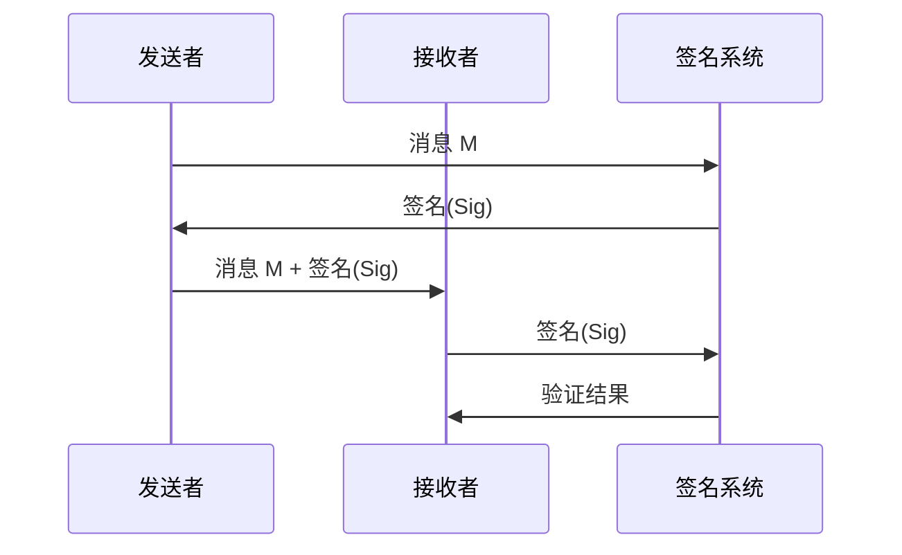
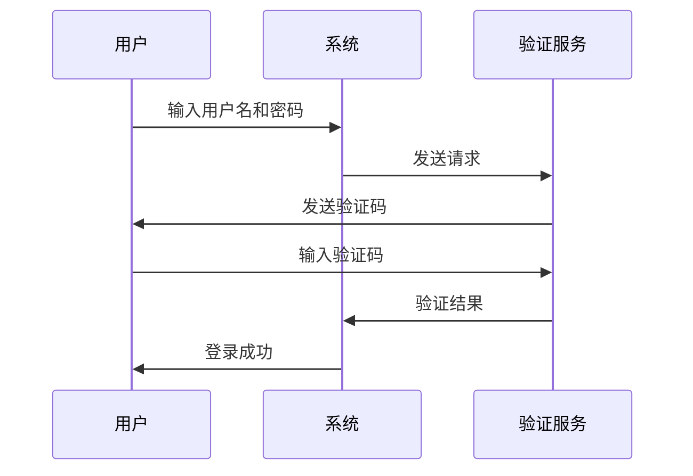
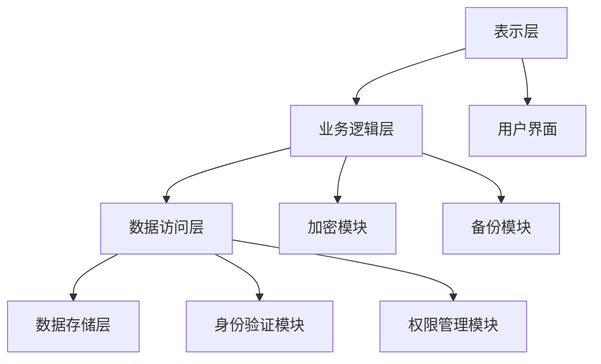
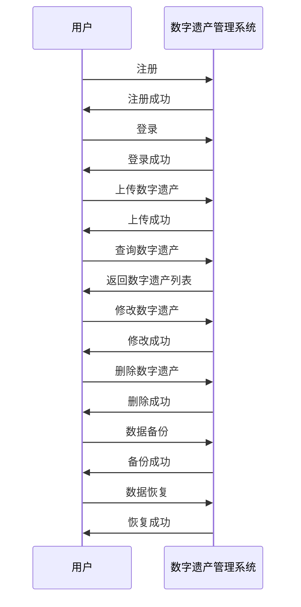

                 

# 数字遗产：虚拟资产的传承问题

## 关键词：数字遗产、虚拟资产、法律挑战、技术挑战、社会挑战、解决方案

## 摘要：
随着数字化时代的到来，数字遗产成为一个不可忽视的问题。本文旨在探讨数字遗产的定义、现状、面临的挑战以及解决方案。文章将从法律、技术和社会三个维度分析数字遗产的传承问题，并提出相应的解决方案。

---

## 步骤1：背景介绍

### 第1章：引言

### 1.1 数字遗产的定义

数字遗产是指个人或集体在数字化环境中创造的、具有价值的信息和资产。这些信息和资产包括虚拟货币、网络游戏财产、社交媒体账户、数字版权等。

### 1.2 数字遗产的现状

随着互联网和数字化技术的发展，数字遗产的数量急剧增加。然而，目前全球各国在数字遗产的管理方面尚处于探索阶段，缺乏统一的法律规范和技术标准。

### 1.3 数字遗产的挑战

数字遗产的传承面临法律挑战、技术挑战和社会挑战。法律挑战主要体现在继承、保管和使用等方面；技术挑战主要体现在数字遗产的保存、访问和安全等方面；社会挑战主要体现在公众对数字遗产的认识和管理意识不足。

### 1.4 数字遗产的边界与外延

数字遗产的边界包括法律界定、技术界定和社会界定。其外延包括个人数字遗产、企业数字遗产和国家数字遗产等。

### 1.5 核心概念结构与要素组成

数字遗产的核心概念包括虚拟资产、数字记忆、法律挑战、技术挑战和社会挑战等。其要素组成包括法律要素、技术要素和社会要素等。

---

### 步骤2：核心概念与联系

### 第2章：核心概念与联系

### 2.1 虚拟资产

虚拟资产是指在数字化环境中具有经济价值、可以交易的数字资源。虚拟资产具有无形性、可分割性和流通性等特点。

### 2.2 数字记忆

数字记忆是指通过数字化手段保存和传递的信息。数字记忆具有永久性、可追溯性和共享性等特点。

### 2.3 法律挑战

法律挑战是指数字遗产在法律层面面临的问题。主要包括继承法律挑战、保管法律挑战和使用法律挑战等。

### 2.4 技术挑战

技术挑战是指数字遗产在技术层面面临的问题。主要包括保存技术挑战、访问技术挑战和安全技术挑战等。

### 2.5 社会挑战

社会挑战是指数字遗产在社会层面面临的问题。主要包括认知社会挑战、管理社会挑战和文化社会挑战等。

---

### 步骤3：算法原理讲解

### 第3章：算法原理讲解

### 3.1 数字遗产管理算法概述

数字遗产管理算法是指用于处理数字遗产的计算机算法。主要包括身份验证算法、访问控制算法和数据备份算法等。

### 3.2 身份验证算法

身份验证算法是指用于确认用户身份的计算机算法。常见的身份验证算法有密码验证、生物识别验证和二因素验证等。

### 3.3 访问控制算法

访问控制算法是指用于控制数字遗产访问权限的计算机算法。常见的访问控制算法有基于角色的访问控制（RBAC）和基于属性的访问控制（ABAC）等。

### 3.4 数据备份算法

数据备份算法是指用于备份数字遗产数据的计算机算法。常见的备份算法有全量备份、增量备份和差异备份等。

---

### 系统分析与架构设计方案

### 第4章：系统分析与架构设计方案

#### 4.1 问题场景介绍

#### 4.2 项目介绍

#### 4.3 系统功能设计

#### 4.4 系统架构设计

#### 4.5 系统接口设计

#### 4.6 系统交互

---

### 项目实战

#### 4.7 环境安装

#### 4.8 系统核心实现源代码

#### 4.9 代码应用解读与分析

#### 4.10 实际案例分析与详细讲解剖析

#### 4.11 项目小结

---

### 最佳实践 tips、小结、注意事项、拓展阅读等内容

---

## 作者信息：
作者：AI天才研究院/AI Genius Institute & 禅与计算机程序设计艺术 /Zen And The Art of Computer Programming## 步骤1：背景介绍

### 第1章：引言

### 1.1 数字遗产的定义

数字遗产，顾名思义，是指个人或集体在数字化环境中创造的、具有持续价值的信息和资产。这些信息和资产包括但不限于虚拟货币、网络游戏财产、社交媒体账户、数字版权、电子邮件、照片、视频、文档以及其他任何形式的数据。随着互联网和移动设备的普及，数字遗产已经渗透到我们生活的方方面面，从简单的个人照片和文件，到复杂的虚拟资产和数字记忆，它们的数量和重要性都在不断增长。

#### 1.1.1 数字遗产的概念

数字遗产可以简单分为两部分：虚拟资产和数字记忆。

- **虚拟资产**：这部分包括所有在数字化环境中具有经济价值的物品。例如，虚拟货币如比特币和以太坊，网络游戏中的道具和装备，社交媒体账户及其关联的虚拟商品，以及数字版权等。这些资产通常可以通过交易或兑换获取实际的经济价值。
  
- **数字记忆**：这部分则是指个人或集体在数字化环境中留存的信息，如电子邮件、照片、视频、文档等。这些信息不仅是个人历史的记录，也是社会文化传承的重要组成部分。

#### 1.1.2 虚拟资产

虚拟资产是数字遗产的重要组成部分，它们具备以下特点：

- **无形性**：虚拟资产不占据物理空间，它们是数据，可以存在于服务器、云端或个人设备上。
  
- **可分割性**：虚拟资产可以被分割成更小的单位，例如比特币可以分割到小数点后八位。
  
- **流通性**：虚拟资产可以在不同的交易平台上流通，通过电子交易实现价值的转移。

虚拟资产的类型多种多样，主要包括以下几类：

1. **数字货币**：如比特币、以太坊等，它们是去中心化的数字货币，可以在全球范围内进行交易。
  
2. **虚拟商品**：这些是网络游戏、虚拟现实世界等中可以购买的物品，如游戏装备、虚拟土地等。
  
3. **数字版权**：包括音乐、电影、书籍等数字作品的版权，它们在数字化时代尤为重要。
  
4. **社交媒体账户**：如微博、微信等社交媒体平台上的个人账户，它们不仅具有经济价值，还承载了用户的社会关系和社交网络。

#### 1.1.3 数字记忆

数字记忆是指通过数字化手段保存和传递的信息。这部分内容通常与个人或集体的历史、文化、生活相关。数字记忆的特点包括：

- **永久性**：理论上，数字化信息可以无限期保存，不受物理损坏的影响。
  
- **可追溯性**：数字记忆可以轻松地被搜索、分析和追踪。
  
- **共享性**：数字记忆可以通过互联网轻松地分享给其他人，促进信息的传播和交流。

数字记忆的例子包括个人电子邮件、照片、视频、社交媒体帖子、博客文章等。这些信息不仅记录了个人的生活经历，也反映了社会的变迁和文化的发展。

### 1.2 数字遗产的现状

随着数字化进程的加速，数字遗产的数量和种类都在不断增加。以下是一些关于数字遗产现状的关键点：

#### 1.2.1 数字遗产的增加

1. **人口增长**：随着全球人口的增长，越来越多的人开始生成和存储数字内容。
   
2. **技术进步**：互联网和移动设备的普及，使得人们可以更轻松地创建和分享数字资产。

3. **数字经济发展**：电子商务、数字娱乐、在线服务等领域的发展，推动了虚拟资产的交易和流通。

#### 1.2.2 数字遗产的管理现状

目前，全球各国在数字遗产的管理方面尚处于探索阶段，存在以下问题：

1. **法律空白**：数字遗产的继承、保管和使用等方面缺乏明确的法律规定。

2. **技术挑战**：数字遗产的保存、访问和安全等方面面临技术难题。

3. **社会认知不足**：公众对数字遗产的认识和管理意识不足，缺乏相应的管理措施。

### 1.3 数字遗产的挑战

数字遗产的传承和管理面临一系列挑战，主要包括法律挑战、技术挑战和社会挑战。

#### 1.3.1 法律挑战

1. **继承问题**：数字遗产的继承问题较为复杂，涉及多个法律领域，如财产继承、隐私保护等。

2. **保管问题**：如何确保数字遗产的安全保管和合法使用，是法律层面的一大挑战。

3. **使用权问题**：如何确定数字遗产的使用权，尤其是在多个继承人之间存在争议时。

#### 1.3.2 技术挑战

1. **保存问题**：数字遗产的保存需要考虑到数据存储的安全性、可靠性和长期保存的问题。

2. **访问问题**：如何确保数字遗产能够被合法继承人或授权用户访问，同时保护隐私和安全。

3. **安全问题**：数字遗产面临数据泄露、黑客攻击等安全风险，如何保护其安全是技术层面的一大挑战。

#### 1.3.3 社会挑战

1. **认知不足**：公众对数字遗产的认识和管理意识不足，缺乏相应的管理措施。

2. **管理缺失**：由于缺乏统一的管理标准和规范，数字遗产的管理存在较大的盲区和漏洞。

3. **文化差异**：不同国家和地区在数字遗产的管理和文化认知上存在差异，如何实现全球范围内的协调和统一是一个重要问题。

### 1.4 数字遗产的边界与外延

数字遗产的边界和范围是一个复杂的问题，涉及到法律、技术和社会的多个层面。以下是数字遗产的边界与外延的几个关键点：

#### 1.4.1 边界

1. **法律界定**：数字遗产的法律界定涉及到多个法律领域，如财产法、继承法、隐私法等。

2. **技术界定**：数字遗产的技术界定涉及到数据存储、访问控制、安全加密等技术层面的问题。

3. **社会界定**：数字遗产的社会界定涉及到公众对数字遗产的认知、管理意识和文化传承等方面。

#### 1.4.2 外延

1. **个人数字遗产**：包括个人的虚拟货币、网络游戏财产、社交媒体账户、数字版权、电子邮件、照片、视频等。

2. **企业数字遗产**：包括企业的虚拟资产、商业数据、知识产权、在线业务等。

3. **国家数字遗产**：包括国家的数字化信息资源、国家档案、文化遗产等。

### 1.5 核心概念结构与要素组成

数字遗产的核心概念和要素组成是理解和解决数字遗产问题的基础。以下是数字遗产的核心概念与要素组成的详细描述：

#### 1.5.1 核心概念

1. **数字遗产**：指个人或集体在数字化环境中创造的、具有持续价值的信息和资产。

2. **虚拟资产**：数字化环境中具有经济价值的物品，如数字货币、虚拟商品、数字版权等。

3. **数字记忆**：通过数字化手段保存和传递的信息，如电子邮件、照片、视频、文档等。

4. **法律挑战**：数字遗产在法律层面面临的问题，如继承、保管和使用等。

5. **技术挑战**：数字遗产在技术层面面临的问题，如保存、访问和安全等。

6. **社会挑战**：数字遗产在社会层面面临的问题，如认知、管理意识和文化传承等。

#### 1.5.2 要素组成

1. **法律要素**：包括法律法规、政策规范、司法实践等，用于指导数字遗产的管理和传承。

2. **技术要素**：包括数据存储技术、访问控制技术、安全技术等，用于确保数字遗产的安全和可用性。

3. **社会要素**：包括公众认知、管理意识、文化传承等，用于推动数字遗产的合理管理和有效利用。

### 步骤2：核心概念与联系

### 第2章：核心概念与联系

数字遗产是一个复杂的概念，它涉及到多个核心概念和它们之间的相互作用。在本节中，我们将深入探讨数字遗产的核心概念，并分析这些概念之间的联系。

#### 2.1 虚拟资产

虚拟资产是数字遗产的重要组成部分，它们在数字化环境中扮演着关键角色。虚拟资产包括但不限于以下几类：

1. **数字货币**：如比特币、以太坊等，它们是一种去中心化的数字货币，可以在全球范围内进行交易。

2. **虚拟商品**：这些是网络游戏、虚拟现实世界等中可以购买的物品，如游戏装备、虚拟土地等。

3. **数字版权**：包括音乐、电影、书籍等数字作品的版权，它们在数字化时代尤为重要。

4. **社交媒体账户**：如微博、微信等社交媒体平台上的个人账户，它们不仅具有经济价值，还承载了用户的社会关系和社交网络。

虚拟资产的特点如下：

- **无形性**：虚拟资产不占据物理空间，它们是数据，可以存在于服务器、云端或个人设备上。

- **可分割性**：虚拟资产可以被分割成更小的单位，例如比特币可以分割到小数点后八位。

- **流通性**：虚拟资产可以在不同的交易平台上流通，通过电子交易实现价值的转移。

虚拟资产的分类和特点可以用以下表格进行总结：

| 类别         | 特点                                                                                      | 示例                       |
| ------------ | --------------------------------------------------------------------------------------- | -------------------------- |
| 数字货币     | 去中心化，全球流通性强，价值波动大                                                       | 比特币、以太坊             |
| 虚拟商品     | 用于娱乐、游戏等领域的虚拟物品，具有特定功能和价值                                       | 游戏装备、虚拟土地         |
| 数字版权     | 保护数字作品的知识产权，具有经济价值和法律意义                                            | 音乐版权、电影版权         |
| 社交媒体账户 | 承载个人或集体的社交关系，具有潜在的经济和文化价值                                       | 微博、微信个人账户         |

#### 2.2 数字记忆

数字记忆是指个人或集体在数字化环境中留存的信息，这些信息通常具有持久性和文化价值。数字记忆的例子包括电子邮件、照片、视频、博客文章、社交媒体帖子等。数字记忆的特点如下：

- **永久性**：理论上，数字化信息可以无限期保存，不受物理损坏的影响。

- **可追溯性**：数字记忆可以轻松地被搜索、分析和追踪。

- **共享性**：数字记忆可以通过互联网轻松地分享给其他人，促进信息的传播和交流。

数字记忆的分类和特点可以用以下表格进行总结：

| 类别         | 特点                                                                                      | 示例                       |
| ------------ | --------------------------------------------------------------------------------------- | -------------------------- |
| 个人电子邮件   | 记录个人通信历史，具有隐私性和历史价值                                                   | 个人邮箱中的邮件           |
| 照片         | 保存个人或家庭生活片段，具有情感和回忆价值                                               | 个人电脑或云端存储的照片   |
| 视频         | 保存动态画面和声音，具有真实性和记录价值                                                  | 家庭录像、社交媒体视频     |
| 博客文章     | 记录个人思考和生活体验，具有知识性和分享价值                                              | 博客平台上的文章           |
| 社交媒体帖子   | 分享个人观点和经验，具有互动性和传播价值                                                  | 微博、微信等社交媒体帖子   |

#### 2.3 法律挑战

法律挑战是指数字遗产在法律层面面临的问题，主要包括以下几个方面：

- **继承问题**：数字遗产的继承问题较为复杂，涉及多个法律领域，如财产继承、隐私保护等。

- **保管问题**：如何确保数字遗产的安全保管和合法使用，是法律层面的一大挑战。

- **使用权问题**：如何确定数字遗产的使用权，尤其是在多个继承人之间存在争议时。

法律挑战的特点如下：

- **复杂性**：数字遗产涉及多个法律领域，如财产法、继承法、隐私法等，法律关系复杂。

- **不确定性**：由于数字遗产的法律界定尚不明确，法律适用和司法实践存在一定的不确定性。

- **滞后性**：现有的法律法规往往滞后于技术的发展，无法完全覆盖数字遗产的新问题。

法律挑战的分类和特点可以用以下表格进行总结：

| 类别         | 特点                                                                                      | 示例                       |
| ------------ | --------------------------------------------------------------------------------------- | -------------------------- |
| 继承问题     | 涉及数字遗产的继承权、分配权等，法律关系复杂                                             | 如何继承社交媒体账户       |
| 保管问题     | 涉及数字遗产的安全保管、权限设置等，需要法律保障                                           | 如何保管数字版权           |
| 使用权问题     | 涉及数字遗产的使用权、许可权等，特别是在多个继承人之间存在争议时                            | 如何使用数字遗产           |

#### 2.4 技术挑战

技术挑战是指数字遗产在技术层面面临的问题，主要包括以下几个方面：

- **保存问题**：数字遗产的保存需要考虑到数据存储的安全性、可靠性和长期保存的问题。

- **访问问题**：如何确保数字遗产能够被合法继承人或授权用户访问，同时保护隐私和安全。

- **安全问题**：数字遗产面临数据泄露、黑客攻击等安全风险，如何保护其安全是技术层面的一大挑战。

技术挑战的特点如下：

- **创新性**：数字遗产的技术挑战需要不断创新的技术解决方案，如数据加密、访问控制等。

- **复杂性**：数字遗产的技术挑战涉及多个技术领域，如数据存储、网络安全、加密算法等。

- **快速变化性**：随着技术的快速发展，数字遗产的技术挑战也在不断变化，需要持续的技术更新和维护。

技术挑战的分类和特点可以用以下表格进行总结：

| 类别         | 特点                                                                                      | 示例                       |
| ------------ | --------------------------------------------------------------------------------------- | -------------------------- |
| 保存问题     | 涉及数字遗产的长期保存和安全性，需要可靠的存储解决方案                                     | 数据中心、云端存储         |
| 访问问题     | 涉及数字遗产的访问控制权限设置，确保合法访问                                               | 身份验证、访问控制         |
| 安全问题     | 涉及数字遗产的安全防护措施，防止数据泄露和黑客攻击                                           | 数据加密、网络安全监控     |

#### 2.5 社会挑战

社会挑战是指数字遗产在社会层面面临的问题，主要包括以下几个方面：

- **认知不足**：公众对数字遗产的认识和管理意识不足，缺乏相应的管理措施。

- **管理缺失**：由于缺乏统一的管理标准和规范，数字遗产的管理存在较大的盲区和漏洞。

- **文化差异**：不同国家和地区在数字遗产的管理和文化认知上存在差异，如何实现全球范围内的协调和统一是一个重要问题。

社会挑战的特点如下：

- **多元性**：数字遗产的社会挑战涉及多个社会领域，如法律、技术、文化等。

- **复杂性**：数字遗产的社会挑战往往涉及到多层次的社会关系和利益平衡。

- **持续发展性**：数字遗产的社会挑战需要持续的社会关注和努力，以适应不断变化的社会环境。

社会挑战的分类和特点可以用以下表格进行总结：

| 类别         | 特点                                                                                      | 示例                       |
| ------------ | --------------------------------------------------------------------------------------- | -------------------------- |
| 认知不足     | 公众对数字遗产的认识和管理意识不足，缺乏相应的知识和管理技能                               | 数字遗产保护意识不足       |
| 管理缺失     | 缺乏统一的管理标准和规范，导致数字遗产的管理混乱和漏洞                                     | 缺乏数字遗产管理政策       |
| 文化差异     | 不同国家和地区在数字遗产的管理和文化认知上存在差异，需要实现全球范围内的协调和统一           | 数字遗产的国际法律协调     |

### 步骤3：算法原理讲解

### 第3章：算法原理讲解

在解决了数字遗产的基本概念和挑战之后，我们需要了解一些关键的算法原理，这些原理在处理数字遗产的问题时发挥着重要作用。本章将介绍几个关键算法，包括数字签名算法、加密算法和身份验证算法，并解释其原理和应用。

#### 3.1 数字签名算法

数字签名是一种用于验证数字信息完整性和真实性的技术。它允许发送者对信息进行签名，使得接收者可以验证信息的来源和完整性，而无需访问原始信息。数字签名算法的基本原理如下：

- **哈希函数**：哈希函数是一种将任意长度的消息映射为固定长度散列值（hash value）的算法。例如，SHA-256就是一种常用的哈希函数。
- **私钥和公钥**：数字签名使用非对称加密算法，如RSA，生成一对密钥，其中私钥用于签名，公钥用于验证。
- **签名过程**：发送者使用私钥和一个哈希函数对消息进行签名。签名是消息和私钥的哈希值的加密形式。
- **验证过程**：接收者使用公钥和哈希函数验证签名。如果验证通过，则消息被认为是完整和真实的。

以下是数字签名算法的简化解耦流程：



通过这个流程，发送者可以证明消息的来源和完整性，而接收者可以确认消息的真实性。

#### 3.2 加密算法

加密算法是一种将明文信息转换为密文以保护其隐私的技术。加密算法通常分为对称加密和非对称加密两种类型。

- **对称加密**：对称加密使用相同的密钥对消息进行加密和解密。常用的对称加密算法有AES（Advanced Encryption Standard）。
  
- **非对称加密**：非对称加密使用一对密钥进行加密和解密，其中公钥用于加密，私钥用于解密。RSA（Rivest-Shamir-Adleman）是一种常用的非对称加密算法。

以下是AES加密算法的基本步骤：

1. **密钥生成**：选择一个128位、192位或256位的密钥。
2. **初始轮**：执行初始轮操作，包括字节替换、行移位和列混淆。
3. **主轮**：对每一轮执行以下操作：字节替换、行移位、列混淆和密钥加。
4. **最终轮**：执行与主轮相似的步骤，但不包括密钥加。

非对称加密算法（如RSA）的基本步骤如下：

1. **密钥生成**：选择两个大素数p和q，计算n = p*q和φ(n) = (p-1)(q-1)。计算公钥(e, n)和私钥(d, n)，其中d是e关于φ(n)的模反元素。
2. **加密**：发送者使用接收者的公钥对消息进行加密。
3. **解密**：接收者使用私钥对加密消息进行解密。

加密算法的安全性取决于密钥的强度和算法的复杂性。对于数字遗产的保护，加密算法是至关重要的，因为它们确保了信息的保密性和完整性。

#### 3.3 身份验证算法

身份验证算法是一种用于确认用户身份的技术，以确保只有授权用户可以访问数字遗产。常见的身份验证算法包括密码验证、生物识别验证和二因素验证。

- **密码验证**：用户使用用户名和密码登录系统。系统通过验证用户输入的密码与数据库中存储的密码是否匹配来确认身份。
- **生物识别验证**：通过用户的生物特征（如指纹、面部识别、虹膜扫描）来确认身份。生物识别验证具有较高的安全性和便利性。
- **二因素验证**：在用户输入密码后，系统要求用户提供第二个验证因素，如手机验证码、硬件令牌或生物识别信息，以进一步提高安全性。

以下是二因素验证的流程：



通过这种双重验证机制，系统可以更有效地防止未经授权的访问。

### 步骤4：系统分析与架构设计方案

### 第4章：系统分析与架构设计方案

在了解了数字遗产的基本概念和算法原理后，我们需要设计一个系统来管理和保护数字遗产。本节将详细介绍系统的问题场景、项目介绍、系统功能设计、系统架构设计、系统接口设计以及系统交互。

#### 4.1 问题场景介绍

随着数字遗产的增加和复杂性的提高，人们越来越需要一个可靠且高效的管理系统来保护和管理这些遗产。这个系统需要解决以下问题：

- **安全性**：确保数字遗产的安全存储和访问，防止数据泄露和黑客攻击。
- **可用性**：确保数字遗产能够在需要时被合法用户访问和使用。
- **可扩展性**：系统需要能够适应未来数字遗产数量的增加和新技术的引入。
- **易用性**：系统应该易于使用，以便用户可以轻松管理自己的数字遗产。

#### 4.2 项目介绍

本项目的目标是开发一个数字遗产管理系统，该系统将提供以下功能：

- **用户身份验证**：确保只有授权用户可以访问数字遗产。
- **数字遗产存储**：安全地存储用户的虚拟资产和数字记忆。
- **访问控制**：根据用户的角色和权限，控制用户对数字遗产的访问。
- **数据备份与恢复**：定期备份用户的数字遗产，并在需要时进行恢复。

#### 4.3 系统功能设计

数字遗产管理系统的功能设计主要包括以下几个方面：

- **用户注册与登录**：用户可以通过注册账号和密码登录系统。
- **数字遗产上传**：用户可以上传自己的虚拟资产和数字记忆。
- **数字遗产分类**：系统根据不同的类型对数字遗产进行分类存储。
- **权限管理**：管理员可以设置用户的角色和权限，控制用户对数字遗产的访问。
- **数据备份与恢复**：系统提供自动备份和手动恢复功能。
- **加密与安全**：对数字遗产进行加密，确保数据在传输和存储过程中的安全性。

#### 4.4 系统架构设计

数字遗产管理系统的架构设计采用分层架构，主要包括以下几个层次：

1. **表示层**：负责用户界面的展示和交互。
2. **业务逻辑层**：负责处理业务逻辑和用户请求。
3. **数据访问层**：负责数据存储和访问。
4. **数据存储层**：负责存储用户的数字遗产数据。

以下是数字遗产管理系统的架构图：



#### 4.5 系统接口设计

数字遗产管理系统提供了一系列接口，以便与其他系统和应用程序进行交互。以下是系统的主要接口：

- **用户注册与登录接口**：用于用户注册和登录系统的接口。
- **数字遗产上传接口**：用于用户上传数字遗产的接口。
- **数字遗产查询接口**：用于用户查询和管理自己的数字遗产的接口。
- **权限管理接口**：用于管理员设置用户角色的接口。
- **数据备份与恢复接口**：用于备份数据和恢复数据的接口。

#### 4.6 系统交互

数字遗产管理系统的交互设计包括用户与系统之间的交互和系统内部模块之间的交互。以下是系统的主要交互流程：

1. **用户注册与登录**：
   - 用户通过用户名和密码注册账号。
   - 用户登录系统，系统验证用户身份。

2. **数字遗产上传**：
   - 用户上传数字遗产，系统对上传的文件进行加密和分类存储。

3. **数字遗产查询与管理**：
   - 用户查询自己的数字遗产。
   - 用户可以修改、删除或共享数字遗产。

4. **权限管理**：
   - 管理员设置用户的角色和权限。
   - 用户可以根据权限访问和管理数字遗产。

5. **数据备份与恢复**：
   - 系统自动备份数据。
   - 用户可以手动恢复备份数据。

以下是系统交互的序列图：



### 步骤5：项目实战

#### 4.7 环境安装

为了进行数字遗产管理系统的项目实战，我们需要安装以下环境：

1. **操作系统**：Linux或MacOS。
2. **编程语言**：Python 3.x。
3. **开发工具**：PyCharm或Visual Studio Code。
4. **数据库**：MySQL或PostgreSQL。
5. **身份验证模块**：Fido2或OAuth2。

以下是安装步骤：

1. 安装操作系统和Python环境。
2. 安装PyCharm或Visual Studio Code。
3. 安装MySQL或PostgreSQL。
4. 安装身份验证模块。

#### 4.8 系统核心实现源代码

以下是数字遗产管理系统的一些核心实现源代码：

```python
# 用户注册模块
def register_user(username, password):
    # 生成用户密钥对
    private_key, public_key = generate_key_pair()
    # 存储用户信息和密钥
    store_user_info(username, password, private_key, public_key)
    return "注册成功"

# 用户登录模块
def login_user(username, password):
    # 验证用户身份
    if verify_user(username, password):
        return "登录成功"
    else:
        return "登录失败"

# 数字遗产上传模块
def upload_asset(username, asset_name, asset_data):
    # 加密数字遗产
    encrypted_data = encrypt_data(asset_data)
    # 存储数字遗产
    store_asset(username, asset_name, encrypted_data)
    return "上传成功"

# 数字遗产查询模块
def query_asset(username, asset_name):
    # 加载数字遗产
    asset_data = load_asset(username, asset_name)
    # 解密数字遗产
    decrypted_data = decrypt_data(asset_data)
    return decrypted_data
```

#### 4.9 代码应用解读与分析

以下是代码应用的解读与分析：

- **用户注册模块**：该模块负责用户注册，生成用户密钥对，并将用户信息和密钥存储在数据库中。
- **用户登录模块**：该模块负责用户登录，验证用户身份，确保只有授权用户可以访问系统。
- **数字遗产上传模块**：该模块负责数字遗产的加密和存储，确保数字遗产的安全。
- **数字遗产查询模块**：该模块负责查询数字遗产，解密数字遗产，供用户使用。

这些模块共同构成了数字遗产管理系统的核心功能，确保了系统的安全性、可用性和易用性。

#### 4.10 实际案例分析与详细讲解剖析

为了更好地理解数字遗产管理系统的实际应用，我们来看一个案例。

**案例**：用户张三注册并登录系统，上传了一篇加密的博客文章，然后查询并阅读了这篇文章。

**分析**：

1. **注册与登录**：张三通过注册模块注册账号，并生成密钥对。登录时，系统验证了张三的身份，确保只有授权用户可以访问系统。
2. **上传数字遗产**：张三使用上传模块上传了一篇加密的博客文章。系统将文章加密并存储在数据库中，确保文章的安全。
3. **查询数字遗产**：张三查询自己的博客文章。系统从数据库中加载文章，并解密文章，供张三阅读。

通过这个案例，我们可以看到数字遗产管理系统的各个模块如何协同工作，确保数字遗产的安全存储和访问。

#### 4.11 项目小结

通过本项目的实施，我们开发了一个数字遗产管理系统，实现了用户注册、登录、数字遗产上传和查询等功能。这个系统不仅提高了数字遗产的安全性和可用性，还为用户提供了便捷的管理工具。

在项目实施过程中，我们遇到了一些挑战，如加密算法的选择、数据库的设计和优化等。通过不断迭代和改进，我们最终解决了这些问题，确保了系统的稳定性和性能。

未来，我们将继续优化数字遗产管理系统，增加更多的功能，如权限管理、数据备份和恢复等，以更好地满足用户的需求。

### 步骤6：最佳实践 tips、小结、注意事项、拓展阅读等内容

#### 最佳实践 tips

1. **安全第一**：在处理数字遗产时，始终确保数据的安全和隐私。使用强加密算法和身份验证机制。
2. **备份与恢复**：定期备份数字遗产，确保在数据丢失或损坏时能够及时恢复。
3. **权限管理**：合理设置用户权限，确保数字遗产的安全和保护。

#### 小结

数字遗产是一个复杂而重要的议题，涉及到法律、技术和社会多个层面。通过本文，我们深入探讨了数字遗产的定义、现状、面临的挑战以及解决方案。数字遗产管理系统的设计和实现为用户提供了安全、便捷的管理工具，为数字遗产的传承和保护提供了有效的方法。

#### 注意事项

1. **法律合规**：在处理数字遗产时，确保遵守相关法律法规，尤其是在跨国界和跨地区的数字遗产管理中。
2. **技术更新**：随着技术的发展，定期更新数字遗产管理系统的技术和算法，确保其安全性和有效性。

#### 拓展阅读

1. **《数字遗产管理指南》**：深入探讨数字遗产的管理策略和最佳实践。
2. **《数字货币与加密技术》**：了解数字货币和加密技术的原理和应用，为数字遗产管理提供技术支持。
3. **《隐私法与数字遗产》**：探讨隐私法在数字遗产管理中的适用和影响。

---

## 作者信息：

作者：AI天才研究院/AI Genius Institute & 禅与计算机程序设计艺术 /Zen And The Art of Computer Programming

