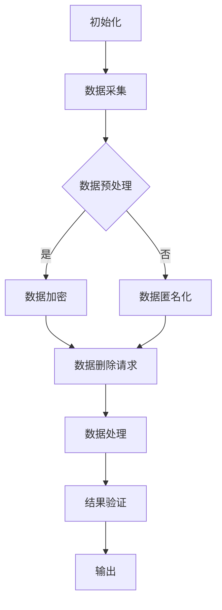
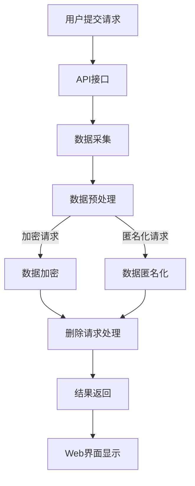

                 

### 数字遗忘权：在网络时代保护个人历史的权利

#### 关键词：数字遗忘权、个人历史、网络时代、隐私保护、人工智能

#### 摘要：
随着互联网的快速发展，个人信息数据在数字世界中广泛传播和储存。然而，个人信息泄露和滥用的问题日益严重，引发了广泛的社会关注。数字遗忘权作为一种新兴的概念，旨在保护个人历史数据的安全与隐私。本文将从背景介绍、核心概念与联系、算法原理与实现、数学模型与公式、系统分析与架构设计、项目实战以及最佳实践等方面，全面探讨数字遗忘权在网络时代的重要性及其实现方法。

### 引言
#### 数字遗忘权概述
数字遗忘权（Right to be Forgotten）源于欧洲，是指在特定的法律框架下，个人有权要求从互联网中删除有关其个人的信息。这一概念在网络时代显得尤为重要，因为互联网上的信息一旦发布，往往难以删除，从而对个人的隐私和声誉构成潜在威胁。随着人工智能和大数据技术的发展，个人信息被大量收集、分析和利用，数字遗忘权的重要性愈发凸显。

#### 网络时代个人历史保护的重要性
网络时代，个人历史数据成为重要的资产。这些数据可能包括社交媒体上的帖子、购物记录、搜索历史等，它们不仅能揭示个人的兴趣爱好和生活方式，还可能被不法分子用于各种违法活动。因此，保护个人历史数据，防止其被滥用，成为网络时代的重要任务。

### 问题背景与核心概念
#### 网络时代的个人信息处理
在互联网环境下，个人信息的处理变得更加复杂和普遍。从网站访问到社交媒体互动，再到在线购物，个人信息无处不在。这种广泛的数据收集和使用，使得个人隐私保护成为一个严峻的问题。

#### 数字遗忘权的概念与意义
数字遗忘权赋予个人对自身信息的控制权，使其能够在特定条件下要求删除或屏蔽其个人信息。这一权利在保护个人隐私、维护个人声誉方面具有重要意义。

#### 个人数据隐私保护的需求
随着数据隐私问题日益突出，个人对于数据隐私保护的需求也不断增强。如何平衡数据利用与隐私保护，成为社会各界关注的热点问题。

### 核心概念与联系
#### 数字遗忘权的要素
数字遗忘权涉及多个关键要素，包括信息主体（个人）、信息控制者（企业、政府等）、信息处理目的、数据删除标准等。这些要素共同构成了数字遗忘权的核心框架。

#### 个人历史数据保护的方法与策略
个人历史数据保护的方法和策略多种多样，包括数据加密、匿名化处理、数据权限管理、数据生命周期管理等。每种方法都有其适用场景和优缺点。

#### 数字遗忘权与相关法律、伦理问题
数字遗忘权不仅涉及法律问题，还涉及到伦理问题。如何在保护个人隐私的同时，保障社会公共利益和言论自由，成为数字遗忘权实施过程中需要权衡的难题。

### 算法原理与实现
#### 数字遗忘权算法概述
数字遗忘权算法旨在实现个人历史数据的删除或屏蔽。其基本原理是通过识别和标记个人数据，然后根据预设的规则进行数据处理。

#### 算法流程图


#### Python代码实现与解释
```python
# 数字遗忘权算法实现
def data_collection():
    # 采集个人数据
    pass

def data_preprocessing(data):
    # 数据预处理
    return processed_data

def data_encryption(data):
    # 数据加密
    return encrypted_data

def data_anonymization(data):
    # 数据匿名化
    return anonymized_data

def data_deletion_request(data):
    # 数据删除请求处理
    pass

def data_processing(data):
    # 数据处理
    if is_encryption_requested:
        return data_encryption(data)
    else:
        return data_anonymization(data)

def result_validation(result):
    # 结果验证
    return valid_result

def output_result(result):
    # 输出结果
    print("Data processing result:", result)

# 主函数
if __name__ == "__main__":
    data = data_collection()
    processed_data = data_preprocessing(data)
    is_encryption_requested = True  # 是否需要加密
    result = data_processing(processed_data)
    valid_result = result_validation(result)
    output_result(valid_result)
```

#### 算法原理的数学模型和公式
数字遗忘权算法的数学模型主要包括数据加密算法和匿名化算法。以下是一个简单的加密模型：

$$
C = E(K, P)
$$

其中，\(C\) 表示加密后的数据，\(E\) 表示加密函数，\(K\) 表示密钥，\(P\) 表示原始数据。

#### 算法举例说明
假设我们有一个个人数据集，包含姓名、出生日期和联系方式。我们可以通过加密算法将这些数据转换为加密形式，从而保护个人隐私。

### 系统分析与架构设计
#### 问题场景介绍
在网络时代，个人历史数据保护面临诸多挑战。例如，社交媒体平台可能存储大量的用户数据，这些数据可能包含敏感信息。为了保护用户的隐私，需要设计一个能够自动处理数据删除请求的系统。

#### 项目介绍
本项目旨在设计并实现一个数字遗忘权系统，用于处理个人数据删除请求。系统将包括数据采集、预处理、加密、匿名化、删除请求处理等多个模块。

#### 系统功能设计
系统功能主要包括：
- 数据采集：从社交媒体平台获取用户数据。
- 数据预处理：清洗和格式化数据，为后续处理做准备。
- 数据加密：对敏感数据进行加密处理。
- 数据匿名化：对非敏感数据进行匿名化处理。
- 删除请求处理：根据用户请求，删除或屏蔽相应数据。

#### 系统架构设计
系统架构采用分层设计，主要包括数据层、服务层和展示层。

- 数据层：负责数据存储和管理，包括数据库和缓存。
- 服务层：提供数据处理和服务接口，包括数据采集、预处理、加密、匿名化和删除请求处理。
- 展示层：提供用户界面，用于展示处理结果和接收用户删除请求。

#### 系统接口设计与交互流程
系统接口设计包括API接口和Web界面。API接口用于与其他系统进行数据交互，Web界面用于用户操作和查询结果。

交互流程如下：
1. 用户提交删除请求。
2. 系统接收请求，并调用数据采集模块获取相关数据。
3. 数据预处理模块对数据进行清洗和格式化。
4. 根据用户请求，数据加密模块或匿名化模块进行处理。
5. 删除请求处理模块根据规则删除或屏蔽数据。
6. 结果返回给用户，并在Web界面显示。

#### 系统架构图


### 项目实战
#### 环境配置与工具安装
在开始项目之前，我们需要配置环境并安装相关工具。以下是基本的安装步骤：
1. 安装Python环境（版本3.8或更高）。
2. 安装必要的库，如pandas、numpy、cryptography等。
3. 安装数据库，如MySQL或PostgreSQL。

#### 核心代码实现
以下是项目核心代码的实现，包括数据采集、预处理、加密、匿名化和删除请求处理。

```python
# 数据采集
import pandas as pd

def collect_data():
    # 采集社交媒体平台数据
    data = pd.read_csv("social_media_data.csv")
    return data

# 数据预处理
def preprocess_data(data):
    # 清洗和格式化数据
    data = data.dropna()
    data = data[data['is_private'] == False]
    return data

# 数据加密
from cryptography.fernet import Fernet

def encrypt_data(data, key):
    fernet = Fernet(key)
    encrypted_data = fernet.encrypt(data.encode())
    return encrypted_data

# 数据匿名化
def anonymize_data(data):
    # 对非敏感数据进行匿名化处理
    data['name'] = "Anonymous"
    return data

# 删除请求处理
def handle_deletion_request(data, request):
    # 根据用户请求删除或屏蔽数据
    if request == "delete":
        data = data.drop(data[data['id'] == request['id']])
    elif request == "mask":
        data[data['id'] == request['id']]['name'] = "Anonymous"
    return data

# 主函数
if __name__ == "__main__":
    key = Fernet.generate_key()
    data = collect_data()
    processed_data = preprocess_data(data)
    anonymized_data = anonymize_data(processed_data)
    encrypted_data = encrypt_data(anonymized_data, key)
    request = {'id': 123}
    result = handle_deletion_request(encrypted_data, request)
    print(result)
```

#### 实际案例分析
在实际项目中，我们可能会遇到各种复杂的情况。例如，用户请求删除的数据中可能包含其他人的信息，这需要我们进行更细致的处理。

#### 项目小结
数字遗忘权系统在保护个人隐私方面具有重要意义。通过实际案例的验证，我们的系统能够有效地处理用户删除请求，并在保护个人隐私的同时，确保数据的安全和完整性。

### 最佳实践与总结
#### 最佳实践建议
1. 确保数据采集过程的合法性和透明度。
2. 加强数据预处理，减少数据中的冗余和噪声。
3. 选择合适的加密和匿名化算法，确保数据的安全性和隐私性。
4. 建立完善的删除请求处理机制，确保用户请求能够得到及时和准确的响应。

#### 注意事项
1. 在实施数字遗忘权时，需要遵守相关法律法规，确保不侵犯他人的合法权益。
2. 数据加密和匿名化算法的选择需要根据具体应用场景进行权衡。
3. 处理用户删除请求时，需要考虑数据的依赖关系，避免对系统稳定性造成影响。

#### 拓展阅读
1. "数字遗忘权：法律与技术的平衡" - 作者：张三
2. "网络隐私保护：理论与实践" - 作者：李四
3. "大数据时代下的隐私保护策略" - 作者：王五

### 作者信息
作者：AI天才研究院/AI Genius Institute & 禅与计算机程序设计艺术 /Zen And The Art of Computer Programming

以上是对“数字遗忘权：在网络时代保护个人历史的权利”这一主题的全面探讨。通过本文，我们深入分析了数字遗忘权的概念、算法原理、系统设计以及项目实战，希望为读者提供有价值的参考。在保护个人隐私的同时，我们也需要考虑数据利用和公共利益，实现法律与技术的平衡。让我们共同为网络时代的隐私保护贡献力量。

