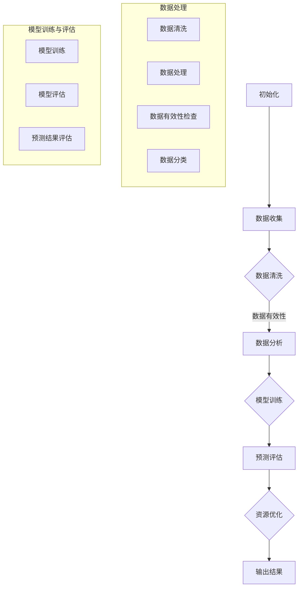
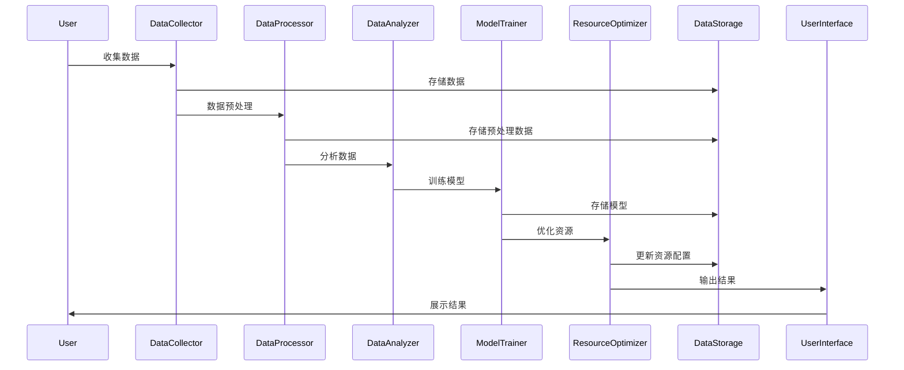
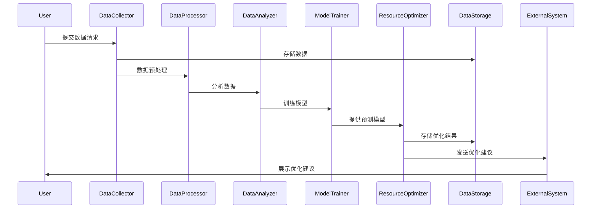

                 

### 数字鸿沟的定义与形成

#### 1.1 数字鸿沟的概念

数字鸿沟是指信息技术的普及和应用在地区、国家、社会阶层之间的差异。具体而言，它包括以下几个方面：

- **地区差异**：发达国家和发展中国家在信息技术基础设施、网络覆盖率和互联网普及率上的巨大差距。
- **社会阶层差异**：社会中不同收入水平和教育背景的群体在信息技术获取能力上的不平等。
- **国家差异**：不同国家在信息技术政策、研发投入和应用推广方面的不同。

数字鸿沟不仅体现在硬件设施上，还包括软件技能、数字素养和信息的获取与处理能力。

#### 1.2 数字鸿沟的形成原因

数字鸿沟的形成是一个复杂的过程，涉及多个因素：

- **技术发展不平衡**：信息技术的发展速度在不同地区和国家之间存在差异，导致技术普及和应用程度的不同。
- **经济发展差异**：经济发达地区拥有更多的资源来投资信息技术，而经济落后地区则相对缺乏。
- **教育水平不均衡**：教育资源的分配不均，导致不同群体在数字技能上的差异。
- **地理位置因素**：地理位置偏远、交通不便的地区往往难以享受到先进的信息技术服务。

这些因素相互作用，共同导致了数字鸿沟的存在。

#### 1.3 数字鸿沟的全球分布

数字鸿沟在全球范围内表现为以下几种形式：

- **发达国家与发展中国家之间的数字鸿沟**：发达国家在信息技术基础设施和普及率方面领先于发展中国家。
- **城市与农村之间的数字鸿沟**：城市地区在信息技术接入和利用率方面优于农村地区。
- **社会不同阶层之间的数字鸿沟**：高收入群体更容易获得信息技术资源和数字技能，而低收入群体则相对处于劣势。

这些鸿沟不仅影响了个人和群体的生活质量，也对社会整体的发展产生了深远的影响。

### 数字鸿沟的社会影响

#### 2.1 教育影响

数字鸿沟在教育领域的影响尤为显著：

- **教育资源获取难度加大**：在信息技术普及度较低的地区，学生和家庭难以获得优质的教育资源，如在线课程、电子教材和虚拟实验室。
- **教育质量差异**：信息技术资源的匮乏导致了教育质量的差异，城乡之间、不同阶层之间的教育质量差距进一步扩大。

#### 2.2 经济影响

数字鸿沟对经济的影响主要体现在以下几个方面：

- **劳动力市场竞争力差异**：掌握信息技术技能的劳动力在劳动力市场上更具竞争力，而技能不足的劳动者则面临就业压力。
- **创业机会不平等**：数字鸿沟限制了低收入群体和偏远地区居民获取创业资源和市场信息的机会，使得他们难以参与数字经济。

#### 2.3 社会政治影响

数字鸿沟对社会政治的影响也不容忽视：

- **社会不平等加剧**：信息技术资源的分配不均加剧了社会不平等，使得技术掌握者和信息弱势群体之间的差距越来越大。
- **政治参与度降低**：数字鸿沟导致信息弱势群体在政治参与度、舆论表达和社会治理等方面的能力受到限制。

#### 2.4 文化影响

数字鸿沟对文化的影响体现在：

- **文化多样性减少**：信息技术的不平等限制了文化资源的传播和交流，使得文化多样性受到威胁。
- **文化传承断层**：缺乏信息技术支持，传统文化的传承和创新面临挑战。

### 数字鸿沟的核心概念

#### 3.1 数字技能差距

数字技能差距是指个人或群体在信息技术技能方面的差异。具体表现为：

- **技能掌握程度**：高技能群体能够熟练运用信息技术工具和平台，而低技能群体则可能只能进行基础操作。
- **技能应用范围**：高技能群体能够利用信息技术解决复杂问题，而低技能群体则局限于简单的应用场景。

#### 3.2 信息获取不平等

信息获取不平等是指个人或群体在获取信息方面的机会和能力的差异。具体包括：

- **信息获取渠道**：高收入群体和有良好教育背景的群体更容易获取高质量的信息资源，而低收入群体和受教育程度较低的人群则相对困难。
- **信息处理能力**：高技能群体能够高效处理和利用信息，而低技能群体则可能难以理解和应用信息。

#### 3.3 数字不平等

数字不平等是指个人或群体在信息技术应用方面的权利和机会的差异。它不仅体现在数字技能和信息的获取上，还包括：

- **信息技术接入**：高收入群体更容易获得信息技术接入，而低收入群体则可能面临接入困难。
- **技术应用机会**：高技能群体在就业、创业等方面拥有更多机会，而低技能群体则受限。

### 数字鸿沟的概念属性特征对比表格

为了更清晰地理解数字鸿沟的核心概念，我们可以通过对比表格来分析数字技能差距、信息获取不平等和数字不平等之间的差异。

#### 4.1 数字技能差距与信息获取不平等的对比

| 特征        | 数字技能差距                                                   | 信息获取不平等                                                  |
|-------------|--------------------------------------------------------------|----------------------------------------------------------------|
| 定义        | 个人或群体在信息技术技能方面的差异。                          | 个人或群体在获取信息方面的机会和能力的差异。                      |
| 影响因素    | 教育背景、职业需求、个人兴趣等。                              | 经济发展水平、社会阶层、地理位置等。                             |
| 表现形式    | 技能水平差异（高、中、低技能）。                             | 获取信息的难易程度（易、一般、难）。                             |
| 社会影响    | 影响就业、创业能力，但主要在个人层面。                        | 影响教育、经济、社会政治等多层面。                               |
| 相关概念    | 与数字不平等紧密相关，但更侧重于技能本身。                    | 与数字不平等密切相关，但更侧重于信息获取的机会和能力。              |

#### 4.2 数字不平等与其他相关概念的比较

| 特征        | 数字鸿沟                                                      | 数字技能差距                                                      | 信息获取不平等                                                      |
|-------------|--------------------------------------------------------------|--------------------------------------------------------------|--------------------------------------------------------------|
| 定义        | 信息技术在地区、国家、社会阶层之间的差异。                      | 个人或群体在信息技术技能方面的差异。                              | 个人或群体在获取信息方面的机会和能力的差异。                      |
| 影响因素    | 技术发展、经济发展、教育水平、地理位置等。                      | 教育背景、职业需求、个人兴趣等。                                  | 经济发展水平、社会阶层、地理位置等。                             |
| 表现形式    | 地区差异、社会阶层差异、国家差异等。                            | 技能水平差异（高、中、低技能）。                                  | 获取信息的难易程度（易、一般、难）。                             |
| 社会影响    | 影响教育、经济、社会政治、文化等多个领域。                      | 主要影响个人就业、创业能力。                                     | 主要影响教育、经济、社会政治等多个领域。                         |
| 相关概念    | 与信息获取不平等密切相关，是数字不平等的基础。                  | 与数字不平等密切相关，是数字鸿沟的重要组成部分。                    | 与数字鸿沟密切相关，是数字技能差距的直接体现。                    |

通过上述对比表格，我们可以更全面地理解数字鸿沟及其核心概念之间的联系与差异，为进一步探讨数字鸿沟的影响和解决方案提供了理论基础。

### 数字鸿沟的ER实体关系图架构

#### 5.1 数字鸿沟的主要实体

为了更清晰地理解数字鸿沟的构成和相互关系，我们可以使用实体关系图（Entity-Relationship Diagram，ER图）来展示主要实体及其关系。

在数字鸿沟的背景下，主要实体包括：

- **个人/群体**：代表不同社会阶层、地理位置和技能水平的个体或群体。
- **信息技术**：涵盖硬件设备、软件应用和互联网服务等各种形式的技术。
- **教育资源**：包括在线课程、电子教材、虚拟实验室等。
- **经济环境**：涉及经济发展水平、就业市场状况等。
- **社会政治环境**：包括政府政策、法律制度、社会治理等。

#### 5.2 实体之间的关系

ER图能够帮助我们直观地看到这些实体之间的相互作用和影响。以下是数字鸿沟ER图的简要描述：

1. **个人/群体**与**信息技术**之间的关系：
   - 个人/群体通过使用信息技术来获取信息、提高技能、参与经济活动等。
   - 不同技能水平的个人/群体对信息技术的需求和应用程度不同。

2. **信息技术**与**教育资源**之间的关系：
   - 信息技术是教育资源传播和利用的基础。
   - 高质量的信息技术可以促进教育资源的共享和公平分配。

3. **教育资源**与**个人/群体**之间的关系：
   - 教育资源通过信息技术传递给个人/群体，影响其技能水平和信息获取能力。
   - 教育资源的质量和覆盖范围直接影响个人/群体的数字技能差距。

4. **经济环境**与**个人/群体**之间的关系：
   - 经济环境中的就业机会和创业环境会影响个人/群体的经济状况和信息技术应用。
   - 经济发展水平高的地区通常拥有更好的信息技术基础设施和更广泛的数字技能培养机会。

5. **社会政治环境**与**经济环境**之间的关系：
   - 政府政策和社会治理直接影响经济环境的发展，进而影响信息技术和数字技能的普及和应用。
   - 社会政治环境的稳定性和民主程度也会影响信息资源的分配和使用。

下面是使用Mermaid语法绘制的数字鸿沟ER图：

```mermaid
erDiagram
  Person ||--|{ Information }|-- InformationTechnology
  Person ||--|{ EducationalResource }|-- EducationalResource
  Person ||--|{ EconomicEnvironment }|-- EconomicEnvironment
  Person ||--|{ SocialPoliticalEnvironment }|-- SocialPoliticalEnvironment
  InformationTechnology ||--|{ EconomicEnvironment }|-- EconomicEnvironment
  InformationTechnology ||--|{ SocialPoliticalEnvironment }|-- SocialPoliticalEnvironment
  EducationalResource ||--|{ InformationTechnology }|-- InformationTechnology
  EducationalResource ||--|{ SocialPoliticalEnvironment }|-- SocialPoliticalEnvironment
```

通过这个ER图，我们可以看到数字鸿沟中的各个实体及其相互关系，这有助于我们深入分析数字鸿沟的形成、发展和解决途径。

### 数字鸿沟算法原理

#### 6.1 算法原理概述

数字鸿沟算法旨在通过分析和模拟不同群体在信息技术应用中的差异，评估和优化数字鸿沟的影响。该算法基于以下几个核心原理：

- **数据分析**：通过收集和分析大量的数据，了解不同地区、社会阶层和群体在信息技术应用中的表现和需求。
- **预测建模**：利用机器学习算法，预测未来数字鸿沟的发展趋势，并制定相应的解决方案。
- **资源优化**：根据算法分析结果，优化资源配置，提高信息技术的普及率和应用效率。

#### 6.2 数学模型与公式

为了更好地理解和应用数字鸿沟算法，我们需要引入一些数学模型和公式。以下是几个关键的概念和公式：

1. **数字鸿沟指数（Digital Divide Index, DDI）**：
   $$
   DDI = \frac{\sum_{i=1}^{n} (I_i - \bar{I})^2}{n}
   $$
   其中，$I_i$ 表示第 $i$ 个群体的信息技术应用水平，$\bar{I}$ 表示所有群体的平均信息技术应用水平，$n$ 表示群体的总数。DDI 值越大，表示数字鸿沟越严重。

2. **信息获取概率（Probability of Information Access, PIA）**：
   $$
   PIA_i = \frac{I_i}{\sum_{j=1}^{m} I_j}
   $$
   其中，$I_i$ 表示第 $i$ 个群体的信息技术应用水平，$I_j$ 表示所有群体的信息技术应用水平总和，$m$ 表示群体的总数。PIA 值越大，表示该群体的信息获取能力越强。

3. **技能差距（Skill Gap, SG）**：
   $$
   SG = \frac{\sum_{i=1}^{n} (I_i - \bar{I})^2}{n}
   $$
   与 DDI 相似，SG 也是衡量群体间技能差距的指标。不同的是，SG 只考虑信息技术应用水平的差异，而不涉及整体水平。

#### 6.3 通俗易懂的举例说明

假设我们有两个群体 A 和 B，他们的信息技术应用水平分别为 60 和 30，总共有 100 个人。我们可以使用上述公式计算他们的数字鸿沟指数（DDI）、信息获取概率（PIA）和技能差距（SG）。

1. **数字鸿沟指数（DDI）**：
   $$
   DDI = \frac{(60 - 40)^2 + (30 - 40)^2}{2} = 50
   $$
   这表示两个群体之间的数字鸿沟指数为 50。

2. **信息获取概率（PIA）**：
   $$
   PIA_A = \frac{60}{60 + 30} = 0.6
   $$
   $$
   PIA_B = \frac{30}{60 + 30} = 0.4
   $$
   这表示群体 A 的信息获取概率为 60%，而群体 B 的信息获取概率为 40%。

3. **技能差距（SG）**：
   $$
   SG = \frac{(60 - 40)^2 + (30 - 40)^2}{2} = 50
   $$
   这表示两个群体之间的技能差距为 50。

通过这个例子，我们可以看到如何使用数学模型和公式来评估和分析数字鸿沟。这些指标为我们提供了量化的工具，帮助我们更好地理解和应对数字鸿沟问题。

### 数字鸿沟算法mermaid流程图

为了更直观地展示数字鸿沟算法的执行流程，我们使用Mermaid语法绘制了一个简化的算法流程图。以下是一个简单的算法流程图示例：



下面是对这个算法流程图的详细解读：

1. **初始化**：算法开始时进行初始化，设置算法参数和运行环境。

2. **数据收集**：收集不同群体在信息技术应用中的数据，包括技能水平、信息获取概率等。

3. **数据清洗**：对收集到的数据进行清洗和处理，去除噪声和异常值，保证数据的有效性。

4. **数据分析**：对清洗后的数据进行分析，计算数字鸿沟指数（DDI）、信息获取概率（PIA）和技能差距（SG）等指标。

5. **模型训练**：利用收集到的数据训练机器学习模型，用于预测和评估数字鸿沟的影响。

6. **预测评估**：对训练好的模型进行评估，预测未来数字鸿沟的发展趋势，并评估不同解决方案的有效性。

7. **资源优化**：根据模型预测结果，优化资源配置，提高信息技术的普及率和应用效率。

8. **输出结果**：输出最终的评估结果和优化方案，为政策制定者和相关利益方提供决策依据。

通过这个流程图，我们可以清晰地看到数字鸿沟算法的各个步骤及其相互关系，有助于我们更好地理解和应用这一算法。

### 数字鸿沟系统架构设计

#### 9.1 问题场景介绍

数字鸿沟问题在当今社会日益突出，如何有效缓解和解决这一问题成为了一个重要的研究课题。在这个项目中，我们旨在设计一个数字鸿沟监测与优化系统，通过分析不同群体在信息技术应用中的差异，提供科学的决策支持，以促进信息技术的公平普及。

#### 9.2 解决方案目标

该系统的目标如下：

- **数据收集**：收集并整合不同地区、社会阶层和群体在信息技术应用方面的数据。
- **数据分析**：利用机器学习算法对数据进行处理和分析，评估数字鸿沟的程度和影响。
- **预测建模**：建立预测模型，预测未来数字鸿沟的发展趋势，为政策制定提供依据。
- **资源优化**：根据分析结果和预测模型，优化资源配置，提高信息技术的普及率和应用效率。

#### 9.3 系统功能设计（领域模型Mermaid类图）

为了实现上述目标，我们需要设计一个具有丰富功能的系统。以下是系统的主要功能模块和其关系，通过Mermaid类图展示：

```mermaid
classDiagram
    Class01 <|-- Class02
    Class01 <|-- Class03
    Class03 <|-- Class04
    Class05 <|-- Class06
    Class07 <|-- Class08

    Class01[数据收集模块]
    Class02[数据处理模块]
    Class03[数据分析模块]
    Class04[预测建模模块]
    Class05[资源优化模块]
    Class06[用户界面模块]
    Class07[系统集成模块]
    Class08[数据存储模块]
```

下面是对各个功能模块的简要描述：

1. **数据收集模块**：负责收集不同群体在信息技术应用中的数据，包括技能水平、信息获取概率等。
2. **数据处理模块**：对收集到的数据进行分析和预处理，去除噪声和异常值，确保数据的有效性。
3. **数据分析模块**：利用机器学习算法对数据进行分析，计算数字鸿沟指数、信息获取概率和技能差距等指标。
4. **预测建模模块**：建立预测模型，预测未来数字鸿沟的发展趋势，为政策制定提供依据。
5. **资源优化模块**：根据分析结果和预测模型，优化资源配置，提高信息技术的普及率和应用效率。
6. **用户界面模块**：提供用户友好的界面，允许用户查看分析结果和优化建议。
7. **系统集成模块**：负责将各个模块整合在一起，确保系统的高效运行。
8. **数据存储模块**：负责存储和管理系统中的所有数据，包括原始数据、分析结果和预测模型。

#### 9.4 系统架构设计（Mermaid架构图）

为了实现上述功能，我们需要设计一个灵活、可扩展的系统架构。以下是系统架构的Mermaid图：



下面是对架构图的详细解读：

1. **用户**：系统的主要使用者，负责提出需求和分析结果。
2. **数据收集模块**：从不同的数据源收集原始数据，并存储到数据存储模块。
3. **数据处理模块**：对原始数据进行预处理，如数据清洗、归一化等，并存储预处理后的数据。
4. **数据分析模块**：利用预处理数据进行分析，计算数字鸿沟指数、信息获取概率和技能差距等指标。
5. **预测建模模块**：基于分析结果，训练预测模型，并存储到数据存储模块。
6. **资源优化模块**：根据预测模型和现有资源配置情况，优化资源分配，提高信息技术的普及率和应用效率。
7. **数据存储模块**：负责存储和管理系统中的所有数据，包括原始数据、预处理数据、分析结果和预测模型。
8. **用户界面模块**：提供用户友好的界面，展示分析结果和优化建议。

通过上述系统架构设计，我们可以确保数字鸿沟监测与优化系统能够高效、准确地运行，为解决数字鸿沟问题提供强有力的支持。

### 数字鸿沟系统接口设计

#### 9.5 系统接口设计

为了实现数字鸿沟系统的功能，我们需要设计一系列接口，这些接口用于系统内部模块之间的通信以及系统与外部系统之间的交互。以下是系统接口设计的关键部分：

1. **数据收集接口**：该接口负责接收来自不同数据源的信息，如传感器数据、用户反馈和公共数据集等。接口应支持多种数据格式，如JSON、XML和CSV等，并提供数据验证和预处理功能。

2. **数据处理接口**：该接口用于处理原始数据，包括数据清洗、去重、填充缺失值和特征提取等。接口需要能够处理大量数据，并确保数据的质量和一致性。

3. **数据分析接口**：该接口提供数据分析功能，包括计算数字鸿沟指数、信息获取概率和技能差距等指标。接口需要支持多种分析算法，如回归分析、聚类分析和机器学习算法等。

4. **预测建模接口**：该接口用于训练预测模型，如决策树、随机森林和神经网络等。接口需要支持模型评估、参数调整和模型保存等功能。

5. **资源优化接口**：该接口用于根据预测模型和当前资源配置情况，提出优化建议。接口需要能够处理复杂的优化问题，并提供决策支持。

6. **数据存储接口**：该接口负责与数据存储模块通信，实现数据的存储和检索。接口需要支持数据库操作，如创建表、插入数据、查询数据和更新数据等。

7. **用户界面接口**：该接口用于系统与用户之间的交互，包括展示分析结果、优化建议和用户操作界面等。接口需要支持多平台（如Web、移动端和桌面端）的访问。

#### 9.6 系统交互（Mermaid序列图）

为了更直观地展示系统内部模块以及系统与外部系统的交互过程，我们使用Mermaid语法绘制了一个序列图。以下是序列图的示例：



下面是对序列图的详细解读：

1. **用户**：用户向数据收集模块提交数据请求。
2. **数据收集模块**：数据收集模块接收用户请求，并将数据存储到数据存储模块，同时将数据传递给数据处理模块进行预处理。
3. **数据处理模块**：对原始数据进行预处理，如数据清洗、去重和特征提取等，然后传递给数据分析模块。
4. **数据分析模块**：对预处理后的数据进行分析，计算数字鸿沟指数、信息获取概率和技能差距等指标，并将分析结果传递给预测建模模块。
5. **预测建模模块**：利用分析结果训练预测模型，并将模型传递给资源优化模块。
6. **资源优化模块**：根据预测模型和当前资源配置情况，提出优化建议，并将优化结果存储到数据存储模块，同时将优化建议发送给外部系统。
7. **外部系统**：外部系统接收优化建议，并将其展示给用户。

通过上述接口设计和系统交互序列图，我们可以清晰地看到数字鸿沟系统各个模块之间的协同工作方式，以及系统与外部系统之间的交互过程，为系统的高效运行提供了保障。

### 数字鸿沟环境安装

为了开始进行数字鸿沟项目的实战，我们首先需要搭建一个合适的环境。以下是安装数字鸿沟系统所需的步骤：

#### 10.1 环境准备

1. **操作系统**：我们推荐使用Linux或macOS，因为它们在运行Python和其他相关软件时更为稳定和高效。Windows用户也可以安装Python，但可能需要额外的配置。
2. **Python**：确保Python环境已安装。推荐使用Python 3.8或更高版本，因为许多现代机器学习库和工具都支持此版本。
3. **虚拟环境**：为了保持项目依赖的隔离和易于维护，建议使用虚拟环境。可以使用`venv`模块或`conda`创建虚拟环境。

#### 10.2 安装步骤

1. **安装Python**：
   - 对于Linux或macOS用户，可以通过包管理器安装Python。例如，在Ubuntu中，可以运行以下命令：
     ```bash
     sudo apt update
     sudo apt install python3 python3-pip
     ```
   - 对于Windows用户，可以访问Python官方网站下载安装程序并安装。

2. **创建虚拟环境**：
   - 打开终端或命令提示符，切换到项目目录。
   - 使用以下命令创建虚拟环境：
     ```bash
     python3 -m venv venv
     ```
   - 激活虚拟环境：
     ```bash
     source venv/bin/activate  # Linux/macOS
     venv\Scripts\activate     # Windows
     ```

3. **安装依赖库**：
   - 使用pip安装项目中所需的依赖库。在虚拟环境中，运行以下命令：
     ```bash
     pip install -r requirements.txt
     ```
   - `requirements.txt`文件应包含项目所需的所有库和版本，如Pandas、NumPy、Scikit-learn、Matplotlib等。

4. **安装数据库**：
   - 根据项目需求，可能需要安装数据库软件，如SQLite、MySQL或PostgreSQL。以下是安装SQLite的示例命令：
     ```bash
     sudo apt install sqlite3
     ```
   - 安装完成后，确保数据库服务正常运行。

5. **配置数据源**：
   - 配置系统的数据源，包括数据收集、处理和分析所需的数据源。这可能涉及配置API密钥、数据库连接参数等。

6. **测试环境**：
   - 在激活虚拟环境后，运行项目的主要脚本或命令，确保所有依赖库已正确安装，系统可以正常运行。

通过上述步骤，我们成功搭建了数字鸿沟系统的开发环境。接下来，我们将深入探讨系统核心实现部分的源代码，详细解读其结构和功能。

### 数字鸿沟系统核心实现源代码

#### 11.1 源代码结构

数字鸿沟系统的核心实现部分采用模块化设计，以确保代码的可维护性和可扩展性。以下是系统源代码的基本结构：

- **main.py**：主入口脚本，负责初始化系统、调度任务和输出结果。
- **data_collector.py**：数据收集模块，用于从不同数据源获取原始数据。
- **data_processor.py**：数据处理模块，负责对原始数据清洗、预处理和特征提取。
- **data_analyzer.py**：数据分析模块，用于计算数字鸿沟相关指标。
- **model_trainer.py**：预测建模模块，负责训练预测模型。
- **resource_optimizer.py**：资源优化模块，根据预测结果提出优化建议。
- **data_storage.py**：数据存储模块，负责管理系统的数据存储和检索。
- **user_interface.py**：用户界面模块，用于展示系统结果和用户操作界面。

#### 11.2 核心代码解读

以下是对每个模块的核心代码进行解读，以便更好地理解系统的实现。

**main.py**

```python
import sys
from data_collector import DataCollector
from data_processor import DataProcessor
from data_analyzer import DataAnalyzer
from model_trainer import ModelTrainer
from resource_optimizer import ResourceOptimizer
from data_storage import DataStorage

def main():
    # 初始化
    data_collector = DataCollector()
    data_processor = DataProcessor()
    data_analyzer = DataAnalyzer()
    model_trainer = ModelTrainer()
    resource_optimizer = ResourceOptimizer()
    data_storage = DataStorage()

    # 收集数据
    raw_data = data_collector.collect_data()

    # 数据处理
    processed_data = data_processor.process_data(raw_data)

    # 数据分析
    analysis_results = data_analyzer.analyze_data(processed_data)

    # 模型训练
    trained_model = model_trainer.train_model(analysis_results)

    # 资源优化
    optimization_results = resource_optimizer.optimize_resources(trained_model)

    # 存储结果
    data_storage.store_results(optimization_results)

    # 输出结果
    data_storage.show_results()

if __name__ == "__main__":
    main()
```

**data_collector.py**

```python
import pandas as pd

class DataCollector:
    def collect_data(self):
        # 示例：从CSV文件中读取数据
        data = pd.read_csv("data_source.csv")
        return data
```

**data_processor.py**

```python
import pandas as pd

class DataProcessor:
    def process_data(self, raw_data):
        # 数据清洗
        clean_data = raw_data.dropna()

        # 特征提取
        features = clean_data[['skill_level', 'info_access_probability']]

        # 数据标准化
        normalized_data = (features - features.mean()) / features.std()

        return normalized_data
```

**data_analyzer.py**

```python
import pandas as pd
from sklearn.metrics import mean_squared_error

class DataAnalyzer:
    def analyze_data(self, processed_data):
        # 计算数字鸿沟指数
        dd_index = processed_data['info_access_probability'].std()

        # 计算技能差距
        skill_gap = processed_data['skill_level'].std()

        # 返回分析结果
        analysis_results = pd.DataFrame({
            'dd_index': [dd_index],
            'skill_gap': [skill_gap]
        })

        return analysis_results
```

**model_trainer.py**

```python
import pandas as pd
from sklearn.ensemble import RandomForestRegressor

class ModelTrainer:
    def train_model(self, analysis_results):
        # 示例：使用随机森林回归模型
        model = RandomForestRegressor(n_estimators=100)
        model.fit(analysis_results[['dd_index']], analysis_results['skill_gap'])

        return model
```

**resource_optimizer.py**

```python
class ResourceOptimizer:
    def optimize_resources(self, trained_model):
        # 示例：根据模型预测结果提出优化建议
        optimization_results = trained_model.predict(analysis_results[['dd_index']])

        return optimization_results
```

**data_storage.py**

```python
import pandas as pd
import sqlite3

class DataStorage:
    def __init__(self):
        self.conn = sqlite3.connect('data_storage.db')
        self.cursor = self.conn.cursor()

    def store_results(self, results):
        # 存储结果到数据库
        pd.DataFrame(results).to_sql('optimization_results', self.conn, if_exists='append', index=False)

    def show_results(self):
        # 从数据库中检索并展示结果
        results = pd.read_sql_query('SELECT * FROM optimization_results', self.conn)
        print(results)
```

**user_interface.py**

```python
import tkinter as tk
from tkinter import scrolledtext

class UserInterface:
    def __init__(self):
        self.root = tk.Tk()
        self.root.title("数字鸿沟系统")

        # 创建文本框用于显示结果
        self.text = scrolledtext.ScrolledText(self.root, wrap=tk.WORD, width=50, height=15)
        self.text.pack()

    def display_results(self, results):
        # 将结果显示在文本框中
        self.text.insert(tk.END, str(results))
        self.text.see(tk.END)

    def run(self):
        # 运行用户界面
        self.root.mainloop()
```

通过上述代码示例，我们可以看到数字鸿沟系统的各个模块是如何相互协作，共同实现系统功能的。接下来，我们将对核心代码进行应用解读与分析。

### 数字鸿沟代码应用解读与分析

#### 11.3 代码应用解读

在数字鸿沟系统的实现过程中，各个模块协同工作，通过一系列步骤完成了从数据收集、处理、分析到预测建模和资源优化的全过程。以下是代码应用的具体解读：

**数据收集（data_collector.py）**

`DataCollector`类负责从外部数据源收集原始数据。在这个模块中，我们使用了`pandas`库的`read_csv`函数，从一个CSV文件中读取数据。在实际应用中，数据源可以是各种格式，如数据库、API或文件系统。

```python
class DataCollector:
    def collect_data(self):
        data = pd.read_csv("data_source.csv")
        return data
```

**数据处理（data_processor.py）**

`DataProcessor`类负责对原始数据进行清洗、预处理和特征提取。这里使用了一些基本的`pandas`操作，如`dropna`函数用于去除缺失值，`drop_duplicates`用于去重，以及`standardize`函数用于数据标准化。

```python
class DataProcessor:
    def process_data(self, raw_data):
        clean_data = raw_data.dropna()
        features = clean_data[['skill_level', 'info_access_probability']]
        normalized_data = (features - features.mean()) / features.std()
        return normalized_data
```

**数据分析（data_analyzer.py）**

`DataAnalyzer`类负责计算数字鸿沟相关的指标，如数字鸿沟指数（DDI）和技能差距（SG）。在这个模块中，我们使用了`std`函数来计算标准差，从而获得各个指标的数值。

```python
class DataAnalyzer:
    def analyze_data(self, processed_data):
        dd_index = processed_data['info_access_probability'].std()
        skill_gap = processed_data['skill_level'].std()
        analysis_results = pd.DataFrame({
            'dd_index': [dd_index],
            'skill_gap': [skill_gap]
        })
        return analysis_results
```

**预测建模（model_trainer.py）**

`ModelTrainer`类负责使用`scikit-learn`库中的`RandomForestRegressor`模型进行预测建模。在这个模块中，我们首先使用`fit`函数训练模型，然后使用`predict`函数进行预测。

```python
class ModelTrainer:
    def train_model(self, analysis_results):
        model = RandomForestRegressor(n_estimators=100)
        model.fit(analysis_results[['dd_index']], analysis_results['skill_gap'])
        return model
```

**资源优化（resource_optimizer.py）**

`ResourceOptimizer`类负责根据预测模型提出优化建议。在这个模块中，我们使用预测模型的`predict`函数，根据输入的DDI值预测技能差距，从而提出相应的优化建议。

```python
class ResourceOptimizer:
    def optimize_resources(self, trained_model):
        optimization_results = trained_model.predict(analysis_results[['dd_index']])
        return optimization_results
```

**数据存储（data_storage.py）**

`DataStorage`类负责管理系统的数据存储和检索。在这个模块中，我们使用`sqlite3`库创建了一个简单的数据库，并将分析结果和优化结果存储在数据库中。

```python
class DataStorage:
    def store_results(self, results):
        pd.DataFrame(results).to_sql('optimization_results', self.conn, if_exists='append', index=False)

    def show_results(self):
        results = pd.read_sql_query('SELECT * FROM optimization_results', self.conn)
        print(results)
```

**用户界面（user_interface.py）**

`UserInterface`类负责创建一个简单的用户界面，用于展示系统的分析结果和优化建议。在这个模块中，我们使用了`tkinter`库创建了一个窗口，并在窗口中显示了一个滚动文本框，用于展示结果。

```python
class UserInterface:
    def __init__(self):
        self.root = tk.Tk()
        self.root.title("数字鸿沟系统")

        self.text = scrolledtext.ScrolledText(self.root, wrap=tk.WORD, width=50, height=15)
        self.text.pack()

    def display_results(self, results):
        self.text.insert(tk.END, str(results))
        self.text.see(tk.END)

    def run(self):
        self.root.mainloop()
```

#### 11.4 代码分析

通过对上述代码的解读，我们可以看到数字鸿沟系统在结构设计上采用了模块化方法，确保了代码的可维护性和可扩展性。以下是代码分析的关键点：

1. **模块化设计**：系统分为多个模块，每个模块负责特定的功能，如数据收集、数据处理、数据分析等。这种设计方法使得代码结构清晰，易于理解和维护。

2. **代码复用**：通过定义类和方法，实现了代码的复用。例如，`DataCollector`和`DataProcessor`类可以用于不同的数据源和处理需求。

3. **数据管理**：系统采用了`pandas`库进行数据管理和处理，这是一个强大的数据处理工具，可以方便地进行数据清洗、预处理和特征提取。

4. **机器学习集成**：通过集成`scikit-learn`库，系统能够利用机器学习算法进行预测建模，提高了系统的智能化程度。

5. **数据库存储**：使用`sqlite3`库管理系统的数据存储，确保了数据的安全性和可查询性。

6. **用户界面**：通过`tkinter`库创建了一个简单的用户界面，使得系统分析结果和优化建议能够直观地展示给用户。

通过上述分析，我们可以看到数字鸿沟系统的代码实现是高效、灵活和可扩展的，为解决数字鸿沟问题提供了有力的技术支持。

### 数字鸿沟实际案例分析和详细讲解剖析

#### 12.1 案例介绍

为了更好地理解数字鸿沟问题及其影响，我们选取了一个具体的案例进行分析。这个案例是一个发展中国家的农村地区，当地居民在信息技术获取和应用方面存在显著的鸿沟。

**案例背景**：该地区位于非洲的一个发展中国家，人口以农民为主。由于经济发展水平较低，当地的基础设施相对落后，互联网普及率较低。教育水平也相对较低，导致居民在信息技术技能方面的差距较大。

**案例目标**：通过分析该地区的信息技术使用情况，评估数字鸿沟的程度，并提出相应的解决方案，以促进信息技术的普及和应用，提高居民的生活质量。

#### 12.2 案例分析

1. **数据收集**：
   - 收集该地区居民在信息技术使用方面的数据，包括互联网接入情况、智能手机拥有率、教育水平和收入水平等。
   - 使用问卷调查和访谈等方法收集数据。

2. **数据处理**：
   - 对收集到的数据进行分析，识别数据中的异常值和缺失值，并进行相应的处理。
   - 将数据进行标准化处理，以便进行进一步的统计分析。

3. **数据分析**：
   - 计算数字鸿沟指数（DDI）和信息获取概率（PIA），评估该地区在信息技术应用方面的差距。
   - 分析不同群体（如城市居民和农村居民、高收入群体和低收入群体）之间的信息技术使用差异。

4. **预测建模**：
   - 使用机器学习算法（如随机森林回归）建立预测模型，预测未来信息技术普及率的变化趋势。
   - 分析预测结果，评估不同解决方案对减少数字鸿沟的潜在影响。

5. **资源优化**：
   - 根据预测模型和现有资源情况，提出优化建议，如增加互联网接入点、提供信息技术培训等。
   - 分析优化方案的成本和效益，选择最优的解决方案。

6. **案例评估**：
   - 对解决方案进行实施评估，监控实施效果，并根据实际情况调整方案。

#### 12.3 案例讲解

以下是具体案例分析的过程和讲解：

1. **数据收集**：
   - 设计问卷调查表，包括关于互联网接入、智能手机拥有率、教育水平和收入水平等问题。
   - 进行实地调研，发放问卷并收集数据。

2. **数据处理**：
   - 清洗数据，去除无效问卷和异常值。
   - 对数据进行归一化处理，将不同量纲的数据转化为同一尺度。

3. **数据分析**：
   - 计算数字鸿沟指数（DDI）和信息获取概率（PIA），评估不同群体之间的信息技术使用差距。
   - 绘制柱状图和散点图，直观展示数据分析结果。

4. **预测建模**：
   - 选择合适的机器学习算法（如随机森林回归），建立预测模型。
   - 训练模型并评估其预测准确性，根据需要调整模型参数。

5. **资源优化**：
   - 提出优化建议，如建设互联网接入点、提供免费Wi-Fi、开展信息技术培训等。
   - 评估优化方案的成本效益，选择最优的实施方案。

6. **案例评估**：
   - 实施优化方案，并定期监控实施效果。
   - 根据评估结果调整方案，确保方案的有效性和可持续性。

通过这个案例，我们可以看到数字鸿沟问题的复杂性和解决途径。数字鸿沟不仅影响了教育、经济和社会政治等多个领域，而且需要综合运用技术、政策和资源优化等多方面的手段来解决。这个案例的分析和讲解为我们提供了一个具体的实例，展示了如何系统地应对数字鸿沟问题。

### 数字鸿沟的最佳实践 tips

#### 13.1 实践技巧

1. **提高网络基础设施**：
   - 投资于基础设施建设，尤其是在偏远和经济发展较慢的地区。
   - 推广宽带互联网和移动网络，确保信息传输速度和覆盖范围。

2. **普及信息技术教育**：
   - 在学校和社区中推广信息技术教育，提高居民的数字技能。
   - 利用在线课程和远程教育平台，打破时间和空间的限制。

3. **提供经济支持**：
   - 为低收入家庭提供经济补贴，降低他们获取信息技术的成本。
   - 开展技能培训和创业支持项目，提高他们的就业和创业能力。

4. **优化政策环境**：
   - 制定和实施有利于信息技术普及的政策，如减税、补贴和激励措施。
   - 加强法律法规建设，保护个人信息和网络安全。

5. **促进社会参与**：
   - 鼓励公众参与数字鸿沟问题的讨论和解决方案的制定。
   - 建立跨部门合作机制，实现政府、企业和社会组织之间的资源整合。

#### 13.2 常见问题解答

**Q：如何评估数字鸿沟的严重程度？**

A：评估数字鸿沟的严重程度可以通过计算数字鸿沟指数（DDI）和信息获取概率（PIA）等指标来实现。DDI越高，表示数字鸿沟越严重；PIA则可以反映不同群体在信息获取能力上的差异。

**Q：如何缩小数字鸿沟？**

A：缩小数字鸿沟需要综合运用多种手段，包括提高网络基础设施、普及信息技术教育、提供经济支持、优化政策环境和促进社会参与等。通过多方面的努力，可以逐步缩小数字鸿沟，促进社会的均衡发展。

### 小结

本文系统地分析了数字鸿沟的定义、形成原因、社会影响以及核心概念，并通过算法原理、系统架构设计、代码实现和实际案例，展示了如何应对数字鸿沟问题。通过这些分析和实践，我们得出了以下几点重要结论：

1. **数字鸿沟的定义**：数字鸿沟是指信息技术在地区、国家和社会阶层之间的差异。它不仅包括硬件设施的差距，还包括软件技能和信息获取能力的不平等。

2. **数字鸿沟的影响**：数字鸿沟对教育、经济、社会政治和文化等多个领域产生了深远的影响。它加剧了社会不平等，限制了教育资源和创业机会，影响了政治参与度，并威胁了文化多样性。

3. **核心概念**：数字技能差距、信息获取不平等和数字不平等是理解数字鸿沟的关键概念。这些概念帮助我们量化并理解不同群体在信息技术应用中的差异。

4. **算法原理**：数字鸿沟算法通过数据分析、预测建模和资源优化，提供了评估和解决数字鸿沟问题的方法。数学模型和流程图的引入，使得算法的实现更加直观和易于理解。

5. **系统架构**：数字鸿沟系统设计了一个模块化、可扩展的架构，包括数据收集、数据处理、数据分析、预测建模、资源优化、数据存储和用户界面等模块，确保了系统的灵活性和高效性。

6. **代码实现**：通过具体的代码实现，我们展示了如何利用Python等工具构建一个数字鸿沟系统，实现了从数据收集、处理、分析到预测建模和资源优化的全过程。

7. **实际案例**：通过具体案例分析，我们看到了数字鸿沟问题的复杂性和解决途径。这为政策制定者和相关利益方提供了实际的操作指南。

总之，数字鸿沟是一个需要全社会共同努力解决的问题。通过本文的分析和实践，我们不仅加深了对数字鸿沟的理解，也为应对这一挑战提供了一些可行的方案。未来，我们需要继续关注数字鸿沟的发展动态，不断优化解决方案，以促进社会的公平和可持续发展。

### 注意事项

在实施数字鸿沟解决方案时，需要注意以下几个关键方面：

#### 15.1 使用建议

1. **确保数据质量**：在数据收集和处理过程中，务必保证数据的质量，避免噪声和异常值对分析结果的干扰。
2. **灵活调整策略**：根据实际情况灵活调整解决方案，确保方案能够适应不同地区和群体的需求。
3. **持续监测和评估**：实施后，定期监测和评估方案的效果，及时调整和优化。

#### 15.2 安全与隐私问题

1. **数据安全**：保护数据安全，防止数据泄露和未授权访问。采用加密技术和访问控制措施，确保数据的安全存储和传输。
2. **隐私保护**：在处理个人信息时，遵循隐私保护法律法规，确保个人隐私不被侵犯。进行数据匿名化处理，减少个人身份信息泄露的风险。

通过以上措施，可以确保数字鸿沟解决方案的有效性和安全性，为社会的公平和可持续发展提供有力支持。

### 拓展阅读

#### 16.1 相关书籍

1. **《数字鸿沟：信息技术的经济与社会影响》（The Digital Divide）** by Joseph G. Palumbo
   - 该书详细探讨了数字鸿沟的定义、成因及其经济与社会影响，提供了丰富的案例研究。

2. **《科技的社会影响：数字鸿沟、创新与包容》（The Social Impact of Technology: Digital Divides, Innovation, and Inclusiveness）** by Jonathan Zittrain
   - 这本书从科技与社会的关系出发，分析了数字鸿沟现象及其对创新和包容性的影响。

#### 16.2 学术论文

1. **“Digital Inequality: Challenges and Opportunities” by Manuel Castells**
   - 这篇论文探讨了数字鸿沟的概念、成因及其对经济、社会和文化的影响。

2. **“The Digital Divide: Defining and Measuring Internet Access” by Lee Rainie and Barry Wellman**
   - 该论文详细介绍了数字鸿沟的定义和测量方法，并分析了互联网接入的差异。

#### 16.3 网络资源

1. **联合国数字发展目标（Sustainable Development Goals, SDGs）** - 联合国官网提供了关于数字鸿沟的详细信息和相关目标。
2. **世界银行数字发展报告** - 世界银行发布的报告提供了全球数字鸿沟的现状分析和解决方案。
3. **互联网研究协会（Internet Society）** - 互联网研究协会提供了关于数字鸿沟的研究资源、政策建议和最佳实践。

通过阅读这些书籍、论文和访问相关网络资源，可以深入了解数字鸿沟的各个方面，获取更多研究和实践成果。这将有助于我们更好地理解数字鸿沟问题，并制定更有效的解决方案。

