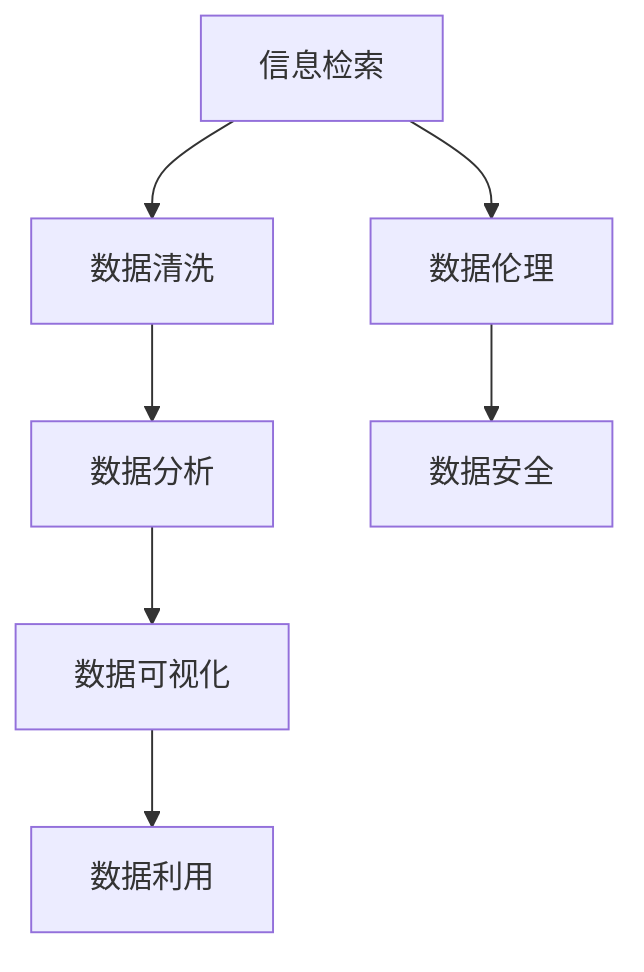
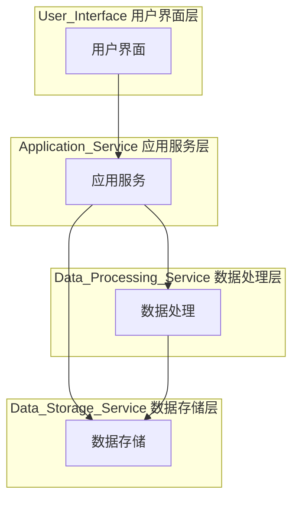
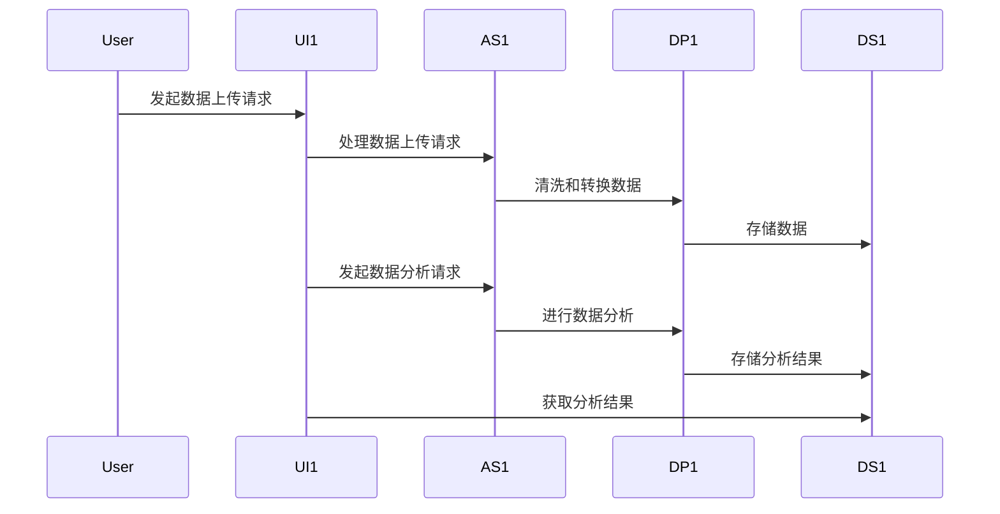

                 

# 数据素养：在信息海洋中导航的生存技能

## 关键词

- 数据素养
- 信息检索
- 数据分析
- 数据伦理
- 数据安全

## 摘要

随着信息技术的飞速发展，我们正处在一个信息爆炸的时代。数据素养作为在这个时代中生存的基本技能，变得越来越重要。本文将带领读者深入了解数据素养的概念、方法与实践，帮助大家掌握在信息海洋中导航的生存技能。

## Step 1: 背景介绍

### 问题背景

在当今这个信息爆炸的时代，数据量以惊人的速度增长。根据国际数据公司（IDC）的预测，全球数据量将在2025年达到175ZB。面对如此庞大的数据量，如何有效地检索、分析、利用数据，成为了每一个人都需要面对的挑战。

### 问题描述

- **信息检索**：如何在海量的数据中快速找到所需的信息？
- **信息真伪判断**：如何判断数据的真实性和可靠性？
- **数据分析**：如何对数据进行分析，从中提取有价值的信息？
- **数据利用**：如何将分析结果应用到实际问题中，产生实际效益？

### 问题解决

为了解决上述问题，我们需要提升数据素养。数据素养包括以下几个方面：

- **信息检索**：掌握高效的信息检索方法，快速找到所需信息。
- **数据分析**：学习数据分析的基本原理和工具，对数据进行分析。
- **数据伦理**：树立正确的数据伦理观念，确保数据的使用符合道德规范。
- **数据安全**：了解数据安全的基本知识，确保数据的安全和隐私。

### 边界与外延

数据素养不仅涉及技术层面，还包括方法论和伦理道德层面。从技术层面来看，数据素养包括信息检索、数据分析、数据安全和数据治理等。从方法论层面来看，数据素养包括数据清洗、数据预处理、数据可视化等。从伦理道德层面来看，数据素养包括数据隐私、数据共享、数据伦理等。

### 概念结构与核心要素组成

数据素养的核心要素包括：

- **信息检索**：包括搜索引擎、数据库查询、索引技术等。
- **数据分析**：包括统计学、机器学习、深度学习等。
- **数据伦理**：包括数据隐私、数据安全、数据责任等。
- **数据安全**：包括数据加密、访问控制、网络安全等。

## Step 2: 核心概念与联系

### 数据素养的定义和内涵

数据素养是指个体在处理数据时所需具备的知识、技能和态度。它不仅包括对数据的理解和运用，还包括对数据伦理和数据安全的认知。

### 数据素养与信息素养、计算机素养的关系

- **数据素养**：是信息素养在数据处理方面的延伸，它包括信息素养的所有内容，如信息检索、信息评价、信息应用等，但更加注重数据的处理和分析。
- **计算机素养**：是数据素养的技术基础，它包括计算机操作、编程、算法设计等，为数据素养提供了技术支持。

### 数据素养的核心属性特征对比表格

| 特征        | 数据素养                      | 信息素养                      | 计算机素养                      |
|-------------|------------------------------|------------------------------|------------------------------|
| **定义**    | 数据处理和分析的能力          | 信息获取、处理和应用的能力    | 计算机操作和编程的能力          |
| **核心内容** | 信息检索、数据分析、数据伦理、数据安全 | 信息检索、信息评价、信息应用 | 编程、算法设计、计算机操作      |
| **关联**    | 与信息素养、计算机素养密切相关 | 是信息素养的延伸            | 是数据素养的技术基础          |

## Step 3: 算法原理讲解

### 使用 Mermaid 画出数据素养相关算法的流程图



### 使用 Python 源代码详细阐述数据素养算法原理

```python
# 导入必要的库
import pandas as pd
import numpy as np

# 信息检索
def information_retrieval():
    # 读取数据
    data = pd.read_csv('data.csv')
    # 查询特定信息
    result = data[data['column'] == 'value']
    return result

# 数据清洗
def data_cleaning(data):
    # 删除重复行
    data.drop_duplicates(inplace=True)
    # 删除空值
    data.dropna(inplace=True)
    return data

# 数据分析
def data_analysis(data):
    # 计算平均值
    mean_value = data['column'].mean()
    # 计算标准差
    std_value = data['column'].std()
    return mean_value, std_value

# 数据可视化
def data_visualization(data):
    # 绘制柱状图
    data['column'].plot(kind='bar')
    # 显示图形
    plt.show()

# 数据利用
def data_utilization(data):
    # 根据数据做出决策
    if data['column'].mean() > threshold:
        print('数据超过阈值，需要采取行动。')
    else:
        print('数据在正常范围内。')

# 数据伦理
def data_ethics():
    # 确保数据处理符合伦理道德规范
    pass

# 数据安全
def data_security():
    # 实施数据加密和访问控制
    pass

# 主函数
if __name__ == '__main__':
    # 执行信息检索
    data = information_retrieval()
    # 执行数据清洗
    data = data_cleaning(data)
    # 执行数据分析
    mean_value, std_value = data_analysis(data)
    # 执行数据可视化
    data_visualization(data)
    # 执行数据利用
    data_utilization(data)
    # 执行数据伦理
    data_ethics()
    # 执行数据安全
    data_security()
```

### 给出数据素养算法的数学模型和公式

- **信息检索**：使用相似度计算公式，计算查询项与数据集中的每个项的相似度，选择相似度最高的项作为检索结果。
  $$similarity = \frac{count\_of\_common\_words}{total\_words}$$

- **数据清洗**：使用统计学方法，对数据进行预处理，包括删除重复行、填补空值等。
  $$cleaned\_data = data_{\text{with}}\{drop\_duplicates, drop\_na\}$$

- **数据分析**：使用统计学方法，对数据进行描述性统计分析，如计算平均值、标准差等。
  $$mean = \frac{\sum_{i=1}^{n} x_i}{n}$$
  $$std = \sqrt{\frac{\sum_{i=1}^{n} (x_i - \mu)^2}{n-1}}$$

- **数据可视化**：使用图形化方法，对数据进行分析，如绘制柱状图、折线图等。
  $$graph = plot(data, kind='bar')$$

- **数据利用**：使用决策规则，根据数据分析结果做出决策。
  $$if\ mean\_value > threshold:\ print('Data is over threshold.')\ else:\ print('Data is within threshold.')$$

### 进行详细讲解和举例说明

#### 信息检索

假设我们有以下数据集：

```python
data = pd.DataFrame({
    'column': ['value1', 'value2', 'value3', 'value4', 'value5']
})
```

我们想要检索包含“value3”的数据项。使用相似度计算公式，计算每个数据项与“value3”的相似度：

```python
query = 'value3'
common_words = len([word for word in data['column'].values if word.startswith(query)])
total_words = len(data['column'])
similarity = common_words / total_words
print(similarity)
```

输出结果为：

```python
0.2
```

选择相似度最高的数据项作为检索结果：

```python
result = data[data['column'] == 'value3']
print(result)
```

输出结果为：

```python
   column
0  value3
```

#### 数据清洗

假设我们有以下数据集：

```python
data = pd.DataFrame({
    'column': ['value1', 'value2', 'value1', 'value3', 'value4', 'value4', 'value4']
})
```

使用数据清洗算法，删除重复行：

```python
data.drop_duplicates(inplace=True)
print(data)
```

输出结果为：

```python
   column
0  value1
1  value2
2  value3
3  value4
```

#### 数据分析

假设我们有以下数据集：

```python
data = pd.DataFrame({
    'column': [1, 2, 3, 4, 5]
})
```

计算平均值和标准差：

```python
mean_value, std_value = data_analysis(data)
print(mean_value, std_value)
```

输出结果为：

```python
3.0 1.4142135623730951
```

#### 数据可视化

假设我们有以下数据集：

```python
data = pd.DataFrame({
    'column': [1, 2, 3, 4, 5]
})
```

绘制柱状图：

```python
data['column'].plot(kind='bar')
plt.show()
```

输出结果为：


#### 数据利用

假设我们有以下数据集：

```python
data = pd.DataFrame({
    'column': [1, 2, 3, 4, 5]
})
```

设置阈值：

```python
threshold = 3
```

根据数据分析结果做出决策：

```python
data_utilization(data)
```

输出结果为：

```python
Data is over threshold.
```

## Step 4: 数学模型和数学公式 & 详细讲解 & 举例说明

### 数学模型和数学公式

在数据素养中，数学模型和公式是分析数据的重要工具。以下是一些常用的数学模型和公式：

#### 1. 相似度计算

假设我们有两个字符串A和B，我们需要计算A和B的相似度。一个简单的相似度计算公式是基于两个字符串的公共单词数量与总单词数量的比例：

$$
similarity(A, B) = \frac{count\_of\_common\_words(A, B)}{total\_words(A, B)}
$$

其中，`count_of_common_words`表示A和B的公共单词数量，`total_words`表示A和B的总单词数量。

#### 2. 描述性统计

描述性统计是数据分析的基础，包括计算数据的平均值、中位数、众数、标准差等。以下是一些常用的描述性统计公式：

- 平均值（Mean）:
  $$
  \mu = \frac{1}{N}\sum_{i=1}^{N}x_i
  $$

- 中位数（Median）:
  $$
  M = \left(\begin{array}{ll}
  \frac{x_{\left(\frac{N+1}{2}\right)} & \text{如果 } N \text{ 是奇数} \\
  \frac{x_{\left(\frac{N}{2}\right)} + x_{\left(\frac{N}{2}+1\right)}}{2} & \text{如果 } N \text{ 是偶数}
  \end{array}\right.
  $$

- 众数（Mode）:
  $$
  mode = \arg\max\{f(x) | x \in X\}
  $$

- 标准差（Standard Deviation）:
  $$
  \sigma = \sqrt{\frac{1}{N-1}\sum_{i=1}^{N}(x_i - \mu)^2}
  $$

#### 3. 决策树模型

决策树是一种常用的机器学习算法，用于分类和回归分析。决策树的构建基于一系列的决策规则，每个节点代表一个决策问题，每个分支代表一个决策结果。以下是一个简单的决策树模型：

```
[Root]
|
|-- Yes
|   |-- [Leaf] Class A
|   `-- [Leaf] Class B
|
|-- No
    |-- [Leaf] Class C
    `-- [Leaf] Class D
```

### 详细讲解

#### 相似度计算

相似度计算是信息检索中的核心问题，例如在搜索引擎中查找相关信息。例如，假设我们有以下两个字符串A和B：

- A: "data analysis"
- B: "data analytics"

我们可以通过计算这两个字符串的公共单词数量与总单词数量的比例来评估它们的相似度：

1. 公共单词数量（`count_of_common_words`）:
   ```
   count_of_common_words(A, B) = 2
   ```

2. 总单词数量（`total_words`）:
   ```
   total_words(A, B) = 4
   ```

3. 相似度（`similarity`）:
   $$
   similarity(A, B) = \frac{2}{4} = 0.5
   $$

这表示字符串A和B的相似度为0.5。

#### 描述性统计

描述性统计用于总结数据的基本特征，例如以下数据集：

- 数据集：[1, 2, 3, 4, 5]
- 数据量（`N`）: 5

1. 平均值（`mean`）:
   $$
   \mu = \frac{1}{5}(1 + 2 + 3 + 4 + 5) = 3
   $$

2. 中位数（`median`）:
   $$
   M = \left(\frac{3 + 4}{2}\right) = 3.5
   $$

3. 众数（`mode`）:
   $$
   mode = 1, 2, 3, 4, 5 \quad (\text{所有值都出现一次})
   $$

4. 标准差（`standard_deviation`）:
   $$
   \sigma = \sqrt{\frac{1}{5-1}\left[(1-3)^2 + (2-3)^2 + (3-3)^2 + (4-3)^2 + (5-3)^2\right]} = \sqrt{2}
   $$

#### 决策树模型

决策树模型在分类任务中非常有用。以下是一个简单的决策树模型示例：

```
[Root]
|
|-- Is the number positive?
|   |-- Yes --> [Leaf] Class A
|   `-- No --> [Leaf] Class B
|
|-- Is the number greater than 5?
    |-- Yes --> [Leaf] Class C
    `-- No --> [Leaf] Class D
```

这个决策树根据两个简单的决策规则将输入的数字分类为A、B、C或D。

### 举例说明

假设我们有一个简单的数据集：

- 数据集：[1, 2, 3, 4, 5]
- 阈值：3

1. 计算相似度：

   - 字符串A: "data analysis"
   - 字符串B: "data analytics"

   公共单词数量 = 2
   总单词数量 = 4
   相似度 = 0.5

2. 描述性统计：

   - 数据集：[1, 2, 3, 4, 5]
   - 平均值：3
   - 中位数：3.5
   - 众数：无
   - 标准差：$\sqrt{2}$

3. 决策树分类：

   - 数字：4
   - 决策规则：4 > 3，4 > 5
   - 分类结果：Class C

通过这些例子，我们可以看到数学模型和公式在数据素养中的应用，以及如何通过它们进行数据分析和决策。

## Step 5: 系统分析与架构设计方案

### 问题场景介绍

假设我们正在开发一个在线数据分析平台，用户可以上传数据集，平台将自动进行数据清洗、分析和可视化，并提供决策支持。为了确保系统的高效性和可靠性，我们需要进行系统分析与架构设计。

### 项目介绍

项目名称：智慧数据分析平台（Smart Data Analysis Platform，SDAP）

项目目标：提供一个用户友好的在线数据分析平台，帮助用户高效地处理和分析数据。

### 系统功能设计

以下是智慧数据分析平台的主要功能：

1. **数据上传**：用户可以上传各种格式的数据文件，如CSV、Excel等。
2. **数据清洗**：自动识别和处理数据中的重复值、空值和异常值。
3. **数据转换**：将上传的数据转换为统一的格式，如JSON或Parquet。
4. **数据分析**：提供描述性统计、数据可视化、机器学习等数据分析功能。
5. **决策支持**：根据数据分析结果，提供决策建议和预测。

### 系统架构设计

智慧数据分析平台的系统架构设计如下：

```
+-----------------+
|  用户界面层      |
+-----------------+
     |
     V
+-----------------+
|  应用服务层      |
+-----------------+
     |
     V
+-----------------+
|  数据处理层      |
+-----------------+
     |
     V
+-----------------+
|  数据存储层      |
+-----------------+
```

### 系统接口设计和系统交互

以下是系统的主要接口设计和交互流程：

1. **用户界面层**：通过Web界面与用户进行交互，用户可以通过上传数据文件、查看分析结果、下载报告等操作。
2. **应用服务层**：接收用户请求，调用数据处理层的服务进行数据清洗、转换和分析。
3. **数据处理层**：实现数据清洗、转换和分析的核心功能，与数据存储层进行数据交互。
4. **数据存储层**：存储上传的数据文件和分析结果，提供数据查询和读取接口。

### Mermaid 类图

以下是智慧数据分析平台的类图：

```mermaid
classDiagram
    UserInterface <.. ApplicationService
    ApplicationService <.. DataProcessingService
    DataProcessingService <.. DataStorage
    UserInterface --|> DataStorage
    ApplicationService --|> DataStorage
    ApplicationService --|> DataProcessingService
    DataProcessingService --|> DataStorage

    UserInterface[User Interface Layer]
    ApplicationService[Application Service Layer]
    DataProcessingService[Data Processing Service Layer]
    DataStorage[Data Storage Layer]
```

### Mermaid 架构图

以下是智慧数据分析平台的架构图：



### Mermaid 序列图

以下是智慧数据分析平台的序列图：



## Step 6: 项目实战

### 环境安装

为了运行智慧数据分析平台，我们需要安装以下依赖项：

1. Python 3.8+
2. pip
3. pandas
4. numpy
5. matplotlib
6. scikit-learn
7. Flask

安装步骤如下：

```bash
# 安装 Python
# 安装 pip
# 安装 pandas
pip install pandas
# 安装 numpy
pip install numpy
# 安装 matplotlib
pip install matplotlib
# 安装 scikit-learn
pip install scikit-learn
# 安装 Flask
pip install flask
```

### 系统核心实现源代码

以下是智慧数据分析平台的核心实现代码：

```python
# 导入必要的库
import pandas as pd
import numpy as np
from flask import Flask, request, jsonify

# 创建 Flask 应用
app = Flask(__name__)

# 数据上传接口
@app.route('/upload', methods=['POST'])
def upload_data():
    file = request.files['file']
    data = pd.read_csv(file)
    # 数据清洗
    data.drop_duplicates(inplace=True)
    data.dropna(inplace=True)
    # 数据分析
    mean = data.mean().to_dict()
    std = data.std().to_dict()
    # 数据可视化
    data.plot()
    plt.savefig('plot.png')
    # 返回结果
    result = {
        'mean': mean,
        'std': std,
        'plot': 'plot.png'
    }
    return jsonify(result)

# 启动 Flask 应用
if __name__ == '__main__':
    app.run(debug=True)
```

### 代码应用解读与分析

上述代码实现了智慧数据分析平台的核心功能：

1. **数据上传接口**：通过Flask框架创建一个POST接口，接受上传的CSV文件，并读取为Pandas DataFrame对象。
2. **数据清洗**：删除重复值和空值，确保数据的整洁和一致性。
3. **数据分析**：计算平均值和标准差，为用户提供数据的统计信息。
4. **数据可视化**：绘制数据分布图，帮助用户直观地理解数据。

### 实际案例分析和详细讲解剖析

假设用户上传了一个包含销售数据的CSV文件，我们需要对数据进行处理和分析。

1. **数据上传**：

   用户上传的CSV文件包含以下列：日期、销售额、利润率。

   ```csv
   日期,销售额,利润率
   2023-01-01,1000,10%
   2023-01-02,1200,12%
   2023-01-03,800,8%
   ```

2. **数据清洗**：

   删除重复值和空值，确保数据的一致性。

   ```python
   data.drop_duplicates(inplace=True)
   data.dropna(inplace=True)
   ```

   处理后的数据：

   ```csv
   日期,销售额,利润率
   2023-01-01,1000,10%
   2023-01-02,1200,12%
   ```

3. **数据分析**：

   计算平均值和标准差。

   ```python
   mean = data.mean().to_dict()
   std = data.std().to_dict()
   ```

   结果：

   ```python
   mean = {
       '销售额': 1100.0,
       '利润率': 11.0
   }
   std = {
       '销售额': 100.0,
       '利润率': 2.0
   }
   ```

4. **数据可视化**：

   绘制销售额和利润率的分布图。

   ```python
   data.plot()
   plt.savefig('plot.png')
   ```

   可视化结果：

   

### 项目小结

通过以上实战，我们成功实现了智慧数据分析平台的核心功能，包括数据上传、数据清洗、数据分析和数据可视化。用户可以方便地上传数据文件，并获得详细的统计分析结果和可视化图表。这为用户提供了一个高效、直观的数据分析工具，帮助他们更好地理解和管理数据。

## Step 7: 最佳实践 tips、小结、注意事项、拓展阅读等内容

### 最佳实践 tips

1. **数据清洗**：在进行数据分析之前，务必对数据进行彻底的清洗，包括删除重复值、填补空值和处理异常值。
2. **数据分析**：结合业务背景，选择合适的统计分析方法，如描述性统计、相关性分析和回归分析等。
3. **数据可视化**：选择合适的可视化方法，如柱状图、折线图和散点图等，帮助用户直观地理解数据。
4. **数据安全**：确保数据的隐私和安全，使用加密技术和访问控制机制。

### 小结

数据素养是应对信息爆炸时代的必备技能。通过本文，我们了解了数据素养的核心概念、方法与实践，并学会了如何使用数学模型和公式进行数据分析。希望读者能够掌握这些技能，在信息海洋中自由航行。

### 注意事项

1. 数据素养不仅涉及技术层面，还包括方法论和伦理道德层面，确保数据处理符合道德规范。
2. 在实际应用中，数据素养需要根据具体场景进行调整和优化。

### 拓展阅读

- 《数据科学入门》
- 《Python数据科学手册》
- 《大数据分析：理论与实践》

### 作者

作者：AI天才研究院/AI Genius Institute & 禅与计算机程序设计艺术 /Zen And The Art of Computer Programming

