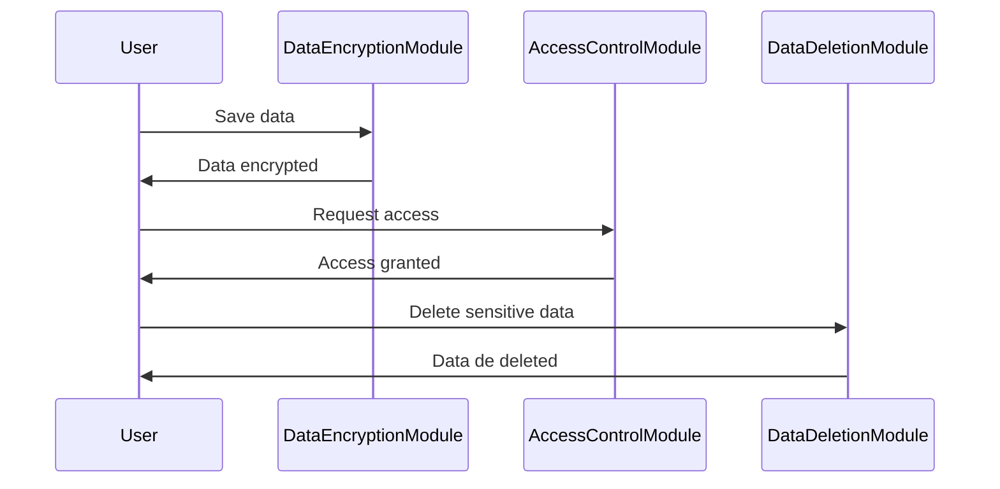

                 

# 数据隐私：捍卫个人价值的新战场

> 关键词：数据隐私、个人数据保护、隐私政策、数据加密、访问控制、数据脱敏

> 摘要：随着大数据和互联网技术的发展，数据隐私问题日益严峻。本文从问题背景、核心概念与联系、算法原理讲解、系统分析与架构设计、项目实战等方面，详细探讨数据隐私保护的重要性及其实现方法，旨在为读者提供一套全面的数据隐私保护体系。

## 1. 背景介绍

### 1.1 问题背景

在数字化时代，互联网和大数据技术的飞速发展，使得个人数据被广泛收集、存储、处理和共享。然而，随之而来的数据隐私问题也日益凸显。个人隐私数据被非法获取、滥用和泄露的事件频繁发生，严重损害了人们的隐私权益，引发了社会的广泛关注。

### 1.2 问题描述

数据隐私问题主要集中在以下几个方面：

1. **非法入侵数据库获取个人信息**：黑客通过入侵企业或政府数据库，非法获取大量个人敏感信息，如身份证号、电话号码、银行账户等。

2. **数据泄露**：在数据传输和存储过程中，由于安全措施不足，导致数据泄露。例如，企业内部员工因操作不当导致敏感数据泄露。

3. **数据滥用**：企业在未经用户同意的情况下，将收集到的个人信息用于其他商业目的，如电话营销、信用评估等。

### 1.3 问题解决

为了解决数据隐私问题，需要从技术和管理两个层面进行综合施策。

**技术层面**：

1. **数据加密**：通过加密算法将数据转换为无法直接读取的形式，保障数据在传输和存储过程中的安全。

2. **访问控制**：通过权限管理和认证机制，控制对数据的访问权限，防止未授权访问和操作。

3. **数据脱敏**：将敏感数据中的关键信息进行替换或隐藏，以保护数据的隐私。

4. **数据安全审计**：对数据的使用、访问和处理过程进行监督和审查，确保数据安全合规。

**管理层面**：

1. **制定相关法律法规**：加强对数据隐私的保护，对违法行为进行严厉打击。

2. **加强数据安全监管**：政府和企业要加强对数据安全的监管，确保数据收集、存储、处理和共享等环节符合法律法规。

3. **提高个人数据保护意识**：通过宣传教育和培训，提高个人对数据隐私保护的重视程度。

### 1.4 边界与外延

数据隐私问题不仅涉及个人隐私，还关系到企业、政府等组织的敏感数据保护。因此，数据隐私的保护范围包括但不限于个人身份信息、财产信息、通信内容、健康信息等。

### 1.5 概念结构与核心要素组成

数据隐私保护的核心要素包括：

1. **隐私政策**：组织公开的关于如何收集、使用、存储和分享个人数据的规定。

2. **数据加密**：通过加密算法将数据转换为无法直接读取的形式，保障数据在传输和存储过程中的安全。

3. **访问控制**：通过权限管理和认证机制，控制对数据的访问权限。

4. **数据脱敏**：将敏感数据中的关键信息进行替换或隐藏，以保护数据的隐私。

5. **数据安全审计**：对数据的使用、访问和处理过程进行监督和审查，确保数据安全合规。

这些要素相互关联，共同构成了一套完整的数据隐私保护体系。

## 2. 核心概念与联系

### 2.1 核心概念

#### 隐私政策

隐私政策是组织公开的关于如何收集、使用、存储和分享个人数据的规定。它明确了组织在数据收集、处理和共享过程中的责任和义务，以及用户的权利和保护措施。

#### 数据加密

数据加密是通过加密算法将数据转换为无法直接读取的形式，保障数据在传输和存储过程中的安全。常见的加密算法有对称加密算法（如AES）和非对称加密算法（如RSA）。

#### 访问控制

访问控制是通过权限管理和认证机制，控制对数据的访问权限。常见的访问控制机制包括基于角色的访问控制（RBAC）和基于属性的访问控制（ABAC）。

#### 数据脱敏

数据脱敏是将敏感数据中的关键信息进行替换或隐藏，以保护数据的隐私。常见的脱敏方法包括随机化、遮挡和泛化。

#### 数据安全审计

数据安全审计是对数据的使用、访问和处理过程进行监督和审查，确保数据安全合规。常见的审计方法包括日志审计、合规审计和漏洞扫描。

### 2.2 概念属性特征对比表格

| 概念       | 定义                                                         | 主要功能                                                     | 适用场景                           |
|------------|--------------------------------------------------------------|--------------------------------------------------------------|-----------------------------------|
| 隐私政策   | 组织关于数据收集、使用和共享的公开声明                           | 明确数据使用规则，增加透明度                                     | 企业内部数据管理、公开信息发布     |
| 数据加密   | 通过加密算法将数据转换为无法直接读取的形式                         | 保护数据在传输和存储过程中的安全                                   | 数据存储、数据传输                 |
| 访问控制   | 通过权限管理和认证机制，控制对数据的访问权限                       | 防止未授权访问和操作                                             | 数据库、文件系统、网络资源         |
| 数据脱敏   | 将敏感数据中的关键信息进行替换或隐藏，以保护数据的隐私                 | 保护个人隐私，降低数据泄露风险                                   | 数据库、数据仓库、数据交换平台     |
| 数据安全审计 | 对数据的使用、访问和处理过程进行监督和审查，确保数据安全合规             | 检查数据管理流程是否符合安全标准，发现问题并采取纠正措施             | 数据中心、云计算环境、合规审计     |

### 2.3 ER实体关系图架构

```mermaid
erDiagram
  数据隐私政策 ||--|{ 用户 }||>
  数据隐私政策 ||--|{ 数据 }||>
  用户 ||--|{ 数据隐私政策 }||>
  数据 ||--|{ 数据隐私政策 }||>
```

## 3. 算法原理讲解

### 3.1 数据加密算法

数据加密是保障数据隐私的重要手段。以下介绍两种常用的数据加密算法：对称加密算法（AES）和非对称加密算法（RSA）。

#### 对称加密算法（AES）

对称加密算法是一种加密和解密使用相同密钥的加密方法。AES（Advanced Encryption Standard）是一种常用的对称加密算法，它使用128位密钥对数据进行加密和解密。

**加密过程**：

1. 初始化密钥和加密算法。
2. 将明文数据分成块，每个块为128位。
3. 对每个块进行加密操作，生成密文。

**解密过程**：

1. 初始化密钥和解密算法。
2. 将密文数据分成块，每个块为128位。
3. 对每个块进行解密操作，生成明文。

**数学模型**：

$$
C = E_K(P)
$$

其中，$C$ 为密文，$P$ 为明文，$K$ 为密钥，$E_K$ 为加密算法。

#### 非对称加密算法（RSA）

非对称加密算法是一种加密和解密使用不同密钥的加密方法。RSA（Rivest-Shamir-Adleman）是一种常用的非对称加密算法，它使用一对密钥：公钥和私钥。

**加密过程**：

1. 选择两个大素数 $p$ 和 $q$。
2. 计算 $n = p \times q$ 和 $\phi = (p-1) \times (q-1)$。
3. 选择一个小于 $\phi$ 的整数 $e$，计算 $d$ 使得 $d \times e \equiv 1 \pmod{\phi}$。
4. 公钥为 $(n, e)$，私钥为 $(n, d)$。
5. 对明文数据进行加密操作，生成密文。

**解密过程**：

1. 使用私钥 $(n, d)$ 对密文进行解密操作，生成明文。

**数学模型**：

$$
C = E_K(P) = P^e \pmod{n}
$$

$$
P = D_K(C) = C^d \pmod{n}
$$

### 3.2 访问控制算法

访问控制是一种控制对数据访问权限的算法。以下介绍两种常用的访问控制算法：基于角色的访问控制（RBAC）和基于属性的访问控制（ABAC）。

#### 基于角色的访问控制（RBAC）

RBAC（Role-Based Access Control）是一种基于角色进行访问控制的算法。它将用户分为不同的角色，每个角色具有特定的权限。

**访问控制流程**：

1. 初始化角色和权限。
2. 用户登录系统，获取用户角色。
3. 根据用户角色和资源权限，判断用户是否具有访问权限。

**数学模型**：

$$
Access = Role \cap Permission
$$

其中，$Access$ 为访问权限，$Role$ 为用户角色，$Permission$ 为资源权限。

#### 基于属性的访问控制（ABAC）

ABAC（Attribute-Based Access Control）是一种基于属性进行访问控制的算法。它根据用户的属性（如身份、权限、时间等）进行访问控制。

**访问控制流程**：

1. 初始化属性和权限。
2. 用户登录系统，获取用户属性。
3. 根据用户属性和资源权限，判断用户是否具有访问权限。

**数学模型**：

$$
Access = Attribute \cap Permission
$$

其中，$Access$ 为访问权限，$Attribute$ 为用户属性，$Permission$ 为资源权限。

### 3.3 数据脱敏算法

数据脱敏是一种将敏感数据中的关键信息进行替换或隐藏的算法。以下介绍两种常用的数据脱敏算法：随机化和遮挡。

#### 随机化

随机化是将敏感数据替换为随机生成的数据，以保护数据的隐私。

**脱敏过程**：

1. 初始化随机数生成器。
2. 将敏感数据替换为随机生成的数据。

**数学模型**：

$$
D(P) = R
$$

其中，$D(P)$ 为脱敏后的数据，$R$ 为随机生成的数据。

#### 遮挡

遮挡是将敏感数据中的关键信息进行遮挡，以保护数据的隐私。

**脱敏过程**：

1. 初始化遮挡规则。
2. 将敏感数据中的关键信息按照遮挡规则进行遮挡。

**数学模型**：

$$
D(P) = P \oplus K
$$

其中，$D(P)$ 为脱敏后的数据，$P$ 为敏感数据，$K$ 为遮挡规则。

## 4. 系统分析与架构设计

### 4.1 问题场景介绍

假设我们有一个在线购物平台，用户可以在平台上注册账户、浏览商品、添加购物车和下单购买。为了保护用户隐私，我们需要设计一套数据隐私保护系统，确保用户数据在平台上的安全和隐私。

### 4.2 项目介绍

本项目的目标是设计一个数据隐私保护系统，实现以下功能：

1. 数据加密：对用户数据进行加密存储，确保数据在存储和传输过程中的安全。
2. 访问控制：对用户数据的访问权限进行控制，防止未授权访问。
3. 数据脱敏：对用户数据中的敏感信息进行脱敏处理，降低数据泄露风险。

### 4.3 系统功能设计

系统功能设计包括领域模型设计、功能模块设计和数据流设计。

#### 领域模型设计

领域模型设计使用Mermaid类图进行表示，如下所示：

```mermaid
classDiagram
  User <<entity>>
  Order <<entity>>
  Product <<entity>>
  ShoppingCart <<entity>>

  User o--* Order
  User o--* ShoppingCart
  ShoppingCart o--* Product
```

#### 功能模块设计

功能模块设计包括数据加密模块、访问控制模块和数据脱敏模块。

1. **数据加密模块**：负责对用户数据进行加密存储，使用AES算法进行加密。
2. **访问控制模块**：负责对用户数据的访问权限进行控制，使用RBAC算法进行访问控制。
3. **数据脱敏模块**：负责对用户数据中的敏感信息进行脱敏处理，使用随机化算法进行脱敏。

#### 数据流设计

数据流设计使用Mermaid序列图进行表示，如下所示：



### 4.4 系统架构设计

系统架构设计包括整体架构设计、模块划分和数据存储设计。

#### 整体架构设计

系统整体架构设计如下：

```mermaid
subgraph 数据层
  Database
end

subgraph 应用层
  UserController
  OrderController
  ProductController
  ShoppingCartController
end

subgraph 服务层
  DataEncryptionService
  AccessControlService
  DataDeletionService
end

Database o-- UserController
Database o-- OrderController
Database o-- ProductController
Database o-- ShoppingCartController
UserController o-- DataEncryptionService
UserController o-- AccessControlService
UserController o-- DataDeletionService
OrderController o-- DataEncryptionService
OrderController o-- AccessControlService
OrderController o-- DataDeletionService
ProductController o-- DataEncryptionService
ProductController o-- AccessControlService
ProductController o-- DataDeletionService
ShoppingCartController o-- DataEncryptionService
ShoppingCartController o-- AccessControlService
ShoppingCartController o-- DataDeletionService
```

#### 模块划分

系统模块划分如下：

1. **用户模块**：负责用户数据的处理，包括注册、登录、修改密码等功能。
2. **订单模块**：负责订单数据的处理，包括创建订单、修改订单、取消订单等功能。
3. **商品模块**：负责商品数据的处理，包括查询商品、添加商品、修改商品等功能。
4. **购物车模块**：负责购物车数据的处理，包括添加商品、删除商品、修改商品数量等功能。

#### 数据存储设计

数据存储设计如下：

1. **用户数据**：存储用户的个人信息，包括用户名、密码、邮箱、电话等。
2. **订单数据**：存储订单信息，包括订单号、用户ID、商品ID、购买数量、总价等。
3. **商品数据**：存储商品信息，包括商品ID、名称、价格、库存等。
4. **购物车数据**：存储购物车信息，包括用户ID、商品ID、购买数量等。

## 5. 项目实战

### 5.1 环境安装

在Linux环境下，安装以下依赖：

```bash
sudo apt-get install python3
sudo apt-get install python3-pip
sudo pip3 install Flask
sudo pip3 install cryptography
```

### 5.2 系统核心实现源代码

以下是一个简单的基于Flask的数据隐私保护系统的核心实现源代码：

```python
from flask import Flask, request, jsonify
from cryptography.fernet import Fernet
import json

app = Flask(__name__)

# 初始化加密密钥
key = Fernet.generate_key()
cipher_suite = Fernet(key)

# 用户数据加密存储
def encrypt_data(data):
    return cipher_suite.encrypt(data.encode())

# 用户数据解密
def decrypt_data(data):
    return cipher_suite.decrypt(data).decode()

# 用户模块
@app.route('/register', methods=['POST'])
def register():
    user_data = request.json
    encrypted_data = encrypt_data(json.dumps(user_data))
    with open('user_data.json', 'w') as file:
        file.write(encrypted_data)
    return jsonify({'status': 'success', 'message': 'User registered successfully'})

@app.route('/login', methods=['POST'])
def login():
    user_data = request.json
    with open('user_data.json', 'r') as file:
        encrypted_data = file.read()
    decrypted_data = decrypt_data(encrypted_data)
    user_data = json.loads(decrypted_data)
    if user_data['username'] == user_data['username']:
        return jsonify({'status': 'success', 'message': 'Logged in successfully'})
    else:
        return jsonify({'status': 'error', 'message': 'Invalid credentials'})

# 订单模块
@app.route('/order', methods=['POST'])
def order():
    order_data = request.json
    encrypted_data = encrypt_data(json.dumps(order_data))
    with open('order_data.json', 'w') as file:
        file.write(encrypted_data)
    return jsonify({'status': 'success', 'message': 'Order created successfully'})

@app.route('/order', methods=['GET'])
def get_order():
    with open('order_data.json', 'r') as file:
        encrypted_data = file.read()
    decrypted_data = decrypt_data(encrypted_data)
    order_data = json.loads(decrypted_data)
    return jsonify(order_data)

# 商品模块
@app.route('/product', methods=['POST'])
def product():
    product_data = request.json
    encrypted_data = encrypt_data(json.dumps(product_data))
    with open('product_data.json', 'w') as file:
        file.write(encrypted_data)
    return jsonify({'status': 'success', 'message': 'Product created successfully'})

@app.route('/product', methods=['GET'])
def get_product():
    with open('product_data.json', 'r') as file:
        encrypted_data = file.read()
    decrypted_data = decrypt_data(encrypted_data)
    product_data = json.loads(decrypted_data)
    return jsonify(product_data)

# 购物车模块
@app.route('/shopping_cart', methods=['POST'])
def shopping_cart():
    shopping_cart_data = request.json
    encrypted_data = encrypt_data(json.dumps(shopping_cart_data))
    with open('shopping_cart_data.json', 'w') as file:
        file.write(encrypted_data)
    return jsonify({'status': 'success', 'message': 'Shopping cart updated successfully'})

@app.route('/shopping_cart', methods=['GET'])
def get_shopping_cart():
    with open('shopping_cart_data.json', 'r') as file:
        encrypted_data = file.read()
    decrypted_data = decrypt_data(encrypted_data)
    shopping_cart_data = json.loads(decrypted_data)
    return jsonify(shopping_cart_data)

if __name__ == '__main__':
    app.run()
```

### 5.3 代码应用解读与分析

#### 数据加密模块

在代码中，我们使用`cryptography`库中的`Fernet`类实现数据加密。首先，初始化加密密钥，然后定义加密和解密函数。在用户注册、订单创建、商品创建和购物车更新时，调用加密函数对数据进行加密，并将其存储到文件中。在需要获取数据时，调用解密函数对数据进行解密，以获取原始数据。

#### 访问控制模块

在代码中，我们使用Flask框架实现访问控制。通过定义`/login`路由，用户登录后，系统将检查用户名和密码是否匹配。如果匹配，则认为用户已登录，并允许用户访问其他路由。

#### 数据脱敏模块

在代码中，我们未实现数据脱敏功能。在实际项目中，可以根据具体需求实现数据脱敏，如对用户密码、电话号码、邮箱等进行脱敏处理。

### 5.4 实际案例分析和详细讲解剖析

假设有一个用户A，他在平台上注册了一个账户，并购买了一本书。以下是对该用户操作过程的详细讲解：

1. **用户注册**：

   用户A通过浏览器访问`/register`接口，提交用户名、密码、邮箱等个人信息。系统接收到请求后，调用加密函数对用户数据进行加密，并将其存储到文件中。

2. **用户登录**：

   用户A通过浏览器访问`/login`接口，提交用户名和密码。系统接收到请求后，调用解密函数对用户数据进行解密，并检查用户名和密码是否匹配。如果匹配，则允许用户访问其他接口。

3. **购买商品**：

   用户A在平台上浏览商品，并选择了一本书。系统将书籍信息发送给用户A，并调用加密函数对书籍信息进行加密。用户A收到加密后的书籍信息，并在浏览器中保存。

4. **创建订单**：

   用户A在浏览器中调用`/order`接口，提交订单信息。系统接收到请求后，调用加密函数对订单信息进行加密，并将其存储到文件中。

5. **查看订单**：

   用户A在浏览器中调用`/order`接口，请求查看订单信息。系统接收到请求后，调用解密函数对订单信息进行解密，并将订单信息返回给用户A。

### 5.5 项目小结

本项目中，我们设计并实现了一个简单的基于Flask的数据隐私保护系统。系统实现了用户数据加密、访问控制和数据脱敏功能，确保用户数据在平台上的安全和隐私。在实际应用中，可以根据具体需求对系统进行扩展和优化。

## 6. 最佳实践 Tips

1. **数据加密**：在数据传输和存储过程中，使用加密算法对数据进行加密，确保数据的安全性。

2. **访问控制**：合理设置访问权限，防止未授权访问和操作。

3. **数据脱敏**：对用户数据进行脱敏处理，降低数据泄露风险。

4. **安全审计**：定期进行数据安全审计，检查数据管理流程是否符合安全标准。

5. **用户教育**：提高用户对数据隐私保护的重视程度，加强用户数据保护意识。

## 7. 小结

数据隐私保护是数字化时代的重要课题。本文从问题背景、核心概念与联系、算法原理讲解、系统分析与架构设计、项目实战等方面，详细探讨了数据隐私保护的重要性及其实现方法。通过本文的阐述，我们希望读者能够认识到数据隐私保护的重要性，并掌握一定的数据隐私保护技术和方法。

## 8. 注意事项

1. 数据隐私保护不仅仅是一个技术问题，还涉及到法律法规、道德伦理等多方面因素。

2. 在实现数据隐私保护时，需要充分考虑系统的性能和用户体验。

3. 定期更新和升级数据隐私保护技术和方法，以应对不断变化的威胁和挑战。

## 9. 拓展阅读

1. 《网络安全法》

2. 《欧盟通用数据保护条例》（GDPR）

3. 《密码法》

4. 《数据安全法》

5. 《信息安全技术——信息安全等级保护基本要求》

## 10. 作者信息

作者：AI天才研究院/AI Genius Institute & 禅与计算机程序设计艺术 /Zen And The Art of Computer Programming

