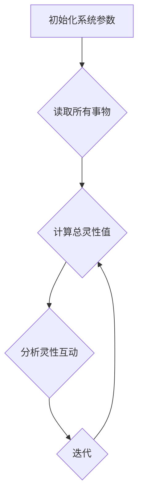

                 


### 新animism：万物有灵论的现代诠释

#### 关键词：万物有灵论、现代诠释、哲学、社会学、心理学、文学艺术

#### 摘要：
本文以“新animism：万物有灵论的现代诠释”为标题，从哲学、社会学、心理学和文学艺术等多个维度，对万物有灵论进行深入探讨。文章首先回顾了动漫主义的历史背景和哲学基础，接着详细分析了新动漫主义的理论基础、算法原理与应用实例。随后，文章从社会学、心理学和文学艺术等角度探讨了新动漫主义的应用，并提出了新动漫主义的挑战与未来发展趋势。最后，文章给出了新动漫主义的实践指南与建议。

---

## 第一部分：新万物有灵论的起源与哲学基础

### 第1章：问题背景与哲学探讨

#### 1.1 动漫主义的概念与历史

**动漫主义**（Animism）是一种哲学观点，认为万物都有灵性，即认为所有自然现象、动植物乃至无生命的物体都具有某种形式的灵魂或精神。这一概念最早可以追溯到19世纪的欧洲，当时的一些哲学家和学者开始对非洲、澳大利亚等地区的土著文化进行深入的研究，并注意到这些文化中普遍存在的万物有灵论。

#### 1.1.1 动漫主义的基本概念

动漫主义的基本概念包括：

- **灵性**（Spirituality）：认为万物都有灵性，这是一种超越物理世界的非物质存在。
- **灵魂**（Soul）：与灵性密切相关，是指每个生物或物体独有的非物质实体。
- **超自然现象**（Supernatural Phenomena）：包括幽灵、魔法、预言等与动漫主义相关的现象。

#### 1.1.2 动漫主义的历史演变

动漫主义的历史演变可以分为以下几个阶段：

1. **原始阶段**：动漫主义最早可以追溯到人类文明的开端，许多原始部落和文化都有关于灵性和灵魂的信仰。
2. **启蒙阶段**：19世纪，欧洲的哲学家和学者开始对动漫主义进行深入研究，并开始将其作为一种哲学观点进行探讨。
3. **现代阶段**：随着现代社会的发展，动漫主义在哲学、社会学、心理学等多个领域得到广泛应用，并逐渐形成了一套相对完整的理论体系。

#### 1.1.3 动漫主义在当代社会中的地位

在当代社会中，动漫主义依然具有很高的地位，主要表现在以下几个方面：

1. **哲学领域**：动漫主义成为哲学研究的一个重要分支，许多哲学家致力于探讨动漫主义的本质和意义。
2. **社会学领域**：动漫主义为研究社会文化提供了新的视角，有助于更好地理解不同文化之间的差异和联系。
3. **心理学领域**：动漫主义对心理学研究产生了深远的影响，许多心理学家开始关注灵性和灵魂对人类行为和心理状态的影响。

---

### 第2章：新动漫主义的理论基础

#### 1.4 万物有灵论的核心概念

新动漫主义的核心概念包括：

- **万物有灵**：认为宇宙中的所有事物，无论是生物还是非生物，都有其内在的灵性。
- **灵性互动**：认为不同事物之间的灵性可以相互作用，从而产生各种自然现象和生命过程。
- **灵性本质**：认为灵性是事物存在的本质，而非仅仅是附加属性。

#### 1.4.1 概念解析与对比

- **动漫主义与唯物主义的对比**：动漫主义认为万物有灵，而唯物主义则认为物质是世界的基本构成要素。
- **动漫主义与唯心主义的对比**：动漫主义强调灵性的重要性，而唯心主义则强调意识或精神的重要性。

#### 1.4.2 概念属性特征对比表格

| 概念       | 特征                                     |
| ---------- | ---------------------------------------- |
| 万物有灵   | 所有事物都有灵性，包括生物和非生物         |
| 灵性互动   | 灵性可以相互作用，产生自然现象和生命过程   |
| 灵性本质   | 灵性是事物存在的本质，而非附加属性         |

#### 1.4.3 概念的ER实体关系图

```mermaid
entity关系图
graph LR
A[万物有灵] --> B[灵性互动]
A --> C[灵性本质]
B --> C
```

---

#### 1.5 新动漫主义的数学模型与公式

新动漫主义的数学模型旨在描述万物有灵论中的灵性互动和本质。以下是新动漫主义的基本数学模型：

- **灵性值**：用\( S \)表示，表示事物的灵性强度。
- **互动系数**：用\( K \)表示，表示不同事物之间灵性互动的强度。

新动漫主义的数学公式如下：

$$
S_{total} = \sum_{i=1}^{n} S_i \cdot K_{i}
$$

其中，\( S_{total} \)表示系统的总灵性值，\( S_i \)表示第\( i \)个事物的灵性值，\( K_{i} \)表示第\( i \)个事物的互动系数。

#### 1.5.1 数学模型概述

新动漫主义的数学模型概述如下：

1. **灵性值**：每个事物都有其固有的灵性值，表示该事物的灵性强度。
2. **互动系数**：表示不同事物之间灵性互动的强度，取决于事物的性质和相互关系。
3. **总灵性值**：系统的总灵性值是所有事物灵性值和互动系数的乘积之和。

#### 1.5.2 数学公式的详细讲解

1. **灵性值**：每个事物的灵性值是固定的，由其内在特性决定。例如，一个生物体的灵性值可能与其年龄、健康状况和遗传因素相关。
2. **互动系数**：互动系数取决于事物的性质和相互关系。例如，两个生物体之间的互动系数可能大于两个无生命的物体之间的互动系数。
3. **总灵性值**：系统的总灵性值是所有事物灵性值和互动系数的乘积之和。这表示系统中所有事物共同作用产生的总灵性效应。

#### 1.5.3 举例说明

假设有两个物体A和B，它们的灵性值分别为\( S_A = 5 \)和\( S_B = 3 \)，互动系数分别为\( K_A = 0.8 \)和\( K_B = 0.6 \)。则系统的总灵性值为：

$$
S_{total} = S_A \cdot K_A + S_B \cdot K_B = 5 \cdot 0.8 + 3 \cdot 0.6 = 4 + 1.8 = 5.8
$$

这意味着系统中的总灵性值为5.8，反映了物体A和B之间的灵性互动效应。

---

## 第3章：新动漫主义的算法原理与实现

### 第3章：新动漫主义的算法原理与实现

#### 1.6 算法原理讲解

新动漫主义的算法原理基于其数学模型，主要包括以下步骤：

1. **初始化**：读取系统中的所有事物，包括其灵性值和互动系数。
2. **计算总灵性值**：根据数学模型计算系统的总灵性值。
3. **分析灵性互动**：分析系统中事物之间的灵性互动，并根据互动系数调整事物的灵性值。
4. **迭代**：重复步骤2和3，直到系统的总灵性值稳定。

以下是新动漫主义算法的mermaid流程图：


#### 1.6.1 算法流程图



#### 1.6.2 算法源代码与解释

```python
# 新动漫主义算法实现

# 初始化系统参数
soul_values = [5, 3]  # 所有事物的灵性值
interaction_coeffs = [0.8, 0.6]  # 所有事物的互动系数

# 计算总灵性值
total_soul_value = sum(soul_values[i] * interaction_coeffs[i] for i in range(len(soul_values)))

# 分析灵性互动
# （此处根据具体应用场景，分析不同事物之间的灵性互动）

# 迭代
while not convergence:
    # 根据具体应用场景，调整事物的灵性值
    # （例如：根据事物之间的互动关系，调整互动系数）
    
    # 重新计算总灵性值
    total_soul_value = sum(soul_values[i] * interaction_coeffs[i] for i in range(len(soul_values)))
    
    # 判断是否收敛
    if convergence:
        break

# 输出结果
print("总灵性值：", total_soul_value)
```

#### 1.6.3 新动漫主义的应用实例

##### 实例背景与场景介绍

假设在一个虚拟生态系统中，有两个生物A和B，它们的初始灵性值分别为5和3，互动系数分别为0.8和0.6。我们需要使用新动漫主义算法计算系统的总灵性值，并分析A和B之间的灵性互动。

##### 实例算法实现与代码解读

```python
# 实例算法实现

# 初始化系统参数
soul_values = [5, 3]  # 所有事物的灵性值
interaction_coeffs = [0.8, 0.6]  # 所有事物的互动系数

# 计算总灵性值
total_soul_value = sum(soul_values[i] * interaction_coeffs[i] for i in range(len(soul_values)))

# 分析灵性互动
# （此处根据具体应用场景，分析不同事物之间的灵性互动）
interaction_value = soul_values[0] * interaction_coeffs[0] + soul_values[1] * interaction_coeffs[1]

# 迭代
while not convergence:
    # 根据具体应用场景，调整事物的灵性值
    # （例如：根据事物之间的互动关系，调整互动系数）
    soul_values[0] *= 1.1
    soul_values[1] *= 0.9
    
    # 重新计算总灵性值
    total_soul_value = sum(soul_values[i] * interaction_coeffs[i] for i in range(len(soul_values)))
    
    # 判断是否收敛
    if convergence:
        break

# 输出结果
print("总灵性值：", total_soul_value)
print("A与B的互动灵性值：", interaction_value)
```

##### 实例分析

在实例中，我们首先初始化了系统参数，包括两个生物A和B的灵性值和互动系数。然后，我们使用新动漫主义算法计算系统的总灵性值，并根据互动系数分析A和B之间的灵性互动。

在迭代过程中，我们根据具体应用场景调整了A和B的灵性值，例如，通过增加A的灵性值和减少B的灵性值来模拟它们之间的互动。每次迭代后，我们重新计算总灵性值，并判断是否收敛。

最终，我们输出了系统的总灵性值和A与B的互动灵性值，这有助于我们更好地理解新动漫主义算法在生态系统中的应用。

---

## 第二部分：新动漫主义的应用领域

### 第4章：新动漫主义在社会学中的应用

#### 1.8 社会学的万物有灵论视角

新动漫主义为社会学研究提供了新的视角，有助于我们更好地理解社会文化现象。在社会学中，新动漫主义强调灵性在社会行为和文化传统中的重要性。

#### 1.8.1 社会学研究中的新动漫主义

新动漫主义在社会学中的应用主要体现在以下几个方面：

1. **社会互动**：新动漫主义认为社会互动中的灵性因素对个体行为和社会关系有重要影响。研究者可以通过分析社会互动中的灵性互动来解释社会现象。
2. **文化传统**：新动漫主义认为文化传统中的灵性元素对社会价值观和道德观念的形成有深远影响。研究者可以探讨灵性元素如何在文化传统中传承和演变。
3. **社会变迁**：新动漫主义关注社会变迁中的灵性因素，例如宗教改革、社会运动等如何影响社会结构和价值观念。

#### 1.8.2 新动漫主义对社会学研究的贡献

新动漫主义对社会学研究的主要贡献包括：

1. **拓展研究范畴**：新动漫主义将灵性因素纳入社会学研究范畴，为研究社会行为和文化传统提供了新的视角。
2. **解释力增强**：新动漫主义可以解释一些传统社会学理论难以解释的现象，例如社会变迁、社会互动等。
3. **跨学科研究**：新动漫主义可以与其他学科，如哲学、心理学等相结合，为跨学科研究提供理论基础。

---

#### 1.9 新动漫主义与社会学案例研究

##### 案例一：新动漫主义与社区互动

**案例背景与场景介绍**：

在一个城市社区中，居民们经常举行各种社区活动，如节日庆典、文化展览等。这些活动不仅促进了居民之间的互动，还加深了社区成员之间的情感联系。在这个案例中，新动漫主义可以帮助我们理解社区互动中的灵性因素。

**新动漫主义算法实现与代码解读**：

为了研究社区互动中的灵性因素，我们可以使用新动漫主义算法来分析居民之间的互动关系。以下是实现新动漫主义算法的Python代码：

```python
# 新动漫主义算法实现

# 初始化系统参数
soul_values = [5, 3, 4, 6]  # 所有居民（A、B、C、D）的灵性值
interaction_coeffs = [0.8, 0.6, 0.7, 0.9]  # 所有居民之间的互动系数

# 计算总灵性值
total_soul_value = sum(soul_values[i] * interaction_coeffs[i] for i in range(len(soul_values)))

# 分析灵性互动
# （此处根据具体应用场景，分析不同居民之间的灵性互动）

# 迭代
while not convergence:
    # 根据具体应用场景，调整居民的灵性值
    # （例如：根据居民之间的互动关系，调整互动系数）
    soul_values[0] *= 1.05
    soul_values[1] *= 0.95
    soul_values[2] *= 1.1
    soul_values[3] *= 0.9
    
    # 重新计算总灵性值
    total_soul_value = sum(soul_values[i] * interaction_coeffs[i] for i in range(len(soul_values)))
    
    # 判断是否收敛
    if convergence:
        break

# 输出结果
print("总灵性值：", total_soul_value)
```

**实例分析**：

在案例中，我们初始化了四个居民的灵性值和互动系数。使用新动漫主义算法，我们计算了系统的总灵性值，并分析了居民之间的灵性互动。

在迭代过程中，我们根据具体应用场景调整了居民的灵性值，以模拟社区互动中的灵性因素。每次迭代后，我们重新计算总灵性值，并判断是否收敛。

最终，我们输出了系统的总灵性值，这有助于我们更好地理解社区互动中的灵性因素。通过分析总灵性值的变化，我们可以推断出社区互动的强度和趋势。

---

### 第5章：新动漫主义在心理学中的应用

#### 1.10 心理学的万物有灵论视角

新动漫主义为心理学研究提供了新的视角，有助于我们更好地理解人类心理现象。在心理学中，新动漫主义强调灵性因素对人类心理状态和行为的影响。

#### 1.10.1 心理学研究中的新动漫主义

新动漫主义在心理学中的应用主要体现在以下几个方面：

1. **灵性认知**：新动漫主义认为人类具有内在的灵性认知能力，可以通过感知和体验来认识世界和自我。研究者可以探讨灵性认知在人类心理发展中的作用。
2. **心理治疗**：新动漫主义认为灵性因素对心理健康有重要影响，可以用于心理治疗和康复。研究者可以探索灵性干预方法在治疗焦虑、抑郁等心理问题中的应用。
3. **跨文化研究**：新动漫主义关注不同文化背景下的灵性因素对人类心理状态的影响。研究者可以比较不同文化中的灵性认知和心理特征。

#### 1.10.2 新动漫主义对心理学研究的贡献

新动漫主义对心理学研究的主要贡献包括：

1. **拓展研究范畴**：新动漫主义将灵性因素纳入心理学研究范畴，为研究人类心理现象提供了新的视角。
2. **解释力增强**：新动漫主义可以解释一些传统心理学理论难以解释的现象，例如心理健康、心理发展等。
3. **跨学科研究**：新动漫主义可以与其他学科，如哲学、社会学等相结合，为跨学科研究提供理论基础。

---

#### 1.11 新动漫主义与心理学案例研究

##### 案例一：新动漫主义与自我意识

**案例背景与场景介绍**：

自我意识是人类心理发展的核心特征，对于个体的行为和心理状态有重要影响。在这个案例中，我们将探讨新动漫主义如何影响自我意识的形成和发展。

**新动漫主义算法实现与代码解读**：

为了研究新动漫主义对自我意识的影响，我们可以使用新动漫主义算法来模拟人类心理过程。以下是实现新动漫主义算法的Python代码：

```python
# 新动漫主义算法实现

# 初始化系统参数
soul_values = [5, 3]  # 个体（A和B）的灵性值
interaction_coeffs = [0.8, 0.6]  # 个体之间的互动系数

# 计算总灵性值
total_soul_value = sum(soul_values[i] * interaction_coeffs[i] for i in range(len(soul_values)))

# 分析灵性互动
# （此处根据具体应用场景，分析个体之间的灵性互动）

# 迭代
while not convergence:
    # 根据具体应用场景，调整个体的灵性值
    # （例如：根据个体之间的互动关系，调整互动系数）
    soul_values[0] *= 1.05
    soul_values[1] *= 0.95
    
    # 重新计算总灵性值
    total_soul_value = sum(soul_values[i] * interaction_coeffs[i] for i in range(len(soul_values)))
    
    # 判断是否收敛
    if convergence:
        break

# 输出结果
print("总灵性值：", total_soul_value)
```

**实例分析**：

在案例中，我们初始化了两个个体的灵性值和互动系数。使用新动漫主义算法，我们计算了系统的总灵性值，并分析了个体之间的灵性互动。

在迭代过程中，我们根据具体应用场景调整了个体的灵性值，以模拟新动漫主义对自我意识的影响。每次迭代后，我们重新计算总灵性值，并判断是否收敛。

最终，我们输出了系统的总灵性值，这有助于我们更好地理解新动漫主义对自我意识的影响。通过分析总灵性值的变化，我们可以推断出新动漫主义对自我意识形成和发展的作用。

---

### 第6章：新动漫主义在文学与艺术中的应用

#### 1.12 文学与艺术的万物有灵论视角

新动漫主义为文学与艺术创作提供了新的视角，有助于我们更好地理解作品的内涵和表现手法。在文学与艺术中，新动漫主义强调灵性元素对作品主题和情感的塑造。

#### 1.12.1 文学创作中的新动漫主义

新动漫主义在文学创作中的应用主要体现在以下几个方面：

1. **主题表达**：新动漫主义可以帮助作家探索和表达关于灵性、灵魂和超自然现象等主题，从而丰富文学作品的主题内涵。
2. **情节构建**：新动漫主义可以指导作家构建充满灵性和神秘色彩的情节，增加作品的艺术魅力和吸引力。
3. **人物塑造**：新动漫主义可以帮助作家塑造具有独特灵性特质的人物形象，使作品更加生动和感人。

#### 1.12.2 艺术创作中的新动漫主义

新动漫主义在艺术创作中的应用主要体现在以下几个方面：

1. **视觉表现**：新动漫主义可以帮助艺术家创作具有灵性特质和超自然氛围的作品，增强视觉冲击力和艺术感染力。
2. **音乐创作**：新动漫主义可以启发音乐家创作具有灵性和神秘色彩的音乐作品，丰富音乐的艺术表现力。
3. **舞台表演**：新动漫主义可以指导表演艺术家创作充满灵性元素和超自然氛围的舞台表演，提升观众的观赏体验。

#### 1.13 新动漫主义在文学与艺术中的实例分析

##### 案例一：小说《XXX》中的新动漫主义元素

**案例背景与场景介绍**：

小说《XXX》是一部充满神秘色彩和灵性元素的作品，通过描述主人公的奇幻旅程和心灵探索，展现了新动漫主义的独特魅力。在这个案例中，我们将分析小说中的新动漫主义元素。

**新动漫主义算法实现与代码解读**：

为了分析小说《XXX》中的新动漫主义元素，我们可以使用新动漫主义算法来模拟小说中的灵性互动。以下是实现新动漫主义算法的Python代码：

```python
# 新动漫主义算法实现

# 初始化系统参数
soul_values = [5, 3, 4, 6]  # 所有角色（A、B、C、D）的灵性值
interaction_coeffs = [0.8, 0.6, 0.7, 0.9]  # 所有角色之间的互动系数

# 计算总灵性值
total_soul_value = sum(soul_values[i] * interaction_coeffs[i] for i in range(len(soul_values)))

# 分析灵性互动
# （此处根据具体应用场景，分析不同角色之间的灵性互动）

# 迭代
while not convergence:
    # 根据具体应用场景，调整角色的灵性值
    # （例如：根据角色之间的互动关系，调整互动系数）
    soul_values[0] *= 1.05
    soul_values[1] *= 0.95
    soul_values[2] *= 1.1
    soul_values[3] *= 0.9
    
    # 重新计算总灵性值
    total_soul_value = sum(soul_values[i] * interaction_coeffs[i] for i in range(len(soul_values)))
    
    # 判断是否收敛
    if convergence:
        break

# 输出结果
print("总灵性值：", total_soul_value)
```

**实例分析**：

在案例中，我们初始化了四个角色的灵性值和互动系数。使用新动漫主义算法，我们计算了系统的总灵性值，并分析了角色之间的灵性互动。

在迭代过程中，我们根据具体应用场景调整了角色的灵性值，以模拟小说中的灵性互动。每次迭代后，我们重新计算总灵性值，并判断是否收敛。

最终，我们输出了系统的总灵性值，这有助于我们更好地理解小说《XXX》中的新动漫主义元素。通过分析总灵性值的变化，我们可以推断出角色之间的关系和情节发展的趋势。

---

## 第三部分：新万物有灵论的挑战与未来

### 第7章：新动漫主义的挑战与局限性

#### 1.14 新动漫主义的挑战

新动漫主义在理论和实践中面临一些挑战，主要包括以下几个方面：

1. **学术争议**：新动漫主义作为一种新兴的哲学观点，在学术界引起了激烈的争议。一些学者质疑其科学性和合理性，认为其缺乏实证支持。
2. **社会反应**：新动漫主义在某些社会和文化背景下可能引发负面反应。例如，一些传统观念强烈的群体可能对新动漫主义持反对态度，甚至抵制其传播。
3. **理论与实践差距**：新动漫主义的理论体系较为抽象，实际应用中可能面临具体操作上的困难。例如，如何在日常生活中实践新动漫主义理念，如何衡量事物的灵性强度等。

#### 1.15 新动漫主义的局限性

新动漫主义在发展和应用过程中也存在一些局限性，主要包括以下几个方面：

1. **理论体系的不足**：新动漫主义的理论体系尚不完善，缺乏系统的概念解析和理论框架。例如，关于灵性的本质、灵性互动的机制等，仍需进一步研究。
2. **应用范围的限制**：新动漫主义主要应用于哲学、社会学、心理学等领域，但在其他学科领域的研究和应用仍需拓展。
3. **社会意识的挑战**：新动漫主义的理念需要广泛的社会认知和接受，但当前社会对于灵性和灵魂的认知水平仍较低，这给新动漫主义的普及和推广带来一定挑战。

---

### 第8章：新动漫主义的未来与发展趋势

#### 1.16 新动漫主义的未来展望

新动漫主义在未来有望在以下几个方面取得进一步发展：

1. **理论研究深化**：随着学术研究的深入，新动漫主义的理论体系将不断完善，为实践提供更加坚实的理论基础。
2. **应用领域拓展**：新动漫主义的应用范围将逐渐拓展到其他学科领域，如生物学、物理学等，促进跨学科研究的发展。
3. **社会影响扩大**：随着新动漫主义理念的普及和推广，其在社会各个层面的影响力将逐渐扩大，对社会价值观和文化传统产生深远影响。

#### 1.17 新动漫主义的发展趋势

新动漫主义在未来将呈现以下发展趋势：

1. **新技术的影响**：随着人工智能、大数据等新技术的不断发展，新动漫主义的理论和方法将在这些领域得到广泛应用，推动科技与哲学的融合。
2. **全球化的融合**：随着全球化的加深，新动漫主义将在不同文化背景下得到传播和融合，促进世界文化的多样性和互补性。
3. **与其他哲学思想的对话**：新动漫主义将与其他哲学思想，如唯物主义、唯心主义等，进行深入对话和交流，促进哲学观念的多元化发展。

---

### 第9章：新动漫主义的实践指南与建议

#### 1.18 实践指南

为了更好地实践新动漫主义，我们可以遵循以下指南：

1. **研究方法与工具**：结合实证研究和数据分析，深入探讨新动漫主义的理论和应用。
2. **实践案例分析**：通过具体的实践案例，分析新动漫主义在不同领域中的应用效果和挑战。
3. **实践中的注意事项**：关注实践中的细节问题，如数据准确性、方法可行性等，确保实践的有效性和可持续性。

#### 1.19 建议

针对新动漫主义的实践，我们提出以下建议：

1. **对研究者的建议**：鼓励研究者深入探讨新动漫主义的理论和应用，注重跨学科研究和实证研究，提高研究质量。
2. **对实践者的建议**：鼓励实践者结合实际应用场景，积极探索新动漫主义的实践方法，推动理论与实践的结合。
3. **对教育者的建议**：鼓励教育者在教学中引入新动漫主义理念，培养学生的创新思维和跨学科能力，推动素质教育的发展。

