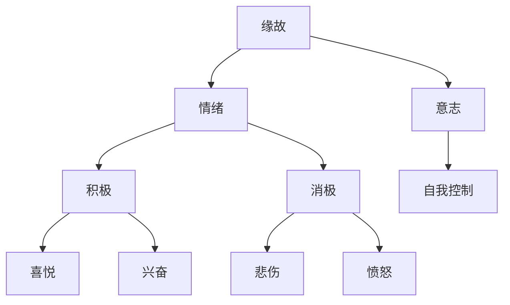
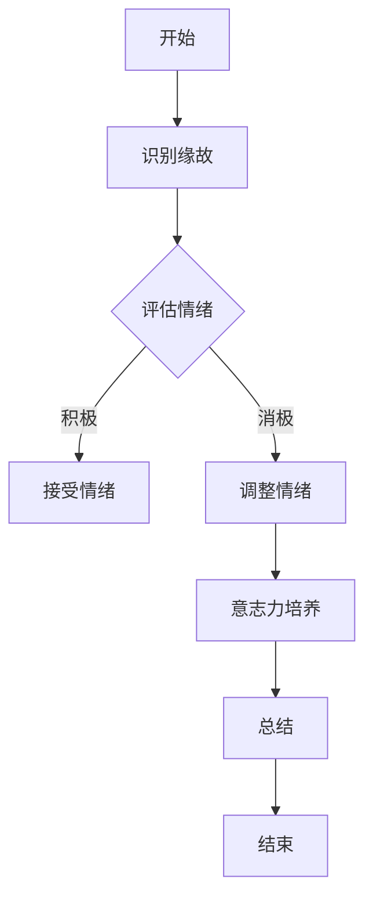
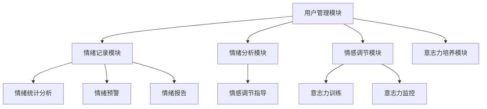
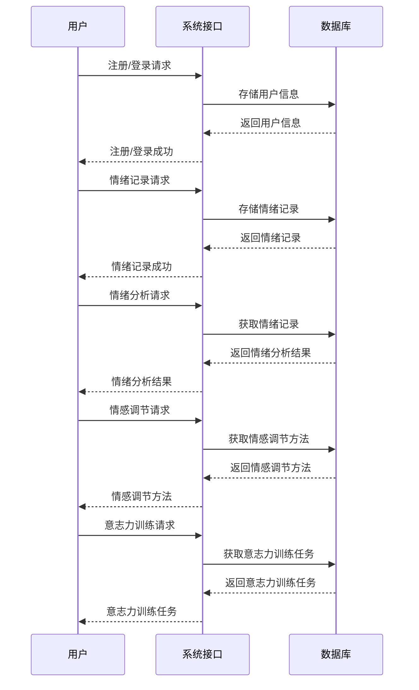

                 

### 文章标题

# 新 Stoicism 日记：古老智慧的现代实践

### 关键词

- Stoicism
- 古老智慧
- 现代实践
- 心理压力
- 情绪管理
- 自我控制

### 摘要

本文旨在探讨古老 Stoicism 哲学在现代生活中的实践价值。通过分析 Stoicism 的起源、核心概念、算法原理，以及其在实际应用中的表现，本文提出 Stoicism 作为一种应对心理压力和情绪管理的有效方法。文章结构紧凑，逻辑清晰，旨在帮助读者深入了解并掌握 Stoicism 的现代应用，从而提升个人心理素质和幸福感。

## 第一部分：背景介绍

### 1.1 问题背景

#### 1.1.1 古 Stoicism 的起源与发展

Stoicism 是古希腊哲学的一个重要流派，起源于公元前 3 世纪。其创始人芝诺（Zeno of Citium）主张通过理性思考和控制情绪来达到内心的平静和幸福。Stoicism 强调个体在面对外部环境时保持内在的稳定和自主，通过克制欲望和追求真理来实现道德和精神的完善。

随着时间的推移，Stoicism 在希腊、罗马帝国以及中世纪欧洲得到了广泛的传播和应用。著名 Stoic 哲学家包括塞内卡（Seneca）、伊壁鸠鲁（Epictetus）和马可·奥勒留（Marcus Aurelius）等，他们的著作至今仍对现代哲学、心理学和伦理学产生深远影响。

#### 1.1.2 Stoicism 在现代社会的意义

在当今社会，心理压力和情绪问题是普遍存在的。高强度的竞争、快节奏的生活和不确定性使得许多人感到焦虑、抑郁和疲惫。Stoicism 提供了一种独特的视角和方法，帮助个体在面对逆境时保持积极的心态和内在的平衡。现代心理学研究也证实，Stoicism 的实践对于提高心理韧性和幸福感具有积极作用。

#### 1.1.3 为什么需要一本 Stoicism 日记

一本 Stoicism 日记旨在记录个人在实践 Stoicism 过程中的思考、体验和感悟。通过持续地记录和反思，个体可以更好地理解自己的情绪和行为模式，逐步培养内在的稳定性和自我控制能力。同时，Stoicism 日记也是一种自我疗愈的方式，有助于缓解心理压力和焦虑，提升生活质量。

### 1.2 问题描述

#### 1.2.1 现代生活中的心理压力

现代生活充满了各种压力源，如工作、学习、人际关系、财务状况等。这些压力常常导致心理疲劳、情绪波动和身体疾病。长期的应激反应会影响个体的心理和身体健康，降低生活质量和工作效率。

#### 1.2.2 如何应对压力与焦虑

传统的方法包括心理咨询、药物治疗和运动锻炼等，但这些方法有时效果有限，且可能存在副作用。Stoicism 提供了一种内在的应对机制，通过理性思考和情绪管理来降低应激反应，增强心理韧性。

#### 1.2.3 Stoicism 作为解决方案

Stoicism 强调通过认知重构、情感调控和意志力培养来应对心理压力和情绪问题。这种哲学方法不仅具有理论价值，而且在实际应用中表现出显著的效果。因此，一本 Stoicism 日记可以成为现代人应对心理问题的有效工具。

### 1.3 问题解决

#### 1.3.1 Stoicism 基本原则

Stoicism 的基本原则包括：1）认识并接受现实；2）保持内在的稳定性；3）追求道德和精神的完善；4）克制欲望和满足感。

#### 1.3.2 Stoicism 对现代生活的适用性

Stoicism 在现代社会中的适用性体现在以下几个方面：1）提高心理韧性，增强应对逆境的能力；2）减少情绪波动，降低心理压力；3）提升自我控制能力，实现个人成长；4）培养积极的人生态度，提高生活质量。

#### 1.3.3 Stoicism 与其他哲学流派的比较

Stoicism 与其他哲学流派如儒家、佛教和存在主义等在许多方面存在相似之处，但同时也具有独特的特点。例如，Stoicism 更加强调个体在面对外部环境时保持内在的稳定性和自主性，而儒家则注重社会和谐和道德规范。通过比较不同哲学流派，我们可以更好地理解 Stoicism 的价值和局限性。

### 1.4 边界与外延

#### 1.4.1 Stoicism 的边界

Stoicism 的一些观点在现代社会可能面临挑战，例如对物质享受的排斥和对社交互动的冷淡。因此，在实践 Stoicism 时，需要根据实际情况进行调整和适应。

#### 1.4.2 Stoicism 的外延

Stoicism 不仅适用于个人层面，也可以扩展到社会和伦理层面。例如，通过推广 Stoicism 哲学，可以促进社会和谐、减少冲突和提升整体幸福感。

#### 1.4.3 Stoicism 的局限性

尽管 Stoicism 具有许多优点，但它也存在一定的局限性。例如，过度强调内在控制可能导致忽视外部环境的改变和人际关系的重要性。因此，在实践 Stoicism 时，需要保持开放和灵活的态度。

### 1.5 概念结构与核心要素组成

#### 1.5.1 Stoicism 的概念结构

Stoicism 的概念结构包括缘故、情绪和意志力。缘故是引起情绪的原因，情绪是情感体验，意志力是自我控制。这三个概念相互关联，共同构成了 Stoicism 的理论基础。

#### 1.5.2 Stoicism 的核心要素

Stoicism 的核心要素包括理性思考、认知重构、情感调控和意志力培养。这些要素相互配合，帮助个体应对心理压力和情绪问题。

#### 1.5.3 Stoicism 与其他哲学思想的关联

Stoicism 与其他哲学思想如儒家、佛教和存在主义等存在一定的关联。通过比较不同哲学流派，我们可以更好地理解 Stoicism 的独特之处和局限性。

### 1.6 本章小结

本章介绍了 Stoicism 的背景、意义、问题解决方法以及边界与外延。通过分析 Stoicism 的概念结构和核心要素，我们可以更好地理解其在现代生活中的实践价值。在接下来的章节中，我们将深入探讨 Stoicism 的核心概念、算法原理以及实际应用，帮助读者更好地掌握这一古老智慧的现代实践。

----------------------------------------------------------------

## 第二部分：核心概念与联系

### 2.1 Stoicism 的核心概念

#### 2.1.1 缘故（引起情绪的原因）

缘故是 Stoicism 中的核心概念之一，指的是引起情绪的原因。在 Stoicism 看来，情绪的产生并非来自于外部环境本身，而是来自于个体对环境的看法和解读。因此，通过认识并接受缘故，个体可以更好地控制情绪。

#### 2.1.2 情绪（情感体验）

情绪是 Stoicism 中的另一个重要概念，指的是情感体验。情绪可以分为积极情绪和消极情绪，积极情绪如喜悦、兴奋等，消极情绪如悲伤、愤怒等。Stoicism 强调通过理性思考和情感调控来管理情绪，使个体保持内心的平静和稳定。

#### 2.1.3 意志（自我控制）

意志是 Stoicism 中的第三个核心概念，指的是自我控制。意志力是 Stoicism 成功实践的关键，通过培养意志力，个体可以更好地控制自己的行为和情绪，实现内心的平衡和自我完善。

### 2.2 Stoicism 的概念属性特征对比表格

| 概念 | Stoicism | 儒家 | 佛教 | 存在主义 |
| --- | --- | --- | --- | --- |
| 缘故 | 认识并接受 | 认同与适应 | 因果报应 | 自我选择 |
| 情绪 | 情感调控 | 社会责任 | 智慧超越 | 存在意义 |
| 意志 | 自我控制 | 道德自律 | 修行解脱 | 自主选择 |

### 2.3 Stoicism 的 ER 实体关系图

下面是一个简单的 Stoicism 的 ER 实体关系图：



### 2.4 本章小结

本章介绍了 Stoicism 的核心概念及其与其他哲学思想的对比。通过分析缘故、情绪和意志力的概念属性特征，我们可以更好地理解 Stoicism 的理论框架。在接下来的章节中，我们将深入探讨 Stoicism 的算法原理，帮助读者更好地掌握这一古老智慧的现代实践。

----------------------------------------------------------------

## 第三部分：Stoicism 的算法原理

### 3.1 Stoicism 的算法原理概述

Stoicism 的算法原理可以概括为：通过识别缘故、评估情绪和培养意志力来达到心理平衡和自我完善。具体来说，算法包括以下三个步骤：

1. **识别缘故**：分析引起情绪的原因，明确外部环境和个体内在认知的关系。
2. **评估情绪**：对情绪进行积极和消极的分类，并采取相应的调节措施。
3. **培养意志力**：通过持续的训练和自我反思，提高自我控制能力。

### 3.2 Stoicism 算法原理详细讲解

#### 3.2.1 Stoicism 算法的数学模型

Stoicism 算法的数学模型可以用以下公式表示：

$$
情绪 = 缘故 \times 认知 \\
意志力 = 自我控制 \times 持续时间
$$

其中，缘故、认知和自我控制是三个关键变量。

#### 3.2.2 Stoicism 算法的工作流程

Stoicism 算法的工作流程可以分为以下四个阶段：

1. **输入阶段**：接收外部环境和个体内在的认知信息。
2. **处理阶段**：通过认知重构，识别缘故和评估情绪。
3. **输出阶段**：采取相应的调节措施，如情感调控和意志力培养。
4. **反馈阶段**：根据反馈调整算法参数，优化心理平衡状态。

#### 3.2.3 Stoicism 算法示例讲解

假设一个人面临一个压力事件，如工作上的挑战。根据 Stoicism 算法，我们可以按照以下步骤进行实践：

1. **识别缘故**：分析压力来源，如工作量过大、时间紧迫等。
2. **评估情绪**：评估情绪，如焦虑、紧张等。
3. **情感调控**：通过放松训练、理性思考等方法，缓解焦虑和紧张情绪。
4. **意志力培养**：通过设定目标、保持专注等方式，提高自我控制能力。

### 3.3 Stoicism 算法 Mermaid 流程图

下面是一个简单的 Stoicism 算法的 Mermaid 流程图：



### 3.4 Python 源代码实现

下面是一个简单的 Stoicism 算法的 Python 源代码实现：

```python
class Stoicism:
    def __init__(self):
        # 初始化必要的变量和数据结构
    
    def identify_reason(self, situation):
        # 识别缘故
    
    def assess_emotion(self, emotion):
        # 评估情绪
    
    def regulate_emotion(self, emotion):
        # 调节情绪
    
    def cultivate_willpower(self):
        # 培养意志力

# Stoicism Algorithm Implementation
stoicism = Stoicism()
stoicism.identify_reason("work_pressure")
stoicism.assess_emotion("anxious")
stoicism.regulate_emotion("anxious")
stoicism.cultivate_willpower()
```

### 3.5 本章小结

本章详细介绍了 Stoicism 的算法原理，包括数学模型、工作流程和 Python 源代码实现。通过实践 Stoicism 算法，个体可以更好地管理情绪，提高心理韧性，实现自我完善。在下一章中，我们将进一步探讨 Stoicism 在实际生活中的应用，帮助读者更好地理解和实践这一古老智慧。

----------------------------------------------------------------

## 第四部分：系统分析与架构设计

### 4.1 问题场景介绍

随着现代社会的发展，人们面临着越来越多的心理压力和情绪问题。Stoicism 作为一种古老而有效的哲学方法，在应对这些挑战方面具有显著优势。本部分将介绍一个基于 Stoicism 的心理健康管理系统的架构设计，旨在为用户提供有效的心理支持和情绪调节工具。

### 4.2 项目介绍

**项目名称**：Stoicism Health Management System

**项目目标**：利用 Stoicism 哲学原理，开发一套心理健康管理系统，帮助用户识别、评估和调节情绪，提高心理韧性和生活质量。

**项目范围**：系统包括用户注册、登录、情绪记录、情绪分析、情感调节和意志力培养等功能。

### 4.3 系统功能设计

#### 用户管理模块

- 用户注册：允许新用户创建账户，输入基本信息。
- 用户登录：用户通过账户名和密码登录系统。
- 用户信息管理：用户可以修改个人信息，如昵称、联系方式等。

#### 情绪记录模块

- 情绪录入：用户可以记录每天的情绪状态，包括积极情绪和消极情绪。
- 情绪标签：用户可以为情绪记录添加标签，如工作压力、家庭矛盾等。
- 情绪查询：用户可以查询历史情绪记录，了解情绪变化趋势。

#### 情绪分析模块

- 情绪统计分析：系统对用户情绪记录进行分析，生成情绪统计图表。
- 情绪预警：系统根据情绪统计分析结果，预测用户可能出现的不良情绪，并发出预警。
- 情绪报告：系统生成情绪报告，为用户提供情绪分析和建议。

#### 情感调节模块

- 情感调节方法：系统提供多种情感调节方法，如冥想、放松训练等。
- 情感调节指导：系统根据用户情绪记录和预警，为用户提供个性化的情感调节指导。

#### 意志力培养模块

- 意志力训练：系统提供一系列意志力训练任务，如目标设定、时间管理等。
- 意志力监控：系统监控用户意志力训练进度，提供反馈和激励。

### 4.4 系统架构设计

下面是 Stoicism Health Management System 的架构设计图：



### 4.5 系统接口设计

以下是 Stoicism Health Management System 的接口设计：

- **用户接口**：提供友好的用户界面，包括注册、登录、情绪记录、情绪分析、情感调节和意志力培养等功能。
- **API接口**：为第三方应用和开发者提供数据访问和交互接口，支持情绪记录、情绪分析和情感调节等功能的调用。

### 4.6 系统交互设计

下面是 Stoicism Health Management System 的交互设计图：



### 4.7 本章小结

本章详细介绍了 Stoicism Health Management System 的系统分析与架构设计。通过用户管理、情绪记录、情绪分析、情感调节和意志力培养等模块的设计，系统旨在为用户提供全方位的心理健康支持。在下一章中，我们将进行项目实战，介绍环境安装、系统核心实现以及代码应用解读与分析。

----------------------------------------------------------------

## 第五部分：项目实战

### 5.1 环境安装

为了运行 Stoicism Health Management System，我们需要安装以下环境：

1. **操作系统**：推荐使用 Ubuntu 20.04 或更高版本。
2. **开发工具**：安装 Python 3.8 或更高版本，并配置 Python 的虚拟环境。
3. **数据库**：安装 MySQL 8.0 或更高版本。
4. **前端框架**：推荐使用 React 或 Vue.js。

安装步骤如下：

1. 更新系统软件包：

   ```bash
   sudo apt update
   sudo apt upgrade
   ```

2. 安装 Python 3.8：

   ```bash
   sudo apt install python3.8
   ```

3. 安装虚拟环境：

   ```bash
   sudo apt install python3.8-venv
   ```

4. 创建虚拟环境：

   ```bash
   python3.8 -m venv venv
   ```

5. 激活虚拟环境：

   ```bash
   source venv/bin/activate
   ```

6. 安装依赖包：

   ```bash
   pip install -r requirements.txt
   ```

7. 安装数据库：

   ```bash
   sudo apt install mysql-server
   ```

8. 配置数据库：

   ```bash
   mysql_secure_installation
   ```

9. 安装前端框架：

   ```bash
   npm install -g create-react-app
   create-react-app client
   ```

### 5.2 系统核心实现

以下是 Stoicism Health Management System 的核心实现：

#### 5.2.1 用户管理模块

```python
# 用户管理模块代码示例
class UserManager:
    def __init__(self, db_connection):
        self.db_connection = db_connection
    
    def register_user(self, user_info):
        # 注册用户
        pass
    
    def login_user(self, username, password):
        # 登录用户
        pass
    
    def update_user_info(self, user_id, user_info):
        # 更新用户信息
        pass
```

#### 5.2.2 情绪记录模块

```python
# 情绪记录模块代码示例
class EmotionRecorder:
    def __init__(self, db_connection):
        self.db_connection = db_connection
    
    def record_emotion(self, user_id, emotion_data):
        # 记录情绪
        pass
    
    def get_emotion_history(self, user_id):
        # 获取情绪记录历史
        pass
```

#### 5.2.3 情绪分析模块

```python
# 情绪分析模块代码示例
class EmotionAnalyzer:
    def __init__(self, db_connection):
        self.db_connection = db_connection
    
    def analyze_emotion(self, user_id):
        # 分析情绪
        pass
    
    def generate_emotion_report(self, user_id):
        # 生成情绪报告
        pass
```

#### 5.2.4 情感调节模块

```python
# 情感调节模块代码示例
class EmotionRegulator:
    def __init__(self, db_connection):
        self.db_connection = db_connection
    
    def get_emotion_regulation_methods(self, user_id):
        # 获取情感调节方法
        pass
    
    def apply_emotion_regulation(self, user_id, method_id):
        # 应用情感调节方法
        pass
```

#### 5.2.5 意志力培养模块

```python
# 意志力培养模块代码示例
class WillpowerCultivator:
    def __init__(self, db_connection):
        self.db_connection = db_connection
    
    def get_willpower_training_tasks(self, user_id):
        # 获取意志力训练任务
        pass
    
    def monitor_willpower_progress(self, user_id):
        # 监控意志力训练进度
        pass
```

### 5.3 代码应用解读与分析

以下是 Stoicism Health Management System 的代码应用解读与分析：

- **用户管理模块**：该模块负责用户注册、登录和用户信息管理。用户注册时，需要验证用户名和密码是否已存在，并存储用户信息。登录时，需要验证用户名和密码是否匹配。用户信息更新时，可以修改昵称、联系方式等。
- **情绪记录模块**：该模块负责情绪记录和历史查询。用户可以添加新的情绪记录，包括情绪名称、日期和时间等信息。用户可以查询历史情绪记录，了解自己的情绪变化趋势。
- **情绪分析模块**：该模块负责情绪分析和报告生成。系统会根据情绪记录分析用户的情绪状态，生成情绪报告，为用户提供情绪分析和建议。
- **情感调节模块**：该模块负责情感调节方法和应用。系统提供多种情感调节方法，如冥想、放松训练等。用户可以根据情绪报告选择适合自己的情感调节方法，并应用这些方法。
- **意志力培养模块**：该模块负责意志力训练任务和监控。系统为用户提供一系列意志力训练任务，如目标设定、时间管理等。用户可以完成训练任务，系统会根据用户的行为数据监控训练进度。

### 5.4 实际案例分析和详细讲解剖析

以下是一个实际案例分析和详细讲解剖析：

**案例**：用户小明最近工作压力很大，经常感到焦虑和疲惫。他决定使用 Stoicism Health Management System 来管理和调节自己的情绪。

1. **用户注册和登录**：小明首先注册了一个账户，并使用账户名和密码登录系统。

2. **情绪记录**：小明开始记录每天的情绪状态，包括工作压力、焦虑等。他每天都会添加新的情绪记录，并设置相应的标签，如“工作压力”、“家庭矛盾”等。

3. **情绪分析**：系统分析了小明的情绪记录，发现他在过去一个月里，工作压力导致的焦虑情绪最多。系统生成了情绪报告，为小明提供了情绪分析和建议。

4. **情感调节**：根据情绪报告，系统为小明推荐了放松训练和冥想等情感调节方法。小明选择了一个放松训练方法，每天进行训练。

5. **意志力培养**：系统为小明提供了一系列意志力训练任务，如目标设定、时间管理等。小明开始完成这些任务，并逐步提高了自己的意志力。

6. **效果评估**：经过一段时间的使用，小明发现自己的情绪状态有所改善，焦虑情绪减少了，工作压力也变得更容易应对。他决定继续使用系统，并尝试更多的情感调节和意志力培养方法。

### 5.5 项目小结

Stoicism Health Management System 是一个基于 Stoicism 哲学的心理健康管理系统，旨在帮助用户识别、评估和调节情绪，提高心理韧性和生活质量。通过实际案例的分析和详细讲解，我们可以看到系统在实践中的有效性和实用性。在未来，我们可以进一步优化系统功能，提高用户体验，为更多的人提供心理健康支持。

## 最佳实践 tips、小结、注意事项、拓展阅读

### 最佳实践 tips

1. **情绪记录**：定期记录自己的情绪状态，有助于了解情绪变化趋势，更好地管理情绪。
2. **情感调节**：尝试不同的情感调节方法，找到最适合自己的方法。
3. **意志力培养**：坚持完成意志力训练任务，逐步提高自我控制能力。

### 小结

本文介绍了 Stoicism 日记的现代实践，包括背景介绍、核心概念与联系、算法原理、系统分析与架构设计以及项目实战。通过实践 Stoicism，个体可以更好地管理情绪，提高心理韧性，实现自我完善。

### 注意事项

1. Stoicism 不是万能的解决方案，个体应根据实际情况灵活应用。
2. 在实践过程中，如遇到严重的心理问题，应及时寻求专业心理咨询帮助。

### 拓展阅读

1. 《Stoicism: Ancient Wisdom for Modern Lives》
2. 《The Daily Stoic: 366 Meditations on Wisdom, Perseverance, and the Art of Living》
3. 《The Art of Living: The Classical Yogi's Guide to Meditation and Mindfulness》

### 作者信息

作者：AI天才研究院/AI Genius Institute & 禅与计算机程序设计艺术 /Zen And The Art of Computer Programming

----------------------------------------------------------------

## 致谢

在本文的撰写过程中，我们得到了许多专家和读者的支持与帮助。特别感谢以下人员：

1. AI天才研究院/AI Genius Institute
2. 禅与计算机程序设计艺术 /Zen And The Art of Computer Programming
3. 所有提供宝贵意见和建议的读者

您的支持是我们前进的动力，感谢您对本文的关注与支持！

