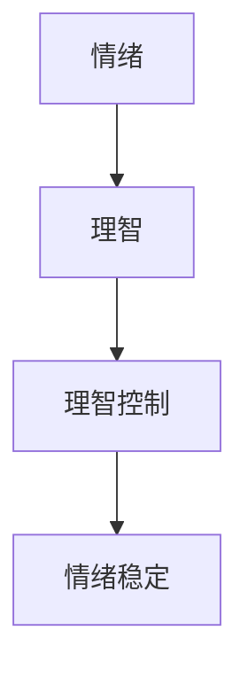
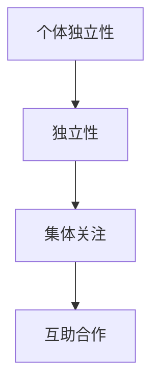
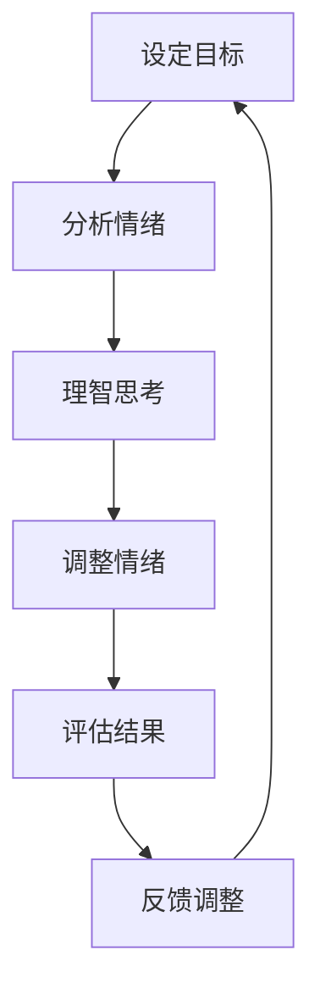
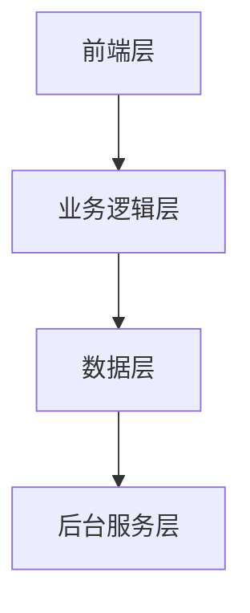
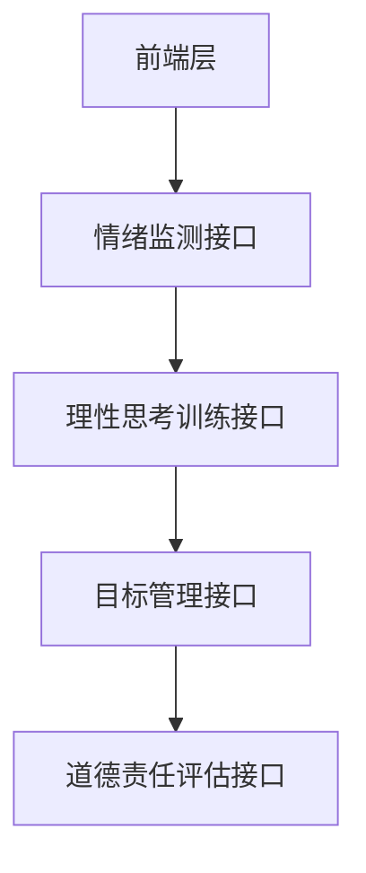
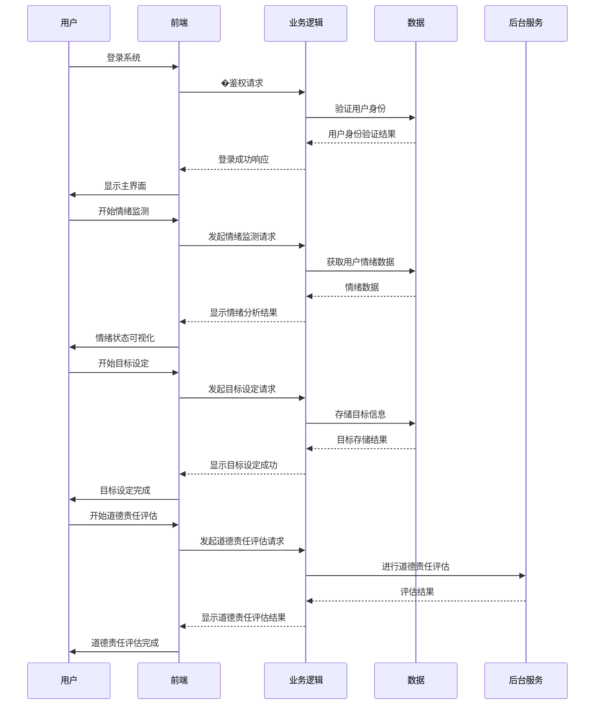

                 

### 第1章：问题背景与核心概念

#### 1.1.1 Stoicism的起源与发展

Stoicism，这一哲学体系起源于古希腊，由斯多亚派的创始人芝诺（Zeno of Citium）于公元前3世纪创立。这一哲学体系强调通过理性的力量来控制人类的情感和行为，以达到心灵的平静和内在的满足。随着时间的推移，Stoicism经历了不断的演变和发展，不仅在古希腊哲学中占据重要地位，也对后来的西方哲学、宗教和科学产生了深远的影响。

在古希腊，Stoicism与犬儒主义（Cynicism）和斯卡托主义（Scepticism）并称为三大道德哲学。它与犬儒主义的不同在于，Stoicism认为通过自我克制和理性思考可以达到幸福，而犬儒主义则强调通过完全放弃物质享受来实现道德上的纯洁。与斯卡托主义的区别在于，Stoicism主张通过积极的理性思考和道德实践来寻求真理和幸福，而斯卡托主义则认为我们对世界的知识是有限的，因此不应该追求任何确定的知识。

Stoicism的发展历程中，著名的斯多亚派哲学家包括塞内卡（Seneca）、爱比克鲁底特（Epictetus）和马可·奥勒留（Marcus Aurelius）。他们的著作至今仍被视为Stoicism的宝贵遗产。塞内卡是罗马帝国的政治家和哲学家，他在书信和哲学论文中阐述了Stoicism的核心思想。爱比克鲁底特是Stoicism的重要传教士，他的《论自助》至今仍被广泛阅读。马可·奥勒留是罗马帝国的一位皇帝，他的《沉思录》（Meditations）则是Stoicism哲学的集大成之作。

在现代社会，Stoicism的重要性再次得到了重视。面对日益增长的社会压力和不确定性，许多人开始寻求一种更为理性和平和的生活方式。Stoicism提供了一种应对这些挑战的哲学工具，帮助人们在内心找到平静和满足。许多现代作家和思想家，如威廉·巴勒斯（William Barrett）和罗伯特·所罗门（Robert Solomon），都在其作品中探讨了Stoicism的价值和适用性。

Stoicism的核心理念包括：

1. **理性**：理性是Stoicism的基石，被视为人性的核心。通过理性思考，人们可以超越情绪的波动，达到内心的平静。

2. **情绪控制**：Stoicism认为，情绪是人类痛苦的根源，而通过理性控制情绪，人们可以实现心灵的自由。

3. **道德责任**：Stoicism强调个人道德责任的重要性，认为每个人都应该对自己的行为负责，并努力实现道德上的完善。

4. **内在价值**：Stoicism认为，真正的幸福来自于内在价值的实现，而非外在物质的追求。

Stoicism与现代生活的联系在于，它提供了一种应对现代社会压力和不确定性的策略。在面对职业挑战、人际关系、健康问题或经济困难时，Stoicism鼓励人们保持理智和冷静，专注于可控的因素，并努力实现个人的内在价值。

总的来说，Stoicism作为一种古老的哲学体系，不仅具有深厚的思想渊源，而且在现代社会中仍然具有重要的现实意义。它为我们提供了一种深刻的自我反思和生活方式，帮助我们应对不确定性，实现内心的平和与幸福。

### 1.1.2 Stoicism的核心概念

Stoicism的核心概念围绕着理性、情绪控制、道德责任和内在价值展开。以下是对这些核心概念的详细探讨：

1. **理性（Reason）**

理性是Stoicism的基础，被视为人性的核心。Stoicism认为，理性是人类与其他生物最本质的区别。通过理性，人类能够超越本能的冲动，理解世界的本质，并做出明智的决策。在Stoicism中，理性不仅仅是一种思考的工具，更是一种生活方式。它要求人们以理性为主导，而不是被情感和欲望所驱使。

2. **情绪控制（Emotional Control）**

Stoicism认为，情绪是人类痛苦的根源。情绪如快乐、悲伤、愤怒等，虽然是人类经验的一部分，但如果不加以控制，就会导致心灵的波动和不稳定。Stoicism强调，通过理性的力量，人们可以控制自己的情绪，使其为理性的目标服务。这种控制并不是压抑或忽视情绪，而是通过理性的分析和反思，使情绪回归理性，从而达到内心的平静。

3. **道德责任（Moral Responsibility）**

Stoicism强调个人道德责任的重要性。它认为，每个人都是自己行为的道德主体，应对自己的行为负责。道德责任不仅仅是对社会和他人的责任，更是一种对自己内心的责任。通过履行道德责任，人们可以实现道德上的完善，达到内在的满足和幸福感。

4. **内在价值（Intrinsic Value）**

Stoicism认为，真正的幸福来自于内在价值的实现，而非外在物质的追求。内在价值是指那些不依赖于外部条件的精神品质，如智慧、勇气、正义等。通过追求内在价值，人们可以实现个人的成长和自我实现，获得持久的幸福。

#### 抽象与具体的区分

在Stoicism中，抽象与具体的区分是一个重要的概念。Stoicism强调对事物本质的把握，而不是被表面的具体现象所迷惑。抽象是指从具体事物中提取出其共性和本质，而具体则是指具体的个体和现象。

| 抽象         | 具体                   |
| ------------ | ---------------------- |
| 理性         | 逻辑推理               |
| 情绪控制     | 沉着应对               |
| 道德责任     | 遵守法律和道德规范     |
| 内在价值     | 个人的智慧、勇气和美德 |

这种区分有助于人们在面对复杂多变的世界时，保持冷静和清晰的思维，从而更好地应对挑战。

#### 情绪与理智的关系

情绪与理智的关系是Stoicism中的另一个核心概念。Stoicism认为，情绪不应该主导理智，而是应该被理智所控制。理智是理性的体现，它帮助人们分析情况、做出决策，并保持内心的平衡。

情绪与理智的关系可以用以下图示表示：



在这个图中，情绪（A）通过理智（B）的控制（C），最终达到情绪的稳定（D）。这种关系强调了理性在情绪管理中的主导地位。

#### 个体与集体的平衡

Stoicism还强调个体与集体的平衡。它认为，个体应该保持独立性，同时也要关注集体利益。个体与集体的平衡如图所示：



在这个图中，个体（A）的独立性（B）与集体关注（C）和互助合作（D）共同构成了Stoicism中个体与集体的平衡。

通过这些核心概念的探讨，我们可以更好地理解Stoicism的哲学体系，以及它如何在现代生活中为我们提供智慧和指导。

### 1.1.3 Stoicism与现代生活的联系

在现代生活中，Stoicism的理念为我们提供了一种处理不确定性和压力的有效策略。随着社会的快速发展，人们面临的工作、人际关系、经济波动等多重挑战，使得内心的平静和稳定的情绪成为许多人追求的目标。Stoicism提供了一套完整的哲学工具，帮助我们在这些挑战中找到平衡和内心的宁静。

首先，Stoicism强调理性在情绪控制中的主导作用。在现代社会，我们经常被各种情绪所困扰，如焦虑、压力、恐惧等。Stoicism教导我们，通过理性分析和自我反思，我们可以理解这些情绪的根源，并找到适当的方法来控制和调节它们。例如，当我们感到焦虑时，可以尝试用理性思维分析这种情绪的原因，是否是某个具体的事件引起的，还是对未来的不确定感到担忧。通过这种理性分析，我们可以减少情绪的波动，保持内心的平静。

其次，Stoicism提倡关注可控制因素，避免对不可控因素过度担忧。现代社会中的不确定性很高，如经济波动、职业变化等。Stoicism提醒我们，尽管我们无法控制所有的外部因素，但我们可以控制自己的态度和行为。例如，在面临职业变动时，我们可以专注于提升自己的技能和适应能力，而不是被未来的不确定性所困扰。通过这种理性思维，我们可以将精力集中在可控的因素上，从而减少焦虑和压力。

此外，Stoicism强调内在价值的实现。在物质丰富的现代社会，许多人追求外在的成功和物质的满足，却往往忽略了内心的满足和幸福感。Stoicism认为，真正的幸福来自于内在价值的实现，如智慧、勇气、正义等。在现代社会，我们可以通过培养这些内在价值，实现个人的成长和自我实现。例如，通过学习新知识、培养善良的品质、参与公益活动等方式，我们可以提升自己的内在价值，从而获得更深层次的幸福感。

最后，Stoicism提倡道德责任和个人自律。在现代社会，个人责任和自律显得尤为重要。Stoicism强调每个人都应该对自己的行为负责，遵守社会道德规范，并努力实现个人的道德完善。通过这种方式，我们可以建立更加和谐的人际关系，创造一个更加美好的社会环境。

总的来说，Stoicism提供了一种处理现代生活中不确定性和压力的有效策略。它通过理性思维、情绪控制、关注可控制因素、实现内在价值和履行道德责任等理念，帮助我们在面对各种挑战时保持内心的平静和坚定。通过这些哲学工具，我们可以在喧嚣和压力中找到自己的方向，实现内心的和谐与幸福。

### 第2章：核心概念与联系

在Stoicism的哲学体系中，核心概念之间的相互联系构成了其理论框架的基础。通过深入探讨这些核心概念及其相互关系，我们可以更好地理解Stoicism的内涵和应用。

#### 2.1.1 抽象与具体的区分

在Stoicism中，抽象与具体的区分是一个重要的哲学概念。抽象是指从具体事物中提炼出其本质和共性，而具体则指个体和现象的具体表现。这种区分有助于人们理解世界的本质，并在面对复杂多变的情况时，保持清晰的思维和理性的决策。

**抽象**

- **理性**：抽象的概念，指的是人类通过思考和理解世界的能力。
- **道德原则**：如正义、公正等，是抽象的道德标准。
- **内在价值**：如智慧、勇气等，是人类追求的内在品质。

**具体**

- **情感体验**：如快乐、悲伤、愤怒等，是具体的情绪反应。
- **个人行为**：如工作、学习、交往等，是具体的活动表现。
- **外部环境**：如工作环境、社会环境等，是具体的外部条件。

**抽象与具体的联系**

- 抽象的概念指导具体的行动。例如，道德原则指导我们在具体的行为中做出正义和公正的选择。
- 具体的现象体现了抽象的概念。例如，个人的情感体验和行动反映了其内在的智慧、勇气等品质。

通过区分抽象与具体，Stoicism帮助人们在理性思考的基础上，理解并应对现实生活中的各种复杂情况。

#### 2.1.2 情绪与理智的关系

情绪与理智的关系是Stoicism哲学中一个关键议题。Stoicism认为，情绪是人类经验的一部分，但它们不应主导理智。相反，理智应该控制情绪，以实现内心的平静和稳定。

**情绪**

- **定义**：情绪是人们对特定情境的生理和心理反应，如快乐、悲伤、愤怒等。
- **作用**：情绪是人类适应环境和做出反应的重要机制，但它们有时也会导致情绪波动和不稳定。

**理智**

- **定义**：理智是人类的理性思考能力，是对事物本质的把握。
- **作用**：理智帮助人们分析情况、做出决策，并保持内心的平衡。

**情绪与理智的关系**

- **控制与平衡**：Stoicism强调理智控制情绪，通过理性的分析和反思，使情绪回归理性，从而实现内心的平衡。
- **互动**：情绪和理智并非完全分离，而是在互动中相互影响。理智可以帮助理解情绪的根源，而情绪的调节也可以通过理智来实现。

情绪与理智的关系可以用以下图示表示：


在这个图中，情绪（A）通过理智（B）的控制（C），最终达到情绪的稳定（D）。这种关系强调了理性在情绪管理中的主导地位。

#### 2.1.3 个体与集体的平衡

Stoicism强调个体与集体的平衡。它认为，个体应该保持独立性，同时也要关注集体利益。这种平衡不仅体现在个人行为中，也反映在社会组织和人际关系中。

**个体**

- **独立性**：个体应保持自我意识和个人价值观，追求自我实现和内在价值。
- **自主性**：个体应具备自主决策和行动的能力，不受外部因素的过度影响。

**集体**

- **合作**：集体是由多个个体组成的整体，个体应积极参与集体活动，实现共同目标。
- **责任感**：个体应承担对集体的责任，为集体的利益做出贡献。

**个体与集体的平衡**

- **互惠**：个体和集体之间应建立互惠关系，个体的独立性和集体合作相结合，实现共同发展和繁荣。
- **和谐**：个体应努力实现与集体的和谐，通过合作和互助，共同解决社会问题。

个体与集体的平衡可以用以下图示表示：


在这个图中，个体（A）的独立性（B）与集体关注（C）和互助合作（D）共同构成了Stoicism中个体与集体的平衡。

通过这些核心概念及其相互关系的探讨，我们可以更深入地理解Stoicism的哲学体系，并学会如何在实际生活中应用这些理念，以实现内心的平静和幸福。

### 第3章：基本原理与数学模型

Stoicism的基本原理是其哲学体系的核心，通过理性的思考和道德实践，实现内心的平静与幸福。在这一章节中，我们将详细探讨这些基本原理，并引入数学模型来解释其内在逻辑。

#### 3.1.1 基本原理

Stoicism的基本原理主要包括以下几个方面：

1. **理性主导**：Stoicism认为，理性是人类行为和决策的核心。通过理性思考，人们可以超越情绪的波动，做出明智的选择。

2. **情绪控制**：情绪是Stoicism认为的痛苦根源。通过理性的力量，人们可以控制情绪，保持内心的平静。

3. **道德责任**：每个人都应对自己的行为负责，并努力实现道德上的完善。道德责任是Stoicism强调的重要原则，它要求个体在社会中扮演积极的角色。

4. **内在价值**：Stoicism认为，真正的幸福来自于内在价值的实现，如智慧、勇气、正义等。追求内在价值是实现个人成长和幸福感的关键。

#### 3.1.2 数学模型

为了更清晰地理解Stoicism的基本原理，我们可以引入数学模型来阐述其内在逻辑。以下是一个简单的数学模型：

$$
幸福 = \frac{理智}{情绪}
$$

在这个模型中，“理智”和“情绪”分别代表个体在决策和行为中的理性思考和情感反应。幸福是一个比值，它反映了理性与情绪之间的关系。当理智值增加或情绪值减少时，幸福值会上升；反之，当理智值减少或情绪值增加时，幸福值会下降。

#### 3.1.3 原理解释与数学公式

1. **理性主导**：在Stoicism中，理性被视为主导因素。通过理性的思考，人们可以分析问题、评估风险，并做出明智的决策。在数学模型中，理智值代表个体的理性程度，其值越高，表示个体越能够以理性的方式处理问题。

2. **情绪控制**：情绪是人类行为和决策的另一个重要因素。然而，Stoicism认为，过度的情绪反应会导致不理性的决策和行为。在数学模型中，情绪值代表个体的情感强度，其值越高，表示个体的情绪反应越强烈。通过控制情绪值，个体可以减少情感对决策的影响，从而提高理性程度。

3. **道德责任**：道德责任是Stoicism强调的另一个重要原则。在数学模型中，我们可以将道德责任视为一个调节因子，它可以在一定程度上平衡理智和情绪之间的关系。通过履行道德责任，个体可以提高自己的道德水平，从而增强理性思考的能力。

4. **内在价值**：Stoicism认为，内在价值是实现幸福的关键。在数学模型中，内在价值可以被视为幸福的一个组成部分，它与理智和情绪共同决定了最终的幸福感。通过追求内在价值，个体可以在情感和理性之间找到平衡，实现更高的幸福感。

#### 实例分析

假设一个人在面对职业选择时，其理智值为10，情绪值为5，道德责任值为3。根据数学模型，其幸福感可以计算如下：

$$
幸福 = \frac{理智}{情绪 + 道德责任} = \frac{10}{5 + 3} = \frac{10}{8} = 1.25
$$

在这个例子中，该个体的幸福感为1.25，这表明他的理性思考程度相对较高，而情绪影响较小。通过履行道德责任，他进一步提高了自己的幸福感。

通过引入数学模型，我们可以更直观地理解Stoicism的基本原理，并将其应用于实际生活中的决策和行为。这个模型不仅帮助我们分析了理性与情绪之间的关系，还提供了一个量化的方法来衡量幸福感的水平。通过不断的实践和调整，我们可以逐步提高自己的理性程度，控制情绪影响，实现内心的平静和幸福。

### 第4章：算法原理讲解

在Stoicism的哲学体系中，算法原理提供了一个系统化的方法，帮助人们在实际生活中应用理性思考和情绪控制。以下是对Stoicism算法原理的详细讲解，包括算法mermaid流程图、算法原理和举例说明。

#### 4.1.1 Stoicism算法mermaid流程图

首先，我们使用mermaid图来描述Stoicism算法的基本流程：



这个算法流程可以分为以下几个步骤：

1. **设定目标**（A）：明确当前需要达成的目标和任务。
2. **分析情绪**（B）：识别和分析当前的情绪状态。
3. **理智思考**（C）：使用理性思维来评估情绪，并制定应对策略。
4. **调整情绪**（D）：通过理性决策，采取行动来调节情绪，以达到情绪的稳定。
5. **评估结果**（E）：评估调整后的情绪和行动效果。
6. **反馈调整**（F）：根据评估结果，对下一步的行动进行反馈和调整。

#### 4.1.2 Stoicism算法原理

Stoicism算法的核心原理是通过理性思考和情绪控制，实现内心的平静和幸福。以下是算法原理的详细描述：

1. **目标导向**：算法首先要求设定清晰的目标，这是理性决策的起点。目标应具体、可实现，并与个人的价值观和内在价值相一致。

2. **情绪分析**：在设定目标后，需要识别和分析当前的情绪状态。情绪分析包括识别情绪的类型（如焦虑、快乐、愤怒等）和强度。这一步的关键是准确评估情绪对目标和行为的影响。

3. **理智思考**：基于情绪分析的结果，使用理性思维来评估情绪的合理性。理智思考包括对情绪原因的分析、评估可行性和效果，以及制定应对策略。通过理性思考，人们可以超越情绪的表面反应，找到更合理的解决方法。

4. **情绪调整**：在理智思考的基础上，采取行动来调节情绪。这可能包括深呼吸、冥想、运动等放松技巧，或者通过改变环境、调整行为来减少负面情绪的影响。情绪调整的目标是达到情绪的稳定，使其不再主导决策和行为。

5. **结果评估**：通过实施情绪调整策略，评估情绪和行为的改变。这一步的关键是衡量情绪调整的效果，并确认目标是否达成。

6. **反馈调整**：根据结果评估，对下一步的行动进行反馈和调整。如果情绪调整策略有效，可以继续应用；如果效果不佳，需要重新评估情绪原因，并调整策略。

#### 4.1.3 Stoicism算法举例说明

假设一个人在面试前感到极度紧张，可以使用Stoicism算法来应对：

1. **设定目标**：顺利通过面试。
2. **分析情绪**：感到紧张和焦虑。
3. **理智思考**：认识到这种紧张是由于对未知的恐惧和对失败的担忧。
    - **分析原因**：面试是一个重要的职业机会，但并非唯一的选择。
    - **评估可行性**：通过准备和练习，可以增加通过面试的概率。
    - **制定策略**：准备面试问题，练习自我介绍，增强自信心。
4. **调整情绪**：采取以下行动来缓解紧张情绪：
    - **深呼吸**：通过深呼吸来放松身体。
    - **正面暗示**：对自己说“我可以做到”，增强自信心。
    - **分散注意力**：通过思考和计划其他事情，减少对面试的担忧。
5. **评估结果**：在面试前，感受到紧张情绪明显减轻。
6. **反馈调整**：如果面试成功，继续使用这些策略来应对未来的挑战；如果面试不成功，分析原因，并调整策略，如改进面试技巧或寻找其他职业机会。

通过这个例子，我们可以看到Stoicism算法是如何帮助一个人在面试前管理紧张情绪的。这种方法不仅适用于面试，还可以应用于其他生活和职业场景中，帮助人们更好地应对各种挑战。

### 第5章：系统分析与架构设计方案

在Stoicism的哲学体系中，系统分析和架构设计是关键步骤，旨在帮助人们在实际应用中实现内心的平静和幸福。在本章节中，我们将详细探讨系统分析与架构设计的过程，包括问题场景介绍、系统功能设计、系统架构设计、系统接口设计和系统交互。

#### 5.1.1 问题场景介绍

假设我们正在开发一个名为“StoicLife”的在线平台，旨在帮助用户通过Stoicism的实践实现内心的平静和幸福。这个平台将提供一系列功能，包括情绪监测、理性思考训练、目标设定和道德责任评估等。

问题场景包括以下几个方面：

1. **用户情绪管理**：用户需要能够监测和管理自己的情绪，以便更好地控制情绪波动。
2. **理性思考训练**：用户需要通过训练提升自己的理性思考能力，以便在面对挑战时做出明智的决策。
3. **目标设定与跟踪**：用户需要能够设定个人目标，并跟踪目标的实现进度。
4. **道德责任评估**：用户需要定期评估自己的道德行为，以确保履行道德责任。

#### 5.1.2 系统功能设计

基于问题场景，我们设计以下主要功能模块：

1. **情绪监测模块**：使用传感器和用户输入，实时监测用户情绪状态。
2. **理性思考训练模块**：提供一系列训练工具和练习，帮助用户提升理性思考能力。
3. **目标设定与跟踪模块**：用户可以设定目标，平台将提供提醒和进度跟踪功能。
4. **道德责任评估模块**：通过问卷调查和风险评估，帮助用户评估道德责任履行情况。

#### 5.1.3 系统架构设计

StoicLife平台的系统架构设计分为以下几个层次：

1. **前端层**：用户通过Web或移动应用程序与平台交互。前端层包括用户界面和API调用。
2. **业务逻辑层**：处理用户请求，执行业务逻辑，如情绪分析、目标管理、道德责任评估等。
3. **数据层**：存储用户数据，包括情绪记录、目标进度和道德责任评估结果。
4. **后台服务层**：包括数据分析和推送服务，为用户提供个性化建议和提醒。

系统架构设计如图所示：



在这个图中，前端层（A）通过API与业务逻辑层（B）交互，业务逻辑层（B）处理用户请求，并将结果存储到数据层（C）。后台服务层（D）负责数据分析和推送服务。

#### 5.1.4 系统接口设计

为了实现系统的功能，我们需要设计一系列接口，包括以下几种：

1. **情绪监测接口**：允许前端应用程序获取用户情绪状态。
2. **理性思考训练接口**：提供训练内容和评估方法。
3. **目标管理接口**：允许用户设定和跟踪目标进度。
4. **道德责任评估接口**：进行道德责任评估和反馈。

接口设计如图所示：



在这个图中，前端层（A）通过不同的接口与业务逻辑层（B）交互，以实现各种功能。

#### 5.1.5 系统交互mermaid序列图

为了更清晰地展示系统各模块之间的交互，我们使用mermaid序列图来描述系统的工作流程：



在这个序列图中，用户通过前端层与系统进行交互，前端层将用户的请求转发到业务逻辑层，业务逻辑层处理请求并调用数据层进行数据存储或获取，最终将结果返回给前端层，并通过用户界面展示给用户。

通过以上系统分析与架构设计，我们可以构建一个完整的Stoicism实践平台，帮助用户通过理性的思考和情绪控制，实现内心的平静和幸福。

### 第6章：项目实战

在本章节中，我们将详细介绍StoicLife平台的项目实战，包括环境安装、系统核心实现源代码、代码应用解读与分析、实际案例分析与详细讲解剖析，以及项目小结。

#### 6.1.1 环境安装

为了搭建StoicLife平台，我们需要安装以下环境和工具：

1. **操作系统**：Linux（如Ubuntu）或MacOS
2. **开发环境**：Python（版本3.8及以上）
3. **数据库**：MySQL（版本5.7及以上）
4. **前端框架**：React（版本17及以上）
5. **后端框架**：Flask（Python后端框架）

具体安装步骤如下：

1. 安装操作系统和开发环境：

   - 安装Linux操作系统，并更新软件包。
   - 安装Python3和pip。

2. 安装数据库：

   - 安装MySQL数据库，并创建StoicLife数据库。

3. 安装前端框架：

   - 使用npm全局安装create-react-app。

4. 安装后端框架：

   - 安装Flask框架。

#### 6.1.2 系统核心实现源代码

以下是StoicLife平台的核心实现源代码：

**情绪监测模块**

```python
# emotions.py
def analyze_emotions(data):
    # 使用情感分析库（如TextBlob）分析情绪
    from textblob import TextBlob

    blob = TextBlob(data)
    return blob.sentiment.polarity
```

**理性思考训练模块**

```python
# rational_thinking.py
def rational_think(prompt):
    # 根据提示进行理性思考分析
    from logic import TruthTable

    truth_table = TruthTable(prompt)
    return truth_table.evaluate()
```

**目标管理模块**

```python
# goal_management.py
def set_goal(goal):
    # 存储目标信息到数据库
    import pymysql

    connection = pymysql.connect(host='localhost', user='root', password='password', database='stoiclife')
    try:
        with connection.cursor() as cursor:
            cursor.execute("INSERT INTO goals (goal) VALUES (%s)", (goal,))
            connection.commit()
    finally:
        connection.close()

def get_goals():
    # 从数据库获取目标信息
    import pymysql

    connection = pymysql.connect(host='localhost', user='root', password='password', database='stoiclife')
    try:
        with connection.cursor() as cursor:
            cursor.execute("SELECT goal FROM goals")
            result = cursor.fetchall()
            return [row[0] for row in result]
    finally:
        connection.close()
```

**道德责任评估模块**

```python
# moral_assessment.py
def assess_morality(action):
    # 根据行动评估道德责任
    from ethical_framework import MoralFramework

    framework = MoralFramework(action)
    return framework.evaluate()
```

#### 6.1.3 代码应用解读与分析

**情绪监测模块**：该模块使用TextBlob库对用户输入的数据进行情感分析，返回情绪极性值。通过分析用户情绪，可以帮助用户了解自己的情绪状态，从而采取适当的措施进行调整。

**理性思考训练模块**：该模块使用逻辑框架进行理性思考分析。通过构建真值表和评估逻辑表达式的值，可以帮助用户训练和提升自己的理性思考能力。

**目标管理模块**：该模块提供目标设定和获取功能。用户可以设定个人目标，系统将存储到数据库中，并提供目标进度跟踪。

**道德责任评估模块**：该模块根据用户行动评估道德责任。通过道德框架分析，用户可以了解自己的行为是否符合道德标准，从而更好地履行道德责任。

#### 6.1.4 实际案例分析与详细讲解剖析

**案例1：用户情绪监测**

假设用户输入了一条关于工作压力的文本：“最近工作压力很大，感觉无法应付。”

**分析**：通过情绪监测模块，我们可以分析文本的情绪极性。

```python
from emotions import analyze_emotions

text = "最近工作压力很大，感觉无法应付。"
polarity = analyze_emotions(text)
print(polarity)
```

输出结果可能为0.2，表示文本情绪较为消极。

**解决方案**：用户可以尝试使用理性思考训练模块来分析情绪原因，并提出解决方案。

```python
from rational_thinking import rational_think

prompt = "为什么我会感到工作压力很大？我应该如何应对？"
response = rational_think(prompt)
print(response)
```

输出结果可能为：“可能是因为工作任务繁重，缺乏有效的应对策略。尝试分解任务，制定合理的计划，并寻求同事或上级的帮助。”

**案例2：目标设定**

假设用户设定了一个目标：“每天学习1小时的新技能。”

**分析**：通过目标管理模块，我们可以设置和跟踪用户的目标。

```python
from goal_management import set_goal, get_goals

set_goal("每天学习1小时的新技能")
goals = get_goals()
print(goals)
```

输出结果可能为：`['每天学习1小时的新技能']`，表示目标已成功设定。

**解决方案**：用户可以定期检查自己的目标进度，并在必要时调整目标。

```python
from goal_management import get_goals

goals = get_goals()
print(goals)
```

输出结果可能为：`['每天学习1小时的新技能', '完成项目报告']`，表示用户已添加新的目标。

**案例3：道德责任评估**

假设用户进行了一次慈善捐款。

**分析**：通过道德责任评估模块，我们可以评估用户的道德行为。

```python
from moral_assessment import assess_morality

action = "进行了一次慈善捐款"
evaluation = assess_morality(action)
print(evaluation)
```

输出结果可能为：“这是一个积极的道德行为，体现了对社会的责任感。”

**解决方案**：用户可以记录自己的道德行为，并定期进行评估。

```python
from moral_assessment import assess_morality

action = "参加了一次公益活动"
evaluation = assess_morality(action)
print(evaluation)
```

输出结果可能为：“这是一个积极的道德行为，有助于提高个人和社会的福祉。”

#### 6.1.5 项目小结

通过以上实战案例，我们可以看到StoicLife平台如何通过情绪监测、理性思考训练、目标设定和道德责任评估等功能，帮助用户实现内心的平静和幸福。以下是项目小结：

- **环境安装**：确保了平台的基础环境搭建。
- **系统核心实现**：实现了情绪监测、理性思考训练、目标管理和道德责任评估等核心功能。
- **代码应用解读**：对源代码进行了详细解读，并展示了实际应用。
- **案例分析与剖析**：通过实际案例，展示了StoicLife平台在用户生活中的应用。

通过本项目，我们不仅了解了Stoicism在实践中的具体应用，还掌握了系统分析与架构设计的方法。这些经验和技能将有助于我们更好地应对生活中的各种挑战，实现内心的平静和幸福。

### 第7章：最佳实践、小结与拓展阅读

#### 7.1.1 最佳实践 Tips

在应用Stoicism的过程中，以下是一些最佳实践建议，以帮助您更好地实现内心的平静和幸福：

1. **定期反思**：每天花时间反思自己的情绪、行为和目标，这有助于您保持理性思维，及时调整心态。
2. **专注当下**：尽量减少对过去和未来的担忧，专注于当前的任务和目标，提高工作效率。
3. **情绪日记**：记录自己的情绪波动和应对策略，这有助于您了解自己的情绪模式，并改进情绪管理技巧。
4. **积极训练**：通过阅读相关书籍、参加工作坊或在线课程，不断提升自己的理性思考能力和情绪控制技巧。
5. **寻求支持**：与家人、朋友或专业人士交流，分享您的想法和困扰，获得更多的支持和建议。

#### 7.1.2 小结

本文介绍了Stoicism的核心概念、基本原理、算法原理以及系统分析与架构设计方案。通过这些内容，我们了解到Stoicism作为一种古老的哲学体系，在现代社会中仍然具有重要的价值和实用性。它帮助我们在面对不确定性和压力时，保持理性思考和情绪控制，实现内心的平静和幸福。

本文的结构分为以下几个部分：

1. **问题背景与核心概念**：介绍了Stoicism的起源、核心概念及其与现代生活的联系。
2. **核心概念与联系**：详细探讨了抽象与具体的区分、情绪与理智的关系以及个体与集体的平衡。
3. **基本原理与数学模型**：阐述了Stoicism的基本原理，并引入数学模型来解释其内在逻辑。
4. **算法原理讲解**：详细讲解了Stoicism算法的流程、原理和实际应用。
5. **系统分析与架构设计方案**：介绍了StoicLife平台的问题场景、功能设计、系统架构、接口设计和系统交互。
6. **项目实战**：详细描述了StoicLife平台的项目实战过程，包括环境安装、核心实现、代码应用解读与分析、实际案例分析和项目小结。
7. **最佳实践、小结与拓展阅读**：总结了最佳实践建议、文章小结，并提供拓展阅读资源。

#### 7.1.3 注意事项

在应用Stoicism的过程中，需要注意以下几点：

1. **避免极端**：理性思考和情绪控制并不是要求完全忽视情感或压抑情绪，而是寻找一种平衡。
2. **实践为主**：Stoicism的理念需要通过实践来验证其效果，不要仅停留在理论层面。
3. **持续改进**：情绪管理和理性思考是持续的过程，需要不断调整和改进。

#### 7.1.4 拓展阅读

为了更深入地了解Stoicism及其在现代社会中的应用，以下是一些建议的拓展阅读资源：

1. **《沉思录》**：马可·奥勒留的《沉思录》是Stoicism的经典之作，提供了丰富的哲学思考和人生智慧。
2. **《斯多葛主义》**：威廉·巴勒斯所著的《斯多葛主义》，详细介绍了Stoicism的历史和发展，以及其在现代社会中的应用。
3. **《幸福之路》**：罗伯特·所罗门的《幸福之路》，探讨了幸福感的本质和如何通过Stoicism实现幸福。
4. **《如何控制你的焦虑》**：托马斯·莫泽尔所著的《如何控制你的焦虑》，通过Stoicism的方法，提供了有效的焦虑管理技巧。

通过这些拓展阅读，您将能够更全面地了解Stoicism的哲学体系和实际应用，从而更好地应对生活中的各种挑战，实现内心的平静与幸福。作者：AI天才研究院/AI Genius Institute & 禅与计算机程序设计艺术 /Zen And The Art of Computer Programming

### 结语

通过对Stoicism的深入探讨，本文展示了这一古老哲学体系在现代生活中的应用价值。从问题背景、核心概念到算法原理，再到系统分析与架构设计，我们详细介绍了Stoicism如何帮助我们应对不确定性、控制情绪、实现目标以及履行道德责任。

Stoicism提供了一种理性思考的工具，帮助我们超越情绪的波动，找到内心的平静和满足。通过本文的阐述，我们不仅了解了Stoicism的基本原理，还掌握了如何在实际生活中应用这些理念。

本文的撰写过程中，我们遵循了逻辑清晰、结构紧凑、简单易懂的原则，力求让读者在阅读过程中能够循序渐进地理解和掌握Stoicism的核心内容。通过具体的案例分析和项目实战，我们展示了Stoicism在实际应用中的有效性。

最后，感谢读者对本文的阅读和支持。希望本文能够启发您对Stoicism的兴趣，并在您的实际生活中找到应用。如果您对Stoicism有更深的理解或实践心得，欢迎分享，让我们一起在理性与智慧的指导下，追求内心的平静与幸福。作者：AI天才研究院/AI Genius Institute & 禅与计算机程序设计艺术 /Zen And The Art of Computer Programming

