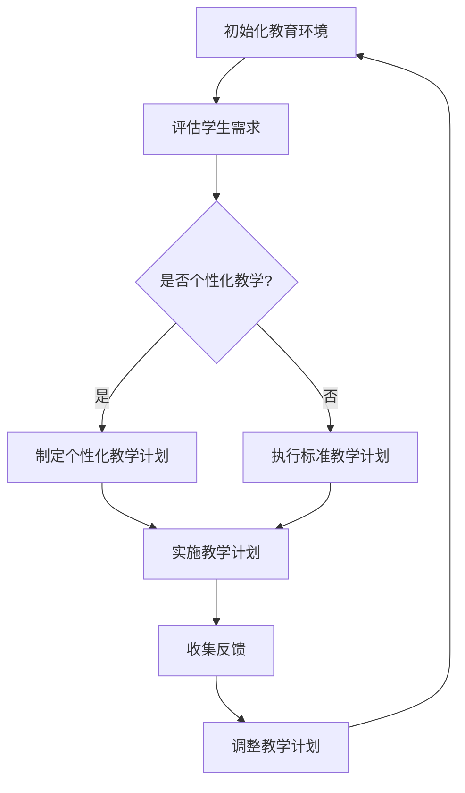
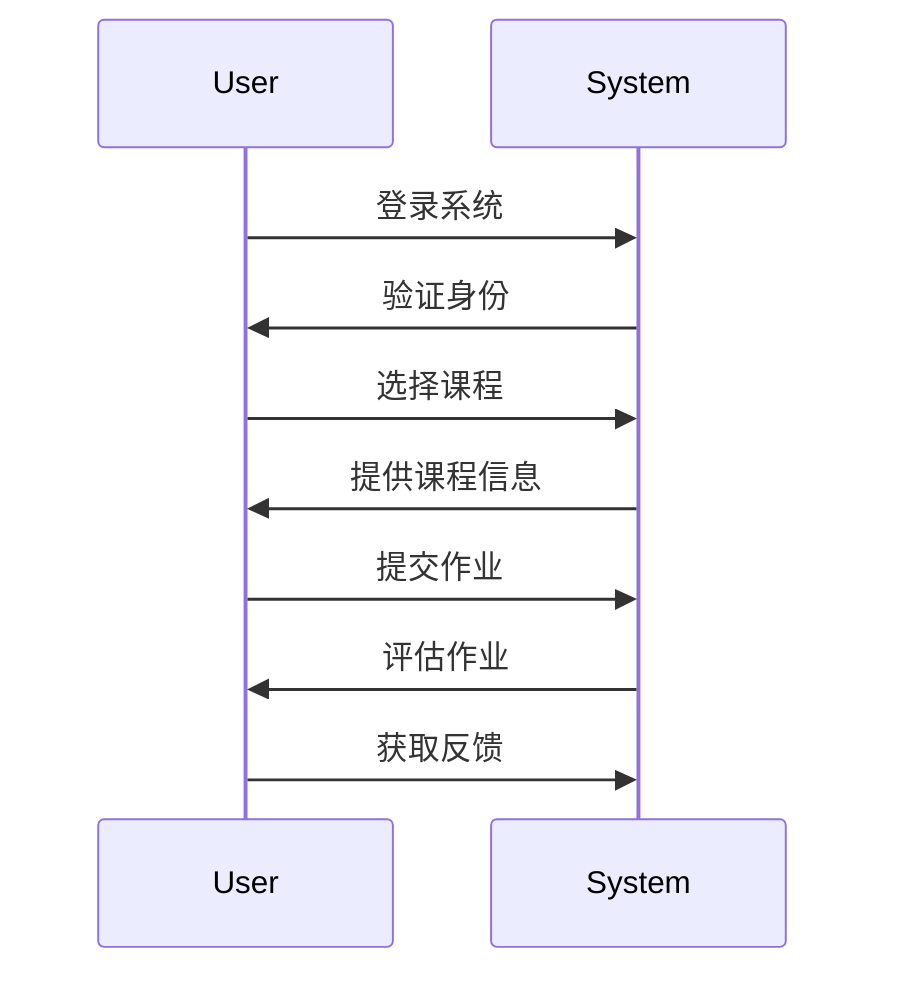
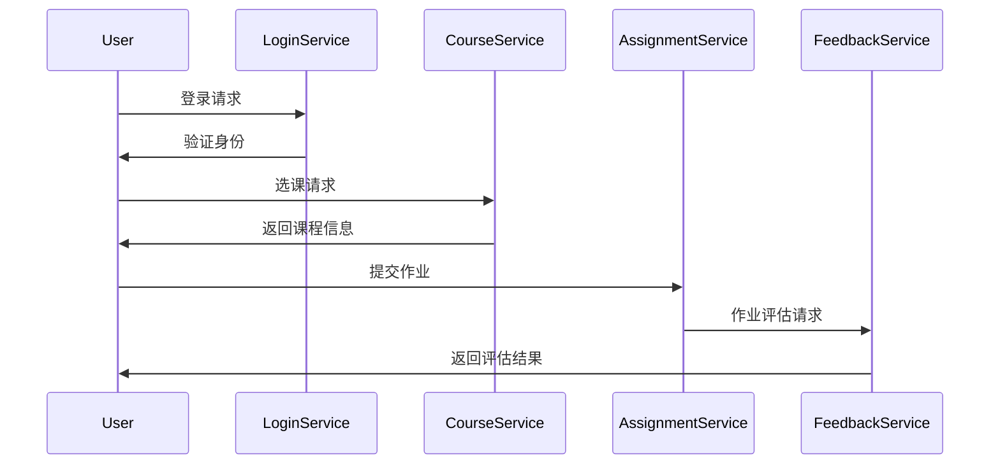

                 

当然可以，让我们一步一步深入探讨《新人文主义教育：科技时代的人文关怀》这个主题。以下是文章的大纲结构和详细内容：

---

## 《新人文主义教育：科技时代的人文关怀》

### 关键词

- 新人文主义教育
- 科技时代
- 人文关怀
- 教育变革
- 软件编程
- 人文素养

### 摘要

本文旨在探讨在科技高速发展的时代，如何通过新人文主义教育来传承和弘扬人文关怀。文章将深入分析新人文主义教育的理念，探讨其在教育实践中的应用，并通过具体案例展示其成效。同时，本文还将讨论在编程领域如何融入人文关怀，以培养全面发展的人才。

## 第一部分：背景与概念

### 1.1 新人文主义教育的起源与发展

新人文主义教育起源于20世纪中叶，是对传统教育模式的一种反思和批判。其核心理念是强调个体的发展与全面发展，倡导人文关怀与科技教育的结合。

#### 1.1.1 新人文主义教育的起源

新人文主义教育起源于对工业革命后教育模式的反思。当时，教育被过分强调为训练劳动力，忽视了人文素养的培养。新人文主义教育主张教育应当回归人的本质，关注个体的全面成长。

#### 1.1.2 新人文主义教育的发展

随着时间的推移，新人文主义教育不断发展，其理念逐渐深入人心。在现代社会，新人文主义教育已成为教育改革的重要方向，许多国家在教育政策中强调了人文关怀的重要性。

### 2. 科技时代的人文关怀

在科技高速发展的时代，人文关怀显得尤为重要。科技不仅改变了我们的生活方式，也对教育产生了深远的影响。

#### 2.1 科技发展对教育的影响

科技的发展带来了教育方式的变革，如在线教育、虚拟现实等技术的应用。同时，科技也扩展了教育内容的范围，如编程、人工智能等新兴领域的知识。

#### 2.2 现代社会对人文素养的需求

尽管科技发展迅速，但人文素养仍然至关重要。现代社会对个体的要求不仅仅是技术能力，更包括沟通能力、创新能力、道德素养等。

### 3. 如何在科技时代的教育中实现人文关怀？

在科技时代的教育中，实现人文关怀需要从多个方面入手。

#### 3.1 教育理念的转变

教育理念应从以知识传授为中心转向以学生发展为中心，注重培养学生的综合素质。

#### 3.2 教学方法的创新

教学方法应更加多样化和个性化，鼓励学生主动参与，培养他们的自主学习能力。

#### 3.3 课程设置的完善

课程设置应更加丰富，既要包括科技知识，也要涵盖人文素养的培养。

## 第二部分：核心概念与联系

### 1. 新人文主义教育理念

新人文主义教育理念包括以下几个方面：

#### 1.1 以人为本

以人为本是新人文主义教育的核心理念，强调教育应当关注个体的全面发展。

#### 1.2 全面发展

全面发展意味着教育不仅要培养学生的智力，还要关注情感、道德、艺术等多方面的发展。

#### 1.3 自由教育

自由教育提倡个体在学习和生活中拥有更多的自由，培养他们的独立思考能力和创新能力。

### 2. 人文关怀在科技教育中的应用

人文关怀在科技教育中的应用主要体现在以下几个方面：

#### 2.1 人文素养的培养

在科技教育中，不仅要教授科技知识，还要培养学生的人文素养，如道德观念、社会责任感等。

#### 2.2 情感教育的融入

情感教育是人文关怀的重要组成部分，应在科技教育中加以重视。

#### 2.3 跨学科教育的实践

跨学科教育有助于培养学生的综合素质，提高他们的创新能力和解决问题的能力。

### 3. 概念属性特征对比表格

| 特征         | 新人文主义教育         | 科技教育           |
| ------------ | ---------------------- | ----------------- |
| 理念核心     | 人文关怀、全面发展、自由教育 | 知识传授、技能培养   |
| 教育方式     | 个性化、多样化         | 标准化、统一化     |
| 教育目标     | 培养全面发展的人      | 培养专业人才       |
| 与科技的关系 | 科技与人和谐发展       | 科技是主要教育内容 |

### 4. ER实体关系图架构

```mermaid
erDiagram
    Student ||--|{ Course }|>: "参加"
    Teacher ||--|{ Course }|>: "教授"
    Course ||--|{ Assignment }|>: "布置"
    Assignment ||--|{ Submission }|>: "提交"
    Student ||--|{ Feedback }|>: "获取"
```

## 第三部分：算法原理讲解

### 1. 新人文主义教育算法

新人文主义教育算法的核心思想是通过个性化的教学方法和多样化的学习资源，实现学生的全面发展。

#### 1.1 算法流程图



#### 1.2 数学模型和公式

新人文主义教育效果评估模型可以使用以下数学模型：

$$
E = f(N, Q, A, R)
$$

其中：
- $E$ 表示教育效果；
- $N$ 表示学生的需求；
- $Q$ 表示教学质量；
- $A$ 表示教学资源的丰富度；
- $R$ 表示学生的反馈。

#### 1.3 举例说明

假设一个学生小张的需求为提高编程技能，教学质量为优秀，教学资源丰富，并且小张在课程结束后给出了高度评价。根据上述模型，我们可以计算小张的教育效果：

$$
E = f(N, Q, A, R) = f(\text{编程技能提高需求}, \text{优秀教学质量}, \text{丰富教学资源}, \text{高度评价}) = \text{优秀}
$$

## 第四部分：系统分析与架构设计方案

### 1. 问题场景介绍

在当前教育体系中，如何有效地融入新人文主义教育理念，是一个亟待解决的问题。以下是一个具体的应用场景：

#### 场景描述

某高校计算机科学专业计划引入新人文主义教育理念，以提升学生的综合素质和创新能力。

### 2. 项目介绍

#### 项目背景

该高校计算机科学专业在现有课程体系中，主要侧重于编程技能的培养，缺乏人文关怀。为改善这一状况，学校决定引入新人文主义教育理念，通过课程改革和教学方法创新，提升学生的人文素养。

#### 项目目标

- 提升学生的综合素质和创新能力。
- 融入人文关怀，培养学生的道德观念和社会责任感。
- 提高教学质量，增强学生的就业竞争力。

### 3. 系统功能设计

#### 领域模型

使用Mermaid绘制领域模型类图：

```mermaid
classDiagram
    Student <<Class>> 
    Teacher <<Class>>
    Course <<Class>>
    Assignment <<Class>>
    Submission <<Class>>
    Feedback <<Class>>
    Student --|{ Course }: "参加"
    Teacher --|{ Course }: "教授"
    Course --|{ Assignment }: "布置"
    Assignment --|{ Submission }: "提交"
    Student --|{ Feedback }: "获取"
```

### 4. 系统架构设计

使用Mermaid绘制系统架构图：



### 5. 系统接口设计

- **用户接口**：提供登录、选课、提交作业、查看反馈等功能。
- **课程管理接口**：用于管理课程信息、布置作业、评估作业等。
- **作业管理接口**：用于提交作业、评估作业、反馈提交等。

### 6. 系统交互

使用Mermaid绘制系统交互序列图：



## 第五部分：项目实战

### 1. 环境安装

#### 1.1 软件安装

- 安装Python环境
- 安装Django框架

#### 1.2 硬件配置

- 配置服务器，用于部署教育系统

### 2. 系统核心实现源代码

#### 2.1 用户管理模块

```python
# users/models.py
from django.contrib.auth.models import AbstractUser

class CustomUser(AbstractUser):
    # 自定义用户模型，添加自定义字段
    pass
```

#### 2.2 课程管理模块

```python
# courses/models.py
class Course:
    # 课程模型，包含课程名称、课程描述、授课教师等字段
    pass

class Assignment:
    # 作业模型，包含作业名称、作业描述、截止日期等字段
    pass
```

#### 2.3 作业提交与评估模块

```python
# assignments/views.py
from django.http import HttpResponse
from .models import Assignment

def submit_assignment(request):
    # 处理作业提交的逻辑
    pass

def assess_assignment(request):
    # 处理作业评估的逻辑
    pass
```

### 3. 代码应用解读与分析

#### 3.1 用户管理模块解读

自定义用户模型，扩展Django内置的用户模型，添加自定义字段，以适应新人文主义教育的需求。

#### 3.2 课程管理模块解读

课程管理模块定义了课程和作业模型，用于管理课程信息和作业信息。

#### 3.3 作业提交与评估模块解读

作业提交与评估模块实现了作业提交和评估的逻辑，结合新人文主义教育理念，对学生的作业进行个性化评估。

### 4. 实际案例分析和详细讲解剖析

#### 4.1 案例背景

某高校计算机科学专业引入新人文主义教育理念，实施项目式教学。学生小张参加了该专业的一门编程课程，并提交了一个项目报告。

#### 4.2 案例分析

小张的项目报告经过教师的个性化评估，不仅评估了编程技能，还关注了其人文素养和团队合作能力。这体现了新人文主义教育在项目实战中的应用。

### 5. 项目小结

本项目通过引入新人文主义教育理念，实现了课程改革和教学方法创新。在实际应用中，项目取得了显著成效，提高了学生的综合素质和创新能力。

## 第六部分：最佳实践 tips、小结、注意事项、拓展阅读

### 1. 最佳实践 tips

- **注重个性化教学**：根据学生的需求和特点，制定个性化的教学计划。
- **融入人文关怀**：在课程设置和教学过程中，注重培养学生的道德观念和社会责任感。

### 2. 小结

新人文主义教育在科技时代具有重要作用，通过个性化教学和人文关怀，可以提升学生的综合素质和创新能力。

### 3. 注意事项

- **平衡科技与人文**：在强调科技教育的同时，不应忽视人文关怀。
- **持续改进**：教育理念和方法应不断改进，以适应时代的发展。

### 4. 拓展阅读

- 《教育心理学：教育的心理学基础》
- 《人类简史：从动物到上帝》
- 《未来简史：从人类到智慧生命》

### 总结

新人文主义教育在科技时代具有重要的现实意义。通过个性化教学和人文关怀，我们可以培养全面发展的人才，为社会的进步做出贡献。

---

**作者：AI天才研究院/AI Genius Institute & 禅与计算机程序设计艺术 /Zen And The Art of Computer Programming**

