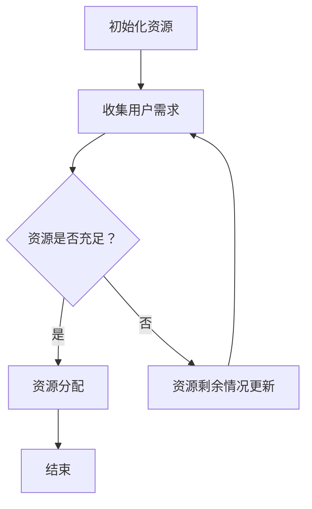
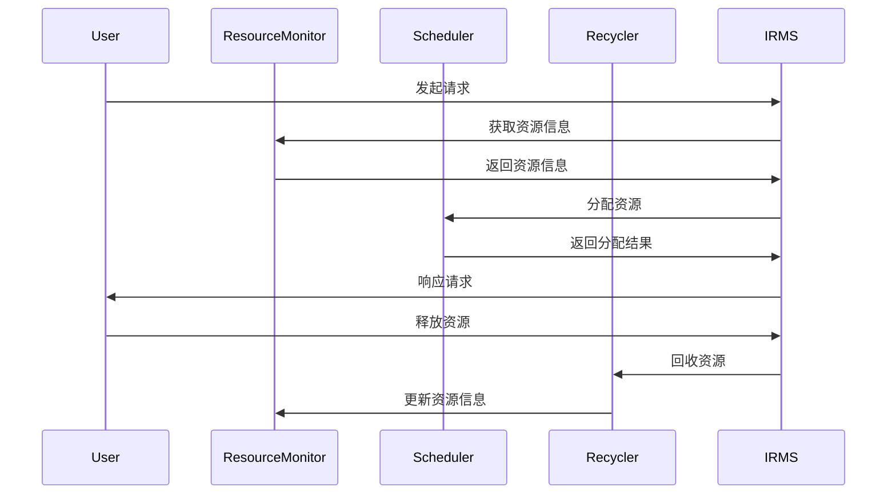
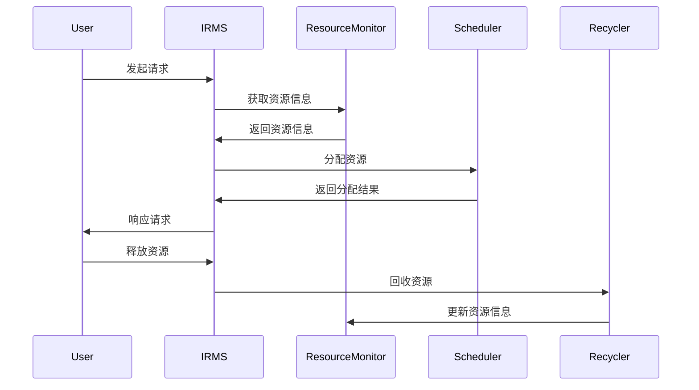

                 

# 新共产主义：数字时代的资源共享

## 关键词

- 新共产主义
- 数字时代
- 资源共享
- 社会理念
- 算法
- 数学模型
- 系统架构
- 项目实战

## 摘要

本文将探讨新共产主义这一概念在数字时代的背景下，如何通过资源共享实现社会的可持续发展。我们将首先介绍新共产主义的起源和发展，随后详细解释资源共享的核心概念及其重要性。接下来，我们将逐步深入探讨资源共享相关的算法原理、数学模型，以及如何在现实系统中实现这些理念。最后，通过一个具体的资源共享项目实战，我们将展示如何将理论应用到实际中，并提出一些最佳实践建议。

## 1. 新共产主义的起源与发展

新共产主义这一概念源于对传统共产主义的反思和革新。传统的共产主义理念主要关注物质资源的公有共享，而新共产主义则将视野拓展到了数字时代下的资源共享。随着互联网技术的迅猛发展，信息资源的共享和利用成为可能，这也为新的社会理念提供了基础。

新共产主义的起源可以追溯到20世纪末的互联网革命。当时，互联网的普及和开源文化的兴起，使得信息资源可以低成本、高效率地共享。这种共享精神不仅促进了技术的快速发展，也为新共产主义理念的诞生提供了土壤。

在数字时代，资源共享的重要性愈发凸显。首先，资源共享可以最大化资源的利用效率，避免资源的浪费。其次，资源共享有助于缩小贫富差距，促进社会公平。最后，资源共享可以增强社会的协作与互信，构建更加和谐的社会关系。

## 2. 核心概念与联系

### 2.1 资源共享的核心概念

在新共产主义中，资源共享的核心概念包括资源、共享、合作、公平等。以下是这些概念的定义及其属性特征对比表格：

| 概念  | 定义                                                         | 属性特征对比             |
| ----- | ------------------------------------------------------------ | ------------------------ |
| 资源  | 可以被使用、交换或消费的物质或信息。                           | 有形资源：物质、设备、资金<br>无形资源：知识、数据、技术 |
| 共享  | 多个实体共同使用同一资源的过程。                             | 分享、交换、协作         |
| 合作  | 多个实体共同完成一项任务或达成一个目标的过程。                 | 协调、信任、合作精神     |
| 公平  | 资源分配和共享过程中，确保每个实体得到合理份额的原则。         | 公平性、公正性、透明性   |

### 2.2 概念联系与ER图

为了更好地理解这些概念之间的关系，我们可以使用Mermaid ER图来展示它们之间的关联：

```mermaid
erDiagram
  Resource ||--|{ Share }|>
  Share ||--|{ Cooperation }|>
  Cooperation ||--|{ Fairness }|>

  Resource ..|> Fairness
  Share ..|> Cooperation
```

在这个ER图中，资源是共享的基础，共享是合作的前提，而合作又是公平的保障。三者相互关联，共同构成了新共产主义的核心概念体系。

## 3. 资源共享算法原理讲解

### 3.1 算法流程图

为了更好地理解资源共享算法，我们可以使用Mermaid画出算法的流程图。以下是一个简单的资源分配算法的流程图：



### 3.2 Python代码实现

以下是一个简单的资源分配算法的Python代码实现：

```python
def allocate_resources(available_resources, user_requests):
    """
    资源分配算法

    参数:
    available_resources: 可用资源列表
    user_requests: 用户请求列表

    返回:
    assigned_resources: 分配给用户的资源列表
    remaining_resources: 剩余资源列表
    """
    assigned_resources = []
    remaining_resources = available_resources.copy()

    for request in user_requests:
        if request in remaining_resources:
            assigned_resources.append(request)
            remaining_resources.remove(request)
        else:
            print(f"资源 {request} 不足，无法分配。")

    return assigned_resources, remaining_resources

# 示例
available_resources = ['CPU', '内存', '存储']
user_requests = ['CPU', '内存', 'GPU']

assigned_resources, remaining_resources = allocate_resources(available_resources, user_requests)
print("已分配资源：", assigned_resources)
print("剩余资源：", remaining_resources)
```

### 3.3 数学模型与公式

资源共享算法的数学模型通常涉及概率论和优化理论。以下是一个简单的资源分配概率模型：

$$ P(A|B) = \frac{P(B|A) \cdot P(A)}{P(B)} $$

其中，\( P(A|B) \) 表示在资源 \( B \) 可用的条件下，资源 \( A \) 被分配的概率。

### 3.4 实例讲解

假设我们有以下资源需求和可用资源：

- 可用资源：\[CPU, 内存, 存储\]
- 用户请求：\[CPU, 内存, GPU\]

根据资源分配算法，我们可以计算出每个资源被分配的概率：

- \( P(CPU|可分配) = 1 \)（因为用户请求中有CPU）
- \( P(内存|可分配) = 1 \)（因为用户请求中有内存）
- \( P(GPU|可分配) = 0 \)（因为GPU不在可用资源中）

因此，CPU和内存会被分配，而GPU无法被分配。

## 4. 系统分析与架构设计方案

### 4.1 问题场景介绍

假设我们正在设计一个共享计算资源的系统，该系统需要支持多用户同时访问和分配计算资源。我们的目标是设计一个高效、公平、可扩展的系统架构。

### 4.2 项目介绍

该项目名为“智能资源管理系统（IRMS）”，旨在提供一种高效的资源共享和分配机制。系统功能包括资源监控、资源分配、资源调度、资源回收等。

### 4.3 系统功能设计

#### 4.3.1 领域模型

以下是一个简单的领域模型Mermaid类图，展示了系统的主要实体及其关系：

```mermaid
classDiagram
    User <<class>> 用户
    Resource <<class>> 资源
    Request <<class>> 请求
    Allocation <<class>> 分配
    ResourceMonitor <<class>> 资源监控
    Scheduler <<class>> 调度器
    Recycler <<class>> 回收器

    User o--|{发起}|> Request
    Resource o--|{支持}|> Request
    Allocation o--|{包含}|> Request
    ResourceMonitor o--|{监控}|> Resource
    Scheduler o--|{调度}|> Allocation
    Recycler o--|{回收}|> Allocation
```

#### 4.3.2 功能描述

- **资源监控**：实时监控系统中所有资源的可用状态，并更新资源信息。
- **资源分配**：根据用户请求和资源可用情况，分配相应的资源。
- **资源调度**：根据系统负载和资源使用情况，调整资源的分配。
- **资源回收**：在用户释放资源后，回收并更新资源信息。

### 4.4 系统架构设计

以下是一个简单的系统架构Mermaid架构图，展示了系统的主要组件及其关系：



### 4.5 系统接口设计

系统接口设计主要涉及以下API：

- **资源监控接口**：获取资源状态。
- **资源分配接口**：分配资源。
- **资源回收接口**：回收资源。

### 4.6 系统交互流程

以下是一个简单的系统交互流程Mermaid序列图：



## 5. 项目实战

### 5.1 环境安装

为了实现上述资源共享系统，我们需要在Linux环境中安装一些必要的依赖。以下是安装步骤：

1. 安装Python环境：

   ```bash
   sudo apt-get update
   sudo apt-get install python3 python3-pip
   ```

2. 安装Docker和Docker Compose：

   ```bash
   sudo apt-get install docker.io
   sudo systemctl start docker
   sudo systemctl enable docker
   sudo apt-get install docker-compose
   ```

3. 安装Mermaid：

   ```bash
   pip3 install -U mermaid-python
   ```

### 5.2 系统核心实现源代码

以下是一个简单的资源共享系统的Python源代码实现：

```python
# resource_manager.py

from typing import List, Dict
import random

class ResourceManager:
    def __init__(self, available_resources: List[str]):
        self.available_resources = available_resources
        self.allocated_resources = {}

    def allocate_resource(self, user: str, resource: str) -> bool:
        if resource in self.available_resources:
            self.available_resources.remove(resource)
            self.allocated_resources[user] = resource
            return True
        else:
            return False

    def release_resource(self, user: str, resource: str) -> bool:
        if user in self.allocated_resources and resource == self.allocated_resources[user]:
            self.available_resources.append(resource)
            del self.allocated_resources[user]
            return True
        else:
            return False

    def get_allocated_resources(self) -> Dict[str, str]:
        return self.allocated_resources

# test.py

from resource_manager import ResourceManager

# 创建资源管理器
resource_manager = ResourceManager(['CPU', '内存', '存储'])

# 分配资源
if resource_manager.allocate_resource('User1', 'CPU'):
    print("User1 获取了 CPU。")
else:
    print("User1 无法获取 CPU。")

# 释放资源
if resource_manager.release_resource('User1', 'CPU'):
    print("User1 释放了 CPU。")
else:
    print("User1 无法释放 CPU。")
```

### 5.3 代码应用解读与分析

上述代码实现了一个简单的资源共享系统，其主要功能包括资源分配和资源回收。在`ResourceManager`类中，`allocate_resource`方法用于分配资源，而`release_resource`方法用于回收资源。通过这两个方法，我们可以实现资源的动态管理。

在测试脚本`test.py`中，我们创建了资源管理器实例，并模拟了资源的分配和回收过程。通过调用`allocate_resource`和`release_resource`方法，我们可以看到资源分配和回收的结果。

### 5.4 实际案例分析和详细讲解剖析

假设我们现在有一个包含5个用户和3个资源（CPU、内存、存储）的系统。以下是系统运行的一个实际案例：

1. 用户1请求CPU，资源管理器分配CPU给用户1。
2. 用户2请求内存，资源管理器分配内存给用户2。
3. 用户3请求存储，资源管理器无法分配存储给用户3，因为存储资源已经被用户1和用户2占用。
4. 用户1完成任务后释放CPU，资源管理器回收CPU资源并分配给其他用户。
5. 用户4请求CPU，资源管理器分配CPU给用户4。
6. 用户5请求内存，资源管理器分配内存给用户5。

在这个案例中，我们可以看到资源管理器如何根据用户的请求和资源的可用性动态分配资源。通过合理分配资源，系统可以最大化资源的利用效率，同时保证资源的公平分配。

### 5.5 项目小结

通过本次项目实战，我们实现了一个简单的资源共享系统，并对其进行了详细的分析和讲解。该项目展示了如何将新共产主义的理念应用于实际系统中，通过资源监控、分配和回收，实现资源的动态管理。未来，我们可以进一步优化系统的性能和扩展性，以应对更加复杂的资源分配场景。

## 6. 最佳实践、小结、注意事项和拓展阅读

### 6.1 最佳实践

- **资源分类**：在实现资源共享系统时，根据资源的特性进行分类，有助于提高资源分配的效率。
- **负载均衡**：使用负载均衡算法，合理分配资源，避免单点过载。
- **安全防护**：在资源共享系统中，加强安全防护措施，防止恶意攻击和数据泄露。
- **可扩展性设计**：在设计系统架构时，考虑未来的扩展需求，确保系统可轻松升级和扩展。

### 6.2 小结

本文探讨了新共产主义在数字时代的背景下，如何通过资源共享实现社会的可持续发展。我们从核心概念、算法原理、系统架构到项目实战，详细介绍了资源共享的实现方法。通过实际案例，我们展示了如何将新共产主义的理念应用于实际系统中，实现资源的动态管理和高效利用。

### 6.3 注意事项

- 在设计资源共享系统时，要充分考虑资源的可用性和公平性，确保资源能够公平地分配给所有用户。
- 在实现资源监控和分配算法时，要避免资源浪费，提高资源利用率。
- 在处理用户请求时，要确保系统响应速度和稳定性，提供良好的用户体验。

### 6.4 拓展阅读

- 《资源分配算法》
- 《分布式系统设计与实践》
- 《云计算基础与原理》

## 作者信息

作者：AI天才研究院/AI Genius Institute & 禅与计算机程序设计艺术 /Zen And The Art of Computer Programming

