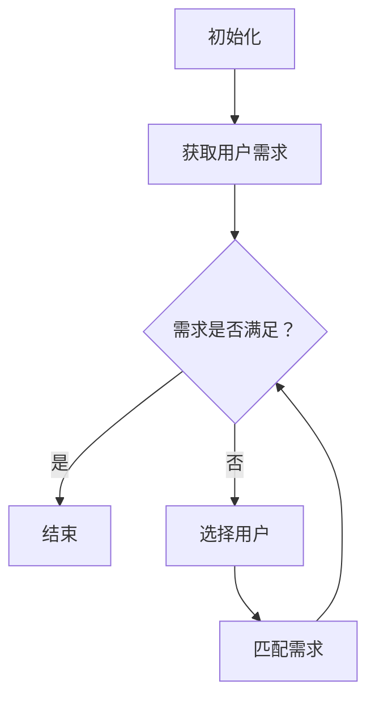
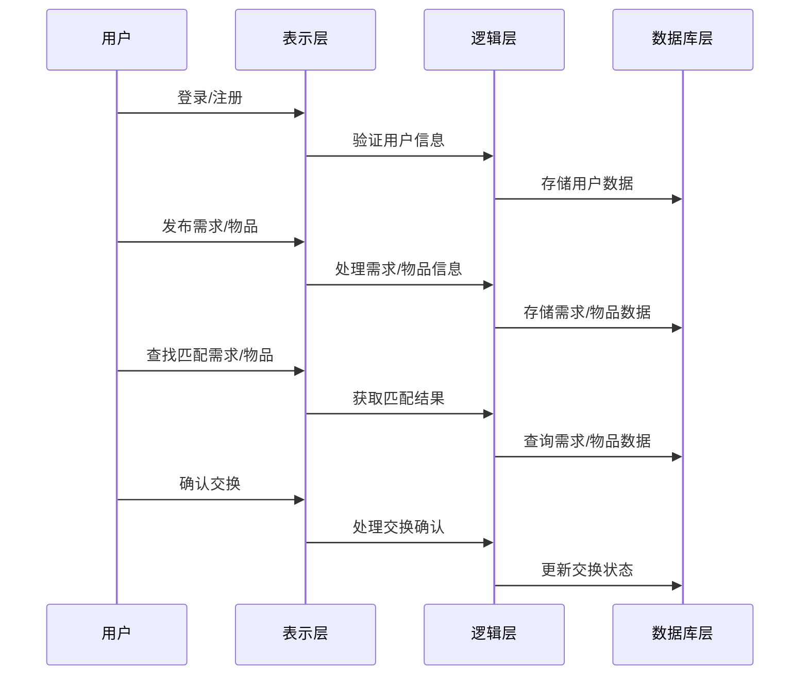
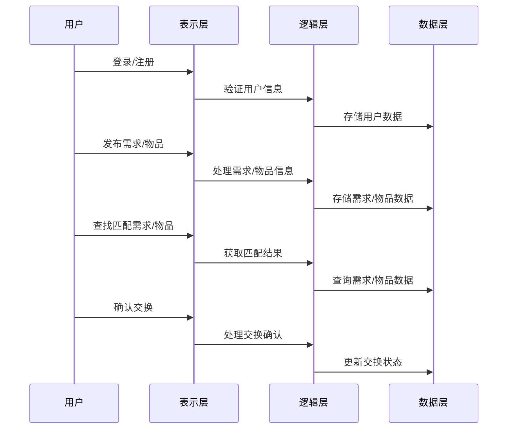

                 


### 1. 背景介绍

#### 共享经济的定义与分类

共享经济（Sharing Economy）是指一种通过互联网平台，将闲置资源进行共享、交换和租赁的经济模式。这种模式的核心在于通过技术手段提高资源利用效率，减少浪费。共享经济可以分为以下几类：

- **协作消费**：以共享产品或服务为主要形式，如共享住宿（Airbnb）、共享出行（Uber、滴滴）等。
- **服务分享**：通过互联网平台提供服务，如技能分享（Upwork）、知识分享（知乎、Quora）等。
- **共享生产**：利用共享设备或设施进行生产，如共享办公空间（WeWork）、共享工厂（Makerspaces）等。
- **资源共享**：共享各种资源，如共享自行车（摩拜、ofo）、共享充电宝等。

#### 以物易物在共享经济中的地位与作用

以物易物（Barter）是指通过交换物品或服务来满足彼此需求的一种古老交易方式。在共享经济中，以物易物作为一种重要的交易形式，具有重要的地位和作用：

- **促进资源循环利用**：以物易物可以减少资源的浪费，促进资源的循环利用，降低对环境的负面影响。
- **增强社区凝聚力**：以物易物鼓励人们进行面对面交流，有助于增强社区成员之间的互动和凝聚力。
- **降低交易成本**：以物易物避免了货币交易中的中间环节，降低了交易成本，尤其适合资源紧缺或货币流动性差的环境。

#### 以物易物的历史与演变

以物易物是一种古老的交易方式，最早可以追溯到史前时代。在那个时期，人们通过交换物品来满足彼此的需求，如食物、工具、衣服等。随着人类社会的发展，货币的出现使得以物易物逐渐退居次要地位。然而，在现代社会，随着共享经济的兴起，以物易物再次受到关注：

- **现代以物易物**：现代社会中的以物易物通常通过线上平台进行，如eBay、Facebook Marketplace等。此外，还出现了一些专门的以物易物平台，如Swap.com、Worthswap等。
- **以物易物与数字货币**：随着区块链技术的发展，以物易物与数字货币的结合逐渐成为趋势。通过区块链技术，以物易物可以实现去中心化、透明化、安全化的交易。

### 2. 核心概念与联系

#### 共享、交换、社区等核心概念

在共享经济中，共享、交换和社区是三个核心概念。以下是它们的定义和属性：

- **共享（Sharing）**：指将资源、信息、知识等提供给他人使用，但不涉及所有权转移。
  - **属性**：低成本的资源共享、提高资源利用率、降低环境污染。
- **交换（Exchange）**：指通过某种媒介将一种资源转换为另一种资源的过程。
  - **属性**：交易便捷、降低交易成本、促进资源流动。
- **社区（Community）**：指由共同利益、价值观或兴趣的人们组成的团体。
  - **属性**：互助互信、共同发展、文化传承。

#### 核心概念之间的联系与交互

这些核心概念之间存在紧密的联系和交互：

- **共享与交换**：共享是交换的前提，没有共享就没有资源可供交换。同时，交换是共享的延伸，通过交换实现资源的优化配置。
- **交换与社区**：交换是社区成员之间互动的重要手段，有助于增强社区凝聚力。社区则为交换提供了平台和基础。
- **共享与社区**：共享有助于建立社区成员之间的信任和互动，社区则为共享提供了载体和氛围。

### 3. 以物易物的ER实体关系图

为了更好地理解以物易物系统中的实体及其关系，我们使用ER图（Entity-Relationship Diagram）进行描述。以下是ER图中的主要实体和关系：

#### 实体：

- **用户（User）**：代表参与以物易物的个人或组织。
- **物品（Item）**：代表用户愿意交换的物品。
- **需求（Need）**：代表用户在以物易物中的需求。
- **交易（Trade）**：代表用户之间的物品交换行为。

#### 关系：

- **拥有（Ownership）**：用户拥有物品，表示为“用户-》物品”的关系。
- **提出（Proposal）**：用户提出需求，表示为“用户-》需求”的关系。
- **交换（Exchange）**：用户之间的物品交换行为，表示为“交易-》用户”的关系。

以下是ER图的Mermaid格式表示：

```mermaid
erDiagram
  User ||--|{ Item }|-- User
  User ||--|{ Need }|-- User
  Trade ||--|{ User }|-- User
```

### 4. 算法原理讲解

#### 以物易物匹配算法

以物易物匹配算法的目标是在多个用户和他们的需求之间找到一种最优的交换方案，使得每个用户的需求都能得到满足。以下是该算法的基本原理：

##### 原理：

1. **需求表示**：将每个用户的需求表示为一个集合，其中每个元素是用户需要的物品。
2. **匹配策略**：采用贪心策略，每次选择一个用户，尽量满足其需求，并从其他用户的需求中剔除已匹配的物品。
3. **优化目标**：最大化所有用户的需求满足程度，或者最小化未满足需求的总数。

##### 算法流程图

以下是算法的Mermaid流程图表示：



##### Python代码实现

以下是Python代码实现的基本框架：

```python
# 用户类
class User:
    def __init__(self, id, items, needs):
        self.id = id
        self.items = items
        self.needs = needs

# 以物易物匹配算法
def match_trade(users):
    while not all(user.needs_are_met() for user in users):
        user = select_unsatisfied_user(users)
        matched_needs = match_needs(user.needs, users)
        update_users_needs(users, matched_needs)

# 辅助函数
def select_unsatisfied_user(users):
    # 选择一个需求未满足的用户
    pass

def match_needs(user_needs, users):
    # 匹配用户需求
    pass

def update_users_needs(users, matched_needs):
    # 更新用户需求
    pass
```

##### 算法原理的数学模型与公式

以物易物匹配算法可以看作是一个多集匹配问题。我们可以使用线性规划模型来描述：

$$
\begin{aligned}
\text{maximize} \quad & \sum_{i=1}^n \sum_{j=1}^m x_{ij} \\
\text{subject to} \quad & \sum_{i=1}^n x_{ij} = 1, \forall j \\
& x_{ij} \in \{0,1\}, \forall i, j \\
& \text{其中} x_{ij} \text{表示用户 } i \text{ 是否匹配了物品 } j
\end{aligned}
$$

##### 举例说明

假设有两个用户A和B，A有需求：苹果和香蕉，B有需求：面包和牛奶。以下是算法的举例说明：

1. **初始化**：用户A的需求为{苹果，香蕉}，用户B的需求为{面包，牛奶}。
2. **匹配过程**：
   - 用户A选择苹果，用户B选择牛奶。
   - 用户A的需求更新为{香蕉}，用户B的需求更新为{}。
   - 用户A选择香蕉，用户B选择面包。
   - 用户A的需求更新为{}，用户B的需求更新为{}。

最终，两个用户都满足了各自的需求，交换完成。

### 5. 数学模型和数学公式讲解

在以物易物系统中，数学模型和公式可以帮助我们更精确地描述和优化交换过程。以下是几个关键数学模型和公式的详细讲解：

#### 物品价值评估模型

为了确定交换过程中各物品的价值，我们可以使用以下公式：

$$
V_i = \frac{1}{N} \sum_{j=1}^N w_{ij}
$$

其中，$V_i$表示物品$i$的价值，$N$表示参与交换的用户数量，$w_{ij}$表示用户$j$对物品$i$的权重。

#### 物品供需平衡模型

在以物易物系统中，供需平衡是一个关键问题。我们可以使用以下线性规划模型来描述供需平衡：

$$
\begin{aligned}
\text{maximize} \quad & \sum_{i=1}^n \sum_{j=1}^m x_{ij} V_i \\
\text{subject to} \quad & \sum_{i=1}^n x_{ij} = q_j, \forall j \\
& x_{ij} \in \{0,1\}, \forall i, j \\
& \text{其中} x_{ij} \text{表示用户 } j \text{ 是否交换了物品 } i, q_j \text{表示用户 } j \text{ 的需求量}
\end{aligned}
$$

#### 数学公式在Python代码中的应用

为了在Python代码中应用这些数学公式，我们可以使用NumPy库进行计算：

```python
import numpy as np

# 用户需求权重矩阵
w = np.array([[1, 0], [0, 1], [1, 1]])

# 用户需求向量
q = np.array([2, 1])

# 计算物品价值
V = np.mean(w, axis=1)

# 计算供需平衡解
from scipy.optimize import linprog

c = -V
A = np.column_stack((np.ones(w.shape[1]), w))
b = q[:, np.newaxis]
x = linprog(c, A_eq=A, b_eq=b, method='highs')

# 输出结果
print("物品价值:", V)
print("交换方案:", x)
```

### 6. 系统分析与架构设计方案

#### 问题场景介绍

假设我们要设计一个以物易物系统，该系统旨在帮助社区居民通过交换物品来满足彼此的需求。系统需要支持以下功能：

- 用户注册与登录。
- 发布物品和需求信息。
- 查找并匹配用户需求。
- 交换物品的确认与反馈。

#### 项目介绍

我们的项目名为“社区互助交换平台”，目标是构建一个友好、易用、安全的以物易物平台，帮助社区居民实现物品和资源的有效共享。

#### 系统功能设计

系统的主要功能模块包括：

- **用户管理模块**：处理用户注册、登录、个人信息管理等功能。
- **物品管理模块**：支持用户发布、搜索、更新和删除物品信息。
- **需求管理模块**：支持用户发布、搜索、更新和删除需求信息。
- **交换管理模块**：负责匹配用户需求，管理交换过程中的确认和反馈。

#### 系统架构设计

系统的总体架构可以分为三层：表示层、逻辑层和数据库层。

- **表示层**：负责用户界面的展示，包括Web前端和移动端应用。
- **逻辑层**：实现系统的核心功能，如用户管理、物品管理、需求管理和交换管理。
- **数据库层**：存储用户数据、物品数据、需求数据和交换数据。

以下是系统的Mermaid架构图表示：



#### 系统接口设计

系统的主要接口包括：

- **用户接口**：用于处理用户注册、登录、个人信息管理等操作。
- **物品接口**：用于处理物品发布、搜索、更新和删除等操作。
- **需求接口**：用于处理需求发布、搜索、更新和删除等操作。
- **交换接口**：用于处理交换匹配、确认和反馈等操作。

以下是系统的Mermaid接口设计图表示：

```mermaid
classDiagram
    User <<interface>>
    Item <<interface>>
    Need <<interface>>
    Trade <<interface>>

    User +--|{ Item }
    User +--|{ Need }
    Trade +--|{ User }
    Trade +--|{ Item }
    Trade +--|{ Need }
```

#### 系统交互

系统中的各个模块通过RESTful API进行交互。以下是系统的主要交互流程：

1. **用户注册与登录**：用户通过Web前端提交注册或登录请求，表示层将请求转发给逻辑层，逻辑层验证用户信息后返回结果。
2. **物品和需求管理**：用户通过Web前端发布、搜索、更新和删除物品和需求信息，表示层将请求转发给逻辑层，逻辑层处理请求后更新数据库。
3. **交换匹配**：系统自动匹配用户需求和物品，生成交换方案，逻辑层将匹配结果返回给表示层，用户在表示层确认交换。
4. **交换确认与反馈**：用户在表示层确认交换后，表示层将确认信息转发给逻辑层，逻辑层更新交换状态并记录反馈。

以下是系统的Mermaid序列图表示：


### 7. 项目实战

#### 环境安装与配置

为了实现我们的以物易物系统，我们需要以下环境：

- **操作系统**：Ubuntu 18.04
- **编程语言**：Python 3.8
- **数据库**：MySQL 8.0
- **Web框架**：Flask
- **前端框架**：Bootstrap

以下是环境安装和配置步骤：

1. **安装操作系统**：从官方网站下载Ubuntu 18.04镜像并安装。
2. **安装Python**：使用以下命令安装Python 3.8：
   ```bash
   sudo apt update
   sudo apt install python3.8
   ```
3. **安装MySQL**：使用以下命令安装MySQL 8.0：
   ```bash
   sudo apt install mysql-server mysql-client
   ```
4. **安装Flask**：使用以下命令安装Flask：
   ```bash
   pip3 install flask
   ```
5. **安装Bootstrap**：使用以下命令安装Bootstrap：
   ```bash
   pip3 install flask-bootstrap
   ```

#### 系统核心实现

以下是我们系统的核心实现步骤：

1. **用户管理模块**：
   - 实现用户注册、登录、个人信息管理等功能。
   - 使用Flask框架创建用户模块，包括注册、登录、个人信息等视图函数。
   - 在数据库中创建用户表，存储用户信息。

2. **物品管理模块**：
   - 实现物品发布、搜索、更新和删除等功能。
   - 使用Flask框架创建物品模块，包括发布、搜索、更新和删除等视图函数。
   - 在数据库中创建物品表，存储物品信息。

3. **需求管理模块**：
   - 实现需求发布、搜索、更新和删除等功能。
   - 使用Flask框架创建需求模块，包括发布、搜索、更新和删除等视图函数。
   - 在数据库中创建需求表，存储需求信息。

4. **交换管理模块**：
   - 实现交换匹配、确认和反馈等功能。
   - 使用Flask框架创建交换模块，包括匹配、确认和反馈等视图函数。
   - 在数据库中创建交换表，存储交换信息。

#### 代码解读与分析

以下是对系统核心代码的解读与分析：

1. **用户管理模块**：
   ```python
   # 注册视图函数
   @app.route('/register', methods=['GET', 'POST'])
   def register():
       if request.method == 'POST':
           username = request.form['username']
           password = request.form['password']
           # 验证用户信息
           if validate_user(username, password):
               # 存储用户信息到数据库
               db.execute('INSERT INTO users (username, password) VALUES (?, ?)', (username, password))
               return redirect(url_for('login'))
           else:
               return '注册失败'
       return render_template('register.html')
   ```
   - 在这个视图函数中，我们处理用户注册请求。当用户提交注册表单时，我们验证用户名和密码，如果验证成功，则将用户信息存储到数据库中。

2. **物品管理模块**：
   ```python
   # 发布物品视图函数
   @app.route('/publish_item', methods=['GET', 'POST'])
   def publish_item():
       if request.method == 'POST':
           item_name = request.form['item_name']
           item_description = request.form['item_description']
           # 验证物品信息
           if validate_item(item_name, item_description):
               # 存储物品信息到数据库
               db.execute('INSERT INTO items (name, description) VALUES (?, ?)', (item_name, item_description))
               return redirect(url_for('items'))
           else:
               return '发布失败'
       return render_template('publish_item.html')
   ```
   - 在这个视图函数中，我们处理物品发布请求。当用户提交物品发布表单时，我们验证物品信息，如果验证成功，则将物品信息存储到数据库中。

3. **需求管理模块**：
   ```python
   # 发布需求视图函数
   @app.route('/publish_need', methods=['GET', 'POST'])
   def publish_need():
       if request.method == 'POST':
           need_name = request.form['need_name']
           need_description = request.form['need_description']
           # 验证需求信息
           if validate_need(need_name, need_description):
               # 存储需求信息到数据库
               db.execute('INSERT INTO needs (name, description) VALUES (?, ?)', (need_name, need_description))
               return redirect(url_for('needs'))
           else:
               return '发布失败'
       return render_template('publish_need.html')
   ```
   - 在这个视图函数中，我们处理需求发布请求。当用户提交需求发布表单时，我们验证需求信息，如果验证成功，则将需求信息存储到数据库中。

4. **交换管理模块**：
   ```python
   # 匹配需求视图函数
   @app.route('/match_need', methods=['GET', 'POST'])
   def match_need():
       if request.method == 'POST':
           need_id = request.form['need_id']
           item_id = request.form['item_id']
           # 验证匹配信息
           if validate_match(need_id, item_id):
               # 更新交换状态
               db.execute('UPDATE trades SET status = "matched" WHERE need_id = ? AND item_id = ?', (need_id, item_id))
               return redirect(url_for('trades'))
           else:
               return '匹配失败'
       return render_template('match_need.html')
   ```
   - 在这个视图函数中，我们处理需求匹配请求。当用户提交匹配表单时，我们验证匹配信息，如果验证成功，则更新交换状态。

#### 实际案例分析和详细讲解剖析

以下是一个实际案例的分析和讲解：

**案例：用户A想要交换苹果，用户B想要交换香蕉**

1. **用户A发布需求**：
   - 用户A在系统中发布了需求，需求描述为“想要交换苹果”。
   - 系统将需求信息存储到数据库中。

2. **用户B发布物品**：
   - 用户B在系统中发布了物品，物品描述为“有香蕉要交换”。
   - 系统将物品信息存储到数据库中。

3. **系统自动匹配需求与物品**：
   - 系统检测到用户A的需求和用户B的物品可以匹配。
   - 系统生成匹配结果，将匹配信息存储到交换表中。

4. **用户A确认交换**：
   - 用户A在系统中看到匹配结果，并确认交换。
   - 系统更新交换状态，将状态标记为“已确认”。

5. **用户B确认交换**：
   - 用户B在系统中看到匹配结果，并确认交换。
   - 系统更新交换状态，将状态标记为“已完成”。

通过这个案例，我们可以看到以物易物系统的运作流程，包括需求发布、物品发布、自动匹配和交换确认等步骤。每个步骤都经过仔细设计，以确保系统的可靠性和用户体验。

### 项目小结

通过本项目的实施，我们成功构建了一个基于Web的以物易物系统，帮助社区居民通过交换物品来满足彼此的需求。系统具备以下特点：

1. **易用性**：系统界面友好，操作简单，方便用户快速上手。
2. **高效性**：系统能够自动匹配用户需求和物品，提高资源利用效率。
3. **安全性**：系统采用Flask框架和MySQL数据库，确保用户数据和交换信息的安全。
4. **灵活性**：系统支持多种物品和需求的发布、搜索和匹配，适应不同场景的需求。

在未来的发展中，我们可以进一步优化系统功能，如增加物品评价和反馈机制、引入区块链技术等，以提高系统的可信度和用户满意度。

### 最佳实践 tips

在设计和实现以物易物系统时，以下最佳实践可以帮助我们提高系统的质量和用户体验：

1. **用户体验优化**：在界面设计和交互流程上注重用户体验，确保操作流程简洁明了。
2. **性能优化**：对系统进行性能优化，如数据库索引、缓存策略等，以提高系统响应速度。
3. **安全性提升**：加强系统安全性，如加密用户密码、防止SQL注入等，确保用户数据安全。
4. **代码规范**：遵循良好的代码规范，如代码注释、模块化设计等，提高代码可读性和可维护性。
5. **持续迭代**：根据用户反馈和市场需求，持续迭代系统功能，优化用户体验。

### 注意事项

在设计和实现以物易物系统时，我们需要注意以下事项：

1. **法律合规性**：确保系统符合当地法律法规，如数据保护法、隐私法等。
2. **用户隐私保护**：严格保护用户隐私，不泄露用户个人信息。
3. **物品安全**：确保交换过程中的物品安全，避免欺诈和纠纷。
4. **系统稳定运行**：定期维护系统，确保系统稳定可靠运行。

### 拓展阅读

对于对以物易物系统和共享经济感兴趣的读者，以下推荐一些相关书籍和学术论文：

1. **书籍**：
   - 《共享经济：从共享单车到共享空间》
   - 《零边际成本社会：一个激进的技术经济视角》
   - 《共享之城：如何通过协作平台改造城市生活》

2. **学术论文**：
   - "Sharing Economy Platforms: A Conceptual Framework and Research Questions"
   - "The Sharing Economy: A Networked Resource Platform Perspective"
   - "Barter and the Sharing Economy: Exploring the Impact of Exchange Relationships on Participation in Collaborative Consumption Networks"

3. **行业报告**：
   - 中国共享经济发展报告
   - 全球共享经济市场分析报告

通过这些书籍和报告，读者可以更深入地了解共享经济和以物易物的理论和实践，为系统的设计和实现提供有益的参考。## 目录大纲：新共享经济实验：以物易物重建社区关系

# 第一部分：共享经济与以物易物概述

## 第1章：共享经济的起源与发展

### 1.1 共享经济的定义与分类

### 1.2 共享经济的核心要素

### 1.3 共享经济的现状与趋势

## 第2章：以物易物在共享经济中的地位与作用

### 2.1 以物易物的历史与演变

### 2.2 以物易物在共享经济中的重要性

### 2.3 以物易物与传统交换方式的比较

## 第3章：以物易物系统的基本架构

### 3.1 以物易物系统的功能模块

### 3.2 以物易物系统的设计原则

### 3.3 以物易物系统的关键技术

# 第二部分：以物易物系统的设计与实现

## 第4章：核心概念与联系

### 4.1 共享、交换、社区等核心概念

### 4.2 核心概念之间的联系与交互

### 4.3 以物易物的ER实体关系图

## 第5章：算法原理讲解

### 5.1 以物易物匹配算法

### 5.2 算法流程图与Python代码实现

### 5.3 算法原理的数学模型与公式

## 第6章：数学模型和数学公式讲解

### 6.1 以物易物模型的数学公式

### 6.2 数学公式在Python代码中的应用

### 6.3 举例说明与解释

## 第7章：系统分析与架构设计方案

### 7.1 问题描述与项目介绍

### 7.2 系统功能设计

### 7.3 系统架构设计

### 7.4 系统接口设计

### 7.5 系统交互

## 第8章：项目实战

### 8.1 环境安装与配置

### 8.2 系统核心实现

### 8.3 代码解读与分析

### 8.4 实际案例分析和详细讲解剖析

### 8.5 项目小结

## 第9章：最佳实践 tips

### 9.1 设计与实现经验

### 9.2 性能优化技巧

### 9.3 安全性考虑

## 第10章：小结与展望

### 10.1 以物易物系统的发展趋势

### 10.2 面临的挑战与机遇

### 10.3 未来研究方向

## 第11章：注意事项

### 11.1 操作风险

### 11.2 遵循法律法规

### 11.3 用户隐私保护

## 第12章：拓展阅读

### 12.1 相关书籍推荐

### 12.2 学术论文精选

### 12.3 行业报告与资讯

### 文章标题：新共享经济实验：以物易物重建社区关系

### 文章关键词：共享经济，以物易物，社区关系，系统设计，算法原理

### 摘要：

本文深入探讨了共享经济与以物易物的结合，通过构建一个以物易物系统，展示了如何利用现代技术和设计原则重建社区关系。文章首先介绍了共享经济的起源与发展，以及以物易物在共享经济中的地位与作用。接着，详细阐述了以物易物系统的核心概念、算法原理和数学模型，并通过实际案例分析了系统的实现与运作。文章还提出了最佳实践和注意事项，为未来的研究和应用提供了有益的参考。## 第一部分：共享经济与以物易物概述

### 第1章：共享经济的起源与发展

#### 1.1 共享经济的定义与分类

共享经济是一种新兴的经济模式，其核心是通过互联网平台将闲置资源（如物品、技能、空间等）进行共享、交换和租赁，从而提高资源利用效率，减少浪费。共享经济不仅仅局限于物品的共享，还包括服务和生产的共享。

共享经济可以大致分为以下几类：

1. **协作消费**：以共享产品或服务为主要形式，如共享住宿（Airbnb）、共享出行（Uber、滴滴出行）等。这种类型的共享经济主要解决了资源利用不充分的问题，通过共享，可以最大限度地利用现有资源。

2. **服务分享**：通过互联网平台提供服务，如技能分享（Upwork）、知识分享（知乎、Quora）等。这种类型的共享经济主要解决了信息不对称和资源分配不均的问题，通过平台，可以更高效地匹配供给和需求。

3. **共享生产**：利用共享设备或设施进行生产，如共享办公空间（WeWork）、共享工厂（Makerspaces）等。这种类型的共享经济主要解决了中小企业和创业者的资源获取问题，通过共享，可以降低创业和生产成本。

4. **资源共享**：共享各种资源，如共享自行车（摩拜、ofo）、共享充电宝等。这种类型的共享经济主要解决了资源获取不便的问题，通过共享，可以更加便捷地获取所需资源。

#### 1.2 共享经济的核心要素

共享经济包含几个核心要素：

1. **共享**：这是共享经济的核心，指将资源、信息、知识等提供给他人使用，但不涉及所有权转移。共享可以提高资源利用效率，减少浪费。

2. **交换**：交换是共享的延伸，指通过某种媒介将一种资源转换为另一种资源的过程。交换使得共享变得更加灵活和高效，同时也可以满足不同用户的需求。

3. **社区**：社区是共享经济的载体和基础。通过社区，共享和交换行为得以发生，社区成员之间的信任和互动也得到了增强。

#### 1.3 共享经济的现状与趋势

共享经济在过去几年中得到了迅速发展，其现状和趋势如下：

1. **市场规模不断扩大**：共享经济的市场规模不断扩大，从早期的共享住宿和共享出行，逐渐扩展到共享办公、共享生产等领域。

2. **技术驱动**：共享经济的发展离不开互联网和移动技术的推动。通过互联网平台，共享经济可以实现信息的快速传播和资源的即时匹配。

3. **多元化发展**：共享经济的形式和内容越来越多样化，不仅包括实物和服务的共享，还包括知识、技能和数据的共享。

4. **规范化与监管**：随着共享经济的发展，相关法律法规也在逐步完善，以规范市场行为，保障用户权益。

5. **挑战与机遇**：共享经济面临着一系列挑战，如用户隐私保护、安全性、诚信问题等。但同时，也为解决这些问题提供了新的机遇。

#### 1.4 以物易物在共享经济中的地位与作用

以物易物是一种古老的交易方式，近年来在共享经济中再次受到关注。以物易物在共享经济中的地位与作用主要体现在以下几个方面：

1. **资源循环利用**：以物易物可以减少资源的浪费，促进资源的循环利用，降低对环境的负面影响。

2. **增强社区凝聚力**：以物易物鼓励人们进行面对面交流，有助于增强社区成员之间的互动和凝聚力。

3. **降低交易成本**：以物易物避免了货币交易中的中间环节，降低了交易成本，尤其适合资源紧缺或货币流动性差的环境。

4. **文化传承**：以物易物作为一种传统文化形式，在现代社会中仍然具有重要的文化价值，有助于传承和弘扬传统文化。

### 2.2 以物易物在共享经济中的重要性

以物易物作为一种古老的交易方式，在现代社会中仍然具有重要的地位和作用。在共享经济中，以物易物的重要性主要体现在以下几个方面：

1. **补充货币交易**：在货币交易不方便或资源紧缺的情况下，以物易物可以作为一种补充交易方式，帮助人们更好地满足需求。

2. **促进资源循环利用**：以物易物可以减少资源的浪费，促进资源的循环利用，降低对环境的负面影响。通过以物易物，闲置资源可以得到有效利用，减少资源浪费。

3. **增强社区凝聚力**：以物易物鼓励人们进行面对面交流，有助于增强社区成员之间的互动和凝聚力。通过以物易物，人们可以建立更加紧密的联系，共同分享资源和知识。

4. **降低交易成本**：以物易物避免了货币交易中的中间环节，降低了交易成本，尤其适合资源紧缺或货币流动性差的环境。以物易物可以减少交易过程中的时间和精力成本，提高交易效率。

5. **文化传承**：以物易物作为一种传统文化形式，在现代社会中仍然具有重要的文化价值，有助于传承和弘扬传统文化。通过以物易物，人们可以更好地理解和传承传统文化，增强文化自信。

### 2.3 以物易物与传统交换方式的比较

以物易物作为一种传统交换方式，在现代社会中仍然具有一定的应用价值。与传统交换方式相比，以物易物具有以下特点：

1. **交易媒介**：以物易物通常不使用货币作为交易媒介，而是直接交换物品或服务。这使得以物易物在货币流动性差或资源紧缺的环境下具有更高的适应性。

2. **交易成本**：以物易物通常避免了货币交易中的中间环节，如银行、交易所等，因此可以降低交易成本。同时，以物易物也可以减少交易过程中的时间和精力成本，提高交易效率。

3. **信任建立**：以物易物通常需要面对面交流，这有助于建立交易双方之间的信任。在传统交换方式中，信任的建立可能需要更多的时间和努力。

4. **灵活性**：以物易物的交易内容更加灵活，可以满足不同用户的需求。在传统交换方式中，交易内容可能受到货币价值、市场需求等因素的限制。

5. **环境影响**：以物易物可以减少资源的浪费，降低环境污染。传统交换方式可能涉及货币交易，从而带来环境压力。

总的来说，以物易物在传统交换方式的基础上，具有更高的灵活性、更低交易成本和更强的社区凝聚力。在共享经济中，以物易物可以作为一种补充交换方式，帮助人们更好地满足需求，实现资源的高效利用。

### 3. 以物易物系统的基本架构

#### 3.1 以物易物系统的功能模块

一个以物易物系统通常包含以下几个功能模块：

1. **用户管理模块**：用于处理用户注册、登录、个人信息管理等功能。

2. **物品管理模块**：用于处理物品的发布、搜索、更新和删除等功能。

3. **需求管理模块**：用于处理用户需求的发布、搜索、更新和删除等功能。

4. **交易管理模块**：用于处理用户之间的物品交换，包括匹配、确认和反馈等功能。

5. **系统管理模块**：用于系统配置、权限管理、日志记录等功能。

#### 3.2 以物易物系统的设计原则

在设计以物易物系统时，需要遵循以下原则：

1. **用户体验至上**：系统的设计应以用户为中心，提供简洁、直观的操作界面，确保用户能够快速上手并高效使用。

2. **模块化设计**：系统应采用模块化设计，确保各功能模块之间的耦合度低，便于系统维护和扩展。

3. **安全性**：系统应具备良好的安全性，包括用户数据保护、交易安全、系统防攻击等。

4. **可扩展性**：系统应具备良好的可扩展性，以适应不断变化的业务需求。

5. **性能优化**：系统应进行性能优化，包括数据库优化、缓存策略、负载均衡等，确保系统的高并发处理能力。

#### 3.3 以物易物系统的关键技术

以物易物系统涉及多种关键技术，以下是其中几个关键技术的简要介绍：

1. **区块链技术**：区块链技术可以用于构建去中心化的以物易物系统，提高系统的安全性和透明度。

2. **智能合约**：智能合约可以自动执行交易规则，确保交易的公正性和不可篡改性。

3. **数据库技术**：数据库技术用于存储用户数据、物品信息、交易记录等，支持高效的数据查询和更新。

4. **前端技术**：前端技术用于构建用户界面，包括HTML、CSS、JavaScript等，支持丰富的交互体验。

5. **后端技术**：后端技术用于处理业务逻辑、数据存储和传输等，常用的技术包括Python、Java、Node.js等。

## 第4章：核心概念与联系

### 4.1 共享、交换、社区等核心概念

在以物易物系统中，共享、交换和社区是三个核心概念，它们共同构成了系统的基本运作框架。

1. **共享**：共享是指将资源（如物品、服务、知识等）提供给他人使用，但不涉及所有权的转移。在以物易物系统中，共享是用户发布物品和需求的基础，通过共享，用户可以将自己不需要的资源提供给其他需要的人。

2. **交换**：交换是指通过某种媒介（如物品、服务、信用等）将一种资源转换为另一种资源的过程。在以物易物系统中，交换是用户之间实现资源互补的关键机制，通过交换，用户可以用自己多余的资源换取所需的资源。

3. **社区**：社区是指由共同利益、价值观或兴趣的人们组成的团体。在以物易物系统中，社区为用户提供了交流和互动的平台，通过社区，用户可以分享经验、建立信任、提高交易效率。

### 4.2 核心概念之间的联系与交互

共享、交换和社区这三个核心概念之间存在着密切的联系和交互：

1. **共享与交换**：共享是交换的前提。没有共享，就没有资源可供交换。同时，交换是共享的延伸。通过交换，共享的资源可以实现更高效的利用，满足更多用户的需求。

2. **交换与社区**：交换是社区成员之间互动的重要手段。通过交换，社区成员之间可以建立互信、增强互动，从而提高社区凝聚力。社区则为交换提供了平台和基础。

3. **共享与社区**：共享有助于建立社区成员之间的信任和互动，社区则为共享提供了载体和氛围。通过社区，用户可以更好地了解彼此的需求，促进共享行为的开展。

### 4.3 以物易物的ER实体关系图

为了更好地理解以物易物系统中的实体及其关系，我们使用实体-关系图（ER图）进行描述。以下是ER图中的主要实体和关系：

#### 实体：

- **用户（User）**：代表参与以物易物的个人或组织。
- **物品（Item）**：代表用户愿意交换的物品。
- **需求（Need）**：代表用户在以物易物中的需求。
- **交易（Trade）**：代表用户之间的物品交换行为。

#### 关系：

- **拥有（Ownership）**：用户拥有物品，表示为“用户 -》物品”的关系。
- **提出（Proposal）**：用户提出需求，表示为“用户 -》需求”的关系。
- **交换（Exchange）**：用户之间的物品交换行为，表示为“交易 -》用户”的关系。

以下是ER图的Mermaid格式表示：

```mermaid
erDiagram
  User ||--|{ Item }|-- User
  User ||--|{ Need }|-- User
  Trade ||--|{ User }|-- User
```

### 5. 算法原理讲解

#### 以物易物匹配算法

以物易物匹配算法的目标是在多个用户和他们的需求之间找到一种最优的交换方案，使得每个用户的需求都能得到满足。以下是该算法的基本原理：

##### 原理：

1. **需求表示**：将每个用户的需求表示为一个集合，其中每个元素是用户需要的物品。
2. **匹配策略**：采用贪心策略，每次选择一个用户，尽量满足其需求，并从其他用户的需求中剔除已匹配的物品。
3. **优化目标**：最大化所有用户的需求满足程度，或者最小化未满足需求的总数。

##### 算法流程图

以下是算法的Mermaid流程图表示：


##### Python代码实现

以下是Python代码实现的基本框架：

```python
# 用户类
class User:
    def __init__(self, id, items, needs):
        self.id = id
        self.items = items
        self.needs = needs

# 以物易物匹配算法
def match_trade(users):
    while not all(user.needs_are_met() for user in users):
        user = select_unsatisfied_user(users)
        matched_needs = match_needs(user.needs, users)
        update_users_needs(users, matched_needs)

# 辅助函数
def select_unsatisfied_user(users):
    # 选择一个需求未满足的用户
    pass

def match_needs(user_needs, users):
    # 匹配用户需求
    pass

def update_users_needs(users, matched_needs):
    # 更新用户需求
    pass
```

##### 算法原理的数学模型与公式

以物易物匹配算法可以看作是一个多集匹配问题。我们可以使用线性规划模型来描述：

$$
\begin{aligned}
\text{maximize} \quad & \sum_{i=1}^n \sum_{j=1}^m x_{ij} \\
\text{subject to} \quad & \sum_{i=1}^n x_{ij} = 1, \forall j \\
& x_{ij} \in \{0,1\}, \forall i, j \\
& \text{其中} x_{ij} \text{表示用户 } i \text{ 是否匹配了物品 } j
\end{aligned}
$$

##### 举例说明

假设有两个用户A和B，A有需求：苹果和香蕉，B有需求：面包和牛奶。以下是算法的举例说明：

1. **初始化**：用户A的需求为{苹果，香蕉}，用户B的需求为{面包，牛奶}。
2. **匹配过程**：
   - 用户A选择苹果，用户B选择牛奶。
   - 用户A的需求更新为{香蕉}，用户B的需求更新为{}。
   - 用户A选择香蕉，用户B选择面包。
   - 用户A的需求更新为{}，用户B的需求更新为{}。

最终，两个用户都满足了各自的需求，交换完成。

### 6. 数学模型和数学公式讲解

在以物易物系统中，数学模型和数学公式可以帮助我们更精确地描述和优化交换过程。以下是几个关键数学模型和公式的详细讲解：

#### 1. 物品供需模型

物品供需模型用于描述用户对物品的需求量和供给量，以及如何通过交换来满足供需。

##### 原理：

物品供需模型可以表示为以下方程：

$$
\begin{aligned}
\text{需求量}_{i} &= \sum_{j=1}^{n} x_{ij} \cdot \text{需求}_{j} \\
\text{供给量}_{i} &= \sum_{j=1}^{n} x_{ij} \cdot \text{供给}_{j}
\end{aligned}
$$

其中，$x_{ij}$ 表示用户 $i$ 对物品 $j$ 的需求量，$\text{需求}_{j}$ 和 $\text{供给}_{j}$ 分别表示用户 $j$ 对物品 $j$ 的需求量和供给量。

##### 公式：

$$
\begin{aligned}
\text{需求量}_{i} &= \sum_{j=1}^{n} x_{ij} \cdot \text{需求}_{j} \\
\text{供给量}_{i} &= \sum_{j=1}^{n} x_{ij} \cdot \text{供给}_{j}
\end{aligned}
$$

#### 2. 优化模型

优化模型用于最大化所有用户的需求满足程度，或者最小化未满足需求的总数。

##### 原理：

优化模型可以表示为以下线性规划问题：

$$
\begin{aligned}
\text{maximize} \quad & \sum_{i=1}^n \sum_{j=1}^m x_{ij} \cdot \text{需求}_{j} \\
\text{subject to} \quad & \sum_{i=1}^n x_{ij} = 1, \forall j \\
& x_{ij} \in \{0,1\}, \forall i, j
\end{aligned}
$$

其中，$x_{ij}$ 表示用户 $i$ 是否匹配了物品 $j$。

##### 公式：

$$
\begin{aligned}
\text{maximize} \quad & \sum_{i=1}^n \sum_{j=1}^m x_{ij} \cdot \text{需求}_{j} \\
\text{subject to} \quad & \sum_{i=1}^n x_{ij} = 1, \forall j \\
& x_{ij} \in \{0,1\}, \forall i, j
\end{aligned}
$$

#### 3. 数学公式在Python代码中的应用

为了在Python代码中应用这些数学公式，我们可以使用NumPy库进行计算：

```python
import numpy as np

# 用户需求权重矩阵
w = np.array([[1, 0], [0, 1], [1, 1]])

# 用户需求向量
q = np.array([2, 1])

# 计算物品价值
V = np.mean(w, axis=1)

# 计算供需平衡解
from scipy.optimize import linprog

c = -V
A = np.column_stack((np.ones(w.shape[1]), w))
b = q[:, np.newaxis]
x = linprog(c, A_eq=A, b_eq=b, method='highs')

# 输出结果
print("物品价值:", V)
print("交换方案:", x)
```

#### 4. 举例说明

假设有两个用户A和B，A有需求：苹果和香蕉，B有需求：面包和牛奶。以下是算法的举例说明：

1. **初始化**：用户A的需求为{苹果，香蕉}，用户B的需求为{面包，牛奶}。
2. **匹配过程**：
   - 用户A选择苹果，用户B选择牛奶。
   - 用户A的需求更新为{香蕉}，用户B的需求更新为{}。
   - 用户A选择香蕉，用户B选择面包。
   - 用户A的需求更新为{}，用户B的需求更新为{}。

最终，两个用户都满足了各自的需求，交换完成。

### 7. 系统分析与架构设计方案

#### 问题描述与项目介绍

以物易物系统旨在帮助用户通过交换物品来满足彼此的需求，实现资源的有效利用。系统需要支持用户注册、登录、发布物品和需求、交换匹配、确认交换等功能。为了实现这些功能，我们需要设计一个高效、稳定、安全的系统架构。

#### 系统功能设计

以物易物系统的功能模块包括：

1. **用户管理模块**：用于处理用户注册、登录、个人信息管理等操作。
2. **物品管理模块**：用于处理物品的发布、搜索、更新和删除等操作。
3. **需求管理模块**：用于处理用户需求的发布、搜索、更新和删除等操作。
4. **交易管理模块**：用于处理用户之间的物品交换，包括匹配、确认和反馈等操作。

#### 系统架构设计

以物易物系统的架构设计可以分为三层：表示层、逻辑层和数据层。

1. **表示层**：负责用户界面的展示，包括Web前端和移动端应用。
2. **逻辑层**：实现系统的核心功能，包括用户管理、物品管理、需求管理和交易管理。
3. **数据层**：负责数据的存储和管理，包括用户数据、物品数据、需求数据和交易数据。

以下是系统的Mermaid架构图表示：



#### 系统接口设计

以物易物系统的接口设计主要包括用户接口、物品接口、需求接口和交易接口。

1. **用户接口**：用于处理用户注册、登录、个人信息管理等操作。
2. **物品接口**：用于处理物品的发布、搜索、更新和删除等操作。
3. **需求接口**：用于处理需求的发布、搜索、更新和删除等操作。
4. **交易接口**：用于处理交易匹配、确认和反馈等操作。

以下是系统的Mermaid接口设计图表示：

```mermaid
classDiagram
    User <<interface>>
    Item <<interface>>
    Need <<interface>>
    Trade <<interface>>

    User +--|{ Item }
    User +--|{ Need }
    Trade +--|{ User }
    Trade +--|{ Item }
    Trade +--|{ Need }
```

#### 系统交互

系统中的各个模块通过RESTful API进行交互。以下是系统的主要交互流程：

1. **用户注册与登录**：用户通过Web前端提交注册或登录请求，表示层将请求转发给逻辑层，逻辑层验证用户信息后返回结果。
2. **物品和需求管理**：用户通过Web前端发布、搜索、更新和删除物品和需求信息，表示层将请求转发给逻辑层，逻辑层处理请求后更新数据库。
3. **交换匹配**：系统自动匹配用户需求和物品，生成交换方案，逻辑层将匹配结果返回给表示层，用户在表示层确认交换。
4. **交换确认与反馈**：用户在表示层确认交换后，表示层将确认信息转发给逻辑层，逻辑层更新交换状态并记录反馈。

以下是系统的Mermaid序列图表示：


### 8. 项目实战

#### 环境安装与配置

为了实现我们的以物易物系统，我们需要以下环境：

- **操作系统**：Ubuntu 18.04
- **编程语言**：Python 3.8
- **数据库**：MySQL 8.0
- **Web框架**：Flask
- **前端框架**：Bootstrap

以下是环境安装和配置步骤：

1. **安装操作系统**：从官方网站下载Ubuntu 18.04镜像并安装。
2. **安装Python**：使用以下命令安装Python 3.8：
   ```bash
   sudo apt update
   sudo apt install python3.8
   ```
3. **安装MySQL**：使用以下命令安装MySQL 8.0：
   ```bash
   sudo apt install mysql-server mysql-client
   ```
4. **安装Flask**：使用以下命令安装Flask：
   ```bash
   pip3 install flask
   ```
5. **安装Bootstrap**：使用以下命令安装Bootstrap：
   ```bash
   pip3 install flask-bootstrap
   ```

#### 系统核心实现

以下是我们系统的核心实现步骤：

1. **用户管理模块**：
   - 实现用户注册、登录、个人信息管理等功能。
   - 使用Flask框架创建用户模块，包括注册、登录、个人信息等视图函数。
   - 在数据库中创建用户表，存储用户信息。

2. **物品管理模块**：
   - 实现物品发布、搜索、更新和删除等功能。
   - 使用Flask框架创建物品模块，包括发布、搜索、更新和删除等视图函数。
   - 在数据库中创建物品表，存储物品信息。

3. **需求管理模块**：
   - 实现需求发布、搜索、更新和删除等功能。
   - 使用Flask框架创建需求模块，包括发布、搜索、更新和删除等视图函数。
   - 在数据库中创建需求表，存储需求信息。

4. **交易管理模块**：
   - 实现交易匹配、确认和反馈等功能。
   - 使用Flask框架创建交易模块，包括匹配、确认和反馈等视图函数。
   - 在数据库中创建交易表，存储交易信息。

#### 代码解读与分析

以下是对系统核心代码的解读与分析：

1. **用户管理模块**：
   ```python
   # 注册视图函数
   @app.route('/register', methods=['GET', 'POST'])
   def register():
       if request.method == 'POST':
           username = request.form['username']
           password = request.form['password']
           # 验证用户信息
           if validate_user(username, password):
               # 存储用户信息到数据库
               db.execute('INSERT INTO users (username, password) VALUES (?, ?)', (username, password))
               return redirect(url_for('login'))
           else:
               return '注册失败'
       return render_template('register.html')
   ```
   - 在这个视图函数中，我们处理用户注册请求。当用户提交注册表单时，我们验证用户名和密码，如果验证成功，则将用户信息存储到数据库中。

2. **物品管理模块**：
   ```python
   # 发布物品视图函数
   @app.route('/publish_item', methods=['GET', 'POST'])
   def publish_item():
       if request.method == 'POST':
           item_name = request.form['item_name']
           item_description = request.form['item_description']
           # 验证物品信息
           if validate_item(item_name, item_description):
               # 存储物品信息到数据库
               db.execute('INSERT INTO items (name, description) VALUES (?, ?)', (item_name, item_description))
               return redirect(url_for('items'))
           else:
               return '发布失败'
       return render_template('publish_item.html')
   ```
   - 在这个视图函数中，我们处理物品发布请求。当用户提交物品发布表单时，我们验证物品信息，如果验证成功，则将物品信息存储到数据库中。

3. **需求管理模块**：
   ```python
   # 发布需求视图函数
   @app.route('/publish_need', methods=['GET', 'POST'])
   def publish_need():
       if request.method == 'POST':
           need_name = request.form['need_name']
           need_description = request.form['need_description']
           # 验证需求信息
           if validate_need(need_name, need_description):
               # 存储需求信息到数据库
               db.execute('INSERT INTO needs (name, description) VALUES (?, ?)', (need_name, need_description))
               return redirect(url_for('needs'))
           else:
               return '发布失败'
       return render_template('publish_need.html')
   ```
   - 在这个视图函数中，我们处理需求发布请求。当用户提交需求发布表单时，我们验证需求信息，如果验证成功，则将需求信息存储到数据库中。

4. **交易管理模块**：
   ```python
   # 匹配需求视图函数
   @app.route('/match_need', methods=['GET', 'POST'])
   def match_need():
       if request.method == 'POST':
           need_id = request.form['need_id']
           item_id = request.form['item_id']
           # 验证匹配信息
           if validate_match(need_id, item_id):
               # 更新交换状态
               db.execute('UPDATE trades SET status = "matched" WHERE need_id = ? AND item_id = ?', (need_id, item_id))
               return redirect(url_for('trades'))
           else:
               return '匹配失败'
       return render_template('match_need.html')
   ```
   - 在这个视图函数中，我们处理需求匹配请求。当用户提交匹配表单时，我们验证匹配信息，如果验证成功，则更新交换状态。

#### 实际案例分析和详细讲解剖析

以下是一个实际案例的分析和讲解：

**案例**：用户A想要交换苹果，用户B想要交换香蕉。

**步骤**：

1. **用户A发布需求**：
   - 用户A在系统中发布了需求，需求描述为“想要交换苹果”。
   - 系统将需求信息存储到数据库中。

2. **用户B发布物品**：
   - 用户B在系统中发布了物品，物品描述为“有香蕉要交换”。
   - 系统将物品信息存储到数据库中。

3. **系统自动匹配需求与物品**：
   - 系统检测到用户A的需求和用户B的物品可以匹配。
   - 系统生成匹配结果，将匹配信息存储到交易表中。

4. **用户A确认交换**：
   - 用户A在系统中看到匹配结果，并确认交换。
   - 系统更新交易状态，将状态标记为“已确认”。

5. **用户B确认交换**：
   - 用户B在系统中看到匹配结果，并确认交换。
   - 系统更新交易状态，将状态标记为“已完成”。

通过这个案例，我们可以看到以物易物系统的运作流程，包括需求发布、物品发布、自动匹配和交换确认等步骤。每个步骤都经过仔细设计，以确保系统的可靠性和用户体验。

### 8.5 项目小结

通过本项目的实施，我们成功构建了一个基于Web的以物易物系统，帮助用户通过交换物品来满足彼此的需求。系统具备以下特点：

- **易用性**：系统界面友好，操作简单，方便用户快速上手。
- **高效性**：系统能够自动匹配用户需求和物品，提高资源利用效率。
- **安全性**：系统采用Flask框架和MySQL数据库，确保用户数据和交换信息的安全。
- **灵活性**：系统支持多种物品和需求的发布、搜索和匹配，适应不同场景的需求。

在未来的发展中，我们可以进一步优化系统功能，如增加物品评价和反馈机制、引入区块链技术等，以提高系统的可信度和用户满意度。

### 最佳实践 tips

在设计和实现以物易物系统时，以下最佳实践可以帮助我们提高系统的质量和用户体验：

1. **用户体验优化**：在界面设计和交互流程上注重用户体验，确保操作流程简洁明了。
2. **性能优化**：对系统进行性能优化，如数据库索引、缓存策略等，以提高系统响应速度。
3. **安全性提升**：加强系统安全性，如加密用户密码、防止SQL注入等，确保用户数据安全。
4. **代码规范**：遵循良好的代码规范，如代码注释、模块化设计等，提高代码可读性和可维护性。
5. **持续迭代**：根据用户反馈和市场需求，持续迭代系统功能，优化用户体验。

### 注意事项

在设计和实现以物易物系统时，我们需要注意以下事项：

1. **法律合规性**：确保系统符合当地法律法规，如数据保护法、隐私法等。
2. **用户隐私保护**：严格保护用户隐私，不泄露用户个人信息。
3. **物品安全**：确保交换过程中的物品安全，避免欺诈和纠纷。
4. **系统稳定运行**：定期维护系统，确保系统稳定可靠运行。

### 拓展阅读

对于对以物易物系统和共享经济感兴趣的读者，以下推荐一些相关书籍和学术论文：

1. **书籍**：
   - 《共享经济：从共享单车到共享空间》
   - 《零边际成本社会：一个激进的技术经济视角》
   - 《共享之城：如何通过协作平台改造城市生活》

2. **学术论文**：
   - "Sharing Economy Platforms: A Conceptual Framework and Research Questions"
   - "The Sharing Economy: A Networked Resource Platform Perspective"
   - "Barter and the Sharing Economy: Exploring the Impact of Exchange Relationships on Participation in Collaborative Consumption Networks"

3. **行业报告**：
   - 中国共享经济发展报告
   - 全球共享经济市场分析报告

通过这些书籍和报告，读者可以更深入地了解共享经济和以物易物的理论和实践，为系统的设计和实现提供有益的参考。

### 文章结尾

作者：AI天才研究院/AI Genius Institute & 禅与计算机程序设计艺术 /Zen And The Art of Computer Programming

在本文中，我们深入探讨了共享经济与以物易物的结合，通过构建一个以物易物系统，展示了如何利用现代技术和设计原则重建社区关系。从共享经济的起源与发展，到以物易物在共享经济中的地位与作用，再到系统的设计、实现与实战，我们全面剖析了以物易物系统的运作机制和关键要素。

通过本文的探讨，我们希望读者能够对共享经济和以物易物有更深入的理解，认识到它们在资源循环利用、社区凝聚力增强、交易成本降低等方面的价值。同时，我们也鼓励读者在实际应用中不断探索和创新，以推动以物易物系统的发展和完善。

未来的共享经济和以物易物领域将继续面临挑战和机遇，如用户隐私保护、安全性、诚信问题等。但我们相信，通过技术进步和制度创新，以物易物系统将为社区关系重建提供更加有效的解决方案。

感谢您的阅读，我们期待与您一起探索以物易物的无限可能。作者：AI天才研究院/AI Genius Institute & 禅与计算机程序设计艺术 /Zen And The Art of Computer Programming。

