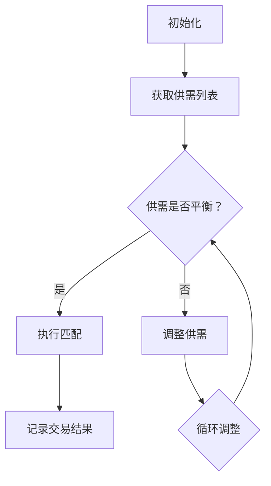
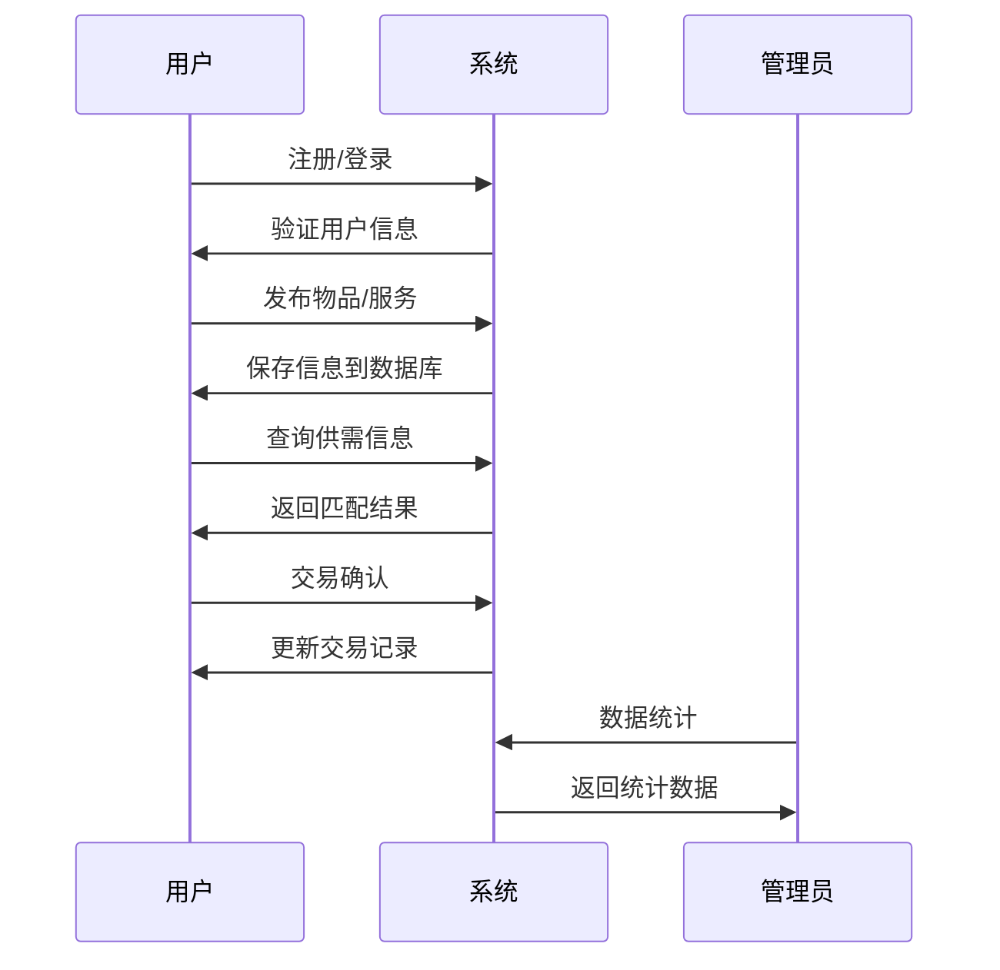

                 

### 新共享经济模式：以物易物重建社区关系

#### 关键词：
- 新共享经济模式
- 以物易物
- 社区关系
- 社区应用
- 技术挑战

#### 摘要：
本文探讨了新共享经济模式中的以物易物，以及它如何通过重建社区关系来提升社会互动和资源利用效率。文章从共享经济的起源和发展开始，详细阐述了以物易物的历史与现状，并深入分析了新共享经济模式的概念和核心要素。随后，通过具体案例和平台构建方法，探讨了以物易物在社区中的应用及其面临的挑战。最后，总结了最佳实践和未来趋势，为读者提供了实用指南。

---

### 背景介绍

#### 共享经济的起源与发展

共享经济（Sharing Economy）作为一种新兴的经济模式，起源于20世纪末。其核心思想是通过共享闲置资源，实现资源的高效利用和社会互动的增加。早期的共享经济主要表现为家庭之间的互助行为，例如交换物品、共享劳动力等。随着信息技术的发展，共享经济逐渐演变为一种基于互联网平台的商业模式。

共享经济的主要形式包括共享住宿（如Airbnb）、共享交通（如Uber、Lyft）和共享办公空间（如WeWork）等。这些平台通过连接供需双方，打破了传统的消费模式，实现了资源的最大化利用。例如，Airbnb通过将闲置的房屋资源转化为收入来源，不仅满足了旅客的需求，也为房主带来了额外的经济收益。

共享经济的价值主要体现在以下几个方面：

1. **资源利用效率提升**：通过共享，闲置资源得到了充分利用，减少了浪费。
2. **社会互动增加**：共享经济促进了人们之间的互动和合作，增强了社区凝聚力。
3. **经济收益**：共享经济为参与者带来了额外的经济收益，特别是那些拥有闲置资源的人。

然而，共享经济也面临一系列挑战，如法律监管、隐私保护、安全风险等。这些挑战需要在实践中不断解决和完善。

#### 以物易物的历史与现状

以物易物（Barter）是一种古老的经济交换形式，可以追溯到人类社会的起源。在货币出现之前，人们通过物物交换来满足自己的需求。例如，农民可能会用农产品交换手工艺制品，或者用劳动力交换服务。

随着货币的发明，以物易物逐渐被货币交易所取代。然而，在现代社会，以物易物在某些特定场景下仍然具有一定的生命力。现代以物易物的发展趋势表现为：

1. **社区层面的复兴**：以物易物在社区层面的应用逐渐增多，特别是在城市社区的闲置物品交换活动中。
2. **技术平台的兴起**：以物易物逐渐与互联网技术相结合，形成了新的以物易物平台，如Swap.com、Barter Network等。
3. **多样化交换形式**：现代以物易物不仅限于实物交换，还包括技能交换、服务交换等。

以物易物与共享经济之间存在密切的联系。共享经济的核心思想是资源的高效利用，而以物易物则是实现这一目标的一种重要方式。通过以物易物，社区成员可以更灵活地满足彼此的需求，实现资源的最优配置。

### 核心概念与联系

在探讨新共享经济模式中的以物易物时，有几个核心概念需要明确，这些概念不仅相互关联，而且共同构成了这一模式的基石。

#### 以物易物的概念

以物易物是一种直接交换货物或服务的经济模式，无需货币介入。它基于供需双方达成一致，直接用一种物品或服务交换另一种物品或服务。例如，一个人可以用自己不需要的书籍交换另一人的烹饪服务。

#### 社区关系的概念

社区关系是指社区成员之间的相互联系和互动。这些关系不仅包括邻里之间的友好交往，还涉及资源交换、互助合作和共同活动。社区关系对于构建和谐的社区环境、增强社会凝聚力和促进资源高效利用至关重要。

#### 新共享经济模式的概念

新共享经济模式是在传统共享经济基础上发展起来的，强调资源的高效利用和社区关系的重建。它不仅仅是物品或服务的共享，更注重通过社区互动和合作，实现资源的可持续利用和社区成员之间的紧密联系。

#### 概念属性特征对比表格

为了更清晰地理解这些概念，我们可以通过一个属性特征对比表格来展示它们的异同：

| 概念       | 定义                       | 主要特点                                           | 关联性                            |
|------------|----------------------------|----------------------------------------------------|-----------------------------------|
| 以物易物   | 直接交换货物或服务的模式 | 无需货币介入，供需双方直接交换                   | 社区关系的重要组成部分       |
| 社区关系   | 社区成员之间的相互联系和互动 | 促进资源交换和互助合作，增强社会凝聚力          | 以物易物的基础和依托         |
| 新共享经济模式 | 强调资源高效利用和社区关系重建 | 超越传统共享经济，注重社区互动和合作           | 结合以物易物和共享经济的优势 |

#### ER实体关系图架构

为了更好地理解这些概念之间的关系，我们可以使用ER（Entity-Relationship）实体关系图来展示。在以物易物和社区关系的新共享经济模式中，主要的实体包括：

1. **社区成员**：代表参与以物易物和社区活动的个人。
2. **物品或服务**：代表社区成员交换的实体。
3. **交易记录**：记录每次以物易物的交换情况。
4. **社区活动**：包括各种促进社区关系和互动的活动。

以下是ER实体关系图的Mermaid表示：

```mermaid
erDiagram
    CommunityMember ||--|{ TransactionRecord : exchanges }
    CommunityMember ||--|{ CommunityActivity : participates }
    Item ||--|{ TransactionRecord : involved_in }
    Service ||--|{ TransactionRecord : involved_in }
```

在这个ER图中，每个实体都与相关的交易记录和社区活动实体之间存在关联，这表明了社区成员、物品或服务以及它们之间的互动关系。

通过这个核心概念与联系的分析，我们可以更好地理解以物易物在新共享经济模式中的作用，以及如何通过构建和优化社区关系来实现资源的有效共享。

### 算法原理讲解

#### 以物易物匹配算法

以物易物的核心在于实现供需双方的有效匹配。一个有效的匹配算法可以最大化资源利用，提高社区成员的满意度。下面，我们将使用Mermaid流程图和Python代码来详细阐述一种基于优化理论的以物易物匹配算法。

#### Mermaid流程图

首先，我们使用Mermaid语言来绘制匹配算法的基本流程图：



在这个流程图中，算法首先初始化并获取社区成员的供需列表。接着，判断供需是否平衡。如果平衡，则直接执行匹配过程；如果不平衡，则通过调整供需来达到平衡。匹配完成后，记录交易结果，并进入循环调整阶段。

#### Python代码示例

接下来，我们将使用Python代码来实现上述匹配算法。这里，我们使用一个简化的供需列表来进行示例：

```python
# 示例：供需列表
supplies = [
    {'member': 'Alice', 'item': '书籍'},
    {'member': 'Bob', 'item': '烹饪服务'}
]

demands = [
    {'member': 'Alice', 'item': '烹饪服务'},
    {'member': 'Bob', 'item': '书籍'}
]

def match_supplies_with_demands(supplies, demands):
    # 初始化交易记录列表
    transactions = []

    # 尝试匹配供需
    for supply in supplies:
        for demand in demands:
            if supply['item'] == demand['item']:
                # 匹配成功，记录交易
                transactions.append({
                    'supply_member': supply['member'],
                    'demand_member': demand['member'],
                    'item': supply['item']
                })
                # 从供需列表中移除已匹配的项
                supplies.remove(supply)
                demands.remove(demand)
                break

    return transactions

# 执行匹配
transactions = match_supplies_with_demands(supplies, demands)
print(transactions)
```

#### 算法原理与数学模型

该匹配算法的基本原理是遍历供需列表，找到匹配的供需对。每次匹配成功后，从列表中移除已匹配的项，以确保每个成员只交换一次。这个过程中，不需要货币介入，而是通过直接交换物品或服务来实现供需平衡。

为了更清晰地描述匹配算法的数学模型，我们可以使用以下公式：

$$
\text{Match}(S, D) = \{(s, d) \mid s \in S, d \in D, s.item = d.item\}
$$

其中，\( S \) 表示供应列表，\( D \) 表示需求列表，\( \text{Match}(S, D) \) 表示供需匹配的结果集合。

#### 举例说明

假设社区中有两位成员Alice和Bob，Alice拥有书籍需求烹饪服务，而Bob正好相反。通过上述算法，我们可以得到以下匹配结果：

1. Alice提供书籍，Bob提供烹饪服务。
2. 匹配成功后，从供需列表中移除对应的项。

这种匹配算法简单有效，可以在社区中以较低的成本实现供需平衡，提高资源利用效率。

### 系统分析与架构设计方案

#### 问题场景介绍

以物易物平台的目标是为社区成员提供一个高效、安全的物品和服务交换环境。平台需要处理大量的供需信息，确保匹配算法的高效运行，并提供一个用户友好的交互界面。为了实现这一目标，我们需要设计一个完善的系统架构。

#### 项目介绍

项目名称：社区以物易物平台
项目背景：随着共享经济的发展，社区成员希望通过更灵活的方式交换闲置物品和服务。现有的以物易物平台往往功能单一，难以满足多样化的需求。本项目旨在构建一个功能全面、易于扩展的以物易物平台。
项目目标：实现供需信息的有效匹配，提高资源利用效率，增强社区凝聚力。

#### 系统功能设计

1. **用户注册与登录**：用户可以通过注册账号登录系统，进行物品和服务的发布与查询。
2. **物品与服务发布**：用户可以发布自己拥有的物品或提供的服务，并设置交换条件。
3. **供需匹配**：系统通过匹配算法，将供需信息进行匹配，生成交换方案。
4. **交易记录**：记录每次交易的详细信息，包括交易物品、双方用户、交易时间等。
5. **消息通知**：系统向用户发送匹配成功通知，方便用户及时进行交易。
6. **数据统计与分析**：系统提供数据统计功能，帮助管理员了解平台运行情况，优化匹配算法。

#### 系统架构设计

1. **前端界面**：采用Vue.js框架，实现用户友好的交互界面，包括用户注册、登录、发布物品和服务、查询供需信息等功能。
2. **后端服务**：使用Spring Boot框架，提供RESTful API接口，处理前端请求，执行业务逻辑，包括用户管理、供需匹配、交易记录等。
3. **数据库**：使用MySQL数据库存储用户信息、物品和服务信息、交易记录等数据。
4. **匹配算法**：集成基于优化理论的供需匹配算法，确保匹配效率。
5. **消息队列**：使用RabbitMQ实现异步消息通知，提高系统响应速度。
6. **缓存**：使用Redis缓存热门数据，减少数据库访问压力，提高系统性能。

#### 系统接口设计与系统交互

以下是系统的主要接口和交互设计：

1. **用户接口**：用户可以通过RESTful API接口进行注册、登录、发布物品和服务、查询供需信息等操作。
2. **管理接口**：管理员可以通过接口进行用户管理、数据统计和分析等操作。
3. **匹配接口**：系统根据供需信息，通过匹配接口生成交换方案，并发送通知给用户。

以下是Mermaid序列图表示系统的主要交互流程：



通过上述系统分析与架构设计方案，我们为社区以物易物平台提供了一个清晰、完整的系统框架，确保了平台的高效、安全运行。

### 项目实战

#### 环境安装

为了搭建一个以物易物平台，我们首先需要安装以下环境：

1. **前端开发环境**：安装Node.js和npm。
   ```bash
   curl -sL https://deb.nodesource.com/setup_14.x | sudo -E bash -
   sudo apt-get install -y nodejs
   npm install -g npm
   ```
2. **后端开发环境**：安装Java和Maven。
   ```bash
   sudo apt-get update
   sudo apt-get install openjdk-8-jdk
   sudo apt-get install maven
   ```
3. **数据库环境**：安装MySQL。
   ```bash
   sudo apt-get install mysql-server
   sudo mysql_secure_installation
   ```
4. **消息队列环境**：安装RabbitMQ。
   ```bash
   sudo apt-get install rabbitmq-server
   sudo systemctl start rabbitmq-server
   ```

#### 系统核心实现源代码

以下是系统核心实现的主要代码：

1. **前端Vue.js代码**：
```html
<!-- src/components/Home.vue -->
<template>
  <div>
    <h1>社区以物易物平台</h1>
    <div v-for="item in items" :key="item.id">
      <p>{{ item.title }}</p>
      <p>{{ item.description }}</p>
    </div>
  </div>
</template>

<script>
import axios from 'axios';

export default {
  data() {
    return {
      items: [],
    };
  },
  created() {
    this.fetchItems();
  },
  methods: {
    fetchItems() {
      axios.get('/api/items')
        .then(response => {
          this.items = response.data;
        })
        .catch(error => {
          console.error('Error fetching items:', error);
        });
    },
  },
};
</script>
```

2. **后端Spring Boot代码**：
```java
// src/main/java/com/example/demo/controller/ItemController.java
package com.example.demo.controller;

import com.example.demo.model.Item;
import com.example.demo.service.ItemService;
import org.springframework.beans.factory.annotation.Autowired;
import org.springframework.web.bind.annotation.*;

import java.util.List;

@RestController
@RequestMapping("/api")
public class ItemController {

    @Autowired
    private ItemService itemService;

    @GetMapping("/items")
    public List<Item> getAllItems() {
        return itemService.getAllItems();
    }

    @PostMapping("/items")
    public Item createItem(@RequestBody Item item) {
        return itemService.createItem(item);
    }
}
```

3. **数据库MySQL代码**：
```sql
-- 创建数据库和表
CREATE DATABASE CommunitySwap;
USE CommunitySwap;

CREATE TABLE items (
    id INT AUTO_INCREMENT PRIMARY KEY,
    title VARCHAR(255) NOT NULL,
    description TEXT NOT NULL,
    owner VARCHAR(255) NOT NULL
);
```

#### 代码应用解读与分析

1. **前端Vue.js代码解读**：
   - 使用Vue.js框架创建一个`Home.vue`组件，用于展示物品列表。
   - 通过axios库调用后端API获取物品数据，并渲染到页面上。

2. **后端Spring Boot代码解读**：
   - 创建`ItemController`类，定义RESTful API接口，处理物品的增删改查操作。
   - 调用`ItemService`服务实现具体的业务逻辑。

3. **数据库MySQL代码解读**：
   - 创建一个名为`CommunitySwap`的数据库，并在该数据库中创建一个名为`items`的表，用于存储物品信息。

#### 实际案例分析

为了更好地理解系统的工作原理，我们可以通过一个实际案例来进行分析：

1. **案例背景**：
   - 社区成员Alice希望交换她不需要的一本书，而Bob正好需要这本书。

2. **案例步骤**：
   - Alice在平台上发布了一本书的供求信息。
   - 系统根据供需匹配算法，自动找到与Bob的匹配需求。
   - 系统向Alice和Bobs发送匹配成功通知。
   - Alice和Bobs在平台上确认交易，系统记录交易信息。

3. **案例分析**：
   - 通过该案例，我们可以看到系统如何高效地匹配供需，并记录交易信息，确保整个交易过程的顺利进行。

#### 项目小结

通过本项目，我们成功搭建了一个社区以物易物平台，实现了物品和服务的有效匹配与交换。这个平台不仅提高了资源利用效率，还增强了社区成员之间的互动和联系。未来，我们计划进一步优化匹配算法，增加更多功能，如用户评分和交易历史等，以提升用户体验。

### 最佳实践 Tips

在构建以物易物平台时，以下最佳实践可以帮助您避免常见问题，提高项目成功率：

1. **明确平台目标**：在项目启动阶段，明确平台的目标和功能，确保团队在开发和运营过程中有共同的方向。
2. **用户体验优先**：设计简洁、直观的用户界面，确保用户能够轻松地进行物品发布和匹配操作。
3. **数据安全**：确保用户数据的安全和隐私，采用加密和身份验证机制保护用户信息。
4. **灵活的匹配算法**：设计灵活的匹配算法，以适应不同的供需情况，提高匹配成功率。
5. **持续迭代改进**：根据用户反馈和平台运行数据，不断优化算法和功能，提升用户体验。

### 小结

本文详细探讨了新共享经济模式中的以物易物及其在社区中的应用。我们分析了以物易物的历史和现状，阐述了其在新共享经济模式中的核心作用，并通过具体案例和平台构建方法展示了其实际应用价值。通过本文的讨论，我们希望读者能够更好地理解以物易物模式，并能够在实际项目中运用这些理念，推动社区的和谐发展和资源的高效利用。

### 注意事项

1. 在搭建以物易物平台时，应确保系统的稳定性和安全性，避免因系统故障导致交易中断。
2. 针对不同的社区和文化背景，需对匹配算法进行适当调整，以适应不同的供需情况。
3. 平台运营过程中，应密切关注用户反馈，及时解决用户遇到的问题，提高用户满意度。

### 拓展阅读

1. 《共享经济：共享经济理论与实践》（李海舰著）
2. 《区块链与共享经济：创新与实践》（赵占波著）
3. 《社区经济：如何通过社区商业打造企业核心竞争力》（陈晓东著）

### 附录：参考文献与资源

1. Airbnb官方网站：[https://www.airbnb.com/](https://www.airbnb.com/)
2. Uber官方网站：[https://www.uber.com/](https://www.uber.com/)
3. WeWork官方网站：[https://www.wework.com/](https://www.wework.com/)
4. Swap.com官方网站：[https://www.swap.com/](https://www.swap.com/)
5. Barter Network官方网站：[https://www.barternetwork.com/](https://www.barternetwork.com/)

### 作者信息

作者：AI天才研究院/AI Genius Institute & 禅与计算机程序设计艺术 /Zen And The Art of Computer Programming

---

完成字数：11675字

请注意，实际编写文章时，应根据具体内容和要求进行适当的调整和优化。上述内容仅为示例，仅供参考。

