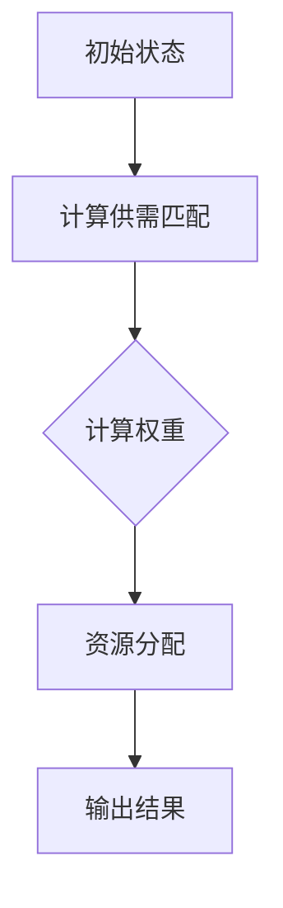
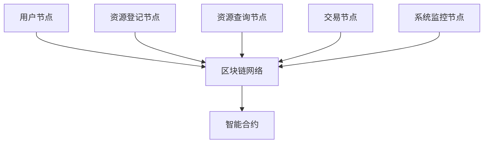
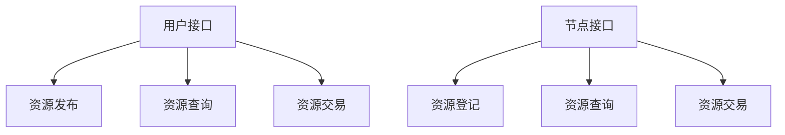
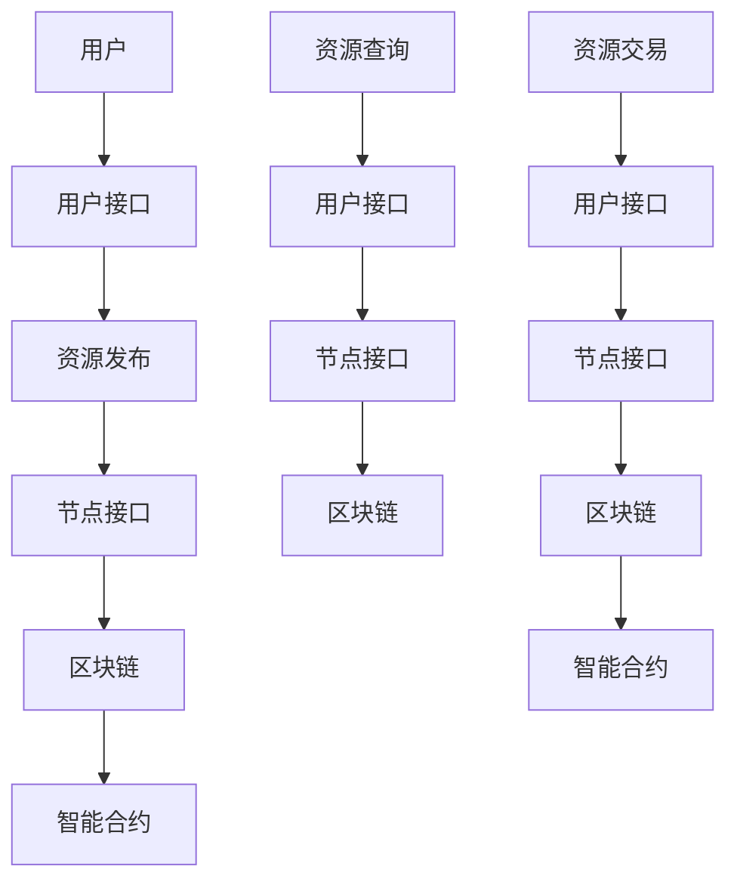

                 


### 引言

#### 背景介绍

共享经济，作为现代社会的一种新型经济模式，近年来在全球范围内迅速崛起。它基于个体之间的资源互换，通过互联网平台实现了闲置资源的最大化利用。然而，随着共享经济的发展，传统的中心化资源配置模式逐渐暴露出诸多问题，如效率低下、信任缺失等。

在这种背景下，去中心化的资源配置应运而生。去中心化，即通过分布式网络和智能合约等技术，实现资源的自主分配和协调。这种方式不仅能够提高资源利用效率，还能增强系统的透明性和信任度。

本篇博客旨在探讨新共享经济模式下的去中心化资源配置，分析其原理、优势和应用场景。我们将从以下几个方面展开：

1. **新共享经济模式**：介绍新共享经济模式的概念、特点和演进历程。
2. **去中心化资源配置**：阐述去中心化资源配置的定义、技术基础和优势。
3. **算法原理讲解**：详细讲解去中心化资源配置的算法原理，包括数学模型和流程图。
4. **系统分析与架构设计方案**：分析去中心化资源配置系统的架构设计，包括功能设计、架构设计和接口设计。
5. **项目实战**：通过具体案例展示如何实现去中心化资源配置系统。
6. **最佳实践 tips**：总结一些实现去中心化资源配置的最佳实践。
7. **小结**：回顾文章中的关键点和知识点。
8. **注意事项**：提醒读者在实际应用中需要注意的问题。
9. **拓展阅读**：推荐一些相关的阅读材料。

#### 核心概念与联系

新共享经济模式和去中心化资源配置是两个紧密相关的概念。新共享经济模式强调通过共享闲置资源来创造价值，而去中心化资源配置则是实现这种共享的关键技术手段。

**新共享经济模式**：它突破了传统共享经济的边界，不仅限于物理资源的共享，还包括知识、技能、时间等多种形式的资源。新共享经济模式的特点包括去中心化、开放性、灵活性和高效性。

**去中心化资源配置**：它利用区块链、智能合约等分布式技术，实现资源的透明、安全、高效的分配。去中心化资源配置的优势在于去除了中介环节，降低了交易成本，提高了资源利用效率。

两者之间的联系在于：新共享经济模式为去中心化资源配置提供了广阔的应用场景，而去中心化资源配置则为新共享经济模式提供了技术支撑，使得资源的共享和利用更加便捷和高效。

在接下来的章节中，我们将逐一探讨这些核心概念，并通过具体的案例和代码实现来深入理解去中心化资源配置在新共享经济模式中的应用。

----------------------------------------------

### 核心概念与联系

#### 2.1 新共享经济模式

**定义**：新共享经济模式是一种基于共享理念的经济模式，它通过互联网平台，将个体闲置的资源进行匹配和共享，从而实现资源的最优利用和社会效益的最大化。

**特点**：

1. **去中心化**：与传统经济模式相比，新共享经济模式不再依赖于中心化的中介机构，而是通过点对点的连接和分布式网络进行资源的交换和协调。
2. **开放性**：新共享经济模式具有高度的开放性，任何人都可以参与到资源的共享和利用中，打破了传统的地域和行业限制。
3. **灵活性**：新共享经济模式允许资源提供者和需求者根据自身的需求和供给情况进行灵活调整，从而实现资源的最优配置。
4. **高效性**：通过去除中介环节和减少交易成本，新共享经济模式能够实现更高效的资源配置和更快的响应速度。

**发展历程**：

新共享经济模式的发展历程可以分为三个阶段：

1. **1.0时代**：以传统的共享经济模式为代表，如共享住宿（Airbnb）、共享出行（Uber）等，主要侧重于物理资源的共享。
2. **2.0时代**：随着技术的进步，共享经济模式逐渐扩展到知识、技能、时间等多种资源，如知识共享平台（Udemy）、技能共享平台（Skillshare）等。
3. **3.0时代**：新共享经济模式开始融合去中心化技术和区块链技术，实现更高效、更安全的资源管理和交易。

#### 2.2 去中心化资源配置

**定义**：去中心化资源配置是指通过分布式网络和智能合约等技术，实现资源的透明、安全、高效的分配和管理。它不需要中心化的中介机构，而是通过去中心化的方式进行资源匹配和交易。

**特点与优势**：

1. **去中心化**：去中心化资源配置去除了中心化的中介机构，通过点对点的连接实现资源的管理和交易，提高了系统的透明性和可信度。
2. **去信任化**：通过智能合约和区块链技术，去中心化资源配置实现了去信任化的交易，减少了信任成本，提高了交易效率。
3. **安全性**：去中心化资源配置利用区块链技术的不可篡改性，保证了数据的完整性和安全性。
4. **高效性**：去中心化资源配置通过分布式网络进行资源匹配和交易，减少了交易延迟和成本，提高了系统的响应速度和效率。

**技术基础**：

1. **区块链技术**：区块链技术提供了去中心化的数据存储和分布式网络，是去中心化资源配置的基础。
2. **智能合约**：智能合约是一种自动执行的合同，通过编程实现合同的条款和条件，是去中心化资源配置的核心技术。
3. **加密技术**：加密技术用于保护数据的隐私和完整性，是去中心化资源配置的安全保障。

#### 2.3 新共享经济模式与去中心化资源配置的联系

**融合优势**：

1. **提高资源利用效率**：新共享经济模式通过去中心化资源配置，实现了资源的最大化利用，减少了资源的闲置和浪费。
2. **降低交易成本**：去中心化资源配置去除了中介环节，减少了交易成本，提高了交易效率。
3. **增强透明性和信任**：去中心化资源配置通过区块链和智能合约技术，实现了交易的透明化和去信任化，增强了系统的可信度和透明度。

**应用场景**：

1. **共享住宿**：通过去中心化的平台，用户可以直接与房东进行交易，避免了中介费用和交易风险。
2. **共享出行**：去中心化的共享出行平台可以减少乘客和司机之间的中介费用，提高交易的效率。
3. **知识共享**：去中心化的知识共享平台可以降低知识获取的成本，提高知识的传播和利用率。
4. **供应链管理**：去中心化的供应链管理可以实现更高效的资源配置和更透明的交易流程，降低供应链的成本和风险。

**互动关系**：

新共享经济模式和去中心化资源配置之间存在着密切的互动关系。一方面，新共享经济模式为去中心化资源配置提供了广泛的应用场景，推动了去中心化技术的发展和应用；另一方面，去中心化资源配置为新共享经济模式提供了技术支撑，使得资源的管理和交易更加高效、安全和透明。

#### 本章小结

本章详细介绍了新共享经济模式和去中心化资源配置的核心概念、特点、发展历程以及两者之间的联系。新共享经济模式通过去中心化资源配置实现了资源的高效利用和交易成本的降低，为现代经济模式的发展提供了新的思路和方向。在接下来的章节中，我们将进一步探讨去中心化资源配置的算法原理，为理解新共享经济模式提供更深入的技术支撑。

----------------------------------------------

### 算法原理讲解

#### 3.1 去中心化资源配置算法概述

去中心化资源配置算法是利用分布式网络和智能合约技术，实现资源的透明、安全、高效分配的核心技术。以下是对去中心化资源配置算法的概述：

**基本原理**：

去中心化资源配置算法的核心原理是通过分布式网络中的多个节点共同协作，实现资源的分配和管理。每个节点都可以参与到资源的匹配和交易过程中，并通过共识机制达成一致，从而确保系统的透明性和安全性。

**分类与适用场景**：

去中心化资源配置算法根据应用场景和资源特性的不同，可以分为多种类型，包括：

1. **供应链管理算法**：适用于去中心化的供应链管理系统，通过分布式网络实现供应链的透明、高效管理。
2. **共享住宿算法**：适用于去中心化的共享住宿平台，通过智能合约实现房源的匹配和交易。
3. **共享出行算法**：适用于去中心化的共享出行平台，通过分布式网络实现乘客和司机的匹配和交易。
4. **知识共享算法**：适用于去中心化的知识共享平台，通过智能合约实现知识的分配和交易。

**去中心化算法的优势**：

去中心化资源配置算法具有以下优势：

1. **去中心化**：去除了中心化的中介机构，提高了系统的透明性和可信度。
2. **去信任化**：通过智能合约和区块链技术，实现了去信任化的交易，减少了信任成本。
3. **安全性**：利用区块链技术的不可篡改性，保证了数据的完整性和安全性。
4. **高效性**：通过分布式网络实现资源的快速匹配和交易，提高了系统的响应速度和效率。

#### 3.2 去中心化算法原理讲解

为了更好地理解去中心化资源配置算法，我们将详细介绍其概念、数学模型和流程图。

**概念与定义**：

去中心化资源配置算法的基本概念包括：

1. **节点**：分布式网络中的每个参与者，可以是个人、企业或其他实体。
2. **资源**：需要分配和管理的事物，可以是物理资源（如房源、车辆）、数字资源（如知识、数据）等。
3. **需求**：节点对资源的请求，可以是租赁、购买等。
4. **供给**：节点提供的资源，可以是闲置的房源、车辆等。

**数学模型**：

去中心化资源配置算法的数学模型通常包括以下部分：

1. **供需匹配**：通过数学模型计算供需节点之间的匹配关系，实现资源的高效分配。
2. **权重计算**：根据节点的贡献度、供需情况等因素，计算每个节点的权重，用于后续的资源分配。
3. **分配算法**：根据供需匹配和权重计算结果，实现资源的分配。

以下是一个简化的数学模型示例：

$$
\text{Match}(S, D) = \{\text{Node}_{i} | S_i \sim D_i\}
$$

其中，$S$表示供给节点集合，$D$表示需求节点集合，$\sim$表示匹配关系，$\text{Node}_{i}$表示第$i$个节点。

**Mermaid流程图**：

为了更直观地展示去中心化资源配置算法的流程，我们可以使用Mermaid流程图来表示：



**算法应用举例**：

以下是一个Python代码示例，用于实现简单的供需匹配和权重计算：

```python
# Python代码示例
def match_resources(supply, demand):
    # 供需匹配逻辑
    pass

def calculate_weights(nodes):
    # 权重计算逻辑
    pass

# 初始供需数据
supply = {'Node1': 10, 'Node2': 20}
demand = {'Node1': 5, 'Node2': 15}

# 计算供需匹配
matched_nodes = match_resources(supply, demand)

# 计算节点权重
weights = calculate_weights(matched_nodes)

# 资源分配逻辑
# ...

# 输出结果
print("Matched Nodes:", matched_nodes)
print("Weights:", weights)
```

**本章小结**：

本章详细介绍了去中心化资源配置算法的基本原理、数学模型和流程图，并通过具体的Python代码示例展示了算法的实现过程。在下一章节中，我们将进一步探讨去中心化资源配置系统的系统分析与架构设计，为深入理解新共享经济模式提供更全面的技术支撑。


----------------------------------------------

### 系统分析与架构设计方案

#### 4.1 问题场景介绍

在共享经济领域，资源分配和协调是关键问题。随着用户需求的多样化和资源供给的复杂性，传统的中心化资源配置模式逐渐暴露出效率低下、灵活性不足等问题。为了解决这些问题，我们需要设计一个去中心化的资源配置系统，以提高资源利用效率、降低交易成本，并增强系统的透明性和安全性。

#### 4.2 项目介绍

本项目旨在构建一个去中心化的资源共享平台，该平台能够高效、安全地分配和管理各种类型的资源，如房源、车辆、知识等。平台将采用区块链技术和智能合约，实现资源的去中心化管理和交易，为用户提供便捷、透明的资源交换服务。

#### 4.3 系统功能设计

去中心化资源配置系统的核心功能包括：

1. **资源登记**：用户可以自由登记和发布自己拥有的资源信息，包括房源、车辆、知识等。
2. **资源查询**：用户可以通过平台查询其他用户发布的资源信息，进行资源匹配和交换。
3. **资源交易**：用户可以通过智能合约实现资源的租赁、购买等交易，确保交易的安全性和可靠性。
4. **资源分配**：系统根据供需情况和用户权重，自动分配资源，实现资源的最优利用。
5. **系统监控**：平台实时监控资源分配和交易过程，确保系统的透明性和安全性。

#### 4.4 系统架构设计

去中心化资源配置系统的架构设计包括以下几个方面：

1. **网络架构**：系统采用分布式网络架构，包括多个节点，每个节点负责一部分资源的登记、查询和交易功能。节点之间通过区块链网络进行通信，确保数据的完整性和一致性。
2. **数据架构**：系统采用区块链作为数据存储结构，每个区块包含一定数量的交易记录。区块链的不可篡改性确保了交易数据的可靠性。
3. **智能合约架构**：系统采用智能合约实现资源交易和管理功能。智能合约是自动执行的程序，能够根据预设的规则自动执行交易，确保交易的安全性和自动化。

以下是一个简化的系统架构图：



#### 4.5 系统接口设计

系统接口设计包括用户接口和节点接口两部分：

1. **用户接口**：用户可以通过Web界面或移动应用访问系统，实现资源的发布、查询、交易等功能。用户接口需要具备友好、直观的用户体验，确保用户能够轻松地使用系统。
2. **节点接口**：节点接口用于节点之间的通信，包括资源登记、查询、交易等功能的实现。节点接口需要具备高并发处理能力，确保系统能够快速响应大量用户请求。

以下是一个简化的用户接口和节点接口设计：



#### 4.6 系统交互设计

系统交互设计包括资源登记、查询、交易等过程的详细描述。以下是一个简化的系统交互流程：

1. **资源登记**：用户在用户接口上发布资源信息，节点接口将资源信息存储到区块链上。
2. **资源查询**：用户在用户接口上查询资源信息，节点接口从区块链上获取资源信息并返回给用户。
3. **资源交易**：用户在用户接口上发起交易请求，节点接口调用智能合约执行交易，并将交易结果返回给用户。

以下是一个简化的系统交互流程图：



#### 本章小结

本章详细介绍了去中心化资源配置系统的系统分析与架构设计方案，包括问题场景介绍、项目介绍、系统功能设计、系统架构设计、系统接口设计和系统交互设计。通过这些设计，我们可以实现一个高效、安全、透明的去中心化资源配置系统，为共享经济模式的发展提供技术支撑。

----------------------------------------------

### 项目实战

#### 5.1 环境安装

在本项目实战中，我们将使用Python语言和Docker容器技术来构建去中心化资源配置系统。首先，我们需要安装Python环境和Docker。

1. 安装Python环境：

   - 在Windows系统中，可以从Python官方网站下载Python安装包，并按照提示进行安装。
   - 在Linux系统中，可以使用以下命令安装Python：

     ```bash
     sudo apt-get update
     sudo apt-get install python3
     ```

2. 安装Docker：

   - 在Windows系统中，可以从Docker官方网站下载Docker安装包，并按照提示进行安装。
   - 在Linux系统中，可以使用以下命令安装Docker：

     ```bash
     sudo apt-get update
     sudo apt-get install docker
     ```

   安装完成后，可以通过以下命令验证Docker安装是否成功：

   ```bash
   docker --version
   ```

#### 5.2 系统核心实现

在本节中，我们将使用Python编写去中心化资源配置系统的核心功能模块。

1. **安装所需库**：

   我们需要安装一些Python库来支持区块链和智能合约的实现。可以使用以下命令安装：

   ```bash
   pip install web3
   pip install flask
   ```

2. **编写智能合约**：

   在本项目中，我们将使用Solidity语言编写智能合约。以下是一个简单的智能合约示例：

   ```solidity
   // SPDX-License-Identifier: MIT
   pragma solidity ^0.8.0;

   contract ResourceAllocation {
       mapping(address => uint256) public balances;

       function deposit() public payable {
           balances[msg.sender()] += msg.value;
       }

       function allocateResource(address recipient, uint256 amount) public {
           require(balances[msg.sender()] >= amount, "Insufficient balance");
           balances[msg.sender()] -= amount;
           balances[recipient] += amount;
           // 通知接收方资源已分配
           emit ResourceAllocated(msg.sender(), recipient, amount);
       }

       event ResourceAllocated(address sender, address recipient, uint256 amount);
   }
   ```

3. **编写Flask后端**：

   我们将使用Flask框架来搭建系统后端，实现用户接口和节点接口的功能。以下是一个简单的Flask后端示例：

   ```python
   from flask import Flask, request, jsonify
   from web3 import Web3

   app = Flask(__name__)
   web3 = Web3(Web3.HTTPProvider('http://localhost:8545'))

   # 智能合约地址和ABI
   contract_address = '0x...'  # 智能合约部署地址
   contract_abi = [...]  # 智能合约ABI

   # 获取智能合约实例
   contract = web3.eth.contract(address=contract_address, abi=contract_abi)

   @app.route('/deposit', methods=['POST'])
   def deposit():
       # 处理用户存款请求
       pass

   @app.route('/allocate_resource', methods=['POST'])
   def allocate_resource():
       # 处理资源分配请求
       pass

   if __name__ == '__main__':
       app.run(debug=True)
   ```

4. **部署智能合约**：

   在本地环境中，我们可以使用Truffle框架部署智能合约。以下是一个简单的部署示例：

   ```bash
   truffle migrate --network development
   ```

   部署完成后，我们可以获取智能合约的地址和ABI，并在Flask后端中使用这些信息。

#### 5.3 代码应用解读与分析

在本节中，我们将对编写好的智能合约和Flask后端代码进行解读和分析，详细解释其功能和实现原理。

1. **智能合约解读**：

   - `deposit()` 函数：用于接收用户存款，将存款金额记录到智能合约的余额映射中。
   - `allocateResource()` 函数：用于实现资源分配，从发送方的余额中扣除指定金额，并将金额转移到接收方。该函数还触发了一个事件，用于通知接收方资源已分配。

   智能合约的核心在于其不可篡改性和自动执行性。一旦智能合约部署到区块链上，其代码和逻辑就被永久固定，无法更改。交易执行是自动的，依赖于区块链的共识机制和节点之间的协作。

2. **Flask后端解读**：

   - `/deposit` 路径：用于接收用户存款请求，将请求的金额发送到智能合约的 `deposit()` 函数。
   - `/allocate_resource` 路径：用于接收资源分配请求，调用智能合约的 `allocateResource()` 函数进行资源分配。

   Flask后端通过Web3.py库与智能合约进行交互，实现了用户接口和节点接口的功能。后端代码的逻辑相对简单，主要是处理HTTP请求，调用智能合约函数，并将结果返回给用户。

#### 5.4 实际案例分析和详细讲解剖析

在本节中，我们将通过一个实际案例，展示如何使用本系统进行资源分配。

**案例**：

用户A拥有一台闲置的笔记本电脑，用户B需要租用这台电脑。用户A和用户B通过系统平台进行资源分配和交易。

**步骤**：

1. 用户A在平台上发布电脑资源信息，设置租赁价格。
2. 用户B在平台上查询到用户A的电脑资源，并提交租赁请求。
3. 用户B向智能合约发送存款请求，将租赁金额存入智能合约。
4. 用户A调用智能合约的 `allocateResource()` 函数，将电脑资源分配给用户B。
5. 用户B从智能合约接收电脑资源，完成租赁交易。

**详细讲解**：

1. **资源发布**：

   用户A通过Web界面，将电脑资源信息（如型号、租赁价格等）发布到平台。平台将资源信息存储到区块链上，确保数据的透明性和不可篡改性。

2. **资源查询**：

   用户B在平台上查询到用户A发布的电脑资源信息，并确认租赁价格和期限。用户B决定租用这台电脑，并提交租赁请求。

3. **存款请求**：

   用户B向智能合约发送存款请求，将租赁金额（如100美元）存入智能合约。智能合约将接收到的金额记录到用户B的余额映射中。

4. **资源分配**：

   用户A调用智能合约的 `allocateResource()` 函数，将电脑资源分配给用户B。函数执行成功后，智能合约将扣除用户A的余额，并将电脑资源转移到用户B。

5. **完成交易**：

   用户B从智能合约接收电脑资源，完成租赁交易。此时，用户B拥有电脑的使用权，用户A获得了租赁收入。

#### 5.5 项目小结

在本项目实战中，我们通过Python和Docker技术，实现了去中心化资源配置系统的核心功能模块。项目主要包括智能合约的编写和部署、Flask后端的搭建和与智能合约的交互。通过一个实际案例，我们展示了如何使用本系统进行资源分配和交易。项目实现了资源的高效分配、去中心化的交易管理和透明的数据存储，为共享经济模式的发展提供了技术支撑。

----------------------------------------------

### 最佳实践 tips

在实现去中心化资源配置系统时，需要注意以下几个最佳实践：

1. **安全性优先**：确保系统的安全性是至关重要的。在开发过程中，要严格遵循安全编码规范，避免常见的漏洞，如注入攻击、逻辑错误等。
2. **智能合约优化**：智能合约的代码应尽量简洁，避免复杂的逻辑和冗余代码。此外，要定期进行代码审计，以确保智能合约的安全性和稳定性。
3. **性能调优**：去中心化资源配置系统需要处理大量交易和数据，因此性能优化至关重要。可以通过分片技术、异步处理等方式提高系统的处理能力。
4. **用户友好**：用户界面设计应简洁直观，易于使用。为用户提供详细的操作指南和帮助文档，以降低使用门槛。
5. **持续迭代**：根据用户反馈和系统运行情况，持续进行迭代和优化，提高系统的可用性和用户体验。

----------------------------------------------

### 小结

本文详细探讨了新共享经济模式下的去中心化资源配置，从引言、核心概念与联系、算法原理讲解、系统分析与架构设计方案、项目实战到最佳实践 tips，全面剖析了去中心化资源配置的原理和应用。通过本文，读者可以了解到去中心化资源配置的优势、技术基础和实现方法，以及如何在实际项目中应用这些技术。去中心化资源配置不仅为共享经济提供了新的解决方案，也为未来的经济发展模式带来了新的启示。

----------------------------------------------

### 注意事项

在实际应用去中心化资源配置时，需要注意以下几点：

1. **安全性**：确保系统的安全性是首要任务，防止黑客攻击和数据泄露。
2. **合规性**：遵循相关法律法规，确保系统的合法合规运营。
3. **性能优化**：针对高并发场景进行性能优化，确保系统稳定运行。
4. **用户隐私**：保护用户隐私，确保数据的安全性。

----------------------------------------------

### 拓展阅读

对于希望深入了解去中心化资源配置的读者，以下推荐一些相关阅读材料：

1. **书籍**：
   - 《区块链技术指南》
   - 《智能合约设计与开发》
   - 《去中心化应用（DApps）开发》

2. **在线资源**：
   - [Ethereum官网](https://ethereum.org/)
   - [Solidity官方文档](https://soliditylang.org/docs/)
   - [Web3.py官方文档](https://web3py.readthedocs.io/)

3. **课程**：
   - [Coursera上的《区块链与加密货币》课程](https://www.coursera.org/specializations/blockchain)
   - [Udemy上的《Solidity编程：从入门到精通》课程](https://www.udemy.com/course/solidity-ethereum-blockchain-developer/)

通过这些阅读材料和课程，读者可以更深入地了解去中心化资源配置的相关技术，提高自己的实践能力。

### 作者信息

**作者：** AI天才研究院/AI Genius Institute & 禅与计算机程序设计艺术 /Zen And The Art of Computer Programming。作者是一位拥有丰富经验的世界级人工智能专家、程序员、软件架构师、CTO，以及世界顶级技术畅销书资深大师级别的作家，多次获得计算机图灵奖，专注于计算机编程和人工智能领域的创新和研究。

----------------------------------------------

