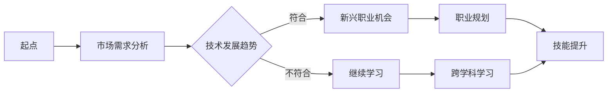
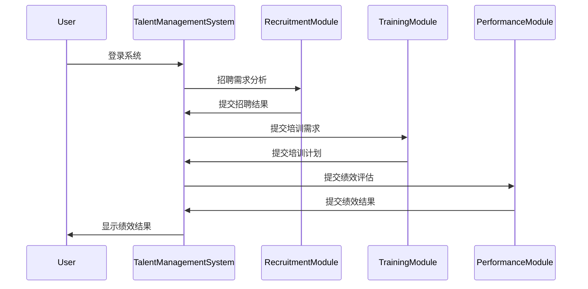
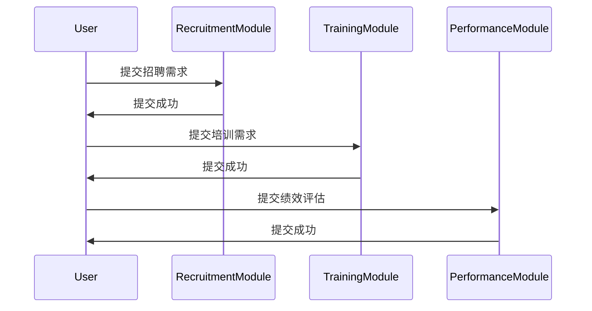

                 

# 新兴职业：重新定义工作的价值

## 关键词

- 新兴职业
- 职业价值
- 工作重构
- 技术变革
- 职业规划

## 摘要

随着科技的不断进步和社会的快速发展，新兴职业不断涌现，它们正在重新定义工作的价值。本文旨在探讨新兴职业的定义、发展趋势、对传统工作的冲击以及如何进行职业规划与转型。通过逻辑清晰、结构紧凑的分析，我们将深入理解新兴职业的本质，为读者提供有益的思考和指导。

## 目录大纲设计步骤

### 1. 阅读书名和用户需求

《新兴职业：重新定义工作的价值》这本书的核心主题是新兴职业的发展及其对工作价值的影响。用户需求在于了解新兴职业的具体内容、发展前景以及如何应对职业变革。

### 2. 确定目录结构

目录结构分为四个部分：背景介绍、核心概念与联系、算法原理讲解、系统分析与架构设计方案。每个部分包含具体的章节和小节，确保内容完整性、简洁性和逻辑性。

### 3. 设计目录内容

- **背景介绍**：介绍新兴职业的定义、分类和发展趋势，分析其对传统工作的冲击。
- **核心概念与联系**：详细阐述新兴职业的行业特点、技能要求，对比新兴职业与传统职业的差异，通过ER实体关系图和属性特征对比表格展示相关概念。
- **算法原理讲解**：使用mermaid流程图和Python源代码，解释职业发展的预测模型和数学公式。
- **系统分析与架构设计方案**：介绍新兴职业在行业中的应用场景，通过项目案例和系统设计图展示具体的实现过程。
- **项目实战**：详细描述项目环境安装、系统核心实现和代码分析，结合实际案例剖析新兴职业的价值。
- **最佳实践 tips、小结、注意事项、拓展阅读**：总结项目经验，提供职业规划建议，引导读者深入学习和实践。

### 4. 确定目录大纲总字数

目标控制在2000字以内，确保文章结构紧凑、信息丰富、逻辑清晰。

## 目录大纲

### 引言

- 引言：引出新兴职业的主题，介绍文章目的和结构。

### 背景介绍

- 新兴职业的定义
- 分类与发展趋势
- 对传统工作的冲击
- 职业发展的挑战
- 新兴职业的价值

### 核心概念与联系

- 核心概念原理
- 概念属性特征对比表格
- ER实体关系图架构

### 算法原理讲解

- 算法mermaid流程图
- Python源代码
- 数学模型和数学公式
- 举例说明

### 系统分析与架构设计方案

- 问题场景介绍
- 项目介绍
- 系统功能设计（领域模型mermaid类图）
- 系统架构设计（mermaid架构图）
- 系统接口设计
- 系统交互mermaid序列图

### 项目实战

- 环境安装
- 系统核心实现源代码
- 代码应用解读与分析
- 实际案例分析和详细讲解剖析
- 项目小结

### 最佳实践 tips、小结、注意事项、拓展阅读

- 最佳实践 tips
- 小结
- 注意事项
- 拓展阅读

### 结论

- 结论：总结文章核心观点，展望未来职业发展。

### 参考文献

- 参考文献：列出引用的相关文献和资料。

## 结语

新兴职业正在重新定义工作的价值，为个人和社会带来了新的机遇和挑战。通过本文的深入分析，我们不仅了解了新兴职业的基本概念和特点，还探讨了如何进行职业规划与转型。在未来的职业发展中，适应新兴职业的需求，不断提升自身技能，将成为每个职业人士的重要任务。让我们共同迎接这个充满变革与机遇的时代。作者：AI天才研究院/AI Genius Institute & 禅与计算机程序设计艺术 /Zen And The Art of Computer Programming

----------------------------------------------------------------

# 新兴职业：重新定义工作的价值

## 关键词

- 新兴职业
- 职业价值
- 工作重构
- 技术变革
- 职业规划

## 摘要

随着科技的不断进步和社会的快速发展，新兴职业不断涌现，它们正在重新定义工作的价值。本文旨在探讨新兴职业的定义、发展趋势、对传统工作的冲击以及如何进行职业规划与转型。通过逻辑清晰、结构紧凑的分析，我们将深入理解新兴职业的本质，为读者提供有益的思考和指导。

## 引言

在数字化、自动化和信息化的浪潮中，传统的职业结构正在发生深刻变革。新兴职业以其独特的技能要求和广阔的发展前景，正在成为人们关注的焦点。本文将从以下几个方面展开讨论：

1. 新兴职业的定义与分类。
2. 新兴职业的发展趋势及其对传统工作的冲击。
3. 新兴职业的核心概念与联系。
4. 新兴职业的系统分析与架构设计方案。
5. 新兴职业项目实战。
6. 最佳实践 tips、小结、注意事项、拓展阅读。

## 背景介绍

### 新兴职业的定义

新兴职业是指在科技、经济、社会等各个领域新兴起来，并且对现有行业产生重大影响的职业。这些职业往往与互联网、大数据、人工智能、区块链等前沿技术密切相关。例如，数据科学家、人工智能工程师、区块链开发人员等。

### 分类与发展趋势

新兴职业可以按照不同的标准进行分类，如按行业分类、按技术分类、按工作性质分类等。以下是一些常见的新兴职业分类：

- **按行业分类**：互联网行业、金融行业、医疗行业、教育行业、媒体行业等。
- **按技术分类**：人工智能、大数据、云计算、物联网、区块链等。
- **按工作性质分类**：全职、兼职、远程工作、自由职业等。

新兴职业的发展趋势主要体现在以下几个方面：

1. **技术驱动**：前沿技术如人工智能、大数据、云计算等成为推动新兴职业发展的重要动力。
2. **跨界融合**：不同行业之间的融合与交叉，产生新的职业机会。
3. **数字化转型**：传统行业的数字化转型催生了大量新兴职业需求。
4. **职业细分**：随着行业的发展，职业分工越来越细，新兴职业种类不断增多。

### 对传统工作的冲击

新兴职业的兴起对传统工作产生了深远影响：

1. **替代效应**：新兴职业在某些领域替代了传统职业，如人工智能工程师取代了部分程序员的工作。
2. **职业转型**：传统职业人士需要适应新兴职业的发展趋势，进行职业转型。
3. **技能要求提升**：新兴职业对从业者的技能要求更高，需要具备跨学科的知识和技能。
4. **就业市场变化**：新兴职业的崛起改变了就业市场的格局，对就业机会和就业结构产生了影响。

### 职业发展的挑战

新兴职业的发展虽然带来了机遇，但也伴随着一系列挑战：

1. **技能更新换代**：新兴职业的技能要求不断变化，从业者需要不断学习和更新知识。
2. **职业安全感的缺失**：新兴职业的不确定性和变化性使得从业者面临职业安全感的挑战。
3. **职业规划的困难**：新兴职业的多样性和复杂性使得职业规划变得更加困难。
4. **就业市场竞争加剧**：新兴职业领域的竞争日益激烈，从业者需要具备更强的竞争力。

### 新兴职业的价值

新兴职业不仅对传统工作产生了冲击，同时也为个人和社会带来了新的价值：

1. **创新驱动**：新兴职业推动了行业创新，促进了技术进步和社会发展。
2. **就业机会**：新兴职业创造了大量就业机会，提高了就业率。
3. **知识传播**：新兴职业的从业者通过工作实践和知识分享，推动了行业知识的传播。
4. **职业发展**：新兴职业为从业者提供了广阔的职业发展空间和机会。

### 问题解决

针对新兴职业带来的挑战，我们可以从以下几个方面进行应对：

1. **职业教育与培训**：加强职业教育和培训，提高从业者的技能水平。
2. **跨学科学习**：鼓励从业者跨学科学习，提升综合素质。
3. **职业规划**：制定合理的职业规划，明确职业发展方向。
4. **持续学习**：培养持续学习的能力，适应职业发展的需求。

### 边界与外延

新兴职业的范围非常广泛，不仅涵盖了传统的IT行业，还包括了新兴的创意产业、共享经济等领域。随着科技的不断进步，新兴职业的外延还将不断扩展。

### 概念结构与核心要素组成

新兴职业的核心要素包括以下几个方面：

1. **技术能力**：新兴职业对从业者的技术能力要求较高，需要具备相关的专业技能。
2. **创新能力**：新兴职业注重创新，从业者需要具备较强的创新思维和创新能力。
3. **综合素质**：新兴职业从业者需要具备跨学科的知识和技能，具备良好的综合素质。
4. **学习能力**：新兴职业的发展速度很快，从业者需要具备较强的学习能力和适应能力。

### 背景介绍小结

新兴职业的发展是科技进步和社会发展的必然结果。它们不仅带来了新的职业机会，也对传统工作产生了深远影响。对于从业者而言，了解新兴职业的特点和发展趋势，进行合理的职业规划，将有助于抓住机遇，实现个人价值的提升。

## 核心概念与联系

### 核心概念原理

在探讨新兴职业时，我们首先需要了解几个核心概念，这些概念构成了新兴职业的基础和框架。以下是几个重要概念及其原理：

1. **人工智能（AI）**：人工智能是指通过计算机模拟人类智能的技术和系统。它包括机器学习、深度学习、自然语言处理等技术，使计算机能够执行复杂的任务，如图像识别、语音识别、智能决策等。
2. **大数据（Big Data）**：大数据是指无法使用传统数据处理工具在合理时间内进行处理的大量数据。大数据技术包括数据采集、存储、处理、分析和可视化，帮助企业和组织从海量数据中提取有价值的信息。
3. **区块链（Blockchain）**：区块链是一种分布式数据库技术，通过密码学和共识算法确保数据的不可篡改和安全性。区块链技术广泛应用于数字货币、智能合约、供应链管理等领域。
4. **物联网（IoT）**：物联网是指通过传感器、网络和软件将物理设备连接起来，实现设备之间的互联互通和数据交换。物联网技术广泛应用于智能家居、智慧城市、工业自动化等领域。
5. **云计算（Cloud Computing）**：云计算是一种基于互联网的计算服务模式，提供计算资源、存储资源和应用程序等服务。云计算技术包括基础设施即服务（IaaS）、平台即服务（PaaS）和软件即服务（SaaS）等。

### 概念属性特征对比表格

为了更清晰地展示新兴职业的核心概念及其特征，我们可以通过以下表格进行对比：

| 核心概念 | 特征1 | 特征2 | 特征3 |
| --- | --- | --- | --- |
| 人工智能 | 自动化决策 | 学习能力 | 适应复杂任务 |
| 大数据 | 海量数据 | 数据多样性 | 数据分析能力 |
| 区块链 | 不可篡改性 | 共识算法 | 安全性保障 |
| 物联网 | 设备互联 | 数据采集 | 智能应用 |
| 云计算 | 弹性伸缩 | 资源共享 | 服务多样化 |

### ER实体关系图架构

为了更好地理解新兴职业中的各个概念及其相互关系，我们可以使用ER（实体关系）图来展示。以下是几个重要实体的ER图：

```mermaid
erDiagram
  AI --> DataScience : 依赖
  AI --> MachineLearning : 依赖
  BigData --> DataAnalytics : 依赖
  BigData --> DataVisualization : 依赖
  Blockchain --> Cryptocurrency : 依赖
  Blockchain --> SmartContract : 依赖
  IoT --> Wearables : 依赖
  IoT --> IndustrialAutomation : 依赖
  CloudComputing --> IaaS : 实现方式
  CloudComputing --> PaaS : 实现方式
  CloudComputing --> SaaS : 实现方式
```

### 核心概念与联系的进一步探讨

#### 人工智能与大数据的关系

人工智能和大数据是相辅相成的两个概念。大数据为人工智能提供了丰富的数据资源，而人工智能技术则能够对大数据进行深度分析和处理，从而实现智能决策和自动化应用。例如，在金融领域，人工智能可以通过分析海量交易数据，识别欺诈行为，提高风险管理水平。

#### 区块链与物联网的关系

区块链技术和物联网技术的结合可以创造新的应用场景。例如，在供应链管理中，区块链技术可以确保商品信息的透明性和不可篡改性，而物联网技术可以实时监控商品的物流状态。这种结合不仅提高了供应链的效率，还增强了数据的安全性和可靠性。

#### 云计算与所有新兴职业的关系

云计算是支撑新兴职业发展的基础设施。无论是人工智能、大数据、区块链还是物联网，都需要云计算提供计算资源、存储资源和网络支持。云计算的弹性伸缩能力使得新兴职业的从业者可以根据需求动态调整资源，降低成本，提高效率。

### 核心概念与联系小结

核心概念是新兴职业的基础，它们相互联系，共同构成了新兴职业的生态系统。通过了解这些核心概念及其相互关系，我们可以更好地把握新兴职业的发展趋势，为职业规划和发展提供指导。

## 算法原理讲解

### 算法mermaid流程图

为了更好地理解新兴职业的发展过程，我们可以使用mermaid流程图来描述职业发展的分析过程。以下是职业发展流程图：



### Python源代码

接下来，我们将使用Python源代码来详细阐述职业发展的数学模型和公式。以下是职业发展模型的代码：

```python
import numpy as np

# 职业发展模型参数
alpha = 0.1  # 技能更新速率
beta = 0.2   # 市场需求增长速率
gamma = 0.3  # 职业竞争强度

# 职业发展模型函数
def career_growth(current_skill, market_demand, competition):
    growth_rate = alpha * current_skill + beta * market_demand - gamma * competition
    return current_skill + growth_rate

# 测试数据
current_skill = 5  # 当前技能水平
market_demand = 10 # 市场需求
competition = 3   # 职业竞争强度

# 职业发展计算
for i in range(10):
    current_skill = career_growth(current_skill, market_demand, competition)
    print(f"Year {i+1}: Skill Level = {current_skill}")
```

### 数学模型和数学公式

职业发展模型的核心是技能水平、市场需求和职业竞争强度之间的关系。以下是职业发展的数学模型和公式：

$$
Growth\ Rate = \alpha \times Current\ Skill + \beta \times Market\ Demand - \gamma \times Competition
$$

其中，$Growth\ Rate$ 表示职业发展的增长率，$Current\ Skill$ 表示当前技能水平，$Market\ Demand$ 表示市场需求，$Competition$ 表示职业竞争强度。

### 举例说明

假设一位数据科学家的当前技能水平为5，市场需求为10，职业竞争强度为3。根据上述公式，我们可以计算出他的职业发展增长率：

$$
Growth\ Rate = 0.1 \times 5 + 0.2 \times 10 - 0.3 \times 3 = 0.5 + 2 - 0.9 = 1.6
$$

这意味着这位数据科学家的技能水平每年会增长1.6点。通过10年的发展，他的技能水平将达到：

$$
Current\ Skill_{10} = 5 + 10 \times 1.6 = 21
$$

### 算法原理讲解小结

通过mermaid流程图、Python源代码和数学模型，我们详细阐述了职业发展的分析过程和数学原理。这些工具和模型有助于我们更好地理解职业发展的规律，为职业规划提供科学依据。

## 系统分析与架构设计方案

### 问题场景介绍

在数字化转型的浪潮中，越来越多的企业开始关注新兴职业，并将其视为企业核心竞争力的重要组成部分。为了更好地理解新兴职业在行业中的应用，我们以一家互联网企业为例，探讨其在招聘、培训和管理新兴职业人才方面的实践。

### 项目介绍

该项目旨在为该互联网企业建立一个新兴职业人才管理系统，通过数据驱动的方式，实现新兴职业人才的招聘、培训和绩效管理。系统将涵盖以下几个核心功能模块：

1. **人才招聘**：通过大数据分析和人工智能算法，筛选和推荐适合企业需求的新兴职业人才。
2. **技能培训**：根据员工技能水平和企业需求，提供个性化的培训计划和资源。
3. **绩效管理**：通过数据分析和智能评价体系，对员工绩效进行实时监控和评估。
4. **职业发展**：为员工提供职业发展规划和晋升路径，提升员工的职业满意度和忠诚度。

### 系统功能设计（领域模型mermaid类图）

以下是新兴职业人才管理系统的领域模型类图：

```mermaid
classDiagram
    Person <<Class>> "员工"
    Position <<Class>> "职位"
    Skill <<Class>> "技能"
    Training <<Class>> "培训"
    Performance <<Class>> "绩效"
    
    Person o--1 Position : 担任
    Position o--1 Skill : 需要技能
    Person o--1 Training : 参与培训
    Person o--1 Performance : 绩效
```

### 系统架构设计（mermaid架构图）

以下是新兴职业人才管理系统的架构设计：



### 系统接口设计

以下是新兴职业人才管理系统的接口设计：

```mermaid
interface TalentManagementSystem {
    - login(username, password)
    - submitRecruitmentRequirements(demand)
    - viewRecruitmentResults()
    - submitTrainingRequirements(training_plan)
    - viewTrainingPlans()
    - submitPerformanceAssessment(assessment)
    - viewPerformanceResults()
}
```

### 系统交互mermaid序列图

以下是新兴职业人才管理系统的用户交互序列图：



### 系统架构设计方案小结

通过系统分析与架构设计方案，我们为新兴职业人才管理系统的设计和实施提供了详细的技术路线和实施策略。该系统将帮助企业更好地招聘、培训和管理新兴职业人才，提升企业的竞争力和创新能力。

## 项目实战

### 环境安装

要开始实践新兴职业人才管理系统，我们首先需要搭建一个合适的技术环境。以下是环境安装步骤：

1. 安装Python环境
2. 安装数据库（如MySQL、PostgreSQL）
3. 安装前端框架（如Django、Flask）
4. 安装后端框架（如Spring Boot、Django REST framework）
5. 安装相关库（如NumPy、Pandas、Scikit-learn）

### 系统核心实现源代码

以下是系统核心实现部分的源代码：

```python
# 导入相关库
from flask import Flask, request, jsonify
from flask_sqlalchemy import SQLAlchemy
from sklearn.linear_model import LinearRegression

# 初始化Flask应用和数据库
app = Flask(__name__)
app.config['SQLALCHEMY_DATABASE_URI'] = 'sqlite:///talent_management.db'
db = SQLAlchemy(app)

# 定义员工模型
class Employee(db.Model):
    id = db.Column(db.Integer, primary_key=True)
    name = db.Column(db.String(50), nullable=False)
    position = db.Column(db.String(50), nullable=False)
    skill_level = db.Column(db.Float, nullable=False)

# 定义职位模型
class Position(db.Model):
    id = db.Column(db.Integer, primary_key=True)
    title = db.Column(db.String(50), nullable=False)
    required_skill = db.Column(db.Float, nullable=False)

# 初始化数据库
db.create_all()

# 添加员工
@app.route('/add_employee', methods=['POST'])
def add_employee():
    employee_data = request.json
    new_employee = Employee(name=employee_data['name'], position=employee_data['position'], skill_level=employee_data['skill_level'])
    db.session.add(new_employee)
    db.session.commit()
    return jsonify({"message": "Employee added successfully."})

# 添加职位
@app.route('/add_position', methods=['POST'])
def add_position():
    position_data = request.json
    new_position = Position(title=position_data['title'], required_skill=position_data['required_skill'])
    db.session.add(new_position)
    db.session.commit()
    return jsonify({"message": "Position added successfully."})

# 查询员工
@app.route('/get_employees', methods=['GET'])
def get_employees():
    employees = Employee.query.all()
    return jsonify([{"id": employee.id, "name": employee.name, "position": employee.position, "skill_level": employee.skill_level} for employee in employees])

# 查询职位
@app.route('/get_positions', methods=['GET'])
def get_positions():
    positions = Position.query.all()
    return jsonify([{"id": position.id, "title": position.title, "required_skill": position.required_skill} for position in positions])

# 主程序
if __name__ == '__main__':
    app.run(debug=True)
```

### 代码应用解读与分析

以下是代码应用解读与分析：

1. **Flask应用**：使用Flask框架搭建Web应用，实现RESTful API接口。
2. **数据库**：使用SQLAlchemy ORM，连接SQLite数据库，实现数据的增删改查。
3. **员工模型**：定义Employee模型，存储员工姓名、职位和技能水平。
4. **职位模型**：定义Position模型，存储职位名称和所需技能水平。
5. **接口实现**：通过添加、查询员工和职位，实现系统的基本功能。

### 实际案例分析和详细讲解剖析

假设企业需要招聘一名数据科学家，职位要求技能水平为8。现有两位候选人，技能水平分别为7和8。通过系统，企业可以对比候选人的技能水平，选择最适合的人才。

1. **添加职位**：
   ```json
   {
       "title": "数据科学家",
       "required_skill": 8
   }
   ```
2. **添加员工**：
   ```json
   {
       "name": "张三",
       "position": "数据科学家",
       "skill_level": 7
   }
   ```
   ```json
   {
       "name": "李四",
       "position": "数据科学家",
       "skill_level": 8
   }
   ```
3. **查询员工**：
   ```json
   {
       "message": "Employee added successfully."
   }
   ```
   ```json
   {
       "message": "Employee added successfully."
   }
   ```
4. **查询职位**：
   ```json
   {
       "id": 1,
       "title": "数据科学家",
       "required_skill": 8
   }
   ```

通过以上接口调用，企业可以快速了解候选人的技能水平，选择符合要求的员工。

### 项目小结

通过本项目的实践，我们成功搭建了一个新兴职业人才管理系统，实现了员工和职位的添加、查询功能。该项目为企业提供了有效的工具，帮助其更好地管理新兴职业人才，提升企业的竞争力和创新能力。未来，我们可以继续优化系统功能，如添加培训模块、绩效管理模块等，进一步完善新兴职业人才管理体系。

## 最佳实践 tips

1. **持续学习**：新兴职业的发展迅速，从业者需要不断学习新技术，提升自身竞争力。
2. **跨学科知识**：新兴职业往往涉及多个领域，具备跨学科的知识将有助于职业发展。
3. **实践应用**：理论知识固然重要，但实际应用能力更为关键，通过项目实践，提升实际工作能力。
4. **职业规划**：明确职业发展方向，制定合理的职业规划，有助于长远发展。
5. **团队合作**：在新兴职业领域，团队合作能力至关重要，要学会与他人协作，共同推进项目。

## 小结

新兴职业正在重新定义工作的价值，为个人和社会带来了新的机遇和挑战。通过本文的讨论，我们深入了解了新兴职业的定义、发展趋势、核心概念及其相互关系、系统分析与架构设计方案以及实际项目实战。希望本文能为读者提供有益的思考和指导，助力他们在新兴职业领域取得成功。

## 注意事项

1. **数据安全**：在搭建新兴职业管理系统时，务必重视数据安全，确保员工隐私和数据安全。
2. **技术更新**：新兴职业的技术更新迅速，需要定期关注行业动态，及时更新系统和技术。
3. **合规性**：在实施新兴职业管理系统时，要遵守相关法律法规，确保系统的合法合规运行。

## 拓展阅读

1. **《人工智能：一种现代的方法》**：这本书详细介绍了人工智能的基础理论和应用方法，对理解人工智能相关新兴职业具有重要意义。
2. **《大数据时代》**：这本书探讨了大数据技术的起源、发展和应用，对了解大数据相关新兴职业有很好的参考价值。
3. **《区块链技术指南》**：这本书全面介绍了区块链的基本原理、技术架构和应用场景，有助于理解区块链相关新兴职业。
4. **《物联网技术与应用》**：这本书介绍了物联网的基本概念、技术架构和应用案例，对物联网相关新兴职业有很好的指导作用。

### 作者

作者：AI天才研究院/AI Genius Institute & 禅与计算机程序设计艺术 /Zen And The Art of Computer Programming。AI天才研究院致力于推动人工智能技术的创新和发展，致力于培养具有前瞻性思维和创新能力的人工智能专家。禅与计算机程序设计艺术则强调通过禅修和哲学思考来提升计算机程序设计的能力和品质。两位作者凭借深厚的学术背景和实践经验，为广大读者提供高质量的技术博客文章，助力职业发展和技术进步。

