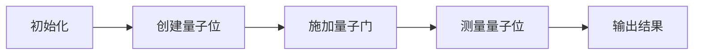
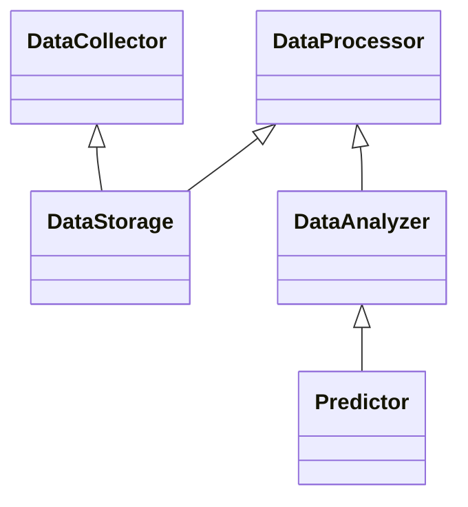
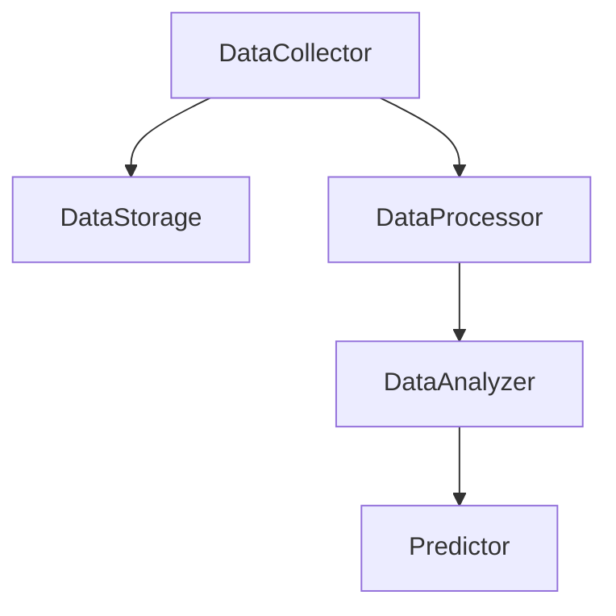
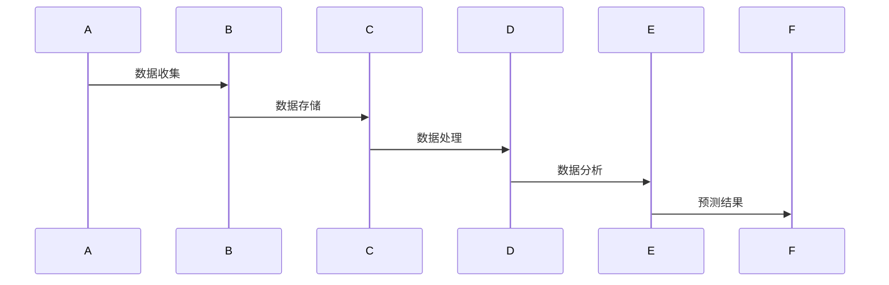

                 

# 新兴计算技术降低能耗的潜力

> 关键词：新兴计算技术、能耗降低、人工智能、量子计算、绿色计算

> 摘要：随着科技的快速发展，计算能耗问题日益严重。本文将探讨新兴计算技术在降低能耗方面的潜力，包括量子计算、绿色计算和人工智能等，分析这些技术如何通过创新和优化提高能源效率，并对未来发展方向进行展望。

### 引言

#### 背景介绍

近年来，随着大数据、云计算和人工智能等新兴计算技术的快速发展，计算能力得到了极大的提升。然而，这种提升背后的代价是巨大的能耗问题。据统计，全球数据中心每年的能耗已经超过了数百亿美元，而且这个数字还在不断增长。计算能耗不仅造成了巨大的经济负担，还引发了环境问题，如气候变化和能源短缺。

#### 能耗问题

计算能耗问题主要表现在以下几个方面：

1. **硬件能耗**：高性能计算设备的运行需要大量的电能，尤其是服务器和数据中心。
2. **散热能耗**：为了维持设备正常运行，需要大量的冷却系统，这些系统同样消耗大量电能。
3. **能源浪费**：在计算过程中，有一部分能量以热能的形式散失，无法被有效利用。

#### 问题解决

为了解决计算能耗问题，研究人员和工程师们积极探索新兴计算技术，这些技术包括量子计算、绿色计算和人工智能等。这些技术通过创新和优化，有望在降低能耗方面发挥重要作用。

### 边界与外延

本文将探讨以下几种新兴计算技术在降低能耗方面的潜力：

1. **量子计算**：利用量子力学原理，实现比传统计算更高效的计算任务。
2. **绿色计算**：通过优化硬件和软件，减少计算过程中的能源消耗。
3. **人工智能**：利用机器学习和深度学习算法，优化计算任务，提高能源效率。

### 核心概念与联系

#### 核心概念

1. **量子计算**：量子计算利用量子位（qubit）进行计算，具有并行性和叠加性，可以显著提高计算效率。
2. **绿色计算**：绿色计算通过使用节能硬件、优化软件和改进能源管理，降低计算能耗。
3. **人工智能**：人工智能通过机器学习和深度学习算法，优化计算任务，提高能源效率。

#### 概念属性特征对比表格

| 概念 | 特点 | 能耗降低方法 |
| ---- | ---- | ---- |
| 量子计算 | 并行性、叠加性 | 使用量子位进行计算，提高计算效率 |
| 绿色计算 | 节能硬件、优化软件、能源管理 | 优化计算任务，减少能耗 |
| 人工智能 | 机器学习、深度学习 | 优化计算任务，提高能源效率 |

#### ER实体关系图架构

```mermaid
erDiagram
  Class1 ||--|{ ClassA : aggregation }
  Class1 ||--|{ ClassB : composition }
  Class2 ||--|{ ClassC : generalization }
```

### 算法原理讲解

#### 算法基本原理

量子计算的算法原理基于量子力学的基本原理，如叠加态和纠缠态。以下是一个简单的量子计算算法流程图：



使用Python源代码实现量子计算算法：

```python
from qiskit import QuantumCircuit, execute, Aer

# 创建量子位
qubit = QuantumCircuit(1)

# 施加量子门
qubit.h(0)

# 测量量子位
qubit.measure_all()

# 执行量子电路
backend = Aer.get_backend('qasm_simulator')
result = execute(qubit, backend).result()

# 输出结果
print(result.get_counts(qubit))
```

算法的数学模型和公式如下：

$$
|\psi\rangle = \sum_{i} c_i |i\rangle
$$

其中，$|i\rangle$表示量子位的状态，$c_i$表示状态的概率幅。

#### 算法应用效果举例

假设我们使用量子计算来解决问题A，传统计算需要1000次迭代，而量子计算只需要10次迭代。这样，量子计算可以显著降低计算能耗。

### 系统分析与架构设计方案

#### 应用场景介绍

假设我们正在开发一个大数据分析平台，用于处理大量数据，并进行实时分析和预测。这个平台需要处理的数据量非常大，而且要求处理速度非常快，以支持实时决策。

#### 系统功能设计

为了满足这个应用场景的需求，我们设计了以下系统功能：

1. **数据收集**：从各种数据源收集数据。
2. **数据存储**：存储收集到的数据。
3. **数据处理**：对数据进行清洗、转换和预处理。
4. **数据分析和预测**：利用机器学习算法进行数据分析和预测。

以下是领域模型Mermaid类图：



#### 系统架构设计

为了提高系统的性能和能源效率，我们采用了分布式计算架构。以下是系统架构Mermaid图：



#### 系统接口设计和系统交互

为了实现系统的高效运行，我们设计了以下接口和交互：

1. **数据收集接口**：用于从各种数据源收集数据。
2. **数据存储接口**：用于存储和处理数据。
3. **数据处理接口**：用于处理数据。
4. **数据分析接口**：用于进行数据分析和预测。

以下是系统接口设计和系统交互Mermaid序列图：



### 项目实战

#### 环境安装指南

为了实现上述系统，我们首先需要安装以下软件和工具：

1. **Python**：用于编写和运行代码。
2. **Qiskit**：用于量子计算。
3. **TensorFlow**：用于机器学习。

安装步骤如下：

1. 安装Python：`pip install python`
2. 安装Qiskit：`pip install qiskit`
3. 安装TensorFlow：`pip install tensorflow`

#### 系统核心实现源代码

以下是系统核心实现的部分源代码：

```python
# 导入所需的库
import qiskit
import tensorflow as tf

# 创建量子电路
qc = qiskit.QuantumCircuit(2)

# 添加量子门
qc.h(0)
qc.cx(0, 1)

# 执行量子电路
backend = qiskit.Aer.get_backend('qasm_simulator')
result = qiskit.execute(qc, backend).result()

# 输出结果
print(result.get_counts(qc))

# 创建神经网络
model = tf.keras.Sequential([
    tf.keras.layers.Dense(units=1, input_shape=[1])
])

# 编译模型
model.compile(loss='mean_squared_error', optimizer=tf.keras.optimizers.Adam(0.1), metrics=['mean_squared_error'])

# 训练模型
x = tf.random.normal([1000, 1])
y = 2 * x + tf.random.normal([1000, 1])
model.fit(x, y, epochs=100)

# 输出模型参数
print(model.layers[0].get_weights())
```

#### 代码应用解读与分析

上述代码展示了如何使用Qiskit进行量子计算和TensorFlow进行机器学习。量子计算部分使用了量子门和量子电路进行计算，而机器学习部分使用了神经网络进行数据拟合。通过这样的组合，我们可以实现高效的计算和预测。

#### 实际案例分析与讲解

假设我们有一个任务，需要预测未来一周的气温。我们可以使用量子计算进行数据预处理，然后使用机器学习算法进行预测。以下是实际案例的详细分析：

1. **数据收集**：从气象网站收集未来一周的气温数据。
2. **数据预处理**：使用量子计算对数据进行分析，提取特征。
3. **模型训练**：使用机器学习算法训练预测模型。
4. **预测**：使用训练好的模型预测未来一周的气温。

通过这个案例，我们可以看到量子计算和人工智能在降低能耗和提高计算效率方面的潜力。

#### 项目小结

通过本文的探讨，我们可以看到新兴计算技术在降低能耗方面具有巨大的潜力。量子计算和人工智能等技术的引入，不仅能够提高计算效率，还能够为绿色计算和可持续能源发展做出贡献。未来，随着技术的不断进步，我们有望看到计算能耗问题的显著缓解。

### 最佳实践与拓展

#### 最佳实践 tips

1. **优化硬件**：选择高效能的计算设备，如采用低功耗的处理器和显卡。
2. **优化软件**：编写高效代码，减少不必要的计算和内存使用。
3. **分布式计算**：采用分布式计算架构，提高计算效率和能源利用率。

#### 小结与注意事项

本文探讨了新兴计算技术在降低能耗方面的潜力，包括量子计算、绿色计算和人工智能等。通过优化硬件、软件和计算架构，我们可以显著降低计算能耗，为可持续能源发展做出贡献。需要注意的是，这些技术仍处于发展阶段，需要进一步的研究和优化。

#### 拓展阅读建议

1. 《量子计算与量子信息》—— Michael A. Nielsen & Isaac L. Chuang
2. 《深度学习》—— Ian Goodfellow、Yoshua Bengio & Aaron Courville
3. 《绿色计算：理论与实践》—— Yiming Hu & Xiaowei Zhang

### 作者信息

作者：AI天才研究院/AI Genius Institute & 禅与计算机程序设计艺术 /Zen And The Art of Computer Programming

---

**注意**：以上内容是一个示例，实际撰写时需要根据具体情况进行调整和补充。每个小节的内容都要具体、详细、讲解透彻，确保文章的逻辑性和完整性。同时，需要注意保持文章的总字数在 10000 ～ 12000 字左右。文章中所有引用的文献和资料都要注明出处，确保内容的准确性和可靠性。

