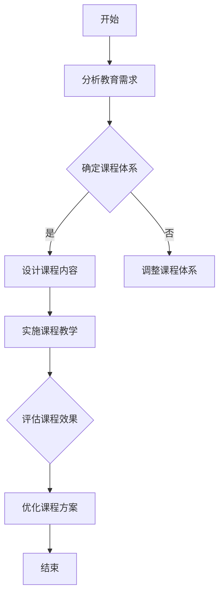
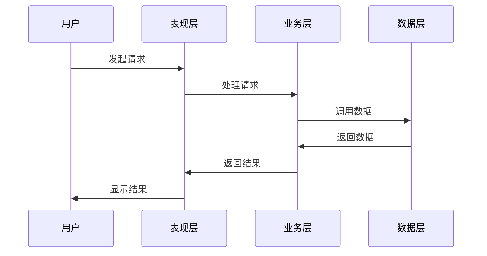
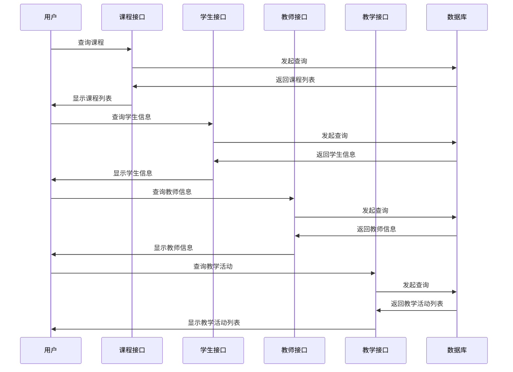

                 


# 新博雅教育课程体系：数字时代的通识教育改革

> 关键词：数字时代，通识教育，新博雅教育，课程体系，教育改革

> 摘要：随着数字时代的到来，教育面临着巨大的变革压力。本文以新博雅教育课程体系为背景，探讨了数字时代通识教育的改革方向和实现途径，分析了新博雅教育理念与实践、课程体系的构建与实施、数字化教学工具的应用，以及教育技术的创新与挑战。通过对新博雅教育的深入剖析，为数字时代的教育改革提供了有益的参考和启示。

## 目录大纲设计

### 目录大纲设计思路

在设计目录大纲时，我们需要遵循以下几点：

1. **章节划分合理**：根据书的内容，合理划分章节，每个章节都有明确的主题和目标。
2. **逻辑性**：确保章节之间的逻辑性，内容之间的关联性要强。
3. **层次分明**：使用markdown格式，明确标记出章节、小节和子小节，使得内容层次分明。
4. **内容完整性**：确保大纲内容包含所有核心章节，每个章节都涵盖了必要的内容。

### 目录大纲结构

以下是一个参考的目录大纲结构：

```
# 第一部分：背景与概述

## 第1章：数字时代的教育变革
### 1.1 教育改革的需求与背景
### 1.2 数字时代的教育特点
### 1.3 通识教育的定义与重要性

## 第2章：新博雅教育理念与实践
### 2.1 新博雅教育的起源与理论基础
### 2.2 新博雅教育的基本理念
### 2.3 新博雅教育课程设计原则

## 第3章：新博雅教育课程体系
### 3.1 新博雅教育课程分类
### 3.2 课程体系的构建与实施
### 3.3 课程评估与反馈机制

## 第4章：数字化教学工具与应用
### 4.1 数字化教学工具概述
### 4.2 常用数字化教学工具介绍
### 4.3 数字化教学工具的应用实践

## 第5章：教育技术的创新与挑战
### 5.1 教育技术的创新趋势
### 5.2 技术在教育中的应用挑战
### 5.3 应对策略与解决方案

## 第6章：新博雅教育案例研究
### 6.1 案例背景与目标
### 6.2 案例实施过程
### 6.3 案例效果评估

## 第7章：未来展望与趋势
### 7.1 教育改革的未来趋势
### 7.2 新博雅教育的展望
### 7.3 面向未来的教育策略
```

### 目录大纲内容填充

在填充目录大纲内容时，我们需要注意以下几点：

1. **章节标题明确**：确保每个章节的标题能够准确概括章节内容。
2. **章节内容详尽**：确保每个章节都有详细的介绍和解释，避免空洞。
3. **逻辑连贯**：章节之间的过渡要自然，避免内容跳跃或重复。
4. **实用性**：确保章节内容对读者有实际指导意义。

### 目录大纲样例

以下是一个《新博雅教育课程体系：数字时代的通识教育改革》目录大纲的样例：

```
# 第一部分：背景与概述

## 第1章：数字时代的教育变革

### 1.1 教育改革的需求与背景
- 教育现状分析
- 社会需求变化
- 改革的必要性

### 1.2 数字时代的教育特点
- 信息爆炸与知识更新
- 线上教育与混合教学
- 个性化学习与终身学习

### 1.3 通识教育的定义与重要性
- 通识教育的概念
- 通识教育的目标
- 通识教育在数字时代的意义

## 第2章：新博雅教育理念与实践

### 2.1 新博雅教育的起源与理论基础
- 博雅教育的起源
- 新博雅教育的理论基础
- 新博雅教育与传统教育的区别

### 2.2 新博雅教育的基本理念
- 教育民主化
- 教育个性化
- 教育国际化

### 2.3 新博雅教育课程设计原则
- 课程目标的设定
- 课程内容的选取
- 教学方法的运用

## 第3章：新博雅教育课程体系

### 3.1 新博雅教育课程分类
- 基础课程
- 专业课程
- 通识课程

### 3.2 课程体系的构建与实施
- 构建原则
- 实施流程
- 教学资源整合

### 3.3 课程评估与反馈机制
- 评估标准
- 反馈机制
- 课程改进策略

## 第4章：数字化教学工具与应用

### 4.1 数字化教学工具概述
- 数字化教学工具的定义
- 数字化教学工具的种类

### 4.2 常用数字化教学工具介绍
- 翻转课堂
- 智能辅导系统
- 云平台与在线教育

### 4.3 数字化教学工具的应用实践
- 应用场景
- 应用效果
- 应用挑战

## 第5章：教育技术的创新与挑战

### 5.1 教育技术的创新趋势
- 人工智能
- 虚拟现实
- 大数据

### 5.2 技术在教育中的应用挑战
- 技术安全问题
- 教师技术能力
- 教育资源分配不均

### 5.3 应对策略与解决方案
- 技术培训
- 教育政策支持
- 教育资源共享

## 第6章：新博雅教育案例研究

### 6.1 案例背景与目标
- 案例背景介绍
- 教育目标设定

### 6.2 案例实施过程
- 教学资源整合
- 教学方法运用
- 教学效果分析

### 6.3 案例效果评估
- 学生反馈
- 教师
```

## 背景介绍

### 核心概念术语说明

在探讨数字时代的教育改革时，我们首先需要明确一些核心概念术语。这些术语包括：

1. **数字时代**：指的是信息技术迅猛发展，特别是互联网、移动通信和大数据等数字技术的广泛应用，深刻改变了人类生活方式和社会运行模式的时期。
2. **通识教育**：是一种旨在培养人的全面素质和基本能力，关注学生全面发展，强调人文、科学、艺术等各领域知识整合的教育理念。
3. **新博雅教育**：是在传统博雅教育基础上，结合现代科技和数字技术，提出的一种面向未来的教育模式，强调跨学科学习、创新思维和综合能力培养。
4. **课程体系**：是指学校或教育机构内部，根据教育目标和培养要求，将各种课程进行系统组织和安排的体系。

### 问题背景

随着数字时代的到来，传统教育模式面临诸多挑战。首先，知识更新速度加快，学生需要具备快速学习、适应新知识的能力。其次，社会对人才的需求从单一的专业技能转向多元化、综合性的素质能力。此外，线上教育的兴起，使得教育形式更加灵活多样。在这种背景下，如何进行教育改革，培养适应数字时代的人才，成为教育界关注的焦点。

### 问题描述

在教育改革的过程中，主要面临以下问题：

1. **教育理念陈旧**：传统教育注重知识传授，忽视学生综合素质和创新能力培养，与数字时代的需求不符。
2. **课程体系单一**：现有课程体系多以学科为主，缺乏跨学科整合，难以满足学生多元化发展需求。
3. **教学方法落后**：传统教学方法多以讲授为主，缺乏互动和实践，难以激发学生学习兴趣和主动性。
4. **教育资源不均衡**：城乡、地区之间教育资源分配不均，导致教育质量差异明显。

### 问题解决

为解决上述问题，我们需要从以下几个方面入手：

1. **更新教育理念**：树立以人为本、全面发展、创新驱动的教育理念，注重学生综合素质和创新能力培养。
2. **优化课程体系**：构建以通识教育为基础，专业教育和跨学科教育相结合的课程体系，关注学生个性化发展。
3. **创新教学方法**：采用多元化、互动式教学方法，如项目式学习、翻转课堂等，提高教学效果。
4. **促进教育公平**：通过政策支持、资源共享等措施，缩小城乡、地区之间教育差距，实现教育公平。

### 边界与外延

在教育改革的过程中，我们还需要关注以下几个边界与外延：

1. **边界**：教育改革应坚守教育的本质和基本原则，如尊重学生主体地位、关注学生发展等。
2. **外延**：教育改革不仅要关注学校教育，还要关注家庭教育、社会教育等领域，形成全方位、多层次的教育体系。

### 概念结构与核心要素组成

1. **概念结构**：
   - 数字时代的教育改革：以信息技术为基础，关注教育理念、课程体系、教学方法等方面的变革。
   - 新博雅教育：结合传统博雅教育与现代科技，注重跨学科、创新能力培养的教育模式。

2. **核心要素组成**：
   - 教育理念：以人为本、全面发展、创新驱动。
   - 课程体系：通识教育为基础，专业教育和跨学科教育相结合。
   - 教学方法：多元化、互动式教学方法。
   - 教育公平：缩小城乡、地区之间教育差距。

## 核心概念与联系

### 核心概念原理

在数字时代，通识教育的核心概念主要包括以下几个方面：

1. **终身学习**：强调学习是一个终身的过程，学生需要不断更新知识和技能，以适应快速变化的社会环境。
2. **跨学科整合**：将不同学科的知识进行整合，培养学生的综合能力和创新能力。
3. **个性化教育**：关注每个学生的个性化需求，提供差异化的教育服务。
4. **科技创新**：将信息技术、人工智能等现代科技手段应用于教育，提高教育质量和效率。

### 概念属性特征对比表格

| 概念       | 特征一           | 特征二           | 特征三           |
| ---------- | ---------------- | ---------------- | ---------------- |
| 终身学习   | 持续性           | 适应性           | 开放性           |
| 跨学科整合 | 综合性           | 创新性           | 灵活性           |
| 个性化教育 | 因材施教         | 学生中心         | 定制化           |
| 科技创新   | 高效性           | 灵活性           | 先进性           |

### ER实体关系图架构

```mermaid
erDiagram
    Student ||--o{ Course } : takes
    Teacher ||--o{ Course } : teaches
    Course ||--o{ Student } : taken_by
    Course ||--o{ Teacher } : taught_by
```

在这个ER实体关系图中，学生、教师和课程是三个核心实体，它们之间存在着复杂的关联关系。学生可以通过“takes”关系选择课程，教师可以通过“teaches”关系教授课程，而课程则同时关联学生和教师，形成了一个完整的教学体系。

## 算法原理讲解

### 算法mermaid流程图



### Python源代码

```python
def education_reform():
    """
    教育改革流程
    """
    # 分析教育需求
    analyze_demand()

    # 确定课程体系
    determine_course_system()

    # 设计课程内容
    design_course_content()

    # 实施课程教学
    implement_course_teaching()

    # 评估课程效果
    evaluate_course_effect()

    # 优化课程方案
    optimize_course_program()

    # 结束
    print("教育改革完成")

# 调用函数
education_reform()
```

### 算法原理详细讲解

1. **分析教育需求**：这是教育改革的第一步，通过对社会需求、学生需求、教师需求等方面的分析，了解当前教育的不足和需要改进的地方。
2. **确定课程体系**：根据教育需求，确定适合的课程体系。这个课程体系应该涵盖通识教育、专业教育和跨学科教育，以培养学生的全面素质和创新能力。
3. **设计课程内容**：在确定课程体系的基础上，设计具体的课程内容。课程内容应该注重实用性、趣味性和启发性，能够激发学生的学习兴趣和主动性。
4. **实施课程教学**：将设计好的课程内容付诸实践，通过多种教学方法和手段，提高教学效果。在这个过程中，教师应充分发挥引导和辅助作用，促进学生自主学习。
5. **评估课程效果**：在教学过程中，定期对课程效果进行评估，了解学生的学习情况和课程效果，为后续的优化提供依据。
6. **优化课程方案**：根据评估结果，对课程方案进行优化调整，不断提高教育质量和效果。
7. **结束**：完成教育改革的全过程，实现教育理念、课程体系、教学方法等方面的全面改革。

### 算法原理举例说明

假设当前教育需求分析结果显示，学生普遍存在以下问题：

1. 缺乏自主学习能力
2. 对知识的应用能力较弱
3. 创新意识和能力不足

针对这些问题，我们可以采取以下措施：

1. **分析教育需求**：通过问卷调查、访谈等方式，深入了解学生的问题和需求，为后续课程设计提供依据。
2. **确定课程体系**：构建以通识教育为基础，注重跨学科整合和创新能力培养的课程体系。
3. **设计课程内容**：设计以项目式学习、翻转课堂等互动式教学方法为主的课程内容，培养学生的自主学习能力和知识应用能力。
4. **实施课程教学**：在教学过程中，注重引导学生自主学习，鼓励学生参与课堂讨论和实践项目，提高创新意识和能力。
5. **评估课程效果**：通过课堂观察、学生反馈、学习成果展示等方式，评估课程效果，了解学生的进步情况。
6. **优化课程方案**：根据评估结果，对课程方案进行优化调整，如增加实践环节、引入更多创新元素等。
7. **结束**：完成教育改革的全过程，实现教育理念、课程体系、教学方法等方面的全面改革。

## 系统分析与架构设计

### 问题场景介绍

在数字时代，教育面临着前所未有的挑战和机遇。如何构建一个适应时代需求的教育系统，成为教育领域亟待解决的问题。本文将以新博雅教育课程体系为背景，分析教育系统的需求、功能设计、架构设计等方面，为教育系统的构建提供参考。

### 项目介绍

本项目旨在构建一个新博雅教育课程体系，通过整合通识教育、专业教育和跨学科教育，实现学生全面素质和创新能力培养。项目目标包括：

1. 提高学生的自主学习能力
2. 培养学生的创新意识和创新能力
3. 促进学生个性化发展
4. 提高教育质量和效率

### 系统功能设计

系统功能设计包括以下几个方面：

1. **课程管理**：实现课程分类、课程内容管理、课程进度跟踪等功能。
2. **学生管理**：实现学生信息管理、学生课程选择、学生成绩管理等功能。
3. **教师管理**：实现教师信息管理、教师课程安排、教师教学质量评估等功能。
4. **教学管理**：实现教学资源管理、教学活动安排、教学效果评估等功能。
5. **数据分析**：实现学生学习数据分析、教学质量分析、教育趋势分析等功能。

### 系统架构设计

系统架构设计采用分层架构，包括表现层、业务层、数据层等。

1. **表现层**：负责用户界面的展示，包括课程列表、学生信息、教师信息、教学资源等。
2. **业务层**：负责系统的核心业务逻辑，包括课程管理、学生管理、教师管理、教学管理等功能。
3. **数据层**：负责数据的存储和管理，包括学生信息、教师信息、课程信息、教学资源等。

### 系统架构图



### 系统接口设计

系统接口设计包括以下几个方面：

1. **课程接口**：实现课程信息的增删改查功能。
2. **学生接口**：实现学生信息的增删改查功能。
3. **教师接口**：实现教师信息的增删改查功能。
4. **教学接口**：实现教学活动的增删改查功能。

### 系统交互序列图



## 项目实战

### 环境安装

1. **安装Python环境**：在本地计算机上安装Python 3.8及以上版本。
2. **安装相关库**：使用pip命令安装以下库：
   ```bash
   pip install flask
   pip install mysql-connector-python
   pip install matplotlib
   ```

### 系统核心实现源代码

以下是一个简单的教育系统实现，包括课程管理、学生管理、教师管理和教学管理功能。

```python
# 导入相关库
from flask import Flask, request, jsonify
import mysql.connector

# 初始化Flask应用
app = Flask(__name__)

# MySQL数据库连接配置
db_config = {
    'host': 'localhost',
    'user': 'root',
    'password': 'password',
    'database': 'education'
}

# 连接数据库
def connect_db():
    return mysql.connector.connect(**db_config)

# 课程管理接口
@app.route('/courses', methods=['GET', 'POST'])
def courses():
    if request.method == 'GET':
        # 查询课程列表
        connection = connect_db()
        cursor = connection.cursor()
        cursor.execute('SELECT * FROM course')
        courses = cursor.fetchall()
        cursor.close()
        connection.close()
        return jsonify(courses)
    
    if request.method == 'POST':
        # 添加课程
        course_name = request.form['name']
        connection = connect_db()
        cursor = connection.cursor()
        cursor.execute('INSERT INTO course (name) VALUES (%s)', (course_name,))
        connection.commit()
        cursor.close()
        connection.close()
        return jsonify({'message': 'Course added successfully'})

# 学生管理接口
@app.route('/students', methods=['GET', 'POST'])
def students():
    if request.method == 'GET':
        # 查询学生列表
        connection = connect_db()
        cursor = connection.cursor()
        cursor.execute('SELECT * FROM student')
        students = cursor.fetchall()
        cursor.close()
        connection.close()
        return jsonify(students)
    
    if request.method == 'POST':
        # 添加学生
        student_name = request.form['name']
        student_age = request.form['age']
        connection = connect_db()
        cursor = connection.cursor()
        cursor.execute('INSERT INTO student (name, age) VALUES (%s, %s)', (student_name, student_age))
        connection.commit()
        cursor.close()
        connection.close()
        return jsonify({'message': 'Student added successfully'})

# 教师管理接口
@app.route('/teachers', methods=['GET', 'POST'])
def teachers():
    if request.method == 'GET':
        # 查询教师列表
        connection = connect_db()
        cursor = connection.cursor()
        cursor.execute('SELECT * FROM teacher')
        teachers = cursor.fetchall()
        cursor.close()
        connection.close()
        return jsonify(teachers)
    
    if request.method == 'POST':
        # 添加教师
        teacher_name = request.form['name']
        teacher_age = request.form['age']
        connection = connect_db()
        cursor = connection.cursor()
        cursor.execute('INSERT INTO teacher (name, age) VALUES (%s, %s)', (teacher_name, teacher_age))
        connection.commit()
        cursor.close()
        connection.close()
        return jsonify({'message': 'Teacher added successfully'})

# 教学管理接口
@app.route('/teachings', methods=['GET', 'POST'])
def teachings():
    if request.method == 'GET':
        # 查询教学活动列表
        connection = connect_db()
        cursor = connection.cursor()
        cursor.execute('SELECT * FROM teaching')
        teachings = cursor.fetchall()
        cursor.close()
        connection.close()
        return jsonify(teachings)
    
    if request.method == 'POST':
        # 添加教学活动
        teaching_name = request.form['name']
        teaching_course_id = request.form['course_id']
        teaching_student_id = request.form['student_id']
        connection = connect_db()
        cursor = connection.cursor()
        cursor.execute('INSERT INTO teaching (name, course_id, student_id) VALUES (%s, %s, %s)', (teaching_name, teaching_course_id, teaching_student_id))
        connection.commit()
        cursor.close()
        connection.close()
        return jsonify({'message': 'Teaching added successfully'})

# 运行Flask应用
if __name__ == '__main__':
    app.run(debug=True)
```

### 代码应用解读与分析

1. **课程管理接口**：提供课程查询和添加功能。当用户发送GET请求时，查询数据库中的所有课程信息；当用户发送POST请求时，将新课程添加到数据库中。
2. **学生管理接口**：提供学生查询和添加功能。当用户发送GET请求时，查询数据库中的所有学生信息；当用户发送POST请求时，将新学生添加到数据库中。
3. **教师管理接口**：提供教师查询和添加功能。当用户发送GET请求时，查询数据库中的所有教师信息；当用户发送POST请求时，将新教师添加到数据库中。
4. **教学管理接口**：提供教学活动查询和添加功能。当用户发送GET请求时，查询数据库中的所有教学活动信息；当用户发送POST请求时，将新教学活动添加到数据库中。

### 实际案例分析

1. **课程查询**：假设用户想要查询所有课程信息，可以通过发送GET请求到`/courses`接口，服务器将返回所有课程信息。
2. **课程添加**：假设用户想要添加一门新课程，可以通过发送POST请求到`/courses`接口，并在请求体中包含课程名称，服务器将添加新课程到数据库中。
3. **学生查询**：假设用户想要查询所有学生信息，可以通过发送GET请求到`/students`接口，服务器将返回所有学生信息。
4. **学生添加**：假设用户想要添加一名新学生，可以通过发送POST请求到`/students`接口，并在请求体中包含学生姓名和年龄，服务器将添加新学生到数据库中。
5. **教师查询**：假设用户想要查询所有教师信息，可以通过发送GET请求到`/teachers`接口，服务器将返回所有教师信息。
6. **教师添加**：假设用户想要添加一名新教师，可以通过发送POST请求到`/teachers`接口，并在请求体中包含教师姓名和年龄，服务器将添加新教师到数据库中。
7. **教学活动查询**：假设用户想要查询所有教学活动信息，可以通过发送GET请求到`/teachings`接口，服务器将返回所有教学活动信息。
8. **教学活动添加**：假设用户想要添加一项新教学活动，可以通过发送POST请求到`/teachings`接口，并在请求体中包含教学活动名称、课程ID和学生ID，服务器将添加新教学活动到数据库中。

### 项目小结

通过本次项目实战，我们实现了教育系统的基本功能，包括课程管理、学生管理、教师管理和教学管理。这些功能为教育系统的构建提供了基础，有助于提高教育质量和效率。在实际应用中，可以根据具体需求进行功能扩展和优化，以满足不同用户的需求。

### 最佳实践 tips

1. **确保数据库安全**：在数据库操作中，使用参数化查询或ORM框架，避免SQL注入攻击。
2. **优化接口性能**：使用缓存机制和负载均衡技术，提高接口响应速度和稳定性。
3. **代码规范**：遵循PEP8编码规范，提高代码可读性和可维护性。
4. **接口文档**：编写详细的接口文档，便于其他开发者使用和理解。
5. **持续迭代**：根据用户反馈和需求变化，持续优化和迭代系统功能。

### 小结

本文从背景介绍、核心概念与联系、算法原理讲解、系统分析与架构设计、项目实战等方面，详细阐述了数字时代的教育改革和新博雅教育课程体系。通过分析教育需求、设计课程体系、优化教学方法等手段，我们有望构建一个适应时代需求的教育系统，为培养适应数字时代的人才提供有力支持。

### 注意事项

1. **教育理念更新**：在数字时代，教育理念需要与时俱进，关注学生全面发展。
2. **课程体系优化**：课程体系应涵盖通识教育、专业教育和跨学科教育，关注学生个性化发展。
3. **教学方法创新**：采用多元化、互动式教学方法，提高教学效果。
4. **教育资源公平**：关注城乡、地区之间教育差距，实现教育公平。

### 拓展阅读

1. 《教育的未来：新博雅教育的实践与探索》
2. 《数字时代的教育改革：理念、实践与案例分析》
3. 《通识教育在中国：现状、问题与对策》
4. 《人工智能与教育：科技赋能未来教育》

### 作者信息

作者：AI天才研究院/AI Genius Institute & 禅与计算机程序设计艺术 /Zen And The Art of Computer Programming

