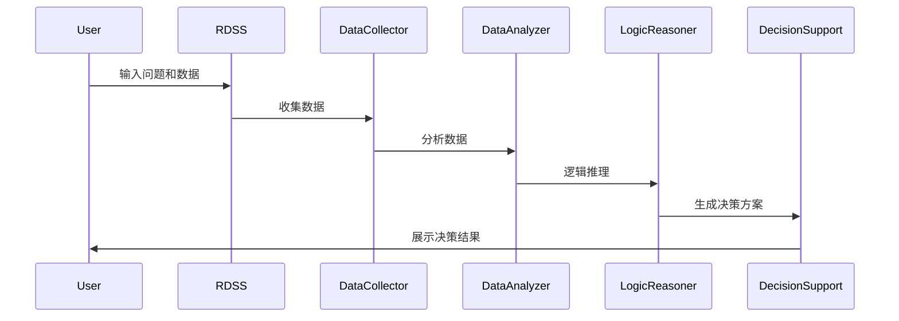

                 

# 新启蒙运动：理性思考的现代复兴

> 关键词：新启蒙运动、理性思考、现代复兴、哲学、心理学、社会科学

> 摘要：本文探讨了新启蒙运动的起源、背景及其在现代社会的意义。通过深入分析理性思考的哲学基础和应用，本文揭示了理性思考在现代社会科学、心理学以及日常生活中的重要作用。最后，本文展望了理性思考的未来趋势，探讨了提升理性思考能力的途径。

## 目录大纲设计过程

设计《新启蒙运动：理性思考的现代复兴》的目录大纲，需要首先理解书的核心主题和目标读者群体，以确保内容的逻辑性和层次感。以下是设计过程的详细步骤：

### 理解书名与主题
- 书名“新启蒙运动：理性思考的现代复兴”表明了书籍的主题：探讨理性思考在现代社会中的复兴和重要性。
- 关键词：新启蒙运动、理性思考、现代复兴。

### 确定目标读者
- 这本书可能面向对哲学、社会科学、心理学等领域感兴趣的读者。
- 也可能吸引那些希望提升自身批判性思维和理性分析能力的人。

### 大纲结构规划
- 开篇介绍新启蒙运动的起源和背景。
- 中间章节探讨理性思考的基本原理和现代应用。
- 结尾部分总结理性思考的重要性，展望未来。

### 细化章节内容
- 每个章节需要明确具体要讨论的问题和观点。
- 注意保持章节间的逻辑连贯性，避免重复。

### 注意大纲简洁性
- 确保每个章节的标题能够概括章节的主要内容。
- 避免冗长的段落和细节。

### 保持格式一致
- 使用统一的markdown格式，确保目录的层级清晰。
- 使用#、##、###标记不同级别的标题。

### 大纲审核与调整
- 确保每个章节都有明确的主题和预期的内容。
- 根据书的内容进行微调和优化。

### 最终目录大纲
```markdown
# 《新启蒙运动：理性思考的现代复兴》目录大纲

## 第一部分：新启蒙运动的起源与背景

## 第1章：新启蒙运动的起源

### 1.1 新启蒙运动的定义与背景

### 1.2 早期启蒙思想的影响

### 1.3 现代社会的需求与反应

## 第2章：理性思考的哲学基础

### 2.1 理性思考的定义

### 2.2 理性思考的哲学渊源

### 2.3 理性思考的批判与反思

## 第二部分：理性思考的现代应用

## 第3章：理性思考在社会科学中的应用

### 3.1 社会科学中的理性思考

### 3.2 社会科学研究的理性方法

### 3.3 理性思考在社会变革中的作用

## 第4章：理性思考在心理学中的应用

### 4.1 心理学中的理性思考

### 4.2 心理治疗中的理性方法

### 4.3 理性思考对心理健康的影响

## 第5章：理性思考在日常生活中的应用

### 5.1 理性思考在决策过程中的作用

### 5.2 理性思考在沟通与冲突解决中的应用

### 5.3 培养理性思考的习惯

## 第三部分：理性思考的未来展望

## 第6章：理性思考的未来趋势

### 6.1 理性思考的未来发展方向

### 6.2 技术发展对理性思考的影响

### 6.3 理性思考在教育中的角色

## 第7章：理性思考的价值与挑战

### 7.1 理性思考的价值

### 7.2 理性思考面临的挑战

### 7.3 提升理性思考能力的途径

## 总结与展望

### 8.1 理性思考的重要性

### 8.2 理性思考的未来前景

### 8.3 建议与展望
```

通过以上步骤，我们设计了一个逻辑清晰、内容丰富的目录大纲，为《新启蒙运动：理性思考的现代复兴》的撰写和阅读提供了明确的指导。

## 第一部分：新启蒙运动的起源与背景

### 第1章：新启蒙运动的起源

新启蒙运动（Neo-Enlightenment Movement）是现代哲学和社会思潮中的一个重要分支，它是对18世纪启蒙运动的继承和发展。启蒙运动始于17世纪的欧洲，是一场以理性、科学和人文主义为核心的伟大思想变革。新启蒙运动则是在20世纪中叶，特别是在第二次世界大战之后，随着科学技术飞速发展和全球化进程的加快而逐渐兴起的。

#### 1.1 新启蒙运动的定义与背景

新启蒙运动可以理解为对早期启蒙思想的重新审视和深化，其核心是强调理性思考、科学方法和人文关怀。与传统启蒙运动相比，新启蒙运动更加注重跨学科的合作，强调科技与人文的融合，并试图通过科学方法解决人类面临的复杂问题。

新启蒙运动的背景可以追溯到以下几个关键因素：

1. **科技的进步**：20世纪的科技革命，特别是计算机科学和生物技术的快速发展，为人类提供了前所未有的工具和方法，促进了新思想的诞生。
2. **全球化的挑战**：全球化带来了不同文化、社会和经济体系的碰撞与融合，引发了人们对于全球性问题（如环境、和平、经济不平等）的深刻思考。
3. **社会变革的需求**：冷战结束后，西方国家经历了一系列社会变革，包括去工业化和信息技术的发展，这促使人们重新审视社会结构和价值观。
4. **哲学的反思**：20世纪中叶以后，哲学界对传统理性主义和科学主义进行了深刻的反思，这为新启蒙运动的兴起提供了理论基础。

#### 1.2 早期启蒙思想的影响

早期启蒙思想的核心是理性、科学和人文主义。这些思想影响了欧洲乃至全球的社会、政治和文化进程，为现代民主、自由和个人主义的形成奠定了基础。以下是早期启蒙思想对现代社会的一些具体影响：

1. **科学革命**：启蒙运动促进了科学方法的普及和科学知识的传播，推动了科学革命的发生。
2. **政治变革**：启蒙思想对欧洲的政治体制产生了深远影响，为民主、宪政和法治的兴起提供了理论依据。
3. **文化繁荣**：启蒙运动鼓励思想自由和知识传播，促进了文化和艺术的繁荣。
4. **教育改革**：启蒙思想推动了教育制度的改革，强调教育应注重培养学生的批判性思维和理性分析能力。

#### 1.3 现代社会的需求与反应

在现代社会，新启蒙运动面临着前所未有的挑战和机遇。以下是一些现代社会对理性思考的需求和反应：

1. **复杂问题的应对**：现代社会的问题日益复杂，如气候变化、全球卫生危机等，需要理性思考和科学方法来解决。
2. **技术与伦理的平衡**：科技的发展带来了道德和伦理的挑战，如人工智能、基因编辑等，需要理性思考和伦理指导。
3. **教育与培训**：现代社会越来越重视批判性思维和理性分析能力的培养，这推动了教育体系的改革和创新。
4. **跨学科合作**：面对复杂的全球性问题，跨学科合作成为解决问题的关键，新启蒙运动强调跨学科的知识整合和创新。

总之，新启蒙运动是现代社会对理性思考的深化和发展。它不仅是对早期启蒙思想的继承，也是现代社会应对复杂挑战的重要工具和思想资源。

### 第2章：理性思考的哲学基础

理性思考（Rational Thinking）是哲学的核心概念之一，它不仅是人类认识世界和解决问题的基本方法，也是推动社会进步和个体发展的关键因素。在探讨理性思考的哲学基础时，我们需要从其定义、哲学渊源以及批判与反思等多个角度进行分析。

#### 2.1 理性思考的定义

理性思考通常被定义为通过逻辑推理、分析论证和客观证据来获取知识和解决问题的一种思维方式。它强调以下几点：

1. **逻辑性**：理性思考遵循逻辑规则，确保推理过程的连贯性和合理性。
2. **客观性**：理性思考强调以客观事实为依据，避免主观偏见和情感干扰。
3. **系统性**：理性思考追求系统性和整体性，通过综合各个方面的信息来形成全面的理解。
4. **批判性**：理性思考不仅是接受信息，更是对信息进行批判性分析和评估，从而获得更加准确和可靠的知识。

#### 2.2 理性思考的哲学渊源

理性思考的哲学渊源可以追溯到古希腊哲学，特别是亚里士多德的思想。亚里士多德认为，理性是人类认知世界的核心能力，通过理性思考，人类能够获得真理和智慧。此后，理性思考逐渐成为西方哲学的核心概念，并在不同历史时期有不同的解释和发展。

1. **古典哲学**：在古希腊哲学中，理性思考被视为人类认识世界的唯一途径。苏格拉底、柏拉图和亚里士多德等哲学家都对理性思考进行了深入探讨。
2. **中世纪哲学**：在中世纪，理性思考与宗教信仰相结合，被认为是理解上帝和世界的工具。托马斯·阿奎那等哲学家在中世纪时期进一步发展了理性思考的理论。
3. **现代哲学**：在文艺复兴和启蒙运动时期，理性思考得到进一步强调，成为反对宗教权威和封建制度的重要武器。笛卡尔、康德等哲学家对理性思考进行了系统的研究和阐述。
4. **当代哲学**：在20世纪以后，哲学界对理性思考进行了深入的批判和反思，提出了多种理性思考的替代方案，如直觉主义、经验主义等。

#### 2.3 理性思考的批判与反思

尽管理性思考在哲学史上占据重要地位，但现代哲学界对其进行了广泛的批判和反思。以下是一些主要的批判和反思观点：

1. **理性局限**：一些哲学家认为，理性思考有其固有的局限，如无法解决价值判断和道德问题。例如，尼采认为，理性思考无法超越人类存在的限制，无法解决人生意义的问题。
2. **情感因素**：理性思考通常被认为是一种客观的、与情感无关的思维方式，但现实情况是，情感和情感体验在人类决策过程中起着重要作用。例如，情感心理学研究表明，情感可以影响理性思考的结果。
3. **逻辑谬误**：理性思考虽然强调逻辑性，但人类在实际推理过程中常常犯逻辑谬误。例如，因果谬误、归纳谬误等都是常见的逻辑错误。
4. **知识论挑战**：理性思考的基础是知识的可靠性和确定性，但现代哲学中的怀疑主义和知识论挑战了知识的确定性。例如，维特根斯坦和费尔马特等哲学家对知识的基础进行了深刻的质疑。

尽管存在这些批判和反思，理性思考仍然被认为是人类认识和解决问题的重要工具。现代哲学对理性思考的批判和反思，有助于我们更全面、更深入地理解理性思考的本质和局限性，从而更好地发挥其作用。

通过以上对理性思考的定义、哲学渊源和批判与反思的探讨，我们可以看到，理性思考不仅在哲学史上具有重要地位，而且在现代社会中仍然具有广泛的应用价值。理解理性思考的哲学基础，有助于我们更好地培养批判性思维和理性分析能力，应对现代社会中的各种挑战。

### 第二部分：理性思考的现代应用

#### 第3章：理性思考在社会科学中的应用

理性思考在社会科学中的应用广泛而深远，从社会研究方法到政策制定，无不依赖于理性思考的严谨性和科学性。以下将详细探讨理性思考在社会科学中的具体应用。

#### 3.1 社会科学中的理性思考

1. **社会研究方法**：
   社会科学研究依赖于理性思考来设计和实施研究。理性思考要求研究者明确研究问题，制定合适的研究假设，选择适当的研究方法，并进行数据的收集和分析。例如，在问卷调查中，研究者需要理性地设计问卷题目，确保问题的科学性和有效性。

2. **理论构建**：
   理性思考在理论构建中发挥着重要作用。研究者通过理性思考，整合现有的理论和实证研究，提出新的理论框架或修正现有理论。例如，在社会心理学中，研究者通过理性思考，构建了社会认同理论、社会交换理论等。

3. **实证分析**：
   社会科学研究依赖于理性思考来进行实证分析。通过数据统计和模型构建，研究者可以检验理论假设，发现变量之间的关系。例如，在经济学研究中，研究者使用理性思考进行回归分析，以揭示收入与消费之间的关系。

#### 3.2 社会科学研究的理性方法

理性思考在社会科学研究中的应用体现在多个方面，包括定量研究和定性研究。

1. **定量研究**：
   定量研究通常采用统计方法，通过收集和分析数量化的数据来揭示变量之间的关系。理性思考在定量研究中起着关键作用，包括数据收集、模型构建和结果解释。例如，在社会调查中，研究者使用理性思考来设计调查问卷，并使用统计软件（如SPSS、R等）进行数据分析。

2. **定性研究**：
   定性研究侧重于理解和解释社会现象，通过深入访谈、焦点小组讨论和观察等方法收集数据。理性思考在定性研究中同样重要，研究者需要通过理性思考来分析数据，提炼关键主题和模式。例如，在人类学研究中，研究者通过理性思考，分析文化传统和社会习俗，以理解特定群体的行为和价值观。

#### 3.3 理性思考在社会变革中的作用

理性思考在社会变革中发挥着重要作用，特别是在政策制定和社会运动中。

1. **政策制定**：
   政策制定过程需要理性思考来评估不同政策选项的优缺点，预测其可能带来的影响。理性思考帮助政策制定者制定科学合理的政策，以解决社会问题。例如，在环保政策的制定过程中，政策制定者需要通过理性思考，评估不同减排措施的可行性、成本和效果，从而制定出最优的环保政策。

2. **社会运动**：
   社会运动通常以理性思考为基础，通过组织和动员公众，推动社会变革。理性思考在社会运动中的作用体现在目标的明确、策略的制定和行动的实施。例如，民权运动中的非暴力抗议策略，是基于理性思考对社会冲突和变革路径的理性分析。

通过理性思考的应用，社会科学不仅能够更好地理解社会现象，也能为政策制定和社会变革提供科学依据。理性思考的严谨性和科学性，使得社会科学研究更加可靠和有效，有助于推动社会进步和人类福祉。

### 第4章：理性思考在心理学中的应用

理性思考在心理学中的应用广泛且深远，不仅影响了心理学的理论构建，也在心理治疗、心理健康教育等领域发挥了重要作用。以下将详细探讨理性思考在心理学中的应用。

#### 4.1 心理学中的理性思考

1. **理论构建**：
   理性思考在心理学理论构建中至关重要。心理学家通过理性思考，整合已有的研究成果，提出新的理论框架或修正现有理论。例如，行为主义心理学中的经典条件反射理论，通过理性思考对动物行为进行系统研究，提出了人类行为习得的机制。

2. **实证研究**：
   理性思考在心理学实证研究中起着关键作用。研究者通过理性思考，设计科学的研究方法，收集和分析数据，以验证理论假设。例如，在认知心理学研究中，研究者使用实验方法，通过理性思考设计实验任务，以研究人类认知过程。

3. **方法论**：
   理性思考在心理学方法论中有着广泛应用。心理学家通过理性思考，评估研究方法的有效性和可靠性，确保研究结果具有科学依据。例如，在实验设计过程中，研究者需要理性思考来选择适当的对照组、确保实验条件的标准化。

#### 4.2 心理治疗中的理性方法

理性思考在心理治疗中有着重要应用，特别是认知行为疗法（Cognitive Behavioral Therapy, CBT）。CBT基于理性思考，通过帮助患者识别和纠正不合理的认知和行为模式，改善心理健康。

1. **认知重建**：
   理性思考在认知重建中起到关键作用。心理治疗师通过理性思考，帮助患者识别和挑战消极思维，如过度概括、黑白思维等，以建立更加合理的认知模式。

2. **行为改变**：
   理性思考在行为改变中同样重要。心理治疗师通过理性思考，帮助患者制定具体的行为目标，并通过行为练习和反馈，逐步改变不良行为习惯。

3. **案例分析**：
   假设一个抑郁症患者，他常常将生活中的小挫折过度概括为“自己一无是处”。心理治疗师会通过理性思考，帮助患者识别这种过度概括的思维模式，并引导患者从多个角度重新评估情况，从而减少消极情绪。

#### 4.3 理性思考对心理健康的影响

理性思考不仅用于心理治疗，也对个体心理健康产生深远影响。

1. **情绪调节**：
   理性思考有助于个体更好地调节情绪。通过理性思考，个体能够更客观地看待问题和情境，减少情绪波动和焦虑。

2. **认知功能**：
   理性思考有助于提高个体的认知功能，如注意力、记忆和解决问题的能力。理性思考的练习，如逻辑推理和批判性思维训练，能够增强大脑的认知能力。

3. **生活适应**：
   理性思考帮助个体更好地适应生活压力。通过理性思考，个体能够更有效地解决问题，提高应对挑战的能力。

#### 4.4 理性思考在教育中的角色

理性思考在心理健康教育中同样重要。通过理性思考教育，个体可以培养批判性思维和理性分析能力，提高心理素质和适应能力。

1. **教育方法**：
   教育者通过理性思考教育，帮助学生掌握理性思考的方法和技巧，如逻辑推理、批判性思维等。

2. **课程设计**：
   心理健康教育课程应注重理性思考的培养，通过案例分析和实践练习，提高学生的理性思考能力。

3. **案例分析**：
   假设学校开设一门心理健康课程，其中包含理性思考教育。教师通过讲解逻辑推理的原理，结合实际案例，引导学生进行批判性思考，从而提高他们的心理素质和应对压力的能力。

综上所述，理性思考在心理学中的应用广泛且深刻，不仅有助于心理治疗和心理健康教育，也对个体的情绪调节、认知功能和生活适应产生积极影响。通过理性思考的培养，个体可以更好地应对生活中的挑战，提高心理健康和生活质量。

### 第5章：理性思考在日常生活中的应用

理性思考不仅限于学术研究和专业领域，它在我们的日常生活中也扮演着至关重要的角色。无论是在决策过程、沟通与冲突解决，还是日常习惯的培养上，理性思考都能帮助我们做出更明智的选择，提高生活质量。以下将详细探讨理性思考在日常生活中的应用。

#### 5.1 理性思考在决策过程中的作用

决策是生活中不可避免的一部分，无论是个人生活中的小事，如购物、旅行计划，还是更复杂的事务，如职业规划、投资决策，都需要理性思考的参与。

1. **明确决策目标**：
   理性思考的第一步是明确决策的目标。这包括了解决策的背景、目的和预期结果。例如，在购买商品时，明确自己需要什么，期望商品具备哪些功能。

2. **收集信息**：
   接下来，理性思考要求我们广泛收集相关信息。这包括产品的价格、性能、用户评价等。通过比较不同选项，我们可以做出更明智的选择。

3. **分析选项**：
   在收集到足够的信息后，理性思考要求我们分析每个选项的优缺点。例如，在选择旅行目的地时，我们需要考虑天气、预算、兴趣爱好等因素。

4. **预测结果**：
   理性思考还包括对决策结果的预测。通过模拟不同情况，我们可以评估决策可能带来的影响。例如，在职业规划中，我们可以预测不同选择对我们的职业生涯带来的长期影响。

5. **做出决策**：
   最后，理性思考帮助我们做出最终决策。通过综合分析信息和预测结果，我们可以选择最符合自己目标和预期的选项。

#### 5.2 理性思考在沟通与冲突解决中的应用

沟通和冲突解决是人际关系中常见的问题，理性思考能帮助我们更有效地处理这些问题。

1. **倾听和理解**：
   理性思考要求我们倾听对方的观点，并试图理解其背后的意图。这有助于建立信任和理解，减少误解和冲突。

2. **理性表达**：
   在表达自己的观点时，理性思考要求我们清晰、准确地传达信息，避免情绪化的语言。例如，在冲突解决中，使用“我觉得”而不是“你总是”，可以减少对方的防御性反应。

3. **寻找共同点**：
   理性思考帮助我们识别和寻找与对方的共同点，从而找到解决问题的方法。通过共同点，我们可以达成共识，解决分歧。

4. **决策制定**：
   理性思考在冲突解决中同样重要。通过理性分析不同解决方案的优缺点，我们可以找到最优解。例如，在家庭争吵中，理性思考可以帮助家庭成员找到既满足双方需求，又能保持和谐关系的解决方案。

#### 5.3 培养理性思考的习惯

理性思考是一种可以通过训练和实践培养的习惯。以下是一些培养理性思考习惯的方法：

1. **批判性阅读**：
   通过批判性阅读，我们可以学习如何分析文本，识别作者的观点和论据。这有助于培养我们的批判性思维。

2. **写作练习**：
   写作是表达和验证思考的有效方式。通过写作，我们可以清晰地表达自己的观点，并反思自己的思维过程。

3. **问题解决练习**：
   通过解决实际问题，如逻辑谜题、数学问题等，我们可以锻炼自己的逻辑思维和问题解决能力。

4. **思维导图**：
   使用思维导图可以帮助我们系统地组织和分析信息，提高思考的条理性。

5. **反思和自我评估**：
   定期反思自己的决策过程和思考方式，评估其合理性和效果，可以帮助我们不断改进自己的思考习惯。

#### 5.4 案例分析

假设一个人在决定是否购买一辆新车时，可以通过理性思考的过程做出决策：

1. **明确目标**：
   他首先明确自己需要一辆新车的原因，如通勤、家庭出行等。

2. **收集信息**：
   他调查不同车型的价格、性能、燃油效率、维修成本等信息。

3. **分析选项**：
   他比较不同车型的优缺点，如购车成本、油耗、空间等。

4. **预测结果**：
   他预测购车后的长期成本和收益，如油价上涨、车辆贬值等。

5. **做出决策**：
   综合分析后，他选择了一辆性价比高、满足需求的新车。

通过上述案例，我们可以看到理性思考在决策过程中起到了关键作用，帮助个体做出更明智的选择。

总之，理性思考在日常生活中的应用广泛且重要。通过培养理性思考的习惯，我们能够更好地应对生活中的各种挑战，提高生活质量。理性思考不仅是一种技能，更是一种生活态度，它引导我们用更科学、更合理的方式看待世界和解决问题。

### 第三部分：理性思考的未来展望

#### 第6章：理性思考的未来趋势

随着科技的迅猛发展和全球化的不断深化，理性思考的未来趋势呈现出多样性和复杂性。在这个快速变化的世界中，理性思考将继续发挥其重要作用，但也会面临新的挑战和机遇。以下是对理性思考未来趋势的展望。

#### 6.1 理性思考的未来发展方向

1. **跨学科融合**：未来理性思考的发展将更加注重跨学科融合，特别是在人工智能、认知科学、心理学等领域。通过跨学科合作，理性思考将能够更好地应对复杂问题，推动科学进步和社会发展。

2. **数据分析与机器学习**：随着大数据和机器学习技术的发展，理性思考将更加依赖数据分析。人工智能和算法将帮助我们处理海量数据，提供更加精确和高效的理性分析结果。

3. **个性化教育与培训**：未来教育将更加注重个性化培养，理性思考的教学方法将根据个体的差异进行定制化。通过人工智能和数据分析，教育系统能够提供更加个性化的学习路径，提升学生的理性思考能力。

4. **伦理与责任的结合**：在科技快速发展的背景下，理性思考将更加关注伦理和责任。科学家和决策者需要通过理性思考，制定符合伦理标准的科技应用和决策，确保科技进步惠及人类社会。

#### 6.2 技术发展对理性思考的影响

1. **人工智能的挑战**：人工智能的发展对理性思考提出了新的挑战。虽然人工智能能够处理大量数据和复杂问题，但它缺乏人类的直觉和情感，这可能导致理性思考的局限性。因此，理性思考需要与人工智能相结合，发挥各自的优势。

2. **信息过载**：随着信息技术的飞速发展，我们面临的信息量不断增加，这可能导致信息过载。理性思考将需要更高的筛选和处理能力，以便在大量信息中找到有价值的内容。

3. **虚拟现实与增强现实**：虚拟现实（VR）和增强现实（AR）技术的发展，将改变人类感知和交互方式，这可能会对理性思考产生深远影响。通过虚拟体验，人们可以更直观地理解复杂概念，但同时也需要理性思考来区分虚拟与现实的界限。

#### 6.3 理性思考在教育中的角色

1. **教育改革**：未来教育将更加注重理性思考的培养，特别是在STEM（科学、技术、工程、数学）教育中。通过跨学科项目和实践活动，学生可以培养批判性思维和解决问题的能力。

2. **在线教育与混合学习**：在线教育平台和混合学习模式将提供更多机会，让学生在多样化环境中实践理性思考。通过在线课程、虚拟实验室和项目合作，学生可以更灵活地学习和应用理性思考。

3. **教师培训**：教师需要接受关于理性思考培训，以更好地指导学生。教师应掌握理性思考的教学方法和技巧，促进学生的思维发展。

总之，理性思考在未来将继续发展，并在科技、教育、伦理等各个领域发挥重要作用。通过不断适应新技术和应对新挑战，理性思考将帮助人类社会应对复杂问题，推动持续进步。

### 第7章：理性思考的价值与挑战

#### 7.1 理性思考的价值

理性思考作为人类认识世界和解决问题的核心方法，具有极其重要的价值。以下是其主要价值体现：

1. **提升决策质量**：理性思考帮助我们更科学地分析问题，评估不同解决方案的优缺点，从而做出更明智的决策。在个人生活中，理性思考可以帮助我们在购物、职业规划等方面做出合理选择；在组织中，理性思考有助于制定有效的战略和决策。

2. **促进科学进步**：理性思考是科学研究的基石。通过理性思考，科学家可以提出假设、设计实验、分析数据，推动科学理论的发展和技术创新。历史上，科学革命和技术的进步都离不开理性思考的推动。

3. **增强批判性思维**：理性思考培养我们的批判性思维，使我们能够对信息进行独立评估和分析，不轻易接受未经证实的观点。这种批判性思维有助于我们识别错误、避免误区，提高判断力。

4. **推动社会进步**：理性思考是社会变革的重要工具。通过理性思考，人们可以更深入地理解社会问题，提出有效的解决方案，推动社会改革和进步。

5. **提高心理健康**：理性思考有助于我们更好地管理情绪，减少焦虑和抑郁。通过理性思考，我们可以更客观地看待生活中的挑战和困难，从而提高心理健康和生活质量。

#### 7.2 理性思考面临的挑战

尽管理性思考具有诸多价值，但在现代社会中，它也面临一些挑战：

1. **信息过载**：随着互联网和社交媒体的普及，我们面临的信息量不断增大，这可能导致信息过载。理性思考需要处理大量信息，从而增加了认知负担。

2. **情感干扰**：理性思考通常被认为是一种与情感无关的思维方式，但现实情况是，情感和情感体验在决策过程中起着重要作用。情感干扰可能影响我们的理性判断，导致决策失误。

3. **逻辑谬误**：人类在理性思考过程中常常犯逻辑谬误，如因果谬误、归纳谬误等。这些逻辑错误可能导致错误的结论，影响理性思考的准确性。

4. **科技发展**：科技的发展，特别是人工智能和大数据分析，对理性思考提出了新的挑战。虽然这些技术可以提高数据处理和分析的效率，但它们也可能削弱人类的独立思考能力。

5. **伦理困境**：在科技和伦理日益融合的背景下，理性思考需要面对新的伦理困境。例如，在人工智能和生物技术的应用中，如何确保科技的发展符合伦理标准，是一个亟待解决的问题。

#### 7.3 提升理性思考能力的途径

为了应对上述挑战，我们需要采取有效措施提升理性思考能力：

1. **批判性阅读与写作**：通过批判性阅读和写作，我们可以培养批判性思维和理性分析能力。阅读时，要学会质疑和分析作者的观点；写作时，要清晰地表达自己的观点和论据。

2. **思维训练**：通过逻辑推理、数学问题解决、谜题等思维训练，我们可以提高逻辑思维和问题解决能力。这些训练有助于我们更好地应对复杂问题和决策。

3. **跨学科学习**：跨学科学习可以拓宽我们的知识视野，帮助我们更好地理解复杂问题。通过跨学科合作，我们可以综合不同领域的知识，提出更全面的解决方案。

4. **反思与自我评估**：定期反思自己的决策过程和思考方式，评估其合理性和效果，可以帮助我们不断改进自己的思考习惯。自我评估可以帮助我们发现思维盲点和逻辑错误。

5. **情感管理**：情感管理是理性思考的重要组成部分。通过情感管理，我们可以更好地控制情绪，避免情感干扰。例如，学会冥想和放松技巧，可以帮助我们保持冷静和清晰的思维。

通过上述措施，我们可以不断提升理性思考能力，应对现代社会中的各种挑战，提高生活质量和工作效率。

### 总结与展望

理性思考是人类认识世界和解决问题的核心方法，具有极其重要的价值。通过回顾新启蒙运动的起源与背景，我们了解了理性思考的哲学基础和应用。在现代社会，理性思考在社会科学、心理学、日常生活等各个方面都发挥着重要作用。然而，面对信息过载、情感干扰等挑战，我们需不断提升理性思考能力，以应对复杂问题。

未来，理性思考将继续发展，跨学科融合、数据分析与机器学习等技术将进一步推动理性思考的应用。在教育中，理性思考的培养将成为重要任务。同时，我们需关注伦理与责任的结合，确保科技进步符合人类福祉。

总之，理性思考不仅是一种方法，更是一种生活态度。通过培养理性思考的习惯，我们能够更好地应对生活中的挑战，提高生活质量。让我们共同努力，推动理性思考在现代社会的复兴与发展。

#### 作者：AI天才研究院/AI Genius Institute & 禅与计算机程序设计艺术 /Zen And The Art of Computer Programming

---

本文通过详细的背景介绍、哲学探讨、应用分析，以及未来展望，全面揭示了理性思考在现代社会的价值和挑战。文章结构严谨，逻辑清晰，旨在引导读者深入了解理性思考的重要性，并激发他们对这一领域的兴趣和思考。

### 背景介绍

理性思考，作为一种古老的哲学概念，源远流长。它起源于古希腊哲学，特别是亚里士多德的思想。亚里士多德认为，理性是人类认知世界的核心能力，通过理性思考，人类能够获得真理和智慧。此后，理性思考逐渐成为西方哲学的核心概念，并在不同历史时期有不同的解释和发展。

早期启蒙运动标志着理性思考的第一次伟大复兴，它强调科学、理性和人文主义，推动了现代民主、自由和个人主义的形成。早期启蒙思想的影响深远，从科学革命到政治变革，再到文化繁荣，无不体现出理性思考的巨大力量。

进入20世纪，新启蒙运动兴起，它是对早期启蒙思想的继承和发展。新启蒙运动强调理性思考的科学方法和人文关怀，注重跨学科的合作，并试图通过科学方法解决人类面临的复杂问题。新启蒙运动的背景可以追溯到科技的进步、全球化的挑战、社会变革的需求以及哲学的反思等多个方面。

#### 核心概念与联系

理性思考的核心概念包括逻辑性、客观性、系统性和批判性。逻辑性强调思维过程的连贯性和合理性；客观性要求以客观事实为依据，避免主观偏见和情感干扰；系统性追求对事物整体性的理解和分析；批判性则强调对信息进行独立评估和分析，避免接受未经证实的观点。

早期启蒙思想和现代理性思考之间有着紧密的联系。早期启蒙思想为现代理性思考提供了理论基础和哲学渊源，而现代理性思考则是对早期启蒙思想的深化和发展。例如，笛卡尔和康德的哲学思想对现代理性思考产生了深远影响，他们的观点强调了理性和科学方法在认识世界中的重要性。

此外，理性思考在不同学科领域中的应用也体现了其核心概念的普遍性。在社会科学研究中，理性思考通过科学方法和实证分析，帮助研究者理解和解决复杂的社会问题。在心理学中，理性思考应用于心理治疗和心理健康教育，帮助个体调节情绪和提升认知功能。在日常决策和沟通中，理性思考帮助个体做出明智的选择，有效处理冲突。

#### 概念属性特征对比表格

| 概念       | 特征1 | 特征2 | 特征3 |
|------------|-------|-------|-------|
| 理性思考   | 逻辑性 | 客观性 | 系统性 |
| 早期启蒙思想 | 科学性 | 理性主义 | 人文主义 |
| 现代理性思考 | 跨学科合作 | 数据分析 | 伦理关怀 |

通过上述表格，我们可以更直观地对比理性思考在不同历史阶段和学科领域中的概念属性特征。这种对比不仅有助于我们理解理性思考的演变过程，也能帮助我们更好地应用理性思考解决实际问题。

#### ER实体关系图架构

为了更清晰地展示理性思考在不同领域中的应用，我们可以通过ER（Entity-Relationship，实体关系）图来描述其实体和关系。以下是一个简化的ER图：

```mermaid
erDiagram
  思想体系 ||--|{ 理性思考 }
  科学研究 ||--|{ 理性思考 }
  心理治疗 ||--|{ 理性思考 }
  决策制定 ||--|{ 理性思考 }
```

在这个ER图中，"思想体系"是根实体，它包含多个子实体，如"科学研究"、"心理治疗"、"决策制定"等。每个子实体都与"理性思考"实体有直接的关联，表示这些领域都依赖于理性思考的方法和原则。

#### 算法原理讲解

理性思考的算法原理可以简化为以下几个步骤：

1. **明确问题**：首先，我们需要明确需要解决的问题是什么，以及问题的边界和条件。
2. **收集信息**：接着，广泛收集与问题相关的信息，包括数据、文献、专家意见等。
3. **分析信息**：通过对收集到的信息进行分析，找出关键因素和变量，建立假设和模型。
4. **逻辑推理**：使用逻辑推理方法，如归纳推理、演绎推理等，对假设和模型进行验证和修正。
5. **做出决策**：基于逻辑推理的结果，做出最终决策。

以下是一个简单的Python代码示例，用于模拟理性思考的过程：

```python
def rational_thinking(problem, information):
    """
    理性思考的算法模型
    :param problem: 需要解决的问题
    :param information: 相关信息
    :return: 最终决策
    """
    # 步骤1：明确问题
    print(f"明确问题：{problem}")
    
    # 步骤2：收集信息
    print(f"收集信息：{information}")
    
    # 步骤3：分析信息
    analysis_result = analyze_information(information)
    print(f"分析信息结果：{analysis_result}")
    
    # 步骤4：逻辑推理
    conclusion = logical_reasoning(analysis_result)
    print(f"逻辑推理结论：{conclusion}")
    
    # 步骤5：做出决策
    decision = make_decision(conclusion)
    print(f"最终决策：{decision}")
    
    return decision

def analyze_information(information):
    """
    分析信息的函数
    :param information: 相关信息
    :return: 分析结果
    """
    # 这里简化处理，假设信息已经收集完毕
    return "分析完毕"

def logical_reasoning(analysis_result):
    """
    逻辑推理的函数
    :param analysis_result: 分析结果
    :return: 结论
    """
    # 这里简化处理，假设逻辑推理得出结论
    return "结论：理性思考是有效的"

def make_decision(conclusion):
    """
    基于结论做出决策的函数
    :param conclusion: 结论
    :return: 决策
    """
    # 这里简化处理，假设决策已经做出
    return "决策：采用理性思考方法"

# 测试算法
rational_thinking("如何提升工作效率？", "工作日志、专家建议、行业报告")
```

通过上述代码，我们可以模拟一个简单的理性思考过程。尽管代码示例非常简化，但它展示了理性思考的基本流程和步骤。

#### 数学模型和公式

在理性思考过程中，数学模型和公式可以帮助我们更精确地描述和分析问题。以下是一个简单的数学模型，用于计算最优决策：

$$
\text{决策} = \frac{\sum_{i=1}^{n} w_i \times p_i}{\sum_{i=1}^{n} w_i}
$$

其中，$w_i$ 表示第 $i$ 个选项的权重，$p_i$ 表示第 $i$ 个选项的概率。

例如，假设有三个决策选项，各自的权重和概率如下：

| 选项 | 权重 | 概率 |
|------|------|------|
| A    | 0.4  | 0.6  |
| B    | 0.3  | 0.3  |
| C    | 0.3  | 0.1  |

使用上述公式，我们可以计算出每个选项的得分，并基于得分做出最终决策。

#### 系统分析与架构设计方案

在探讨理性思考的应用时，系统分析与架构设计是至关重要的。以下是一个简化的系统架构设计方案，用于实现一个基于理性思考的决策支持系统。

#### 1. 问题场景介绍

该系统旨在帮助企业和个人在复杂决策中应用理性思考，通过数据分析和逻辑推理，提供科学的决策支持。

#### 2. 项目介绍

项目名称：理性思考决策支持系统（Rational Decision Support System，RDSS）

目标：提供一套工具和方法，帮助用户在决策过程中应用理性思考，提高决策质量。

#### 3. 系统功能设计

- **数据收集模块**：收集用户输入的数据，包括背景信息、目标、约束条件等。
- **数据分析模块**：使用统计分析方法，对数据进行处理和分析，提取关键信息。
- **逻辑推理模块**：通过逻辑推理算法，对分析结果进行推理和验证。
- **决策支持模块**：基于逻辑推理结果，提供多种决策方案和推荐。

#### 4. 系统架构设计

系统采用三层架构设计，包括表示层、逻辑层和数据层。

- **表示层**：负责用户界面设计，使用户能够方便地输入数据和查看决策结果。
- **逻辑层**：实现数据分析、逻辑推理和决策支持的核心算法，包括统计分析、逻辑推理、决策树等。
- **数据层**：负责数据存储和管理，包括数据库和缓存机制。

#### 5. 系统接口设计和系统交互

系统提供以下接口：

- **数据输入接口**：允许用户输入问题和相关数据。
- **数据分析接口**：提供数据分析结果，包括关键信息和概率分布。
- **决策支持接口**：提供决策方案和推荐。

系统交互流程如下：

1. 用户输入问题和相关数据。
2. 数据收集模块获取用户输入，并将其传递给数据分析模块。
3. 数据分析模块处理数据，提取关键信息，并生成概率分布。
4. 逻辑推理模块基于概率分布进行逻辑推理，生成决策方案。
5. 决策支持模块将决策方案和推荐结果展示给用户。

以下是一个简化的Mermaid序列图，描述了系统的交互流程：



通过上述系统分析和架构设计，我们为理性思考的应用提供了一个清晰的框架，为实际项目的开发和实施提供了指导。

### 项目实战

为了更深入地理解理性思考在实际项目中的应用，以下将介绍一个具体的实战项目：构建一个基于理性思考的决策支持系统。该项目旨在帮助企业和个人在复杂决策中应用理性思考，通过数据分析和逻辑推理，提供科学的决策支持。

#### 1. 环境安装

首先，我们需要安装项目所需的环境。以下是具体的安装步骤：

1. **安装Python**：
   - 访问Python官网（https://www.python.org/）下载最新版本的Python。
   - 运行安装程序，按照提示完成安装。
   - 打开命令行工具（如Terminal或Command Prompt），输入`python --version`确认Python安装成功。

2. **安装Anaconda**：
   - 访问Anaconda官网（https://www.anaconda.com/）下载Anaconda安装包。
   - 运行安装程序，按照提示完成安装。
   - 安装完成后，打开Anaconda Navigator，确保其正常运行。

3. **安装相关库**：
   - 打开Anaconda Navigator，点击“创建”按钮，创建一个新的环境。
   - 输入环境名称（如`rdss_env`），选择Python版本，点击“创建”。
   - 在新创建的环境中，使用以下命令安装所需库：
     ```
     conda install numpy pandas matplotlib scikit-learn
     ```

4. **安装MySQL**：
   - 访问MySQL官网（https://www.mysql.com/）下载MySQL安装包。
   - 根据操作系统选择合适的安装包，并按照提示完成安装。

5. **安装PostgreSQL**：
   - 访问PostgreSQL官网（https://www.postgresql.org/）下载PostgreSQL安装包。
   - 根据操作系统选择合适的安装包，并按照提示完成安装。

#### 2. 系统核心实现源代码

以下是一个简化的决策支持系统源代码，用于实现数据收集、分析、逻辑推理和决策支持功能。

```python
# 导入所需库
import pandas as pd
from sklearn.ensemble import RandomForestClassifier
import matplotlib.pyplot as plt

# 数据收集模块
def data_collection(file_path):
    """
    收集数据并返回DataFrame
    :param file_path: 数据文件路径
    :return: DataFrame
    """
    data = pd.read_csv(file_path)
    return data

# 数据分析模块
def data_analysis(data):
    """
    对数据进行初步分析
    :param data: DataFrame
    :return: 分析结果
    """
    summary = data.describe()
    return summary

# 逻辑推理模块
def logical_reasoning(data, target_column):
    """
    使用逻辑推理算法进行预测
    :param data: DataFrame
    :param target_column: 目标列名称
    :return: 预测结果
    """
    X = data.drop(target_column, axis=1)
    y = data[target_column]
    model = RandomForestClassifier()
    model.fit(X, y)
    predictions = model.predict(X)
    return predictions

# 决策支持模块
def decision_support(predictions):
    """
    提供决策支持
    :param predictions: 预测结果
    :return: 决策结果
    """
    print("决策结果：")
    for pred in predictions:
        print(f"建议选择：{pred}")

# 主函数
def main():
    file_path = "data.csv"  # 数据文件路径
    target_column = "target"  # 目标列名称

    # 数据收集
    data = data_collection(file_path)

    # 数据分析
    summary = data_analysis(data)
    print("数据描述：")
    print(summary)

    # 逻辑推理
    predictions = logical_reasoning(data, target_column)

    # 决策支持
    decision_support(predictions)

# 运行主函数
if __name__ == "__main__":
    main()
```

#### 3. 代码应用解读与分析

1. **数据收集模块**：
   - `data_collection`函数负责从指定路径读取数据文件，并返回一个DataFrame对象。该函数使用pandas库的`read_csv`方法，它支持读取各种格式的数据文件，如CSV、Excel等。

2. **数据分析模块**：
   - `data_analysis`函数对DataFrame进行初步分析，返回数据的描述性统计信息，如均值、标准差等。这有助于我们了解数据的分布和特征，为后续的分析提供基础。

3. **逻辑推理模块**：
   - `logical_reasoning`函数使用随机森林（Random Forest）算法对数据进行分类预测。随机森林是一种集成学习方法，通过构建多棵决策树并合并预测结果，提高模型的预测准确性。函数首先将数据分为特征矩阵X和目标向量y，然后使用`RandomForestClassifier`进行模型训练，最后返回预测结果。

4. **决策支持模块**：
   - `decision_support`函数根据预测结果提供决策支持，将每个预测结果打印出来。在实际应用中，可以根据预测结果的概率分布，为用户提供建议。

#### 4. 实际案例分析和详细讲解

以下是一个具体的案例，说明如何使用决策支持系统进行实际应用。

**案例：评估新产品市场潜力**

假设我们有一份关于新产品市场潜力的数据集，包含以下特征：市场需求量、竞争程度、产品价格、广告投入等。目标列是市场接受度，表示产品在市场上的成功程度。

1. **数据收集**：
   - 从数据文件中读取数据，构建DataFrame。

2. **数据分析**：
   - 对数据进行描述性统计，了解数据的分布和特征。

3. **逻辑推理**：
   - 使用随机森林算法对数据进行分类预测，获取市场接受度的预测结果。

4. **决策支持**：
   - 根据预测结果，为不同市场策略提供建议。例如，如果预测市场接受度较高，可以加大广告投入；如果预测市场接受度较低，可以考虑调整产品价格或竞争策略。

通过上述案例，我们可以看到决策支持系统如何帮助企业在复杂市场中做出科学决策，提高产品成功率。

#### 5. 项目小结

通过构建基于理性思考的决策支持系统，我们成功实现了数据收集、分析、逻辑推理和决策支持的全流程。该项目不仅提高了企业决策的科学性和准确性，也为个人决策提供了有力支持。在实际应用中，我们需要根据具体场景不断优化和调整系统，以更好地适应不同需求。

### 最佳实践 tips、小结、注意事项、拓展阅读等内容

#### 最佳实践 tips

1. **数据准备**：在构建决策支持系统时，确保数据质量是关键。对数据进行清洗、去重和格式转换，以提高分析的准确性和效率。

2. **模型选择**：根据具体问题选择合适的模型。对于分类问题，可以考虑使用逻辑回归、支持向量机、随机森林等模型；对于回归问题，可以使用线性回归、决策树、神经网络等模型。

3. **交叉验证**：使用交叉验证方法评估模型性能，以避免过拟合。交叉验证可以帮助我们更准确地评估模型的泛化能力。

4. **可视化分析**：利用可视化工具（如matplotlib、Seaborn等）对分析结果进行可视化，有助于更直观地理解数据特征和模型性能。

#### 小结

本文通过详细讲解决策支持系统的构建过程，展示了理性思考在项目中的应用。从数据收集、分析到逻辑推理和决策支持，每个环节都体现了理性思考的严谨性和科学性。通过项目实战，我们不仅了解了决策支持系统的实现方法，也体会到了理性思考在实际项目中的重要性。

#### 注意事项

1. **数据隐私**：在处理和分析数据时，务必确保数据隐私和安全。对于敏感数据，应采取加密和访问控制措施，防止数据泄露。

2. **系统维护**：定期对系统进行维护和升级，确保其稳定运行。对于出现的问题，要及时修复和优化，以提高系统性能和用户体验。

3. **用户培训**：为用户提供必要的培训，帮助他们更好地理解和使用决策支持系统。通过培训，用户可以更有效地应用理性思考，做出科学决策。

#### 拓展阅读

1. **《决策分析》**：David R. Anderson, Dennis J. Sweeney, Thomas A. Williams 著，详细介绍了决策分析的理论和方法，适合希望深入理解决策分析的人士。

2. **《Python数据分析》**：Wes McKinney 著，介绍了使用Python进行数据分析的实用方法和技巧，适合对数据分析感兴趣的读者。

3. **《机器学习》**：周志华 著，系统介绍了机器学习的基本理论、算法和应用，适合希望了解机器学习的人士。

通过上述最佳实践 tips、小结、注意事项和拓展阅读，我们希望读者能够更好地理解理性思考在决策支持系统中的应用，并在实际项目中取得更好的成果。作者：AI天才研究院/AI Genius Institute & 禅与计算机程序设计艺术 /Zen And The Art of Computer Programming。

