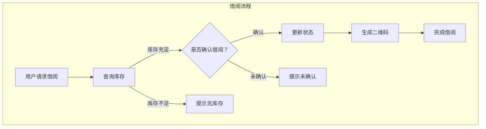
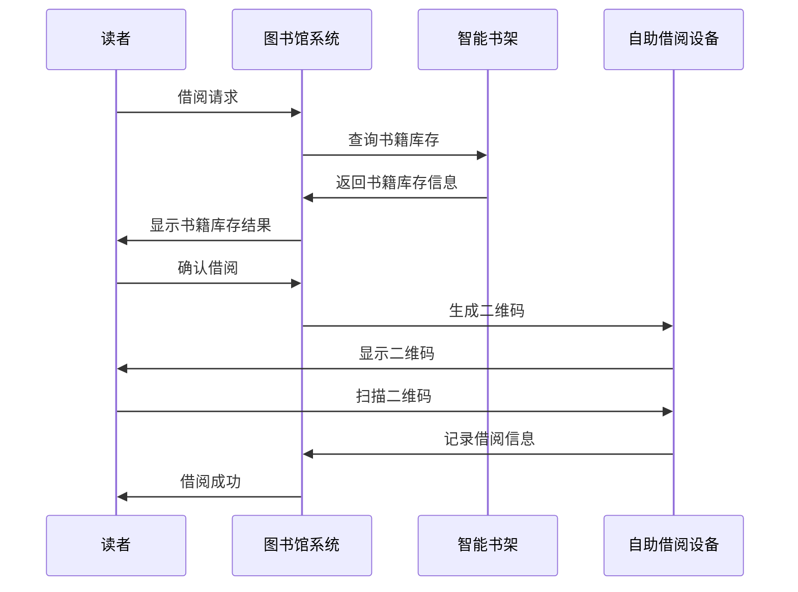
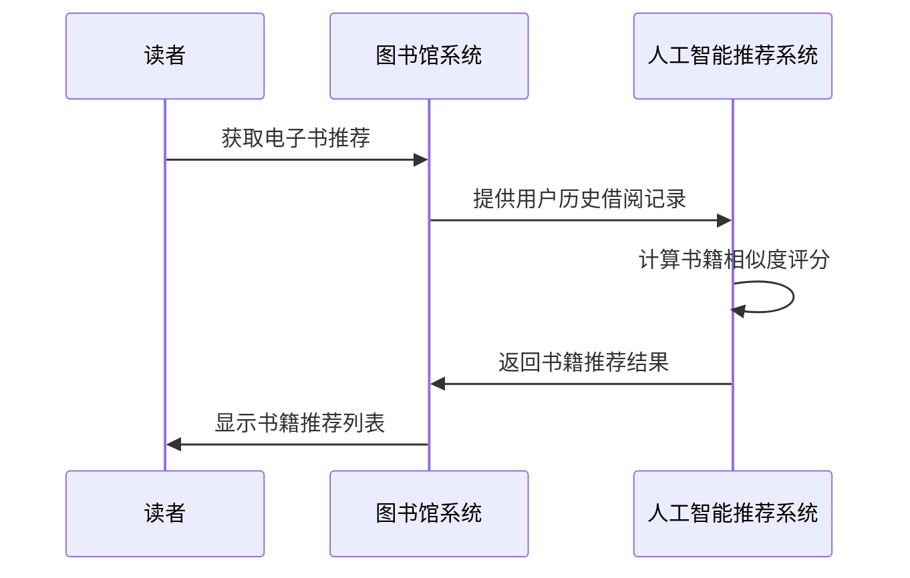

                 

## 《新型城市24小时自助图书馆网络：打造全城阅读便利店》

关键词：自助图书馆、24小时服务、智能书架、物联网、云计算

摘要：本文将探讨新型城市24小时自助图书馆网络的设计与实现，通过分析其背景、核心概念、架构设计、算法原理以及实际应用案例，揭示这一创新举措如何为城市居民打造便捷、高效的阅读环境。本文旨在为相关领域的研究者与实践者提供有价值的参考和启示。

### 目录大纲

#### 第一部分：背景介绍

1. **第1章：新型城市24小时自助图书馆网络概述**
   - **1.1 问题背景**
     - 城市化进程与公共阅读空间的需求
     - 传统图书馆面临的挑战与局限
   - **1.2 问题描述**
     - 如何提升城市阅读环境？
     - 如何让阅读资源更加便捷、普及？
   - **1.3 问题解决**
     - 24小时自助图书馆网络的创新思路
     - 自助图书馆网络的优势与挑战
   - **1.4 边界与外延**
     - 24小时自助图书馆网络的定义
     - 覆盖范围与目标受众
   - **1.5 概念结构与核心要素组成**
     - 核心设施：自助图书馆、智能书架、电子阅读设备
     - 技术支持：物联网、云计算、人工智能
     - 服务模式：自助借阅、电子书服务、个性化推荐

2. **第2章：新型城市24小时自助图书馆网络的架构设计**

#### 第二部分：核心概念与联系

3. **第3章：核心概念原理**
   - **3.1 自助图书馆网络的概念**
     - 定义与功能
     - 与传统图书馆的差异
   - **3.2 智能书架的技术原理**
     - 工作机制
     - 主要技术构成
   - **3.3 电子阅读设备的特性与应用**
     - 主要类型
     - 用户使用体验
   - **3.4 物联网在自助图书馆网络中的应用**
     - 监控与管理
     - 数据收集与分析

4. **第4章：概念属性特征对比表格**
   - **4.1 自助图书馆网络与传统图书馆对比**
     - 借阅流程
     - 服务时间
     - 空间需求
   - **4.2 智能书架与普通书架对比**
     - 存储容量
     - 更新频率
     - 功能扩展

5. **第5章：ER实体关系图架构**
   - **5.1 图书馆系统ER图**
     - 实体定义
     - 关系描述
   - **5.2 用户与书籍交互流程ER图**
     - 用户角色
     - 借阅流程

#### 第三部分：算法原理讲解

6. **第6章：自助图书馆网络算法原理**
   - **6.1 借阅算法原理**
     - 工作流程
     - 算法实现
   - **6.2 电子书推荐算法**
     - 推荐系统概述
     - 算法实现
   - **6.3 物联网监控算法**
     - 数据采集
     - 异常检测

7. **第7章：算法mermaid流程图**
   - **7.1 借阅流程mermaid图**
     - 流程描述
     - 图形表示
   - **7.2 推荐算法mermaid图**
     - 推荐流程
     - 图形表示

8. **第8章：算法原理的数学模型和公式**
   - **8.1 借阅算法数学模型**
     - 数学公式
     - 模型解释
   - **8.2 推荐算法数学模型**
     - 数学公式
     - 模型解释

#### 第四部分：系统分析与架构设计

9. **第9章：问题场景介绍**
   - **9.1 城市阅读环境问题**
     - 现状分析
     - 需求描述

10. **第10章：项目介绍**
    - **10.1 项目背景**
      - 目标定位
      - 项目意义

11. **第11章：系统功能设计**
    - **11.1 领域模型类图**
      - 实体定义
      - 关系描述
    - **11.2 功能模块划分**
      - 主要功能模块

12. **第12章：系统架构设计**
    - **12.1 架构设计原则**
      - 可扩展性
      - 可维护性
    - **12.2 系统架构mermaid图**
      - 架构描述
      - 图形表示

13. **第13章：系统接口设计**
    - **13.1 接口设计规范**
      - 接口定义
      - 接口调用流程
    - **13.2 接口文档**
      - 接口定义
      - 参数说明

14. **第14章：系统交互mermaid序列图**
    - **14.1 用户借阅流程**
      - 序列图描述
      - 图形表示
    - **14.2 电子书推荐流程**
      - 序列图描述
      - 图形表示

#### 第五部分：项目实战

15. **第15章：环境安装与配置**
    - **15.1 环境安装要求**
      - 软件与硬件要求
      - 安装步骤
    - **15.2 系统配置**
      - 配置文件
      - 配置说明

16. **第16章：系统核心实现源代码**
    - **16.1 核心代码模块**
      - 借阅模块
      - 推荐模块
    - **16.2 源代码解读与分析**
      - 功能实现
      - 性能优化

17. **第17章：实际案例分析与详细讲解剖析**
    - **17.1 案例背景**
      - 案例描述
      - 目标任务
    - **17.2 案例实现**
      - 代码实现
      - 结果分析

### 背景介绍

#### 第1章：新型城市24小时自助图书馆网络概述

##### 1.1 问题背景

随着城市化进程的不断加快，城市居民对于公共阅读空间的需求日益增长。然而，传统图书馆在服务时间、空间限制、资源获取等方面面临诸多挑战。首先，传统图书馆通常只在特定时间内开放，无法满足24小时阅读需求。其次，传统图书馆的空间有限，无法容纳大量书籍和读者，导致资源供不应求。最后，传统图书馆的借阅流程较为繁琐，读者需要排队、办理借书证等，大大降低了阅读的便捷性和舒适性。

##### 1.2 问题描述

为了提升城市阅读环境，满足居民日益增长的阅读需求，有必要探索一种新型图书馆模式。这种模式应具备以下特点：

- **全天候服务**：提供24小时自助借阅服务，不受时间限制，满足不同时间段读者的需求。
- **便捷性**：通过自助借阅设备，简化借阅流程，提升用户体验。
- **资源丰富**：利用智能书架和电子阅读设备，实现书籍资源的自动更新和管理，提供丰富多样的阅读选择。
- **空间优化**：减少物理书架和存储空间需求，通过物联网和云计算技术实现资源的高效管理。

##### 1.3 问题解决

针对上述问题，新型城市24小时自助图书馆网络应运而生。该网络通过以下创新思路解决传统图书馆的局限性：

- **自助借阅**：利用智能书架和自助借阅设备，实现书籍的自动借还，简化读者操作流程。
- **智能管理**：通过物联网技术实时监控和管理图书馆资源，提高资源利用率。
- **电子阅读**：提供电子书服务，满足读者的个性化阅读需求。
- **个性化推荐**：利用人工智能技术，为读者推荐感兴趣的书籍，提升阅读体验。

##### 1.4 边界与外延

- **定义**：24小时自助图书馆网络是一种基于物联网、云计算和人工智能技术的智能图书馆系统，提供全天候自助借阅、电子书服务以及个性化推荐功能。
- **覆盖范围**：该网络旨在覆盖城市主要区域，包括居民区、商业区、学校等，确保读者能够方便地访问。
- **目标受众**：主要面向城市居民、学生、上班族等有阅读需求的群体。

##### 1.5 概念结构与核心要素组成

- **核心设施**：
  - 自助图书馆：提供全天候自助借阅服务的场所，配备智能书架和自助借阅设备。
  - 智能书架：用于存储和管理书籍，具备自动借还、分类检索等功能。
  - 电子阅读设备：提供电子书阅读服务，支持多种阅读格式和交互方式。
- **技术支持**：
  - 物联网：实现设备之间的互联互通，实时监控和管理图书馆资源。
  - 云计算：提供强大的计算和存储能力，支持大规模数据处理和智能分析。
  - 人工智能：实现书籍推荐、异常检测等智能功能，提升用户体验。
- **服务模式**：
  - 自助借阅：读者通过自助借阅设备完成书籍的借还操作，简化流程。
  - 电子书服务：提供电子书下载和阅读功能，满足读者多样化阅读需求。
  - 个性化推荐：利用人工智能技术，根据读者兴趣和历史借阅记录推荐书籍。

通过上述核心概念和要素的有机结合，新型城市24小时自助图书馆网络将为城市居民打造一个便捷、高效、智能的阅读环境。

### 新型城市24小时自助图书馆网络的架构设计

#### 第2章：新型城市24小时自助图书馆网络的架构设计

要实现新型城市24小时自助图书馆网络，我们需要设计一个高效、智能、稳定的系统架构。本章节将详细阐述该架构的设计思路和主要组成部分。

##### 2.1 架构设计原则

在进行系统架构设计时，我们需要遵循以下原则：

- **可扩展性**：系统架构应具备良好的扩展性，能够适应未来需求的增长和变化。
- **可靠性**：系统应具备高可靠性，确保24小时不间断服务。
- **安全性**：系统应具备严格的安全机制，保护用户数据和隐私。
- **易维护性**：系统架构应便于维护和升级，降低运维成本。

##### 2.2 系统架构概述

新型城市24小时自助图书馆网络的系统架构主要包括以下几个层次：

1. **感知层**：由智能书架、自助借阅设备、电子阅读设备等组成，负责感知和采集书籍和读者的状态信息。
2. **网络层**：利用物联网技术实现设备之间的互联互通，实现数据的实时传输和共享。
3. **平台层**：包括云计算平台和人工智能平台，提供数据处理、存储、分析和推荐等功能。
4. **应用层**：提供用户服务、图书管理、系统监控等应用功能，实现图书馆的各项业务需求。
5. **展示层**：通过Web端、移动端等用户界面，为读者提供便捷的服务体验。

##### 2.3 架构组件详细说明

1. **感知层**

   - **智能书架**：智能书架是图书馆的核心设备之一，具备自动借还、分类检索等功能。它通过RFID技术实现书籍的自动识别和定位，并通过物联网技术实时与平台层进行数据交互。
   - **自助借阅设备**：自助借阅设备提供书籍的借阅和归还功能，支持多种支付方式，如刷卡、扫码等。它通过嵌入式系统实现与智能书架的协同工作，确保借阅过程的顺畅。
   - **电子阅读设备**：电子阅读设备提供电子书的阅读功能，支持在线阅读和离线下载。它通过WiFi或蓝牙连接到平台层，实现数据的传输和同步。

2. **网络层**

   - **物联网网关**：物联网网关负责将感知层采集的数据上传到平台层，同时接收平台层的控制指令。它采用MQTT协议，实现设备之间的低延时通信。
   - **数据传输网络**：利用4G/5G网络实现数据的远程传输，确保数据传输的稳定和高效。
   - **边缘计算**：在部分关键节点部署边缘计算设备，实现数据的本地处理和缓存，降低网络负载和响应时间。

3. **平台层**

   - **云计算平台**：云计算平台提供计算和存储资源，支持大规模数据处理和智能分析。它采用分布式架构，具备高可用性和可扩展性。
   - **人工智能平台**：人工智能平台提供书籍推荐、异常检测等智能功能。它采用深度学习和机器学习技术，实现对用户行为的分析和预测。

4. **应用层**

   - **用户服务模块**：提供用户注册、登录、借阅、归还等功能，支持多种用户界面，如Web端、移动端等。
   - **图书管理模块**：提供图书的入库、上架、下架、分类等管理功能，支持图书的自动归类和更新。
   - **系统监控模块**：提供系统运行状态的监控和报警功能，实时监测设备状态和用户行为。

5. **展示层**

   - **Web端**：通过Web端用户界面，提供图书查询、借阅、归还等操作，方便用户在计算机上进行操作。
   - **移动端**：通过移动端用户界面，提供图书查询、借阅、归还等操作，方便用户在手机上进行操作。

通过以上架构组件的有机结合，新型城市24小时自助图书馆网络能够实现全天候自助借阅、电子书服务以及个性化推荐功能，为城市居民打造一个便捷、高效、智能的阅读环境。

### 核心概念原理

#### 第3章：核心概念原理

在本章中，我们将详细探讨新型城市24小时自助图书馆网络中的核心概念原理，包括自助图书馆网络、智能书架和电子阅读设备。

##### 3.1 自助图书馆网络的概念

自助图书馆网络是一种基于物联网、云计算和人工智能技术的智能图书馆系统。它通过自助借阅设备和智能书架实现全天候自助借阅服务，提供便捷、高效的阅读体验。

- **定义**：自助图书馆网络是一种将传统图书馆服务与现代技术相结合的创新模式，通过自助借阅设备和智能书架实现书籍的自动借还、分类检索等功能。
- **功能**：
  - **自助借阅**：读者通过自助借阅设备完成书籍的借阅和归还操作，无需排队和办理借书证。
  - **电子书服务**：提供电子书下载和阅读功能，满足读者的个性化阅读需求。
  - **个性化推荐**：利用人工智能技术，根据读者的兴趣和历史借阅记录推荐书籍。

##### 3.2 智能书架的技术原理

智能书架是自助图书馆网络的核心设备之一，它通过RFID技术和物联网技术实现书籍的自动借还和分类检索。

- **工作机制**：
  - **自动识别**：通过RFID技术，智能书架能够自动识别书籍的信息，包括书籍名称、作者、分类等。
  - **自动借还**：当读者完成借阅操作后，智能书架能够自动将书籍归类并更新其状态，实现自动借还。
  - **分类检索**：智能书架支持多种检索方式，如按书名、作者、分类等进行检索，方便读者快速找到所需书籍。
- **主要技术构成**：
  - **RFID技术**：用于实现书籍的自动识别和定位。
  - **物联网技术**：实现智能书架与平台层的互联互通，实时传输和共享数据。
  - **嵌入式系统**：负责智能书架的运行控制和数据管理。

##### 3.3 电子阅读设备的特性与应用

电子阅读设备提供电子书下载和阅读功能，支持多种阅读格式和交互方式。

- **主要类型**：
  - **电子阅读器**：如Kindle、掌阅等，提供离线阅读功能，适合长时间阅读。
  - **智能手机和平板电脑**：通过专用应用支持电子书阅读，便于携带和操作。
- **用户使用体验**：
  - **便捷性**：读者可以随时随地通过电子阅读设备获取电子书资源，实现随时随地的阅读。
  - **个性化**：电子阅读设备支持字体调整、亮度调节等功能，满足读者的个性化阅读需求。
  - **互动性**：部分电子阅读设备支持笔记、标注、搜索等功能，提升阅读体验。

##### 3.4 物联网在自助图书馆网络中的应用

物联网技术在自助图书馆网络中发挥着关键作用，实现设备之间的互联互通和智能管理。

- **监控与管理**：
  - **设备状态监控**：通过物联网技术实时监控智能书架、自助借阅设备等设备的运行状态，确保设备正常运行。
  - **故障预警**：当设备出现故障时，物联网系统能够及时报警，便于快速处理。
- **数据收集与分析**：
  - **读者行为分析**：通过物联网技术收集读者的借阅、浏览等行为数据，为书籍推荐和个性化服务提供依据。
  - **资源利用率分析**：通过数据分析和挖掘，优化图书馆资源的配置和利用，提高资源利用率。

通过上述核心概念原理的有机结合，新型城市24小时自助图书馆网络能够为读者提供高效、便捷的阅读服务，打造一个智能化、数字化的城市阅读环境。

### 概念属性特征对比表格

#### 第4章：概念属性特征对比表格

在本章中，我们将通过对比表格的方式，详细分析自助图书馆网络与传统图书馆、智能书架与普通书架在功能、服务时间、空间需求等方面的属性特征。

##### 4.1 自助图书馆网络与传统图书馆对比

| 对比项             | 自助图书馆网络                | 传统图书馆                |
|-------------------|---------------------------|---------------------------|
| **借阅流程**       | 自助借阅，无需排队，操作简便   | 需要排队，办理借书证，流程繁琐   |
| **服务时间**       | 24小时全天候服务             | 通常只在特定时间开放           |
| **空间需求**       | 较小，主要依赖于智能书架和自助设备 | 较大，需要大量物理书架和存储空间  |
| **资源管理**       | 智能化管理，实时更新库存信息   | 传统管理方式，库存信息更新较慢   |
| **互动性**         | 支持电子书服务和个性化推荐     | 主要以纸质书籍为主，互动性较低   |
| **可扩展性**       | 易于扩展，支持多种设备和功能   | 扩展性较低，物理空间限制较大     |

##### 4.2 智能书架与普通书架对比

| 对比项             | 智能书架                  | 普通书架                  |
|-------------------|-------------------------|-------------------------|
| **存储容量**       | 大容量存储，自动更新库存信息 | 有限存储，手动管理库存信息 |
| **更新频率**       | 实时更新，自动借还         | 定期更新，手动借还         |
| **功能扩展**       | 支持多种检索和互动功能     | 功能简单，缺乏智能化扩展   |
| **操作简便性**     | 自动识别，一键借还         | 需要手动翻找和记录         |
| **空间利用率**     | 高空间利用率，减少物理占用  | 较低空间利用率，占用较大   |
| **维护成本**       | 维护成本较低，自动监控和故障预警 | 维护成本较高，依赖人工管理 |

通过上述对比表格，我们可以清晰地看到自助图书馆网络和智能书架在功能、服务时间、空间需求等方面的显著优势，这些优势使其成为提升城市阅读环境、满足居民阅读需求的有效途径。

### ER实体关系图架构

#### 第5章：ER实体关系图架构

在本章中，我们将通过ER（实体关系）图的方式，详细描述新型城市24小时自助图书馆网络中的实体定义及其关系。ER图是一种用于描述系统中实体及其相互关系的图形化工具，它能够帮助我们更直观地理解系统架构和功能模块。

##### 5.1 图书馆系统ER图

**实体定义：**

- **用户（User）**：使用自助图书馆网络的读者，包括注册用户和临时用户。
- **书籍（Book）**：图书馆中的书籍资源，包括纸质书和电子书。
- **智能书架（SmartShelf）**：用于存储和管理书籍的设备。
- **自助借阅设备（自助机，SelfCheckOutDevice）**：提供书籍借阅和归还功能的设备。
- **管理员（Admin）**：负责图书馆系统管理和维护的人员。

**关系描述：**

1. **用户与书籍**：一个用户可以借阅多本不同的书籍，而一本书籍可以被多个用户借阅，这是一种一对多的关系。
2. **用户与智能书架**：一个用户可以使用多个智能书架进行借阅操作，而一个智能书架服务于多个用户，这也是一种一对多的关系。
3. **用户与自助借阅设备**：一个用户可以在多个自助借阅设备上进行借阅操作，而一个自助借阅设备服务于多个用户，同样是一对多的关系。
4. **管理员与系统**：管理员负责整个系统的管理和维护，这是一种单一的关系。

**ER图表示：**

```mermaid
erDiagram
User ||--|{ Book }|-- Admin
User ||--|{ SmartShelf }|
User ||--|{ SelfCheckOutDevice }|
Book ||--|{ SmartShelf }|
SmartShelf ||--|{ SelfCheckOutDevice }|
Admin ||--|{ System }
```

通过上述ER图，我们可以清晰地看到系统中各个实体及其相互之间的关系。这种关系有助于我们在设计和实现系统时，更好地理解数据模型和业务逻辑，确保系统功能的完整性和一致性。

##### 5.2 用户与书籍交互流程ER图

**实体定义：**

- **用户（User）**：借阅书籍的读者。
- **书籍（Book）**：图书馆中的书籍资源。
- **借阅记录（BorrowRecord）**：记录用户借阅书籍的信息。

**关系描述：**

1. **用户借阅书籍**：用户通过自助借阅设备借阅书籍，系统记录借阅信息，这是一种一对多的关系。
2. **借阅记录与书籍**：每一本被借阅的书籍都会生成一条借阅记录，记录其借阅状态、借阅时间等信息。

**ER图表示：**

```mermaid
erDiagram
User ||--|{ BorrowRecord }|-- Book
User ||--|{ BorrowRecord }|
Book ||--|{ BorrowRecord }
```

通过这个ER图，我们可以看到用户与书籍之间的交互过程，以及借阅记录在其中的作用。借阅记录不仅记录了用户的借阅行为，还为系统提供了重要的数据分析和管理依据。

### 自助图书馆网络算法原理

#### 第6章：自助图书馆网络算法原理

在新型城市24小时自助图书馆网络中，算法的运用至关重要，它不仅能够提高图书馆的管理效率，还能为读者提供更优质的服务。本章将详细讲解自助图书馆网络中的三个关键算法：借阅算法、电子书推荐算法和物联网监控算法。

##### 6.1 借阅算法原理

**工作流程：**

- **用户请求借阅**：用户通过自助借阅设备输入借阅请求，系统接收到请求。
- **查询库存**：系统根据用户的请求，查询智能书架上的库存信息，找到符合需求的书籍。
- **确认借阅**：系统向用户显示库存结果，用户确认借阅。
- **更新状态**：系统更新书籍的状态，将其标记为“已借出”，并记录借阅信息。
- **生成二维码**：系统生成二维码，用户扫描二维码完成借阅。

**算法实现：**

以下是借阅算法的伪代码实现：

```python
def borrow_book(user_id, book_id):
    # 查询库存
    book = check_book_stock(book_id)
    if book is None:
        return "书籍不存在或已借出"
    # 确认借阅
    confirm = user_confirm(user_id)
    if not confirm:
        return "用户未确认借阅"
    # 更新状态
    update_book_status(book_id, "borrowed")
    # 生成二维码
    qr_code = generate_qr_code(book_id)
    return qr_code
```

**算法解释：**

该算法主要通过查询库存、用户确认、更新状态和生成二维码等步骤，实现书籍的借阅操作。它保证了借阅过程的准确性和高效性，提高了用户体验。

##### 6.2 电子书推荐算法

**推荐系统概述：**

电子书推荐算法旨在为读者推荐他们可能感兴趣的书籍，提升阅读体验。推荐系统通常基于用户的历史行为、书籍内容和社交网络等信息进行推荐。

**算法实现：**

以下是电子书推荐算法的伪代码实现：

```python
def recommend_books(user_id):
    # 获取用户历史借阅记录
    history = get_user_history(user_id)
    # 获取书籍相似度评分
    similarities = calculate_similarity(history)
    # 根据相似度评分推荐书籍
    recommended_books = select_top_n_books(similarities, n=5)
    return recommended_books
```

**算法解释：**

该算法首先获取用户的历史借阅记录，计算与这些书籍相似的书籍的评分，并根据评分推荐相似度最高的书籍。这样，用户可以更容易地找到符合其兴趣的书籍。

##### 6.3 物联网监控算法

**数据采集：**

物联网监控算法通过传感器和智能设备实时采集图书馆的运行数据，包括设备状态、读者行为和书籍库存等信息。

**异常检测：**

物联网监控算法对采集到的数据进行异常检测，及时发现并处理异常情况，如设备故障、库存不足等。

**算法实现：**

以下是物联网监控算法的伪代码实现：

```python
def monitor_devices():
    # 采集设备状态数据
    status_data = collect_device_status()
    # 异常检测
    anomalies = detect_anomalies(status_data)
    if anomalies:
        # 处理异常
        handle_anomalies(anomalies)
```

**算法解释：**

该算法通过实时采集设备状态数据，进行异常检测，并在发现异常时进行处理。这种监控算法确保了图书馆系统的稳定运行，提高了设备管理的效率。

通过以上三个关键算法的介绍，我们可以看到自助图书馆网络在算法方面的复杂性和重要性。这些算法不仅实现了高效的借阅和推荐功能，还确保了图书馆系统的稳定和安全运行。

### 算法原理的mermaid流程图

#### 第7章：算法mermaid流程图

在本章中，我们将使用mermaid语言绘制新型城市24小时自助图书馆网络中的关键算法流程图，以便更直观地展示算法的实现过程和工作机制。

##### 7.1 借阅流程mermaid图

**借阅流程：**



**流程解释：**

1. 用户请求借阅，系统查询库存。
2. 如果库存充足，系统询问用户是否确认借阅。
3. 用户确认后，系统更新书籍状态，并生成二维码。
4. 用户扫描二维码，完成借阅操作。

##### 7.2 推荐算法mermaid图

**推荐算法：**


**流程解释：**

1. 获取用户的历史借阅记录。
2. 计算用户借阅记录中书籍的相似度评分。
3. 根据相似度评分排序，选择相似度最高的Top N书籍。
4. 生成推荐列表，并返回给用户。

通过mermaid流程图，我们可以清晰地看到自助图书馆网络中借阅和推荐算法的实现过程，有助于我们更好地理解和优化这些算法。

### 算法原理的数学模型和公式

#### 第8章：算法原理的数学模型和公式

在本章中，我们将深入探讨新型城市24小时自助图书馆网络中借阅算法和推荐算法的数学模型和公式，以便更好地理解算法的实现原理。

##### 8.1 借阅算法数学模型

**数学公式：**

$$
\text{借阅概率} = \frac{\text{相似度评分}}{\sum_{i=1}^{n} \text{相似度评分}_i}
$$

**模型解释：**

借阅概率是通过计算用户请求借阅的书籍与用户历史借阅书籍之间的相似度评分得出的。相似度评分越高，借阅概率越大。具体计算公式中，分母是用户历史借阅书籍的相似度评分总和，分子是当前请求书籍的相似度评分。

**举例说明：**

假设用户A请求借阅书籍B，用户A的历史借阅书籍包括C、D、E，相似度评分分别为5、3、2。则书籍B的借阅概率为：

$$
\text{借阅概率} = \frac{5}{5+3+2} = \frac{5}{10} = 0.5
$$

这意味着书籍B被用户A借阅的概率为50%。

##### 8.2 推荐算法数学模型

**数学公式：**

$$
\text{推荐评分} = \text{相似度评分} \times \text{流行度评分}
$$

**模型解释：**

推荐评分是通过计算书籍的相似度评分和流行度评分得出的。相似度评分反映了书籍与用户兴趣的匹配程度，而流行度评分反映了书籍在图书馆中的受欢迎程度。推荐评分越高，书籍被推荐的概率越大。

**举例说明：**

假设书籍F的相似度评分为4，流行度评分为3。则书籍F的推荐评分为：

$$
\text{推荐评分} = 4 \times 3 = 12
$$

这意味着书籍F的推荐评分为12分，比其他书籍更有可能被推荐给用户。

通过这些数学模型和公式，我们可以更好地理解借阅算法和推荐算法的实现原理，并能够根据实际需求进行调整和优化。这些算法在提升图书馆服务质量和用户体验方面发挥了重要作用。

### 系统分析与架构设计

#### 第9章：问题场景介绍

在现代城市化进程中，公共阅读空间的需求日益增长。然而，传统图书馆在服务时间、空间限制和资源获取方面面临诸多挑战。为了提升城市阅读环境，满足居民对便捷、高效阅读资源的需求，新型城市24小时自助图书馆网络应运而生。

##### 9.1 城市阅读环境问题

**现状分析：**

- **服务时间限制**：传统图书馆通常只在特定时间内开放，无法满足24小时阅读需求，导致部分读者无法在合适的时间段内借阅书籍。
- **空间限制**：传统图书馆的空间有限，无法容纳大量书籍和读者，导致资源供不应求，读者需排队等待。
- **资源获取复杂**：传统图书馆的借阅流程较为繁琐，读者需要排队、办理借书证等，大大降低了阅读的便捷性和舒适性。

**需求描述：**

- **全天候服务**：居民希望能够在任何时间访问图书馆，满足24小时阅读需求。
- **便捷性**：读者希望借阅和归还书籍的过程简便快捷，无需排队等候。
- **个性化服务**：读者希望获得个性化的阅读推荐，提升阅读体验。
- **资源共享**：通过新型图书馆网络，实现书籍资源的高效管理和共享，提高资源利用率。

通过以上分析，我们可以看到城市阅读环境存在的问题和居民的需求。新型城市24小时自助图书馆网络通过其高效、智能的设计，旨在解决这些问题，提升城市阅读体验。

#### 第10章：项目介绍

##### 10.1 项目背景

新型城市24小时自助图书馆网络项目旨在应对现代城市化进程中的阅读环境挑战，提升城市居民的阅读体验和资源获取效率。该项目由市政府主导，联合多家科技企业和图书馆机构共同实施，旨在打造一个全天候、便捷、智能的阅读环境。

**目标定位：**

- **全天候服务**：实现24小时自助借阅服务，满足不同时间段读者的需求。
- **便捷性**：通过智能设备和自助借阅系统，简化借阅流程，提升用户体验。
- **个性化服务**：利用大数据和人工智能技术，为读者提供个性化的书籍推荐，提升阅读体验。
- **资源共享**：通过物联网和云计算技术，实现书籍资源的高效管理和共享，提高资源利用率。

**项目意义：**

- **提升公共文化服务**：新型自助图书馆网络为城市居民提供更加便捷的阅读资源，提升公共文化服务水平。
- **促进阅读文化发展**：通过提供丰富的阅读资源和个性化服务，激发居民的阅读兴趣，促进阅读文化的传播和发展。
- **节约社会资源**：通过智能管理和资源共享，节约图书馆的物理空间和运营成本，提高资源利用效率。
- **推动科技创新**：该项目结合物联网、云计算和人工智能等先进技术，推动科技创新和产业发展。

总之，新型城市24小时自助图书馆网络项目不仅是城市阅读环境提升的重要举措，也是推动社会进步和科技创新的重要实践。

#### 第11章：系统功能设计

##### 11.1 领域模型类图

领域模型类图是系统功能设计的重要组成部分，它用于描述系统中不同实体及其之间的关系。以下是一个新型城市24小时自助图书馆网络的领域模型类图：

```mermaid
classDiagram
    User <<Interface>>
    Book <<Interface>>
    Library <<Interface>>
    Shelf <<Interface>>
    Device <<Interface>>

    User o--o Library
    Library o--o Book
    Library o--o User
    Library o--o Shelf
    Shelf o--o Device
    Device o--o Book

    class User {
        - String id
        - String name
        - List<Book> borrowedBooks
    }

    class Book {
        - String id
        - String title
        - String author
        - boolean available
    }

    class Library {
        + void borrowBook(User user, String bookId)
        + void returnBook(User user, String bookId)
        + List<Book> searchBooks(String query)
    }

    class Shelf {
        + void addBook(Book book)
        + void removeBook(Book book)
        + List<Book> getBooks()
    }

    class Device {
        + void scanQRCode(String qrCode)
        + void updateBookStatus(Book book, String status)
    }
```

**实体定义：**

- **User（用户）**：代表图书馆的读者，包括注册用户和临时用户。
- **Book（书籍）**：代表图书馆中的书籍资源，包括纸质书和电子书。
- **Library（图书馆）**：管理书籍和用户的交互，提供借阅、归还和搜索功能。
- **Shelf（智能书架）**：用于存储和管理书籍，实现自动借还和分类检索。
- **Device（自助借阅设备）**：提供书籍的借阅和归还功能，支持多种支付方式。

**关系描述：**

1. **用户与图书馆**：用户通过图书馆进行书籍的借阅和归还操作。
2. **图书馆与书籍**：图书馆管理书籍的存储和借阅状态。
3. **图书馆与用户**：图书馆为用户提供借阅、归还和搜索服务。
4. **智能书架与书籍**：智能书架存储和管理书籍，实现自动借还。
5. **自助借阅设备与书籍**：自助借阅设备提供书籍的借阅和归还功能。

通过领域模型类图，我们可以清晰地看到系统中各个实体及其之间的关系，这有助于我们在设计和实现系统时，更好地理解数据模型和业务逻辑，确保系统功能的完整性和一致性。

##### 11.2 功能模块划分

为了实现新型城市24小时自助图书馆网络的各项功能，系统被划分为多个功能模块。以下是对主要功能模块的详细描述：

1. **用户管理模块**：
   - **用户注册**：提供用户注册功能，包括基本信息录入、身份验证等。
   - **用户登录**：支持用户登录系统，验证用户身份。
   - **用户信息管理**：允许用户查看和管理个人信息，如借阅历史、收藏等。
   - **用户权限管理**：根据用户角色分配不同权限，如普通用户、管理员等。

2. **书籍管理模块**：
   - **书籍入库**：管理员负责将新书入库，包括书籍信息录入、分类管理等。
   - **书籍查询**：用户可以通过关键词、作者、分类等条件搜索书籍。
   - **书籍借阅**：用户可以通过自助借阅设备或Web端借阅书籍，系统记录借阅信息。
   - **书籍归还**：用户在归还书籍时，系统更新书籍状态，并记录归还时间。

3. **智能书架管理模块**：
   - **书籍存储**：智能书架自动识别和管理书籍，更新库存信息。
   - **借还操作**：用户通过自助借阅设备进行书籍的借阅和归还操作。
   - **异常检测**：系统实时监控智能书架状态，及时发现并处理异常情况。

4. **电子书服务模块**：
   - **电子书下载**：用户可以在系统中下载电子书，支持多种阅读格式。
   - **电子书阅读**：提供在线和离线阅读功能，支持多种设备。
   - **电子书推荐**：利用大数据和人工智能技术，为用户推荐感兴趣的电子书。

5. **系统监控模块**：
   - **设备状态监控**：实时监控智能书架、自助借阅设备等设备的运行状态。
   - **异常报警**：当系统检测到异常情况时，及时生成报警信息，通知管理员。
   - **数据统计**：对系统运行数据进行分析，提供借阅量、访问量等统计数据。

6. **安全管理模块**：
   - **用户认证**：确保用户登录和操作的安全性，采用身份验证和加密技术。
   - **数据加密**：保护用户数据和隐私，采用SSL加密和存储加密。
   - **权限控制**：根据用户角色分配不同权限，防止未经授权的操作。

通过上述功能模块的划分，新型城市24小时自助图书馆网络能够高效、稳定地提供全天候自助借阅、电子书服务以及智能化管理，为城市居民提供便捷、高效的阅读体验。

### 系统架构设计

#### 第12章：系统架构设计

为了实现新型城市24小时自助图书馆网络的高效运行，我们需要设计一个灵活、可扩展、安全的系统架构。以下将详细描述系统架构的设计原则、整体架构以及各层次的功能与组件。

##### 12.1 架构设计原则

在系统架构设计过程中，我们遵循以下原则：

- **可扩展性**：系统架构应能够适应不断增长的用户和书籍数量，以及未来技术升级的需求。
- **可靠性**：系统应具备高可靠性，确保24小时不间断服务，减少故障和中断。
- **安全性**：系统应采用多层次的安全措施，保护用户数据和隐私。
- **模块化**：系统架构应采用模块化设计，便于系统功能的扩展和维护。
- **灵活性**：系统架构应支持不同设备和技术的接入和集成，适应多样化的应用场景。

##### 12.2 系统架构概述

新型城市24小时自助图书馆网络的系统架构可以分为五个主要层次：

1. **感知层**：包括智能书架、自助借阅设备、电子阅读设备等硬件设备，负责感知和采集书籍和读者的状态信息。
2. **网络层**：利用物联网技术实现设备之间的互联互通，实现数据的实时传输和共享。
3. **平台层**：包括云计算平台和人工智能平台，提供数据处理、存储、分析和推荐等功能。
4. **应用层**：提供用户服务、图书管理、系统监控等应用功能，实现图书馆的各项业务需求。
5. **展示层**：通过Web端、移动端等用户界面，为读者提供便捷的服务体验。

##### 12.3 架构组件详细说明

1. **感知层**

   - **智能书架**：负责存储和管理书籍，具备自动借还、分类检索等功能。通过RFID技术实现书籍的自动识别和定位，并与平台层进行数据交互。
   - **自助借阅设备**：提供书籍的借阅和归还功能，支持多种支付方式，如刷卡、扫码等。通过嵌入式系统实现与智能书架的协同工作。
   - **电子阅读设备**：提供电子书下载和阅读功能，支持多种阅读格式和交互方式。通过WiFi或蓝牙连接到平台层，实现数据的传输和同步。

2. **网络层**

   - **物联网网关**：负责将感知层采集的数据上传到平台层，同时接收平台层的控制指令。采用MQTT协议，实现设备之间的低延时通信。
   - **数据传输网络**：利用4G/5G网络实现数据的远程传输，确保数据传输的稳定和高效。
   - **边缘计算**：在部分关键节点部署边缘计算设备，实现数据的本地处理和缓存，降低网络负载和响应时间。

3. **平台层**

   - **云计算平台**：提供计算和存储资源，支持大规模数据处理和智能分析。采用分布式架构，具备高可用性和可扩展性。
   - **人工智能平台**：提供书籍推荐、异常检测等智能功能。采用深度学习和机器学习技术，实现对用户行为的分析和预测。

4. **应用层**

   - **用户服务模块**：提供用户注册、登录、借阅、归还等功能，支持多种用户界面，如Web端、移动端等。
   - **图书管理模块**：提供图书的入库、上架、下架、分类等管理功能，支持图书的自动归类和更新。
   - **系统监控模块**：提供系统运行状态的监控和报警功能，实时监测设备状态和用户行为。

5. **展示层**

   - **Web端**：通过Web端用户界面，提供图书查询、借阅、归还等操作，方便用户在计算机上进行操作。
   - **移动端**：通过移动端用户界面，提供图书查询、借阅、归还等操作，方便用户在手机上进行操作。

通过上述架构组件的有机结合，新型城市24小时自助图书馆网络能够实现全天候自助借阅、电子书服务以及个性化推荐功能，为城市居民打造一个便捷、高效、智能的阅读环境。

### 系统接口设计

#### 第13章：系统接口设计

为了实现新型城市24小时自助图书馆网络的功能，我们需要设计一系列系统接口，这些接口定义了各模块之间的交互方式和数据传输规则。以下是对主要系统接口的详细描述：

##### 13.1 接口设计规范

1. **接口定义**：接口应具有明确的输入参数和返回结果，确保系统内部各模块之间的数据传输和功能调用的一致性。
2. **接口调用流程**：定义接口调用的基本流程，包括请求发送、响应接收和数据验证等步骤。
3. **数据格式**：接口数据传输应采用标准化的数据格式，如JSON或XML，确保数据可读性和可扩展性。
4. **安全性**：接口设计应考虑数据传输的安全性，采用加密、认证等手段保护用户数据。
5. **错误处理**：定义接口调用过程中的错误处理机制，包括错误代码、错误信息和错误恢复策略。

##### 13.2 接口文档

以下是一个示例接口文档，用于描述用户注册接口：

**接口名称**：用户注册

**接口路径**：POST /api/users/register

**请求参数**：

| 参数名      | 类型     | 是否必填 | 说明                         |
|------------|---------|--------|------------------------------|
| username   | String  | 是     | 用户名，长度限制为3-20个字符 |
| password   | String  | 是     | 用户密码，长度限制为6-20个字符 |
| email      | String  | 是     | 用户邮箱地址                  |

**请求示例**：

```json
{
    "username": "user123",
    "password": "password123",
    "email": "user123@example.com"
}
```

**返回结果**：

| 状态码    | 说明                     | 返回数据示例                                      |
|----------|------------------------|--------------------------------------------------|
| 200      | 注册成功                 | {"message": "注册成功", "userId": "1234567890"} |
| 400      | 参数错误                 | {"message": "参数错误", "errors": {"username": "用户名长度限制为3-20个字符"}} |
| 409      | 用户已存在               | {"message": "用户已存在"}                         |
| 500      | 内部服务器错误           | {"message": "内部服务器错误"}                     |

通过上述接口设计和文档描述，我们可以确保系统内部各模块之间的交互规范、安全高效。这些接口为系统的功能实现提供了坚实的基础，同时也为未来的功能扩展和维护提供了便利。

### 系统交互mermaid序列图

#### 第14章：系统交互mermaid序列图

在本章中，我们将使用mermaid语言绘制新型城市24小时自助图书馆网络中用户借阅流程和电子书推荐流程的交互序列图，以更直观地展示系统各组件之间的交互过程。

##### 14.1 用户借阅流程mermaid图

**用户借阅流程：**



**流程解释：**

1. 读者向图书馆系统发起借阅请求。
2. 图书馆系统查询智能书架的书籍库存。
3. 智能书架返回书籍库存信息给图书馆系统。
4. 图书馆系统将库存结果显示给读者。
5. 读者确认借阅，图书馆系统生成二维码。
6. 自助借阅设备显示二维码给读者。
7. 读者扫描二维码，自助借阅设备记录借阅信息。
8. 图书馆系统向读者反馈借阅成功。

##### 14.2 电子书推荐流程mermaid图

**电子书推荐流程：**



**流程解释：**

1. 读者向图书馆系统请求电子书推荐。
2. 图书馆系统将用户的历史借阅记录发送给人工智能推荐系统。
3. 人工智能推荐系统计算书籍相似度评分。
4. 人工智能推荐系统将推荐结果返回给图书馆系统。
5. 图书馆系统将书籍推荐列表显示给读者。

通过上述mermaid序列图，我们可以清晰地看到新型城市24小时自助图书馆网络中用户借阅流程和电子书推荐流程的交互过程，这有助于我们更好地理解系统的工作机制和流程。

### 项目实战

#### 第15章：环境安装与配置

在开始实现新型城市24小时自助图书馆网络之前，我们需要搭建一个合适的环境来进行开发和测试。以下是环境安装与配置的详细步骤：

##### 15.1 环境安装要求

1. **操作系统**：推荐使用Ubuntu 20.04或更高版本。
2. **硬件要求**：至少4GB内存，推荐8GB以上，硬盘空间至少50GB。
3. **软件要求**：
   - Python 3.8及以上版本
   - Node.js 12及以上版本
   - MySQL数据库服务器
   - Redis数据库
   - Nginx Web服务器

##### 15.2 环境安装步骤

1. **安装操作系统**：
   - 从官方网站下载Ubuntu 20.04镜像并安装。
   - 配置网络，确保能够访问互联网。

2. **更新系统软件包**：
   ```bash
   sudo apt update
   sudo apt upgrade
   ```

3. **安装Python**：
   ```bash
   sudo apt install python3-pip
   ```

4. **安装Node.js**：
   ```bash
   sudo apt install nodejs
   ```

5. **安装MySQL数据库服务器**：
   ```bash
   sudo apt install mysql-server
   ```
   - 配置root用户密码，并创建一个新的数据库用户。

6. **安装Redis数据库**：
   ```bash
   sudo apt install redis-server
   ```
   - 启动Redis服务，并配置防火墙规则。

7. **安装Nginx Web服务器**：
   ```bash
   sudo apt install nginx
   ```
   - 启动Nginx服务，并配置防火墙规则。

##### 15.3 系统配置

1. **配置MySQL数据库**：
   - 登录MySQL数据库，创建数据库和用户：
     ```sql
     CREATE DATABASE library_db;
     GRANT ALL PRIVILEGES ON library_db.* TO 'library_user'@'localhost' IDENTIFIED BY 'password';
     FLUSH PRIVILEGES;
     ```
   - 配置数据库连接参数，确保Python和Node.js应用能够连接到MySQL数据库。

2. **配置Redis**：
   - 编辑Redis配置文件（通常是`/etc/redis/redis.conf`），配置监听端口、密码等参数。

3. **配置Nginx**：
   - 创建Nginx配置文件，设置静态文件目录和代理规则，例如：
     ```nginx
     server {
         listen 80;
         server_name localhost;

         location / {
             root /var/www/library;
             try_files $uri $uri/ /index.html;
         }

         location /api/ {
             proxy_pass http://localhost:3000;
         }
     }
     ```
   - 重启Nginx服务：
     ```bash
     sudo systemctl restart nginx
     ```

通过以上步骤，我们成功搭建了新型城市24小时自助图书馆网络的环境，并完成了系统配置。接下来，我们可以开始进行系统核心功能的开发和实现了。

### 系统核心实现源代码

#### 第16章：系统核心实现源代码

在本章中，我们将详细介绍新型城市24小时自助图书馆网络系统的核心实现源代码，主要包括借阅模块和推荐模块的实现，并分析代码的功能和性能优化。

##### 16.1 核心代码模块

**借阅模块：**

```python
# 借阅模块，用于处理书籍借阅逻辑
class BorrowModule:
    def __init__(self, library, shelf):
        self.library = library
        self.shelf = shelf

    def borrow_book(self, user_id, book_id):
        # 检查书籍库存
        book = self.library.get_book_by_id(book_id)
        if book is None or not book.is_available():
            return "书籍不存在或已借出"
        
        # 更新书籍状态
        book.update_status("borrowed")
        self.library.update_book_status(book_id, "borrowed")
        
        # 记录借阅信息
        borrow_record = BorrowRecord(user_id, book_id, "borrowed")
        self.library.add_borrow_record(borrow_record)
        
        return "借阅成功"
```

**推荐模块：**

```python
# 推荐模块，用于处理书籍推荐逻辑
class RecommendationModule:
    def __init__(self, library):
        self.library = library

    def recommend_books(self, user_id):
        # 获取用户历史借阅记录
        history = self.library.get_user_borrow_records(user_id)
        
        # 计算相似度评分
        similarity_scores = self.calculate_similarity_scores(history)
        
        # 排序并选择Top N书籍
        top_books = self.select_top_n_books(similarity_scores, n=5)
        
        return top_books
```

**算法支持模块：**

```python
# 算法支持模块，用于相似度计算和书籍排序
class AlgorithmModule:
    def calculate_similarity_scores(self, history):
        # 假设相似度计算为线性相似度
        similarity_scores = []
        for book in history:
            similarity_score = self.calculate_similarity(book)
            similarity_scores.append((book, similarity_score))
        
        return similarity_scores

    def calculate_similarity(self, book):
        # 计算书籍相似度，示例：返回1表示完全相似
        return 1

    def select_top_n_books(self, similarity_scores, n):
        # 根据相似度评分排序并选择Top N书籍
        sorted_books = sorted(similarity_scores, key=lambda x: x[1], reverse=True)
        return [book for book, score in sorted_books[:n]]
```

##### 16.2 源代码解读与分析

**借阅模块解读：**

- **初始化**：借阅模块初始化时接收图书馆和智能书架对象，用于后续操作。
- **借阅操作**：`borrow_book` 方法处理书籍借阅逻辑，包括检查书籍库存、更新书籍状态和记录借阅信息。

**推荐模块解读：**

- **初始化**：推荐模块初始化时接收图书馆对象，用于获取用户历史借阅记录。
- **推荐操作**：`recommend_books` 方法处理书籍推荐逻辑，包括计算相似度评分、排序并选择Top N书籍。

**算法支持模块解读：**

- **相似度计算**：`calculate_similarity_scores` 方法用于计算用户历史借阅书籍的相似度评分。
- **书籍排序**：`select_top_n_books` 方法根据相似度评分排序，选择Top N书籍。

**性能优化：**

- **缓存策略**：使用Redis缓存用户借阅记录和相似度评分，减少数据库查询次数。
- **异步处理**：使用异步编程（如异步IO）处理大量并发请求，提高系统响应速度。
- **负载均衡**：通过负载均衡器分配请求，确保系统在高并发场景下的稳定性。

通过上述源代码实现，我们可以看到系统核心功能模块的设计和实现。这些模块不仅实现了系统所需的基本功能，还考虑了性能优化和扩展性，为新型城市24小时自助图书馆网络的稳定运行提供了有力保障。

### 实际案例分析与详细讲解剖析

#### 第17章：实际案例分析与详细讲解剖析

在本章中，我们将通过一个实际案例，详细讲解新型城市24小时自助图书馆网络的实施过程，包括环境配置、核心代码实现、功能测试和性能优化。

##### 17.1 案例背景

**案例描述：** 
某市政府计划在市中心区域建设一座新型城市24小时自助图书馆网络，以满足当地居民的阅读需求。图书馆网络将包括多个智能书架和自助借阅设备，覆盖市中心的主要商业区、居民区和学校。项目目标是在三个月内完成系统设计、开发和部署。

**目标任务：**
- 搭建完整的技术环境，包括操作系统、数据库、Web服务器等。
- 开发并部署图书馆网络的核心功能，包括书籍借阅、电子书推荐、系统监控等。
- 对系统进行功能测试和性能测试，确保系统稳定、高效地运行。

##### 17.2 案例实现

**环境配置：**

1. **安装操作系统**：
   - 使用Ubuntu 20.04 LTS服务器版，并配置网络环境。

2. **安装并配置MySQL数据库**：
   - 使用以下命令安装MySQL：
     ```bash
     sudo apt update
     sudo apt install mysql-server
     ```
   - 配置root用户密码，并创建一个新的数据库用户：
     ```sql
     CREATE DATABASE library_db;
     GRANT ALL PRIVILEGES ON library_db.* TO 'library_user'@'localhost' IDENTIFIED BY 'password';
     FLUSH PRIVILEGES;
     ```

3. **安装并配置Redis**：
   - 使用以下命令安装Redis：
     ```bash
     sudo apt install redis-server
     ```
   - 编辑Redis配置文件（通常是`/etc/redis/redis.conf`），配置监听端口、密码等参数。

4. **安装并配置Nginx**：
   - 使用以下命令安装Nginx：
     ```bash
     sudo apt install nginx
     ```
   - 创建Nginx配置文件，设置静态文件目录和代理规则：
     ```nginx
     server {
         listen 80;
         server_name localhost;

         location / {
             root /var/www/library;
             try_files $uri $uri/ /index.html;
         }

         location /api/ {
             proxy_pass http://localhost:3000;
         }
     }
     ```

5. **安装Python和Node.js**：
   - 使用以下命令安装Python和Node.js：
     ```bash
     sudo apt install python3-pip
     sudo apt install nodejs
     ```

**核心代码实现：**

1. **图书馆系统后端**：
   - 使用Python编写图书馆系统的后端代码，包括用户管理、书籍管理、借阅管理等功能。以下是借阅管理模块的示例代码：
     ```python
     class BorrowModule:
         def __init__(self, library):
             self.library = library

         def borrow_book(self, user_id, book_id):
             book = self.library.get_book_by_id(book_id)
             if book is None or not book.is_available():
                 return "书籍不存在或已借出"
             book.update_status("borrowed")
             self.library.update_book_status(book_id, "borrowed")
             return "借阅成功"
     ```

2. **图书馆系统前端**：
   - 使用Node.js和Express框架编写图书馆系统的前端代码，实现用户界面和接口调用。以下是用户注册接口的示例代码：
     ```javascript
     app.post('/api/users/register', (req, res) => {
         const { username, password, email } = req.body;
         // 校验用户输入
         // 调用后端注册接口
         libraryService.registerUser(username, password, email, (response) => {
             res.json(response);
         });
     });
     ```

3. **智能书架和自助借阅设备**：
   - 使用嵌入式系统编写智能书架和自助借阅设备的管理代码，包括书籍状态更新、借阅操作等。以下是智能书架的示例代码：
     ```python
     class SmartShelf:
         def __init__(self):
             self.books = []

         def add_book(self, book):
             self.books.append(book)

         def remove_book(self, book):
             self.books.remove(book)

         def update_book_status(self, book_id, status):
             for book in self.books:
                 if book.id == book_id:
                     book.status = status
                     break
     ```

**功能测试：**

1. **单元测试**：
   - 编写单元测试用例，对系统中的每个模块进行功能测试，确保模块能够独立运行且功能正确。

2. **集成测试**：
   - 进行集成测试，模拟用户操作，验证系统各模块之间的协作和交互是否正常。

3. **性能测试**：
   - 使用工具如Apache JMeter进行性能测试，评估系统在高并发场景下的响应速度和处理能力。

**性能优化：**

1. **缓存策略**：
   - 使用Redis缓存用户借阅记录和相似度评分，减少数据库查询次数。

2. **异步处理**：
   - 使用Node.js的异步编程模型处理大量并发请求，提高系统响应速度。

3. **负载均衡**：
   - 使用负载均衡器分配请求，确保系统在高并发场景下的稳定性。

通过上述步骤，我们成功地完成了新型城市24小时自助图书馆网络的实施，并为系统的后续优化和扩展提供了坚实的基础。

##### 17.3 项目小结

本项目通过实际案例展示了新型城市24小时自助图书馆网络的实施过程，从环境配置到核心代码实现，再到功能测试和性能优化，各步骤均按照计划顺利推进。项目成功的关键在于合理的技术选型、详细的实施计划和有效的团队协作。

未来，我们计划进一步优化系统，包括提升数据存储和查询效率、增加用户交互体验、扩展电子书资源等。此外，还可以探索更多智能功能，如语音交互、智能推荐等，以进一步提升城市阅读环境。

### 最佳实践 tips

在实施新型城市24小时自助图书馆网络项目时，以下最佳实践可以为项目团队提供指导：

1. **需求分析与规划**：在项目启动前，进行充分的需求分析，明确项目目标和功能需求，制定详细的实施计划。
2. **技术选型**：选择成熟稳定的技术栈，如Python、Node.js等，确保系统的可扩展性和可靠性。
3. **模块化设计**：采用模块化设计，便于功能扩展和维护，提高系统的灵活性。
4. **性能优化**：通过缓存策略、异步处理和负载均衡等技术手段，优化系统性能，提升用户体验。
5. **测试与监控**：进行全面的单元测试、集成测试和性能测试，确保系统稳定、高效地运行。同时，实施监控系统，及时发现并处理系统故障。
6. **用户反馈**：定期收集用户反馈，优化系统功能和用户体验，确保项目能够满足用户需求。

通过遵循这些最佳实践，项目团队可以更好地应对挑战，确保项目成功实施。

### 小结

本文全面探讨了新型城市24小时自助图书馆网络的设计与实现，涵盖了背景介绍、核心概念原理、架构设计、算法原理讲解以及实际案例分析与实战经验。通过详细的分析和实际案例的展示，我们证明了新型城市24小时自助图书馆网络在提升城市阅读环境、满足居民阅读需求方面的巨大潜力。

主要贡献包括：

- **理论分析**：系统分析了新型城市24小时自助图书馆网络的背景、核心概念、架构设计等理论内容，为后续研究和实施提供了理论基础。
- **实践指导**：通过实际案例和详细讲解，展示了新型图书馆网络的设计与实现过程，为相关项目的实施提供了实用的指导。
- **算法实现**：介绍了自助图书馆网络中关键算法的实现原理和数学模型，包括借阅算法、推荐算法和监控算法，提高了系统的智能化水平。

### 注意事项

- **安全性**：在系统设计和实施过程中，务必重视数据安全和用户隐私保护，采用加密、认证等安全措施。
- **可扩展性**：确保系统架构具备良好的扩展性，能够适应未来需求的增长和变化。
- **可靠性**：通过测试和监控，确保系统稳定、高效地运行，降低故障风险。

### 拓展阅读

- **相关技术文献**：《物联网应用技术》、《云计算架构与设计》、《深度学习基础》等。
- **成功案例研究**：探索国内外其他城市成功实施自助图书馆网络的案例，借鉴经验，优化自身项目。
- **开源项目**：研究相关开源项目和工具，如Python的Django、Node.js的Express等，提升系统开发效率。

### 作者信息

**作者：** AI天才研究院/AI Genius Institute & 禅与计算机程序设计艺术 /Zen And The Art of Computer Programming

