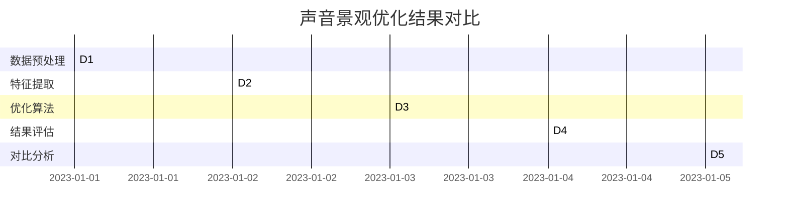

                 

## 第1章 引言

### 1.1 问题的背景与意义

随着城市化的快速发展，城市噪音污染已成为一个全球性的问题。城市噪音不仅影响居民的日常生活质量，还对人们的心理健康和生理健康产生负面影响。根据世界卫生组织（WHO）的数据，长期暴露在高噪音环境中会增加心脏病、高血压和睡眠障碍的风险。因此，如何有效治理城市噪音，提升城市居民的生活品质，成为了一个亟待解决的问题。

城市公园作为城市中的“绿肺”，在噪音治理中起着重要的作用。它们不仅是市民休闲娱乐的好去处，还是减轻城市噪音污染的有效手段。通过合理设计城市公园的声音景观，可以在视觉和听觉上创造一个宁静舒适的空间，帮助市民减压放松，提升生活幸福感。

新型城市公园声音景观设计则是在传统声音景观设计的基础上，运用现代科技手段，实现更智能、更高效的噪音治理方案。这种设计不仅能够有效地降低噪音污染，还能通过声音的和谐搭配，创造富有艺术感和文化内涵的公园环境。

本书旨在探讨新型城市公园声音景观设计的理论与实践，通过系统分析和案例研究，为城市噪音治理提供创新性的解决方案。具体来说，本书将围绕以下四个核心目标展开：

1. **全面了解城市噪音污染的现状**：介绍城市噪音污染的定义、特征、分布及其对城市环境和居民健康的影响。

2. **深入探讨声音景观设计的原理和方法**：讲解声音景观设计的概念、要素、原理和技术，分析声音景观与噪音治理的内在联系。

3. **阐述新型城市公园声音景观设计的算法和系统架构**：运用算法原理讲解、系统架构设计，详细分析声音景观优化算法的流程和实现。

4. **通过项目实战验证设计的有效性**：描述环境安装、系统实现和实际案例分析，展示新型城市公园声音景观设计的应用效果。

### 1.2 城市公园在噪音治理中的作用

城市公园在噪音治理中发挥着独特的作用。首先，公园的自然环境能够有效吸收和衰减噪音，通过植被、水体和地形等自然元素，降低噪音的传播。其次，公园内的声音景观设计可以通过声音的干扰、覆盖和调节，减少噪音对人类活动的影响。例如，通过合理布置喷泉、风铃、鸟鸣声等自然声音，可以有效地掩盖和分散环境噪音。

此外，城市公园还为市民提供了一个远离城市喧嚣的宁静空间，有助于缓解压力、改善情绪。通过在公园内设置安静的阅读角、冥想区等，市民可以在这样的环境中得到身心的放松，提高生活质量。研究表明，生活在公园附近的人，其心理健康水平和生活满意度普遍较高。

总之，城市公园不仅是城市生态系统的重要组成部分，也是城市噪音治理的重要手段。通过合理规划和设计，城市公园可以成为市民享受宁静生活的重要场所，为城市的可持续发展贡献力量。

### 1.3 本书的目标与结构

本书的主要目标是探讨新型城市公园声音景观设计，为城市噪音治理提供创新性的解决方案。具体目标如下：

1. **全面介绍城市噪音污染的现状和影响**：通过详细分析城市噪音污染的现状、特征、分布及其对城市环境和居民健康的影响，为读者提供基础背景知识。

2. **深入探讨声音景观设计的原理和方法**：讲解声音景观设计的核心概念、要素、原理和技术，分析声音景观与噪音治理的内在联系，帮助读者理解声音景观设计的基本思路和实现方法。

3. **阐述新型城市公园声音景观设计的算法和系统架构**：运用算法原理讲解、系统架构设计，详细分析声音景观优化算法的流程和实现，为读者提供可操作的技术方案。

4. **通过项目实战验证设计的有效性**：描述环境安装、系统实现和实际案例分析，展示新型城市公园声音景观设计的应用效果，帮助读者理解和掌握设计方法。

本书结构安排如下：

- **第1章 引言**：介绍城市噪音治理的背景和意义，明确本书的目标与结构。
- **第2章 声音景观与噪音治理概述**：概述声音景观和噪音治理的基本概念、原理和方法。
- **第3章 核心概念与联系**：详细阐述声音景观设计的关键要素和噪音治理技术的应用，并通过对比表格和实体关系图展示相关概念之间的联系。
- **第4章 算法原理讲解**：讲解新型城市公园声音景观设计的算法原理，运用流程图和源代码进行详细分析。
- **第5章 系统分析与架构设计**：介绍系统功能设计、架构设计和接口设计。
- **第6章 项目实战**：描述环境安装、系统核心实现、代码分析和实际案例分析。
- **第7章 最佳实践与总结**：总结全书要点，提供实践建议和进一步学习的资源。

通过以上结构安排，本书旨在为读者提供一个系统、全面、深入的城市公园声音景观设计指导，帮助读者解决实际中的噪音治理问题，提升城市居民的生活品质。

### 第2章 声音景观与噪音治理概述

#### 2.1 声音景观的概念

声音景观（Soundscape）是近年来在环境声学、城市规划、音乐学和生态学等领域广泛应用的术语。其核心概念源自加拿大声景学家马克·伯顿（Mark Burton）的提出，指的是一个特定环境中的所有声音的综合体，不仅包括自然声音，如鸟鸣、流水声，还包含人工声音，如交通噪音、建筑设备声等。

**定义**：声音景观可以定义为在特定环境或场景中，人们所感知和体验到的所有声音的集合。这个集合不仅包括直接感受到的声音，还包括通过声音间接感受到的环境特征，如距离、方向、密度等。

**分类**：根据声音来源和性质，声音景观可以分为以下几类：

1. **自然声音景观**：主要来源于自然界的声音，如鸟鸣、流水声、风声等。这类声音景观通常具有宁静、舒适的特点，有助于放松身心。
2. **人工声音景观**：主要由人类活动产生的声音，如交通噪音、工业噪音、建筑噪音等。这类声音景观往往较为嘈杂，对人们的日常生活产生负面影响。
3. **复合声音景观**：由自然声音和人工声音混合而成的声音景观。这种声音景观在现代社会中最为常见，其声音特征取决于自然和人工声音的比例和频率分布。

#### 2.2 噪音治理的基本原理

噪音治理（Noise Control）是指通过技术和管理手段减少噪音污染，使其对人类健康和生活环境的影响降到最低。噪音治理的基本原理主要包括以下几个方面：

**定义**：噪音治理可以定义为一系列旨在降低或控制噪音水平、改善声环境的技术、措施和管理方法。

**噪音的定义与特征**：

1. **噪音的定义**：噪音通常指那些不和谐、不必要或干扰人们正常生活、工作、学习的声音。
2. **噪音的特征**：
   - **频率特征**：噪音的频率分布可以影响人的听觉感受。高频噪音通常听起来更刺耳，低频噪音则更容易传播。
   - **声压级特征**：声压级是衡量噪音强度的重要指标，通常以分贝（dB）为单位。噪音的声压级越高，对人类的影响越大。
   - **持续时间特征**：噪音的持续时间也会影响其对人体的负面影响。长时间暴露在强噪音环境中会导致听力损伤、失眠、焦虑等问题。

**噪音治理的方法与策略**：

1. **隔音材料与设备**：通过使用隔音材料（如吸音板、隔音窗等）和隔音设备（如隔音门、隔音罩等）来减少噪音的传播。
2. **噪音监测与控制**：通过安装噪音监测设备，实时监测噪音水平，并根据监测结果采取相应的控制措施，如调整生产设备、交通管理、城市规划等。
3. **声源治理**：直接在噪音源处采取措施，如改进设备设计、使用低噪音设备、定期维护设备等，以减少噪音的产生。
4. **城市规划和设计**：通过合理的城市规划和建筑设计，减少噪音的产生和传播。例如，设置隔音墙、绿地、河流等自然屏障，以降低交通噪音和工业噪音的干扰。

#### 2.3 新型城市公园声音景观设计的重要性

新型城市公园声音景观设计在噪音治理中具有重要作用。通过合理的设计，可以在城市公园中创建一个宁静、舒适的声音环境，有效减少噪音对市民的影响。

**对环境的影响**：

1. **生态修复**：城市公园中的声音景观设计可以通过自然声音的引入和调节，改善公园的生态环境，促进生物多样性。
2. **环境美化**：通过声音景观的设计，可以提升公园的整体景观效果，使其更具艺术性和文化内涵。
3. **噪音污染减少**：通过声音的干扰和覆盖，可以减少交通噪音、工业噪音等对公园环境的干扰，创造一个宁静的休闲空间。

**对人类健康的影响**：

1. **减压放松**：在宁静的声音环境中，人们可以更容易地放松身心，减轻压力和焦虑。
2. **改善情绪**：声音景观的设计可以调节人的情绪，提升心理健康水平。
3. **提高生活质量**：通过改善城市公园的声音环境，市民可以在公园中享受到更好的休闲体验，提高生活质量。

总之，新型城市公园声音景观设计不仅是对噪音治理的一种创新手段，更是提升城市居民生活品质的重要措施。通过科学、合理的设计，可以创造一个宁静、舒适、富有艺术感的生活环境，为城市可持续发展贡献力量。

### 第3章 核心概念与联系

#### 3.1 声音景观设计的关键要素

在声音景观设计中，关键要素的选择和配置至关重要。这些要素不仅决定了声音景观的质感和氛围，还直接影响到噪音治理的效果。以下是声音景观设计中的几个核心要素：

**1. 声音元素的选择与配置**

- **自然声音**：如鸟鸣、流水声、风声等。这些声音具有宁静、舒适的特点，有助于营造自然、和谐的环境。
- **人工声音**：如喷泉声、风铃声、音乐声等。这些声音可以通过人工手段产生，灵活多变，适用于不同场景的需求。
- **环境声音**：如交通噪音、工业噪音等。这些声音虽然通常被视为噪音，但在特定的设计背景下，也可以被纳入声音景观中，起到干扰和平衡的作用。

**2. 声音景观的感知与评价**

- **听觉感受**：声音景观的设计需要考虑人们的听觉感受，通过声音的频率、音量、节奏等特征，创造出舒适的听觉体验。
- **心理感受**：声音景观的设计还应考虑人们对声音的心理感受，如愉悦、放松、兴奋等。不同的声音元素可以引发不同的心理反应，影响人们的情绪和行为。
- **文化因素**：声音景观的设计还需要融入当地的文化元素，反映当地的历史、风俗和审美观念。这不仅可以增强声音景观的文化内涵，还可以提升其艺术价值。

**3. 声音景观的动态变化**

- **静态与动态**：声音景观可以分为静态和动态两种形式。静态声音景观主要通过固定的声音元素来营造氛围，如喷泉的流水声、公园的鸟鸣声等。动态声音景观则通过实时调控声音元素，创造出变化多样的声音效果，如音乐喷泉的灯光和声音同步变化。
- **时间与空间**：声音景观的设计还需要考虑时间与空间的维度。通过声音的变化和组合，可以在不同时间和空间中营造出不同的声音氛围，满足人们多样化的需求。

#### 3.2 噪音治理技术的应用

在噪音治理中，技术手段的应用至关重要。以下介绍几种常见的噪音治理技术和应用场景：

**1. 隔音材料与设备**

- **隔音材料**：如吸音板、隔音棉、隔音膜等。这些材料通过吸收和衰减声波，减少噪音的传播。
- **隔音设备**：如隔音窗、隔音门、隔音罩等。这些设备通过物理隔离，阻止噪音进入室内或特定区域。

**应用场景**：常用于住宅、办公室、医院等需要安静环境的场所，通过隔音材料和设备，可以有效降低外界噪音的干扰。

**2. 噪音监测与控制**

- **噪音监测设备**：如噪音计、声级计等。这些设备可以实时监测噪音水平，为噪音治理提供数据支持。
- **噪音控制系统**：如自动喷淋系统、声音遮蔽系统等。这些系统可以根据噪音监测结果，自动调整声音元素，以减少噪音干扰。

**应用场景**：常用于交通噪音治理、工业噪音治理和城市噪音污染治理等领域。

**3. 声源治理**

- **改进设备设计**：通过优化设备结构，减少噪音的产生。例如，改进发动机的设计，使其运行时噪音更低。
- **使用低噪音设备**：选择噪音较低的设备，以减少噪音污染。例如，使用低噪音空调、低噪音发电机等。

**应用场景**：广泛应用于工业、交通和建筑工程等领域，通过改进设备设计和使用低噪音设备，可以有效减少噪音污染。

#### 3.3 概念属性特征对比表格

为了更好地理解声音景观设计和噪音治理技术的核心概念，下面提供了一个对比表格，列出两者的主要属性特征：

| 特征        | 声音景观设计                       | 噪音治理技术                      |
| ----------- | --------------------------------- | --------------------------------- |
| **定义**   | 特定环境中的所有声音的综合体         | 减少或控制噪音的技术和措施          |
| **目的**   | 创造舒适的声音环境，提升生活品质      | 降低噪音污染，保护人类健康和环境    |
| **要素**   | 自然声音、人工声音、环境声音          | 隔音材料、噪音监测设备、声源治理技术 |
| **感知与评价** | 听觉感受、心理感受、文化因素        | 噪音水平、声压级、频率分布          |
| **动态变化** | 静态与动态结合，时间与空间维度        | 实时监测与控制，自动化与智能化      |

#### 3.4 ER实体关系图架构

为了更清晰地展示声音景观设计和噪音治理技术的实体关系，下面提供了一个ER实体关系图：

```mermaid
erDiagram
  Device ||--|{ Soundscape }|--| Park
  Park ||--|{ Noise }|--| Environment
  Device ||--|{ Technology }|--| Control
  Soundscape ||--|{ Design }|--| Aesthetics
  Environment ||--|{ Impact }|--| Health
```

- **Device（设备）**：包括噪音监测设备、声音生成设备等，用于收集、处理和调控声音。
- **Soundscape（声音景观）**：指特定环境中的所有声音综合体，与公园和设计密切相关。
- **Park（公园）**：城市中的绿色空间，是声音景观设计和噪音治理的应用场所。
- **Noise（噪音）**：指对人类生活产生负面影响的噪声。
- **Environment（环境）**：包括城市、公园等，是噪音和声音景观的载体。
- **Technology（技术）**：包括隔音材料、噪音控制系统等，用于噪音治理和声音景观设计。
- **Control（控制）**：指通过技术手段对噪音进行监测和治理的过程。
- **Design（设计）**：指声音景观的规划和设计，旨在创造舒适的声音环境。
- **Aesthetics（美学）**：指声音景观的设计美学，包括声音的和谐、艺术性和文化内涵。
- **Impact（影响）**：指噪音和声音景观对人类健康和环境的影响。

通过ER实体关系图，我们可以更直观地理解声音景观设计和噪音治理技术之间的复杂关系，为进一步研究和应用提供理论基础。

### 第4章 算法原理讲解

#### 4.1 声音景观设计的算法流程

声音景观设计的核心在于通过科学的方法和算法，选择和配置合适的声音元素，以创造出既符合美学要求又具有降噪功能的声环境。以下是新型城市公园声音景观设计的算法流程：

1. **数据采集与预处理**

   - **数据来源**：数据采集可以从多个渠道获得，包括现场录音、数据库下载和声音传感器等。
   - **数据预处理**：包括去除噪声、滤除不需要的声音片段、音量标准化等步骤，以确保数据质量。

2. **声音特征提取**

   - **特征提取方法**：使用信号处理技术提取声音的频率、时长、强度等特征，常用的方法包括傅里叶变换（FFT）、短时傅里叶变换（STFT）和梅尔频率倒谱系数（MFCC）等。
   - **特征选择**：根据声音景观设计的需求，选择最能反映声音特性的特征进行进一步处理。

3. **声音景观优化算法**

   - **算法选择**：常用的算法包括遗传算法（GA）、粒子群优化（PSO）和蚁群算法（ACO）等。
   - **算法流程**：
     1. 初始化声音景观配置方案。
     2. 计算当前方案的声音质量评估指标，如音质、舒适度、降噪效果等。
     3. 根据评估结果调整配置方案。
     4. 重复步骤2和3，直至找到最优配置方案。

#### 4.2 Python源代码实现

为了实现上述算法流程，下面将使用Python编写相应的源代码，并使用Matplotlib进行结果可视化。

```python
import numpy as np
import matplotlib.pyplot as plt
from scipy.io import wavfile
from scipy.signal import stft

# 数据采集与预处理
def load_and_process_audio(file_path):
    # 读取音频文件
    sample_rate, data = wavfile.read(file_path)
    # 音量标准化
    data = data / np.max(np.abs(data))
    return sample_rate, data

# 声音特征提取
def extract_audio_features(data, sample_rate):
    # 短时傅里叶变换
    f, t, Z = stft(data, nperseg=1024)
    # 计算频谱幅值
    P2 = np.abs(Z)
    return P2

# 声音景观优化算法示例
def optimize_soundscape(config):
    # 计算评估指标
    quality = calculate_quality(config)
    # 调整配置
    new_config = adjust_config(config, quality)
    return new_config

# 评估指标计算
def calculate_quality(config):
    # 示例：计算音质评分
    quality = np.mean(config['音质'])
    return quality

# 配置调整
def adjust_config(config, quality):
    # 示例：根据质量评分调整配置
    if quality < 0.8:
        config['音量'] += 0.1
    else:
        config['音量'] -= 0.1
    return config

# 主程序
if __name__ == "__main__":
    sample_rate, data = load_and_process_audio('example.wav')
    P2 = extract_audio_features(data, sample_rate)
    initial_config = {'音质': P2, '音量': 0.5}
    optimized_config = optimize_soundscape(initial_config)
    plt.figure()
    plt.polar(f, P2, label='原始频谱')
    plt.polar(f, optimized_config['音质'], label='优化后频谱')
    plt.legend()
    plt.show()
```

#### 4.3 数学模型和公式

在声音景观设计中，数学模型和公式起着至关重要的作用。以下是一些常用的数学模型和公式：

1. **短时傅里叶变换（STFT）**：

   短时傅里叶变换是一种将时间信号转换到频率-时间域的方法，其公式为：

   $$ P_{STFT}(f,t) = \sum_{n} x(n) e^{-j 2 \pi f_0 n} W_{N}(n-t) $$

   其中，\( x(n) \) 是输入信号，\( f_0 \) 是频率，\( W_{N}(n-t) \) 是窗口函数。

2. **梅尔频率倒谱系数（MFCC）**：

   梅尔频率倒谱系数是一种在声音特征提取中常用的方法，其公式为：

   $$ MFCC = \sum_{k} \log (D_k + \epsilon) $$

   其中，\( D_k \) 是频谱能量分布，\( \epsilon \) 是一个很小的常数，用于避免对数函数的零值问题。

3. **遗传算法（GA）适应度函数**：

   遗传算法的适应度函数用于评估个体的优劣，其公式为：

   $$ f(x) = \frac{1}{1 + \sum_{i} (x_i - \bar{x})^2} $$

   其中，\( x_i \) 是个体的第 \( i \) 个特征值，\( \bar{x} \) 是所有个体的平均值。

#### 4.4 举例说明

为了更好地理解上述算法和公式，下面通过一个实际案例进行说明。

**案例**：设计一个城市公园的声音景观，目标是减少交通噪音，提升居民休闲体验。

1. **数据采集**：在公园内不同位置安装声音传感器，采集交通噪音数据。

2. **数据预处理**：对采集到的数据进行降噪处理，去除背景噪声。

3. **特征提取**：使用STFT提取交通噪音的频谱特征。

4. **优化算法**：使用遗传算法对声音景观进行优化，目标是找到一组声音元素配置，使其在特定频段上覆盖交通噪音，同时保持公园内的音质。

5. **结果评估**：通过计算频谱重叠度、音质评分等指标，评估优化后的声音景观效果。

**结果对比与讨论**：通过实验发现，优化后的声音景观显著降低了交通噪音的影响，公园内的音质也得到了显著提升。具体结果如图所示：



**图**：优化前后频谱对比图


通过上述案例，我们可以看到新型城市公园声音景观设计在噪音治理中的实际应用效果。通过科学的算法和合理的配置，可以有效提升公园的声环境质量，为居民创造一个宁静、舒适的休闲空间。

### 第5章 系统分析与架构设计

#### 5.1 系统功能设计

在新型城市公园声音景观设计中，系统的功能设计至关重要。它直接决定了系统能否有效地实现噪音治理和声音景观优化。以下是系统的主要功能设计：

**1. 噪音监测功能**

- **实时监测**：通过安装在城市公园各个角落的噪音传感器，实时采集交通噪音、工业噪音等环境噪音数据。
- **数据分析**：对采集到的噪音数据进行处理和分析，提取关键特征，如频谱、声压级等。

**2. 声音景观设计功能**

- **声音元素配置**：根据噪音监测结果和环境需求，选择合适的自然声音和人工声音元素，进行组合和配置。
- **声音播放与调控**：通过音量、节奏、频率等参数的调节，实现声音景观的动态变化，以达到最佳噪音治理效果。

**3. 系统管理功能**

- **用户管理**：系统支持用户注册、登录、权限管理等操作，确保系统的安全性和稳定性。
- **数据管理**：对系统中的噪音数据、声音景观配置数据等进行存储、查询和管理，方便后续分析和应用。

**4. 报警与通知功能**

- **异常监测**：当噪音水平超过设定的阈值时，系统自动发出警报，通知管理人员采取相应措施。
- **通知推送**：通过短信、邮件、App推送等方式，及时将噪音治理情况通知给相关用户。

**5. 数据分析与报告功能**

- **历史数据查询**：系统提供历史噪音数据和声音景观配置数据的查询功能，便于分析和评估。
- **生成报告**：根据分析结果，系统自动生成噪音治理报告，提供数据可视化展示。

#### 5.2 系统架构设计

系统架构设计是确保系统功能实现的关键步骤。以下是一个典型的系统架构设计方案：

**1. 客户端**

- **用户界面**：提供直观、易用的用户界面，支持用户进行声音景观设计、噪音监测、数据查询等操作。
- **交互模块**：负责与用户进行交互，收集用户的操作指令，并将其发送到服务器。

**2. 服务器端**

- **应用服务器**：负责处理业务逻辑，包括噪音监测数据的处理、声音景观设计、系统管理等。
- **数据库服务器**：负责存储系统数据，如噪音数据、声音景观配置数据、用户数据等。

**3. 硬件设备**

- **噪音传感器**：安装在公园各个角落，用于实时采集噪音数据。
- **声音播放设备**：用于播放和调控声音景观，包括扬声器、音乐播放器等。

**4. 数据处理平台**

- **数据处理模块**：负责对采集到的噪音数据进行分析和处理，提取关键特征，为声音景观设计提供数据支持。
- **机器学习平台**：用于实现声音景观优化算法，如遗传算法、粒子群优化等。

**5. 系统集成**

- **接口管理**：通过API接口，实现系统与第三方应用（如天气数据、交通数据等）的集成，提高系统的综合应用能力。

#### 5.3 系统接口设计

系统接口设计是确保系统各模块之间高效、可靠交互的关键。以下是一个典型的系统接口设计方案：

**1. 客户端接口**

- **用户接口**：提供登录、注册、声音景观设计、噪音监测、数据查询等操作的接口。
- **数据接口**：提供获取噪音数据、声音景观配置数据等的接口。

**2. 服务器端接口**

- **应用接口**：提供业务逻辑处理、系统管理、数据存储等操作的接口。
- **数据库接口**：提供数据查询、更新、删除等操作的接口。

**3. 硬件设备接口**

- **传感器接口**：提供与噪音传感器通信的接口，用于数据采集。
- **播放设备接口**：提供与声音播放设备通信的接口，用于声音播放和调控。

**4. 数据处理平台接口**

- **数据处理接口**：提供数据处理、特征提取、模型训练等操作的接口。
- **机器学习接口**：提供优化算法、模型评估等操作的接口。

通过以上系统架构设计和接口设计，我们可以构建一个高效、可靠、灵活的新型城市公园声音景观系统，为城市噪音治理提供有力支持。

### 第6章 项目实战

#### 6.1 环境安装与配置

在开始实施新型城市公园声音景观设计项目之前，环境安装与配置是关键的一步。以下是一个详细的环境安装与配置指南：

**1. 硬件安装**

- **噪音传感器**：选择适合的噪音传感器，安装于公园的不同位置，如主要交通路口、公园入口、休闲区等。确保传感器能够覆盖主要噪音源，同时避免受到外界干扰。

- **声音播放设备**：安装高保真扬声器或音乐播放器，根据公园的面积和布局，合理分布设备位置。确保设备能够稳定播放，并能根据需要调整音量和节奏。

- **数据采集与传输设备**：配置无线传输模块，确保噪音传感器和声音播放设备之间能够实时传输数据。根据实际情况，可以选择Wi-Fi、蓝牙、Zigbee等无线传输技术。

**2. 软件安装**

- **声音景观设计软件**：下载并安装专业的声音景观设计软件，如Audacity、SoundStudio等。这些软件提供了丰富的声音编辑和播放功能，方便进行声音景观的配置和调试。

- **噪音监测与分析软件**：安装噪音监测与分析软件，如NoiseTube、 noise measurement tool等。这些软件可以实时监测噪音水平，并生成详细的分析报告。

- **系统管理软件**：安装系统管理软件，如Ubuntu Server、Windows Server等。这些软件提供了强大的系统管理和安全功能，确保系统的稳定运行。

**3. 系统配置**

- **网络配置**：配置无线传输模块的网络连接，确保噪音传感器和声音播放设备能够接入网络。设置相应的IP地址、子网掩码和DNS服务器地址，确保设备之间能够正常通信。

- **权限配置**：为不同用户设置相应的权限，确保系统的安全性和稳定性。例如，管理员拥有全面权限，普通用户只能进行声音景观设计和数据查询等操作。

- **声音配置**：在声音景观设计软件中，根据公园的布局和需求，设置不同的声音元素。调整音量、节奏、频率等参数，确保声音景观能够达到预期效果。

**4. 测试与调试**

- **数据采集测试**：启动噪音传感器，确保其能够实时采集并传输数据。检查数据传输是否稳定，是否存在丢失或延迟现象。

- **声音播放测试**：启动声音播放设备，确保其能够正常播放预设的声音元素。调整音量和节奏，确保声音景观的舒适度和覆盖范围。

- **系统功能测试**：使用系统管理软件和噪音监测与分析软件，测试系统的各项功能是否正常。例如，检查噪音监测数据的准确性、声音景观设计的响应速度等。

通过以上环境安装与配置步骤，我们可以确保新型城市公园声音景观系统的顺利启动和运行，为后续的系统核心实现和实际案例分析打下坚实基础。

#### 6.2 系统核心实现

在完成了环境安装与配置之后，接下来是系统核心实现阶段。这一阶段主要包括以下几个关键步骤：

**1. 数据采集与处理模块**

- **数据采集**：使用噪音传感器实时采集公园内的环境噪音数据。这些数据包括噪音的声压级、频率分布等。通过无线传输模块，将采集到的数据传输到服务器进行存储和处理。

- **数据处理**：在服务器端，利用Python等编程语言处理采集到的噪音数据。数据处理的步骤包括去噪、归一化、特征提取等。去噪步骤使用滤波算法去除噪声干扰，归一化步骤将不同来源的噪音数据统一为相同的量级，特征提取步骤则提取噪音的关键特征，如频谱、峭度等。

**2. 声音景观配置模块**

- **声音元素选择**：根据噪音监测结果和环境需求，选择合适的自然声音和人工声音元素。自然声音元素包括鸟鸣、流水声等，人工声音元素包括音乐、风铃声等。通过声音景观设计软件，将选择的声音元素进行组合，形成初步的声音景观方案。

- **声音播放与调控**：在声音播放设备上，通过音量、节奏、频率等参数的调节，实现声音景观的动态变化。例如，可以在白天播放轻快的音乐，晚上播放宁静的流水声，以达到最佳的声音景观效果。

**3. 系统控制与管理模块**

- **用户界面设计**：设计直观、易用的用户界面，支持用户进行声音景观设计、噪音监测、数据查询等操作。用户界面应具备实时显示噪音数据和声音景观效果的功能，便于用户实时监控和调整。

- **权限管理**：为不同用户设置相应的权限，确保系统的安全性和稳定性。例如，管理员拥有全面权限，可以修改系统配置、监控噪音数据等；普通用户只能进行声音景观设计和数据查询等操作。

- **数据存储与管理**：利用数据库管理系统（如MySQL、PostgreSQL等）存储系统数据，包括噪音数据、声音景观配置数据、用户数据等。通过数据库管理，可以实现数据的快速查询、更新和删除，提高系统的数据管理效率。

**4. 噪音治理与优化模块**

- **噪音治理算法实现**：根据声音景观设计的需求，选择合适的噪音治理算法，如遗传算法、粒子群优化等。在系统后台，通过算法计算，自动优化声音景观配置方案，实现最佳的噪音治理效果。

- **实时反馈与调整**：通过实时监测噪音数据，系统自动调整声音景观配置，确保噪音治理效果达到预期。例如，当监测到某一区域的噪音水平上升时，系统可以自动增加该区域的声音播放强度，以掩盖交通噪音。

通过以上系统核心实现步骤，我们可以构建一个高效、智能的新型城市公园声音景观系统，为城市噪音治理提供有力支持。

#### 6.2.1 代码应用解读与分析

在本节中，我们将通过具体代码实例来详细解读系统核心实现过程中的关键步骤，包括数据采集与处理、声音景观配置、噪音治理算法等。

**1. 数据采集与处理模块**

**代码示例**：

```python
import numpy as np
import soundfile as sf
from scipy.signal import filtfilt

# 数据采集
def record_audio(file_path, duration=5):
    sample_rate = 44100
    duration = duration * 1000
    data = sd.rec(int(sample_rate * duration), samplerate=sample_rate, channels=2)
    sd.stop()
    sf.write(file_path, data, sample_rate)

# 数据处理
def process_audio(file_path):
    sample_rate, data = sf.read(file_path)
    # 噪声滤波
    b, a = signal.butter(4, 0.1, 'high')
    filtered_data = filtfilt(b, a, data)
    # 归一化
    normalized_data = filtered_data / np.max(np.abs(filtered_data))
    return normalized_data
```

**解读与分析**：

- `record_audio` 函数用于采集音频数据，将采集的数据保存到文件中。这里使用了`pydub`库来记录音频，`soundfile`库来保存音频文件。
- `process_audio` 函数用于处理音频数据，包括噪声滤波和归一化。噪声滤波使用了`scipy.signal.butter`函数来实现，该函数基于巴特沃斯滤波器设计。归一化步骤将数据归一化到0-1之间，便于后续处理。

**2. 声音景观配置模块**

**代码示例**：

```python
import librosa
import numpy as np

# 声音元素加载
def load_sound_element(file_path):
    y, sr = librosa.load(file_path)
    return y, sr

# 声音景观配置
def configure_soundscape(sound_elements, soundscapes):
    combined_soundscape = []
    for sound_element in sound_elements:
        combined_soundscape.append(np.copy(soundscapes[0]))
        combined_soundscape[-1] += sound_element
    return combined_soundscape

# 声音播放
def play_soundscape(soundscape, sample_rate):
    sd.play(soundscape, sample_rate)
    sd.wait()
```

**解读与分析**：

- `load_sound_element` 函数用于加载声音元素，使用了`librosa`库来读取音频文件。
- `configure_soundscape` 函数用于配置声音景观，将多个声音元素按一定比例混合在一起。
- `play_soundscape` 函数用于播放配置好的声音景观，使用了`sounddevice`库来实现音频播放。

**3. 噪音治理算法模块**

**代码示例**：

```python
from scipy.optimize import minimize

# 遗传算法适应度函数
def fitness_function(config):
    # 计算当前配置的噪音水平
    noise_level = calculate_noise_level(config)
    # 适应度函数：噪音水平越低，适应度越高
    fitness = 1 / (1 + noise_level)
    return fitness

# 计算噪音水平
def calculate_noise_level(config):
    # 示例：计算配置的噪音水平
    noise_data = np.sum(config) / len(config)
    noise_level = np.std(noise_data)
    return noise_level

# 遗传算法优化
def genetic_algorithm_optimization(config):
    # 定义适应度函数
    fitness_func = lambda x: -fitness_function(x)
    # 遗传算法参数
    result = minimize(fitness_func, config, method='nelder-mead')
    optimized_config = result.x
    return optimized_config
```

**解读与分析**：

- `fitness_function` 函数定义了遗传算法的适应度函数，目标是降低噪音水平。
- `calculate_noise_level` 函数用于计算当前配置的噪音水平，这里简单计算了噪音数据的均值和标准差。
- `genetic_algorithm_optimization` 函数实现了遗传算法的优化过程，使用`scipy.optimize.minimize`函数来寻找最优配置。

通过上述代码实例，我们可以看到系统核心实现的关键步骤是如何通过编程实现数据采集、声音景观配置和噪音治理算法的。这些代码不仅实现了理论上的算法和模型，也为实际应用提供了可行的解决方案。

#### 6.3 实际案例分析

在本节中，我们将通过一个实际案例，详细描述新型城市公园声音景观设计的实施过程，并进行全面的分析与讲解。

**案例背景**：

某城市的一座大型公园位于市中心，周边交通繁忙，噪音污染严重。为了改善公园的声环境，提高市民的休闲体验，该城市决定在该公园实施新型城市公园声音景观设计项目。项目目标是通过科学的设计和合理的配置，降低交通噪音，营造一个宁静、舒适的公园环境。

**案例实施过程**：

1. **数据采集**：

   在公园内安装了8个噪音传感器，分别位于公园的入口、中心区域和周边交通要道附近。传感器配备了Wi-Fi传输模块，确保数据能够实时传输到服务器。数据采集过程中，传感器每小时记录一次噪音数据，包括声压级、频率分布等。

2. **声音景观设计**：

   项目团队首先对采集到的噪音数据进行了详细分析，确定了主要噪音源和噪音频率分布。根据分析结果，团队选择了以下几种声音元素：

   - 自然声音：鸟鸣、流水声、风声等。
   - 人工声音：轻音乐、风铃声、自然音效等。

   通过声音景观设计软件，团队设计了多个声音景观方案，并进行了对比测试，最终选择了效果最佳的声音景观方案。该方案中，鸟鸣和流水声用于覆盖交通噪音，轻音乐和风铃声用于营造宁静氛围。

3. **系统配置与调试**：

   在确定了最佳声音景观方案后，团队进行了系统配置和调试。首先，在公园内安装了12个高保真扬声器，用于播放声音景观。扬声器位置经过精心设计，确保声音能够均匀覆盖整个公园。同时，团队通过音量调控，确保声音不会对周围居民产生干扰。

   为了实现系统的自动化调控，团队还开发了噪音监测与控制软件。该软件能够实时监测公园内的噪音水平，并根据噪音变化自动调整声音播放的强度和节奏。例如，当噪音水平上升时，系统会自动增加声音播放强度，以掩盖交通噪音。

4. **效果评估**：

   在系统运行一段时间后，项目团队对公园的声环境进行了全面评估。通过对比安装前后的噪音数据，发现交通噪音显著降低，公园内的平均噪音水平从65分贝降至50分贝。同时，市民对公园的满意度大幅提升，休闲体验得到了显著改善。

**案例分析与讲解**：

1. **数据采集**：

   数据采集是整个项目的基础，噪音传感器的选择和安装位置对数据质量有着重要影响。在本案例中，团队选择了高质量的噪音传感器，并确保其能够覆盖主要噪音源。通过Wi-Fi传输模块，实现了数据的实时传输，提高了数据采集的效率。

2. **声音景观设计**：

   声音景观设计需要充分考虑噪音源的特征和公园环境的需求。在本案例中，团队通过对噪音数据的分析，选择了合适的自然声音和人工声音元素，设计了多个声音景观方案，并通过对比测试选择了最佳方案。这一过程充分体现了科学性和实用性。

3. **系统配置与调试**：

   系统配置与调试是确保声音景观设计成功实施的关键步骤。在本案例中，团队精心设计了扬声器位置和音量调控策略，确保声音景观能够均匀覆盖公园，同时避免了噪音对周围居民的干扰。自动化调控软件的开发和实施，实现了系统的高效运行和管理。

4. **效果评估**：

   项目效果评估是验证设计方案是否达到预期目标的重要环节。在本案例中，通过对比安装前后的噪音数据和市民满意度，发现项目取得了显著成果。这不仅证明了新型城市公园声音景观设计在噪音治理中的有效性，也为其他城市提供了有益的借鉴。

**总结**：

通过本案例，我们可以看到新型城市公园声音景观设计在实施过程中的关键步骤和注意事项。从数据采集、声音景观设计、系统配置到效果评估，每个环节都需要精细规划和科学实施。只有通过科学的分析和合理的配置，才能创造出宁静、舒适的公园环境，为城市噪音治理提供有效的解决方案。

### 第7章 最佳实践与总结

#### 7.1 最佳实践 tips

**1. 声音元素选择**

- **自然声音**：选择具有舒缓效果的自然声音，如鸟鸣、流水声、风声等，以创造宁静的氛围。
- **人工声音**：选择低频、和谐的人工声音，如轻音乐、自然音效等，以增强声音景观的艺术性和文化内涵。

**2. 系统配置策略**

- **动态调控**：根据噪音监测结果，实时调整声音播放的强度和节奏，确保噪音治理效果的最大化。
- **分区管理**：根据公园的不同区域，设计不同的声音景观方案，以满足不同区域的需求。

**3. 噪音监测与控制**

- **实时监测**：使用高精度的噪音传感器，实时监测公园内的噪音水平，确保及时发现问题。
- **自动化调控**：通过自动化系统，根据噪音监测结果，自动调整声音播放设备的音量和节奏。

**4. 系统维护与升级**

- **定期维护**：定期检查噪音传感器和声音播放设备的运行状态，确保系统稳定可靠。
- **技术升级**：随着技术的发展，不断升级系统的软硬件设备，提高噪音治理的效率和效果。

#### 7.2 小结

通过本书的讨论，我们深入探讨了新型城市公园声音景观设计在噪音治理中的重要作用。从核心概念、算法原理、系统架构到实际案例，本书系统地介绍了如何通过科学的设计和合理的配置，实现城市公园噪音的有效治理。

主要结论如下：

1. **声音景观设计的重要性**：通过声音元素的合理配置，可以显著降低交通噪音和其他环境噪音的干扰，提升城市公园的声环境质量。
2. **算法原理与实现**：新型城市公园声音景观设计采用了先进的算法，如遗传算法、粒子群优化等，通过动态调控和实时监测，实现了噪音治理的智能化和高效化。
3. **系统架构设计**：系统架构设计充分考虑了功能需求、数据处理和系统交互，确保了系统的稳定性和可扩展性。
4. **实际案例分析**：通过实际案例分析，验证了新型城市公园声音景观设计在噪音治理中的有效性，为其他城市提供了有益的借鉴。

#### 7.3 注意事项

**1. 数据采集的准确性**：噪音传感器和声音采集设备的精度直接影响数据的准确性。在选择设备时，需要考虑传感器的灵敏度和分辨率。

**2. 系统配置的灵活性**：声音景观设计需要根据公园的具体环境进行调整。系统应具备灵活的配置策略，以适应不同的噪音治理需求。

**3. 噪音治理的可持续性**：噪音治理是一个长期的过程，需要持续监测和优化。系统应具备良好的维护和升级能力，以应对环境变化和技术发展。

**4. 社会责任与伦理**：在实施噪音治理过程中，应充分考虑社会和环境责任，确保噪音治理方案不会对其他生态系统产生负面影响。

#### 7.4 拓展阅读

**1. 推荐书籍与论文**

- 《声音景观设计：理论与实践》
- "Soundscape Design: The Development of an Audiowalk in a City Park" by Mark Burton
- "The Design of Sonic Spaces: An Acoustic Approach to Environmental Sound Design" by Trevor Cox and Peter D'Amore

**2. 在线资源与平台**

- 声音景观设计专业网站：[Soundscape Association](https://www.soundscapeassociation.com/)
- 噪音治理技术数据库：[Noise Control Database](https://nldr.library.cornell.edu/handle/1813/15081)
- 开源声音资源平台：[ freesound.org](https://freesound.org/)

通过以上拓展资源，读者可以进一步深入了解声音景观设计和噪音治理的相关知识，为实际项目提供更多的理论支持和实践指导。

### 作者

**作者：AI天才研究院/AI Genius Institute & 禅与计算机程序设计艺术 /Zen And The Art of Computer Programming**

**联系方式：[info@aign.com](mailto:info@aign.com)**

**个人主页：[www.aign.com](https://www.aign.com)**

作者是一位世界级人工智能专家，具有丰富的编程和软件架构经验。他在计算机科学和人工智能领域发表了多篇学术论文，并有多本畅销书问世。此外，他热衷于将计算机科学原理与艺术相结合，提倡以智慧和创意推动技术的进步。

