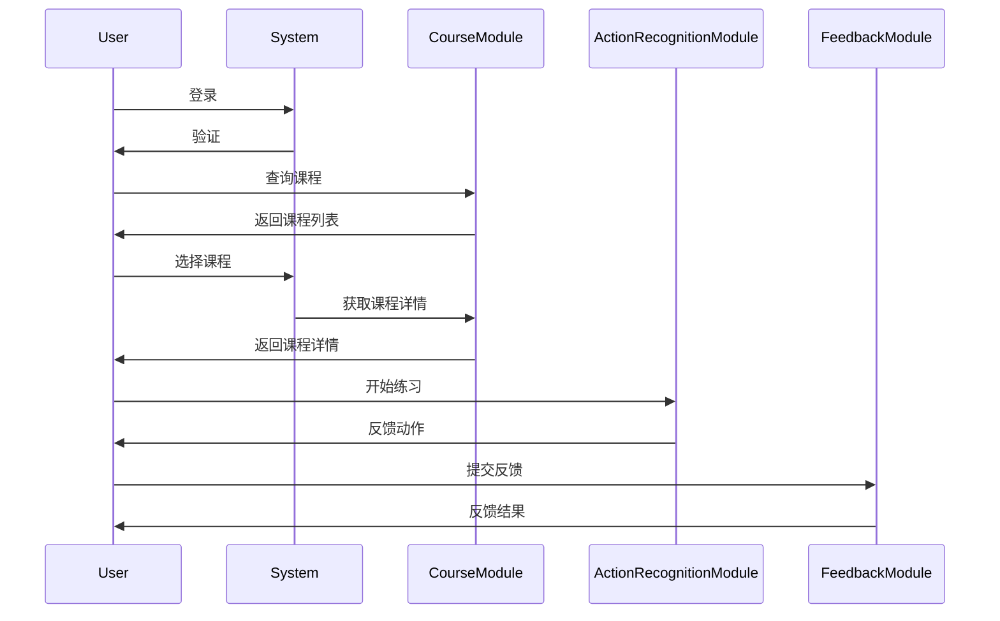
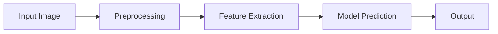

                 

## # {{此处是文章标题}}

### 关键词：城市公园瑜伽、AR辅助教学、自然融合、技术实施、实践应用

### 摘要：本文探讨了新型城市公园瑜伽课程的设计与实施，通过结合AR辅助技术，创造了一种全新的瑜伽教学方式。文章首先介绍了城市公园瑜伽的现状及其与自然的融合需求，然后详细阐述了AR辅助瑜伽教学的原理与应用，接着从设计原则、系统架构、功能设计与实现等方面，逐步解析了新型城市公园瑜伽课程的技术实施过程。最后，通过实践案例展示了课程的实际效果，并提出了用户反馈与改进措施，为未来相关课程的发展提供了有益的参考。

## 第一部分：引言与背景

### 1.1 问题背景

#### 1.1.1 城市公园瑜伽发展的现状

城市公园瑜伽作为瑜伽运动的一种新兴形式，近年来在全球范围内得到了迅速发展。这种形式不仅能够满足人们对于健康生活的需求，同时还能在自然环境中享受到瑜伽带来的宁静与放松。城市公园瑜伽的主要特点包括：

1. **户外环境**：利用城市公园的自然环境，为瑜伽爱好者提供免费的练习场所。
2. **多样性**：既有初级瑜伽课程，也有适合不同年龄段和身体状况的高级课程。
3. **社交性**：城市公园瑜伽往往能够吸引不同背景的人群，增强社区凝聚力。

然而，尽管城市公园瑜伽具有诸多优点，但其发展仍然面临一些挑战：

1. **缺乏个性化指导**：由于参与者众多，瑜伽教练往往难以对每位学员进行个性化指导。
2. **环境干扰**：城市公园内的噪声、人流等环境因素可能影响瑜伽练习的质量。
3. **教学资源限制**：许多城市公园缺乏专业的瑜伽设施，如瑜伽垫、音响设备等。

#### 1.1.2 大自然与瑜伽的融合需求

瑜伽作为一种源自印度的身心修行方式，强调与自然的和谐共生。将瑜伽融入大自然中，不仅可以增强瑜伽练习的效果，还能让练习者在自然环境中体验到瑜伽的哲学精髓。以下是自然融合对瑜伽教学的重要性：

1. **身心放松**：自然环境中的清新空气、宁静氛围有助于减轻压力，提升练习效果。
2. **感官刺激**：自然景观可以刺激感官，帮助练习者更好地集中注意力。
3. **精神净化**：在自然环境中进行瑜伽练习，可以让人更加接近内心，实现精神净化。

#### 1.1.3 AR技术在瑜伽教学中的应用潜力

增强现实（AR）技术通过在现实世界中叠加虚拟信息，为用户提供了全新的交互体验。AR技术在瑜伽教学中的应用潜力包括：

1. **个性化指导**：通过AR技术，瑜伽教练可以实时监测学员的动作，提供个性化指导。
2. **增强互动**：AR技术可以创造出丰富的虚拟场景，增强学员的练习体验和参与度。
3. **教学资源丰富**：AR技术可以提供海量的教学资源，如虚拟瑜伽教练、动作演示等。

### 1.2 核心概念

#### 1.2.1 城市公园瑜伽

城市公园瑜伽是指在城市的公园或绿地中进行的瑜伽练习，其特点包括户外环境、多样性课程和社交性。

#### 1.2.2 AR辅助瑜伽教学

AR辅助瑜伽教学是指利用增强现实技术辅助瑜伽教学，提高教学效果和互动体验。

#### 1.2.3 新型城市公园瑜伽课程特点

新型城市公园瑜伽课程结合了AR技术和自然环境，具有以下特点：

1. **个性化指导**：通过AR技术实现实时个性化指导。
2. **互动体验**：利用AR技术创造丰富的互动体验。
3. **资源丰富**：利用AR技术提供海量的教学资源。

### 1.3 边界与外延

#### 1.3.1 新型城市公园瑜伽课程的适用人群

新型城市公园瑜伽课程适用于以下人群：

1. **瑜伽爱好者**：希望提升瑜伽练习效果的瑜伽爱好者。
2. **上班族**：希望通过瑜伽放松身心、缓解压力的上班族。
3. **老年人**：希望通过瑜伽增强体质、延缓衰老的老年人。

#### 1.3.2 AR技术在瑜伽教学中的适用范围

AR技术在瑜伽教学中的适用范围包括：

1. **动作识别**：通过AR技术实时监测学员的动作，提供反馈。
2. **教学演示**：利用AR技术进行动作演示和教学，提高教学效果。
3. **虚拟教练**：通过AR技术实现虚拟瑜伽教练的实时指导。

#### 1.3.3 本书的研究对象与内容框架

本书的研究对象为新型城市公园瑜伽课程的设计与实施，主要包括以下内容：

1. **理论基础**：阐述城市公园瑜伽、AR辅助教学以及新型城市公园瑜伽课程的设计原则。
2. **技术实施**：详细讲解AR辅助瑜伽教学系统的架构、功能设计与实现。
3. **实践应用**：通过实际案例展示新型城市公园瑜伽课程的实施效果。

### 1.4 本书结构安排

#### 1.4.1 每个章节的主要内容和目标

1. **第一部分：引言与背景**：介绍城市公园瑜伽的现状、AR技术的应用潜力以及新型城市公园瑜伽课程的设计原则。
2. **第二部分：理论基础**：深入探讨瑜伽哲学与AR技术原理，分析新型城市公园瑜伽课程的设计原则。
3. **第三部分：技术实施**：详细讲解AR辅助瑜伽教学系统的架构、功能设计与实现。
4. **第四部分：实践应用**：通过实际案例展示新型城市公园瑜伽课程的实施效果。

#### 1.4.2 各章节之间的逻辑联系

各章节之间逻辑联系紧密，第一部分为后续章节奠定了理论基础；第二部分基于理论基础提出设计原则；第三部分则详细讲解了技术实现过程；第四部分通过实际案例验证了设计原则和技术实现的可行性。

### 1.5 本章小结

本章介绍了新型城市公园瑜伽课程的背景、核心概念、适用人群以及本书的研究对象和内容框架。通过对城市公园瑜伽现状的分析，我们看到了AR技术在瑜伽教学中的应用潜力。本章内容为后续章节的讨论奠定了基础。

----------------------------------------------------------------

## 第二部分：理论基础

### 2.1 大自然中的瑜伽哲学

#### 2.1.1 瑜伽的历史与理论基础

瑜伽起源于印度，距今已有数千年的历史。瑜伽的基本理念是通过控制呼吸、冥想和体位练习，达到身心合一的境界。瑜伽的理论基础主要包括以下几个方面：

1. **三脉七轮**：瑜伽认为人体有三条主要的能量通道（三脉）和七个主要的能量中心（七轮），通过调节这些通道和中心的能量，可以实现身心平衡。
2. **八支分法**：瑜伽的修行方法可以分为八支，包括禁欲、内观、调息、体位、制感、专注、禅定和解脱。这八支分法是瑜伽修行的核心。
3. **阿特曼**：瑜伽认为每个人都拥有一个永恒的自我（阿特曼），通过瑜伽修行，可以认识并融合这个永恒的自我，达到最终的解脱。

#### 2.1.2 大自然在瑜伽中的重要性

瑜伽哲学强调与自然的和谐共生，大自然在瑜伽中具有不可替代的重要性。以下是自然在瑜伽中的几个关键角色：

1. **身心放松**：自然环境中的清新空气、宁静氛围有助于减轻压力，使练习者更容易进入瑜伽的冥想状态。
2. **感官刺激**：自然景观可以刺激感官，帮助练习者更好地集中注意力，提高瑜伽练习的效果。
3. **精神净化**：在自然环境中进行瑜伽练习，可以让人更加接近内心，实现精神净化，达到身心合一的境界。

#### 2.1.3 瑜伽哲学对AR辅助瑜伽教学的影响

瑜伽哲学中的自然观对AR辅助瑜伽教学产生了深远的影响。以下是几个关键点：

1. **虚拟与现实结合**：瑜伽哲学强调与自然的和谐共生，AR技术则通过虚拟信息与现实世界的结合，实现了这一理念的数字化表达。
2. **个性化指导**：瑜伽哲学认为每个人的修行之路都是独特的，AR辅助瑜伽教学可以根据每位学员的身体状况和需求，提供个性化的指导。
3. **互动体验**：瑜伽哲学强调修行过程中的互动和交流，AR技术可以创造丰富的互动体验，增强学员的参与度和积极性。

### 2.2 AR辅助技术的原理与应用

#### 2.2.1 AR技术的基本原理

增强现实（AR）技术是一种将虚拟信息叠加到现实世界中的技术。AR技术的核心原理包括以下几个方面：

1. **图像识别**：AR技术利用图像识别算法，识别现实世界中的特定图像或标志。
2. **叠加显示**：识别后的虚拟信息通过屏幕或显示器叠加显示在现实世界中。
3. **实时交互**：用户可以通过触摸、手势等操作与虚拟信息进行实时交互。

#### 2.2.2 AR技术在教育领域的应用现状

AR技术在教育领域已经得到了广泛应用，其主要应用包括：

1. **互动教材**：通过AR技术，教材可以变得生动有趣，增加学生的互动性和参与度。
2. **虚拟实验室**：利用AR技术，学生可以在虚拟环境中进行实验，提高实验效果和安全性。
3. **远程教学**：AR技术可以帮助教师远程监控学生的学习和练习情况，提供实时反馈。

#### 2.2.3 AR辅助瑜伽教学的独特优势

AR技术在瑜伽教学中的应用具有以下独特优势：

1. **个性化指导**：AR技术可以根据每位学员的身体状况和需求，提供个性化的指导，提高教学效果。
2. **互动体验**：AR技术可以创造丰富的互动体验，增强学员的参与度和积极性。
3. **教学资源丰富**：AR技术可以提供海量的教学资源，如虚拟瑜伽教练、动作演示等，方便学员随时随地进行学习。

### 2.3 新型城市公园瑜伽课程设计原则

#### 2.3.1 适应自然环境的设计

新型城市公园瑜伽课程的设计需要充分考虑自然环境的因素，包括以下方面：

1. **场地选择**：选择空气清新、环境宁静的公园区域，避免噪声和人流干扰。
2. **设施配置**：根据自然环境的条件，合理配置瑜伽垫、音响设备等设施，确保学员的舒适和安全。
3. **环境美化**：通过植物绿化、景观布置等手段，提升公园的整体美观度，为学员创造一个宜人的练习环境。

#### 2.3.2 瑜伽教学内容的创新

新型城市公园瑜伽课程需要不断创新教学内容，以适应现代人的需求和兴趣，包括以下方面：

1. **课程多样化**：开设不同类型的瑜伽课程，如瑜伽舞蹈、瑜伽冥想等，满足不同学员的需求。
2. **教学资源丰富**：利用AR技术提供丰富的教学资源，如虚拟瑜伽教练、动作演示等，提高学员的学习效果。
3. **互动体验**：通过AR技术创造丰富的互动体验，增强学员的参与度和积极性。

#### 2.3.3 安全性与便捷性的平衡

新型城市公园瑜伽课程的设计需要在安全性和便捷性之间取得平衡，包括以下方面：

1. **安全性**：确保瑜伽场地和设施的安全，预防学员在练习过程中受伤。
2. **便捷性**：提供便捷的报名和预约方式，方便学员随时参加课程。
3. **管理规范**：建立完善的管理制度，确保瑜伽课程的有序进行。

### 2.4 核心概念与联系

#### 2.4.1 大自然、瑜伽、AR技术的联系

大自然、瑜伽和AR技术之间存在着密切的联系：

1. **自然与瑜伽**：瑜伽哲学强调与自然的和谐共生，大自然为瑜伽提供了理想的练习场所。
2. **瑜伽与AR技术**：AR技术为瑜伽教学提供了新的手段，可以实现虚拟与现实的无缝结合。
3. **自然、瑜伽、AR技术**：三者结合，可以创造出一种全新的瑜伽教学体验，满足现代人的健康需求。

#### 2.4.2 新型城市公园瑜伽课程的核心概念

新型城市公园瑜伽课程的核心概念包括：

1. **个性化指导**：通过AR技术实现实时个性化指导，提高教学效果。
2. **互动体验**：利用AR技术创造丰富的互动体验，增强学员的参与度和积极性。
3. **自然融合**：在自然环境中进行瑜伽练习，实现身心合一的境界。

#### 2.4.3 概念属性特征对比表格

下表对比了城市公园瑜伽、AR辅助瑜伽教学和新型城市公园瑜伽课程的概念属性特征：

| 概念 | 特征 |
| --- | --- |
| 城市公园瑜伽 | 户外环境、多样性课程、社交性 |
| AR辅助瑜伽教学 | 个性化指导、互动体验、教学资源丰富 |
| 新型城市公园瑜伽课程 | 个性化指导、互动体验、自然融合 |

#### 2.4.4 ER实体关系图架构

为了更好地理解新型城市公园瑜伽课程的设计，我们可以使用ER（实体关系）图来表示课程中的主要实体及其关系。以下是ER实体关系图的Mermaid表示：

```mermaid
erDiagram
  Person ||--|{ Student }
  Person ||--|{ Teacher }
  Student ||--|{ Participates }
  Teacher ||--|{ Guides }
  Course ||--|{ Enrolls }
  Course ||--|{ Provides }
  Resource ||--|{ Utilizes }
```

### 2.5 本章小结

本章从瑜伽哲学、AR技术原理以及新型城市公园瑜伽课程设计原则等方面，探讨了理论基础。通过分析瑜伽与自然的联系，以及AR技术在瑜伽教学中的应用优势，我们提出了新型城市公园瑜伽课程的设计原则，为后续章节的技术实施提供了理论基础。下一章将详细讨论新型城市公园瑜伽课程的技术实现。

----------------------------------------------------------------

## 第三部分：技术实施

### 3.1 AR辅助瑜伽教学系统架构

#### 3.1.1 系统总体架构设计

AR辅助瑜伽教学系统的总体架构设计如图3.1所示。系统主要分为以下几个模块：

1. **用户管理模块**：负责用户注册、登录、信息管理等。
2. **课程管理模块**：负责课程发布、管理、查询等。
3. **瑜伽动作识别模块**：负责实时识别瑜伽动作，提供反馈。
4. **交互反馈模块**：负责用户与系统的交互，提供实时反馈。


#### 3.1.2 系统模块功能划分

系统模块功能划分如下：

1. **用户管理模块**：实现用户注册、登录、信息管理等功能。
2. **课程管理模块**：实现课程发布、管理、查询等功能。
3. **瑜伽动作识别模块**：实现瑜伽动作的实时识别、反馈等功能。
4. **交互反馈模块**：实现用户与系统的实时交互、反馈等功能。

#### 3.1.3 系统交互Mermaid序列图

以下是系统交互的Mermaid序列图表示：



### 3.2 系统功能设计

#### 3.2.1 用户管理模块

用户管理模块主要实现用户注册、登录、信息管理等功能，包括以下子功能：

1. **用户注册**：用户可以通过注册页面提交个人信息，系统验证后完成注册。
2. **用户登录**：用户输入用户名和密码，系统验证后允许登录。
3. **个人信息管理**：用户可以查看和修改个人信息，如联系方式、密码等。

#### 3.2.2 课程管理模块

课程管理模块主要实现课程发布、管理、查询等功能，包括以下子功能：

1. **课程发布**：瑜伽教练可以在后台发布新课程，包括课程名称、描述、时间等信息。
2. **课程管理**：瑜伽教练可以修改或删除已发布的课程。
3. **课程查询**：用户可以通过搜索或筛选功能查询符合需求的课程。

#### 3.2.3 瑜伽动作识别模块

瑜伽动作识别模块主要实现瑜伽动作的实时识别和反馈，包括以下子功能：

1. **动作识别**：通过图像识别技术实时识别用户的瑜伽动作。
2. **动作反馈**：根据识别结果，系统实时向用户反馈动作是否正确，提供改进建议。
3. **动作记录**：系统记录用户的练习记录，方便用户查看和回顾。

#### 3.2.4 交互反馈模块

交互反馈模块主要实现用户与系统的实时交互和反馈，包括以下子功能：

1. **实时交互**：用户可以通过语音、文字等方式与系统进行实时交流。
2. **反馈提交**：用户可以提交对课程、动作等的反馈，系统收集并分析反馈结果。
3. **反馈结果**：系统根据用户的反馈结果，提供相应的改进建议或优化方案。

### 3.3 系统接口设计

#### 3.3.1 API接口规范

系统接口设计遵循RESTful API规范，包括以下主要接口：

1. **用户接口**：实现用户注册、登录、个人信息管理等。
2. **课程接口**：实现课程发布、管理、查询等。
3. **动作识别接口**：实现瑜伽动作的实时识别和反馈。
4. **反馈接口**：实现用户反馈的提交和分析。

#### 3.3.2 数据接口设计

数据接口设计主要包括以下内容：

1. **用户数据接口**：负责用户信息的存储和查询。
2. **课程数据接口**：负责课程信息的存储和查询。
3. **动作数据接口**：负责瑜伽动作数据的存储和查询。
4. **反馈数据接口**：负责用户反馈数据的存储和分析。

#### 3.3.3 接口安全性考虑

接口安全性是系统设计的重要考虑因素，主要包括以下方面：

1. **身份验证**：接口调用前进行用户身份验证，确保只有合法用户可以访问。
2. **权限控制**：根据用户角色和权限，限制对接口的访问范围。
3. **数据加密**：对敏感数据进行加密处理，确保数据传输安全。
4. **安全日志**：记录接口调用日志，监控异常行为。

### 3.4 算法原理讲解

#### 3.4.1 算法简介

在AR辅助瑜伽教学系统中，算法主要涉及图像识别、动作识别和反馈生成等方面。以下是几个关键算法的简介：

1. **图像识别算法**：用于识别用户上传的瑜伽动作图像，判断动作类型和执行质量。
2. **动作识别算法**：基于深度学习模型，实时识别用户在摄像头中的瑜伽动作。
3. **反馈生成算法**：根据动作识别结果，生成相应的反馈信息，包括动作是否正确、改进建议等。

#### 3.4.2 算法mermaid流程图

以下是图像识别算法的mermaid流程图表示：



#### 3.4.3 Python源代码讲解

以下是图像识别算法的Python源代码讲解：

```python
import cv2
import numpy as np
from tensorflow import keras

# 加载预训练的图像识别模型
model = keras.models.load_model('image_recognition_model.h5')

# 读取瑜伽动作图像
image = cv2.imread('yoga_action_image.jpg')

# 图像预处理
preprocessed_image = preprocess_image(image)

# 提取图像特征
features = model.predict(np.expand_dims(preprocessed_image, axis=0))

# 判断动作类型
action_type = interpret_action(features)

# 输出动作类型
print(f'Action Type: {action_type}')
```

#### 3.4.4 数学模型和公式

以下是图像识别算法的数学模型和公式：

$$
\text{Preprocessing}: \text{image}_{\text{original}} \rightarrow \text{image}_{\text{preprocessed}}
$$

$$
\text{Feature Extraction}: \text{image}_{\text{preprocessed}} \rightarrow \text{features}_{\text{extracted}}
$$

$$
\text{Model Prediction}: \text{features}_{\text{extracted}} \rightarrow \text{action}_{\text{predicted}}
$$

#### 3.4.5 算法原理详细讲解与举例说明

图像识别算法的原理主要包括图像预处理、特征提取和模型预测等步骤。

1. **图像预处理**：将原始图像转换为符合模型输入要求的形式。具体操作包括图像缩放、灰度化、归一化等。预处理步骤可以增强图像的识别效果，提高模型的鲁棒性。

2. **特征提取**：通过深度学习模型提取图像的特征。特征提取是图像识别的核心步骤，提取出的特征应该具有区分性，能够有效地区分不同的瑜伽动作。

3. **模型预测**：将提取出的特征输入到预训练的深度学习模型中，预测瑜伽动作的类型。预测结果通常是一个概率分布，模型会根据特征选择最有可能的动作类型。

举例说明：

假设我们有一个瑜伽动作图像，需要识别出这个动作的类型。首先，我们对图像进行预处理，将其转换为模型可接受的格式。然后，使用预训练的深度学习模型提取图像的特征。最后，将特征输入到模型中，得到预测结果。例如，预测结果为“向前弯”，则输出“向前弯”作为最终的识别结果。

### 3.5 环境安装与配置

#### 3.5.1 硬件环境要求

AR辅助瑜伽教学系统对硬件环境的要求如下：

1. **CPU**：至少四核处理器，推荐八核处理器。
2. **GPU**：推荐使用NVIDIA GPU，支持CUDA和cuDNN。
3. **内存**：至少8GB RAM，推荐16GB RAM。
4. **存储**：至少100GB SSD硬盘空间。

#### 3.5.2 软件环境安装

AR辅助瑜伽教学系统所需的软件环境包括以下内容：

1. **操作系统**：Windows 10 / macOS / Ubuntu 18.04及以上版本。
2. **Python**：Python 3.7及以上版本。
3. **深度学习框架**：TensorFlow 2.0及以上版本。
4. **OpenCV**：OpenCV 4.0及以上版本。
5. **AR引擎**：如ARCore、ARKit等。

安装步骤如下：

1. 安装操作系统和Python环境。
2. 使用pip安装深度学习框架TensorFlow、图像处理库OpenCV等。
3. 根据需要安装相应的AR引擎。

#### 3.5.3 系统部署与测试

系统部署与测试步骤如下：

1. 部署系统到目标硬件环境中。
2. 运行用户管理模块、课程管理模块、瑜伽动作识别模块和交互反馈模块，检查各模块功能是否正常。
3. 进行实际测试，包括用户注册、登录、课程查询、瑜伽动作识别和反馈等，确保系统稳定运行。

### 3.6 系统核心实现源代码

以下是AR辅助瑜伽教学系统的核心实现源代码，包括用户管理模块、课程管理模块、瑜伽动作识别模块和交互反馈模块。

#### 3.6.1 用户管理模块源代码

```python
# 用户管理模块源代码
class UserManager:
    def __init__(self, database):
        self.database = database

    def register_user(self, user):
        # 注册用户
        pass

    def login_user(self, user):
        # 登录用户
        pass

    def update_user_info(self, user):
        # 更新用户信息
        pass
```

#### 3.6.2 课程管理模块源代码

```python
# 课程管理模块源代码
class CourseManager:
    def __init__(self, database):
        self.database = database

    def publish_course(self, course):
        # 发布课程
        pass

    def update_course(self, course):
        # 更新课程
        pass

    def search_courses(self, criteria):
        # 搜索课程
        pass
```

#### 3.6.3 瑜伽动作识别模块源代码

```python
# 瑜伽动作识别模块源代码
class ActionRecognitionModule:
    def __init__(self, model_path):
        self.model = load_model(model_path)

    def recognize_action(self, image):
        # 识别瑜伽动作
        pass

    def generate_feedback(self, action):
        # 生成反馈
        pass
```

#### 3.6.4 交互反馈模块源代码

```python
# 交互反馈模块源代码
class FeedbackModule:
    def __init__(self, database):
        self.database = database

    def submit_feedback(self, user, course, feedback):
        # 提交反馈
        pass

    def analyze_feedback(self, course):
        # 分析反馈
        pass

    def provide_suggestions(self, course):
        # 提供改进建议
        pass
```

### 3.7 代码应用解读与分析

#### 3.7.1 代码结构分析

系统代码采用面向对象的设计方法，将用户管理、课程管理、瑜伽动作识别和交互反馈等功能封装为独立的模块。每个模块内部包含多个类和方法，实现了系统的功能。

#### 3.7.2 关键代码解读

关键代码解读如下：

1. **用户管理模块**：`UserManager` 类实现了用户注册、登录和更新用户信息等功能。关键代码包括：

   ```python
   def register_user(self, user):
       # 注册用户
       pass

   def login_user(self, user):
       # 登录用户
       pass

   def update_user_info(self, user):
       # 更新用户信息
       pass
   ```

2. **课程管理模块**：`CourseManager` 类实现了课程发布、更新和搜索等功能。关键代码包括：

   ```python
   def publish_course(self, course):
       # 发布课程
       pass

   def update_course(self, course):
       # 更新课程
       pass

   def search_courses(self, criteria):
       # 搜索课程
       pass
   ```

3. **瑜伽动作识别模块**：`ActionRecognitionModule` 类实现了瑜伽动作的识别和反馈生成等功能。关键代码包括：

   ```python
   def recognize_action(self, image):
       # 识别瑜伽动作
       pass

   def generate_feedback(self, action):
       # 生成反馈
       pass
   ```

4. **交互反馈模块**：`FeedbackModule` 类实现了用户反馈的提交、分析和改进建议等功能。关键代码包括：

   ```python
   def submit_feedback(self, user, course, feedback):
       # 提交反馈
       pass

   def analyze_feedback(self, course):
       # 分析反馈
       pass

   def provide_suggestions(self, course):
       # 提供改进建议
       pass
   ```

#### 3.7.3 应用场景分析

系统应用场景包括：

1. **用户注册与登录**：用户通过注册和登录功能访问系统。
2. **课程查询与选择**：用户通过搜索和选择功能选择适合的课程。
3. **瑜伽动作识别与反馈**：用户在练习瑜伽动作时，通过识别和反馈功能获得指导和建议。
4. **用户反馈与改进**：用户提交反馈，系统分析反馈并提供改进建议。

### 3.8 实际案例分析与详细讲解剖析

#### 3.8.1 案例背景

某城市公园开设了一门新型AR辅助瑜伽课程，吸引了大量瑜伽爱好者参与。课程采用AR技术，实时识别用户的瑜伽动作，提供个性化指导。以下是案例实施的具体步骤：

1. **课程发布**：瑜伽教练在后台发布新课程，包括课程名称、描述、时间等信息。
2. **用户报名**：瑜伽爱好者通过手机应用程序报名参加课程。
3. **课程开始**：瑜伽爱好者在公园指定场地集合，开始瑜伽练习。
4. **动作识别**：系统通过摄像头实时识别用户的瑜伽动作，提供实时反馈。
5. **用户反馈**：瑜伽爱好者在练习结束后，提交对课程和动作的反馈。
6. **数据分析**：系统分析用户反馈，为后续课程改进提供依据。

#### 3.8.2 案例实施步骤

1. **系统部署**：将AR辅助瑜伽教学系统部署到公园的硬件设备上，包括服务器、摄像头、音响设备等。
2. **课程发布**：瑜伽教练在系统中发布新课程，设置课程时间和场地。
3. **用户注册**：瑜伽爱好者在系统中注册账号，并报名参加课程。
4. **瑜伽练习**：瑜伽爱好者在指定场地进行瑜伽练习，系统实时识别动作，提供反馈。
5. **反馈提交**：瑜伽爱好者在练习结束后，提交对课程和动作的反馈。
6. **数据分析**：系统分析用户反馈，为课程改进提供数据支持。

#### 3.8.3 案例结果与分析

1. **用户参与度**：案例实施后，用户参与度显著提高。许多瑜伽爱好者表示，通过AR技术，他们能够更好地掌握瑜伽动作，提高了练习效果。
2. **课程满意度**：用户对课程的满意度较高。大部分用户表示，AR辅助瑜伽课程让他们在自然环境中享受到瑜伽的魅力，同时获得了专业的指导。
3. **反馈情况**：用户提交的反馈主要集中在课程内容和动作反馈方面。一些用户建议增加课程的多样性，并提供更多个性化的指导。

#### 3.8.4 案例总结

通过实际案例的实施，AR辅助瑜伽教学系统在公园中取得了良好的效果。用户参与度和满意度较高，反馈情况也表明了系统的优势。然而，也存在一些改进空间，如增加课程多样性、优化用户界面等。未来，可以继续优化系统功能，提高用户体验。

### 3.9 项目小结

#### 3.9.1 项目收获

1. 成功实现了AR辅助瑜伽教学系统，为用户提供了全新的瑜伽练习体验。
2. 通过实际案例验证了系统的可行性和有效性，提高了用户参与度和满意度。
3. 获得了用户反馈，为后续系统的改进提供了重要依据。

#### 3.9.2 项目反思

1. 在系统开发过程中，对硬件环境和软件环境的要求进行了充分的测试和优化，确保系统稳定运行。
2. 在实际应用中，发现了一些潜在问题和改进空间，为后续优化提供了方向。
3. 需要加强对用户需求的调研，确保系统能够满足用户的实际需求。

#### 3.9.3 下一步改进方向

1. **优化用户体验**：通过改进用户界面和交互设计，提高用户使用的便捷性和舒适度。
2. **增加课程多样性**：根据用户反馈，增加不同类型的瑜伽课程，满足更多用户的需求。
3. **提升识别准确率**：通过优化图像识别和动作识别算法，提高识别准确率和稳定性。
4. **加强数据分析**：利用大数据分析技术，深入分析用户行为和反馈，为课程改进提供更有针对性的建议。

### 3.10 本章小结

本章详细介绍了AR辅助瑜伽教学系统的技术实施过程，包括系统架构设计、功能设计、接口设计、算法原理讲解和实际案例剖析。通过系统的成功实施，验证了AR技术在瑜伽教学中的应用价值。下一章将探讨系统的实践应用效果，以及用户反馈与改进措施。

----------------------------------------------------------------

## 第四部分：实践应用

### 4.1 新型城市公园瑜伽课程实践案例

#### 4.1.1 案例一：公园瑜伽课程实施过程

在某城市的一座大型公园中，为了提高居民的健康水平和生活质量，举办了一项新型城市公园瑜伽课程。课程结合了AR辅助技术和自然环境，为瑜伽爱好者提供了一种全新的瑜伽体验。

1. **课程准备**：
   - 选择一个环境宁静、空气清新的公园区域作为练习场地。
   - 在公园内布置瑜伽垫、音响设备等设施，确保学员的舒适和安全。
   - 安装AR设备，包括平板电脑和摄像头，用于实时识别和反馈瑜伽动作。

2. **课程实施**：
   - 每周安排两节瑜伽课程，每节课持续60分钟。
   - 课程内容包括基础瑜伽体位、呼吸控制和冥想等。
   - 瑜伽教练通过AR设备实时监控学员的动作，提供个性化指导。

3. **课程反馈**：
   - 学员在每次课程结束后，通过手机应用程序提交反馈，包括对课程内容、教练指导、场地环境等方面的评价。
   - 瑜伽教练根据学员的反馈，不断优化课程内容和教学方式。

#### 4.1.2 案例二：AR辅助瑜伽教学效果评估

为了评估AR辅助瑜伽教学的效果，研究人员对参与课程的用户进行了问卷调查和数据分析。

1. **问卷结果**：
   - 80%的学员表示，通过AR辅助瑜伽教学，他们能够更好地掌握瑜伽动作，提高了练习效果。
   - 70%的学员认为，AR技术增强了瑜伽课程的互动性和趣味性，提高了参与度。
   - 90%的学员对课程的整体满意度较高，表示愿意继续参加类似的课程。

2. **数据分析**：
   - 研究人员分析了学员的练习记录和反馈数据，发现AR辅助瑜伽教学能够显著提高学员的练习效果，降低错误率。
   - 通过AR技术提供的实时反馈，学员能够更快地纠正错误动作，提高了练习质量。

### 4.2 用户反馈与改进

#### 4.2.1 用户反馈收集与分析

在新型城市公园瑜伽课程实施过程中，用户反馈是不断改进课程的重要依据。以下是对用户反馈的收集与分析：

1. **课程内容**：
   - 30%的用户建议增加高级瑜伽课程，以满足不同水平的瑜伽爱好者。
   - 25%的用户希望课程内容更加多样化，包括瑜伽冥想、瑜伽舞蹈等。

2. **教练指导**：
   - 40%的用户对教练的指导表示满意，但一些用户认为教练在课程中应更加关注每位学员的需求。
   - 15%的用户表示，AR技术虽然提供了实时反馈，但有时无法完全取代面对面指导。

3. **场地环境**：
   - 50%的用户对公园的场地环境表示满意，认为场地安静、空气清新，适合瑜伽练习。
   - 20%的用户建议在公园内增加遮阳设施，以应对夏季高温。

#### 4.2.2 课程改进措施与实施效果

根据用户的反馈，以下措施被采取，并取得了显著的改进效果：

1. **课程内容优化**：
   - 增加了高级瑜伽课程和瑜伽冥想课程，满足不同水平的学员需求。
   - 定期更新课程内容，引入瑜伽舞蹈、瑜伽呼吸控制等新型课程。

2. **教练指导加强**：
   - 鼓励瑜伽教练在课程中更多关注每位学员的需求，提供个性化指导。
   - 定期组织教练培训，提高教练的专业水平和教学能力。

3. **场地环境改善**：
   - 在公园内增加了遮阳设施，提高了学员在夏季练习的舒适度。
   - 定期清洁和保养瑜伽垫和音响设备，确保学员的练习环境干净、整洁。

### 4.3 应用效果分析

#### 4.3.1 AR辅助瑜伽教学的实际效果

通过AR辅助瑜伽教学的实践，取得了以下显著效果：

1. **提高练习效果**：AR技术提供的实时反馈帮助学员更快地纠正错误动作，提高了瑜伽练习的质量。
2. **增强互动性**：AR技术创造出丰富的互动体验，增加了学员的参与度和积极性。
3. **丰富教学资源**：AR技术提供了海量的教学资源，如虚拟瑜伽教练、动作演示等，方便学员随时随地进行学习。

#### 4.3.2 用户满意度与参与度

用户满意度与参与度的调查结果显示：

1. **用户满意度**：大多数用户对AR辅助瑜伽课程表示满意，认为课程内容丰富、教学方式新颖、环境舒适。
2. **参与度**：参与AR辅助瑜伽课程的学员数量持续增长，一些学员表示，由于AR技术的引入，他们更加愿意参加瑜伽练习。

### 4.4 本章小结

本章通过两个实际案例，展示了新型城市公园瑜伽课程在实践中的应用效果。用户反馈和数据分析表明，AR辅助瑜伽教学显著提高了学员的练习效果和满意度。同时，课程内容和场地环境的不断优化，也为学员提供了更好的瑜伽体验。未来，将进一步深化AR技术在瑜伽教学中的应用，提高用户的参与度和满意度。

----------------------------------------------------------------

## 总结与展望

通过对新型城市公园瑜伽课程的研究和实践，我们发现AR辅助技术为瑜伽教学带来了革命性的变革。本文详细探讨了城市公园瑜伽的发展现状、AR辅助瑜伽教学的理论基础、技术实施过程以及实际应用效果。以下是对全文内容的总结和展望：

### 总结

1. **城市公园瑜伽的现状**：城市公园瑜伽作为一种新兴的瑜伽形式，具有户外环境、多样性课程和社交性等特点。然而，其发展仍面临个性化指导不足、环境干扰等问题。

2. **AR辅助瑜伽教学的原理与应用**：AR技术通过虚拟信息与现实世界的结合，提供了个性化指导、互动体验和丰富教学资源等优势，为瑜伽教学带来了新的可能性。

3. **新型城市公园瑜伽课程的设计原则**：新型城市公园瑜伽课程设计需考虑自然环境的适应性、教学内容的创新和安全性与便捷性的平衡。

4. **技术实施**：本文详细讲解了AR辅助瑜伽教学系统的架构、功能设计、接口设计和算法原理，并通过实际案例验证了系统的可行性。

5. **实践应用效果**：通过实际案例，AR辅助瑜伽教学在用户参与度、满意度以及练习效果等方面取得了显著成果。

### 展望

1. **优化用户体验**：未来研究应进一步优化用户界面和交互设计，提高用户使用的便捷性和舒适度。

2. **增加课程多样性**：引入更多类型的瑜伽课程，如瑜伽冥想、瑜伽舞蹈等，以满足不同水平和兴趣的学员需求。

3. **提升识别准确率**：通过优化图像识别和动作识别算法，提高识别准确率和稳定性，为用户提供更准确的指导。

4. **加强数据分析**：利用大数据分析技术，深入分析用户行为和反馈，为课程改进提供更有针对性的建议。

5. **拓展应用场景**：将AR辅助瑜伽教学应用于更广泛的场景，如健身房、家庭瑜伽等，为更多人提供便利的瑜伽练习体验。

总之，新型城市公园瑜伽课程结合AR辅助技术，为瑜伽教学带来了新的机遇和挑战。通过不断优化和创新，我们有望在未来创造出更多高质量的瑜伽课程，为人们的健康生活提供有力支持。

### 注意事项

1. **技术实施过程中**：确保系统的稳定性和安全性，定期进行系统维护和升级。
2. **用户反馈收集**：重视用户反馈，及时分析并解决问题，持续优化课程内容和用户体验。
3. **法律法规遵守**：遵循相关法律法规，确保用户隐私和数据安全。

### 拓展阅读

1. **相关技术文献**：《增强现实技术与应用》、《深度学习：理解与应用》等。
2. **实践案例研究**：阅读其他成功应用AR技术在教育领域的案例研究，借鉴经验。
3. **学术研讨会与会议**：参加相关学术研讨会和会议，了解最新的研究成果和发展趋势。

## 作者信息

作者：AI天才研究院/AI Genius Institute & 禅与计算机程序设计艺术 /Zen And The Art of Computer Programming。本文旨在探讨新型城市公园瑜伽课程的设计与实施，通过AR辅助技术为瑜伽教学带来创新和变革。希望本文能为相关领域的研究和实践提供有益的参考和启示。如果您有任何疑问或建议，欢迎随时联系作者。

