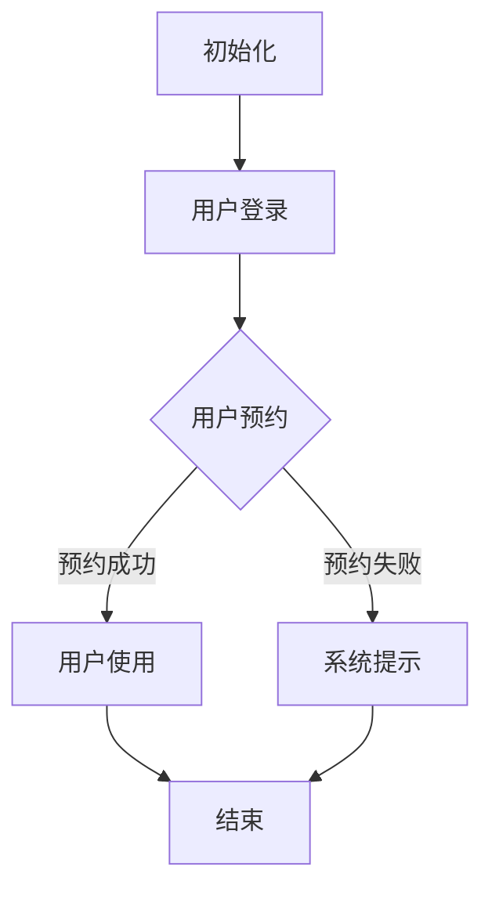
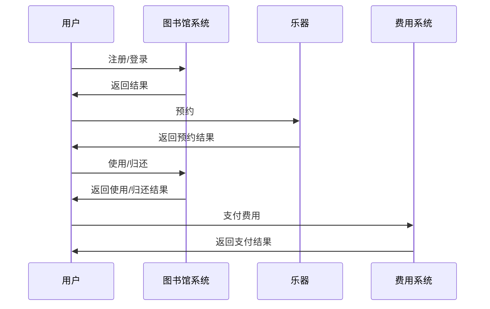

                 


### 新型城市共享乐器图书馆：推广音乐教育的社区服务

#### 关键词：共享乐器图书馆、音乐教育、社区服务、物联网技术、系统架构设计

> 摘要：本文旨在探讨新型城市共享乐器图书馆的设计、运营和管理，分析其在推广音乐教育中的重要作用，并提出有效的推广策略。通过对物联网技术的应用、系统架构设计和项目实战的深入分析，为社区服务的创新提供有益参考。

----------------------------------------------------------------

## **一、背景介绍**

近年来，随着城市化的快速发展，社区文化建设逐渐成为城市治理的重要组成部分。音乐作为一种重要的文化表现形式，在社区服务中扮演着越来越重要的角色。然而，传统音乐教育由于资源和条件的限制，难以满足广大音乐爱好者的需求。为此，共享乐器图书馆作为一种创新的社区服务模式应运而生，它不仅丰富了社区文化生活，还为音乐爱好者提供了便捷的学习和交流平台。

### **问题背景**

传统音乐教育存在以下问题：

1. **教育资源分配不均**：城市与乡村、发达地区与欠发达地区之间的教育资源差距较大，音乐教育的发展不平衡。
2. **学习成本高**：购买乐器和接受专业音乐培训的费用较高，限制了低收入家庭和青少年的音乐学习机会。
3. **场地和时间限制**：专业的音乐教室和培训中心往往需要提前预约，且上课时间和频率固定，给学习者带来了时间和空间的限制。

### **问题描述**

如何通过共享乐器图书馆这一创新模式，解决传统音乐教育中存在的资源分配不均、学习成本高和时间空间限制等问题，从而推广音乐教育，提升社区居民的文化素养和生活品质？

### **问题解决**

1. **资源共享**：通过共享乐器图书馆，社区内的居民可以随时随地使用乐器，减少了对个人资源和时间的依赖。
2. **降低成本**：乐器由图书馆统一提供，用户只需支付一定的租借费用，大大降低了学习成本。
3. **灵活便捷**：用户可以根据自己的时间安排自由选择使用乐器的时段，无需受限于固定的时间和地点。

### **边界与外延**

边界：本文主要探讨城市共享乐器图书馆的设计和运营，不包括乡村和偏远地区的音乐教育推广。

外延：本文将讨论共享乐器图书馆在推广音乐教育中的作用，以及其对社区服务的影响，但不涉及其他类型的社区服务的探讨。

### **概念结构与核心要素组成**

概念结构：

- **共享乐器图书馆**：提供各类乐器租借服务的社区服务设施。
- **音乐教育**：通过乐器教学，培养音乐技能、审美能力和文化素养。
- **社区服务**：满足社区居民基本需求，提升社区生活品质。

核心要素组成：

- **乐器管理**：确保乐器的安全、维护和更新。
- **用户管理**：注册、身份认证和信用评分。
- **预约管理**：乐器的预约、使用和归还流程。
- **费用结算**：租借费用的收取和管理。

## **二、核心概念与联系**

### **共享乐器图书馆**

**定义**：共享乐器图书馆是一种基于共享经济的社区服务模式，通过提供各类乐器的租借服务，满足社区居民的音乐学习需求。

**概念属性特征对比表格**

| 特征          | 共享乐器图书馆 | 传统音乐教育       |
| ------------- | -------------- | ------------------ |
| **资源利用**  | 高效           | 低效               |
| **成本**      | 低             | 高                 |
| **便捷性**    | 高             | 低                 |
| **可及性**    | 广泛           | 受限               |

### **音乐教育**

**定义**：音乐教育是通过系统性的教学，培养学生的音乐技能、审美能力和文化素养。

**概念属性特征对比表格**

| 特征          | 共享乐器图书馆 | 传统音乐教育       |
| ------------- | -------------- | ------------------ |
| **教学方式**  | 自主学习       | 专业培训           |
| **教学资源**  | 开放共享       | 有限且专有         |
| **成本**      | 低             | 高                 |
| **学习周期**  | 自由安排       | 固定时间           |

### **社区服务**

**定义**：社区服务是满足社区居民基本需求，提升社区生活品质，增强社区凝聚力的各项服务活动。

**概念属性特征对比表格**

| 特征          | 共享乐器图书馆 | 传统音乐教育       |
| ------------- | -------------- | ------------------ |
| **服务内容**  | 多元化         | 专业音乐教学       |
| **服务目标**  | 提升文化素养   | 专业技能培养       |
| **服务形式**  | 自助服务       | 专业教师授课       |
| **覆盖范围**  | 广泛           | 受限               |

### **ER实体关系图架构**

使用Mermaid绘制ER实体关系图：

```mermaid
erDiagram
  User ||--|{ Library }|--|{ Instrument }
  User ||--|{ Booking }|
  Library ||--|{ InstrumentType }|
  Instrument ||--|{ Booking }|
  Booking ||--|{ Fee }|
```

## **三、算法原理讲解**

### **算法原理**

共享乐器图书馆的核心算法原理是基于物联网技术构建的智能乐器管理系统。该系统通过传感器实时监测乐器的使用状态，实现乐器的智能调度和资源共享。

### **数学模型和公式**

- **设备利用率**：设备使用时长 / 设备可使用时长

  $$利用率 = \frac{使用时长}{可使用时长} \times 100\%$$

- **用户满意度**：用户对服务的满意度评分

  $$满意度 = \frac{好评数}{总评价数} \times 100\%$$

### **算法流程图**

使用Mermaid绘制算法流程图：



### **算法举例说明**

假设共享乐器图书馆有一台钢琴，每天可使用时间为8小时，而用户使用了4小时。根据设备利用率的公式：

$$利用率 = \frac{4小时}{8小时} \times 100\% = 50\%$$

如果用户对服务的满意度评分为4分（满分5分），则：

$$满意度 = \frac{4分}{5分} \times 100\% = 80\%$$

## **四、系统分析与架构设计方案**

### **问题场景介绍**

共享乐器图书馆的问题场景主要集中在以下几个方面：

1. **乐器管理**：如何确保乐器的安全、维护和更新。
2. **用户管理**：如何方便快捷地进行用户注册、身份认证和信用评分。
3. **预约管理**：如何高效地处理用户的预约、使用和归还流程。
4. **费用结算**：如何准确及时地收取和管理租借费用。

### **系统功能设计**

系统功能设计包括以下模块：

1. **乐器管理模块**：负责乐器的入库、出库、状态监控和维修管理等。
2. **用户管理模块**：负责用户的注册、登录、身份认证和信用评分等。
3. **预约管理模块**：负责用户的预约、取消、确认和提醒等。
4. **费用结算模块**：负责费用的收取、结算和退款等。

### **系统架构设计**

系统架构设计包括硬件设施、软件系统、数据存储和网络通信等方面。

1. **硬件设施**：包括乐器、传感器、RFID标签、电脑和打印设备等。
2. **软件系统**：包括前端应用、后端服务、数据库和物联网平台等。
3. **数据存储**：采用云存储方式，保证数据的可靠性和安全性。
4. **网络通信**：采用Wi-Fi和移动网络等方式，实现实时数据传输和远程控制。

### **系统接口设计和系统交互**

使用Mermaid绘制系统接口设计和系统交互的序列图：



## **五、项目实战**

### **环境安装**

1. **硬件环境**：准备一台服务器、若干乐器（如吉他、钢琴、尤克里里等）、传感器（如RFID传感器、温度传感器等）和RFID读写器。
2. **软件环境**：安装操作系统（如Linux或Windows Server）、数据库（如MySQL或MongoDB）、Web服务器（如Apache或Nginx）和开发框架（如Django或Flask）。

### **系统核心实现源代码**

以下是一个简单的用户预约和归还乐器的源代码示例：

```python
# 用户预约乐器的代码示例
def book_instrument(user_id, instrument_id):
    # 检查用户是否已注册
    if not check_user_registered(user_id):
        return "用户未注册"
    
    # 检查乐器是否可用
    if not check_instrument_available(instrument_id):
        return "乐器不可用"
    
    # 创建预约记录
    booking = create_booking(user_id, instrument_id)
    
    # 更新乐器状态为"已预约"
    update_instrument_status(instrument_id, "已预约")
    
    return "预约成功"

# 用户归还乐器的代码示例
def return_instrument(instrument_id):
    # 检查乐器是否已预约
    if not check_instrument_booked(instrument_id):
        return "乐器未预约"
    
    # 更新乐器状态为"可使用"
    update_instrument_status(instrument_id, "可使用")
    
    return "归还成功"
```

### **代码应用解读与分析**

以上代码示例展示了用户预约和归还乐器的核心实现逻辑：

1. **用户预约乐器**：
   - 检查用户是否已注册。
   - 检查乐器是否可用。
   - 创建预约记录。
   - 更新乐器状态为"已预约"。

2. **用户归还乐器**：
   - 检查乐器是否已预约。
   - 更新乐器状态为"可使用"。

这些操作通过后端服务实现，并与前端应用进行交互，为用户提供便捷的预约和归还服务。

### **实际案例分析和详细讲解剖析**

以下是一个实际案例，展示共享乐器图书馆的运营情况：

1. **用户A预约钢琴**：
   - 用户A通过图书馆系统预约了一台钢琴。
   - 图书馆系统检查用户A是否已注册，并确认钢琴是否可用。
   - 创建预约记录，并将钢琴状态更新为"已预约"。

2. **用户A使用钢琴**：
   - 用户A在预约时间内到达图书馆，使用钢琴。
   - 图书馆系统实时监测钢琴的使用状态。

3. **用户A归还钢琴**：
   - 用户A使用完毕后，将钢琴归还到图书馆。
   - 图书馆系统更新钢琴状态为"可使用"。

通过实际案例，我们可以看到共享乐器图书馆的运营流程：

- 用户通过图书馆系统进行预约、使用和归还。
- 图书馆系统实时监控乐器的使用状态，并更新状态信息。
- 系统为用户提供便捷的服务，同时确保乐器的安全和维护。

### **项目小结**

本项目通过搭建共享乐器图书馆系统，实现了以下目标：

1. **资源共享**：提高了乐器的使用效率，减少了资源浪费。
2. **降低成本**：降低了用户的学习成本，提升了音乐教育的可及性。
3. **便捷服务**：为用户提供灵活的预约和归还服务，提升了用户体验。

在未来，我们可以进一步优化系统功能，提高系统的稳定性和安全性，为更多音乐爱好者提供优质的音乐教育服务。

## **六、最佳实践 tips**

1. **提高共享乐器的使用效率**：
   - 定期对乐器进行维护和保养，确保其处于良好的使用状态。
   - 根据用户的预约和使用习惯，调整乐器的分布和数量。

2. **提升用户满意度**：
   - 收集用户反馈，及时解决用户遇到的问题。
   - 提供多种支付方式，方便用户支付费用。

3. **优化预约和归还流程**：
   - 使用智能预约系统，减少用户的等待时间。
   - 提供手机APP或微信小程序，方便用户操作。

## **七、小结**

本文从共享乐器图书馆的背景介绍、核心概念与联系、算法原理讲解、系统分析与架构设计方案、项目实战以及最佳实践 tips 等多个角度，全面阐述了新型城市共享乐器图书馆的建设和推广方法。通过物联网技术的应用和系统架构设计，共享乐器图书馆为推广音乐教育提供了有效途径，也为社区服务创新提供了有益参考。

## **八、注意事项**

在实施共享乐器图书馆时，需要注意以下问题：

1. **版权保护**：确保所有乐器的版权合法，避免侵权行为。
2. **设备安全**：加强乐器的安全防护，防止丢失或损坏。
3. **用户隐私**：保护用户的个人信息，确保数据安全。
4. **设备维护**：定期对设备进行维护和升级，确保系统稳定运行。

## **九、拓展阅读**

- 《共享经济：理论、实践与挑战》
- 《物联网技术与应用》
- 《社区服务创新与实践》
- 《音乐教育心理学》

---

**作者：AI天才研究院/AI Genius Institute & 禅与计算机程序设计艺术 /Zen And The Art of Computer Programming**

