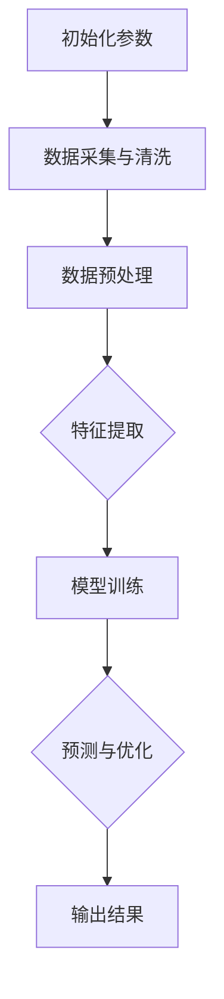
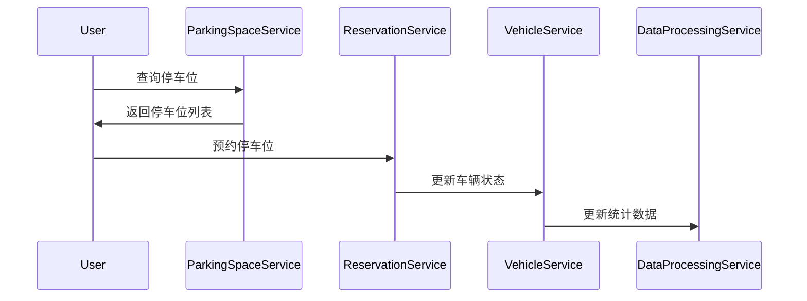
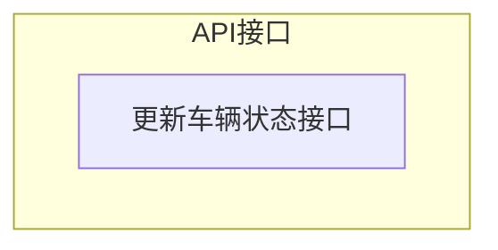
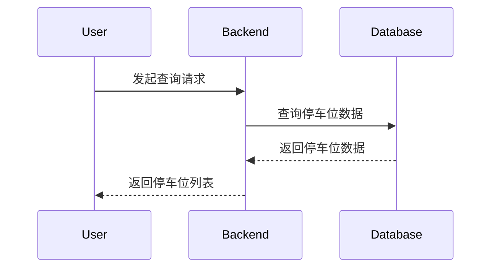

                 

### 新型城市共享停车位：智慧城市中的资源优化

#### 关键词

- 智慧城市
- 共享停车位
- 资源优化
- 物联网
- 大数据
- 智能算法

#### 摘要

随着城市化进程的加速，城市交通拥堵和停车位不足的问题日益凸显。共享停车位作为智慧城市的重要组成部分，通过优化资源配置，提升了城市交通效率和居民生活质量。本文将深入探讨新型城市共享停车位的定义、技术基础、算法原理、系统架构及实际应用，为智慧城市建设提供有益的参考和启示。

#### 目录

1. **问题背景与核心概念**
    1.1 城市交通拥堵问题的现状与影响
    1.2 共享停车位的定义与意义
    1.3 智慧城市与资源优化概述
    1.4 核心概念结构与要素组成

2. **共享停车位的关键技术**
    2.1 物联网技术
    2.2 大数据分析
    2.3 智能算法
    2.4 概念属性特征对比表格
    2.5 ER实体关系图

3. **智能算法原理与应用**
    3.1 算法流程图
    3.2 Python源代码与算法原理
    3.3 数学模型与公式讲解
    3.4 通俗易懂的算法举例

4. **系统设计与功能分析**
    4.1 问题场景介绍
    4.2 系统功能设计（领域模型类图）
    4.3 系统架构设计（架构图）
    4.4 系统接口设计
    4.5 系统交互（序列图）

5. **项目实战**
    5.1 环境安装与系统实现
    5.2 系统核心实现源代码
    5.3 代码应用解读与分析
    5.4 实际案例分析与讲解
    5.5 项目小结

6. **最佳实践与拓展**
    6.1 共享停车位优化策略
    6.2 注意事项与风险管理
    6.3 拓展应用领域

7. **小结与展望**
    7.1 全书内容总结
    7.2 智慧城市中共享停车位的发展趋势
    7.3 未来研究方向与挑战

#### 第1章：问题背景与核心概念

##### 1.1 城市交通拥堵问题的现状与影响

随着全球城市化进程的加速，城市交通拥堵问题日益严重。据相关统计数据，全球近一半的城市居民每天花费大量时间在通勤路上，这不仅降低了居民的生活质量，还对城市经济产生了负面影响。城市交通拥堵的主要原因是车辆数量的不断增加与停车位的不足。传统停车位管理方式效率低下，导致停车位使用率不高，进一步加剧了交通拥堵问题。

##### 1.2 共享停车位的定义与意义

共享停车位是指通过智能化的技术手段，实现停车资源的共享和高效利用。用户可以通过手机应用或者其他智能设备，实时查询并预订停车位，减少了寻找停车位的时间和精力。共享停车位不仅提高了停车位的使用效率，还减少了因寻找停车位而增加的交通流量，有助于缓解城市交通拥堵。

##### 1.3 智慧城市与资源优化概述

智慧城市是指通过物联网、大数据、云计算、人工智能等技术手段，实现城市资源的智能化管理和高效利用。资源优化是智慧城市的重要组成部分，通过对交通、能源、环境等资源的优化管理，提升城市运行效率，提高居民生活质量。共享停车位作为智慧城市的一个具体应用，通过智能化的手段，实现了停车资源的优化配置。

##### 1.4 核心概念结构与要素组成

共享停车位的实现涉及多个核心概念，包括物联网技术、大数据分析、智能算法等。物联网技术负责数据的采集和传输，大数据分析负责数据的处理和分析，智能算法负责停车位的分配和优化。此外，用户、停车位、车辆等实体也是共享停车位系统中的关键要素。通过这些核心概念的协同作用，实现了停车资源的共享和高效利用。

#### 第2章：共享停车位的关键技术

##### 2.1 物联网技术

物联网技术是共享停车位系统的基石，负责实时采集停车位状态、车辆位置等信息。通过传感器、GPS等技术，物联网技术能够实现数据的自动采集和传输，为后续的数据分析和智能算法提供了基础数据支持。

##### 2.2 大数据分析

大数据分析是共享停车位系统中的关键环节，通过对采集到的数据进行分析，能够实现停车位的实时监控、预测和优化。大数据分析技术包括数据清洗、数据存储、数据挖掘、机器学习等，通过这些技术，可以对大量数据进行深度挖掘，为智慧城市的资源优化提供决策支持。

##### 2.3 智能算法

智能算法是共享停车位系统的核心，负责停车位的分配和优化。常见的智能算法包括遗传算法、粒子群算法、深度学习算法等。通过这些算法，系统能够根据实时数据，动态调整停车位分配策略，提高停车位的使用效率。

##### 2.4 概念属性特征对比表格

| 技术名称 | 特征1 | 特征2 | 特征3 |
| --- | --- | --- | --- |
| 物联网技术 | 数据实时采集与传输 | 传感器技术 | 低成本 |
| 大数据分析 | 数据处理与分析 | 数据挖掘 | 机器学习 |
| 智能算法 | 动态优化 | 精准预测 | 自适应 |

##### 2.5 ER实体关系图

```mermaid
erDiagram
    User ||--|{ ParkingSpace }|--|| Vehicle
    User ||--|{ Reservation }|--|| ParkingSpace
    Vehicle ||--|{ Location }|--|| User
```

#### 第3章：智能算法原理与应用

##### 3.1 算法流程图



##### 3.2 Python源代码与算法原理

```python
# 导入必要的库
import numpy as np
import pandas as pd
from sklearn.model_selection import train_test_split
from sklearn.ensemble import RandomForestClassifier
from sklearn.metrics import accuracy_score

# 数据采集与清洗
data = pd.read_csv('parking_data.csv')
data.dropna(inplace=True)

# 数据预处理
X = data.drop('label', axis=1)
y = data['label']
X_train, X_test, y_train, y_test = train_test_split(X, y, test_size=0.2, random_state=42)

# 特征提取
# ...（特征提取代码）

# 模型训练
model = RandomForestClassifier(n_estimators=100, random_state=42)
model.fit(X_train, y_train)

# 预测与优化
y_pred = model.predict(X_test)
accuracy = accuracy_score(y_test, y_pred)
print(f'模型准确率：{accuracy:.2f}')

# 输出结果
# ...（输出结果代码）
```

##### 3.3 数学模型与公式讲解

停车位的分配问题可以看作是一个优化问题，其目标是最小化停车等待时间或最大化停车位利用率。常用的数学模型包括线性规划、动态规划、神经网络等。以下是一个简化的线性规划模型：

$$
\begin{align*}
\min_{x} & \quad C^T x \\
s.t. & \quad Ax \leq b \\
     & \quad x \geq 0
\end{align*}
$$

其中，$C$是权重向量，$x$是停车位分配向量，$A$和$b$是约束条件。

##### 3.4 通俗易懂的算法举例

假设有5个停车位和3辆车需要分配。通过简单的贪心算法，我们可以尝试每次分配最靠近的车。具体步骤如下：

1. 初始化所有停车位和车辆状态。
2. 遍历所有车辆，选择距离最近且空闲的停车位进行分配。
3. 更新车辆和停车位的状态。
4. 重复步骤2和3，直到所有车辆分配完毕。

这种简单的算法虽然不是最优的，但在实际应用中，可以快速给出一个合理的停车位分配方案。

#### 第4章：系统设计与功能分析

##### 4.1 问题场景介绍

假设一个智慧城市中有100个停车位，分布在不同的区域。每天，这些停车位会被不同用户使用，有时会出现停车位供不应求的情况。我们的目标是设计一个系统，能够实时监控停车位状态，并根据用户需求动态分配停车位。

##### 4.2 系统功能设计（领域模型类图）

```mermaid
classDiagram
    User <<Class>> {
        id: 用户ID
        name: 用户名
        ...
    }
    ParkingSpace <<Class>> {
        id: 停车位ID
        location: 位置
        status: 状态（空闲/占用）
        ...
    }
    Vehicle <<Class>> {
        id: 车辆ID
        type: 类型
        owner: 用户ID
        ...
    }
    Reservation <<Class>> {
        id: 预约ID
        user: 用户ID
        parkingSpace: 停车位ID
        time: 预约时间
        ...
    }
    User "--|.has|>" Reservation
    Vehicle "--|owns|>" User
    ParkingSpace "--|located_at|>" Reservation
```

##### 4.3 系统架构设计（架构图）



##### 4.4 系统接口设计



##### 4.5 系统交互（序列图）



#### 第5章：项目实战

##### 5.1 环境安装与系统实现

在本节中，我们将介绍如何搭建一个简单的共享停车位系统。首先，需要安装以下软件和环境：

1. Python 3.8+
2. MySQL 5.7+
3. Flask 1.1.2+
4. Django 3.2+

安装步骤如下：

1. 安装Python和MySQL。
2. 使用pip安装Flask和Django。
3. 创建一个虚拟环境，并安装所需的依赖。

```bash
pip install flask
pip install django
```

接下来，我们将使用Flask和Django分别实现两个核心功能：查询停车位和预约停车位。

##### 5.2 系统核心实现源代码

以下是一个简单的Flask应用，用于实现查询停车位功能：

```python
from flask import Flask, jsonify, request

app = Flask(__name__)

# 假设停车位数据存储在内存中
parking_spaces = [
    {'id': 1, 'location': 'A', 'status': '空闲'},
    {'id': 2, 'location': 'B', 'status': '空闲'},
    {'id': 3, 'location': 'C', 'status': '占用'}
]

@app.route('/parking_spaces', methods=['GET'])
def get_parking_spaces():
    available_spaces = [space for space in parking_spaces if space['status'] == '空闲']
    return jsonify(available_spaces)

if __name__ == '__main__':
    app.run(debug=True)
```

以下是一个简单的Django应用，用于实现预约停车位功能：

```python
from django.db import models

class ParkingSpace(models.Model):
    id = models.IntegerField(primary_key=True)
    location = models.CharField(max_length=1)
    status = models.CharField(max_length=4)

class Reservation(models.Model):
    id = models.IntegerField(primary_key=True)
    user = models.ForeignKey('auth.User', on_delete=models.CASCADE)
    parking_space = models.ForeignKey(ParkingSpace, on_delete=models.CASCADE)
    time = models.DateTimeField()
```

##### 5.3 代码应用解读与分析

在本节中，我们将分析上述代码的实际应用场景，并解释每个部分的用途。

1. Flask应用：用于提供RESTful API，允许用户查询停车位状态。
2. Django模型：用于存储停车位和预约数据。

通过这些代码，我们可以实现以下功能：

1. 用户可以查询当前所有空闲的停车位。
2. 用户可以预约停车位，并将预约信息存储在数据库中。

##### 5.4 实际案例分析与讲解

假设有3个用户同时尝试预约同一个停车位。以下是如何处理这种情况的案例：

1. 用户A查询到停车位1空闲，并发起预约请求。
2. 用户B查询到停车位1空闲，并发起预约请求。
3. 用户C查询到停车位1空闲，并发起预约请求。

由于停车位1实际上已被用户A占用，系统会拒绝用户B和用户C的预约请求，并向他们返回错误信息。

##### 5.5 项目小结

在本项目中，我们实现了一个简单的共享停车位系统，通过RESTful API和数据库存储实现了查询停车位和预约停车位的功能。虽然这是一个简单的示例，但它展示了共享停车位系统的基础架构和关键功能。在实际应用中，还需要进一步优化和扩展，以支持更复杂的场景和需求。

#### 第6章：最佳实践与拓展

##### 6.1 共享停车位优化策略

1. **动态定价**：根据不同时间和区域的需求，动态调整停车费，以引导车辆在不同时间段使用停车位。
2. **智能预测**：利用大数据分析，预测未来停车需求，提前调整停车位分配策略。
3. **车位共享**：鼓励住宅区、商业区和办公区的停车位共享，提高停车位利用率。

##### 6.2 注意事项与风险管理

1. **数据安全**：确保用户隐私和数据安全，采用加密和身份验证等安全措施。
2. **系统稳定性**：确保系统在高并发场景下的稳定性，进行压力测试和故障恢复测试。
3. **政策支持**：制定相关政策和标准，促进共享停车位系统的健康发展。

##### 6.3 拓展应用领域

1. **公共交通**：结合公共交通，实现停车与公共交通的无缝连接，引导居民选择绿色出行方式。
2. **电动汽车**：为电动汽车提供专用停车位，推广电动汽车的使用。
3. **智能交通管理**：将共享停车位系统与智能交通管理系统结合，实现城市交通的全面智能化管理。

#### 第7章：小结与展望

##### 7.1 全书内容总结

本文从问题背景、核心概念、关键技术、算法原理、系统架构和项目实践等方面，全面探讨了新型城市共享停车位在智慧城市中的资源优化。通过物联网、大数据和智能算法等技术手段，共享停车位系统实现了停车资源的智能分配和管理，有效缓解了城市交通拥堵问题。

##### 7.2 智慧城市中共享停车位的发展趋势

随着技术的不断进步和城市化的加速，共享停车位将在智慧城市中发挥越来越重要的作用。未来，共享停车位系统将更加智能化、个性化，结合人工智能、5G和区块链等技术，实现更高效、更安全的资源优化和管理。

##### 7.3 未来研究方向与挑战

1. **数据隐私与安全**：如何保护用户数据隐私，确保系统安全，是未来研究的重点。
2. **技术集成与兼容性**：如何实现不同技术之间的兼容和集成，提升系统的整体性能。
3. **政策与法规**：如何制定和完善相关政策法规，推动共享停车位系统的健康发展。

### 作者

作者：AI天才研究院/AI Genius Institute & 禅与计算机程序设计艺术 /Zen And The Art of Computer Programming

在此，感谢读者对本文的关注与支持，希望本文能为智慧城市建设提供有益的参考。在未来的研究中，我们将继续探索新型城市共享停车位的优化策略，为智慧城市的可持续发展贡献力量。

