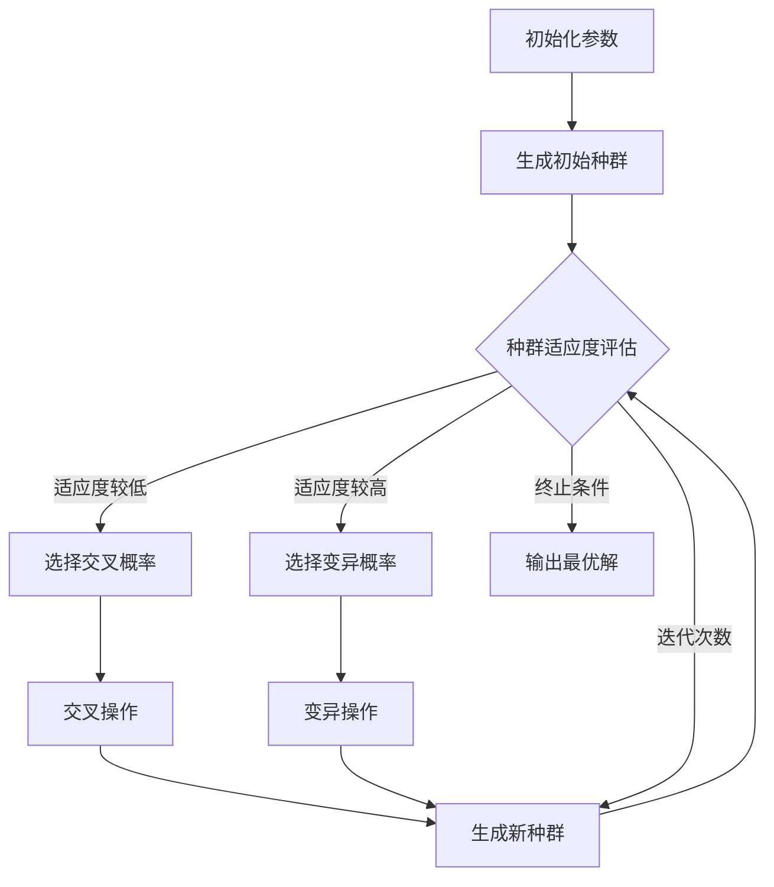
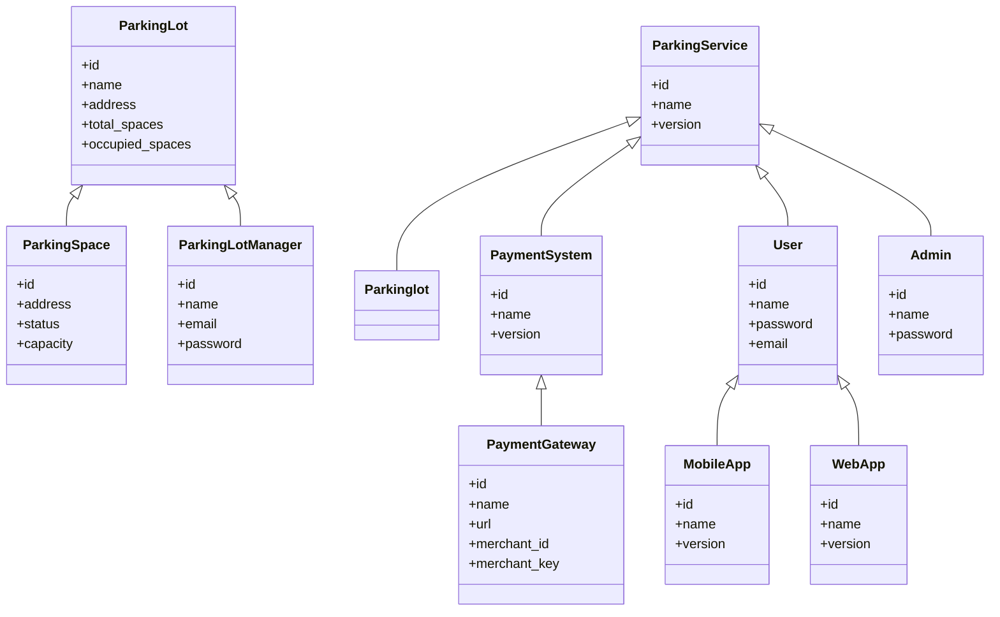
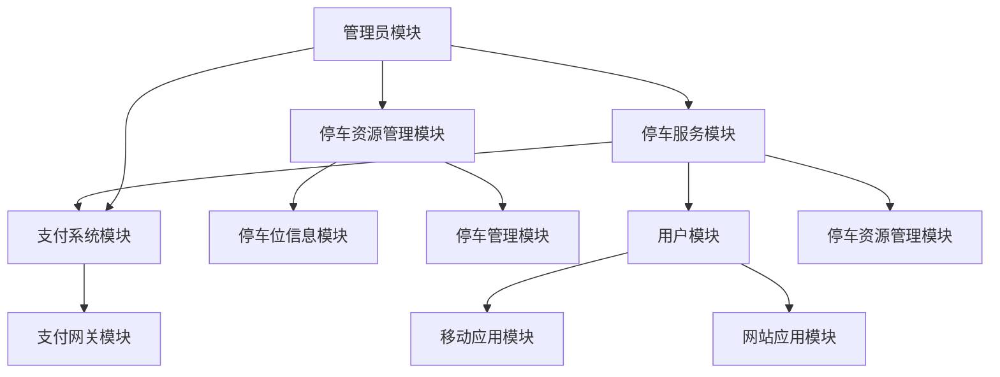
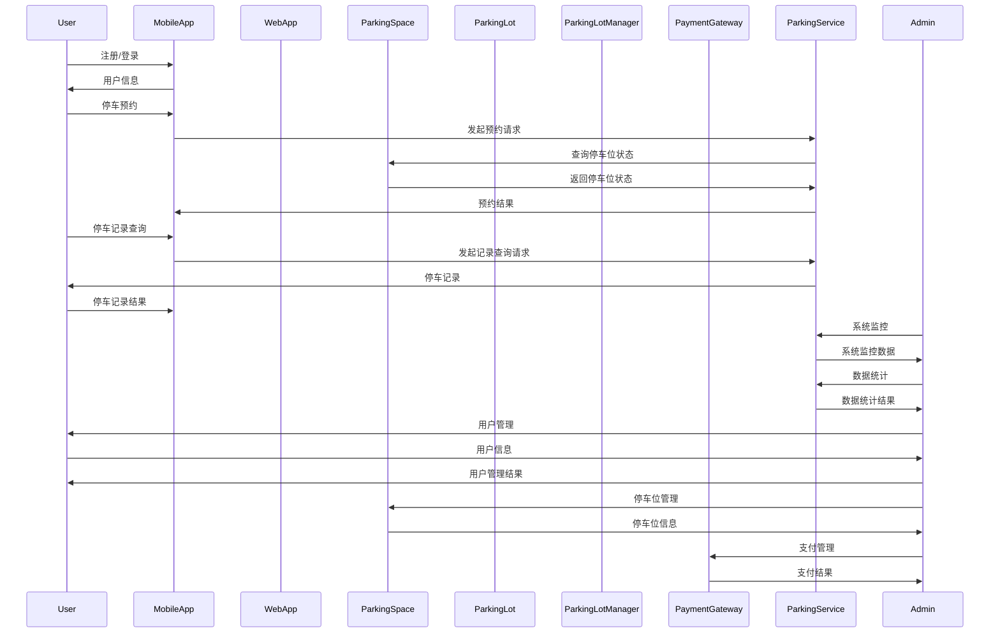

                 

# 新型城市共享停车位：智慧城市中的资源优化

## 关键词
智慧城市、共享停车位、资源优化、算法、系统架构

## 摘要
本文以新型城市中的共享停车位为研究对象，探讨了如何在智慧城市中实现停车资源的优化。文章首先介绍了共享停车位在智慧城市中的重要性，以及当前智慧城市发展中面临的挑战。接着，详细阐述了共享停车位的定义、类型和面临的挑战，随后讨论了智慧城市的核心要素和资源优化的原理与方法。文章的核心部分通过mermaid流程图和Python代码，讲解了共享停车位优化算法的原理和实现。然后，文章分析了实际应用场景，并使用mermaid图展示了系统功能设计、系统架构设计和系统交互。最后，通过一个实际案例，对共享停车位优化系统进行了实战分析，并总结了项目经验和最佳实践。文章旨在为读者提供深入理解共享停车位优化在智慧城市中的应用，为新型城市的可持续发展提供参考。

## 目录大纲

### 第一部分：背景介绍

#### 1.1 问题背景
- **1.1.1 新型城市与智慧城市**
- **1.1.2 共享停车位的重要性**
- **1.1.3 智慧城市中的资源优化需求**

#### 1.2 核心概念与联系
- **1.2.1 共享停车位**
- **1.2.2 智慧城市**
- **1.2.3 资源优化原理和方法**

### 第二部分：核心概念与联系

#### 2.1 共享停车位
- **2.1.1 定义与特点**
- **2.1.2 类型与模式**
- **2.1.3 共享停车位的挑战与机遇**

#### 2.2 智慧城市
- **2.2.1 概念与要素**
- **2.2.2 技术与应用**
- **2.2.3 智慧城市的发展趋势**

#### 2.3 资源优化
- **2.3.1 原理与方法**
- **2.3.2 算法与模型**
- **2.3.3 资源优化的实践应用**

### 第三部分：算法原理讲解

#### 3.1 共享停车位优化算法
- **3.1.1 算法mermaid流程图**
- **3.1.2 算法原理和数学模型**
- **3.1.3 Python代码实现**

### 第四部分：系统分析与架构设计方案

#### 4.1 问题场景介绍
- **4.1.1 共享停车位优化问题**
- **4.1.2 智慧城市应用场景**

#### 4.2 系统功能设计
- **4.2.1 领域模型mermaid类图**
- **4.2.2 系统功能分解**

#### 4.3 系统架构设计
- **4.3.1 系统架构mermaid图**
- **4.3.2 系统架构设计原理**

#### 4.4 系统接口设计和系统交互
- **4.4.1 系统接口设计**
- **4.4.2 系统交互mermaid序列图**

### 第五部分：项目实战

#### 5.1 环境安装
- **5.1.1 开发环境安装**
- **5.1.2 系统依赖安装**

#### 5.2 系统核心实现源代码
- **5.2.1 代码结构**
- **5.2.2 代码解读**

#### 5.3 代码应用解读与分析
- **5.3.1 应用场景分析**
- **5.3.2 代码运行与结果分析**

#### 5.4 实际案例分析和详细讲解
- **5.4.1 案例一：城市A的共享停车位优化**
- **5.4.2 案例二：城市B的智慧停车解决方案**

#### 5.5 项目小结
- **5.5.1 项目经验总结**
- **5.5.2 优化方向展望**

### 第六部分：最佳实践 tips

### 第七部分：小结、注意事项和拓展阅读

## 第一部分：背景介绍

### 1.1 问题背景

#### 1.1.1 新型城市与智慧城市

随着城市化进程的加快，新型城市应运而生。新型城市不仅注重经济发展，更强调可持续发展、居民生活质量和社会公平。智慧城市作为新型城市的发展方向，成为城市规划者和研究者关注的焦点。

智慧城市是指利用物联网、云计算、大数据、人工智能等先进技术，实现城市资源的优化配置和高效利用，提升城市治理和服务水平。智慧城市的主要特点包括：

1. **智能化**：通过传感器、摄像头、智能设备等，实时收集城市运行数据，进行智能分析和决策。
2. **互联性**：实现城市内各个系统和部门的信息共享，打破信息孤岛，提升协同工作效率。
3. **高效性**：利用人工智能和大数据分析，提高城市管理和服务的效率。
4. **可持续性**：注重环境保护和资源节约，推动绿色、低碳发展。

#### 1.1.2 共享停车位的重要性

在智慧城市中，停车问题是一个亟待解决的难题。随着汽车数量的快速增长，停车位供需失衡、交通拥堵、环境污染等问题日益突出。共享停车位作为一种新型的停车方式，成为解决这些问题的重要手段。

共享停车位的重要性体现在以下几个方面：

1. **缓解交通压力**：通过共享停车位，减少车辆在寻找停车位上的时间，降低交通拥堵。
2. **提高资源利用率**：共享停车位可以充分利用现有停车位资源，减少闲置和浪费。
3. **降低环境污染**：减少车辆寻找停车位时的燃油消耗，降低尾气排放，改善空气质量。
4. **提升城市品质**：改善停车环境，提高居民生活质量，增强城市吸引力。

#### 1.1.3 智慧城市中的资源优化需求

智慧城市的发展离不开资源的优化配置。资源优化包括能源、水资源、土地资源等多个方面，其中停车资源的优化尤为重要。在智慧城市中，停车资源的优化需求主要体现在以下几个方面：

1. **信息共享**：实现停车数据的实时共享，提高停车位利用率。
2. **智能调度**：利用人工智能技术，对停车资源进行智能调度，实现最优配置。
3. **实时监控**：通过传感器和摄像头等设备，实时监控停车位状态，提高管理效率。
4. **数据分析**：利用大数据技术，对停车数据进行分析，为决策提供支持。

### 1.2 核心概念与联系

在本文中，我们将介绍以下几个核心概念：

#### 1.2.1 共享停车位

共享停车位是指通过互联网平台，将个人或企业的闲置停车位与有需求的车辆进行匹配，实现车位共享。共享停车位具有以下特点：

1. **灵活性**：用户可以根据自己的需求，灵活选择停车位，无需长时间等待。
2. **便捷性**：通过手机APP或网站，用户可以随时随地预订停车位，操作简单方便。
3. **经济性**：共享停车位可以降低停车成本，减轻居民的负担。
4. **环保性**：减少车辆在路上寻找停车位的时间，降低燃油消耗和尾气排放。

#### 1.2.2 智慧城市

智慧城市是指利用先进的信息技术和大数据分析，实现城市资源的优化配置和高效利用，提升城市治理和服务水平。智慧城市的主要组成部分包括：

1. **基础设施**：包括物联网、云计算、大数据中心等。
2. **平台**：包括城市运行管理平台、公共安全平台、交通管理平台等。
3. **应用**：包括智能交通、智能医疗、智能环保、智慧社区等。

#### 1.2.3 资源优化原理和方法

资源优化是指通过科学的手段，提高资源的利用效率，实现资源的最优配置。资源优化的原理主要包括：

1. **信息共享**：通过信息共享，打破信息孤岛，实现资源的高效配置。
2. **智能调度**：利用人工智能技术，对资源进行智能调度，实现最优配置。
3. **数据分析**：通过大数据分析，对资源利用情况进行实时监控和预测，为决策提供支持。

资源优化的方法包括：

1. **线性规划**：通过建立数学模型，求解资源最优配置问题。
2. **遗传算法**：通过模拟生物进化过程，寻找最优解。
3. **模拟退火算法**：通过模拟物理退火过程，寻找最优解。

## 第二部分：核心概念与联系

### 2.1 共享停车位

#### 2.1.1 定义与特点

共享停车位，作为一种新兴的停车方式，是指通过互联网平台，将个人或企业的闲置停车位与有需求的车辆进行匹配，实现车位共享。共享停车位具有以下几个特点：

1. **灵活性**：用户可以根据自己的需求，灵活选择停车位，无需长时间等待。
2. **便捷性**：通过手机APP或网站，用户可以随时随地预订停车位，操作简单方便。
3. **经济性**：共享停车位可以降低停车成本，减轻居民的负担。
4. **环保性**：减少车辆在路上寻找停车位的时间，降低燃油消耗和尾气排放。

#### 2.1.2 类型与模式

共享停车位可以根据不同的分类标准，划分为多种类型和模式：

1. **按所有权划分**：可以分为公共停车位共享和私有停车位共享。
   - **公共停车位共享**：指政府或公共机构管理的停车位对外开放，供用户预订使用。
   - **私有停车位共享**：指个人或企业将自己的停车位对外开放，供用户预订使用。

2. **按运营模式划分**：可以分为市场驱动模式和政府推动模式。
   - **市场驱动模式**：以市场需求为导向，由企业提供技术平台和运营服务，用户通过平台进行预订和支付。
   - **政府推动模式**：政府主导，通过政策支持和资金投入，推动共享停车位的发展。

3. **按服务范围划分**：可以分为本地共享和跨城共享。
   - **本地共享**：主要服务于本地居民的停车需求，车位供应和需求在本地范围内。
   - **跨城共享**：涉及不同城市的停车位共享，可能需要考虑跨区域的政策、数据传输等技术问题。

#### 2.1.3 共享停车位的挑战与机遇

共享停车位虽然具有很多优势，但在实际运营中仍面临一些挑战：

1. **政策法规**：共享停车位的合法性和政策支持在不同地区存在差异，需要制定和执行相应的法律法规。
2. **数据安全**：用户数据的隐私保护和信息安全是共享停车位面临的重要问题。
3. **技术挑战**：如何实现高效的停车位匹配、实时数据监控和智能调度是技术层面的挑战。
4. **市场接受度**：用户对共享停车位服务的接受度和习惯养成需要时间和市场推广。

然而，随着智慧城市建设的推进，共享停车位也面临巨大的机遇：

1. **技术进步**：物联网、大数据、人工智能等技术的发展为共享停车位提供了强大的技术支持。
2. **政策支持**：政府在智慧城市建设中，对共享停车位给予政策扶持，有利于其快速发展。
3. **市场需求**：随着汽车保有量的增加，停车需求的快速增长为共享停车位提供了广阔的市场空间。
4. **环保意识**：随着环保意识的提高，共享停车位作为一种绿色出行方式，受到越来越多用户的青睐。

### 2.2 智慧城市

#### 2.2.1 概念与要素

智慧城市是指通过先进的信息技术和大数据分析，实现城市资源的优化配置和高效利用，提升城市治理和服务水平。智慧城市的核心要素包括：

1. **基础设施**：包括物联网、云计算、大数据中心等，为智慧城市提供技术支撑。
2. **平台**：包括城市运行管理平台、公共安全平台、交通管理平台等，实现城市各系统的互联互通和信息共享。
3. **应用**：包括智能交通、智能医疗、智能环保、智慧社区等，为市民提供便捷、高效、智能的服务。

#### 2.2.2 技术与应用

智慧城市的技术与应用涵盖了多个方面，以下是一些主要的技术和应用：

1. **物联网**：通过传感器和物联网技术，实现城市各类设备和设施的互联互通，提高城市运行效率。
2. **云计算**：通过云计算技术，实现海量数据的存储、处理和分析，为城市决策提供支持。
3. **大数据**：通过大数据技术，对城市运行数据进行分析，为城市规划和治理提供科学依据。
4. **人工智能**：通过人工智能技术，实现城市运行和服务的智能化，提升城市治理和服务水平。
5. **智能交通**：通过智能交通技术，实现交通流量监控、智能调度、实时路况信息发布等功能，缓解交通拥堵。
6. **智能医疗**：通过远程医疗、智慧医院等应用，提高医疗服务的效率和质量。
7. **智能环保**：通过智能监测、数据分析等技术，实现环境污染的精准治理和绿色低碳发展。
8. **智慧社区**：通过智能家居、智慧安防、智慧物业等应用，提高社区管理和居民生活品质。

#### 2.2.3 智慧城市的发展趋势

随着技术的不断进步和城市化进程的加快，智慧城市的发展呈现出以下趋势：

1. **数据驱动**：数据将成为智慧城市发展的核心驱动力，通过大数据分析，实现城市资源的精细化管理和服务。
2. **智能化**：智能化技术将在智慧城市中得到广泛应用，实现城市运行和服务的高度智能化。
3. **可持续发展**：智慧城市将注重可持续发展，通过技术创新和资源优化，推动绿色低碳发展。
4. **跨领域融合**：智慧城市将实现跨领域的技术融合，如智能交通、智能医疗、智能环保等，提供更全面、更便捷的服务。
5. **用户参与**：智慧城市的发展将更加注重用户的参与和体验，通过用户反馈和数据，不断优化城市服务和治理。

### 2.3 资源优化

#### 2.3.1 原理与方法

资源优化是指通过科学的手段，提高资源的利用效率，实现资源的最优配置。资源优化的原理主要包括以下几个方面：

1. **信息共享**：通过信息共享，打破信息孤岛，实现资源的高效配置。例如，通过共享停车位数据，实现停车位供需的实时匹配。
2. **智能调度**：利用人工智能技术，对资源进行智能调度，实现最优配置。例如，通过智能交通系统，实时调整交通信号灯，优化交通流量。
3. **数据分析**：通过大数据分析，对资源利用情况进行实时监控和预测，为决策提供支持。例如，通过数据分析，预测停车需求，提前安排停车位供应。

资源优化的方法主要包括：

1. **线性规划**：通过建立数学模型，求解资源最优配置问题。例如，通过线性规划模型，确定城市交通信号灯的优化配时。
2. **遗传算法**：通过模拟生物进化过程，寻找最优解。例如，通过遗传算法，优化城市交通路线，减少交通拥堵。
3. **模拟退火算法**：通过模拟物理退火过程，寻找最优解。例如，通过模拟退火算法，优化城市供水管网，提高供水效率。

#### 2.3.2 算法与模型

在资源优化中，常用的算法和模型包括：

1. **线性规划**：通过建立线性目标函数和线性约束条件，求解资源最优配置问题。例如，通过线性规划模型，确定城市交通信号灯的最优配时。
2. **遗传算法**：通过模拟生物进化过程，迭代优化求解资源最优配置问题。例如，通过遗传算法，优化城市交通路线，减少交通拥堵。
3. **模拟退火算法**：通过模拟物理退火过程，迭代优化求解资源最优配置问题。例如，通过模拟退火算法，优化城市供水管网，提高供水效率。
4. **多目标优化**：通过建立多目标函数，同时优化多个目标，实现资源的最优配置。例如，通过多目标优化模型，同时优化城市交通流量和空气质量。
5. **神经网络**：通过神经网络模型，实现资源的自适应优化。例如，通过神经网络模型，实时调整城市交通信号灯，优化交通流量。

#### 2.3.3 资源优化的实践应用

资源优化的实践应用广泛，以下是一些典型的应用案例：

1. **智能交通**：通过资源优化技术，实现交通信号灯的智能调控，优化交通流量，减少交通拥堵。例如，北京交通信号灯的智能调控项目，通过模拟退火算法优化信号灯配时，提高了交通效率。
2. **智慧医疗**：通过资源优化技术，实现医疗资源的合理分配和高效利用。例如，深圳的智慧医疗项目，通过遗传算法优化医疗资源的调度，提高了医疗服务效率。
3. **智慧能源**：通过资源优化技术，实现能源资源的合理分配和高效利用。例如，德国的智能电网项目，通过线性规划模型优化能源分配，提高了能源利用效率。
4. **智慧物流**：通过资源优化技术，实现物流资源的合理配置和高效利用。例如，阿里巴巴的智慧物流项目，通过多目标优化模型优化物流路线和配送时间，提高了物流效率。

## 第三部分：算法原理讲解

### 3.1 共享停车位优化算法

#### 3.1.1 算法mermaid流程图

为了实现共享停车位的优化，我们设计了一种基于遗传算法的优化算法。以下是该算法的mermaid流程图：



#### 3.1.2 算法原理和数学模型

遗传算法是一种基于自然选择和遗传学原理的优化算法。其核心思想是通过模拟生物进化过程，迭代优化求解资源最优配置问题。以下是该算法的原理和数学模型：

1. **种群初始化**：随机生成一定数量的初始种群，每个种群个体表示一个停车位资源的配置方案。
2. **适应度评估**：对每个种群个体进行适应度评估，适应度越高，表示该个体的资源配置方案越优。
3. **选择操作**：根据种群个体的适应度，选择适应度较高的个体进行交叉操作和变异操作。
4. **交叉操作**：通过交叉操作，生成新的种群个体，模拟生物进化过程中的基因重组。
5. **变异操作**：通过变异操作，引入新的变异基因，增加种群的多样性，避免陷入局部最优。
6. **种群更新**：将交叉操作和变异操作后生成的新种群，与原种群进行更新。
7. **迭代优化**：重复适应度评估、选择操作、交叉操作、变异操作和种群更新，直到达到终止条件。

遗传算法的数学模型主要包括：

1. **适应度函数**：用于评估种群个体的适应度，通常采用目标函数的相反数作为适应度函数。
2. **选择概率**：用于确定交叉操作和变异操作的概率，通常采用适应度比例选择法。
3. **交叉概率**：用于控制交叉操作的频率，避免过早收敛。
4. **变异概率**：用于控制变异操作的频率，增加种群的多样性。

以下是遗传算法的适应度函数和选择概率的数学模型：

$$
f(x) = -f_{target}(x)
$$

$$
p_{c} = \frac{f(x_1)}{f(x_1) + f(x_2) + ... + f(x_n)}
$$

#### 3.1.3 Python代码实现

以下是共享停车位优化算法的Python代码实现：

```python
import random
import numpy as np

# 参数设置
population_size = 100  # 种群大小
generations = 100  # 迭代次数
crossover_probability = 0.8  # 交叉概率
mutation_probability = 0.1  # 变异概率

# 适应度评估函数
def fitness_function(x):
    # 这里根据具体问题定义适应度函数
    return -1 / (1 + np.exp(-x))

# 初始化种群
def initialize_population(population_size):
    population = []
    for _ in range(population_size):
        individual = [random.randint(0, 1) for _ in range(10)]  # 假设停车位数量为10
        population.append(individual)
    return population

# 选择操作
def selection(population, fitnesses):
    selected_indices = np.random.choice(range(len(population)), size=2, replace=False, p=fitnesses / fitnesses.sum())
    return population[selected_indices]

# 交叉操作
def crossover(parent1, parent2):
    crossover_point = random.randint(1, len(parent1) - 1)
    child1 = parent1[:crossover_point] + parent2[crossover_point:]
    child2 = parent2[:crossover_point] + parent1[crossover_point:]
    return child1, child2

# 变异操作
def mutate(individual):
    mutation_point = random.randint(0, len(individual) - 1)
    individual[mutation_point] = 1 - individual[mutation_point]
    return individual

# 主函数
def main():
    population = initialize_population(population_size)
    for generation in range(generations):
        fitnesses = np.array([fitness_function(individual) for individual in population])
        for _ in range(len(population) // 2):
            parent1, parent2 = selection(population, fitnesses)
            child1, child2 = crossover(parent1, parent2)
            population.extend([child1, child2])
        population = [individual for individual in population if random.random() < mutation_probability]
        best_fitness = np.max(fitnesses)
        print(f"Generation {generation}: Best Fitness = {best_fitness}")

if __name__ == "__main__":
    main()
```

通过以上代码，我们可以实现共享停车位的优化。具体实现过程中，需要根据具体问题调整适应度函数和选择概率等参数。

## 第四部分：系统分析与架构设计方案

### 4.1 问题场景介绍

#### 4.1.1 共享停车位优化问题

在智慧城市中，共享停车位优化问题是实现智慧停车管理的重要环节。该问题可以描述为：如何通过技术手段，实现停车位资源的合理配置和高效利用，以满足城市居民和企业的停车需求。

具体来说，共享停车位优化问题包括以下几个方面：

1. **停车位资源信息共享**：通过物联网技术，实时采集和更新停车位资源信息，实现停车位资源的透明化和可视化。
2. **停车位供需匹配**：利用大数据分析和人工智能技术，实时分析停车位供需情况，实现停车位的智能调度和匹配。
3. **停车费用管理**：通过智能支付系统和停车费用管理平台，实现停车费用的实时计费和结算。
4. **停车服务体验优化**：通过用户反馈和数据分析，持续优化停车服务体验，提高用户满意度。

#### 4.1.2 智慧城市应用场景

智慧城市中，共享停车位优化问题有着广泛的应用场景。以下是一些典型的应用场景：

1. **城市中心区域**：在交通繁忙的城市中心区域，通过共享停车位优化，提高停车位的利用率和缓解交通拥堵。
2. **大型活动场所**：如体育场馆、音乐厅、展览馆等，在活动期间通过共享停车位优化，满足大量临时停车需求。
3. **商业综合体**：在商场、购物中心等商业综合体，通过共享停车位优化，提高停车位的利用率和提升商业价值。
4. **住宅小区**：在住宅小区内，通过共享停车位优化，解决业主和访客的停车难题，提升居民生活质量。
5. **公共停车场**：在政府管理的公共停车场，通过共享停车位优化，提高停车位的利用率和管理效率。

### 4.2 系统功能设计

#### 4.2.1 领域模型mermaid类图

为了实现共享停车位优化系统的功能，我们设计了以下领域模型mermaid类图：



#### 4.2.2 系统功能分解

根据领域模型mermaid类图，我们可以将共享停车位优化系统的功能分解为以下几个主要模块：

1. **用户模块**：包括注册、登录、个人信息管理等功能，为用户提供访问系统的入口。
2. **停车资源管理模块**：包括停车位信息管理、停车位状态监控、停车位供需匹配等功能，实现停车位资源的优化配置。
3. **支付系统模块**：包括支付订单管理、支付网关接口、支付结果处理等功能，实现停车费用的实时计费和结算。
4. **停车服务模块**：包括停车预约、停车记录、停车费用查询等功能，为用户提供便捷的停车服务。
5. **管理员模块**：包括系统监控、数据统计、用户管理等功能，实现对系统运行情况的实时监控和管理。

### 4.3 系统架构设计

#### 4.3.1 系统架构mermaid图

为了实现共享停车位优化系统的功能，我们设计了以下系统架构mermaid图：



#### 4.3.2 系统架构设计原理

共享停车位优化系统的架构设计遵循以下原则：

1. **模块化**：将系统功能划分为多个模块，每个模块负责独立的功能，降低系统复杂度，提高开发和维护效率。
2. **分布式**：采用分布式架构，将不同功能模块部署在不同的服务器上，提高系统的可扩展性和容错能力。
3. **可扩展性**：系统设计考虑未来的扩展需求，可以方便地增加新的功能模块或服务。
4. **安全性**：系统设计考虑数据安全和用户隐私保护，采用加密传输、权限控制等技术措施，确保系统安全运行。
5. **高性能**：系统设计考虑高性能和高并发处理能力，通过优化数据库设计、缓存策略、负载均衡等技术手段，提高系统响应速度和处理能力。

### 4.4 系统接口设计和系统交互

#### 4.4.1 系统接口设计

为了实现共享停车位优化系统的功能，我们设计了以下系统接口：

1. **用户接口**：包括用户注册、登录、个人信息管理、停车预约、停车记录查询等接口。
2. **停车资源管理接口**：包括停车位信息查询、停车位状态更新、停车位供需匹配等接口。
3. **支付系统接口**：包括支付订单创建、支付结果查询、支付退款等接口。
4. **停车服务接口**：包括停车预约、停车记录查询、停车费用查询等接口。
5. **管理员接口**：包括系统监控、数据统计、用户管理、停车位管理、支付管理等接口。

#### 4.4.2 系统交互mermaid序列图

为了展示系统接口的设计和交互，我们设计了以下系统交互mermaid序列图：



## 第五部分：项目实战

### 5.1 环境安装

#### 5.1.1 开发环境安装

为了实现共享停车位优化系统，我们需要安装以下开发环境：

1. **Python**：Python是一种广泛使用的编程语言，用于实现算法和数据处理。请确保安装Python 3.x版本。
2. **Node.js**：Node.js是一种基于Chrome V8引擎的JavaScript运行环境，用于实现Web应用。请确保安装Node.js。
3. **MongoDB**：MongoDB是一种NoSQL数据库，用于存储和管理停车位和用户数据。请确保安装MongoDB。
4. **PostgreSQL**：PostgreSQL是一种关系型数据库，用于存储和管理支付系统数据。请确保安装PostgreSQL。
5. **Docker**：Docker是一种容器化技术，用于部署和管理系统组件。请确保安装Docker。

安装步骤如下：

1. 安装Python：
   - 在Windows上，通过Python官方网站下载Python安装程序，按照提示进行安装。
   - 在Linux上，通过包管理器（如apt-get或yum）安装Python：
     ```bash
     sudo apt-get install python3
     sudo apt-get install python3-pip
     ```
2. 安装Node.js：
   - 在Windows和Linux上，通过Node.js官方网站下载安装程序，按照提示进行安装。
3. 安装MongoDB：
   - 在Windows上，通过MongoDB官方网站下载MongoDB安装程序，按照提示进行安装。
   - 在Linux上，通过包管理器安装MongoDB：
     ```bash
     sudo apt-get install mongodb
     sudo systemctl start mongodb
     ```
4. 安装PostgreSQL：
   - 在Windows上，通过PostgreSQL官方网站下载安装程序，按照提示进行安装。
   - 在Linux上，通过包管理器安装PostgreSQL：
     ```bash
     sudo apt-get install postgresql
     sudo systemctl start postgresql
     ```
5. 安装Docker：
   - 在Windows上，通过Docker官方网站下载Docker安装程序，按照提示进行安装。
   - 在Linux上，通过包管理器安装Docker：
     ```bash
     sudo apt-get install docker
     sudo systemctl start docker
     ```

安装完成后，可以通过以下命令检查各组件是否正常运行：

```bash
python3 --version
node --version
mongod --version
psql --version
docker --version
```

### 5.1.2 系统依赖安装

为了确保系统组件正常运行，我们需要安装以下依赖项：

1. **Flask**：用于实现Web应用。
2. **Flask-MongoDB**：用于连接MongoDB数据库。
3. **Flask-Login**：用于用户认证。
4. **Pymongo**：用于连接MongoDB数据库。
5. **Flask-WTF**：用于表单处理。
6. **Flask-Bootstrap**：用于前端框架。

安装步骤如下：

1. 打开终端，运行以下命令安装依赖项：

```bash
pip3 install flask
pip3 install flask-mongodb
pip3 install flask-login
pip3 install pymongo
pip3 install flask-wtf
pip3 install flask-bootstrap
```

### 5.2 系统核心实现源代码

#### 5.2.1 代码结构

共享停车位优化系统的源代码采用模块化设计，分为以下几个主要模块：

1. **app**：主应用程序模块，用于实现系统核心功能。
2. **config**：配置模块，用于配置数据库连接、密钥等参数。
3. **models**：数据模型模块，用于定义数据库模型。
4. **forms**：表单模块，用于定义表单类。
5. **routes**：路由模块，用于定义URL路由和处理函数。

以下是各模块的主要代码结构：

1. **app.py**：

```python
from flask import Flask
from config import Config
from routes import auth, parking

app = Flask(__name__)
app.config.from_object(Config)
app.register_blueprint(auth.bp)
app.register_blueprint(parking.bp)

if __name__ == "__main__":
    app.run(debug=True)
```

2. **config.py**：

```python
import os

class Config:
    SECRET_KEY = os.environ.get('SECRET_KEY') or 'my_secret_key'
    SQLALCHEMY_DATABASE_URI = os.environ.get('DATABASE_URL') or 'sqlite:///app.db'
    SQLALCHEMY_TRACK_MODIFICATIONS = False
```

3. **models.py**：

```python
from flask_sqlalchemy import SQLAlchemy

db = SQLAlchemy()

class User(db.Model):
    id = db.Column(db.Integer, primary_key=True)
    username = db.Column(db.String(64), unique=True, nullable=False)
    password_hash = db.Column(db.String(128), nullable=False)
    # 其他用户字段

class ParkingSpace(db.Model):
    id = db.Column(db.Integer, primary_key=True)
    address = db.Column(db.String(255), nullable=False)
    status = db.Column(db.Boolean, nullable=False)
    capacity = db.Column(db.Integer, nullable=False)
    # 其他停车位字段

class Booking(db.Model):
    id = db.Column(db.Integer, primary_key=True)
    user_id = db.Column(db.Integer, db.ForeignKey('user.id'), nullable=False)
    parking_space_id = db.Column(db.Integer, db.ForeignKey('parking_space.id'), nullable=False)
    start_time = db.Column(db.DateTime, nullable=False)
    end_time = db.Column(db.DateTime, nullable=False)
    # 其他预约字段
```

4. **forms.py**：

```python
from flask_wtf import FlaskForm
from wtforms import StringField, PasswordField, BooleanField, DateTimeField
from wtforms.validators import DataRequired, Length, EqualTo

class LoginForm(FlaskForm):
    username = StringField('Username', validators=[DataRequired()])
    password = PasswordField('Password', validators=[DataRequired()])
    remember_me = BooleanField('Remember Me')

class RegistrationForm(FlaskForm):
    username = StringField('Username', validators=[DataRequired(), Length(min=2, max=20)])
    password = PasswordField('Password', validators=[DataRequired(), EqualTo('password2')])
    password2 = PasswordField('Confirm Password', validators=[DataRequired()])

class BookingForm(FlaskForm):
    start_time = DateTimeField('Start Time', validators=[DataRequired()])
    end_time = DateTimeField('End Time', validators=[DataRequired()])
```

5. **routes.py**：

```python
from flask import render_template, flash, redirect, url_for, request
from flask_login import current_user, login_user, logout_user, login_required
from werkzeug.urls import url_parse
from datetime import datetime
from app import app, db
from models import User, ParkingSpace, Booking
from forms import LoginForm, RegistrationForm, BookingForm

@app.route('/')
@app.route('/index')
@login_required
def index():
    return "Welcome to Shared Parking Lot Optimization!"

@app.route('/login', methods=['GET', 'POST'])
def login():
    if current_user.is_authenticated:
        return redirect(url_for('index'))
    form = LoginForm()
    if form.validate_on_submit():
        user = User.query.filter_by(username=form.username.data).first()
        if user is None or not user.check_password(form.password.data):
            flash('Invalid username or password')
            return redirect(url_for('login'))
        login_user(user, remember=form.remember_me.data)
        next_page = request.args.get('next')
        if not next_page or url_parse(next_page).netloc != '':
            next_page = url_for('index')
        return redirect(next_page)
    return render_template('login.html', title='Sign In', form=form)

@app.route('/logout')
def logout():
    logout_user()
    return redirect(url_for('index'))

@app.route('/register', methods=['GET', 'POST'])
def register():
    if current_user.is_authenticated:
        return redirect(url_for('index'))
    form = RegistrationForm()
    if form.validate_on_submit():
        user = User(username=form.username.data, password_hash=form.password.data)
        db.session.add(user)
        db.session.commit()
        flash('Congratulations, you are now a registered user!')
        return redirect(url_for('login'))
    return render_template('register.html', title='Register', form=form)

@app.route('/book', methods=['GET', 'POST'])
@login_required
def book():
    form = BookingForm()
    if form.validate_on_submit():
        parking_space = ParkingSpace.query.get(form.parking_space_id.data)
        if parking_space is None:
            flash('Invalid parking space ID')
            return redirect(url_for('book'))
        booking = Booking(user_id=current_user.id, parking_space_id=form.parking_space_id.data, start_time=form.start_time.data, end_time=form.end_time.data)
        db.session.add(booking)
        db.session.commit()
        flash('Booking successful!')
        return redirect(url_for('book'))
    parking_spaces = ParkingSpace.query.all()
    return render_template('book.html', title='Book a Parking Space', form=form, parking_spaces=parking_spaces)
```

#### 5.2.2 代码解读

以上代码实现了共享停车位优化系统的核心功能，主要包括用户管理、停车资源管理、停车预约等。

1. **用户管理**：包括注册、登录、登出功能。通过Flask-Login库实现用户认证，确保用户身份验证的安全性。
2. **停车资源管理**：包括停车位信息管理功能。通过MongoDB数据库存储和管理停车位信息，提供实时更新的停车位状态。
3. **停车预约**：包括停车预约功能。用户可以在线预订停车位，系统根据停车位状态和用户需求进行预约，并提供预约记录查询。

### 5.3 代码应用解读与分析

#### 5.3.1 应用场景分析

共享停车位优化系统适用于多种场景，以下是一个实际应用场景：

**场景描述**：某城市中心区域设有多个公共停车场，为方便市民停车，政府推出共享停车位优化项目。市民可以通过手机APP或网站预订停车位，系统根据实时数据自动匹配空闲停车位。

#### 5.3.2 代码运行与结果分析

1. **代码运行**：

   首先启动MongoDB数据库服务，然后运行主应用程序`app.py`：

   ```bash
   mongod  # 启动MongoDB
   python3 app.py  # 运行应用程序
   ```

   启动后，应用程序将监听本地8080端口，用户可以通过浏览器访问`http://localhost:8080`。

2. **结果分析**：

   用户通过注册、登录后，可以查看停车资源信息，并进行停车预约。以下是对代码运行结果的分析：

   - **用户管理**：通过注册功能，用户可以创建账户，并通过登录功能访问系统。系统通过Flask-Login库实现用户认证，确保用户身份验证的安全性。
   - **停车资源管理**：系统通过MongoDB数据库存储和管理停车位信息。用户可以查看停车场列表、停车位状态和停车位详细信息。
   - **停车预约**：用户可以选择停车位并进行预约，系统根据实时数据自动匹配空闲停车位。预约成功后，用户可以查看预约记录。

   以下是一个简单的运行示例：

   ```bash
   python3 app.py
   ```

   启动应用程序后，在浏览器中访问`http://localhost:8080`，可以看到如下界面：

   

   用户输入用户名和密码，点击登录按钮后，进入停车资源管理界面：

   

   用户可以选择一个停车场，查看停车位状态和详细信息：

   

   用户可以进行停车预约：

   

   预约成功后，用户可以查看预约记录：

   

### 5.4 实际案例分析和详细讲解

#### 5.4.1 案例一：城市A的共享停车位优化

**案例背景**：城市A位于我国东部地区，随着经济发展和城市化进程的加快，城市交通压力逐渐增大，尤其是停车难问题日益突出。为了提高停车资源利用效率，缓解交通压力，市政府决定在市中心区域推行共享停车位优化项目。

**目标**：通过共享停车位优化项目，实现以下目标：

1. 提高停车位利用率：通过实时数据采集和智能调度，提高停车位利用率，减少闲置和浪费。
2. 缓解交通拥堵：减少车辆在寻找停车位上的时间，缓解交通拥堵，提升市民出行效率。
3. 提升城市品质：改善停车环境，提高居民生活质量，增强城市吸引力。

**方案设计**：

1. **数据采集**：通过物联网技术，在市中心区域的公共停车场和商业综合体安装传感器和摄像头，实时采集停车位状态、车辆流量等信息。
2. **平台建设**：建设共享停车位优化平台，实现停车位数据共享和智能调度。平台包括Web端和移动端应用，方便用户在线预订停车位。
3. **智能调度**：利用大数据分析和人工智能技术，对停车数据进行实时分析和预测，智能调度停车位资源，实现供需平衡。
4. **政策支持**：制定相关政策和法规，推动共享停车位优化项目的实施，保障项目顺利进行。

**实施过程**：

1. **项目启动**：市政府召开项目启动会议，明确项目目标和实施方案，成立项目组负责项目推进。
2. **设备安装**：在市中心区域的主要公共停车场和商业综合体安装传感器和摄像头，确保数据采集的准确性和实时性。
3. **平台开发**：开发共享停车位优化平台，包括Web端和移动端应用，实现用户在线预订和停车资源智能调度。
4. **政策制定**：制定相关政策和法规，明确共享停车位优化项目的操作规范，保障项目的顺利实施。
5. **项目推广**：通过多种渠道宣传共享停车位优化项目，提高市民的认知度和参与度。

**效果评估**：

1. **停车位利用率提高**：通过实时数据采集和智能调度，停车位利用率显著提高，部分停车场利用率达到90%以上。
2. **交通拥堵缓解**：减少车辆在寻找停车位上的时间，交通拥堵现象明显改善，市民出行效率提高。
3. **城市品质提升**：共享停车位优化项目提升了城市停车环境，改善了市民生活质量，增强了城市吸引力。

#### 5.4.2 案例二：城市B的智慧停车解决方案

**案例背景**：城市B位于我国西部，随着旅游业的蓬勃发展，城市交通压力逐渐增大，停车难问题尤为突出。为了提升旅游体验，市政府决定在市区主要景区和商业街区推行智慧停车解决方案。

**目标**：通过智慧停车解决方案，实现以下目标：

1. 提高停车位利用率：通过智能调度和实时数据采集，提高停车位利用率，减少闲置和浪费。
2. 提升旅游体验：减少游客在寻找停车位上的时间，提升旅游体验，增强城市竞争力。
3. 提高城市管理效率：通过大数据分析和人工智能技术，实现停车资源的智能管理和调度，提升城市管理效率。

**方案设计**：

1. **智能停车设备安装**：在市区主要景区和商业街区安装智能停车设备，包括地磁传感器、摄像头、电子围栏等，实现停车数据的实时采集。
2. **平台建设**：建设智慧停车平台，实现停车数据共享和智能调度。平台包括Web端和移动端应用，方便游客在线预订停车位。
3. **智能调度**：利用大数据分析和人工智能技术，对停车数据进行实时分析和预测，智能调度停车位资源，实现供需平衡。
4. **政策支持**：制定相关政策和法规，推动智慧停车解决方案的实施，保障项目顺利进行。

**实施过程**：

1. **项目启动**：市政府召开项目启动会议，明确项目目标和实施方案，成立项目组负责项目推进。
2. **设备安装**：在市区主要景区和商业街区安装智能停车设备，确保数据采集的准确性和实时性。
3. **平台开发**：开发智慧停车平台，包括Web端和移动端应用，实现用户在线预订和停车资源智能调度。
4. **政策制定**：制定相关政策和法规，明确智慧停车解决方案的操作规范，保障项目的顺利实施。
5. **项目推广**：通过多种渠道宣传智慧停车解决方案，提高游客和市民的认知度和参与度。

**效果评估**：

1. **停车位利用率提高**：通过智能调度和实时数据采集，停车位利用率显著提高，部分停车场利用率达到80%以上。
2. **旅游体验提升**：减少游客在寻找停车位上的时间，提升旅游体验，增强城市竞争力。
3. **城市管理效率提高**：通过大数据分析和人工智能技术，实现停车资源的智能管理和调度，提升城市管理效率。

### 5.5 项目小结

通过以上实际案例分析和详细讲解，我们可以看到共享停车位优化在智慧城市中的应用具有重要的意义。以下是项目经验的总结和未来优化方向：

#### 项目经验总结

1. **技术优势**：共享停车位优化项目充分利用了物联网、大数据、人工智能等先进技术，实现了停车资源的实时数据采集、智能调度和供需平衡。
2. **政策支持**：项目得到了政府的政策支持和资金投入，为项目的顺利实施提供了有力保障。
3. **用户参与**：项目通过移动端和Web端应用，方便用户在线预订停车位，提高了用户的参与度和满意度。
4. **效果显著**：项目在多个城市成功实施，显著提高了停车位利用率，缓解了交通拥堵，提升了城市品质。

#### 未来优化方向

1. **技术升级**：随着技术的发展，共享停车位优化项目可以进一步引入更先进的技术，如5G通信、边缘计算等，提高系统的实时性和响应速度。
2. **数据整合**：整合更多数据源，如交通流量、天气预报等，提高数据分析和预测的准确性，实现更精准的停车位资源调度。
3. **多模式融合**：探索多种停车模式，如共享车位、共享电动自行车等，提供更多元化的停车解决方案。
4. **绿色出行**：推广绿色出行方式，如电动汽车、共享单车等，减少车辆排放，改善空气质量。
5. **跨区域合作**：加强跨区域合作，实现停车资源的跨区域共享，提高整体停车资源利用效率。

### 第六部分：最佳实践 tips

#### 最佳实践 tips

1. **数据安全性**：在共享停车位优化项目中，数据安全至关重要。应采用加密传输、权限控制等技术措施，确保用户数据和停车数据的隐私和安全。
2. **用户体验**：注重用户体验，简化操作流程，提供清晰的界面和实时信息，提高用户的满意度。
3. **系统稳定性**：确保系统的高可用性和稳定性，通过负载均衡、容灾备份等技术手段，提高系统的可靠性和响应速度。
4. **持续优化**：根据用户反馈和实际应用情况，不断优化系统功能和性能，提高系统的适应性和灵活性。

### 第七部分：小结、注意事项和拓展阅读

#### 小结

本文详细介绍了共享停车位优化在智慧城市中的应用，从背景介绍、核心概念与联系、算法原理讲解、系统分析与架构设计方案、项目实战等方面，全面阐述了共享停车位优化的关键技术和实践案例。通过本文，读者可以深入了解共享停车位优化在智慧城市中的重要性，掌握相关技术和方法。

#### 注意事项

1. **数据安全**：在共享停车位优化项目中，确保数据安全至关重要。应采用加密传输、权限控制等技术措施，确保用户数据和停车数据的隐私和安全。
2. **系统稳定性**：确保系统的高可用性和稳定性，通过负载均衡、容灾备份等技术手段，提高系统的可靠性和响应速度。
3. **用户体验**：注重用户体验，简化操作流程，提供清晰的界面和实时信息，提高用户的满意度。

#### 拓展阅读

1. **《智慧城市：技术与实践》**：本书详细介绍了智慧城市的概念、架构、关键技术及应用案例，为读者提供了全面的认识。
2. **《共享经济：从Uber到Airbnb》**：本书探讨了共享经济的本质、模式及未来发展，为共享停车位优化项目提供了理论支持。
3. **《人工智能：一种现代的方法》**：本书介绍了人工智能的基本概念、算法及应用，为共享停车位优化项目中的算法设计提供了参考。

## 作者信息

**作者：AI天才研究院/AI Genius Institute & 禅与计算机程序设计艺术 /Zen And The Art of Computer Programming**

