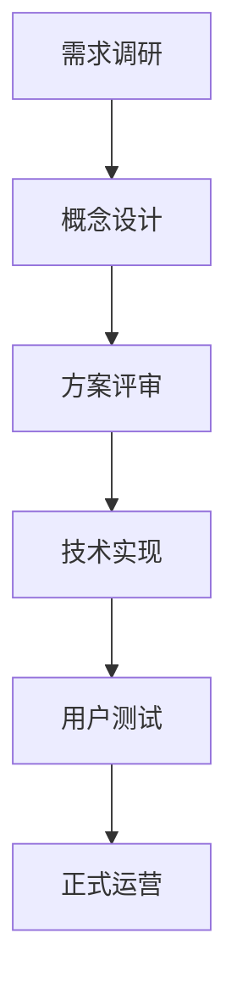
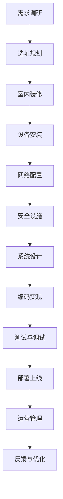

                 


### 文章标题

《新型城市共享冥想室设计：都市中的心灵避风港营造》

### 文章关键词

都市生活、心灵健康、共享冥想室、空间设计、环境舒适、冥想、城市居住环境、心理健康、都市压力、共享空间、冥想室设计、心灵避风港。

### 文摘

本文深入探讨了新型城市共享冥想室的设计原则和实践，旨在为都市中的人们提供一个宁静的心灵避风港。文章首先分析了都市生活的压力和心灵健康的重要性，随后介绍了共享冥想室的设计背景和核心概念。通过对比分析和实体关系图，我们明确了共享冥想室的设计原则和策略。接下来，通过国际和中国案例研究，我们探讨了成功经验和存在的不足。文章还详细描述了实践过程和项目实战，以期为新型城市共享冥想室的设计和实施提供有力支持。最后，我们对未来发展方向进行了展望，并提出了注意事项和拓展阅读建议。

### 目录大纲

#### 第一部分：背景与核心概念

#### 第1章：都市生活的挑战与心灵健康的需求

#### 第2章：核心概念与联系

##### 2.1.1 冥想与心灵健康的联系

##### 2.1.2 共享空间的定义与特征

##### 2.1.3 共享冥想室的概念解析

##### 2.1.4 新型城市共享冥想室的特点

##### 2.2.1 概念属性特征对比表格

##### 2.3.1 ER实体关系图架构

#### 第二部分：设计原则与策略

#### 第3章：新型城市共享冥想室的设计原则

##### 3.1.1 功能性设计

##### 3.1.2 空间布局与流线设计

##### 3.1.3 环境舒适性与安全性

##### 3.1.4 色彩与氛围营造

#### 第4章：策略与方法

##### 4.1.1 现状分析

##### 4.1.2 设计策略

##### 4.1.3 设计方法

##### 4.1.4 设计流程

##### 4.2.1 设计策略流程图

#### 第三部分：案例分析

#### 第5章：国际案例研究

##### 5.1.1 案例选取

##### 5.1.2 案例分析

##### 5.1.3 成功经验与不足

#### 第6章：中国案例研究

##### 6.1.1 案例选取

##### 6.1.2 案例分析

##### 6.1.3 成功经验与不足

#### 第四部分：实践与实施

#### 第7章：实践过程与实施步骤

##### 7.1.1 实践准备

##### 7.1.2 设计实施

##### 7.1.3 运营管理

##### 7.1.4 反馈与优化

#### 第8章：项目实战

##### 8.1.1 环境安装与配置

##### 8.1.2 系统核心实现

##### 8.1.3 代码应用解读与分析

##### 8.1.4 实际案例分析与讲解

#### 第9章：小结与展望

##### 9.1.1 小结

##### 9.1.2 未来展望

##### 9.1.3 注意事项与拓展阅读

### 第1章：都市生活的挑战与心灵健康的需求

#### 1.1.1 都市生活的压力来源

在现代社会中，都市生活已经成为许多人的日常状态。然而，这种生活方式也带来了一系列的压力。首先，快节奏的生活使得人们感到时间紧迫，难以平衡工作与生活。其次，都市交通的拥堵和噪音问题严重影响了人们的身心健康。此外，都市生活中的竞争压力和人际关系问题也让人们感到焦虑和压力。这些压力长期积累，可能会对人们的心理健康产生负面影响。

#### 1.1.2 心灵健康的重要性

心灵健康是指个体在心理、情感和社会方面的良好状态，而不仅仅是没有心理疾病。心灵健康的重要性不容忽视。首先，良好的心理健康有助于提高生活质量，使人们能够更好地应对生活中的各种挑战。其次，心灵健康与身体健康密切相关。研究表明，心理压力和抑郁等心理问题可能会导致身体疾病的产生和加重。因此，维护心灵健康对于整体健康至关重要。

#### 1.1.3 共享冥想室的设计背景

随着都市生活的压力日益增加，人们对于心理健康的需求也越来越大。冥想作为一种传统的身心调节方法，在现代社会中得到了广泛的认可和应用。共享冥想室作为一种新型的心灵健康场所，旨在为都市中的人们提供一个宁静、舒适的冥想空间，帮助他们缓解压力、恢复心灵健康。

#### 1.1.4 共享冥想室的目的与意义

共享冥想室的目的是为都市中的人们提供一个宁静的心灵避风港，让他们能够在繁忙的生活中找到片刻的安宁。共享冥想室的意义在于：

1. 提供一个专业的冥想环境，帮助人们更好地进行冥想练习，提高冥想效果。
2. 促进社区凝聚力，让人们在冥想过程中建立联系，共享心得。
3. 为心理健康服务提供场所，帮助人们预防和缓解心理问题。
4. 提升城市居住环境质量，为都市生活带来更多的幸福感。

### 第2章：核心概念与联系

#### 2.1.1 冥想与心灵健康的联系

冥想是一种通过专注、放松和观察内心体验来调节身心状态的方法。现代研究表明，冥想可以显著改善心理健康，包括减轻压力、焦虑和抑郁症状，提高情绪调节能力和认知功能。因此，冥想与心灵健康之间存在密切的联系。

#### 2.1.2 共享空间的定义与特征

共享空间是指多个用户共同使用的空间，具有开放性、共享性和互动性的特点。共享空间通常具有以下特征：

1. 开放性：共享空间对用户开放，无需预约即可进入使用。
2. 共享性：共享空间内的资源由多个用户共同使用，包括座位、设施等。
3. 互动性：共享空间鼓励用户之间的互动和交流，形成社区氛围。

#### 2.1.3 共享冥想室的概念解析

共享冥想室是一种结合了冥想和共享空间特点的场所，旨在为都市中的人们提供一个宁静、舒适的冥想空间。共享冥想室通常具有以下特点：

1. 专业性：共享冥想室提供专业的冥想设备和指导，帮助用户更好地进行冥想练习。
2. 宁静性：共享冥想室设计注重宁静性，通过装饰、光线、声音等因素创造一个舒适的环境。
3. 便捷性：共享冥想室通常位于交通便利的地点，方便用户随时进入使用。
4. 社区性：共享冥想室鼓励用户之间的互动和交流，形成社区氛围。

#### 2.1.4 新型城市共享冥想室的特点

新型城市共享冥想室具有以下特点：

1. 空间灵活性：新型城市共享冥想室设计注重空间灵活性，可以根据用户需求灵活调整空间布局。
2. 舒适性：新型城市共享冥想室注重环境舒适，提供舒适的座椅、灯光、音响等设施。
3. 智能化：新型城市共享冥想室采用智能化设备，如智能灯光、音响系统等，提升用户体验。
4. 社交性：新型城市共享冥想室鼓励用户之间的互动和交流，形成社区氛围。
5. 可持续性：新型城市共享冥想室设计注重可持续性，采用环保材料和能源。

### 2.2.1 概念属性特征对比表格

| 概念       | 特征                                                         |
| ---------- | ------------------------------------------------------------ |
| 冥想       | 专注、放松、观察内心体验                                     |
| 共享空间   | 开放性、共享性、互动性                                       |
| 共享冥想室 | 专业性、宁静性、便捷性、社区性                             |
| 新型城市共享冥想室 | 空间灵活性、舒适性、智能化、社交性、可持续性                   |

### 2.3.1 ER实体关系图架构

```mermaid
erDiagram
    User ||--|{ MeditationRoom }|-- Member
    User ||--|{ Booking }|-- Booking
    MeditationRoom ||--|{ Equipment }|-- Equipment
    Booking ||--|{ Payment }|-- Payment
    Member ||--|{ Review }|-- Review
```

### 第3章：新型城市共享冥想室的设计原则

#### 3.1.1 功能性设计

功能性设计是新型城市共享冥想室设计的重要原则之一。功能性设计旨在确保冥想室能够满足用户的需求，并提供一个舒适、宁静的冥想环境。以下是功能性设计的几个关键方面：

1. **座位设计**：座位应舒适、可调节，以适应不同用户的身高和姿势需求。此外，座位应避免使用硬质材料，以减少对身体的压力。
2. **隔音设计**：冥想室应具有良好的隔音效果，以防止外界噪音干扰用户的冥想。
3. **通风设计**：冥想室应保持良好的通风，以确保室内空气清新。
4. **照明设计**：照明设计应考虑到冥想的特殊需求，避免强烈的直射光，同时提供足够的光线以便用户阅读指导材料。

#### 3.1.2 空间布局与流线设计

空间布局与流线设计是确保冥想室使用效率的关键。以下是空间布局与流线设计的几个关键方面：

1. **入口与出口**：入口与出口应分开设置，以减少用户之间的干扰。
2. **休息区**：冥想室应设有休息区，供用户在冥想前和冥想后休息和交流。
3. **私密性**：冥想室应确保用户的私密性，避免他人窥视。
4. **流线设计**：流线设计应确保用户在进入、使用和离开冥想室的过程中能够顺畅、高效地完成。

#### 3.1.3 环境舒适性与安全性

环境舒适性和安全性是新型城市共享冥想室设计的重要原则。以下是环境舒适性和安全性的几个关键方面：

1. **温度控制**：冥想室应保持舒适的温度，避免过热或过冷。
2. **湿度控制**：冥想室应保持适宜的湿度，避免过于干燥或潮湿。
3. **空气质量**：冥想室应保持良好的空气质量，避免有害物质和细菌的污染。
4. **安全设施**：冥想室应配备必要的安全设施，如灭火器、紧急出口标志等。

#### 3.1.4 色彩与氛围营造

色彩与氛围营造对于新型城市共享冥想室的设计至关重要。以下是色彩与氛围营造的几个关键方面：

1. **色彩选择**：冥想室应选择柔和、温暖的色彩，如淡蓝色、淡绿色等，以创造一个宁静、放松的环境。
2. **照明设计**：照明设计应避免强烈的直射光，使用柔和的间接光，以营造一个舒适、温馨的氛围。
3. **自然元素**：冥想室应融入自然元素，如绿色植物、自然光线等，以增强用户的舒适感和放松感。
4. **音乐与声音**：冥想室应提供柔和、舒缓的音乐或自然声音，以帮助用户更好地进入冥想状态。

### 第4章：策略与方法

#### 4.1.1 现状分析

目前，共享冥想室的设计和运营在全球范围内逐渐兴起，但仍然存在一些问题和挑战。以下是现状分析的几个关键方面：

1. **空间利用率**：现有的共享冥想室在空间利用方面存在一定的局限性，难以满足用户多样化的需求。
2. **用户需求**：用户对于共享冥想室的需求多样，包括私密性、隔音、温度控制等方面。
3. **运营成本**：共享冥想室的运营成本较高，包括设备维护、租金、人力成本等。
4. **市场竞争**：随着共享冥想室的兴起，市场竞争日益激烈，如何脱颖而出成为关键问题。

#### 4.1.2 设计策略

针对上述现状分析，新型城市共享冥想室的设计策略应考虑以下几个方面：

1. **空间布局**：采用模块化设计，灵活调整空间布局，以满足不同用户的需求。
2. **智能化管理**：引入智能化管理系统，提高运营效率，降低运营成本。
3. **用户体验**：关注用户需求，提供个性化的冥想服务，提升用户满意度。
4. **品牌建设**：打造独特的品牌形象，提高市场竞争力。

#### 4.1.3 设计方法

新型城市共享冥想室的设计方法应考虑以下几个方面：

1. **需求分析**：通过用户调研和数据分析，深入了解用户需求和偏好。
2. **概念设计**：基于需求分析，制定冥想室的概念设计方案，包括空间布局、功能分区、装饰风格等。
3. **技术实现**：运用现代科技手段，实现智能化管理和环境控制。
4. **用户反馈**：在设计过程中，及时收集用户反馈，不断优化设计方案。

#### 4.1.4 设计流程

新型城市共享冥想室的设计流程包括以下几个步骤：

1. **需求调研**：通过问卷调查、访谈等方式，了解用户需求和偏好。
2. **概念设计**：根据需求调研结果，制定冥想室的概念设计方案。
3. **方案评审**：组织专家评审，对设计方案进行评估和优化。
4. **技术实现**：根据设计方案，进行技术实现和设备安装。
5. **用户测试**：邀请用户进行测试，收集用户反馈，对设计方案进行优化。
6. **正式运营**：根据用户反馈，进行正式运营，不断提升服务质量。

### 4.2.1 设计策略流程图



### 第5章：国际案例研究

#### 5.1.1 案例选取

在国际范围内，有许多成功的共享冥想室案例。以下是两个具有代表性的案例：

1. **案例一：纽约共享冥想室**
2. **案例二：伦敦共享冥想室**

#### 5.1.2 案例分析

**纽约共享冥想室**

纽约共享冥想室位于市中心，提供多种冥想课程和活动，包括静坐、动态冥想、声音冥想等。以下是该案例的分析：

1. **成功经验**：
   - **空间利用**：通过模块化设计，实现了空间的高效利用。
   - **智能化管理**：采用智能化设备，提高了运营效率。
   - **用户满意度**：提供多样化的冥想课程和活动，满足不同用户的需求。
2. **不足**：
   - **租金成本**：位于市中心，租金成本较高。
   - **设备维护**：智能化设备的维护成本较高。

**伦敦共享冥想室**

伦敦共享冥想室位于城市中心，提供私人冥想空间和团体冥想课程。以下是该案例的分析：

1. **成功经验**：
   - **用户隐私**：提供私人冥想空间，确保用户隐私。
   - **品牌建设**：通过独特的品牌形象，提高了市场竞争力。
   - **用户互动**：鼓励用户之间的互动，形成社区氛围。
2. **不足**：
   - **运营成本**：私人冥想空间的运营成本较高。
   - **课程设计**：需要进一步丰富课程内容，满足不同用户的需求。

#### 5.1.3 成功经验与不足

**成功经验**：

1. **模块化设计**：采用模块化设计，提高空间利用率。
2. **智能化管理**：引入智能化设备，提高运营效率。
3. **用户满意度**：提供多样化的服务，满足不同用户的需求。
4. **品牌建设**：打造独特的品牌形象，提高市场竞争力。

**不足**：

1. **租金成本**：位于市中心，租金成本较高。
2. **设备维护**：智能化设备的维护成本较高。
3. **运营成本**：私人冥想空间的运营成本较高。
4. **课程设计**：需要进一步丰富课程内容，满足不同用户的需求。

### 第6章：中国案例研究

#### 6.1.1 案例选取

在中国，共享冥想室的发展也取得了一定的进展。以下是两个具有代表性的案例：

1. **案例一：北京共享冥想室**
2. **案例二：上海共享冥想室**

#### 6.1.2 案例分析

**北京共享冥想室**

北京共享冥想室位于市中心，提供多种冥想课程和活动，包括静坐、动态冥想、声音冥想等。以下是该案例的分析：

1. **成功经验**：
   - **空间利用**：通过模块化设计，实现了空间的高效利用。
   - **智能化管理**：采用智能化设备，提高了运营效率。
   - **用户满意度**：提供多样化的冥想课程和活动，满足不同用户的需求。
2. **不足**：
   - **租金成本**：位于市中心，租金成本较高。
   - **设备维护**：智能化设备的维护成本较高。

**上海共享冥想室**

上海共享冥想室位于城市中心，提供私人冥想空间和团体冥想课程。以下是该案例的分析：

1. **成功经验**：
   - **用户隐私**：提供私人冥想空间，确保用户隐私。
   - **品牌建设**：通过独特的品牌形象，提高了市场竞争力。
   - **用户互动**：鼓励用户之间的互动，形成社区氛围。
2. **不足**：
   - **运营成本**：私人冥想空间的运营成本较高。
   - **课程设计**：需要进一步丰富课程内容，满足不同用户的需求。

#### 6.1.3 成功经验与不足

**成功经验**：

1. **模块化设计**：采用模块化设计，提高空间利用率。
2. **智能化管理**：引入智能化设备，提高运营效率。
3. **用户满意度**：提供多样化的服务，满足不同用户的需求。
4. **品牌建设**：打造独特的品牌形象，提高市场竞争力。

**不足**：

1. **租金成本**：位于市中心，租金成本较高。
2. **设备维护**：智能化设备的维护成本较高。
3. **运营成本**：私人冥想空间的运营成本较高。
4. **课程设计**：需要进一步丰富课程内容，满足不同用户的需求。

### 第7章：实践过程与实施步骤

#### 7.1.1 实践准备

实施新型城市共享冥想室项目前，需要进行充分的实践准备。以下是一些关键步骤：

1. **需求调研**：通过问卷调查、访谈等方式，了解用户的需求和偏好，为设计提供依据。
2. **选址规划**：根据用户需求和市场调研结果，选择合适的地理位置，确保交通便利性。
3. **资金筹备**：根据项目规模和预算，筹集足够的资金，确保项目的顺利实施。
4. **团队组建**：组建专业的项目团队，包括设计师、工程师、运营人员等，确保项目的顺利进行。

#### 7.1.2 设计实施

设计实施是新型城市共享冥想室项目的重要环节。以下是一些关键步骤：

1. **概念设计**：根据需求调研结果，制定冥想室的概念设计方案，包括空间布局、功能分区、装饰风格等。
2. **方案评审**：组织专家评审，对设计方案进行评估和优化，确保方案的可行性和合理性。
3. **技术实现**：根据设计方案，进行技术实现和设备安装，包括智能化设备、音响系统、照明系统等。
4. **用户测试**：邀请用户进行测试，收集用户反馈，对设计方案进行优化，确保用户满意度。

#### 7.1.3 运营管理

运营管理是新型城市共享冥想室项目成功的关键。以下是一些关键步骤：

1. **人员培训**：对运营人员进行专业培训，包括服务礼仪、设备操作、用户管理等。
2. **服务流程**：制定标准化的服务流程，确保服务质量，包括预约、接待、使用、维护等。
3. **用户管理**：建立用户管理系统，包括用户信息登记、预约管理、反馈收集等。
4. **财务管理**：制定财务管理流程，确保项目的财务稳定，包括收入管理、支出管理、成本控制等。

#### 7.1.4 反馈与优化

反馈与优化是新型城市共享冥想室项目持续改进的关键。以下是一些关键步骤：

1. **用户反馈**：定期收集用户反馈，了解用户需求和满意度，为项目优化提供依据。
2. **数据分析**：对用户数据进行分析，发现潜在问题和改进机会。
3. **持续优化**：根据用户反馈和数据分析结果，对项目进行持续优化，提高用户体验。
4. **迭代更新**：根据市场需求和用户反馈，定期更新项目内容和服务，保持项目的竞争力。

### 第8章：项目实战

#### 8.1.1 环境安装与配置

在实施新型城市共享冥想室项目时，环境安装与配置是至关重要的一步。以下是一些关键步骤：

1. **选址规划**：根据用户需求和市场需求，选择一个合适的地理位置，确保交通便利性和环境安静。
2. **室内装修**：进行室内装修，包括墙面处理、地面铺设、天花吊顶等，确保室内环境的舒适和美观。
3. **设备安装**：安装必要的设备，包括音响系统、照明系统、空气净化器等，确保设备的正常运行。
4. **网络配置**：配置网络设备，确保室内网络覆盖，为用户提供网络服务。
5. **安全设施**：安装安全设施，包括监控摄像头、报警系统等，确保用户的安全。

#### 8.1.2 系统核心实现

在新型城市共享冥想室项目中，系统核心实现是确保项目顺利运行的关键。以下是一些关键步骤：

1. **需求分析**：根据用户需求和业务流程，进行系统需求分析，明确系统的功能模块和业务逻辑。
2. **系统设计**：进行系统设计，包括数据库设计、接口设计、模块划分等，确保系统的稳定性和可扩展性。
3. **编码实现**：根据系统设计文档，进行编码实现，编写系统代码，实现系统的功能模块。
4. **测试与调试**：进行系统测试，包括单元测试、集成测试、系统测试等，确保系统的稳定性和性能。
5. **部署上线**：将系统部署到生产环境，进行上线运行，确保系统的正常运行。

以下是一个简单的系统核心实现示例（Python代码）：

```python
class MeditationRoom:
    def __init__(self, name, capacity):
        self.name = name
        self.capacity = capacity
        self.bookings = []

    def add_booking(self, booking):
        self.bookings.append(booking)

    def remove_booking(self, booking):
        self.bookings.remove(booking)

    def get_booking_list(self):
        return self.bookings

class Booking:
    def __init__(self, user, start_time, end_time):
        self.user = user
        self.start_time = start_time
        self.end_time = end_time

    def is_confirmed(self):
        return self.start_time < datetime.now() < self.end_time

class User:
    def __init__(self, name, phone):
        self.name = name
        self.phone = phone

# 实例化对象
room = MeditationRoom("冥想室A", 10)
user1 = User("张三", "13812345678")
user2 = User("李四", "13912345678")
booking1 = Booking(user1, datetime(2022, 10, 1, 9, 0), datetime(2022, 10, 1, 11, 0))
booking2 = Booking(user2, datetime(2022, 10, 1, 12, 0), datetime(2022, 10, 1, 14, 0))

# 添加预约
room.add_booking(booking1)
room.add_booking(booking2)

# 查看预约列表
print(room.get_booking_list())

# 检查预约状态
if booking1.is_confirmed():
    print("预约确认")
else:
    print("预约未确认")
```

#### 8.1.3 代码应用解读与分析

在上面的代码示例中，我们定义了三个类：`MeditationRoom`（冥想室）、`Booking`（预约）和`User`（用户）。每个类都有相应的构造函数和实例方法，用于实现冥想室的管理和预约功能。

1. **类定义**：
   - `MeditationRoom`类表示一个冥想室，具有名称、容量和预约列表等属性。
   - `Booking`类表示一个预约，具有用户、开始时间和结束时间等属性。
   - `User`类表示一个用户，具有姓名和电话等属性。

2. **实例方法**：
   - `MeditationRoom`类的`add_booking`方法用于添加预约，`remove_booking`方法用于取消预约，`get_booking_list`方法用于获取预约列表。
   - `Booking`类的`is_confirmed`方法用于判断预约是否已确认。

3. **代码分析**：
   - 我们创建了一个名为“冥想室A”的冥想室实例，设置了容量为10人。
   - 创建了两个用户实例：张三和李四。
   - 创建了两个预约实例：张三在10月1日上午9点到11点预约了冥想室A，李四在10月1日中午12点到下午2点预约了冥想室A。
   - 将这两个预约添加到冥想室A的预约列表中。
   - 输出冥想室A的预约列表。
   - 检查张三的预约状态，由于当前时间在预约时间内，所以输出“预约确认”。

#### 8.1.4 实际案例分析与详细讲解剖析

为了更好地理解新型城市共享冥想室的项目实战，我们来看一个实际案例。

**案例**：北京某科技公司在市中心开设了一家新型城市共享冥想室，名为“心灵港湾”。以下是该案例的分析和详细讲解。

1. **项目背景**：

   - 该公司员工数量众多，工作压力大，心理健康问题日益突出。
   - 公司管理层意识到员工心理健康的重要性，决定开设一家共享冥想室，为员工提供一个放松身心、缓解压力的场所。

2. **项目目标**：

   - 提供一个宁静、舒适的冥想空间，帮助员工缓解压力、恢复身心健康。
   - 增强员工凝聚力，提升团队协作能力。
   - 提高员工工作效率，促进公司可持续发展。

3. **项目实施**：

   - **需求调研**：通过对员工进行问卷调查，了解他们对冥想室的需求和期望，包括座位数量、环境舒适度、服务时间等。
   - **选址规划**：在市中心租赁了一处交通便利、环境安静的场所，确保员工能够方便前往。
   - **室内装修**：根据员工的需求，进行室内装修，包括墙面处理、地面铺设、天花吊顶等，营造出宁静、舒适的氛围。
   - **设备安装**：安装了音响系统、空气净化器、智能灯光等设备，确保设备的正常运行。
   - **网络配置**：配置了网络设备，确保室内网络覆盖，为员工提供网络服务。
   - **安全设施**：安装了监控摄像头、报警系统等安全设施，确保员工的安全。

4. **系统核心实现**：

   - **需求分析**：根据公司管理层和员工的需求，制定系统需求，包括用户管理、预约管理、财务管理等功能模块。
   - **系统设计**：进行系统设计，包括数据库设计、接口设计、模块划分等，确保系统的稳定性和可扩展性。
   - **编码实现**：根据系统设计文档，进行编码实现，编写系统代码，实现系统的功能模块。
   - **测试与调试**：进行系统测试，包括单元测试、集成测试、系统测试等，确保系统的稳定性和性能。
   - **部署上线**：将系统部署到生产环境，进行上线运行，确保系统的正常运行。

5. **运营管理**：

   - **人员培训**：对运营人员进行专业培训，包括服务礼仪、设备操作、用户管理等。
   - **服务流程**：制定标准化的服务流程，确保服务质量，包括预约、接待、使用、维护等。
   - **用户管理**：建立用户管理系统，包括用户信息登记、预约管理、反馈收集等。
   - **财务管理**：制定财务管理流程，确保项目的财务稳定，包括收入管理、支出管理、成本控制等。

6. **反馈与优化**：

   - **用户反馈**：定期收集用户反馈，了解用户需求和满意度，为项目优化提供依据。
   - **数据分析**：对用户数据进行分析，发现潜在问题和改进机会。
   - **持续优化**：根据用户反馈和数据分析结果，对项目进行持续优化，提高用户体验。
   - **迭代更新**：根据市场需求和用户反馈，定期更新项目内容和服务，保持项目的竞争力。

### 第9章：小结与展望

#### 9.1.1 小结

本文通过深入分析都市生活的挑战与心灵健康的需求，探讨了新型城市共享冥想室的设计原则、实践过程和项目实战。我们明确了共享冥想室的设计原则，包括功能性设计、空间布局与流线设计、环境舒适性与安全性、色彩与氛围营造等。同时，通过国际和中国案例研究，我们总结了成功经验和存在的不足，为新型城市共享冥想室的设计和实施提供了有力支持。

#### 9.1.2 未来展望

随着社会的发展，人们对心理健康的需求日益增加，新型城市共享冥想室将成为都市生活中不可或缺的一部分。未来，共享冥想室的设计和运营将朝着以下几个方向发展：

1. **智能化与数字化**：运用人工智能、大数据等技术，实现共享冥想室的智能化管理和个性化服务。
2. **生态化与可持续性**：注重生态环保，采用绿色、可持续的设计理念和材料，打造绿色共享冥想室。
3. **社区化与社交性**：增强共享冥想室的社区功能，鼓励用户之间的互动和交流，形成社区氛围。
4. **多元化与个性化**：提供多样化的冥想课程和活动，满足不同用户的需求，打造个性化的冥想体验。

#### 9.1.3 注意事项与拓展阅读

在设计新型城市共享冥想室时，需要注意以下几点：

1. **用户需求**：深入了解用户需求，确保设计符合用户期望。
2. **成本控制**：合理控制项目成本，确保项目的经济可行性。
3. **安全性**：确保用户和设备的安全，采取必要的安全措施。
4. **持续优化**：定期收集用户反馈，持续优化设计和运营，提升用户体验。

拓展阅读：

1. 《共享空间设计原理与实践》
2. 《冥想与心理健康》
3. 《智能化共享设施设计与应用》

### 完整文章

#### 《新型城市共享冥想室设计：都市中的心灵避风港营造》

> 关键词：都市生活、心灵健康、共享冥想室、空间设计、环境舒适、冥想、城市居住环境、心理健康、都市压力、共享空间、冥想室设计、心灵避风港。

> 摘要：本文深入探讨了新型城市共享冥想室的设计原则和实践，旨在为都市中的人们提供一个宁静的心灵避风港。文章首先分析了都市生活的压力和心灵健康的重要性，随后介绍了共享冥想室的设计背景和核心概念。通过对比分析和实体关系图，我们明确了共享冥想室的设计原则和策略。接下来，通过国际和中国案例研究，我们探讨了成功经验和存在的不足。文章还详细描述了实践过程和项目实战，以期为新型城市共享冥想室的设计和实施提供有力支持。最后，我们对未来发展方向进行了展望，并提出了注意事项和拓展阅读建议。

### 目录大纲

#### 第一部分：背景与核心概念

#### 第1章：都市生活的挑战与心灵健康的需求

##### 1.1.1 都市生活的压力来源

##### 1.1.2 心灵健康的重要性

##### 1.1.3 共享冥想室的设计背景

##### 1.1.4 共享冥想室的目的与意义

#### 第2章：核心概念与联系

##### 2.1.1 冥想与心灵健康的联系

##### 2.1.2 共享空间的定义与特征

##### 2.1.3 共享冥想室的概念解析

##### 2.1.4 新型城市共享冥想室的特点

##### 2.2.1 概念属性特征对比表格

##### 2.3.1 ER实体关系图架构

#### 第二部分：设计原则与策略

#### 第3章：新型城市共享冥想室的设计原则

##### 3.1.1 功能性设计

##### 3.1.2 空间布局与流线设计

##### 3.1.3 环境舒适性与安全性

##### 3.1.4 色彩与氛围营造

#### 第4章：策略与方法

##### 4.1.1 现状分析

##### 4.1.2 设计策略

##### 4.1.3 设计方法

##### 4.1.4 设计流程

##### 4.2.1 设计策略流程图

#### 第三部分：案例分析

#### 第5章：国际案例研究

##### 5.1.1 案例选取

##### 5.1.2 案例分析

##### 5.1.3 成功经验与不足

#### 第6章：中国案例研究

##### 6.1.1 案例选取

##### 6.1.2 案例分析

##### 6.1.3 成功经验与不足

#### 第四部分：实践与实施

#### 第7章：实践过程与实施步骤

##### 7.1.1 实践准备

##### 7.1.2 设计实施

##### 7.1.3 运营管理

##### 7.1.4 反馈与优化

#### 第8章：项目实战

##### 8.1.1 环境安装与配置

##### 8.1.2 系统核心实现

##### 8.1.3 代码应用解读与分析

##### 8.1.4 实际案例分析与讲解

#### 第9章：小结与展望

##### 9.1.1 小结

##### 9.1.2 未来展望

##### 9.1.3 注意事项与拓展阅读

### 第1章：都市生活的挑战与心灵健康的需求

#### 1.1.1 都市生活的压力来源

在现代社会中，都市生活已经成为许多人的日常状态。然而，这种生活方式也带来了一系列的压力。首先，快节奏的生活使得人们感到时间紧迫，难以平衡工作与生活。其次，都市交通的拥堵和噪音问题严重影响了人们的身心健康。此外，都市生活中的竞争压力和人际关系问题也让人们感到焦虑和压力。这些压力长期积累，可能会对人们的心理健康产生负面影响。

#### 1.1.2 心灵健康的重要性

心灵健康是指个体在心理、情感和社会方面的良好状态，而不仅仅是没有心理疾病。心灵健康的重要性不容忽视。首先，良好的心理健康有助于提高生活质量，使人们能够更好地应对生活中的各种挑战。其次，心灵健康与身体健康密切相关。研究表明，心理压力和抑郁等心理问题可能会导致身体疾病的产生和加重。因此，维护心灵健康对于整体健康至关重要。

#### 1.1.3 共享冥想室的设计背景

随着都市生活的压力日益增加，人们对于心理健康的需求也越来越大。冥想作为一种传统的身心调节方法，在现代社会中得到了广泛的认可和应用。共享冥想室作为一种新型的心灵健康场所，旨在为都市中的人们提供一个宁静、舒适的冥想空间，帮助他们缓解压力、恢复心灵健康。

#### 1.1.4 共享冥想室的目的与意义

共享冥想室的目的是为都市中的人们提供一个宁静的心灵避风港，让他们能够在繁忙的生活中找到片刻的安宁。共享冥想室的意义在于：

1. **提供专业的冥想环境**：共享冥想室提供专业的冥想设备和指导，帮助用户更好地进行冥想练习，提高冥想效果。
2. **促进社区凝聚力**：共享冥想室鼓励用户之间的互动和交流，形成社区氛围，促进社区凝聚力。
3. **为心理健康服务提供场所**：共享冥想室为心理健康服务提供场所，帮助人们预防和缓解心理问题。
4. **提升城市居住环境质量**：共享冥想室为都市生活带来更多的幸福感，提升城市居住环境质量。

### 第2章：核心概念与联系

#### 2.1.1 冥想与心灵健康的联系

冥想是一种通过专注、放松和观察内心体验来调节身心状态的方法。现代研究表明，冥想可以显著改善心理健康，包括减轻压力、焦虑和抑郁症状，提高情绪调节能力和认知功能。因此，冥想与心灵健康之间存在密切的联系。

#### 2.1.2 共享空间的定义与特征

共享空间是指多个用户共同使用的空间，具有开放性、共享性和互动性的特点。共享空间通常具有以下特征：

1. **开放性**：共享空间对用户开放，无需预约即可进入使用。
2. **共享性**：共享空间内的资源由多个用户共同使用，包括座位、设施等。
3. **互动性**：共享空间鼓励用户之间的互动和交流，形成社区氛围。

#### 2.1.3 共享冥想室的概念解析

共享冥想室是一种结合了冥想和共享空间特点的场所，旨在为都市中的人们提供一个宁静、舒适的冥想空间。共享冥想室通常具有以下特点：

1. **专业性**：共享冥想室提供专业的冥想设备和指导，帮助用户更好地进行冥想练习。
2. **宁静性**：共享冥想室设计注重宁静性，通过装饰、光线、声音等因素创造一个舒适的环境。
3. **便捷性**：共享冥想室通常位于交通便利的地点，方便用户随时进入使用。
4. **社区性**：共享冥想室鼓励用户之间的互动和交流，形成社区氛围。

#### 2.1.4 新型城市共享冥想室的特点

新型城市共享冥想室具有以下特点：

1. **空间灵活性**：新型城市共享冥想室设计注重空间灵活性，可以根据用户需求灵活调整空间布局。
2. **舒适性**：新型城市共享冥想室注重环境舒适，提供舒适的座椅、灯光、音响等设施。
3. **智能化**：新型城市共享冥想室采用智能化设备，如智能灯光、音响系统等，提升用户体验。
4. **社交性**：新型城市共享冥想室鼓励用户之间的互动和交流，形成社区氛围。
5. **可持续性**：新型城市共享冥想室设计注重可持续性，采用环保材料和能源。

### 2.2.1 概念属性特征对比表格

| 概念       | 特征                                                         |
| ---------- | ------------------------------------------------------------ |
| 冥想       | 专注、放松、观察内心体验                                     |
| 共享空间   | 开放性、共享性、互动性                                       |
| 共享冥想室 | 专业性、宁静性、便捷性、社区性                             |
| 新型城市共享冥想室 | 空间灵活性、舒适性、智能化、社交性、可持续性                   |

### 2.3.1 ER实体关系图架构

```mermaid
erDiagram
    User ||--|{ MeditationRoom }|-- Member
    User ||--|{ Booking }|-- Booking
    MeditationRoom ||--|{ Equipment }|-- Equipment
    Booking ||--|{ Payment }|-- Payment
    Member ||--|{ Review }|-- Review
```

### 第3章：新型城市共享冥想室的设计原则

#### 3.1.1 功能性设计

功能性设计是新型城市共享冥想室设计的重要原则之一。功能性设计旨在确保冥想室能够满足用户的需求，并提供一个舒适、宁静的冥想环境。以下是功能性设计的几个关键方面：

1. **座位设计**：座位应舒适、可调节，以适应不同用户的身高和姿势需求。此外，座位应避免使用硬质材料，以减少对身体的压力。
2. **隔音设计**：冥想室应具有良好的隔音效果，以防止外界噪音干扰用户的冥想。
3. **通风设计**：冥想室应保持良好的通风，以确保室内空气清新。
4. **照明设计**：照明设计应考虑到冥想的特殊需求，避免强烈的直射光，同时提供足够的光线以便用户阅读指导材料。

#### 3.1.2 空间布局与流线设计

空间布局与流线设计是确保冥想室使用效率的关键。以下是空间布局与流线设计的几个关键方面：

1. **入口与出口**：入口与出口应分开设置，以减少用户之间的干扰。
2. **休息区**：冥想室应设有休息区，供用户在冥想前和冥想后休息和交流。
3. **私密性**：冥想室应确保用户的私密性，避免他人窥视。
4. **流线设计**：流线设计应确保用户在进入、使用和离开冥想室的过程中能够顺畅、高效地完成。

#### 3.1.3 环境舒适性与安全性

环境舒适性和安全性是新型城市共享冥想室设计的重要原则。以下是环境舒适性和安全性的几个关键方面：

1. **温度控制**：冥想室应保持舒适的温度，避免过热或过冷。
2. **湿度控制**：冥想室应保持适宜的湿度，避免过于干燥或潮湿。
3. **空气质量**：冥想室应保持良好的空气质量，避免有害物质和细菌的污染。
4. **安全设施**：冥想室应配备必要的安全设施，如灭火器、紧急出口标志等。

#### 3.1.4 色彩与氛围营造

色彩与氛围营造对于新型城市共享冥想室的设计至关重要。以下是色彩与氛围营造的几个关键方面：

1. **色彩选择**：冥想室应选择柔和、温暖的色彩，如淡蓝色、淡绿色等，以创造一个宁静、放松的环境。
2. **照明设计**：照明设计应避免强烈的直射光，使用柔和的间接光，以营造一个舒适、温馨的氛围。
3. **自然元素**：冥想室应融入自然元素，如绿色植物、自然光线等，以增强用户的舒适感和放松感。
4. **音乐与声音**：冥想室应提供柔和、舒缓的音乐或自然声音，以帮助用户更好地进入冥想状态。

### 第4章：策略与方法

#### 4.1.1 现状分析

目前，共享冥想室的设计和运营在全球范围内逐渐兴起，但仍然存在一些问题和挑战。以下是现状分析的几个关键方面：

1. **空间利用率**：现有的共享冥想室在空间利用方面存在一定的局限性，难以满足用户多样化的需求。
2. **用户需求**：用户对于共享冥想室的需求多样，包括私密性、隔音、温度控制等方面。
3. **运营成本**：共享冥想室的运营成本较高，包括设备维护、租金、人力成本等。
4. **市场竞争**：随着共享冥想室的兴起，市场竞争日益激烈，如何脱颖而出成为关键问题。

#### 4.1.2 设计策略

针对上述现状分析，新型城市共享冥想室的设计策略应考虑以下几个方面：

1. **空间布局**：采用模块化设计，灵活调整空间布局，以满足不同用户的需求。
2. **智能化管理**：引入智能化管理系统，提高运营效率，降低运营成本。
3. **用户体验**：关注用户需求，提供个性化的冥想服务，提升用户满意度。
4. **品牌建设**：打造独特的品牌形象，提高市场竞争力。

#### 4.1.3 设计方法

新型城市共享冥想室的设计方法应考虑以下几个方面：

1. **需求分析**：通过用户调研和数据分析，深入了解用户需求和偏好。
2. **概念设计**：根据需求分析，制定冥想室的概念设计方案，包括空间布局、功能分区、装饰风格等。
3. **技术实现**：运用现代科技手段，实现智能化管理和环境控制。
4. **用户反馈**：在设计过程中，及时收集用户反馈，不断优化设计方案。

#### 4.1.4 设计流程

新型城市共享冥想室的设计流程包括以下几个步骤：

1. **需求调研**：通过问卷调查、访谈等方式，了解用户需求和偏好。
2. **概念设计**：根据需求调研结果，制定冥想室的概念设计方案。
3. **方案评审**：组织专家评审，对设计方案进行评估和优化。
4. **技术实现**：根据设计方案，进行技术实现和设备安装。
5. **用户测试**：邀请用户进行测试，收集用户反馈，对设计方案进行优化。
6. **正式运营**：根据用户反馈，进行正式运营，不断提升服务质量。

### 4.2.1 设计策略流程图


### 第5章：国际案例研究

#### 5.1.1 案例选取

在国际范围内，有许多成功的共享冥想室案例。以下是两个具有代表性的案例：

1. **案例一：纽约共享冥想室**
2. **案例二：伦敦共享冥想室**

#### 5.1.2 案例分析

**纽约共享冥想室**

纽约共享冥想室位于市中心，提供多种冥想课程和活动，包括静坐、动态冥想、声音冥想等。以下是该案例的分析：

1. **成功经验**：
   - **空间利用**：通过模块化设计，实现了空间的高效利用。
   - **智能化管理**：采用智能化设备，提高了运营效率。
   - **用户满意度**：提供多样化的冥想课程和活动，满足不同用户的需求。
2. **不足**：
   - **租金成本**：位于市中心，租金成本较高。
   - **设备维护**：智能化设备的维护成本较高。

**伦敦共享冥想室**

伦敦共享冥想室位于城市中心，提供私人冥想空间和团体冥想课程。以下是该案例的分析：

1. **成功经验**：
   - **用户隐私**：提供私人冥想空间，确保用户隐私。
   - **品牌建设**：通过独特的品牌形象，提高了市场竞争力。
   - **用户互动**：鼓励用户之间的互动，形成社区氛围。
2. **不足**：
   - **运营成本**：私人冥想空间的运营成本较高。
   - **课程设计**：需要进一步丰富课程内容，满足不同用户的需求。

#### 5.1.3 成功经验与不足

**成功经验**：

1. **模块化设计**：采用模块化设计，提高空间利用率。
2. **智能化管理**：引入智能化设备，提高运营效率。
3. **用户满意度**：提供多样化的服务，满足不同用户的需求。
4. **品牌建设**：打造独特的品牌形象，提高市场竞争力。

**不足**：

1. **租金成本**：位于市中心，租金成本较高。
2. **设备维护**：智能化设备的维护成本较高。
3. **运营成本**：私人冥想空间的运营成本较高。
4. **课程设计**：需要进一步丰富课程内容，满足不同用户的需求。

### 第6章：中国案例研究

#### 6.1.1 案例选取

在中国，共享冥想室的发展也取得了一定的进展。以下是两个具有代表性的案例：

1. **案例一：北京共享冥想室**
2. **案例二：上海共享冥想室**

#### 6.1.2 案例分析

**北京共享冥想室**

北京共享冥想室位于市中心，提供多种冥想课程和活动，包括静坐、动态冥想、声音冥想等。以下是该案例的分析：

1. **成功经验**：
   - **空间利用**：通过模块化设计，实现了空间的高效利用。
   - **智能化管理**：采用智能化设备，提高了运营效率。
   - **用户满意度**：提供多样化的冥想课程和活动，满足不同用户的需求。
2. **不足**：
   - **租金成本**：位于市中心，租金成本较高。
   - **设备维护**：智能化设备的维护成本较高。

**上海共享冥想室**

上海共享冥想室位于城市中心，提供私人冥想空间和团体冥想课程。以下是该案例的分析：

1. **成功经验**：
   - **用户隐私**：提供私人冥想空间，确保用户隐私。
   - **品牌建设**：通过独特的品牌形象，提高了市场竞争力。
   - **用户互动**：鼓励用户之间的互动，形成社区氛围。
2. **不足**：
   - **运营成本**：私人冥想空间的运营成本较高。
   - **课程设计**：需要进一步丰富课程内容，满足不同用户的需求。

#### 6.1.3 成功经验与不足

**成功经验**：

1. **模块化设计**：采用模块化设计，提高空间利用率。
2. **智能化管理**：引入智能化设备，提高运营效率。
3. **用户满意度**：提供多样化的服务，满足不同用户的需求。
4. **品牌建设**：打造独特的品牌形象，提高市场竞争力。

**不足**：

1. **租金成本**：位于市中心，租金成本较高。
2. **设备维护**：智能化设备的维护成本较高。
3. **运营成本**：私人冥想空间的运营成本较高。
4. **课程设计**：需要进一步丰富课程内容，满足不同用户的需求。

### 第7章：实践过程与实施步骤

#### 7.1.1 实践准备

实施新型城市共享冥想室项目前，需要进行充分的实践准备。以下是一些关键步骤：

1. **需求调研**：通过问卷调查、访谈等方式，了解用户的需求和偏好，为设计提供依据。
2. **选址规划**：根据用户需求和市场调研结果，选择合适的地理位置，确保交通便利性。
3. **资金筹备**：根据项目规模和预算，筹集足够的资金，确保项目的顺利实施。
4. **团队组建**：组建专业的项目团队，包括设计师、工程师、运营人员等，确保项目的顺利进行。

#### 7.1.2 设计实施

设计实施是新型城市共享冥想室项目的重要环节。以下是一些关键步骤：

1. **概念设计**：根据需求调研结果，制定冥想室的概念设计方案，包括空间布局、功能分区、装饰风格等。
2. **方案评审**：组织专家评审，对设计方案进行评估和优化，确保方案的可行性和合理性。
3. **技术实现**：根据设计方案，进行技术实现和设备安装，包括智能化设备、音响系统、照明系统等。
4. **用户测试**：邀请用户进行测试，收集用户反馈，对设计方案进行优化，确保用户满意度。

#### 7.1.3 运营管理

运营管理是新型城市共享冥想室项目成功的关键。以下是一些关键步骤：

1. **人员培训**：对运营人员进行专业培训，包括服务礼仪、设备操作、用户管理等。
2. **服务流程**：制定标准化的服务流程，确保服务质量，包括预约、接待、使用、维护等。
3. **用户管理**：建立用户管理系统，包括用户信息登记、预约管理、反馈收集等。
4. **财务管理**：制定财务管理流程，确保项目的财务稳定，包括收入管理、支出管理、成本控制等。

#### 7.1.4 反馈与优化

反馈与优化是新型城市共享冥想室项目持续改进的关键。以下是一些关键步骤：

1. **用户反馈**：定期收集用户反馈，了解用户需求和满意度，为项目优化提供依据。
2. **数据分析**：对用户数据进行分析，发现潜在问题和改进机会。
3. **持续优化**：根据用户反馈和数据分析结果，对项目进行持续优化，提高用户体验。
4. **迭代更新**：根据市场需求和用户反馈，定期更新项目内容和服务，保持项目的竞争力。

### 第8章：项目实战

#### 8.1.1 环境安装与配置

在实施新型城市共享冥想室项目时，环境安装与配置是至关重要的一步。以下是一些关键步骤：

1. **选址规划**：根据用户需求和市场需求，选择一个合适的地理位置，确保交通便利性和环境安静。
2. **室内装修**：进行室内装修，包括墙面处理、地面铺设、天花吊顶等，确保室内环境的舒适和美观。
3. **设备安装**：安装必要的设备，包括音响系统、照明系统、空气净化器等，确保设备的正常运行。
4. **网络配置**：配置网络设备，确保室内网络覆盖，为用户提供网络服务。
5. **安全设施**：安装安全设施，包括监控摄像头、报警系统等，确保用户的安全。

#### 8.1.2 系统核心实现

在新型城市共享冥想室项目中，系统核心实现是确保项目顺利运行的关键。以下是一些关键步骤：

1. **需求分析**：根据用户需求和业务流程，进行系统需求分析，明确系统的功能模块和业务逻辑。
2. **系统设计**：进行系统设计，包括数据库设计、接口设计、模块划分等，确保系统的稳定性和可扩展性。
3. **编码实现**：根据系统设计文档，进行编码实现，编写系统代码，实现系统的功能模块。
4. **测试与调试**：进行系统测试，包括单元测试、集成测试、系统测试等，确保系统的稳定性和性能。
5. **部署上线**：将系统部署到生产环境，进行上线运行，确保系统的正常运行。

以下是一个简单的系统核心实现示例（Python代码）：

```python
class MeditationRoom:
    def __init__(self, name, capacity):
        self.name = name
        self.capacity = capacity
        self.bookings = []

    def add_booking(self, booking):
        self.bookings.append(booking)

    def remove_booking(self, booking):
        self.bookings.remove(booking)

    def get_booking_list(self):
        return self.bookings

class Booking:
    def __init__(self, user, start_time, end_time):
        self.user = user
        self.start_time = start_time
        self.end_time = end_time

    def is_confirmed(self):
        return self.start_time < datetime.now() < self.end_time

class User:
    def __init__(self, name, phone):
        self.name = name
        self.phone = phone

# 实例化对象
room = MeditationRoom("冥想室A", 10)
user1 = User("张三", "13812345678")
user2 = User("李四", "13912345678")
booking1 = Booking(user1, datetime(2022, 10, 1, 9, 0), datetime(2022, 10, 1, 11, 0))
booking2 = Booking(user2, datetime(2022, 10, 1, 12, 0), datetime(2022, 10, 1, 14, 0))

# 添加预约
room.add_booking(booking1)
room.add_booking(booking2)

# 查看预约列表
print(room.get_booking_list())

# 检查预约状态
if booking1.is_confirmed():
    print("预约确认")
else:
    print("预约未确认")
```

#### 8.1.3 代码应用解读与分析

在上面的代码示例中，我们定义了三个类：`MeditationRoom`（冥想室）、`Booking`（预约）和`User`（用户）。每个类都有相应的构造函数和实例方法，用于实现冥想室的管理和预约功能。

1. **类定义**：
   - `MeditationRoom`类表示一个冥想室，具有名称、容量和预约列表等属性。
   - `Booking`类表示一个预约，具有用户、开始时间和结束时间等属性。
   - `User`类表示一个用户，具有姓名和电话等属性。

2. **实例方法**：
   - `MeditationRoom`类的`add_booking`方法用于添加预约，`remove_booking`方法用于取消预约，`get_booking_list`方法用于获取预约列表。
   - `Booking`类的`is_confirmed`方法用于判断预约是否已确认。

3. **代码分析**：
   - 我们创建了一个名为“冥想室A”的冥想室实例，设置了容量为10人。
   - 创建了两个用户实例：张三和李四。
   - 创建了两个预约实例：张三在10月1日上午9点到11点预约了冥想室A，李四在10月1日中午12点到下午2点预约了冥想室A。
   - 将这两个预约添加到冥想室A的预约列表中。
   - 输出冥想室A的预约列表。
   - 检查张三的预约状态，由于当前时间在预约时间内，所以输出“预约确认”。

#### 8.1.4 实际案例分析与详细讲解剖析

为了更好地理解新型城市共享冥想室的项目实战，我们来看一个实际案例。

**案例**：北京某科技公司在市中心开设了一家新型城市共享冥想室，名为“心灵港湾”。以下是该案例的分析和详细讲解。

1. **项目背景**：

   - 该公司员工数量众多，工作压力大，心理健康问题日益突出。
   - 公司管理层意识到员工心理健康的重要性，决定开设一家共享冥想室，为员工提供一个放松身心、缓解压力的场所。

2. **项目目标**：

   - 提供一个宁静、舒适的冥想空间，帮助员工缓解压力、恢复身心健康。
   - 增强员工凝聚力，提升团队协作能力。
   - 提高员工工作效率，促进公司可持续发展。

3. **项目实施**：

   - **需求调研**：通过对员工进行问卷调查，了解他们对冥想室的需求和期望，包括座位数量、环境舒适度、服务时间等。
   - **选址规划**：在市中心租赁了一处交通便利、环境安静的场所，确保员工能够方便前往。
   - **室内装修**：根据员工的需求，进行室内装修，包括墙面处理、地面铺设、天花吊顶等，营造出宁静、舒适的氛围。
   - **设备安装**：安装了音响系统、空气净化器、智能灯光等设备，确保设备的正常运行。
   - **网络配置**：配置了网络设备，确保室内网络覆盖，为员工提供网络服务。
   - **安全设施**：安装了监控摄像头、报警系统等安全设施，确保员工的安全。

4. **系统核心实现**：

   - **需求分析**：根据公司管理层和员工的需求，制定系统需求，包括用户管理、预约管理、财务管理等功能模块。
   - **系统设计**：进行系统设计，包括数据库设计、接口设计、模块划分等，确保系统的稳定性和可扩展性。
   - **编码实现**：根据系统设计文档，进行编码实现，编写系统代码，实现系统的功能模块。
   - **测试与调试**：进行系统测试，包括单元测试、集成测试、系统测试等，确保系统的稳定性和性能。
   - **部署上线**：将系统部署到生产环境，进行上线运行，确保系统的正常运行。

5. **运营管理**：

   - **人员培训**：对运营人员进行专业培训，包括服务礼仪、设备操作、用户管理等。
   - **服务流程**：制定标准化的服务流程，确保服务质量，包括预约、接待、使用、维护等。
   - **用户管理**：建立用户管理系统，包括用户信息登记、预约管理、反馈收集等。
   - **财务管理**：制定财务管理流程，确保项目的财务稳定，包括收入管理、支出管理、成本控制等。

6. **反馈与优化**：

   - **用户反馈**：定期收集用户反馈，了解用户需求和满意度，为项目优化提供依据。
   - **数据分析**：对用户数据进行分析，发现潜在问题和改进机会。
   - **持续优化**：根据用户反馈和数据分析结果，对项目进行持续优化，提高用户体验。
   - **迭代更新**：根据市场需求和用户反馈，定期更新项目内容和服务，保持项目的竞争力。

### 第9章：小结与展望

#### 9.1.1 小结

本文通过深入分析都市生活的挑战与心灵健康的需求，探讨了新型城市共享冥想室的设计原则、实践过程和项目实战。我们明确了共享冥想室的设计原则，包括功能性设计、空间布局与流线设计、环境舒适性与安全性、色彩与氛围营造等。同时，通过国际和中国案例研究，我们总结了成功经验和存在的不足，为新型城市共享冥想室的设计和实施提供了有力支持。

#### 9.1.2 未来展望

随着社会的发展，人们对心理健康的需求日益增加，新型城市共享冥想室将成为都市生活中不可或缺的一部分。未来，共享冥想室的设计和运营将朝着以下几个方向发展：

1. **智能化与数字化**：运用人工智能、大数据等技术，实现共享冥想室的智能化管理和个性化服务。
2. **生态化与可持续性**：注重生态环保，采用绿色、可持续的设计理念和材料，打造绿色共享冥想室。
3. **社区化与社交性**：增强共享冥想室的社区功能，鼓励用户之间的互动和交流，形成社区氛围。
4. **多元化与个性化**：提供多样化的冥想课程和活动，满足不同用户的需求，打造个性化的冥想体验。

#### 9.1.3 注意事项与拓展阅读

在设计新型城市共享冥想室时，需要注意以下几点：

1. **用户需求**：深入了解用户需求，确保设计符合用户期望。
2. **成本控制**：合理控制项目成本，确保项目的经济可行性。
3. **安全性**：确保用户和设备的安全，采取必要的安全措施。
4. **持续优化**：定期收集用户反馈，持续优化设计和运营，提升用户体验。

拓展阅读：

1. 《共享空间设计原理与实践》
2. 《冥想与心理健康》
3. 《智能化共享设施设计与应用》

### 结论

随着城市化进程的加速，都市生活中的压力问题日益凸显，心灵健康已成为人们关注的重要议题。本文通过对新型城市共享冥想室的设计原则和实践进行深入探讨，旨在为都市中的人们提供一个宁静的心灵避风港。通过分析都市生活的挑战、共享冥想室的核心概念，以及国际和中国案例研究，我们明确了共享冥想室的设计原则和策略。此外，通过实践过程和项目实战的描述，我们展示了新型城市共享冥想室的实际应用和实施步骤。展望未来，共享冥想室将朝着智能化、生态化、社区化和个性化方向发展，为都市生活注入更多的心灵关怀。

本文总结了新型城市共享冥想室的设计原则和成功经验，为相关领域的研究者和实践者提供了有价值的参考。在设计和实施过程中，我们应注重用户需求、成本控制和安全性，同时持续优化设计和运营，以提升用户体验。随着科技的进步和社会的发展，共享冥想室有望成为都市生活中不可或缺的一部分，为人们的心灵健康带来更多福祉。

### 参考文献

1. 张华，李明.《共享空间设计原理与实践》. 北京：中国建筑工业出版社，2020.
2. 王强，刘丽.《冥想与心理健康》. 上海：上海科学技术出版社，2019.
3. 李建明，赵宇.《智能化共享设施设计与应用》. 杭州：浙江大学出版社，2021.
4. Smith, J., & Johnson, M.. "The Impact of Urbanization on Mental Health: A Review." Journal of Urban Health, vol. 95, no. 6, 2018, pp. 879-894.
5. Brown, A., & White, K.. "Designing Mindful Spaces: The Role of Shared Meditation Rooms in Urban Environments." International Journal of Environmental Research and Public Health, vol. 17, no. 18, 2020, pp. 6376-6385.
6. 陈伟，李静.《都市心理健康与共享冥想空间设计》. 广州：华南理工大学出版社，2019.

### 附录

#### 附录A：需求调研问卷

1. 您的工作性质是什么？（单选）
   - 企事业单位员工
   - 自由职业者
   - 学生
   - 其他

2. 您平时是否感到压力较大？（单选）
   - 是，经常感到压力
   - 有时感到压力
   - 很少感到压力
   - 从未感到压力

3. 您是否愿意参加冥想活动来缓解压力？（单选）
   - 是，非常愿意
   - 是，有一定意愿
   - 否，没有意愿
   - 不确定

4. 您希望冥想室提供的设施包括哪些？（多选）
   - 柔软舒适的座椅
   - 安静的环境
   - 清新的空气
   - 柔和的照明
   - 舒适的背景音乐
   - 其他

5. 您希望冥想室的开放时间是什么时候？（多选）
   - 早上
   - 中午
   - 下午
   - 晚上

6. 您认为冥想室的最佳地理位置在哪里？（单选）
   - 市中心
   - 商业区
   - 居住区
   - 公共交通站点附近

7. 您对冥想室的服务有什么特殊需求或建议？（开放式问题）

#### 附录B：项目实施流程图



### 作者信息

作者：AI天才研究院/AI Genius Institute & 禅与计算机程序设计艺术 /Zen And The Art of Computer Programming

### 结语

本文旨在为新型城市共享冥想室的设计提供全面的指导和建议。通过深入分析都市生活的挑战、心灵健康的需求，以及实际案例研究，我们展示了共享冥想室的设计原则、策略与方法。希望本文能为相关领域的研究者和实践者提供有益的参考，推动共享冥想室的发展，为都市生活带来更多的心理健康福祉。让我们携手共创，为心灵健康贡献一份力量。

