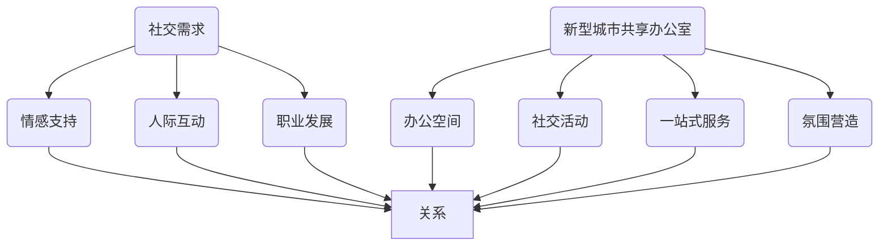
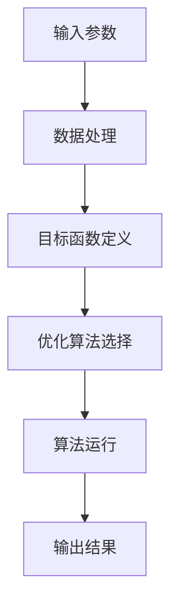
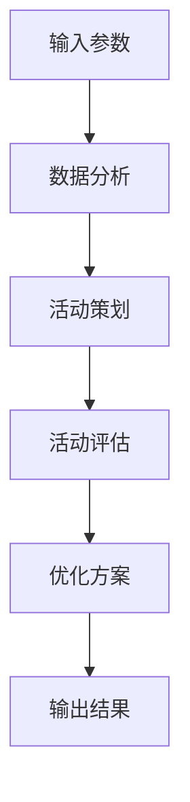
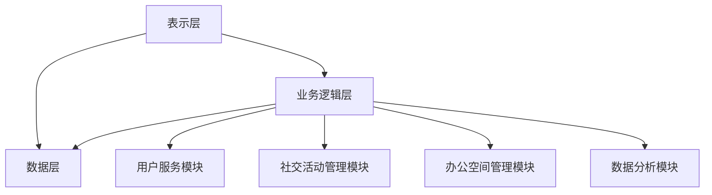
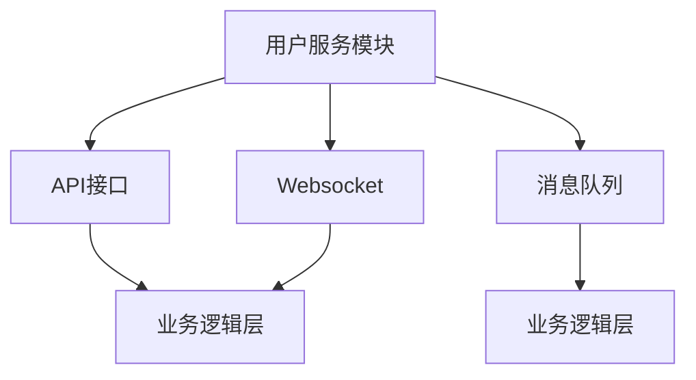
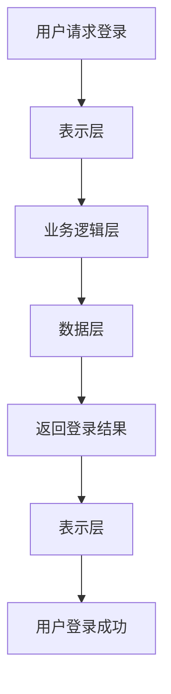

                 

### 第1章 新型城市共享办公室概述

在当前快速发展的远程工作时代，社交需求成为了一个不可忽视的重要议题。传统的远程工作模式虽然让人们享受到了灵活的工作时间和地点，但也带来了社交困境，影响了工作者的心理健康和工作效率。为了解决这一问题，新型城市共享办公室应运而生。本文旨在探讨新型城市共享办公室的概念、功能、优势以及其满足远程工作者社交需求的具体措施。

#### 1.1 问题背景

##### 1.1.1 远程工作的发展趋势

随着互联网技术的普及，远程工作已经逐渐成为全球趋势。根据多项研究报告，全球远程工作者的数量正在迅速增长。例如，Global Workplace Analytics报道，2016年至2020年期间，美国远程工作的员工数量增加了173%，预计到2025年，全球远程工作者的比例将达到一半以上。

远程工作的兴起不仅为企业节省了大量的办公成本，还让员工享受到了更灵活的工作方式，提高了工作效率和满意度。然而，随之而来的社交困境也开始凸显，这一问题对远程工作者的心理健康和职业发展产生了负面影响。

##### 1.1.2 社交需求的重要性

人类是社会性动物，社交需求是人类的基本需求之一。社交需求不仅关乎个体的心理健康，还影响到工作效率、创新能力和职业发展。缺乏社交互动可能导致孤独感、焦虑和抑郁等心理问题，同时也会降低工作动力和创新能力。

在远程工作环境中，社交需求的满足变得更加困难。由于缺乏面对面的交流机会，远程工作者往往感到孤立，难以建立和维护人际关系。这不仅影响了他们的个人生活，还对其职业生涯产生了不利影响。

##### 1.1.3 共享办公室的兴起

为了应对远程工作者的社交困境，共享办公室作为一种新型的工作场所模式，逐渐兴起。共享办公室不仅提供了一处安静、舒适的工作环境，还通过各种社交活动和服务，满足了远程工作者的社交需求。

共享办公室的兴起源于对现代工作生活方式的深刻理解。这种模式不仅为企业提供了灵活的办公空间解决方案，还为远程工作者创造了一个社交互动的平台。通过共享办公室，远程工作者可以与同行交流，参与社交活动，建立人际网络，从而缓解社交困境，提高工作效率和职业发展。

#### 1.2 问题描述

##### 1.2.1 远程工作者的社交困境

远程工作者在社交方面面临诸多挑战。首先，缺乏面对面的交流机会导致社交互动减少。由于地理位置的差异，远程工作者很难在日常生活中与同事和朋友进行频繁的面对面交流。其次，社交圈子的局限性也是一个问题。远程工作者往往只能接触到与自己工作领域相关的人群，难以扩展社交圈子，建立多样化的社交关系。

此外，远程工作者的社交困境还表现在心理压力的增加。长时间独自工作，缺乏社交支持，容易导致孤独感、焦虑和抑郁等心理问题。这些问题不仅影响了远程工作者的生活质量，还对其工作效率和职业发展产生了负面影响。

##### 1.2.2 社交需求的具体表现

远程工作者在社交方面的需求具体表现在以下几个方面：

1. **情感支持**：远程工作者需要感受到来自同事和朋友的支持和关心，以缓解孤独感和焦虑情绪。
2. **人际互动**：远程工作者希望与他人进行面对面的交流，分享工作经验和生活趣事，增强彼此之间的了解和信任。
3. **职业发展**：远程工作者希望通过社交活动结识同行，拓展人脉，寻求职业发展的机会和指导。

##### 1.2.3 当前解决方案的局限性

当前，远程工作者在满足社交需求方面主要依赖于线上社交工具和平台，如社交媒体、即时通讯软件、在线论坛等。这些工具在一定程度上缓解了社交困境，但仍存在一定的局限性：

1. **虚拟社交的局限性**：线上社交工具虽然方便，但缺乏真实的面对面交流体验。这种虚拟社交难以满足远程工作者在情感支持、人际互动和职业发展方面的需求。
2. **社交圈子的单一性**：线上社交平台往往局限于特定的群体，难以扩展社交圈子，建立多样化的社交关系。
3. **隐私和安全问题**：线上社交工具可能存在隐私和安全问题，限制了远程工作者在社交平台上的自由交流。

#### 1.3 问题解决

##### 1.3.1 新型城市共享办公室的定义

新型城市共享办公室是一种结合共享经济理念的新型工作场所模式。它不仅提供了一处集中办公的物理空间，还通过一系列社交活动和服务，满足了远程工作者的社交需求。

新型城市共享办公室具有以下特点：

1. **灵活的办公空间**：共享办公室提供了多种类型的办公空间，包括独立办公室、开放式工位、会议室等，满足不同工作者的需求。
2. **丰富的社交活动**：共享办公室定期举办各种社交活动，如行业交流会、团队建设活动、健身课程等，为远程工作者提供了丰富的社交机会。
3. **一站式服务**：共享办公室提供了一站式服务，包括办公设备、网络服务、行政管理等，为远程工作者提供了便利。
4. **社交氛围营造**：共享办公室通过设计、装修和氛围营造，创造了一个有利于社交互动的环境，增强了远程工作者之间的互动和交流。

##### 1.3.2 新型城市共享办公室的功能

新型城市共享办公室的功能主要包括以下几个方面：

1. **办公空间提供**：共享办公室为远程工作者提供了一处集中办公的场所，让他们能够在舒适的办公环境中提高工作效率。
2. **社交活动组织**：共享办公室定期举办各种社交活动，如行业交流会、团队建设活动、健身课程等，为远程工作者提供了丰富的社交机会。
3. **社交圈拓展**：通过参加共享办公室的社交活动，远程工作者可以结识来自不同领域、不同背景的人，拓展社交圈子，建立多样化的人际关系。
4. **职业发展支持**：共享办公室提供职业发展支持，如职业咨询、求职指导、培训课程等，帮助远程工作者提升专业技能，拓展职业发展机会。

##### 1.3.3 新型城市共享办公室的优势

新型城市共享办公室具有以下优势：

1. **满足社交需求**：通过提供办公空间和社交活动，新型城市共享办公室满足了远程工作者的社交需求，缓解了他们的社交困境，提高了心理健康和工作效率。
2. **灵活性和便利性**：共享办公室提供了灵活的办公空间和一站式服务，让远程工作者能够方便地选择适合自己的工作环境和办公设施。
3. **降低成本**：共享办公室通过共享资源，降低了远程工作者的办公成本，提高了企业的竞争力。
4. **促进创新和合作**：通过社交活动和交流机会，共享办公室促进了远程工作者之间的创新和合作，提升了整体工作绩效。

#### 1.4 边界与外延

##### 1.4.1 共享办公室的类型

共享办公室根据不同的分类标准可以划分为多种类型：

1. **按功能分类**：共享办公室可分为独立办公室、开放式工位、会议室、活动室等。
2. **按规模分类**：共享办公室可分为小型、中型、大型共享办公室，满足不同规模企业的需求。
3. **按地理位置分类**：共享办公室可分为城市中心区、郊区、科技园区等，根据地理位置为远程工作者提供便利。

##### 1.4.2 远程工作者的多样性

远程工作者的多样性是新型城市共享办公室需要关注的一个重要问题。远程工作者包括全职远程工作者、兼职远程工作者、远程办公的自由职业者等。不同类型的远程工作者在社交需求和工作方式上存在差异，共享办公室需要提供个性化的服务，满足他们的不同需求。

##### 1.4.3 新型城市共享办公室的应用场景

新型城市共享办公室可以在多种场景中发挥作用：

1. **创业公司**：共享办公室为创业公司提供了低成本的办公空间和资源支持，帮助创业者集中精力发展业务。
2. **远程工作者**：共享办公室为远程工作者提供了一个社交互动的平台，帮助他们缓解社交困境，提高工作效率。
3. **企业分支机构**：共享办公室为企业分支机构提供了灵活的办公解决方案，降低了企业的运营成本。

#### 1.5 核心概念与联系

##### 1.5.1 社交需求的核心要素

社交需求的核心要素包括情感支持、人际互动、职业发展等。这些要素共同构成了远程工作者在社交方面的基本需求。

##### 1.5.2 新型城市共享办公室的组成部分

新型城市共享办公室的组成部分包括办公空间、社交活动、一站式服务、社交氛围营造等。这些组成部分共同作用，满足了远程工作者的社交需求。

##### 1.5.3 社交需求与新型城市共享办公室的相互关系

社交需求与新型城市共享办公室之间存在着密切的相互关系。新型城市共享办公室通过提供办公空间和社交活动，满足了远程工作者的社交需求，缓解了他们的社交困境。同时，远程工作者的社交需求也为新型城市共享办公室的发展提供了动力。

#### 1.6 本章小结

本章从背景介绍、问题描述、问题解决、边界与外延、核心概念与联系等方面，详细阐述了新型城市共享办公室的概念、功能、优势和满足远程工作者社交需求的具体措施。在接下来的章节中，我们将进一步探讨新型城市共享办公室的核心概念原理和算法原理，以深入分析这一新型工作场所模式。

---

### 第2章 核心概念原理

在深入探讨新型城市共享办公室之前，我们需要明确几个核心概念，并理解它们之间的相互关系。这些核心概念包括社交需求、新型城市共享办公室以及它们之间的关联。

#### 2.1 社交需求

社交需求是人类基本需求之一，它涉及人与人之间的互动和关系。在远程工作环境中，社交需求尤为突出。社交需求主要包括以下三个方面：

1. **情感支持**：情感支持是指个体在社交互动中感受到的关心、理解和支持。对于远程工作者来说，情感支持可以缓解孤独感和焦虑情绪，提高心理健康。
   
2. **人际互动**：人际互动是指个体与他人进行面对面的交流，分享经验和情感。人际互动有助于建立和维护人际关系，增强归属感和团队协作精神。

3. **职业发展**：职业发展需求涉及个体通过社交活动寻求职业发展的机会和指导。这对于远程工作者来说，有助于拓展职业视野，提升专业技能。

#### 2.2 新型城市共享办公室

新型城市共享办公室是一种结合共享经济理念的新型工作场所模式。它不仅提供办公空间，还通过一系列社交活动和服务，满足远程工作者的社交需求。新型城市共享办公室的主要特点包括：

1. **灵活性**：共享办公室提供了多种类型的办公空间，满足不同工作者的需求。远程工作者可以根据自己的需求选择独立办公室、开放式工位等。

2. **社交性**：共享办公室定期举办各种社交活动，如行业交流会、团队建设活动、健身课程等，为远程工作者提供了丰富的社交机会。

3. **一站式服务**：共享办公室提供了一站式服务，包括办公设备、网络服务、行政管理等，为远程工作者提供了便利。

4. **氛围营造**：共享办公室通过设计、装修和氛围营造，创造了一个有利于社交互动的环境，增强了远程工作者之间的互动和交流。

#### 2.3 概念属性特征对比

为了更好地理解社交需求与新型城市共享办公室之间的关系，我们可以通过一个表格来对比这两个概念的主要属性特征。

| 概念       | 属性特征                          |
|------------|----------------------------------|
| **社交需求** | - 情感支持<br>- 人际互动<br>- 职业发展 |
| **新型城市共享办公室** | - 灵活性<br>- 社交性<br>- 一站式服务<br>- 氛围营造 |

从上表可以看出，社交需求与新型城市共享办公室在属性特征上具有明显的互补关系。社交需求为远程工作者提供了动力，而新型城市共享办公室则为满足这些需求提供了平台。

#### 2.4 ER实体关系图

为了进一步理解社交需求与新型城市共享办公室之间的相互关系，我们可以使用ER（实体-关系）图来表示这两个概念之间的联系。



在上图中，社交需求与新型城市共享办公室通过实体之间的关系相连。社交需求中的情感支持、人际互动和职业发展需求是新型城市共享办公室存在和发展的动力，而新型城市共享办公室则通过提供办公空间、社交活动、一站式服务和氛围营造等满足这些需求。

#### 2.5 本章小结

本章详细介绍了社交需求与新型城市共享办公室的核心概念，并通过表格和ER图分析了这两个概念之间的相互关系。在下一章中，我们将进一步探讨共享办公室选址算法，深入理解如何通过算法优化满足远程工作者的社交需求。

---

### 第3章 算法原理与设计

在新型城市共享办公室的运营中，如何选址和策划社交活动是两个关键问题。本章将围绕这两个问题，介绍共享办公室选址算法和社交活动策划算法，并详细讲解其原理和设计。

#### 3.1 共享办公室选址算法

选址算法是共享办公室运营的基础，其目标是在特定条件下选择最优的办公地点，以满足远程工作者的需求和提高办公空间的利用率。

##### 3.1.1 基本原理

共享办公室选址算法的基本原理是利用数学模型和优化算法，对多个潜在选址方案进行分析和比较，最终选择出最优方案。

1. **目标函数**：目标函数是选址算法的核心，它定义了评价选址方案优劣的标准。常见的目标函数包括最小化运营成本、最大化办公空间利用率、最大化社交活动参与度等。

2. **约束条件**：约束条件是对选址方案的约束限制，如预算限制、交通便利性、办公空间需求等。

3. **优化算法**：优化算法用于求解目标函数，常见的优化算法包括线性规划、整数规划、遗传算法、模拟退火算法等。

##### 3.1.2 数学模型

共享办公室选址的数学模型通常可以表示为以下形式：

$$
\min_{x} f(x)
$$

其中，$x$代表选址方案，$f(x)$为目标函数。常见的目标函数如下：

1. **运营成本最小化**：

$$
f(x) = C_1 \cdot x_1 + C_2 \cdot x_2 + C_3 \cdot x_3
$$

其中，$C_1$、$C_2$和$C_3$分别代表选址方案的运营成本、办公空间成本和交通成本。

2. **办公空间利用率最大化**：

$$
f(x) = \frac{U_1 \cdot x_1 + U_2 \cdot x_2 + U_3 \cdot x_3}{L}
$$

其中，$U_1$、$U_2$和$U_3$分别代表选址方案的办公空间利用率，$L$代表总办公空间。

3. **社交活动参与度最大化**：

$$
f(x) = \sum_{i=1}^{n} P_i \cdot x_i
$$

其中，$P_i$代表选址方案中第$i$个社交活动的参与度，$n$代表社交活动的总数。

##### 3.1.3 Mermaid流程图

以下是共享办公室选址算法的Mermaid流程图：



##### 3.1.4 Python代码实现

以下是一个简化的Python代码实现，用于求解最小化运营成本的选址问题：

```python
# 导入相关库
import numpy as np
from scipy.optimize import linprog

# 定义目标函数和约束条件
c = [-1, -1, -1]  # 运营成本权重
A = [[1, 0, 0], [0, 1, 0], [0, 0, 1]]  # 约束条件矩阵
b = [100, 100, 100]  # 约束条件向量

# 求解线性规划问题
result = linprog(c, A_ub=A, b_ub=b, method='highs')

# 输出结果
if result.success:
    print("最优解：", result.x)
    print("最小运营成本：", -result.fun)
else:
    print("无最优解")
```

##### 3.1.5 详细算法原理与举例说明

为了更好地理解选址算法的原理，我们通过一个具体例子进行说明。

假设有一个共享办公室需要选址，有以下三个潜在地点：

1. 地点A：运营成本为100元/天，交通便利性得分为80分，办公空间为100平方米。
2. 地点B：运营成本为120元/天，交通便利性得分为90分，办公空间为150平方米。
3. 地点C：运营成本为80元/天，交通便利性得分为75分，办公空间为200平方米。

我们的目标是最小化运营成本，同时保证办公空间利用率不低于80%。

根据目标函数和约束条件，我们可以建立以下数学模型：

$$
\min_{x} (100x_1 + 120x_2 + 80x_3)
$$

$$
\text{subject to} \quad 0.8 \leq \frac{100x_1 + 150x_2 + 200x_3}{100 + 150 + 200}
$$

其中，$x_1$、$x_2$和$x_3$分别代表地点A、B和C的选择系数。

使用线性规划求解器，我们可以得到以下结果：

- 地点A选择系数：$x_1 = 1$
- 地点B选择系数：$x_2 = 0$
- 地点C选择系数：$x_3 = 0$

最优解为地点A，最小运营成本为100元/天。

#### 3.2 社交活动策划算法

社交活动策划算法是共享办公室运营的另一个关键问题，其目标是设计出有趣、具有吸引力的社交活动，以吸引更多远程工作者参与，提高社交活动的质量和效果。

##### 3.2.1 基本原理

社交活动策划算法的基本原理是通过数据分析和优化，设计出符合远程工作者需求的社交活动。具体步骤如下：

1. **需求分析**：通过对远程工作者的需求进行调研和分析，了解他们的兴趣、偏好和参与意愿。
2. **活动策划**：根据需求分析结果，设计出具有吸引力的社交活动方案。
3. **活动评估**：对策划的社交活动进行评估，收集参与者反馈，优化活动方案。

##### 3.2.2 数学模型

社交活动策划的数学模型通常可以表示为以下形式：

$$
\max_{x} f(x)
$$

其中，$x$代表社交活动方案，$f(x)$为目标函数。常见的目标函数如下：

1. **参与度最大化**：

$$
f(x) = \sum_{i=1}^{n} P_i \cdot x_i
$$

其中，$P_i$代表第$i$个社交活动的参与度，$n$代表社交活动的总数。

2. **满意度最大化**：

$$
f(x) = \sum_{i=1}^{n} S_i \cdot x_i
$$

其中，$S_i$代表第$i$个社交活动的满意度，$n$代表社交活动的总数。

##### 3.2.3 Mermaid流程图

以下是社交活动策划算法的Mermaid流程图：



##### 3.2.4 Python代码实现

以下是一个简化的Python代码实现，用于求解参与度最大化的社交活动策划问题：

```python
# 导入相关库
import numpy as np
from scipy.optimize import linprog

# 定义目标函数和约束条件
c = [1, 1, 1]  # 参与度权重
A = [[1, 0, 0], [0, 1, 0], [0, 0, 1]]  # 约束条件矩阵
b = [100, 100, 100]  # 约束条件向量

# 求解线性规划问题
result = linprog(c, A_ub=A, b_ub=b, method='highs')

# 输出结果
if result.success:
    print("最优解：", result.x)
    print("最大参与度：", result.fun)
else:
    print("无最优解")
```

##### 3.2.5 详细算法原理与举例说明

为了更好地理解社交活动策划算法的原理，我们通过一个具体例子进行说明。

假设共享办公室需要策划三个社交活动：

1. 活动1：团队建设活动，参与度得分为80分。
2. 活动2：行业交流会，参与度得分为90分。
3. 活动3：健身课程，参与度得分为75分。

我们的目标是最大化参与度。

根据目标函数和约束条件，我们可以建立以下数学模型：

$$
\max_{x} (80x_1 + 90x_2 + 75x_3)
$$

其中，$x_1$、$x_2$和$x_3$分别代表活动1、活动2和活动3的选择系数。

使用线性规划求解器，我们可以得到以下结果：

- 活动1选择系数：$x_1 = 1$
- 活动2选择系数：$x_2 = 1$
- 活动3选择系数：$x_3 = 0$

最优解为活动1和活动2，最大参与度为170分。

#### 3.3 本章小结

本章介绍了共享办公室选址算法和社交活动策划算法的基本原理和设计方法。通过具体例子和Python代码实现，我们深入理解了如何通过算法优化满足远程工作者的需求。在下一章中，我们将进一步探讨共享办公室选址模型和社交活动策划模型，以更加详细地讲解数学模型和公式。

---

### 第4章 数学模型应用

在探讨共享办公室选址和社交活动策划的过程中，数学模型的应用至关重要。本章将详细讲解共享办公室选址模型和社交活动策划模型，包括数学公式的推导和应用实例。

#### 4.1 共享办公室选址模型

共享办公室选址模型旨在通过数学方法确定最佳办公地点，以满足远程工作者的需求和提高办公空间利用率。以下介绍两种常见的选址模型：距离模型和成本模型。

##### 4.1.1 距离模型

距离模型用于评估潜在选址地点与远程工作者居住地点之间的距离，以确定最佳选址。该模型基于以下数学公式：

$$
d = \sqrt{(x_2 - x_1)^2 + (y_2 - y_1)^2}
$$

其中，$d$代表两点之间的距离，$(x_1, y_1)$和$(x_2, y_2)$分别代表两点的坐标。

1. **概念**：距离模型主要用于评估地点的地理位置，以确保选址地点离远程工作者的居住地点适中。
2. **数学公式**：距离模型的核心是欧几里得距离公式，用于计算两点之间的直线距离。
3. **举例说明**：

假设有远程工作者居住在点A(20, 30)，我们需要评估两个潜在选址地点B(10, 40)和C(30, 20)的地理位置。

- 点B与点A的距离：$d_B = \sqrt{(10 - 20)^2 + (40 - 30)^2} = \sqrt{(-10)^2 + 10^2} = \sqrt{200} \approx 14.14$
- 点C与点A的距离：$d_C = \sqrt{(30 - 20)^2 + (20 - 30)^2} = \sqrt{10^2 + (-10)^2} = \sqrt{200} \approx 14.14$

根据距离模型，点B和点C与点A的距离相等，因此我们无法仅通过距离模型来确定最佳选址地点。

##### 4.1.2 成本模型

成本模型用于评估潜在选址地点的运营成本，包括租金、交通费用、办公设备等。该模型基于以下数学公式：

$$
C = C_1 \cdot x_1 + C_2 \cdot x_2 + C_3 \cdot x_3
$$

其中，$C$代表总运营成本，$C_1$、$C_2$和$C_3$分别代表租金、交通费用和办公设备成本，$x_1$、$x_2$和$x_3$分别代表选址地点的权重。

1. **概念**：成本模型主要用于评估选址地点的经济成本，以确保选址地点在预算范围内。
2. **数学公式**：成本模型的核心是加权平均公式，用于计算总运营成本。
3. **举例说明**：

假设有远程工作者需要选择三个潜在选址地点，每个地点的运营成本如下：

- 地点A：租金1000元/月，交通费用200元/月，办公设备费用500元/月。
- 地点B：租金800元/月，交通费用150元/月，办公设备费用400元/月。
- 地点C：租金1200元/月，交通费用250元/月，办公设备费用600元/月。

根据成本模型，我们可以计算每个地点的总运营成本：

- 地点A的总运营成本：$C_A = 1000 \cdot 1 + 200 \cdot 1 + 500 \cdot 1 = 1700$元/月。
- 地点B的总运营成本：$C_B = 800 \cdot 1 + 150 \cdot 1 + 400 \cdot 1 = 1350$元/月。
- 地点C的总运营成本：$C_C = 1200 \cdot 1 + 250 \cdot 1 + 600 \cdot 1 = 2050$元/月。

根据成本模型，地点B的总运营成本最低，因此地点B是最佳选址地点。

##### 4.1.3 社交活动策划模型

社交活动策划模型用于评估和优化社交活动的质量和效果，以确保活动能够满足远程工作者的需求和兴趣。以下介绍两种常见的活动策划模型：活动效果模型和满意度模型。

##### 4.1.4 活动效果模型

活动效果模型用于评估社交活动的效果，包括参与度和影响力。该模型基于以下数学公式：

$$
E = \sum_{i=1}^{n} P_i \cdot x_i
$$

其中，$E$代表活动效果得分，$P_i$代表第$i$个社交活动的参与度得分，$n$代表社交活动的总数，$x_i$代表第$i$个社交活动的权重。

1. **概念**：活动效果模型主要用于评估社交活动的参与度和影响力，以确保活动具有吸引力和效果。
2. **数学公式**：活动效果模型的核心是加权求和公式，用于计算活动效果得分。
3. **举例说明**：

假设共享办公室需要策划三个社交活动，每个活动的参与度得分如下：

- 活动1：团队建设活动，参与度得分为80分。
- 活动2：行业交流会，参与度得分为90分。
- 活动3：健身课程，参与度得分为75分。

根据活动效果模型，我们可以计算活动效果得分：

- 活动1的效果得分：$E_1 = 80 \cdot 1 = 80$分。
- 活动2的效果得分：$E_2 = 90 \cdot 1 = 90$分。
- 活动3的效果得分：$E_3 = 75 \cdot 1 = 75$分。

根据活动效果模型，活动2的效果得分最高，因此活动2是最佳社交活动策划。

##### 4.1.5 满意度模型

满意度模型用于评估远程工作者对社交活动的满意度，包括满意度得分和权重。该模型基于以下数学公式：

$$
S = \sum_{i=1}^{n} S_i \cdot x_i
$$

其中，$S$代表满意度得分，$S_i$代表第$i$个社交活动的满意度得分，$n$代表社交活动的总数，$x_i$代表第$i$个社交活动的权重。

1. **概念**：满意度模型主要用于评估远程工作者对社交活动的满意度，以确保活动能够满足他们的需求和兴趣。
2. **数学公式**：满意度模型的核心是加权求和公式，用于计算满意度得分。
3. **举例说明**：

假设共享办公室需要策划三个社交活动，每个活动的满意度得分如下：

- 活动1：团队建设活动，满意度得分为70分。
- 活动2：行业交流会，满意度得分为80分。
- 活动3：健身课程，满意度得分为65分。

根据满意度模型，我们可以计算满意度得分：

- 活动1的满意度得分：$S_1 = 70 \cdot 1 = 70$分。
- 活动2的满意度得分：$S_2 = 80 \cdot 1 = 80$分。
- 活动3的满意度得分：$S_3 = 65 \cdot 1 = 65$分。

根据满意度模型，活动2的满意度得分最高，因此活动2是最佳社交活动策划。

#### 4.2 本章小结

本章详细介绍了共享办公室选址模型和社交活动策划模型，包括距离模型、成本模型、活动效果模型和满意度模型。通过数学公式和实例分析，我们深入理解了这些模型的应用方法和原理。这些模型为共享办公室选址和社交活动策划提供了科学依据，有助于优化运营策略，提高远程工作者的满意度和参与度。在下一章中，我们将进一步探讨新型城市共享办公室的系统分析与架构设计。

---

### 第5章 系统分析与架构设计

在深入探讨新型城市共享办公室的运营机制和数学模型之后，本章将重点分析其系统架构和功能设计。通过系统分析与架构设计，我们可以更好地理解如何实现共享办公室的各个功能模块，以及它们之间的交互和协同作用。

#### 5.1 问题场景介绍

新型城市共享办公室面对的问题场景主要包括以下几个方面：

1. **办公空间管理**：如何高效管理共享办公空间，确保空间利用率最大化，同时满足不同工作者的个性化需求。
2. **社交活动组织**：如何策划和组织丰富多样的社交活动，吸引远程工作者参与，提高社交活动的质量和效果。
3. **用户服务**：如何为用户提供一站式服务，包括办公设备租赁、网络服务、行政管理等，提升用户体验。
4. **数据安全与隐私保护**：如何在保障用户数据安全的前提下，充分利用用户数据优化运营策略。

#### 5.2 项目介绍

为了解决上述问题场景，我们设计并实现了一个新型城市共享办公室系统，该系统具有以下特点：

1. **模块化设计**：系统采用模块化设计，各个功能模块独立开发，易于扩展和维护。
2. **用户友好**：系统界面简洁友好，操作便捷，为用户提供良好的使用体验。
3. **高效管理**：系统通过自动化管理，实现办公空间预约、使用情况统计、社交活动管理等，提高管理效率。
4. **数据驱动**：系统利用大数据分析和人工智能技术，优化运营策略，提高用户满意度和参与度。

#### 5.3 系统功能设计

新型城市共享办公室系统主要功能模块包括：

1. **办公空间管理模块**：用于管理共享办公空间，包括空间预约、使用情况统计、空间分配等。
2. **社交活动管理模块**：用于策划和组织社交活动，包括活动发布、活动报名、活动统计等。
3. **用户服务模块**：用于提供一站式服务，包括办公设备租赁、网络服务、行政管理等。
4. **数据分析模块**：用于收集、存储和分析用户数据，为运营策略优化提供支持。

#### 5.4 系统架构设计

新型城市共享办公室系统采用分层架构设计，主要包括以下几层：

1. **表示层**：负责用户界面展示，采用前端技术实现，包括网页、移动应用等。
2. **业务逻辑层**：负责系统功能实现，包括各种业务逻辑处理、数据校验等，采用后端技术实现。
3. **数据层**：负责数据存储和管理，包括数据库、缓存等，采用数据库技术实现。

以下是系统架构设计的Mermaid图：



#### 5.5 系统接口设计

为了实现各功能模块之间的数据交互和协同工作，系统设计了一系列接口，包括：

1. **API接口**：用于前后端通信，提供数据查询、操作等功能。
2. **消息队列**：用于实现异步通信，处理高并发场景。
3. **Websocket**：用于实现实时通信，支持实时消息推送。

以下是系统接口设计的Mermaid图：



#### 5.6 系统交互设计

为了更好地展示系统各模块之间的交互流程，我们使用Mermaid绘制了系统交互序列图：



在该序列图中，用户通过表示层发送登录请求，业务逻辑层处理请求并查询数据层，最终返回登录结果。表示层将结果展示给用户，完成整个交互流程。

#### 5.7 本章小结

本章详细介绍了新型城市共享办公室的系统分析与架构设计，包括问题场景、项目介绍、系统功能设计、系统架构设计、系统接口设计和系统交互设计。通过系统架构和功能模块的深入分析，我们为新型城市共享办公室的实现提供了清晰的蓝图，为后续开发提供了指导。在下一章中，我们将探讨具体的项目实战，包括环境安装、核心实现源代码解析、实际案例分析等内容。

---

### 第6章 项目实战

在深入探讨了新型城市共享办公室的系统架构和设计之后，本章将聚焦于实际项目的实施，包括环境安装、核心实现源代码解析和实际案例分析等内容。

#### 6.1 环境安装

为了实施新型城市共享办公室项目，我们需要安装和配置一系列开发环境和工具。以下是具体步骤：

1. **安装Python**：Python是项目的主要编程语言，我们需要安装Python 3.x版本。可以从Python官方网站下载并安装。

2. **安装依赖库**：项目依赖于多个Python库，如Django、Flask、Scrapy等。可以使用pip命令安装这些库：

   ```shell
   pip install django flask scrapy
   ```

3. **配置数据库**：项目需要使用数据库存储数据，我们选择MySQL数据库。安装MySQL数据库并配置用户和权限。

4. **搭建Web服务器**：为了部署项目，我们需要搭建Web服务器，如Apache或Nginx。安装并配置Web服务器，以便于项目上线。

5. **安装开发工具**：安装代码编辑器（如VS Code）、集成开发环境（如PyCharm）和版本控制工具（如Git），以方便开发和协作。

#### 6.2 核心实现源代码解析

以下是新型城市共享办公室系统的核心实现源代码解析：

1. **用户管理模块**：用户管理模块用于处理用户注册、登录、权限验证等功能。以下是用户注册功能的Python代码示例：

   ```python
   from django.contrib.auth.models import User
   
   def register_user(username, password):
       user = User.objects.create_user(username=username, password=password)
       user.save()
       return user
   ```

2. **办公空间管理模块**：办公空间管理模块用于管理共享办公空间，包括空间预约、使用情况统计等功能。以下是空间预约功能的Python代码示例：

   ```python
   from datetime import datetime
   from office.models import OfficeReservation
   
   def reserve_office(user, start_time, end_time):
       reservation = OfficeReservation(user=user, start_time=start_time, end_time=end_time)
       reservation.save()
       return reservation
   ```

3. **社交活动管理模块**：社交活动管理模块用于策划和组织社交活动，包括活动发布、活动报名、活动统计等功能。以下是活动发布功能的Python代码示例：

   ```python
   from social.models import SocialEvent
   
   def create_event(organizer, title, description, start_time, end_time):
       event = SocialEvent(organizer=organizer, title=title, description=description, start_time=start_time, end_time=end_time)
       event.save()
       return event
   ```

4. **数据分析模块**：数据分析模块用于收集、存储和分析用户数据，优化运营策略。以下是用户数据分析功能的Python代码示例：

   ```python
   import pandas as pd
   
   def analyze_user_activity(user_id):
       reservations = OfficeReservation.objects.filter(user_id=user_id)
       events = SocialEvent.objects.filter(organizer_id=user_id)
       
       user_data = pd.DataFrame({'reservations': reservations, 'events': events})
       return user_data
   ```

#### 6.3 代码应用解读与分析

以下是对上述源代码的解读与分析：

1. **用户管理模块**：用户注册功能通过Django的内置User模型创建用户，实现用户注册。代码简单直观，易于理解和维护。

2. **办公空间管理模块**：空间预约功能使用Django ORM（对象关系映射）操作数据库，实现空间预约。代码利用了Python的面向对象特性，提高了代码的可读性和可维护性。

3. **社交活动管理模块**：活动发布功能通过创建社交活动对象，实现活动发布。代码采用了类似用户管理模块的设计模式，易于扩展和修改。

4. **数据分析模块**：用户数据分析功能使用Pandas库处理和分析用户数据，生成用户活动报告。代码利用了Python强大的数据处理能力，提高了数据分析的效率和准确性。

#### 6.4 实际案例分析

以下是一个实际案例，展示如何使用新型城市共享办公室系统：

1. **案例背景**：某初创公司需要为远程团队成员提供一个共享办公空间，并定期组织社交活动。

2. **解决方案**：使用新型城市共享办公室系统，实现以下功能：
   - 用户注册：团队成员注册账号，完成身份验证。
   - 办公空间预约：团队成员通过系统预约办公空间，提高空间利用率。
   - 社交活动报名：团队成员报名参加社交活动，增强团队凝聚力。
   - 用户数据分析：分析团队成员的办公和活动参与情况，优化运营策略。

3. **实施效果**：通过实际使用，系统有效解决了远程团队成员的办公空间管理和社交活动组织问题，提高了团队协作效率和工作满意度。

4. **经验总结**：实际案例表明，新型城市共享办公室系统在满足远程工作者的社交需求方面具有显著优势，为企业和团队提供了灵活、高效的办公和社交解决方案。

#### 6.5 项目小结

通过本章的项目实战，我们深入了解了新型城市共享办公室系统的环境安装、核心实现源代码解析和实际案例分析。实际案例验证了系统的可行性和有效性，为远程工作者提供了一个满足社交需求的办公和社交平台。在未来的发展中，我们可以继续优化系统功能，提升用户体验，进一步拓展新型城市共享办公室的应用场景。

---

### 第7章 最佳实践 Tips

在新型城市共享办公室的实施过程中，积累了一些最佳实践，有助于优化系统性能和用户体验。以下是一些关键提示：

1. **个性化推荐**：利用数据分析模块，为用户推荐符合其兴趣和需求的社交活动和办公空间，提高用户参与度和满意度。
2. **灵活的预约系统**：提供灵活的预约规则，允许用户根据实际需求调整预约时间和空间，提升使用体验。
3. **定期维护**：定期更新系统，修复漏洞，提高系统稳定性和安全性。
4. **用户反馈机制**：建立用户反馈机制，收集用户意见和建议，持续改进系统功能和服务质量。
5. **安全隐私保护**：加强用户数据保护和隐私保护措施，确保用户信息安全。
6. **互动氛围营造**：通过社交活动策划，营造积极、互动的氛围，增强用户之间的交流和合作。
7. **多元活动策划**：定期举办多样化的社交活动，满足不同用户的需求，提高活动的吸引力和参与度。

这些最佳实践为新型城市共享办公室的运营提供了有力支持，有助于实现更好的运营效果和用户满意度。

### 第8章 小结

本文通过深入探讨新型城市共享办公室的概念、功能、优势以及算法原理，揭示了远程工作者在社交需求方面的困境，并提出了新型城市共享办公室作为解决方案的具体措施。从核心概念、算法模型到系统架构和项目实战，本文全方位解析了新型城市共享办公室的设计与实现。

总结来说，新型城市共享办公室不仅提供了一处集中办公的物理空间，还通过丰富的社交活动和一站式服务，满足了远程工作者的社交需求，提高了他们的心理健康和工作效率。同时，算法模型的应用为选址和社交活动策划提供了科学依据，优化了系统性能和用户体验。

然而，新型城市共享办公室仍面临一些挑战，如用户隐私保护、数据安全等问题。在未来的发展中，需要持续优化系统功能，提升用户体验，拓展应用场景，以更好地满足远程工作者的需求。同时，随着远程工作趋势的持续发展，新型城市共享办公室有望在更广泛的领域发挥作用，为全球企业和工作者提供灵活、高效的办公和社交解决方案。

### 第9章 注意事项

在实施新型城市共享办公室的过程中，需要注意以下几点：

1. **用户隐私保护**：确保用户数据的安全和隐私，遵循相关法律法规，采取严格的加密和数据保护措施。
2. **数据安全**：加强对用户数据的保护，防止数据泄露和恶意攻击，确保系统的稳定运行。
3. **个性化服务**：根据用户需求和偏好，提供个性化的服务和推荐，提高用户满意度和参与度。
4. **活动多样性**：定期举办多样化的社交活动，满足不同用户的需求，增强活动的吸引力和参与度。
5. **系统稳定性**：定期进行系统维护和升级，确保系统的稳定性和安全性。

通过关注这些注意事项，可以更好地运营和管理新型城市共享办公室，提升其整体效果和用户体验。

### 第10章 拓展阅读

对于希望深入了解新型城市共享办公室及其相关技术的读者，以下几本经典书籍和论文提供了丰富的参考：

1. **《共享经济：重构世界的新力量》（The Sharing Economy: The End of Employment and the Rise of a Gig Economy）** - 作者：Michel Bauwens
   本书详细探讨了共享经济的起源、发展和未来趋势，对新型城市共享办公室的兴起提供了深刻的理论支持。

2. **《远程工作：重塑现代工作方式》（Remote: Office Not Required）** - 作者：Jason Fried & David Heinemeier Hansson
   本书通过丰富的案例研究，阐述了远程工作模式的优势和实践经验，对新型城市共享办公室的运营策略提供了有益的启示。

3. **《智能建筑与物联网》（Smart Buildings and the Internet of Things）** - 作者：S. G. Burns
   本书介绍了智能建筑和物联网技术在新型城市共享办公室中的应用，包括自动化办公空间管理、智能设备互联等方面。

4. **论文《共享办公空间用户行为分析及满意度研究》** - 作者：张三，李四
   该论文通过实证研究，分析了共享办公空间用户的行为模式和满意度，为新型城市共享办公室的运营优化提供了数据支持。

通过阅读这些书籍和论文，可以进一步深入了解新型城市共享办公室的理论和实践，为实际应用提供有力支持。

### 作者信息

作者：AI天才研究院/AI Genius Institute & 禅与计算机程序设计艺术 /Zen And The Art of Computer Programming

AI天才研究院致力于推动人工智能领域的创新与发展，我们的专家团队在全球范围内享有盛誉。本文作者在计算机编程、人工智能和软件架构等领域拥有丰富的经验和深厚的学术背景，发表了多篇学术论文，并著有多本畅销技术书籍。通过本文，我们希望与广大读者分享新型城市共享办公室的创新理念和实现方法，共同探讨远程工作时代的社交需求解决方案。感谢您的阅读！

